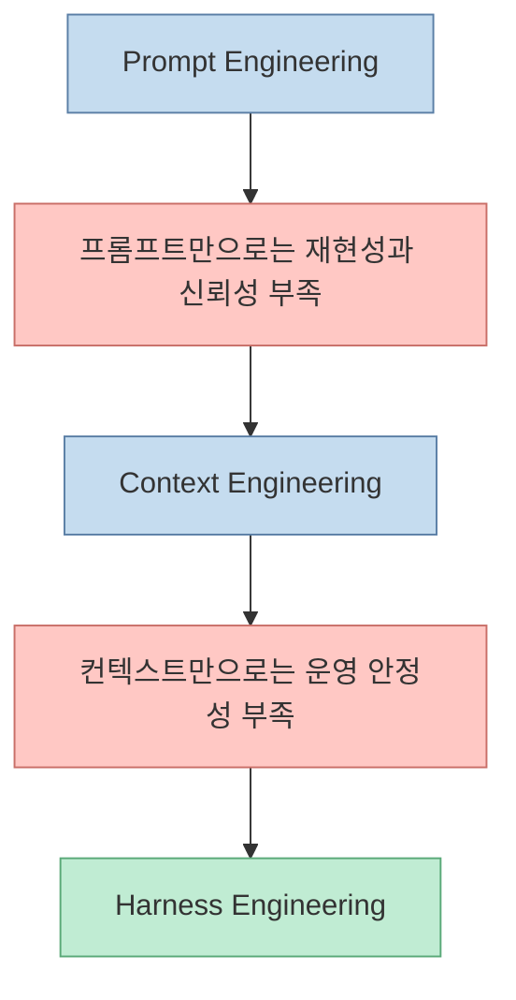
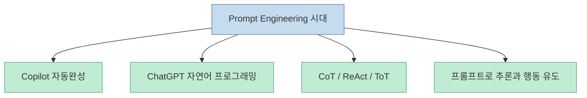
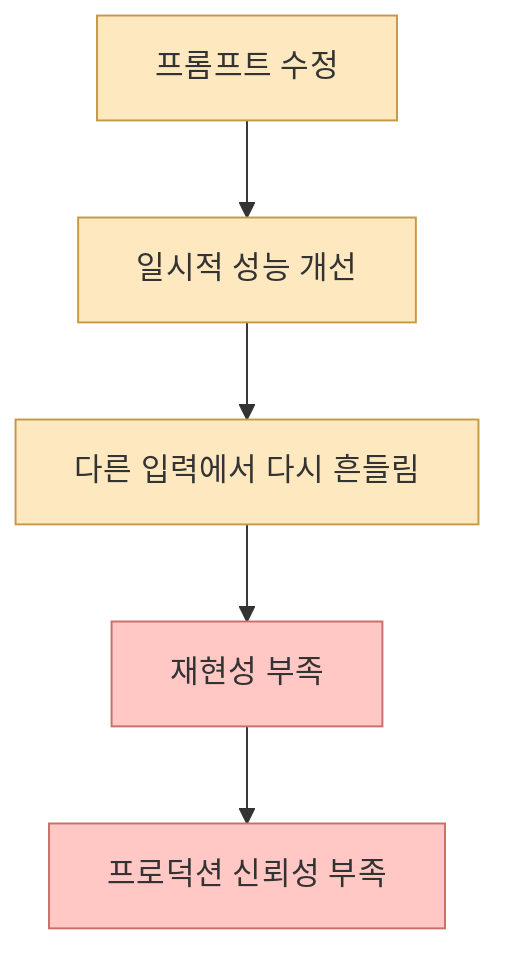
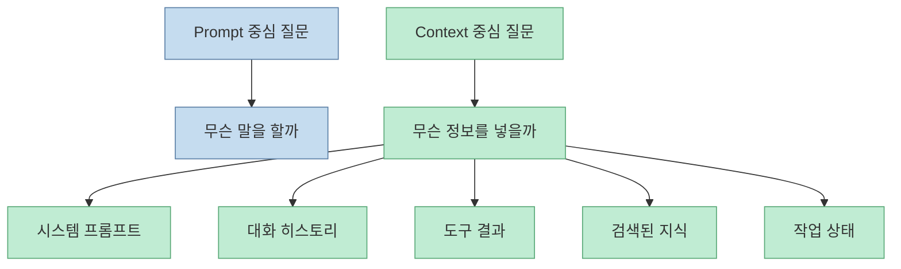
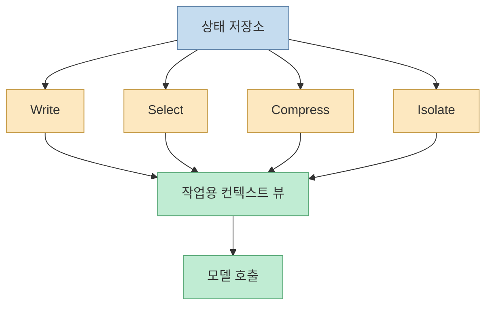
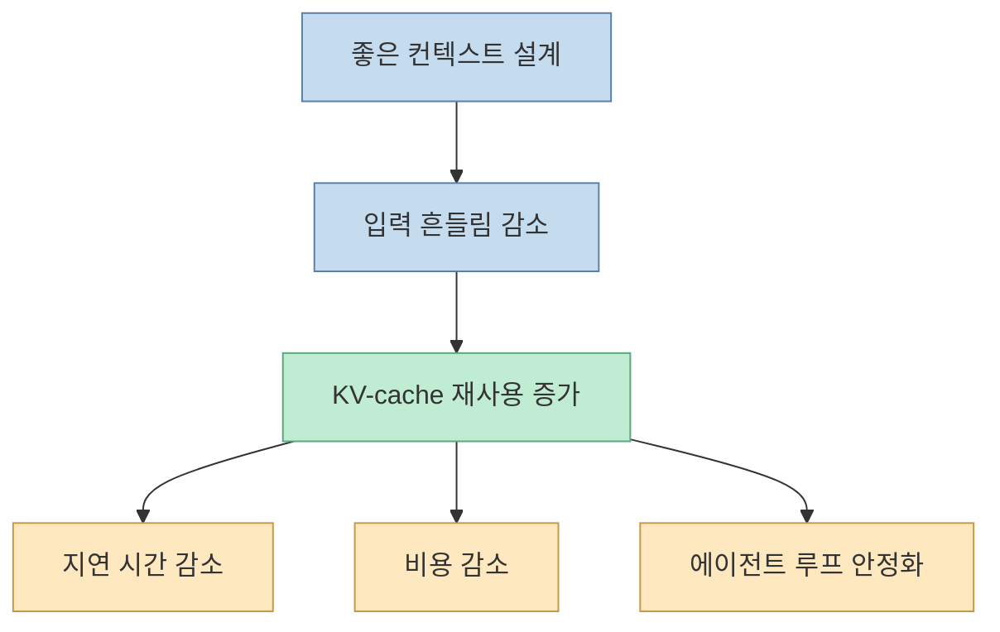
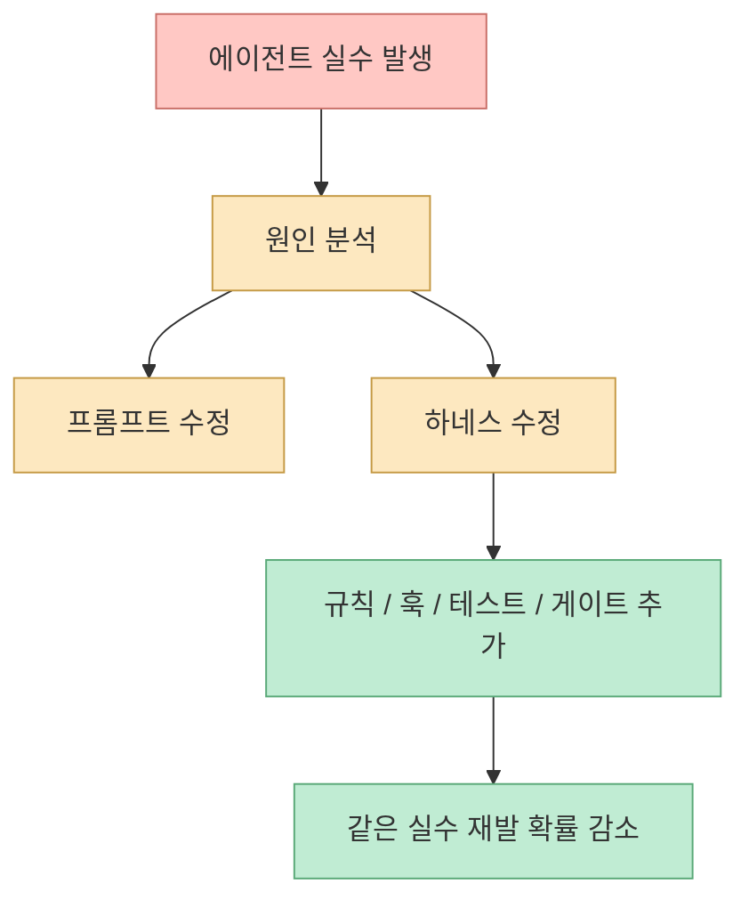
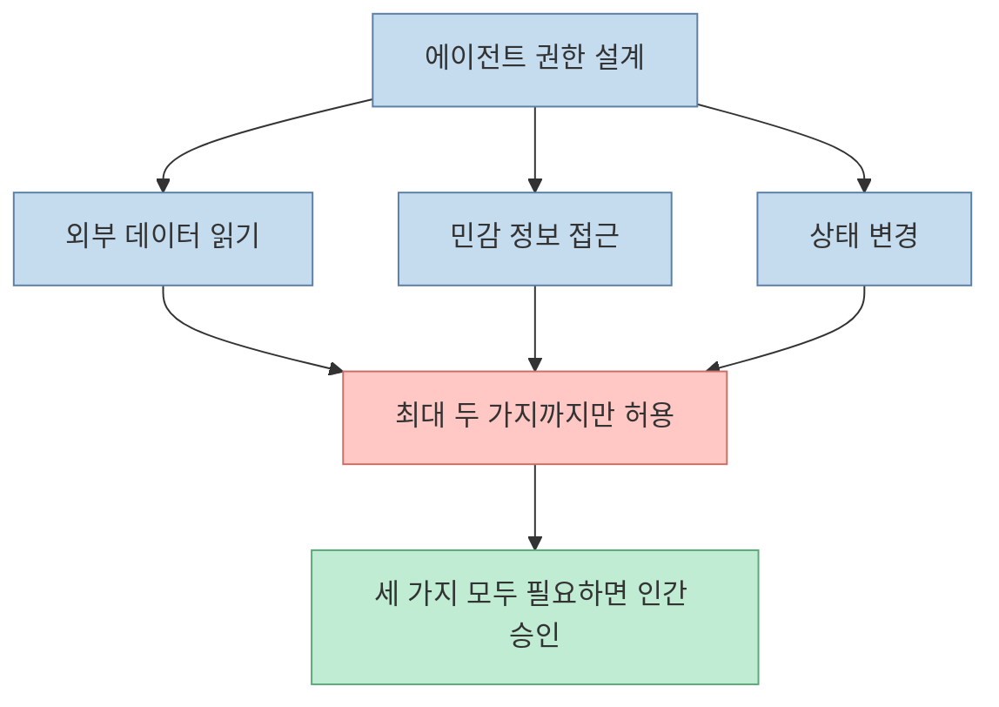
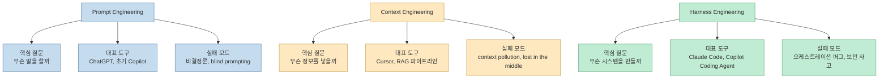

2022년부터 2026년까지 AI 개발의 중심 문장은 세 번 바뀌었습니다. 처음에는 "어떻게 프롬프트를 잘 쓸까"였고, 그다음은 "어떤 정보를 컨텍스트에 넣을까"였고, 지금은 "에이전트를 둘러싼 시스템을 어떻게 설계할까"가 됐습니다. Bits, Bytes & Neural Networks의 글은 이 변화를 단순 유행어 교체가 아니라 **실패한 패러다임의 부검 기록** 으로 읽습니다. 핵심 메시지는 명확합니다. 엔지니어링의 엄밀함은 사라진 것이 아니라, 프롬프트에서 컨텍스트로, 다시 하네스로 이동했습니다. <https://bits-bytes-nn.github.io/insights/agentic-ai/2026/04/05/evolution-of-ai-agentic-patterns.html>

<!--more-->

## Sources

- <https://bits-bytes-nn.github.io/insights/agentic-ai/2026/04/05/evolution-of-ai-agentic-patterns.html>

## 이 글이 중요한 이유는 "무엇이 유행했나"보다 "왜 버려졌나"를 추적하기 때문이다

원문은 2022~2026년을 세 시대로 나눕니다.

- Prompt Engineering
- Context Engineering
- Harness Engineering

그런데 이 분류의 핵심은 이름이 아닙니다. 저자는 각 전환이 "더 나은 마케팅 문구" 때문에 생긴 것이 아니라, **이전 시대가 약속한 문제를 끝까지 해결하지 못했기 때문에** 생겼다고 설명합니다.

즉 이 연대기의 핵심 질문은 "지금 무엇을 써야 하나"가 아니라, **왜 이전 방식으로는 더 이상 버틸 수 없었나** 입니다.

## 1단계는 프롬프트 엔지니어링이었다

원문은 프롬프트 시대의 문을 ChatGPT보다 먼저 GitHub Copilot이 열었다고 봅니다. 초기 Copilot은 현재 파일을 기반으로 다음 줄을 제안하는 구조였고, 2022년의 개발자에게는 그것만으로도 꽤 강력했습니다. 이어서 ChatGPT가 등장하면서 "영어가 새로운 프로그래밍 언어"라는 상상이 폭발했습니다.

학계에서도 같은 시기 프롬프트로 추론을 유도하는 패턴이 빠르게 발전했습니다.

- Chain-of-Thought
- ReAct
- Tree-of-Thought
- Self-Refine
- Reflexion

그리고 2024년 Andrew Ng가 이를 네 가지 agentic design pattern 같은 프레임으로 실무화해 설명했습니다.

이 시기의 믿음은 간단했습니다. **모델에게 더 잘 말하면 더 좋은 결과가 나온다** 는 것입니다.

## 하지만 프롬프트만으로는 엄밀함을 붙잡을 수 없었다

원문은 프롬프트 시대의 한계를 꽤 직설적으로 정리합니다. 문제는 단순한 성능 부족이 아니라 구조적이었습니다.

- 모델은 비결정론적이다
- 같은 의도를 다른 문장으로 써도 결과가 흔들린다
- prompt tweak가 반복될수록 재현 가능한 엔지니어링보다 주술에 가까워진다

CoT나 ReAct 같은 패턴은 분명 진전이었지만, 운영 환경에서는 곧 한계가 드러났습니다. Tree-of-Thought는 비용이 급증했고, self-reflection 계열은 모델이 자기 답안을 자기 수준으로 채점하는 문제를 벗어나지 못했습니다.

결국 엄밀함이 있어야 할 곳은 프롬프트 한 줄 자체가 아니라, **모델이 실제로 소비하는 정보 전체** 라는 깨달음이 오기 시작합니다.

## 2단계는 컨텍스트 엔지니어링이었다

원문은 2025년 6월의 짧은 시기를 전환점으로 봅니다. Tobi Lütke와 Karpathy가 "prompt engineering"보다 "context engineering"이 지금의 핵심 역량을 더 잘 설명한다고 말하면서, 질문 자체가 바뀌었다는 것입니다.

이제 중요한 것은 어떤 말을 하느냐보다:

- 어떤 문서를 넣을지
- 어떤 히스토리를 남길지
- 도구 결과를 어떻게 요약할지
- 어떤 정보를 격리할지

같은 문제였습니다.

이 전환의 배경에는 Cursor 같은 도구의 부상이 있습니다. 원문은 Cursor가 초기 Copilot과 달리 전체 코드베이스, RAG, AST 기반 시맨틱 검색, 멀티파일 편집, Agent Mode를 통해 **현재 파일이 아니라 전체 작업 상태를 다루는 에디터** 로 질문을 바꿨다고 설명합니다.

## 컨텍스트 엔지니어링의 본질은 "많이 넣기"가 아니라 "잘 조립하기"다

원문에서 특히 좋은 부분은 컨텍스트 엔지니어링을 단순한 stuffing으로 오해하지 말라고 짚는 대목입니다. 저자가 소개하는 Anthropic과 Google ADK의 철학은 비슷합니다.

- 원본 상태와 작업용 뷰를 분리한다
- 필요한 정보만 선택한다
- 오래된 히스토리는 압축한다
- 관련 없는 작업은 격리한다

Anthropic의 네 가지 전략으로는 보통 다음이 요약됩니다.

- Write
- Select
- Compress
- Isolate

즉 컨텍스트 엔지니어링은 정보를 많이 넣는 기술이 아니라, **풍부한 상태 시스템에서 그 턴에 필요한 계산용 뷰를 컴파일하는 기술** 에 가깝습니다.

## 여기서 핵심 메트릭이 KV-cache hit rate로 이동한다

원문은 Manus 팀 사례를 인용해, 프로덕션 에이전트의 중요한 단일 메트릭으로 KV-cache hit rate를 강조합니다. 이 포인트는 꽤 실무적입니다. 긴 에이전트 루프에서는 매 턴마다 컨텍스트가 크게 흔들리면 이전 계산을 재활용하기 어렵고, 성능과 비용이 동시에 나빠집니다.

즉 좋은 컨텍스트 엔지니어링은 단순히 정답률을 높이는 것을 넘어:

- 토큰 재사용률을 높이고
- 지연 시간을 줄이고
- 비용을 통제하고
- 상태 일관성을 유지해야 합니다

이 시점에서 엄밀함은 이미 프롬프트 문장 바깥으로 나와, **상태 관리와 컨텍스트 조립 파이프라인** 으로 옮겨갔습니다.

## 그런데 컨텍스트만 잘 짠다고 끝나지 않았다

원문이 보는 세 번째 전환의 배경은 여기입니다. 컨텍스트를 잘 관리해도 여전히 남는 문제가 있었습니다.

- 에이전트가 같은 실수를 반복한다
- 도구 사용 순서와 제약이 중요하다
- 외부 시스템을 건드리는 순간 보안과 승인 문제가 생긴다
- 멀티에이전트, 장기 실행, 테스트 루프는 컨텍스트만으로 통제되지 않는다

즉 "무슨 정보를 넣을까"로는 해결되지 않는 **운영 시스템의 문제** 가 남아 있었습니다.

## 3단계는 하네스 엔지니어링이다

원문은 2026년 2월 Mitchell Hashimoto의 문장을 기원처럼 다룹니다. 에이전트가 실수할 때마다 프롬프트를 고치지 말고, **그 실수가 구조적으로 재발하지 않도록 시스템을 바꾸라** 는 생각입니다.

이게 바로 하네스 엔지니어링입니다. 초점은 이제 모델 바깥으로 완전히 이동합니다.

- 규칙
- 도구 접근 제약
- 승인 게이트
- 테스트 루프
- 리트라이 정책
- 샌드박스
- 평가 기준

이 관점에서는 Claude Code, Copilot Coding Agent 같은 현대 도구의 진짜 경쟁력도 모델 IQ보다는 **도구 루프와 제약 시스템을 얼마나 잘 설계했는가** 에 달려 있습니다.

## 하네스의 핵심은 "에이전트가 뭘 할 수 있나"보다 "어디까지 하게 둘 것인가"다

원문 후반은 agentic infrastructure와 guardrail 이야기에 많은 비중을 둡니다. 특히 Meta AI의 Rule of Two처럼, 외부 데이터 읽기·민감정보 접근·상태 변경 중 세 가지를 동시에 허용하지 말라는 규칙은 기능 제한이 아니라 **신뢰성 설계** 로 설명됩니다.

즉 하네스 엔지니어링은 모델을 더 자유롭게 만드는 것이 아니라, 오히려:

- 위험한 조합을 제한하고
- 사람 승인을 명시적으로 끼워 넣고
- 에이전트가 잘하는 범위만 자동화하는 구조를 만듭니다

이 지점에서 엄밀함은 더 이상 프롬프트나 컨텍스트 조립만의 문제가 아니라, **전체 시스템 아키텍처와 운영 안전장치** 의 문제가 됩니다.

## 세 시대를 한 줄씩 비교하면 이렇다

원문이 제시한 비교를 실무적으로 다시 풀면 다음과 같습니다.

결국 질문이 점점 위로 올라갑니다.

- 문장
- 정보
- 시스템

그리고 엄밀함도 그에 맞춰 더 높은 추상화 계층으로 올라갑니다.

## 핵심 요약

- 2022~2026년 AI 에이전틱 패턴은 Prompt Engineering, Context Engineering, Harness Engineering으로 세 번 이동했다
- 이 전환은 유행이 아니라, 이전 패러다임의 구조적 한계가 만든 강제 진화였다
- 프롬프트 시대의 핵심 문제는 비결정론과 재현성 부족이었다
- 컨텍스트 시대는 상태와 정보를 잘 조립하는 방향으로 엄밀함을 옮겼고, KV-cache 같은 운영 메트릭이 중요해졌다
- 하네스 시대는 규칙, 테스트, 게이트, 권한 제어 같은 시스템 설계가 핵심이 됐다
- 따라서 지금의 경쟁력은 "프롬프트를 얼마나 잘 쓰는가"보다 "에이전트를 둘러싼 시스템을 얼마나 잘 설계하는가"에 있다

## 결론

이 글이 설득력 있는 이유는 새로운 유행어를 하나 더 밀기 때문이 아닙니다. 오히려 각 유행어가 **왜 오래 버티지 못했는지** 를 차분하게 보여 주기 때문입니다.

지금 우리가 보는 AI 개발의 변화는 "프롬프트 엔지니어링이 틀렸다"는 이야기가 아닙니다. 더 정확히 말하면, 프롬프트만으로는 부족했고, 컨텍스트만으로도 부족했으며, 그래서 결국 **하네스라는 더 큰 시스템 설계 문제** 로 올라왔다는 이야기입니다.

앞으로도 이름은 또 바뀔 수 있습니다. 하지만 원문의 가장 중요한 통찰은 아마 이 문장으로 남을 것입니다.

**엔지니어링의 엄밀함은 사라지지 않는다. 더 높은 층으로 이동할 뿐이다.**
