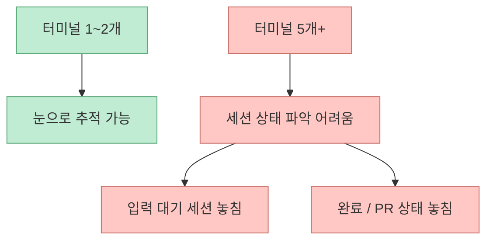
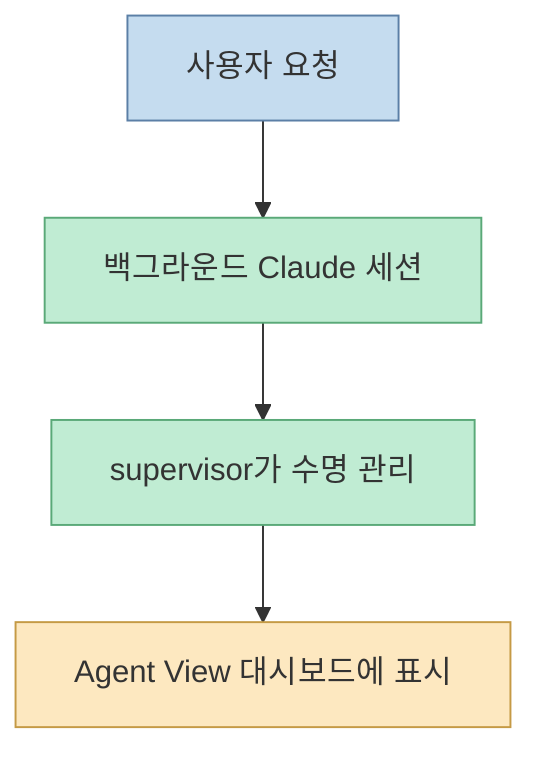
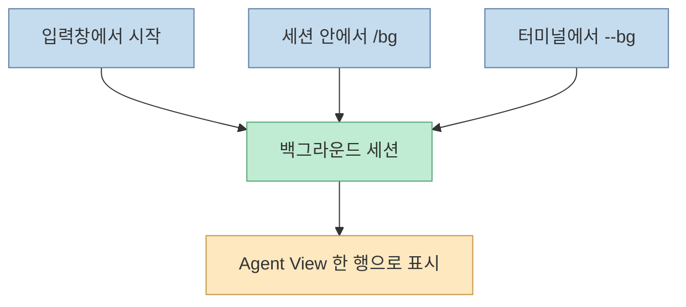
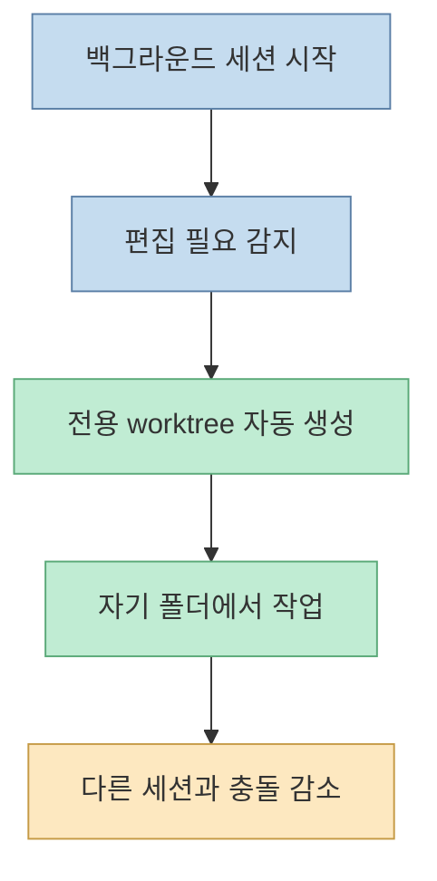
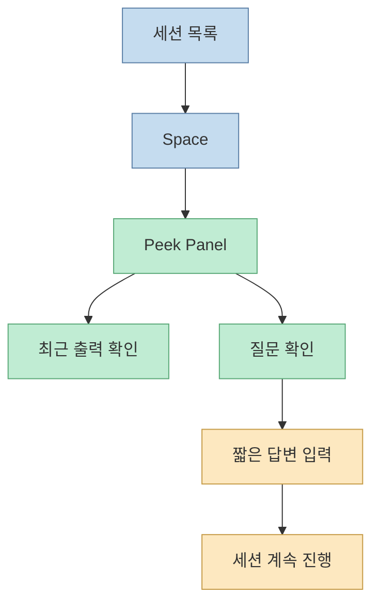
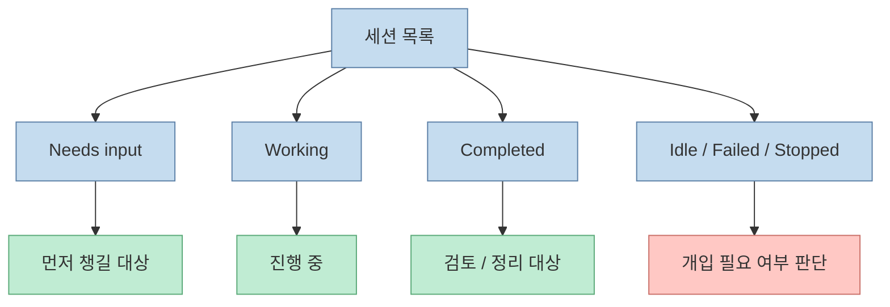
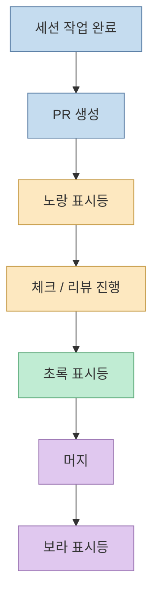
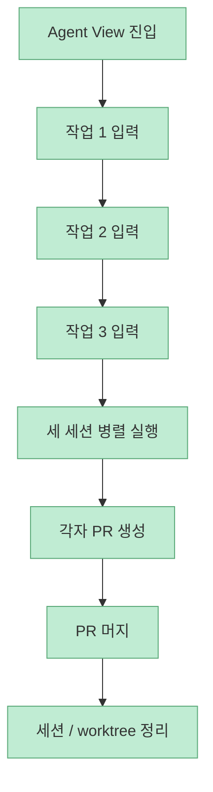

Claude Code에서 병렬 작업의 첫 단계는 여러 세션을 띄우는 것입니다. 하지만 실제 병목은 그다음에 옵니다. 터미널이 2개에서 5개로 늘어나면 어떤 세션이 입력을 기다리는지, 어느 PR이 열렸는지, 어느 작업부터 챙겨야 하는지가 금방 흐려집니다. Claude Hunt의 Agent View 문서는 바로 이 운영 문제를 다룹니다. `claude agents` 는 단순히 세션을 더 많이 여는 기능이 아니라, **백그라운드 세션·자동 worktree 격리·PR 상태 표시를 한 화면에서 관리하는 대시보드** 입니다. <https://docs.claude-hunt.com/learn/completing-projects/parallel-work/agent-view>

<!--more-->

## Sources

- <https://docs.claude-hunt.com/learn/completing-projects/parallel-work/agent-view>

## 문제는 병렬 실행보다 병렬 운영이다

문서는 이전 레슨에서 이미 `worktree`와 `claude -w`로 두 개의 Claude 세션을 각자 다른 폴더에서 돌릴 수 있었다고 설명합니다. 문제는 작업 수가 늘어날 때입니다. 터미널 5개를 띄워 놓으면:

- 어느 세션이 아직 작업 중인지
- 어느 세션이 질문을 기다리는지
- 어느 세션이 PR을 열었는지
- 어느 세션이 끝났는지

를 한눈에 보기 어려워집니다. [Claude Hunt 문서](https://docs.claude-hunt.com/learn/completing-projects/parallel-work/agent-view)

즉 Agent View가 해결하려는 핵심은 "더 많은 세션 실행"이 아니라, **여러 세션을 동시에 감시하고 개입하는 비용** 입니다.

## Agent View는 백그라운드 세션의 관제판이다

문서는 Agent View를 백그라운드 세션 대시보드로 정의합니다. 여기서 백그라운드 세션은 터미널이 닫혀도 계속 돌아가는 Claude Code 세션이고, supervisor라는 별도 프로세스가 수명을 관리한다고 설명합니다. [Claude Hunt 문서](https://docs.claude-hunt.com/learn/completing-projects/parallel-work/agent-view)

이 정의가 중요한 이유는, Agent View를 단순 TUI 목록으로 보면 기능이 축소되기 때문입니다. 실제로는 **세션 운영 레이어** 를 제공하는 도구입니다.

## 진입점은 `claude agents` 하나지만, 세션 생성 경로는 세 가지다

문서가 설명하는 세션 생성 경로는 세 가지입니다.

- Agent View 입력창에서 직접 띄우기
- 이미 열린 세션을 `/bg`로 백그라운드로 보내기
- 터미널에서 `claude --bg`로 시작하기

흥미로운 점은 어느 경로로 시작하든, **결국 같은 대시보드의 한 행** 으로 수렴한다는 점입니다. [Claude Hunt 문서](https://docs.claude-hunt.com/learn/completing-projects/parallel-work/agent-view)

즉 이 기능의 핵심은 진입 방법 다양성이 아니라, **모든 비동기 세션을 같은 운영면으로 모아 준다** 는 데 있습니다.

## 자동 worktree 격리가 생각보다 중요하다

문서에서 가장 실용적인 부분 중 하나는 Agent View가 `claude -w`처럼 매번 플래그를 직접 붙이지 않아도 된다고 설명하는 대목입니다. 백그라운드 세션은 파일을 편집해야 할 때 자기만의 worktree를 새로 만들고 그 안에서 작업합니다. [Claude Hunt 문서](https://docs.claude-hunt.com/learn/completing-projects/parallel-work/agent-view)

이건 단순 편의 기능이 아닙니다. 병렬 작업에서 가장 무서운 것은 **세션끼리 같은 파일을 건드리며 충돌하는 것** 인데, Agent View는 그 비용을 기본값에서 줄입니다.

## 화면의 본질은 '세션 행'이다

문서가 설명하는 기본 UI는 단순합니다.

- 상단 헤더
- 가운데 세션 목록
- 하단 입력창

하지만 실무적으로 중요한 건 세션 행이 담는 정보입니다.

- 세션 상태
- 세션 이름
- 최근 출력 혹은 질문
- PR 링크와 표시등
- 경과 시간

즉 행 하나가 하나의 병렬 작업에 대한 **운영 단위 카드** 역할을 합니다.

## 핵심 인터랙션은 '붙기'보다 '들여다보기'다

문서는 `Space` 키로 여는 peek panel을 강조합니다. 세션에 완전히 붙지 않고도, 최근 출력이나 질문을 짧게 보고 답을 입력해 세션을 이어갈 수 있다는 뜻입니다. [Claude Hunt 문서](https://docs.claude-hunt.com/learn/completing-projects/parallel-work/agent-view)

이 차이는 꽤 큽니다. 완전히 attach해서 문맥을 깊게 읽는 것보다, 먼저 **운영자 시점에서 짧게 살펴보고 개입하는 흐름** 이 가능해집니다.

## 상태 그룹과 아이콘은 우선순위 판단 도구다

문서는 세션 목록이 다섯 그룹으로 묶이고, 입력 대기 세션이 위로 올라온다고 설명합니다. 예시 그룹은 다음과 같습니다.

- Needs input
- Working
- Completed
- Idle
- Failed / Stopped

그리고 아이콘은 두 축을 동시에 보여 줍니다.

- 색 / 애니메이션 → 현재 상태
- 모양 → 프로세스 생존 여부

[Claude Hunt 문서](https://docs.claude-hunt.com/learn/completing-projects/parallel-work/agent-view)

즉 Agent View는 "보기 좋은 목록"이 아니라, **어디부터 개입해야 하는지 정렬해 주는 운영 큐** 라고 볼 수 있습니다.

## PR 표시등이 붙으면서 세션은 '코드 작업'에서 '배포 후보'로 바뀐다

문서의 또 다른 중요한 포인트는 행 오른쪽 끝의 PR 표시등입니다. 세션이 PR을 열면 해당 링크와 상태등이 같이 표시됩니다.

- 노랑: 리뷰/체크 대기 또는 실패
- 초록: 체크 통과, 리뷰 차단 없음
- 보라: 머지 완료
- 회색: Draft 또는 닫힘

[Claude Hunt 문서](https://docs.claude-hunt.com/learn/completing-projects/parallel-work/agent-view)

이건 작지만 결정적인 기능입니다. 세션이 단순 텍스트 응답을 내놓는 것이 아니라, **PR 생애주기와 직접 연결된 병렬 작업 단위** 로 관리되기 때문입니다.

## 문서의 예제는 '세 개의 작은 PR을 동시에 굴리는 법'을 가르친다

실습 예제는 Todo 앱에서 세 작업을 동시에 띄우는 흐름입니다.

- 헤더 카운터 추가
- 카드 설명 문구 톤 수정
- `app/layout.tsx`에 metadata 추가

중요한 건 작업 내용 자체보다, 이 셋을 한 번에 하나씩 입력창에서 띄우고, 각 세션이 자동 worktree에서 안전하게 파일을 고치며, PR을 열고, 이후 머지된 세션을 정리하는 전체 흐름입니다. [Claude Hunt 문서](https://docs.claude-hunt.com/learn/completing-projects/parallel-work/agent-view)

즉 Agent View는 "많이 띄우는 법"보다, **작은 작업들을 안전하게 병렬화하고 마무리하는 리듬** 을 제공하는 도구입니다.

## FAQ가 드러내는 현실적인 한계도 있다

문서 후반 FAQ는 꽤 현실적입니다.

- 슬립 / 종료 상태는 견디지 못함
- 토큰 비용은 세션 수만큼 빨라짐
- 여러 레포도 가능하지만 경로 지정이 필요함
- subagent는 별도 행으로 보이지 않음

이건 중요합니다. Agent View를 "마법 같은 무한 병렬화"로 보면 곤란합니다. 여전히:

- 시스템 리소스
- 구독 사용량
- 세션 수 관리
- repo 단위 조직화

를 운영자가 감당해야 합니다.

## 핵심 요약

- Agent View는 여러 Claude 세션을 띄우는 기능이 아니라, 여러 백그라운드 세션을 운영하는 대시보드다
- 핵심 개념은 백그라운드 세션, 자동 worktree 격리, 세션 상태 그룹, PR 표시등이다
- 세션 생성은 입력창, `/bg`, `claude --bg` 세 경로로 시작할 수 있지만 같은 대시보드에 모인다
- `Space`로 여는 peek panel 덕분에 세션에 완전히 붙지 않고도 질문에 답하고 진행시킬 수 있다
- 상태 그룹과 PR 표시등은 "어느 세션부터 챙길지"를 판단하는 운영 신호 역할을 한다
- 병렬화는 공짜가 아니며, 슬립/종료, 토큰 비용, 세션 수 관리 같은 현실적 한계가 있다

## 결론

Agent View의 진짜 가치는 "Claude를 여러 개 띄운다"는 데 있지 않습니다. 더 중요한 것은, 그 여러 개를 **한 명의 운영자가 통제 가능한 형태로 본다** 는 데 있습니다.

병렬 작업의 병목은 실행보다 관제에서 생깁니다. `claude agents` 는 바로 그 병목을 겨냥합니다. 그래서 이 기능은 단순 TUI가 아니라, Claude Code가 개인 도구에서 **작은 작업군을 동시에 굴리는 운영 환경** 으로 넘어가는 징후라고 볼 수 있습니다.
