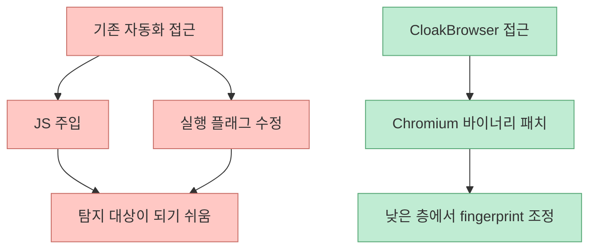
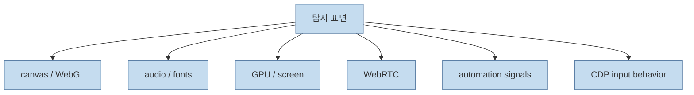
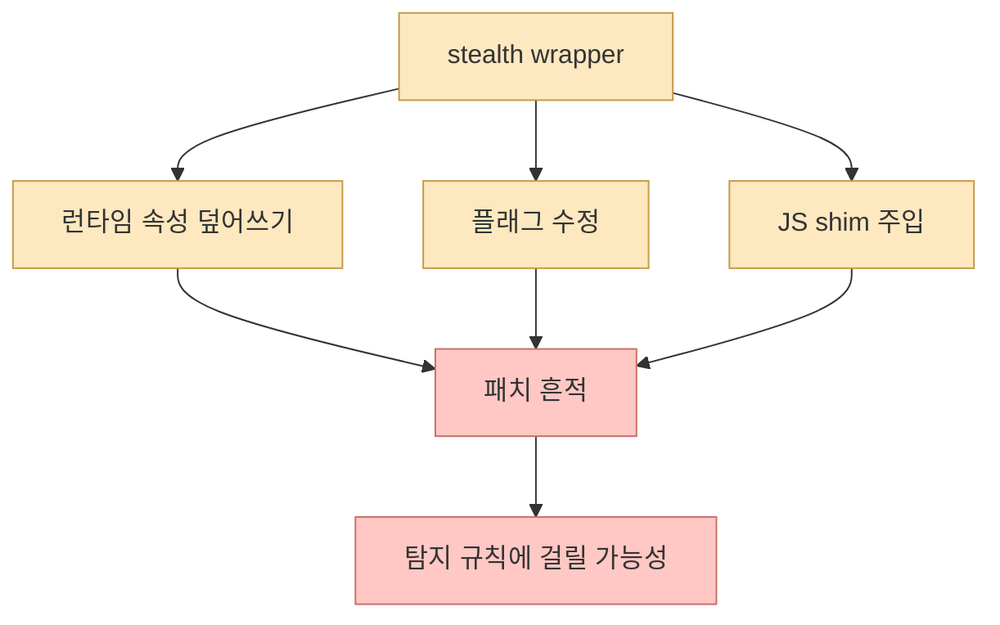
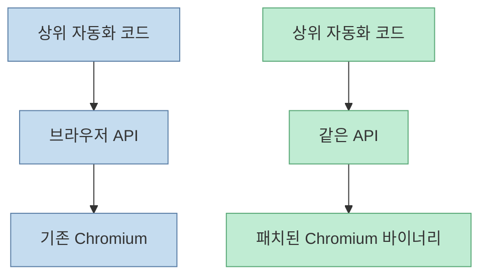
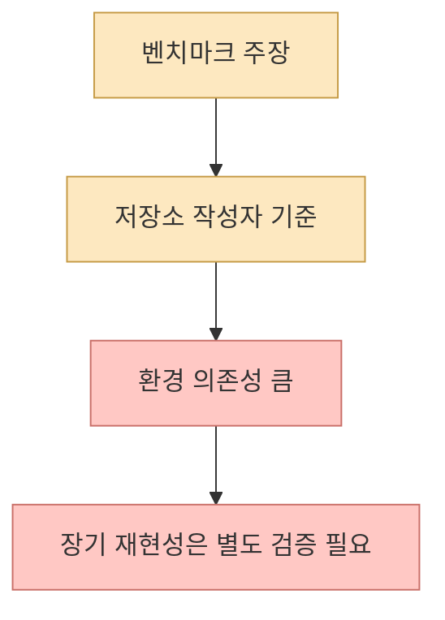
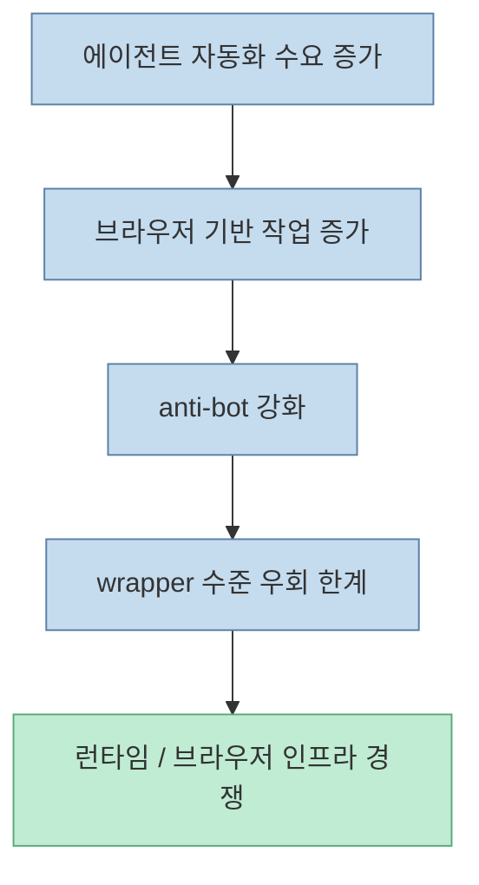

Threads에서 소개된 CloakBrowser의 메시지는 매우 도발적입니다. Playwright로 봇 차단을 우회하려고 삽질하지 말고, **import만 바꾸면 된다** 는 주장입니다. 실제 공식 저장소도 비슷한 메시지를 전면에 둡니다. `playwright-stealth`처럼 자바스크립트 주입이나 실행 플래그 조정이 아니라, **Chromium C++ 소스 레벨에서 지문을 패치한 브라우저 바이너리** 라는 점을 차별점으로 내세웁니다. 다만 이 주제는 합법적 테스트 자동화와 서비스 정책 우회 사이의 경계에 걸쳐 있으므로, 이 글은 구체적 우회 절차가 아니라 **기술적 접근 방식과 의미, 그리고 주의점** 중심으로 정리합니다.  

<!--more-->

## Sources

- <https://www.threads.com/@qjc.ai/post/DYbmgswkp79?xmt=AQG0W5fzfTmV0KfHNYfAxbt2RVz1N3k4Q-8nJR0EOGXoyeryCsADRN_5_QB0m7sE5-CY14Ej&slof=1>
- <https://github.com/CloakHQ/CloakBrowser>
- <https://cloakbrowser.dev/>

## Threads 포스트가 말한 핵심은 세 줄로 요약된다

Threads 원문과 이어진 스레드는 대략 이런 주장을 펼칩니다.

- 일반 Playwright는 Cloudflare Turnstile, reCAPTCHA v3, FingerprintJS 같은 탐지 계층에서 자주 막힌다
- 기존 우회 수단인 stealth 계열은 JS 주입이나 플래그 수정에 머물러 탐지 대상 자체가 되기 쉽다
- CloakBrowser는 브라우저 런타임의 더 아래층, 즉 Chromium 바이너리 수준을 직접 패치하는 쪽이라 접근 방식이 다르다

이 포인트는 단순한 마케팅 문구가 아니라, 현재 자동화 탐지 경쟁이 **얼마나 낮은 런타임 층으로 내려갔는가** 를 보여 줍니다.

## 저장소가 내세우는 차별점은 '설정'이 아니라 '브라우저 자체'다

공식 README의 첫 문장은 꽤 강합니다. "Stealth Chromium that passes every bot detection test." 그리고 바로 이어서 "patched config도 아니고, JS injection도 아니며, C++ source level에서 fingerprints를 수정한 real Chromium binary"라고 설명합니다. 즉 사용자가 wrapper를 덧씌우는 것이 아니라, **탐지 표면이 달라진 Chromium 변형체** 자체를 받는다는 뜻입니다. [GitHub README](https://github.com/CloakHQ/CloakBrowser)

README가 특히 강조하는 항목은 다음과 같습니다.

- canvas
- WebGL
- audio
- fonts
- GPU
- screen
- WebRTC
- automation signals
- CDP input behavior

즉 이 도구는 단순 headless 옵션 문제가 아니라, **브라우저 지문의 여러 층을 동시에 다루는 제품** 으로 포지셔닝됩니다.

## 왜 JS 주입 기반 stealth가 자주 깨지는가

Threads 스레드가 말하는 핵심 논리는 간단합니다. 기존 stealth 기법은 보통:

- `navigator.webdriver` 같은 속성 덮어쓰기
- 특정 API shim
- 실행 플래그 조정
- 런타임 초기화 패치

로 동작합니다. 그런데 탐지 시스템이 점점 정교해지면서, "봇인지 아닌지"보다 **패치 흔적이 있는지** 를 보는 쪽으로 발전해 왔습니다. Threads에서 말한 "탐지 시스템이 패치 자체를 감지한다"는 표현은 바로 이 흐름을 가리킵니다.

이런 이유로, 자동화 진영은 점점 더 아래층으로 내려가게 됩니다.

## CloakBrowser가 보여 주는 건 '브라우저 공급망'의 변화다

공식 README를 보면 CloakBrowser는 Playwright/Puppeteer와 같은 API를 유지하면서, 내부 브라우저만 바꾸는 드롭인 대체재를 지향합니다. 이 말의 의미는 생각보다 큽니다.

- 상위 애플리케이션 코드는 크게 안 바뀐다
- 브라우저 런타임만 교체한다
- 변화의 핵심은 코드가 아니라 바이너리 공급망이다

즉 경쟁 포인트가 wrapper 코드에서 browser binary 자체로 이동하고 있다는 뜻입니다. 이건 브라우저 자동화 생태계가 한 단계 더 **런타임 인프라 경쟁** 으로 들어갔음을 보여 줍니다.

## README의 수치와 통과 주장들은 어떻게 읽어야 하나

공식 저장소는 매우 강한 성능 주장을 합니다.

- `0.9 reCAPTCHA v3 score`
- Cloudflare Turnstile 통과
- FingerprintJS 통과
- BrowserScan 통과
- 30+ detection site 테스트

이런 수치는 인상적이지만, 실무적으로는 이렇게 읽는 편이 안전합니다.

- 저장소가 제시한 self-reported benchmark다
- 환경, IP 품질, 프록시, 헤드드/헤드리스, OS, 사이트별 정책에 따라 결과는 크게 달라질 수 있다
- 특정 시점의 탐지 우회 성능은 유지보수 없이는 금방 무너질 수 있다

즉 이 글의 핵심은 "이 도구면 다 된다"가 아니라, **탐지 경쟁이 브라우저 지문 층까지 내려왔다는 기술적 신호** 로 보는 쪽이 맞습니다.

## 이 주제가 에이전트·스크래핑 생태계에 던지는 의미

에이전트 워크플로에서 브라우저 자동화는 점점 더 중요해지고 있습니다. 문서 수집, 테스트, 폼 입력, 내부 도구 자동화, 인증 세션 유지 같은 요구가 늘어나기 때문입니다. 그런데 자동화가 커질수록 사이트 측은 anti-bot 계층을 더 강화합니다.

이 충돌은 결국 두 가지를 만듭니다.

- 브라우저 자동화는 더 인프라 지향적인 문제가 된다
- 단순 라이브러리 선택보다 신뢰 가능한 실행 환경 설계가 중요해진다

이 의미에서 CloakBrowser는 제품 하나라기보다, **자동화 브라우저가 어디까지 인프라화되고 있는지 보여 주는 사례** 라고 볼 수 있습니다.

## 반드시 같이 봐야 할 경계도 있다

이 주제는 기술적으로 흥미롭지만, 동시에 분명한 경계가 있습니다.

- 사이트 이용약관 위반 가능성
- 접근 통제 우회에 대한 법적 이슈
- 서비스 운영자와의 신뢰 문제
- 합법적 QA 자동화와 비인가 스크래핑의 경계

따라서 이런 도구를 볼 때 중요한 질문은 "통과되느냐"보다:

- 내가 다루는 사이트가 이런 자동화를 허용하는가
- 테스트 / 접근 목적이 정당한가
- 조직 정책과 법적 범위 안에 있는가

입니다.

## 핵심 요약

- Threads에서 화제가 된 CloakBrowser는 JS 주입형 stealth가 아니라 Chromium 바이너리 소스 레벨 패치를 차별점으로 내세운다
- 기술적으로 중요한 포인트는 봇 탐지 회피 그 자체보다, 자동화 탐지 경쟁이 런타임 하층까지 내려갔다는 점이다
- Playwright/Puppeteer 상위 API를 유지한 채 브라우저 바이너리만 교체하는 드롭인 전략은 브라우저 자동화를 공급망 문제로 바꾼다
- 저장소의 통과 수치와 점수는 흥미롭지만 self-reported benchmark로 읽어야 하며 환경 의존성이 크다
- 에이전트 시대의 브라우저 자동화는 단순 스크립트 문제가 아니라 실행 환경과 탐지 표면을 함께 설계하는 인프라 문제로 이동하고 있다
- 동시에 이 주제는 서비스 정책과 법적 경계를 건드릴 수 있어 목적과 사용 범위를 엄격히 따져야 한다

## 결론

CloakBrowser를 둘러싼 진짜 뉴스는 "Playwright보다 더 잘 막힘을 뚫는다"가 아닙니다. 더 중요한 뉴스는 **브라우저 자동화 경쟁이 이제 설정 파일과 JS shim이 아니라, 브라우저 바이너리 층에서 벌어지고 있다** 는 점입니다.

그래서 이 도구를 볼 때 핵심 질문은 하나입니다.

**이제 자동화는 라이브러리 선택의 문제가 아니라, 어떤 런타임을 신뢰 가능한 실행 환경으로 채택할 것인가의 문제가 된 것 아닌가?**
