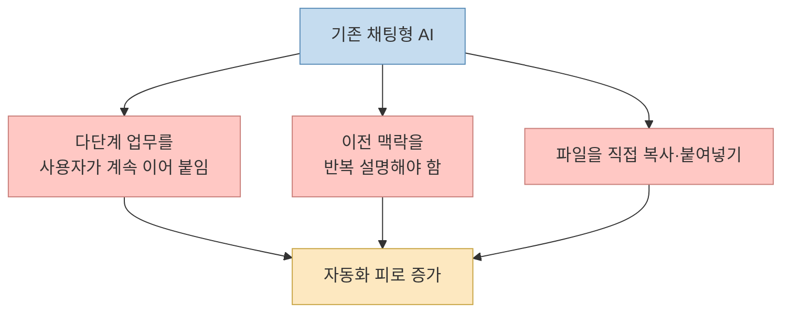
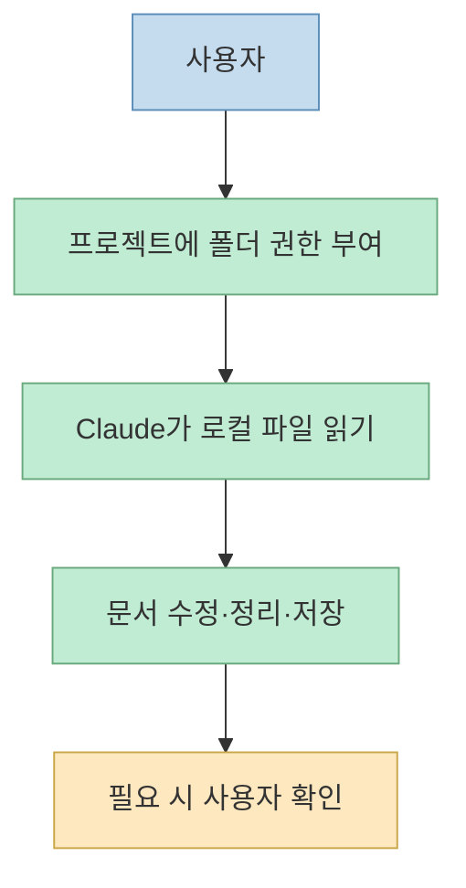
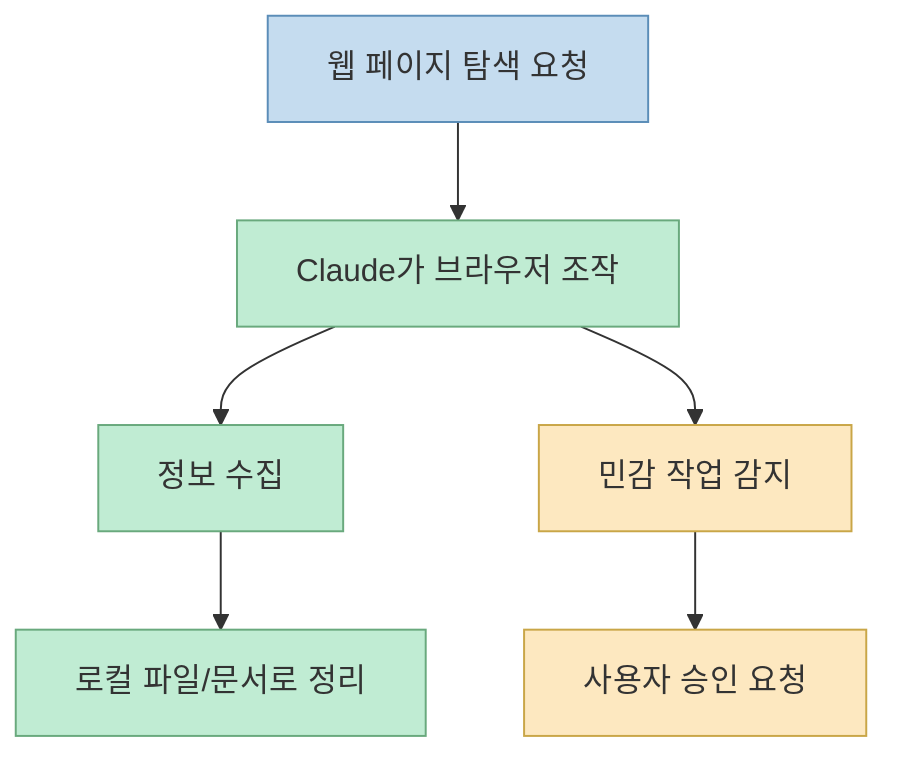
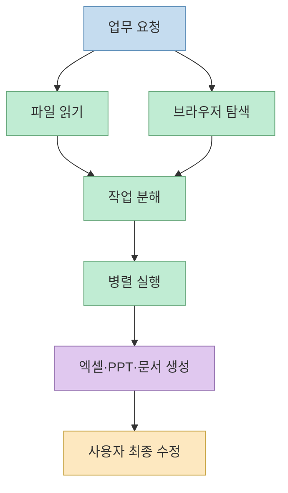
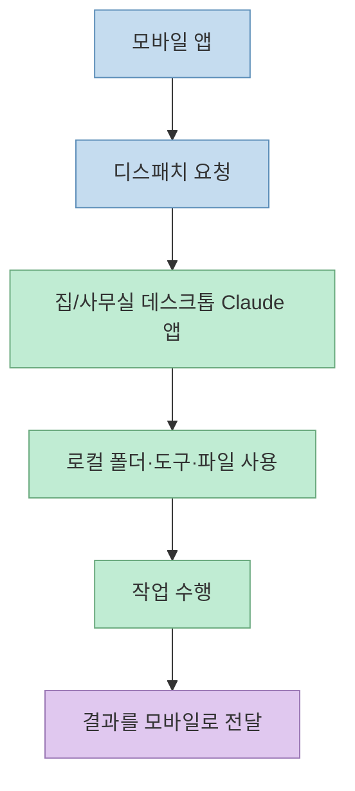
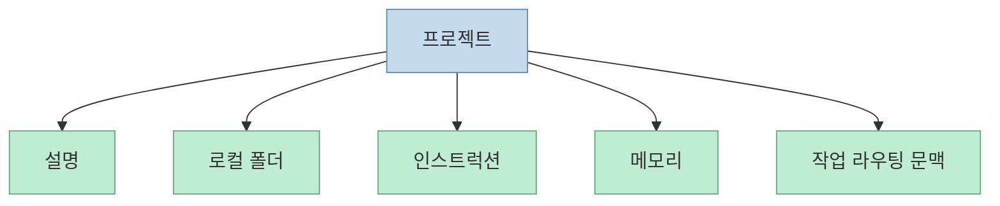
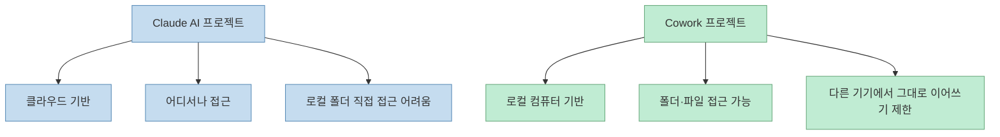
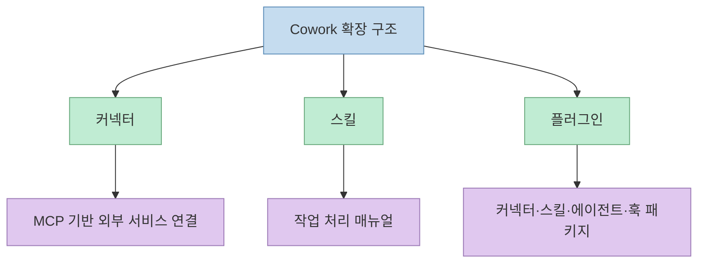
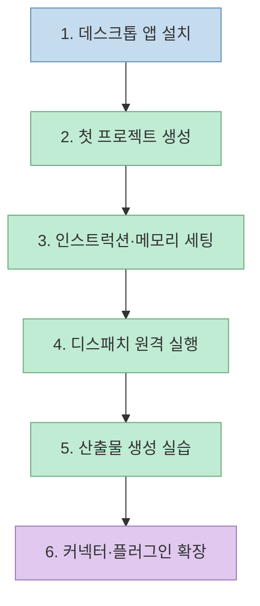

Claude Cowork를 이해하는 가장 쉬운 방법은, **채팅창 안에서 답변만 주는 AI** 를 **파일, 브라우저, 프로젝트, 원격 실행까지 다루는 작업 공간형 에이전트** 로 확장한 개념으로 보는 것이다. 이 영상은 그 변화를 "기능 목록"으로 소개하지 않고, 왜 기존 채팅형 AI가 실무에서 자꾸 끊기는지부터 설명한 뒤, Cowork가 그 병목을 어떤 구조로 줄이려는지 19분 안에 정리한다.

핵심은 단순하다. 기존에는 사용자가 AI 옆에 붙어서 다음 단계, 다음 단계, 다음 단계를 계속 지시해야 했다. 반면 Cowork는 한 번 목표를 던진 뒤 백그라운드에서 작업을 진행하고, 필요할 때만 확인을 받는 쪽으로 무게중심을 옮긴다. 영상 표현을 빌리면, "인턴 옆에서 한 마디씩 가르치는 방식"에서 "옆자리 동료에게 일을 맡기는 방식"으로 넘어가는 셈이다. 

<!--more-->

## Sources

- 영상: [클로드 코워크 튜토리얼](https://youtu.be/IfletC8qzQk?si=JZcdmXsTQRCcda9a)

## 왜 Claude Cowork가 따로 필요한가

영상은 먼저 기존 AI 사용 방식의 세 가지 병목을 짚는다.

첫째는 **다단계 업무의 끊김** 이다. 보고서 하나를 만들더라도 자료 수집, 정리, 분석, 슬라이드 작성, 결론 작성까지 여러 단계가 이어지는데, 채팅형 AI는 각 단계를 사용자가 매번 이어 붙여 줘야 한다. 이 설명은 영상 초반부에서 분명하게 나온다. AI가 한 번에 끝내지 못하니 사용자는 계속 옆에서 다음 행동을 지정해야 하고, 결국 "내가 하는 게 더 빠르다"는 생각으로 돌아간다.[영상 0:28](https://youtu.be/IfletC8qzQk?t=28)

둘째는 **기억의 단절** 이다. 발표자는 AI가 이전 맥락을 반복해서 잃어버리는 문제를 "매일 출근할 때마다 어제 일을 잊는 신입"에 비유한다. 즉, 문맥 유지가 사용자 책임으로 남아 있으면 자동화가 아니라 반복 설명 노동이 된다.[영상 1:00](https://youtu.be/IfletC8qzQk?t=60)

셋째는 **파일 접근의 부재** 다. 기존에는 로컬 파일을 직접 열어 복사하고 채팅창에 붙이고, 결과를 다시 파일로 옮기는 수작업이 필요했다. 이 문제를 발표자는 "회사 밖 외주 인력과 우편으로 파일을 주고받는 것"에 비유한다.[영상 1:18](https://youtu.be/IfletC8qzQk?t=78)

그래서 영상이 정의하는 Cowork의 핵심은 "질문-답변 인터페이스"가 아니라 **에이전틱 워크스페이스** 다. 사용자가 결과를 정의하면, Claude가 필요한 중간 단계를 처리해 결과물을 만들어 오는 구조다.[영상 1:35](https://youtu.be/IfletC8qzQk?t=95)

## Cowork의 핵심 4가지 기능

### 1. 로컬 파일을 직접 읽고 쓰는 작업 공간

가장 먼저 소개되는 기능은 로컬 파일 관리다. 발표자의 설명대로라면 Cowork에서는 Claude가 사용자의 컴퓨터 안에 있는 파일을 직접 읽고 수정하고 저장할 수 있다. 여기서 중요한 포인트는 단순 "업로드 편의성"이 아니다. 업무의 실제 재료가 대부분 파일에 있기 때문에, 파일 접근이 되느냐 안 되느냐가 AI의 역할 범위를 바꾼다는 점이다.[영상 3:33](https://youtu.be/IfletC8qzQk?t=213)

즉, 보고서 폴더를 지정해 두면 "어제 작업한 문서 손봐줘" 같은 지시가 가능해지고, 사용자는 더 이상 내용을 복사해 채팅창에 붙이지 않아도 된다. 영상은 이 변화를 **외주 인력** 에서 **같은 사무실 직원** 으로 바뀌는 감각이라고 표현한다.[영상 3:43](https://youtu.be/IfletC8qzQk?t=223)

다만 이 기능은 무제한 접근이 아니라 권한 기반이다. 발표자는 폴더 단위 허용이 필요하고, 민감한 작업은 사용자 확인을 거친다고 설명한다. 즉, 실무적으로는 "무조건 다 읽는 AI"가 아니라 **권한 안에서 일하는 자동화 동료** 로 이해하는 편이 정확하다.[영상 4:29](https://youtu.be/IfletC8qzQk?t=269)

### 2. 브라우저 조작과 파일 작업의 결합

두 번째 축은 크롬 연동이다. 여기서 영상이 강조하는 건 "웹 검색"이 아니라 **브라우저 조작의 위임** 이다. 예를 들어 채용 공고를 정리해 달라고 하면 Claude가 회사 채용 페이지를 열고 항목을 클릭해 읽고 표로 정리하는 식이다.[영상 4:43](https://youtu.be/IfletC8qzQk?t=283)

이 기능이 강력한 이유는 로컬 파일 기능과 결합될 때다. 웹에서 자료를 읽고, 그것을 다시 로컬 엑셀이나 문서로 정리하는 흐름이 하나의 작업으로 이어진다. 발표자는 경쟁사 가격 추적 같은 반복 업무를 예로 들며, 매주 하던 수작업이 자동화될 수 있다고 설명한다.[영상 5:17](https://youtu.be/IfletC8qzQk?t=317)

물론 브라우저 조작은 민감하다. 잘못된 클릭이 결제나 제출 같은 행동으로 이어질 수 있기 때문이다. 그래서 영상은 위험한 액션일수록 확인 절차가 들어간다고 짚는다. 이 점은 단순 기능 소개보다 중요하다. Cowork의 가치는 "다 해준다"가 아니라 **사용자 승인 아래 실제 작업을 이어준다** 는 데 있다.[영상 5:28](https://youtu.be/IfletC8qzQk?t=328)

### 3. 병렬 작업으로 큰 일을 쪼개 처리

세 번째는 병렬 작업이다. 영상 설명에 따르면 Cowork는 복잡한 요청을 작은 단위로 쪼갠 뒤 동시에 처리한다. 발표자는 이를 셰프 여러 명이 각자 요리를 맡아 한 번에 진행하는 식으로 비유한다.[영상 5:58](https://youtu.be/IfletC8qzQk?t=358)

이 기능의 본질은 "속도 향상" 자체보다 **업무 분해와 동시 실행의 결합** 이다. 기존 채팅형 AI가 A를 끝내고 B, 그다음 C로 가는 구조였다면, Cowork는 A·B·C를 병렬로 진행하려 한다. 사용자가 직접 태스크를 쪼개지 않아도 된다는 점에서 실무 장벽이 낮아진다.[영상 6:01](https://youtu.be/IfletC8qzQk?t=361)

### 4. 문서, 스프레드시트, 발표자료 같은 실제 산출물 생성

네 번째는 엑셀, 파워포인트, 워드 같은 산출물 생성이다. 영상은 여기서 Cowork를 단순 텍스트 생성기가 아니라 **업무 형식을 이해하는 비서** 로 묘사한다. 특히 엑셀은 표만 만드는 수준이 아니라 함수, 차트, 피벗 테이블처럼 실제 사용 가능한 형태를 지향한다고 설명한다.[영상 6:38](https://youtu.be/IfletC8qzQk?t=398)

발표자가 강조하는 포인트는 "80%를 먼저 만들어 주고, 사람은 20%를 다듬는다"는 흐름이다. 이건 AI가 완성품을 대체한다는 주장보다 훨씬 실무적이다. 실무자는 문서 뼈대, 표 계산, 슬라이드 초안을 위임하고 최종 품질과 맥락 정렬에 집중하게 된다.[영상 7:26](https://youtu.be/IfletC8qzQk?t=446)

## 디스패치가 만드는 원격 작업 모델

영상 중반 이후 가장 흥미로운 기능은 **디스패치** 다. 발표자는 이를 "핸드폰으로 집 컴퓨터에 일시키는 기능"이라고 설명한다. 구조는 단순하다. 실제 작업은 집이나 사무실의 데스크톱 Claude 앱에서 돌고, 사용자는 모바일에서 작업을 던지고 진행 결과를 확인한다.[영상 7:38](https://youtu.be/IfletC8qzQk?t=458)

이 모델이 중요한 이유는, Cowork가 단순히 "앱 기능 몇 개 추가"가 아니라 **작업 위치와 지시 위치를 분리** 하기 때문이다. 발표자 설명대로, 데스크톱은 폴더와 도구 연결이 이미 잡혀 있는 실제 작업장이고, 모바일은 그 작업장을 호출하는 리모컨 역할을 한다.[영상 8:24](https://youtu.be/IfletC8qzQk?t=504)

즉, 사용자는 이동 중에도 "그 보고서 수정해 둬", "자료 정리 시작해 둬" 같은 지시를 남길 수 있고, 결과는 다시 모바일로 받는다. 다만 민감 작업은 여기서도 승인 절차가 남아 있다.[영상 8:41](https://youtu.be/IfletC8qzQk?t=521)

## 프로젝트는 '작업방'이 아니라 반복 업무용 설정 묶음이다

프로젝트 기능은 단순 분류 폴더가 아니다. 영상에서는 이를 **특정 영역의 작업을 위한 워크스페이스** 로 설명한다. 부서별 사무실에 각각 자료와 규칙이 다르듯, 프로젝트마다 목적과 폴더와 기본 지시와 메모리가 달라질 수 있다는 것이다.[영상 8:49](https://youtu.be/IfletC8qzQk?t=529)

발표자가 소개한 프로젝트의 핵심은 다섯 축으로 정리할 수 있다.

- 이 프로젝트가 무엇을 위한 공간인지 설명
- Claude가 읽고 쓸 로컬 폴더 연결
- 세션마다 자동으로 적용되는 인스트럭션
- 누적되는 메모리
- 작업을 어디로 보낼지 판단하게 해 주는 문맥

특히 중요한 건 인스트럭션과 메모리다. 예를 들어 "항상 한국어로 답하라", "주간 보고서는 이 형식을 따른다", "지난주 핵심 이슈는 이것이었다" 같은 정보가 프로젝트 안에 묶이면, 매번 같은 설명을 반복하지 않아도 된다.[영상 9:52](https://youtu.be/IfletC8qzQk?t=592)

## Cowork 프로젝트와 Claude AI 프로젝트는 다르다

영상은 여기서 흔한 혼동도 정리한다. 발표자 설명에 따르면 **Claude AI 프로젝트** 는 계정 기반의 클라우드 프로젝트이고, **Cowork 프로젝트** 는 사용자 컴퓨터 안의 로컬 프로젝트다.[영상 10:55](https://youtu.be/IfletC8qzQk?t=655)

즉, 전자는 어디서나 접근 가능하고 팀 공유에 강하지만 로컬 폴더를 직접 보지 못한다. 반대로 후자는 로컬 폴더 접근과 데스크톱 중심 업무에 강하지만, 동일한 형태로 다른 컴퓨터에서 그대로 이어 쓰기는 어렵다. 영상은 둘이 완전히 같은 개념이 아니라는 점을 분명히 한다.[영상 11:08](https://youtu.be/IfletC8qzQk?t=668)

## MCP, 스킬, 플러그인은 각각 역할이 다르다

영상 후반부는 Cowork의 확장 구조를 세 층으로 나눈다.

### 1. 커넥터와 MCP

커넥터는 외부 도구 연결이고, MCP는 그 연결을 위한 공통 규약이다. 발표자는 이를 전기 콘센트 규격에 비유한다. 즉, 도구마다 매번 다른 연결 방식을 외우는 게 아니라, Claude가 외부 서비스와 상호작용할 수 있는 표준 인터페이스를 둔다는 개념이다.[영상 12:08](https://youtu.be/IfletC8qzQk?t=728)

영상에서 예로 드는 연결 대상은 노션, 슬랙, GitHub다. 이 관점에서 Cowork는 단순 파일 자동화를 넘어, 회의록을 읽고 액션 아이템을 다른 시스템의 티켓으로 옮기는 식의 크로스툴 워크플로우로 확장된다.[영상 12:45](https://youtu.be/IfletC8qzQk?t=765)

### 2. 스킬

스킬은 외부 연결이 아니라 **작업 처리 매뉴얼** 이다. 발표자에 따르면 스킬은 `skills.md`와 관련 리소스로 구성된 폴더이며, 어떤 작업이 들어왔을 때 어떻게 처리할지를 정의한다.[영상 13:15](https://youtu.be/IfletC8qzQk?t=795)

여기서 중요한 설명은 **점진적 공개** 다. 모든 스킬 내용을 항상 다 읽는 것이 아니라, 먼저 메타데이터만 보고, 실제로 필요한 작업이 들어왔을 때만 해당 스킬의 전체 내용을 불러온다는 뜻이다. 이 설명은 왜 스킬 구조가 단순 문서 저장소가 아니라 컨텍스트 효율화 장치로 작동하는지 보여 준다.[영상 13:36](https://youtu.be/IfletC8qzQk?t=816)

### 3. 플러그인

플러그인은 커넥터, 스킬, 에이전트, 훅을 묶은 패키지다. 발표자는 이를 스마트폰 앱에 비유한다. 하나의 앱 안에 여러 기능이 들어 있듯, 플러그인 하나가 여러 자동화 자산을 함께 배포할 수 있다는 뜻이다.[영상 13:58](https://youtu.be/IfletC8qzQk?t=838)

## 발표자가 제안한 시작 6단계

영상은 실전 도입 순서도 비교적 구체적으로 제안한다.

1. 데스크톱 앱을 설치한다. 
2. 너무 크지 않은 첫 프로젝트를 만든다. 
3. 인스트럭션과 메모리를 미리 넣는다. 
4. 디스패치로 원격 제어를 시도해 본다. 
5. 엑셀·PPT 같은 기본 산출물 생성을 써 본다. 
6. 커넥터와 플러그인을 연결해 범위를 넓힌다. 

이 순서가 좋은 이유는, 처음부터 거대한 자동화 시스템을 설계하라고 하지 않기 때문이다. 발표자는 주간 보고서처럼 **자주 반복되지만 구조가 비교적 안정적인 업무** 를 첫 프로젝트 후보로 권한다.[영상 15:04](https://youtu.be/IfletC8qzQk?t=904)

## 이 도구가 바꾸는 것은 기능이 아니라 사용자 역할이다

영상에서 가장 중요한 문장은 후반부에 나온다. 발표자는 Cowork가 단순한 새 기능 묶음이 아니라 **일하는 방식 자체를 바꾸는 도구** 라고 말한다. 기존에는 사용자가 직접 엑셀을 열고, 데이터를 입력하고, 브라우저를 돌아다녔다면, Cowork에서는 사용자가 목표를 정의하고 Claude가 도구를 다루는 쪽으로 역할이 이동한다는 것이다.[영상 16:34](https://youtu.be/IfletC8qzQk?t=994)

이 설명은 과장이 아니다. 실제로 Cowork의 각 기능은 모두 같은 방향을 가리킨다.

- 파일을 직접 열지 않아도 됨
- 브라우저를 직접 클릭하지 않아도 됨
- 여러 단계를 직접 이어 붙이지 않아도 됨
- 모바일에서 원격으로 지시 가능
- 프로젝트에 규칙과 메모리를 축적 가능

즉, 사용자의 핵심 역량은 실행 속도보다 **업무 정의와 위임 품질** 로 이동한다. 발표자가 "실행자에서 디렉터로 바뀐다"고 말하는 이유가 여기에 있다.[영상 16:51](https://youtu.be/IfletC8qzQk?t=1011)

## 실전에서 주의해야 할 점

영상은 장점만 말하지 않는다. 발표자가 직접 언급한 주의점은 다음과 같다.

- 권한 관리를 꼼꼼히 할 것
- 결과를 그대로 신뢰하지 말 것
- 처음엔 작은 작업부터 시작할 것
- 비용을 고려할 것
- 백업을 잘할 것

이 다섯 가지는 단순한 면책 조항이 아니라, Cowork를 **생산성 도구** 로 쓸지 **혼란 증폭기** 로 쓸지를 가르는 기준에 가깝다.[영상 16:20](https://youtu.be/IfletC8qzQk?t=980)

또한 FAQ 구간에서 발표자는 로컬 파일 처리는 사용자 컴퓨터 안에서 이뤄지지만, AI 처리 자체는 Anthropic 서버를 거치므로 완전한 로컬 처리는 아니라고 설명한다. 보안 민감도가 높은 조직이라면 이 구분을 정확히 이해하고 도입해야 한다.[영상 17:27](https://youtu.be/IfletC8qzQk?t=1047)

## 핵심 요약

이 영상이 설명하는 Claude Cowork의 본질은 "Claude가 더 똑똑해졌다"가 아니다. **Claude를 실제 작업 흐름 안으로 들여왔다** 는 데 있다. 

- 로컬 파일 접근으로 복붙 노동을 줄이고 
- 브라우저 조작으로 웹 작업을 위임하고 
- 병렬 실행으로 다단계 업무를 분해하고 
- 문서 산출물 생성으로 결과 형식까지 자동화하고 
- 디스패치, 프로젝트, MCP, 스킬, 플러그인으로 이를 운영체계처럼 묶는다. 

그래서 Cowork의 진짜 변화는 기능 추가가 아니라 사용자 역할 변화다. 사용자는 도구를 직접 조작하는 사람이 아니라, 목표를 정의하고 승인하고 품질을 확인하는 디렉터 쪽으로 이동한다.

## 결론

Claude Cowork는 결국 "AI와 더 오래 대화하는 법"이 아니라 **AI에게 더 긴 일을 맡기는 법** 에 대한 제품이다. 이 영상은 그 점을 기능 설명보다 더 잘 보여 준다. 처음부터 거대한 자동화를 설계하기보다, 반복적인 보고서·정리·문서 생성 업무 하나를 골라 프로젝트로 만들고, 그다음 디스패치와 커넥터를 얹는 순서가 가장 현실적이다. Cowork의 성패는 모델 성능보다도, 사용자가 일을 얼마나 잘 정의하고 위임하느냐에 더 크게 달려 있다.[영상 18:39](https://youtu.be/IfletC8qzQk?t=1119)
