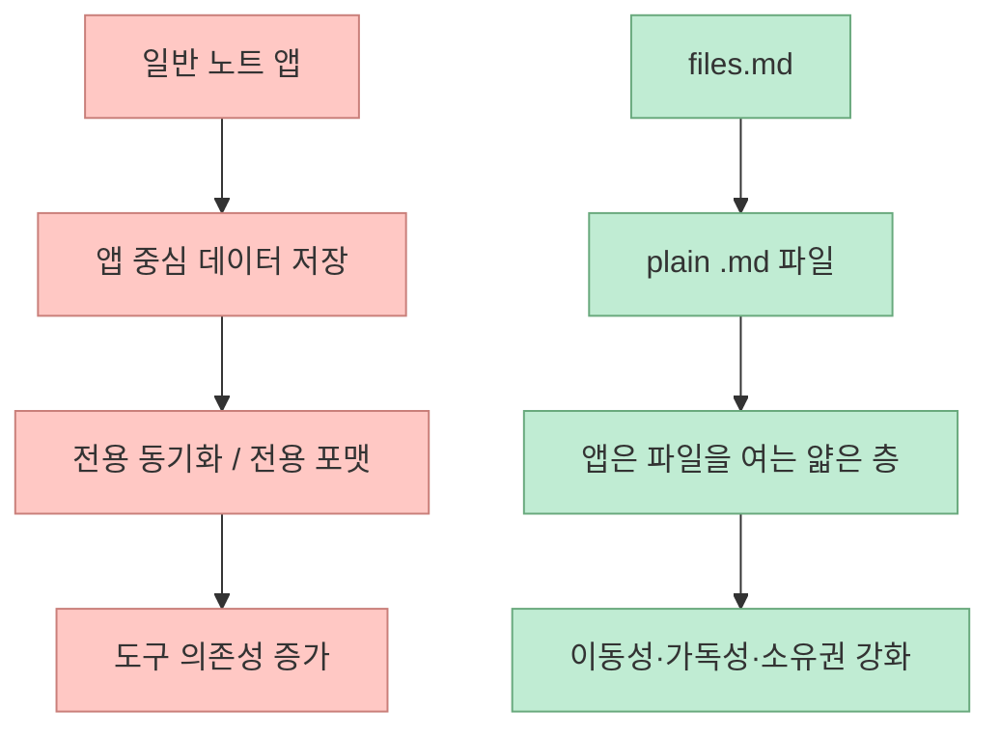
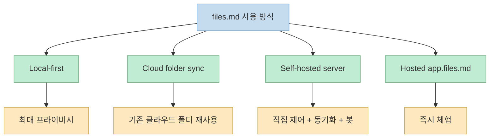
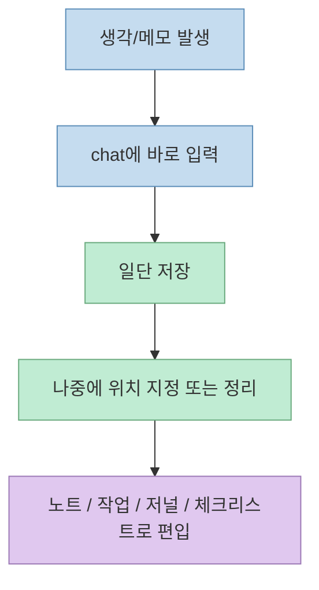
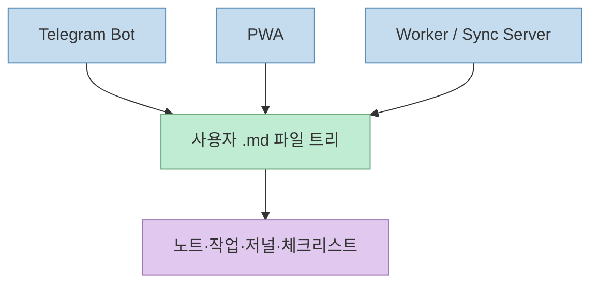
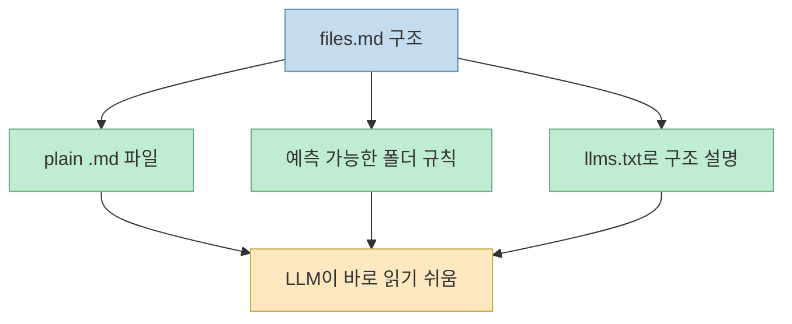

`files.md`를 처음 보면 그냥 "또 하나의 마크다운 노트 앱"처럼 보이기 쉽다. 하지만 README를 끝까지 읽어 보면 이 프로젝트의 초점은 기능 경쟁이 아니다. 오히려 **삶의 기록을 특정 앱 데이터베이스에 가두지 말고, 평범한 `.md` 파일로 유지한 채 그 위에 최소한의 소프트웨어만 얹자** 는 철학이 훨씬 강하다.[GitHub README](https://github.com/zakirullin/files.md)

그래서 `files.md`의 흥미로운 지점은 예쁜 에디터 UI보다도 구조에 있다. 설치가 거의 필요 없는 PWA, 로컬 우선 저장, 선택 가능한 동기화 방식, 단일 바이너리 서버, Telegram 봇, 그리고 LLM이 이해하기 쉬운 정해진 파일 구조까지 한 번에 묶는다. 즉 이 프로젝트는 "노트 작성 도구"라기보다 **마크다운 파일 기반 개인 시스템** 에 더 가깝다.

<!--more-->

## Sources

- 원본 저장소: https://github.com/zakirullin/files.md

## files.md는 무엇을 지키려는가

README 첫머리의 메시지는 꽤 분명하다. `files.md`는 notes, documents, journal, habits, checklists, tasks를 모두 plain `.md` 파일로 보관하자고 말한다. 그리고 "no data is sent to server", "you should own your files, and the software that opens them" 같은 표현으로 데이터 소유권을 강하게 강조한다.[GitHub README](https://github.com/zakirullin/files.md)

이건 단순한 개인정보 보호 슬로건과는 조금 다르다. 보통 노트 앱은 데이터를 자신만의 DB 포맷, 동기화 프로토콜, 앱 생태계 안에 묶는다. 반면 `files.md`는 처음부터 **파일이 먼저이고 앱은 그 파일을 여는 얇은 층** 이어야 한다는 전제를 둔다.

이 철학은 README 전반의 여러 선택과 정확히 연결된다.

- 로컬 우선
- 브라우저만 있으면 사용 가능
- 오프라인 동작
- 서버 없이도 시작 가능
- LLM이 프로젝트 전체를 이해하기 쉬운 단순 코드베이스

즉 `files.md`는 기능을 늘리는 대신 **복잡성을 의도적으로 줄이는 쪽** 에 베팅한 프로젝트다.

## "또 하나의 노트 앱"이 아니라는 주장의 근거

README의 "Another note taking app?" 섹션은 왜 이 프로젝트가 기존 PKM 제품군과 다르다고 보는지 직접 설명한다.[GitHub README](https://github.com/zakirullin/files.md)

핵심 포인트는 다음과 같다.

- 필요한 기능만 넣는다
- 설치 없이 브라우저로 쓴다
- 오프라인으로 동작한다
- 파일은 기기를 떠나지 않는다
- 무료/오픈소스다
- 코드가 매우 단순해서 한 사람 또는 LLM이 프로젝트 전체를 머릿속에 담을 수 있다
- 빌드 시스템 없이 `web/index.html`을 바로 열 수 있다

여기서 특히 눈에 띄는 부분은 "one person or an LLM can fit the whole project in head"라는 문장이다. 이건 단순히 소박한 개발 미학이 아니라, **AI 시대에 도구 자체도 다시 쉽게 이해·수정 가능해야 한다** 는 주장으로 읽힌다.[GitHub README](https://github.com/zakirullin/files.md)

즉 사용자는 파일을 소유하고, 필요하면 LLM으로 도구도 스스로 바꿀 수 있어야 한다는 관점이다.

## 저장 방식은 하나가 아니라 네 가지다

README가 좋은 점 중 하나는, 이 프로젝트를 "무조건 셀프호스팅"으로 밀지 않는다는 점이다. 사용 방식은 네 가지로 나뉜다.[GitHub README](https://github.com/zakirullin/files.md)

- Local-first 기본 모드
- iCloud / Dropbox / Google Drive 같은 cloud-folder sync
- 직접 운영하는 self-hosted server
- 바로 써 볼 수 있는 hosted 버전

이 설계는 꽤 현실적이다. 많은 로컬 우선 앱이 "결국 서버를 깔아야 진짜 쓸 만해지는" 함정에 빠지는데, `files.md`는 서버 없이 시작하고 필요할 때만 동기화 전략을 올릴 수 있다.

이 점은 `files.md`를 앱이라기보다 **운영 방식 선택지가 있는 파일 시스템 레이어** 로 보게 만든다.

## 핵심 UX는 "생각을 빨리 버리고 나중에 구조화"다

README의 "Dump your thoughts"와 "Save things in the chatbot" 섹션은 이 도구의 UX 방향을 잘 보여 준다. 사용자는 먼저 chat에 짧게 내용을 던지고, 나중에 어디에 저장할지 정할 수 있다. 즉 완벽한 폴더 설계를 먼저 강요하지 않고, **생각 캡처를 먼저 허용한 뒤 파일로 정리** 한다.[GitHub README](https://github.com/zakirullin/files.md)

이 흐름은 생산성 도구에서 흔한 "구조 설계 피로"를 줄여 준다. 특히 journal, tasks, checklists, notes를 같은 `.md` 세계 안에서 다루려면 입력 장벽이 낮아야 하는데, `files.md`는 그 진입점을 채팅 인터페이스로 잡는다.

즉 이 프로젝트의 본질은 "편집기"보다도 **캡처와 정리 흐름** 쪽에 더 가깝다.

## Telegram 봇이 붙는 순간, 이건 노트 앱이 아니라 생활 인터페이스가 된다

README는 Telegram Bot을 따로 크게 다룬다. 실제로 봇을 통해 메시지를 보내면 파일에 저장되고, "other messengers will follow"라고도 적는다.[GitHub README](https://github.com/zakirullin/files.md)

더 중요한 건 `docs/bot.md`와 `docs/your-own-server.md`다. 여기서 봇은 단순 알림 채널이 아니라, **per-user filesystem tree를 읽고 쓰는 또 하나의 클라이언트** 로 설명된다. 서버는 Telegram update loop, HTTP sync server, worker ticker 세 가지 장기 실행 컴포넌트로 돌아가고, 이들이 모두 같은 `.md` 파일 트리를 single source of truth로 공유한다.[bot.md](https://raw.githubusercontent.com/zakirullin/files.md/main/docs/bot.md)

즉 모바일 메신저에서 입력한 메모, PWA에서 수정한 파일, 서버 워커가 이동시킨 due task가 결국 같은 파일 시스템을 중심으로 합쳐진다.

이 구조 덕분에 `files.md`는 "앱 안의 메모"가 아니라 **어디서 접근하든 같은 파일을 다루는 시스템** 으로 확장된다.

## 서버는 '플랫폼'이 아니라 Go 단일 바이너리라는 점이 중요하다

README는 self-hosted server를 "one Go binary"라고 표현한다.[GitHub README](https://github.com/zakirullin/files.md) `docs/your-own-server.md`도 시스템드 서비스 배포, Telegram bot 토큰 설정, storage 폴더 관리, 백업 및 이전 방법 등을 단순하게 제시한다.[your-own-server.md](https://raw.githubusercontent.com/zakirullin/files.md/main/docs/your-own-server.md)

이 선택은 꽤 전략적이다.

- 서버를 복잡한 SaaS 백엔드처럼 키우지 않는다
- 파일이 truth이므로 서버는 동기화/봇/작업 보조 역할에 머문다
- 운영자가 직접 옮기고 백업하고 git으로 보관하기 쉽다

즉 이 시스템에서 서버는 데이터베이스 중심 플랫폼이 아니라, **파일 기반 워크플로우를 이어 주는 얇은 동기화 프로세스** 다.

## LLM 친화성은 마케팅 문구가 아니라 구조에 들어 있다

README는 "LLM-friendly"를 아주 전면에 둔다.[GitHub README](https://github.com/zakirullin/files.md) 하지만 이게 단순한 유행어는 아니다. 이유는 적어도 세 가지다.

첫째, 파일 포맷이 plain `.md`다. 즉 LLM이 바로 읽기 쉽다. 
둘째, 구조가 비교적 정해져 있다. `Chat.md`, `brain/`, `journal/`, `habits/`, `archive/`, `config.json` 같은 규칙이 있다. 
셋째, README는 아예 [files.md/llms.txt](https://files.md/llms.txt) 스킴을 `CLAUDE.md`나 `AGENTS.md`에 복사해 에이전트가 구조를 이해하도록 하라고 안내한다.[GitHub README](https://github.com/zakirullin/files.md)

이건 매우 실용적이다. 많은 개인 지식 시스템은 사람이 보기엔 예쁘지만 AI에게는 맥락이 불명확하다. `files.md`는 반대로 **AI가 오해하지 않도록 파일 레이아웃을 약속된 형태로 제공** 한다.

즉 이 프로젝트는 "노트를 AI에 먹이기 좋은가"가 아니라, **처음부터 AI가 함께 다룰 수 있게 파일 세계를 설계했는가** 의 사례에 더 가깝다.

## Second Brain 비판이 이 프로젝트의 철학을 설명한다

README 후반의 `Second Brain?` 섹션은 단순 기능 소개보다 더 중요하다. 작성자는 Joan Westenberg의 "I Deleted My Second Brain"을 길게 인용하면서, 거대한 PKM 시스템이 종종 **생각을 연기하는 시스템** 으로 바뀐다고 비판한다.[GitHub README](https://github.com/zakirullin/files.md)

핵심 논리는 이렇다.

- 그래프 뷰와 템플릿이 이해를 보장하지는 않는다
- 정리, 태깅, 추출을 미래의 자기에게 미루게 된다
- 시스템은 점점 커지지만 첫 번째 뇌는 더 똑똑해지지 않는다

그래서 `files.md`는 복잡한 구조보다 다음 원칙을 제안한다.

- 처음엔 구조 없이 시작하기
- 한 노트에 한 아이디어
- 관련 노트 연결하기
- 다시 읽고 스스로 생각하기
- 배운 것을 즉시 적용하기

이건 기술적으로 보면 기능 부족처럼 보일 수 있지만, 철학적으로는 **앱이 사고를 대신하지 않게 하려는 의도적 제약** 이다.

## 파일 구조가 곧 개인 운영 규약이 된다

README의 파일 구조 예시는 단순 샘플이 아니라, 개인 기록을 어떤 단위로 나눌지에 대한 운영 규약에 가깝다.[GitHub README](https://github.com/zakirullin/files.md)

- `Chat.md`
- `brain/Note.md`
- `journal/YYYY.MM Month.md`
- `Later.md`
- `habits/*.md`
- `archive/*.md`
- `media/*`
- `config.json`

이 구조는 전통적인 폴더 계층보다도 "이 파일이 어떤 삶의 행위에 대응하는가"를 기준으로 짜여 있다. LLM에게도 이해하기 쉽고, 사람에게도 파일이 어떤 역할인지 모호하지 않다.

## 2026년 5월 19일 기준으로 보이는 상태

GitHub API 기준으로, 제가 확인한 시점인 **2026년 5월 19일** 에 `zakirullin/files.md` 저장소는 대략 다음 상태였다.

- 설명: `Your life in plain .md files`
- stars 약 1.5k
- forks 42
- open issues 8
- 주 언어 Go
- 최근 push 시각: 2026-05-19T12:23:58Z
- 최근 update 시각: 2026-05-19T12:59:18Z

이 값들은 변할 수 있는 현재 시점 메타데이터이므로, 날짜를 붙여 읽는 편이 정확하다.[GitHub API](https://api.github.com/repos/zakirullin/files.md)

## 핵심 요약

`files.md`의 핵심은 "마크다운 노트 앱"이 아니다. 

- 삶의 기록을 plain `.md` 파일로 남기고 
- PWA, 봇, 서버가 모두 같은 파일을 다루며 
- 서버는 단일 바이너리로 얇게 유지되고 
- 동기화 방식은 로컬·클라우드 폴더·셀프호스팅·호스티드 중 선택 가능하며 
- 파일 구조 자체가 LLM이 이해하기 쉬운 운영 규약이 된다. 

그래서 이 프로젝트는 노트 앱보다도 **Markdown 파일 기반 개인 운영체제** 에 더 가깝다.

## 결론

`files.md`가 흥미로운 이유는 기능을 많이 추가해서가 아니라, 반대로 뺄 것을 많이 뺐기 때문이다. 데이터베이스도, 무거운 설치도, 거대한 생산성 템플릿 문화도 중심에 두지 않는다. 대신 파일 소유권, 단순한 구조, 로컬 우선, 메신저 입력, LLM 친화 파일 레이아웃이라는 몇 가지 원칙에 집중한다. PKM 도구가 점점 복잡해질수록, 이런 식의 단순한 파일 기반 시스템은 오히려 더 오래 살아남을 가능성이 크다.
