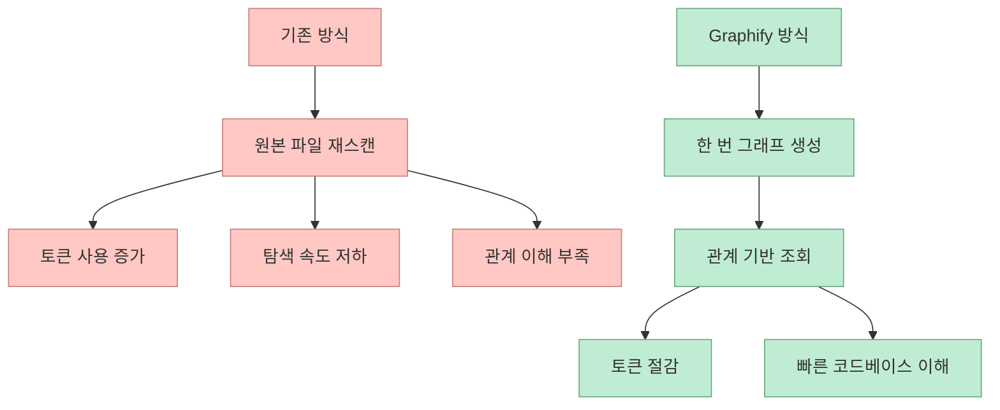
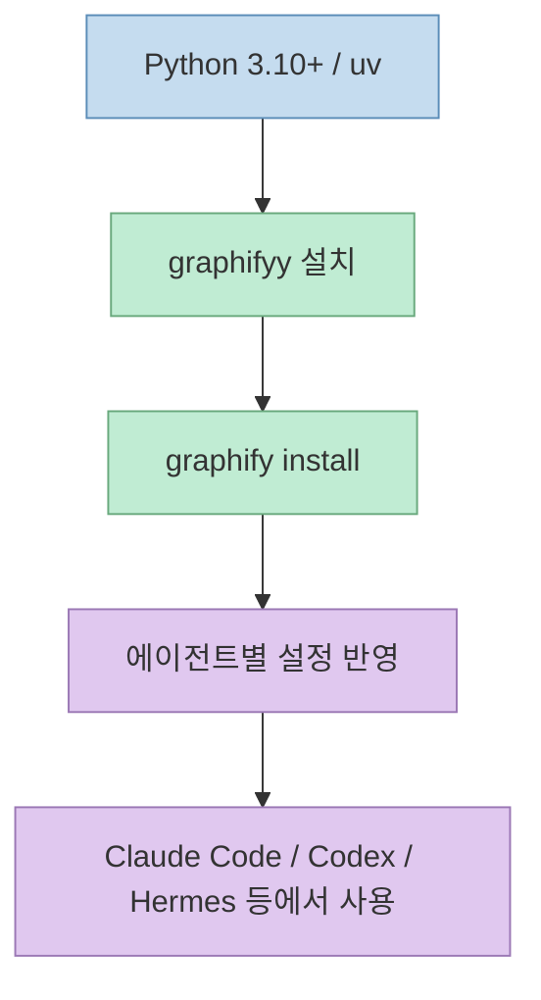
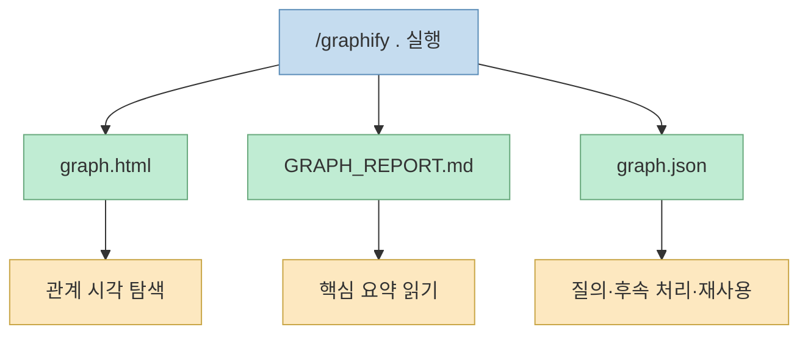
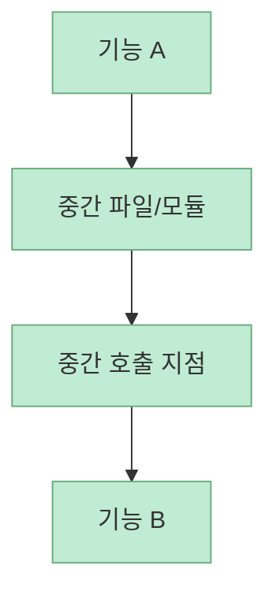
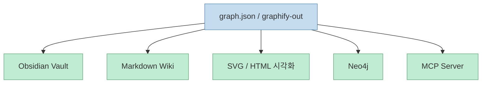

Graphify를 한 문장으로 요약하면, **코드베이스를 매 세션마다 다시 읽게 하지 말고 한 번 구조화해서 계속 조회하게 만드는 도구** 다. 이 영상은 Graphify를 단순히 "예쁜 그래프 시각화 툴"로 소개하지 않는다. 오히려 Claude Code 같은 코딩 에이전트가 왜 자꾸 파일을 다시 뒤지고, 왜 토큰을 많이 쓰고, 왜 코드베이스 이해가 느려지는지부터 짚은 다음, 그 병목을 지식 그래프로 우회하는 방식을 보여 준다.

영상의 핵심 메시지는 꽤 선명하다. 코드, 문서, 이미지, 논문, 심지어 영상까지 한 번 그래프로 구조화해 두면 AI는 원본 파일을 매번 다시 스캔하는 대신 요약된 관계망을 먼저 조회할 수 있다. 그래서 속도, 토큰 비용, 탐색 정확도가 동시에 개선된다는 주장이다.[영상 0:19](https://youtu.be/HQEm4rBKdec?t=19)

<!--more-->

## Sources

- 영상: [Graphify Solves Claude's Biggest Limitation (Finally)](https://youtu.be/HQEm4rBKdec?si=-0M9ti3vyjksPKjv)
- 원본 저장소: [safishamsi/graphify](https://github.com/safishamsi/graphify)

## Graphify는 무엇을 해결하려고 하나

영상 초반 설명에 따르면 Graphify는 Andrej Karpathy의 "LM knowledge base" 아이디어에서 출발한다. 핵심은 raw 파일 폴더를 그대로 질의하는 대신, 한 번 인덱싱해서 LLM이 조회 가능한 지식 베이스로 바꾸자는 것이다.[영상 0:07](https://youtu.be/HQEm4rBKdec?t=7)

발표자는 기존 방식의 문제를 이렇게 잡는다.

- AI 에이전트가 raw 코드와 문서를 매번 다시 읽는다
- 그래서 토큰 사용량이 커진다
- 관계를 이해하기보다 파일 단위 검색에 머문다
- 새 코드베이스 탐색 속도가 느리다

반면 Graphify는 폴더 전체를 **structured knowledge graph** 로 바꾼다. 공식 README도 `/graphify` 명령으로 코드, 문서, PDF, 이미지, 비디오까지 "queryable knowledge graph"로 바꾼다고 설명한다.[GitHub README](https://github.com/safishamsi/graphify)

여기서 중요한 건 Graphify가 단순 검색 인덱스가 아니라 **파일 간 연결 관계를 함께 보존한다** 는 점이다. README는 생성 결과로 `graph.html`, `GRAPH_REPORT.md`, `graph.json` 세 가지를 만든다고 설명한다. 즉, 브라우저용 시각화, 사람이 읽는 리포트, 기계가 다시 질의할 수 있는 그래프 데이터라는 세 층을 함께 남긴다.[GitHub README](https://github.com/safishamsi/graphify)

## 설치 구조가 보여 주는 포지셔닝

영상에서는 Python 3.10+와 `uv`를 전제조건으로 두고 설치를 진행한다.[영상 2:22](https://youtu.be/HQEm4rBKdec?t=142) 공식 README도 같은 전제조건을 명시하고, 추천 설치 명령으로 `uv tool install graphifyy`를 안내한다. 여기서 주의할 점은 **PyPI 패키지 이름은 `graphifyy`지만 CLI 명령은 `graphify`** 라는 것이다.[GitHub README](https://github.com/safishamsi/graphify)

그 다음 단계는 단순 패키지 설치가 아니라 **에이전트 통합** 이다. 영상은 `graphify install`로 스킬을 에이전트 환경에 등록한다고 설명하고, 설치 결과가 `.claude` 폴더와 `claude.md` 형태로 들어간다고 보여 준다.[영상 3:30](https://youtu.be/HQEm4rBKdec?t=210) README도 Claude Code, Codex, OpenCode, Cursor, Hermes, Gemini CLI 등 다양한 플랫폼용 설치 경로를 따로 제공한다.[GitHub README](https://github.com/safishamsi/graphify)

즉 Graphify는 "그래프 파일 생성기"라기보다 **코딩 에이전트가 그래프를 먼저 보도록 유도하는 스킬/하네스 레이어** 에 가깝다.

## 실제 실행 흐름은 "그래프를 먼저 만든다"에 가깝다

영상 데모는 `bookzero.ai`라는 실제 SaaS 코드베이스를 대상으로 진행된다. 발표자는 현재 폴더에서 `/graphify .`를 실행해 거대한 코드베이스를 그래프로 만든다.[영상 4:45](https://youtu.be/HQEm4rBKdec?t=285)

여기서 흥미로운 점은 Graphify가 추출 모드를 묻는다는 것이다.

- code only
- code + docs
- full extraction including images

영상에서는 코드베이스 기존 기능을 조사하는 용도라면 `code only`를 추천한다. 문서까지 봐야 하면 두 번째, 이미지까지 맥락에 중요하면 전체 추출을 쓰라는 설명이다.[영상 5:04](https://youtu.be/HQEm4rBKdec?t=304)

이 선택지는 단순 옵션이 아니다. **무엇을 그래프에 넣느냐가 토큰 비용과 탐색 품질을 함께 바꾼다** 는 뜻이다. README도 코드, SQL 스키마, R 스크립트, 셸 스크립트, 문서, 논문, 이미지, 비디오까지 그래프에 포함할 수 있다고 적고 있다.[GitHub README](https://github.com/safishamsi/graphify)

## 생성 결과물은 3개지만, 의미는 3층이다

영상에서 그래프 생성 후 나온 산출물은 세 가지다.

- `graph.html`
- `graph.report` 계열 리포트
- `graph.json`

공식 README의 표기는 `graphify-out/graph.html`, `GRAPH_REPORT.md`, `graph.json`이다.[GitHub README](https://github.com/safishamsi/graphify)

이 셋의 역할은 서로 다르다.

- `graph.html` 은 관계를 눈으로 확인하는 인터랙티브 맵
- `GRAPH_REPORT.md` 는 핵심 개념, 예상 밖 연결, 추천 질문 같은 요약 리포트
- `graph.json` 은 다시 질의하고 후속 도구로 넘길 수 있는 원본 그래프 데이터

즉 Graphify는 "시각화 파일 하나"를 만드는 것이 아니라, **탐색용 UI + 사람용 요약 + 기계용 메모리 레이어** 를 함께 만든다.

## 핵심 기능 1: 인터랙티브 그래프 탐색

영상은 `graph.html`을 브라우저에서 열어, 특정 레이아웃이나 API 라우트만 켜고 꺼가며 관련 노드와 엣지를 추적하는 장면을 보여 준다.[영상 7:01](https://youtu.be/HQEm4rBKdec?t=421)

여기서 포인트는 "예쁘다"가 아니다. 발표자는 이 인터랙티브 그래프가 **코드베이스 연결을 더 빨리 이해하게 해 준다** 고 말한다. 즉, grep이나 디렉터리 트리로는 잘 보이지 않는 구조적 연결을 시각적으로 좁혀 들어갈 수 있다는 뜻이다.[영상 7:21](https://youtu.be/HQEm4rBKdec?t=441)

새 레포를 처음 읽을 때 가장 비싼 비용은 파일 내용 자체보다 **어디서 어디로 이어지는지 찾는 비용** 인데, Graphify는 이 문제를 노드-엣지 맵으로 푸는 셈이다.

## 핵심 기능 2: path 명령은 "두 지점 사이 연결"을 찾는다

영상에서 가장 실용적으로 보이는 기능은 `path`다. 예시로 admin panel과 AI chat 사이의 최단 연결 경로를 찾는다. 결과는 두 기능을 이어 주는 파일 체인으로 나오고, 어떤 파일이 양쪽을 함께 호출하는지 드러난다.[영상 7:43](https://youtu.be/HQEm4rBKdec?t=463)

이 기능이 실무적으로 좋은 이유는, "이 화면이 저 기능에 왜 영향을 주지?" 같은 질문을 디렉터리 추측이 아니라 **구조적 경로 탐색** 으로 바꾸기 때문이다. README도 `/graphify path "UserService" "DatabasePool"` 같은 예시를 제공한다.[GitHub README](https://github.com/safishamsi/graphify)

## 핵심 기능 3: explain, query, update가 그래프를 운영 가능한 상태로 만든다

영상 후반은 Graphify를 정적인 분석 결과가 아니라 **살아 있는 질의 시스템** 으로 보여 준다.

- `explain` 으로 특정 기능이나 개념 설명 요청
- `query` 로 자유 질문
- `--update` 로 변경된 파일만 다시 추출

`explain` 예시에서는 inbound/outbound 분석이 admin 콘솔 안에서 어떻게 갈라지는지 그래프를 기준으로 설명한다.[영상 8:26](https://youtu.be/HQEm4rBKdec?t=506) `query`는 일반 질의 인터페이스고, `--update`는 전체를 다시 만들지 않고 변경 파일만 반영하는 방식이다.[영상 9:14](https://youtu.be/HQEm4rBKdec?t=554)

README도 `/graphify ./docs --update`와 `/graphify query "..."`, `/graphify explain "RateLimiter"` 같은 공통 명령을 제시한다.[GitHub README](https://github.com/safishamsi/graphify)

이게 중요한 이유는 지식 그래프의 진짜 가치가 **처음 만드는 것** 보다 **계속 유지되는 것** 에 있기 때문이다.

## Obsidian, Wiki, SVG, Neo4j, MCP 서버까지 나가는 이유

영상은 Graphify가 단지 코드 그래프 생성으로 끝나지 않는다는 점도 보여 준다. 특정 docs 폴더만 대상으로 Obsidian vault를 만들 수 있고, 그 밖에 wiki, SVG, Neo4j, MCP 서버 생성까지 가능하다고 말한다.[영상 9:53](https://youtu.be/HQEm4rBKdec?t=593)

공식 README도 wiki 생성, SVG export, Neo4j 지원, MCP stdio server 옵션, 비디오/오디오 전사, PDF 추출 등 다양한 extras를 안내한다.[GitHub README](https://github.com/safishamsi/graphify)

이 부분은 Graphify의 정체성을 잘 보여 준다. Graphify는 단지 Claude Code 보조 도구가 아니라, **코드베이스 이해를 여러 소비 채널로 배포하는 변환기** 에 가깝다.

## "토큰 27배 절감"은 어떻게 읽어야 하나

영상 설명란은 발표자가 자신의 실제 SaaS에서 Claude Code 토큰 사용량을 27배 줄였다고 주장한다. 본문 데모에서도 그래프 생성 결과를 보여 주며 "27 times token reductions"라고 말한다.[영상 6:24](https://youtu.be/HQEm4rBKdec?t=384)

다만 이 수치는 **자기 보고형 벤치마크** 로 읽는 편이 맞다. 프로젝트 크기, 질문 유형, 그래프 추출 모드, 그래프 최신성, 어떤 에이전트가 어떻게 그래프를 우선 사용하도록 설정됐는지에 따라 절감 폭은 크게 달라질 수 있다. 영상이 보여 주는 건 "항상 27배"라는 보편식이 아니라, **재스캔 비용이 큰 프로젝트일수록 이득이 커질 수 있다** 는 방향성으로 해석하는 편이 안전하다.

실제로 README도 팀 워크플로우에서 `graphify-out/`을 커밋해 팀 전체가 같은 맵에서 시작하게 하라고 권한다. 이것 역시 핵심이 "절대 수치"보다 **반복 재탐색을 줄이는 운영 방식** 에 있음을 보여 준다.[GitHub README](https://github.com/safishamsi/graphify)

## 결국 Graphify가 잘 맞는 곳

영상 초반 발표자는 Graphify가 특히 **write보다 read가 많은 사람**, 즉 연구, 탐색, 코드베이스 이해 쪽에 더 잘 맞는다고 말한다.[영상 1:02](https://youtu.be/HQEm4rBKdec?t=62)

이 관찰은 꽤 정확하다. Graphify는 다음 상황에서 특히 힘을 발휘할 가능성이 크다.

- 새 레포를 빠르게 이해해야 할 때
- 문서와 코드가 함께 얽힌 프로젝트일 때
- 팀이 같은 구조적 맵을 공유해야 할 때
- Claude Code, Codex, Hermes 같은 여러 에이전트를 혼용할 때
- 파일 검색보다 관계 질의가 더 자주 필요할 때

반대로 파일 수가 적고 구조가 단순한 프로젝트에서는 초기 그래프 생성 비용이 이득보다 작을 수도 있다. 즉, Graphify는 모든 프로젝트에 기본 탑재할 도구라기보다, **컨텍스트 비용이 커진 코드베이스에서 특히 강한 메모리 레이어** 로 보는 편이 맞다.

## 핵심 요약

Graphify의 본질은 "코드베이스를 그래프로 예쁘게 그린다"가 아니다. 

- 코드와 문서를 매번 다시 읽는 비용을 줄이고 
- 파일 간 관계를 구조적으로 남기고 
- Claude Code 같은 에이전트가 raw 파일 대신 그래프를 먼저 보게 만들고 
- path, explain, query, update 같은 질의 루프를 제공하며 
- Obsidian, Wiki, Neo4j, MCP 서버로 그 결과를 재배포한다. 

즉, Graphify는 검색 도구라기보다 **코딩 에이전트용 프로젝트 메모리 계층** 에 더 가깝다.

## 결론

이 영상이 설득력 있는 이유는 Graphify를 "새로운 AI 툴"로 포장하지 않고, Claude Code의 가장 비싼 병목 중 하나인 **반복적 코드베이스 재탐색** 문제의 해법으로 설명하기 때문이다. 공식 README까지 같이 보면 더 분명해진다. Graphify의 가치는 단순 그래프 생성이 아니라, 에이전트가 프로젝트를 읽는 기본 경로를 **grep-first에서 graph-first로 바꾸는 것** 에 있다. 대규모 레포나 문서-코드 복합 프로젝트를 자주 다룬다면, 이 방향은 단순한 편의 기능이 아니라 작업 방식 자체를 바꾸는 레이어가 될 수 있다.
