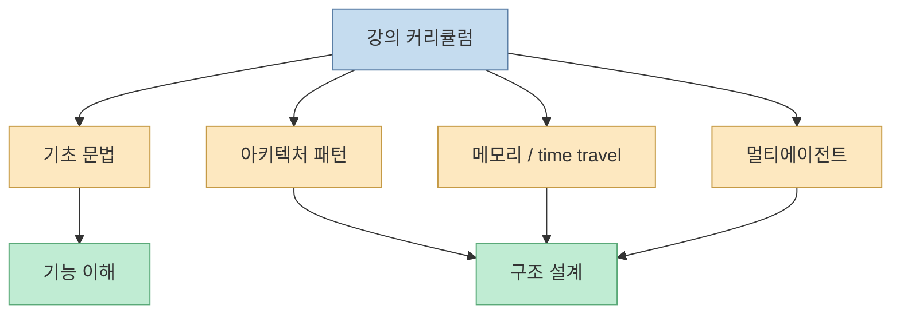
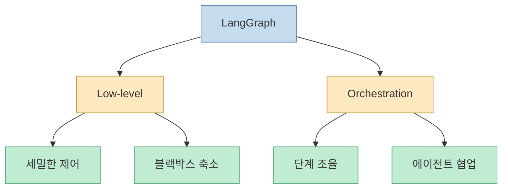
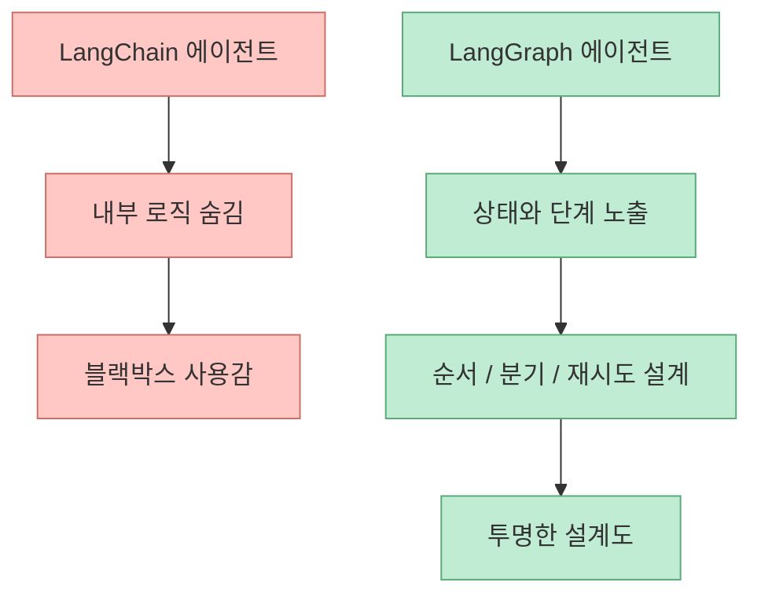
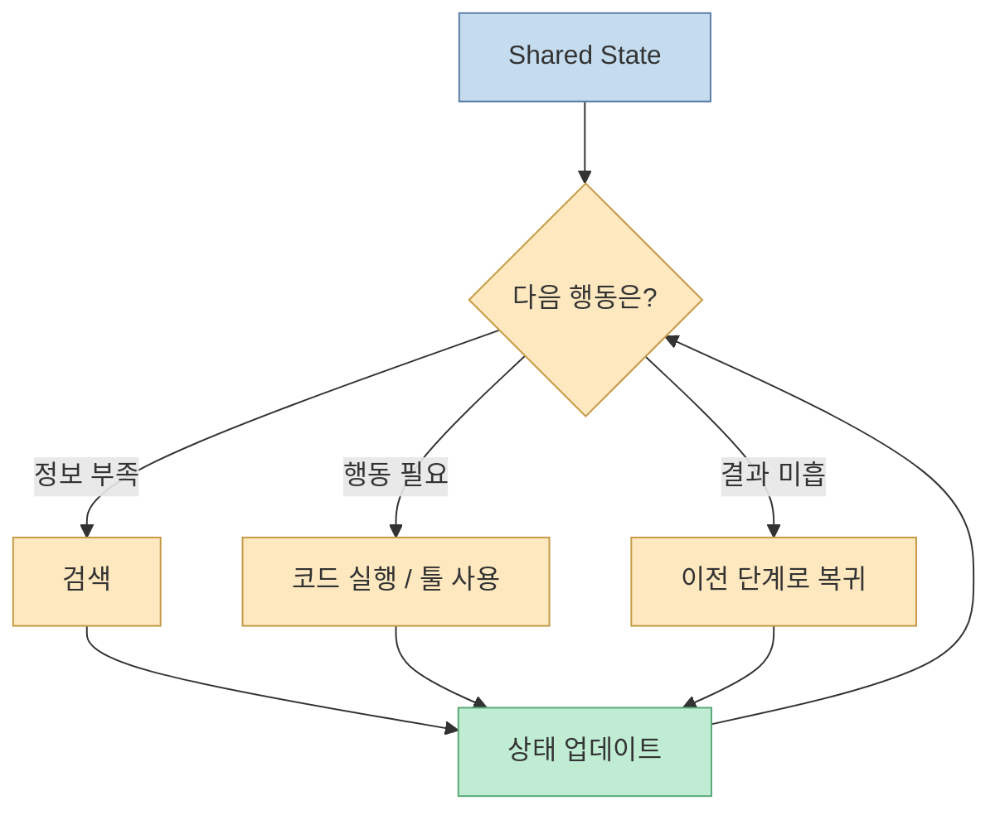
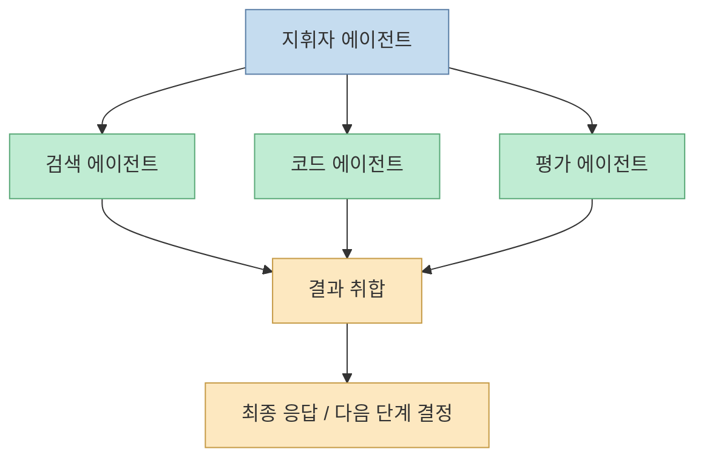
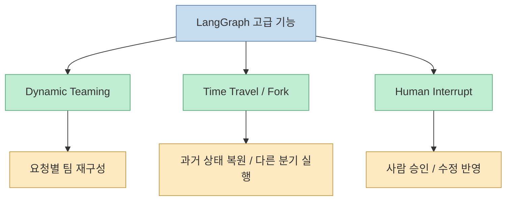
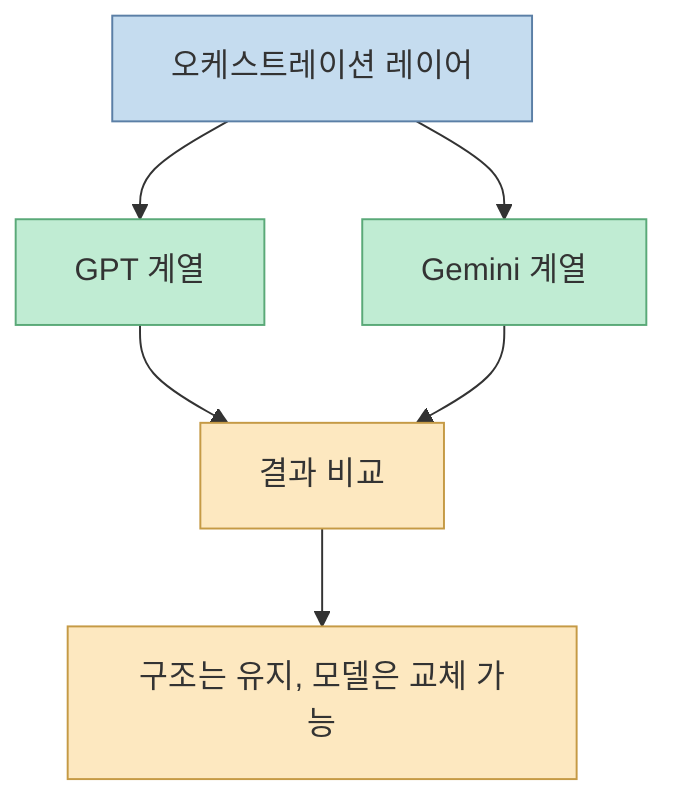

이 영상의 핵심 메시지는 아주 분명합니다. LangGraph는 LangChain의 또 다른 편의 기능이 아니라, **에이전트가 어떻게 움직일지 개발자가 직접 설계할 수 있게 해 주는 저수준 런타임** 이라는 것입니다. 발표자는 기존 LangChain 에이전트를 내부 로직이 숨겨진 블랙박스에 가깝다고 설명하고, LangGraph는 그 반대로 상태, 흐름, 되돌리기, 사람 개입, 멀티에이전트 협업을 노출하는 구조라고 말합니다. 즉 "알아서 해줘"에서 "이 순서로 움직여"로 넘어가는 것이 이 강의의 출발점입니다. [02:25](https://youtu.be/3My9sphTxtk?t=145) [03:05](https://youtu.be/3My9sphTxtk?t=185)

<!--more-->

## Sources

- <https://youtu.be/3My9sphTxtk?si=wTAz2L309mYRnfVr>

## 이 강의는 '랭그래프 문법'보다 '에이전트 시스템 설계'를 가르치려 한다

오프닝에서 발표자는 이 강의를 5개 파트로 나눕니다.

- 오리엔테이션과 사전 설정
- LangGraph 기초 문법
- 다양한 에이전트 아키텍처
- 메모리와 time travel / forking
- 멀티에이전트 협업

즉 목표가 단순 API 사용법이 아니라, **실제 프로덕션에 가까운 에이전트 시스템을 설계하는 법** 에 있다는 점을 먼저 밝힙니다. [01:19](https://youtu.be/3My9sphTxtk?t=79) [02:08](https://youtu.be/3My9sphTxtk?t=128)

그래서 이 영상은 "에이전트 하나 만드는 법"보다, **에이전트 시스템을 설계하는 사고방식** 에 더 가깝습니다.

## LangGraph의 정의는 '저수준 오케스트레이션 프레임워크이자 런타임'이다

발표자는 공식 문서 정의를 인용해 LangGraph를 "고도화된 에이전트를 구축하고 관리하고 배포하기 위한 저수준 오케스트레이션 프레임워크이자 런타임"으로 설명합니다. 여기서 중요한 단어는 두 개입니다.

- 저수준
- 오케스트레이션

저수준이라는 말은 사용자가 개입할 수 있는 디테일이 깊다는 뜻이고, 오케스트레이션은 여러 판단과 작업을 흐름으로 조율한다는 뜻입니다. [02:25](https://youtu.be/3My9sphTxtk?t=145) [02:43](https://youtu.be/3My9sphTxtk?t=163)

즉 LangGraph는 모델에게 일을 맡기는 프레임워크라기보다, **모델이 일하는 흐름을 설계하는 프레임워크** 로 이해하는 편이 정확합니다.

## LangChain과의 차이는 '블랙박스 vs 투명한 설계도'로 설명된다

이 영상에서 가장 이해하기 쉬운 비유는 이 부분입니다. 발표자는 기존 LangChain 에이전트를 내부 로직이 감춰진 블랙박스처럼 설명합니다. 반면 LangGraph는 에이전트가 어떤 고민을 하고, 어떤 순서로 움직이고, 언제 다시 돌아가고, 어떤 전문 에이전트를 호출할지를 개발자가 직접 설계할 수 있는 투명한 구조라고 말합니다. [03:02](https://youtu.be/3My9sphTxtk?t=182) [03:23](https://youtu.be/3My9sphTxtk?t=203)

이 차이는 굉장히 큽니다. 에이전트가 실험실 데모를 넘어서 프로덕트에 들어가면, "왜 이렇게 행동했는지"를 설명할 수 있어야 하기 때문입니다.

## 오케스트레이션의 본질은 상태 기반 판단이다

영상은 LangGraph를 단순 노드 연결 도구로 설명하지 않습니다. 핵심은 `state` 입니다. 발표자는 공유 메모리인 state를 기반으로:

- 지금 검색이 필요한지
- 코드를 실행해야 하는지
- 결과가 부족해 다시 처음으로 돌아가야 하는지

를 매 순간 판단한다고 설명합니다. [03:44](https://youtu.be/3My9sphTxtk?t=224) [03:56](https://youtu.be/3My9sphTxtk?t=236)

즉 LangGraph의 "그래프"는 단순 시각적 개념이 아니라, **상태를 중심으로 한 제어 흐름 그래프** 입니다.

## 지휘자 에이전트 비유는 멀티에이전트 설계의 핵심을 잘 설명한다

발표자는 오케스트레이션을 지휘자에 비유합니다. 개별 에이전트가 제멋대로 연주하는 것이 아니라, 지휘자 역할의 메인 에이전트가 각 전문 에이전트를 묶고, 결과를 취합하고, 필요한 시점에 다시 분배하는 구조라는 뜻입니다. [03:33](https://youtu.be/3My9sphTxtk?t=213) [04:06](https://youtu.be/3My9sphTxtk?t=246)

이 비유는 왜 LangGraph가 멀티에이전트에 잘 맞는지도 설명해 줍니다. 핵심은 에이전트 수가 아니라, **누가 어떤 순서로 누구를 호출할지에 대한 명시적 설계** 입니다.

## 이 강의가 약속하는 핵심 기능은 세 가지다

오리엔테이션 구간만 봐도, 발표자는 LangGraph가 제공하는 차별점을 세 축으로 설명합니다.

- 동적 팀 구성과 업무 분배
- time travel / fork
- human interrupt

### 1. 동적 팀 구성
요청 성격과 양에 따라 지휘자 에이전트가 필요한 팀을 동적으로 꾸리고 결과를 취합하는 구조를 만들 수 있다고 설명합니다. [04:17](https://youtu.be/3My9sphTxtk?t=257)

### 2. Time travel / fork
과거 상태로 돌아가 다른 분기에서 다시 실행하는 개념을 다룬다고 설명합니다. [04:46](https://youtu.be/3My9sphTxtk?t=286)

### 3. Human interrupt
에이전트가 막혔을 때 사람의 승인이나 수정 입력을 받아 안전하게 이어 가는 구조를 배운다고 말합니다. [04:57](https://youtu.be/3My9sphTxtk?t=297)

이 세 기능은 모두 공통점을 가집니다. 에이전트를 단순히 한 번 호출하고 끝내는 것이 아니라, **상태를 가진 장기 실행 시스템으로 본다** 는 점입니다.

## 왜 '서비스 수준' 에이전트 얘기가 여기서 나오는가

영상 오프닝에서 발표자는 구독자 1만 명이 되면 지금까지 배운 내용을 바탕으로 "프로덕트 수준의 AI 에이전트 서비스"를 구현하는 강의를 만들겠다고 말합니다. 이 언급은 단순 홍보가 아니라, 지금 다루는 내용이 이미 **서비스 개발 단계의 문제들** 에 맞춰져 있음을 암시합니다. [00:59](https://youtu.be/3My9sphTxtk?t=59)

왜냐하면 서비스 수준에서는:

- 멀티스텝 제어
- 롤백 가능성
- 사람 개입
- 멀티에이전트 분업
- 모델 교체와 비교

가 모두 필요해지기 때문입니다.

## 모델 비교까지 포함하는 이유는 오케스트레이션이 모델 독립적이어야 하기 때문이다

영상 후반 오리엔테이션에서 발표자는 GPT 계열뿐 아니라 Gemini 계열도 함께 호출해 결과를 비교해 보겠다고 말합니다. [05:08](https://youtu.be/3My9sphTxtk?t=308) 이는 단순 모델 홍보가 아니라, 오케스트레이션 레이어가 특정 모델 하나에 종속되지 말아야 한다는 점을 암시합니다.

이건 꽤 중요한 설계 감각입니다. 좋은 에이전트 시스템은 특정 모델의 순간 성능보다, **모델이 바뀌어도 유지되는 제어 구조** 를 가져야 하기 때문입니다.

## 이 영상이 시사하는 실제 학습 포인트

오리엔테이션만 봐도 이 강의가 가르치려는 핵심은 분명합니다.

- 에이전트를 함수 호출 묶음으로 보지 말 것
- 상태를 가진 그래프로 볼 것
- 지휘자와 워커의 역할을 분리할 것
- 실패 / 부족 / 재시도를 흐름 안에 넣을 것
- 사람 개입을 예외가 아니라 설계 요소로 다룰 것

즉 LangGraph를 배운다는 것은 라이브러리 API를 외우는 것보다, **에이전트 시스템을 제어 흐름으로 사고하는 훈련** 에 더 가깝습니다.

## 핵심 요약

- LangGraph는 고도화된 에이전트를 구축·관리·배포하기 위한 저수준 오케스트레이션 프레임워크이자 런타임으로 설명된다
- LangChain 에이전트가 블랙박스에 가깝다면, LangGraph는 상태와 흐름을 개발자가 명시적으로 설계할 수 있는 투명한 구조를 제공한다
- 핵심은 `state` 기반 판단과 오케스트레이션이다
- 지휘자 에이전트가 여러 전문 에이전트를 묶고 분배하는 멀티에이전트 구조가 중요한 설계 포인트다
- 강의가 약속하는 고급 기능은 동적 팀 구성, time travel / fork, human interrupt다
- 따라서 LangGraph는 "에이전트 하나 만들기"보다 "서비스 수준의 에이전트 시스템 설계"에 더 가깝다

## 결론

이 영상이 LangGraph를 설명하는 방식은 아주 적절합니다. 핵심은 성능이 아니라 **통제 가능성** 입니다.

에이전트가 복잡한 비즈니스 로직을 다뤄야 할수록, 우리는 더 이상 "알아서 해줘"에 만족할 수 없습니다. 필요한 것은 에이전트의 판단 순서, 상태, 복귀 지점, 사람 개입 지점을 설계하는 능력입니다.

그래서 LangGraph를 배워야 하는 이유를 한 줄로 줄이면 이렇습니다.

**좋은 프롬프트를 쓰는 법이 아니라, 에이전트가 어떤 흐름으로 일할지 설계하는 법을 배우기 위해서입니다.**
