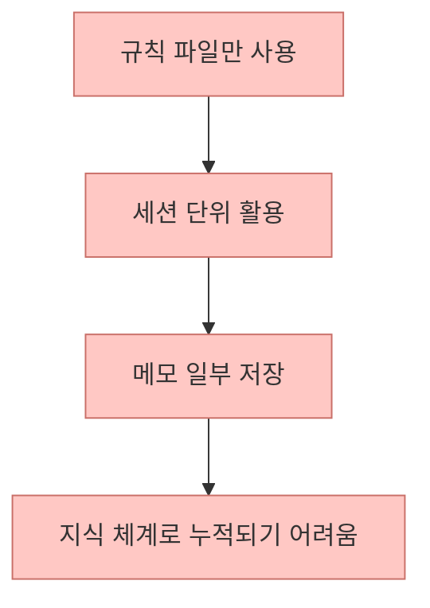
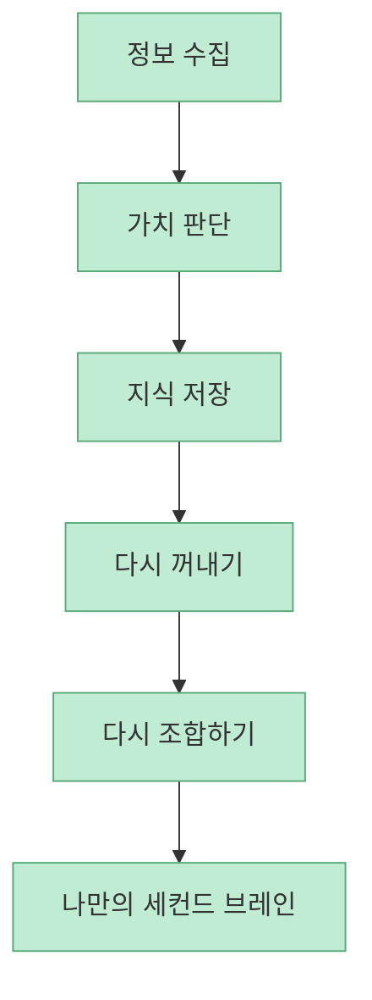
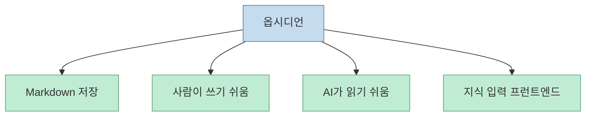
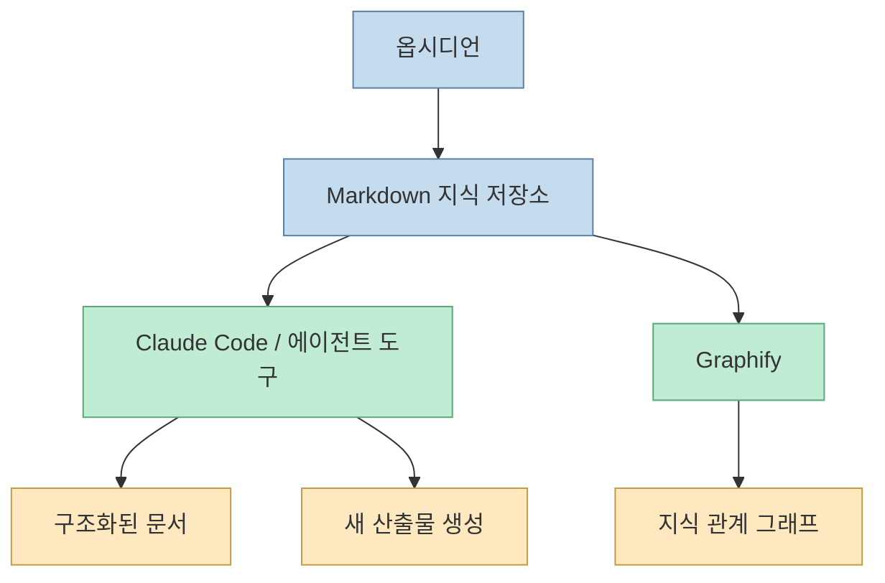
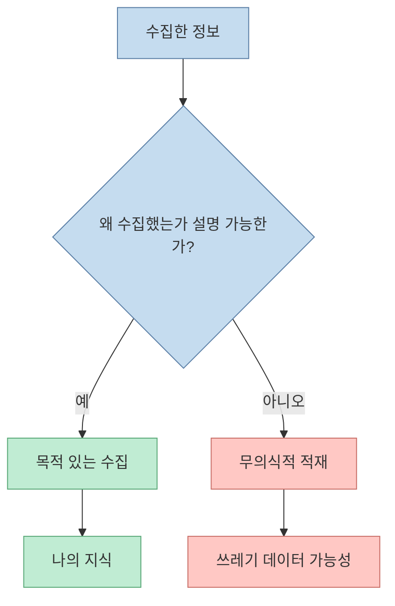
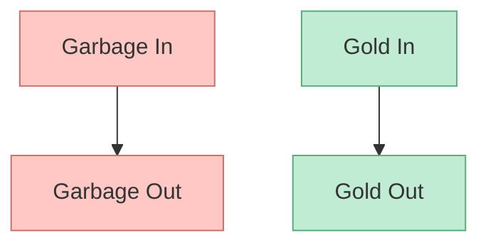
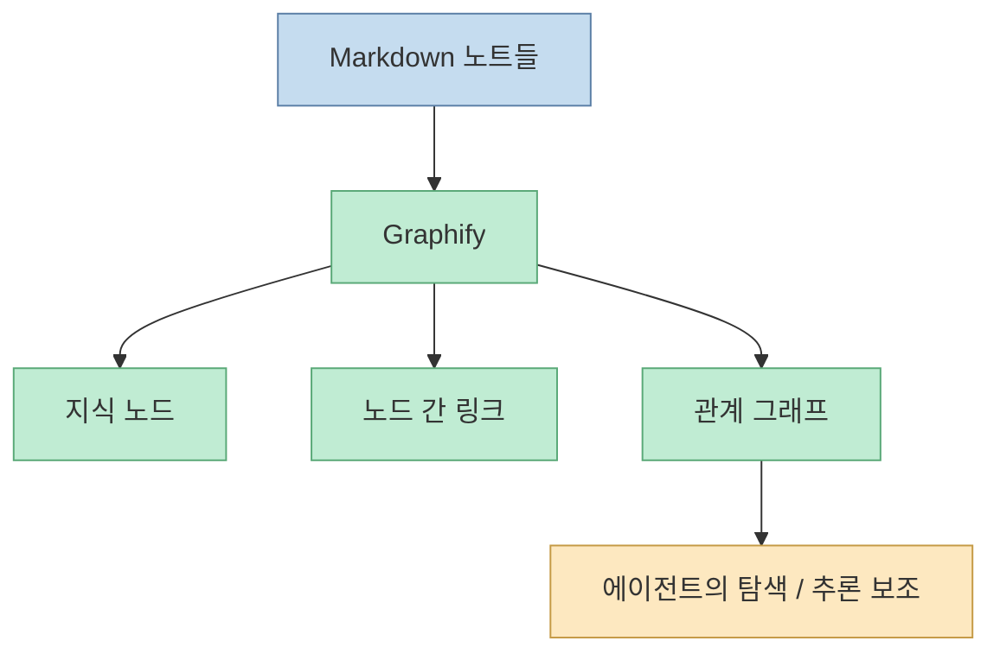
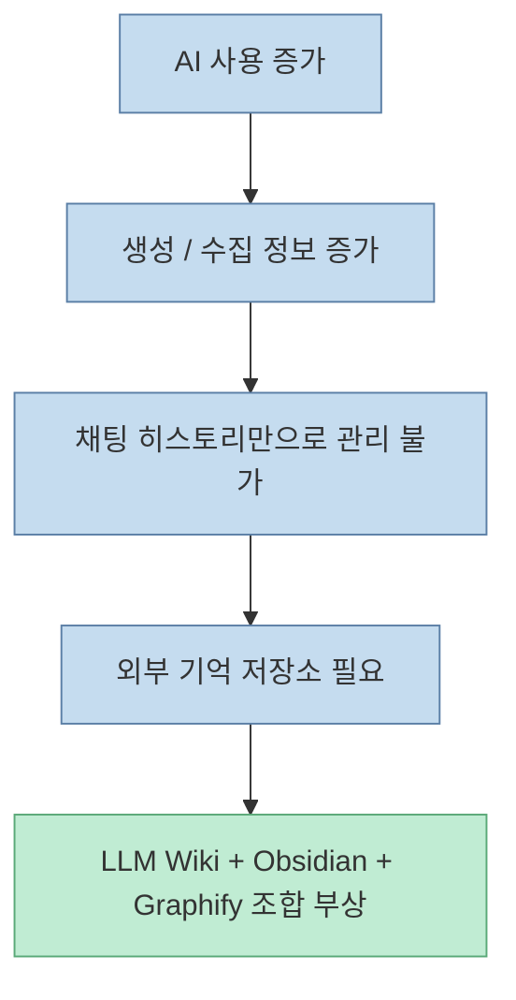

이 영상의 핵심은 도구 소개가 아닙니다. 더 정확히 말하면, **왜 지금 Claude Code × Obsidian × LLM Wiki × Graphify 조합이 갑자기 뜨는가** 를 설명하려는 시도입니다. 발표자는 단순히 `CLAUDE.md` 나 `agent.md` 파일만으로는 재활용 가능한 개인 지식 체계를 만들기 어렵다고 말합니다. 그래서 필요한 것이 옵시디언 같은 Markdown 기반 지식 저장소와, 그 위를 읽고 쓰는 Claude Code, 그리고 그것을 LLM Wiki 구조와 그래프 레이어로 연결하는 방식이라는 것입니다. [00:09](https://youtu.be/cNlvrU-KcRg?t=9) [01:31](https://youtu.be/cNlvrU-KcRg?t=91)

<!--more-->

## Sources

- <https://youtu.be/cNlvrU-KcRg?si=z3uDF4hwmfFbID2Y>

## 문제는 메모가 없어서가 아니라, 메모가 '재활용 가능한 구조'가 아니라는 것이다

영상 초반에서 발표자는 우리가 보통 `CLAUDE.md`, `Gemini.md`, `agent.md` 같은 파일을 세팅하지만, 그렇게만 해서는 대화가 그 세션에서 끝나거나 메모리가 일부 남더라도 재활용 가능한 지식 체계로 쌓이기 어렵다고 설명합니다. [01:12](https://youtu.be/cNlvrU-KcRg?t=72) [01:42](https://youtu.be/cNlvrU-KcRg?t=102)

즉 문제는 지식이 없어서가 아니라, **AI가 다시 꺼내 쓰기 좋은 형태로 쌓이지 않는다는 것** 입니다.

## 그래서 세컨드 브레인이 필요하다는 주장으로 이어진다

발표자는 결국 AI 도구를 쓸수록 내가 가치 있다고 판단한 정보와 지식을 계속 재활용하고, 다시 끄집어내고, 내 생각처럼 다시 조합해 줄 구조가 필요하다고 말합니다. 이걸 세컨드 브레인이라고 부르고, 지금까지의 규칙 파일 세팅만으로는 한계가 있었다고 봅니다. [01:44](https://youtu.be/cNlvrU-KcRg?t=104) [02:11](https://youtu.be/cNlvrU-KcRg?t=131)

이 관점은 중요합니다. 세컨드 브레인은 메모 앱 이름이 아니라, **지식이 누적되고 재조합되는 운영 구조** 를 뜻합니다.

## 왜 옵시디언이 밑바탕으로 자주 언급되는가

영상은 옵시디언이 떠오르는 이유를 꽤 명확하게 설명합니다.

- Markdown 기반이다
- Claude Code 같은 도구가 읽고 쓰기 쉽다
- 지식 관리용 데이터베이스처럼 쓸 수 있다
- 사람 입력용 프런트엔드 역할을 한다

발표자는 Karpathy가 옵시디언을 "human input frontend"처럼 이야기한 점도 언급합니다. [02:16](https://youtu.be/cNlvrU-KcRg?t=136) [03:10](https://youtu.be/cNlvrU-KcRg?t=190)

즉 옵시디언은 AI 그 자체가 아니라, **AI가 잘 다룰 수 있는 지식 저장소의 UI 계층** 으로 쓰인다는 뜻입니다.

## Claude Code의 역할은 저장소를 '작동하는 지식 시스템'으로 바꾸는 것이다

영상에서는 옵시디언에 입력된 Markdown을 Claude Code나 OpenCode 같은 도구가 처리해서 구조화된 문서나 새로운 산출물로 바꿔 준다고 설명합니다. [03:22](https://youtu.be/cNlvrU-KcRg?t=202) [03:57](https://youtu.be/cNlvrU-KcRg?t=237)

즉 역할 분담은 대략 이렇습니다.

- 옵시디언: 지식 입력과 저장
- Claude Code: 읽기, 가공, 연결, 재생성
- Graphify: 지식 관계를 그래프로 활용

이 구성이 중요한 이유는, 지식을 저장만 하는 것이 아니라 **AI가 다시 읽고, 정리하고, 관계를 강화하는 순환 구조** 가 생기기 때문입니다.

## 발표자가 가장 강조하는 것은 '목적 있는 수집'이다

이 영상의 가장 좋은 부분은 여기입니다. 발표자는 옵시디언에 쌓는 지식이 그냥 인터넷에서 주워 담은 잡동사니가 아니라, **내가 왜 수집했는지 설명할 수 있는 목적 있는 수집** 이어야 한다고 말합니다. [04:31](https://youtu.be/cNlvrU-KcRg?t=271) [04:52](https://youtu.be/cNlvrU-KcRg?t=292)

이 기준은 굉장히 중요합니다.

- 왜 저장했는지 말할 수 있는가
- 어떤 가치 때문에 모았는가
- 내 작업과 어떤 관계가 있는가

이런 기준이 없으면 저장된 데이터는 곧바로 쓰레기 데이터가 된다고 지적합니다.

즉 LLM Wiki의 품질은 모델보다 먼저, **무엇을 어떤 의도로 저장했는가** 에서 갈립니다.

## "Garbage in, garbage out" 대신 "Gold in, gold out"

발표자는 이 흐름을 설명하면서 오랜 격언인 `garbage in, garbage out`을 끌어온 뒤, 자신은 이를 `gold in, gold out`이라고 부른다고 말합니다. [05:21](https://youtu.be/cNlvrU-KcRg?t=321) [05:33](https://youtu.be/cNlvrU-KcRg?t=333)

이 표현이 중요한 이유는, LLM Wiki나 세컨드 브레인이 단순 저장량 경쟁이 아니라 **선별과 의미 부여의 문제** 임을 정확히 짚기 때문입니다.

즉 AI가 똑똑해지길 기대하기 전에, **AI에게 먹이는 재료를 금처럼 선별해야 한다** 는 것입니다.

## Graphify가 왜 같이 언급되는가

영상 초반에서 발표자는 Graphify를 "지식 내용을 그래프로 활용해서 에이전트 하네스 도구들이 잘 활용할 수 있도록 제공해 주는 도구"라고 소개합니다. [00:20](https://youtu.be/cNlvrU-KcRg?t=20)

이 조합이 의미 있는 이유는 단순 Markdown 페이지들의 집합을 넘어:

- 노드
- 링크
- 관계
- 연결 경로

를 그래프 구조로 다룰 수 있게 만들기 때문입니다.

즉 옵시디언이 문서 저장소라면, Graphify는 그 문서들 사이의 **관계층을 더 명시적으로 드러내는 장치** 로 볼 수 있습니다.

## 왜 이 조합이 지금 '메타'처럼 보이는가

발표자는 Karpathy가 바이브 코딩, 컨텍스트 엔지니어링, 그리고 LLM Wiki 같은 개념을 던질 때마다 큰 파도가 왔다고 말합니다. [06:20](https://youtu.be/cNlvrU-KcRg?t=380) [06:48](https://youtu.be/cNlvrU-KcRg?t=408) 이 영상은 그 흐름 안에서, Claude Code × Obsidian × LLM Wiki × Graphify 조합이 다음 메타처럼 떠오른다고 해석합니다.

이 해석이 설득력 있는 이유는 분명합니다.

- 생성 AI 사용량은 계속 늘어난다
- 지식 저장량도 폭증한다
- 단순 채팅 히스토리로는 재활용이 어렵다
- 결국 구조화된 외부 기억이 필요하다

즉 이 조합이 뜨는 이유는 유행어 때문이 아니라, **AI 사용량 증가가 개인 지식 운영 문제를 폭발시켰기 때문** 입니다.

## 핵심 요약

- 이 영상은 `CLAUDE.md` 같은 규칙 파일만으로는 재활용 가능한 개인 지식 체계를 만들기 어렵다고 본다
- 해결책으로 떠오르는 것이 Claude Code × Obsidian × LLM Wiki × Graphify 조합이다
- 옵시디언은 Markdown 기반 지식 입력 프런트엔드이자 저장소 역할을 한다
- Claude Code 같은 에이전트 도구는 그 저장소를 읽고 가공하고 산출물로 다시 재생성하는 실행 엔진 역할을 한다
- Graphify는 문서 집합 위에 관계 그래프를 씌워 탐색과 추론을 돕는 레이어다
- 가장 중요한 원칙은 '목적 있는 수집'이며, 발표자는 이를 `gold in, gold out`이라고 표현한다

## 결론

이 영상이 주는 가장 큰 통찰은 간단합니다.

**LLM Wiki의 핵심은 메모를 많이 저장하는 것이 아니라, AI가 다시 쓸 수 있는 좋은 재료를 의도적으로 축적하는 것이다.**

옵시디언은 그 재료를 담는 그릇이고, Claude Code는 그 재료를 가공하는 손이며, Graphify는 그 재료들의 관계를 드러내는 지도에 가깝습니다. 결국 이 조합의 가치는 새로운 앱 하나를 더 쓰는 데 있지 않고, **내 지식이 점점 더 AI 친화적인 자산으로 바뀌는 순환 구조** 를 만드는 데 있습니다.
