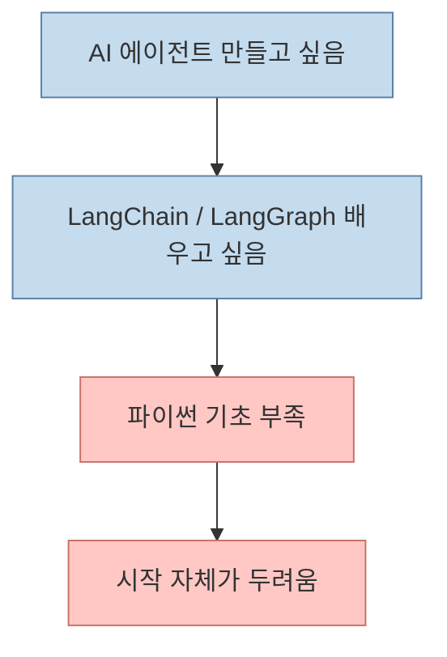
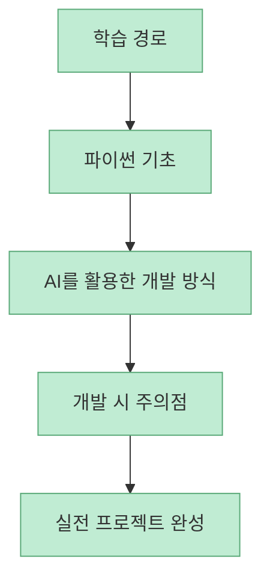
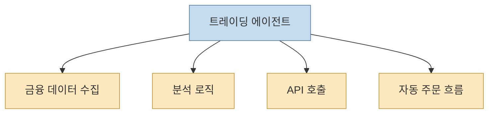
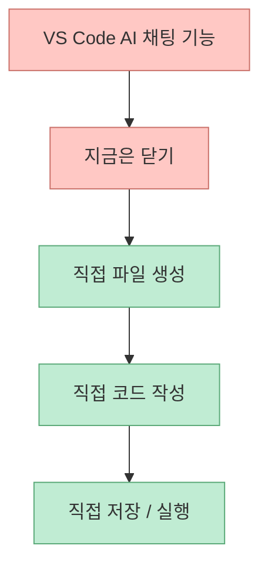
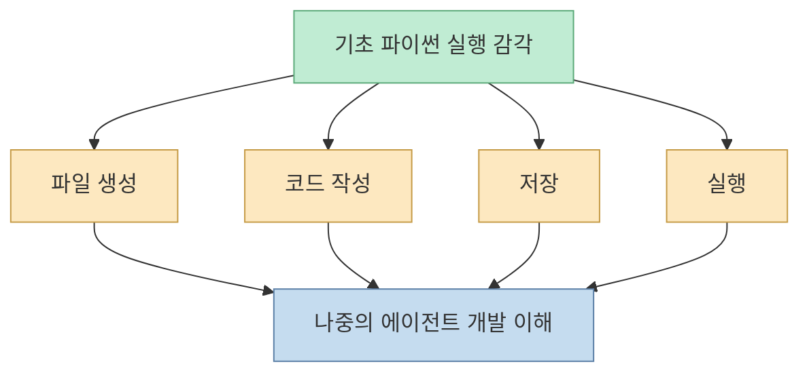
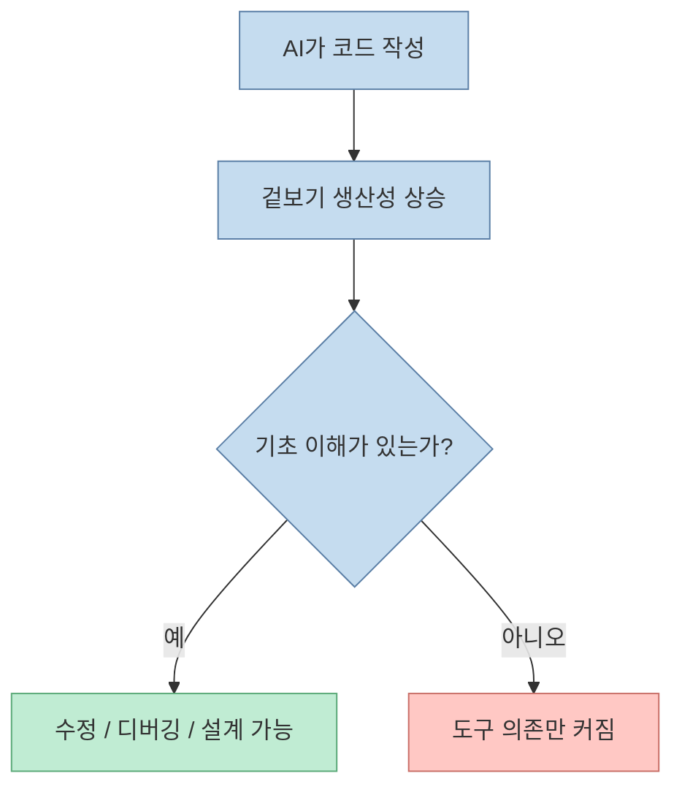

이 영상의 가장 중요한 메시지는 의외로 단순합니다. **LangChain과 LangGraph를 배우고 싶다면, 먼저 파이썬 기초를 통과해야 한다** 는 것입니다. 발표자는 실제로 많은 시청자가 "AI 에이전트를 만들어 보고 싶지만 파이썬 기초가 부족해서 시작이 두렵다"고 말했다고 전합니다. 그래서 이 강의는 파이썬 문법을 가르치는 것에 그치지 않고, 왜 AI 시대에도 여전히 기초 코딩 체력이 필요한지, 그리고 그 기초가 최종적으로 주식 트레이딩 에이전트 같은 프로젝트로 어떻게 이어지는지 보여 주려 합니다. [00:47](https://youtu.be/lK2err6Sq_M?t=47) [01:15](https://youtu.be/lK2err6Sq_M?t=75)

<!--more-->

## Sources

- <https://youtu.be/lK2err6Sq_M?si=xeIlKEYRF0jrtfA4>

## 이 강의가 겨냥하는 문제는 '기술 부족'보다 '시작의 두려움'이다

오프닝에서 발표자는 랭체인과 랭그래프를 배우고 싶지만, 파이썬 기초가 부족해 시작을 망설인다는 피드백이 많았다고 설명합니다. 또 바이브 코딩이 유행하지만, 코딩 지식이 전혀 없으면 오히려 잘못 건드릴까 봐 더 두렵다는 지점도 짚습니다. [00:47](https://youtu.be/lK2err6Sq_M?t=47) [00:56](https://youtu.be/lK2err6Sq_M?t=56)

즉 이 강의의 출발점은 "문법을 더 가르치자"가 아니라, **에이전트 개발 입문 장벽을 낮추자** 는 데 있습니다.

## 발표자가 제안하는 학습 순서는 '기초 → AI 활용 → 프로젝트'다

영상 초반은 다섯 시간짜리 풀강의의 성격을 비교적 명확하게 정의합니다.

- 파이썬 기초 문법부터 시작
- AI를 활용해 개발하는 방법 안내
- 개발할 때 주의할 점 설명
- 최종적으로는 주식 데이터를 분석하고 주문까지 가능한 프로젝트 구현

[01:03](https://youtu.be/lK2err6Sq_M?t=63) [01:17](https://youtu.be/lK2err6Sq_M?t=77)

이 구조가 중요한 이유는, AI 도구를 바로 붙이는 것이 아니라 **기초 체력과 실행 감각을 먼저 만든 뒤 AI를 얹는 방식** 이기 때문입니다.

## 왜 하필 '주식 트레이딩 에이전트'가 종착점인가

발표자는 이번 풀강의의 최종 결과물로 "주식 데이터를 AI가 분석하고 실제 주문까지 할 수 있는 하나의 프로젝트"를 언급합니다. [01:17](https://youtu.be/lK2err6Sq_M?t=77) 이 설정은 단순히 흥미를 끌기 위한 주제가 아닙니다. 트레이딩 에이전트는 다음 요소를 한꺼번에 요구하기 때문입니다.

- 데이터 읽기
- 조건 판단
- 외부 API 사용
- 자동화 로직
- 실수 비용이 큰 실행 흐름

즉 이 주제는 단순 예제가 아니라, **파이썬 기초가 실제 에이전트형 자동화로 연결되는 대표 사례** 로 선택된 셈입니다.

## 중요한 포인트는 'AI 도움을 잠시 꺼 둔다'는 선언이다

영상 초반 실습에서 발표자는 VS Code를 열고 오른쪽 채팅 기능을 보여 준 뒤, 지금 단계에서는 사용하지 않겠다고 말합니다. AI에게 바로 코드 작성을 맡기지 않고, 먼저 직접 파일을 만들고, `hello.py`를 작성하고, `print("Hello World")`를 실행하는 감각을 익히겠다는 뜻입니다. [04:42](https://youtu.be/lK2err6Sq_M?t=282) [05:17](https://youtu.be/lK2err6Sq_M?t=317)

이건 단순 교육 방식의 취향 문제가 아닙니다. 에이전트를 잘 쓰려면 결국:

- 파일이 무엇인지
- 실행이 무엇인지
- 오류가 어디서 나는지
- 저장과 수정이 어떤 흐름인지

를 이해해야 하기 때문입니다.

## 'Hello World'가 여전히 중요한 이유

발표자는 설치가 끝나면 바탕화면에 `python-workspace` 폴더를 만들고, VS Code에서 `hello.py` 파일을 생성한 뒤 `print("Hello World")`를 실행해 봅니다. [03:45](https://youtu.be/lK2err6Sq_M?t=225) [05:44](https://youtu.be/lK2err6Sq_M?t=344)

이 장면은 흔해 보이지만, AI 시대에는 오히려 더 중요합니다. 왜냐하면 에이전트와 프레임워크는 추상화를 높여 주지만, 그 밑바닥은 여전히:

- 파일
- 디렉토리
- 인터프리터
- 실행 결과

위에서 돌아가기 때문입니다.

즉 에이전트 개발에서 중요한 것은 모델이 다 해 준다는 믿음이 아니라, **에이전트가 지금 어떤 기초 층 위에서 동작하는지 이해하는 것** 입니다.

## 이 강의가 말하는 '두려움 → 즐거움'의 전환은 어디서 오는가

제목의 표현처럼, 발표자는 프로그래밍에 대한 두려움을 "무언가 직접 만들어 보는 즐거움"으로 바꾸고 싶다고 말합니다. [01:47](https://youtu.be/lK2err6Sq_M?t=107) [01:55](https://youtu.be/lK2err6Sq_M?t=115)

이 전환은 단순 동기부여 문장이 아니라, 학습 구조와 연결됩니다.

- 처음엔 최소한의 문법과 실행 감각을 익힌다
- 중간에는 AI 도구를 활용하는 법을 배운다
- 마지막에는 실제 자동화 프로젝트를 완성한다

즉 즐거움은 추상적 칭찬이 아니라, **직접 만든 결과물이 생기는 경험** 에서 온다는 설계입니다.

## AI 시대에도 기초가 여전히 필요한 이유

이 영상이 던지는 가장 중요한 질문은 이것입니다. "AI가 코드도 써 주는데 왜 굳이 파이썬 기초를 배우나?" 발표자의 답은 직접 말로 길게 나오지 않지만, 구조상 명확합니다.

- AI가 코드를 써 줘도 무엇이 실행되는지 모르면 수정이 어렵다
- 에러를 읽을 수 없으면 에이전트의 실수를 바로잡기 어렵다
- 프레임워크를 연결할수록 기초 문법보다 실행 흐름 이해가 더 중요해진다
- 에이전트를 '사용'하는 것과 '설계'하는 것은 다른 단계다

결국 기초 문법은 AI 이전 시대의 낡은 관문이 아니라, **AI와 함께 개발할 수 있는 최소 운영 체제** 라고 보는 편이 맞습니다.

## 이 강의의 진짜 타깃은 '에이전트 시대의 비개발자 입문자'다

영상 전체를 보면, 이 강의는 전통적인 컴공 입문서와는 조금 다릅니다. 순수 프로그래밍 자체보다:

- LangChain / LangGraph를 따라가고 싶은 사람
- 자동화 프로그램을 만들고 싶은 사람
- 데이터 분석 도구를 만들고 싶은 사람
- AI를 붙여 실제 뭔가를 구현하고 싶은 사람

을 겨냥합니다. [01:21](https://youtu.be/lK2err6Sq_M?t=81) [01:31](https://youtu.be/lK2err6Sq_M?t=91)

즉 이 강의는 "파이썬 그 자체"보다, **AI 시대의 제작자로 들어가기 위한 파이썬** 을 가르치려는 성격이 강합니다.

## 핵심 요약

- 이 영상은 LangChain과 LangGraph를 배우고 싶지만 파이썬 기초가 부족해 두려운 사람을 위한 입문 강의다
- 목표는 문법 암기보다, 파이썬 기초 → AI 활용 → 실전 프로젝트로 이어지는 학습 경로를 제공하는 데 있다
- 최종 프로젝트를 주식 트레이딩 에이전트로 잡은 것은 데이터, 판단, API, 자동화가 함께 들어가는 대표 사례이기 때문이다
- 초반 실습에서 AI 채팅 기능을 일부러 닫는 것은, 먼저 파일과 실행의 감각을 몸에 익히게 하려는 의도다
- AI 시대에도 기초 파이썬이 필요한 이유는 에이전트를 단순히 '쓰는' 수준을 넘어 '수정하고 설계하는' 단계로 가기 위해서다

## 결론

이 영상이 설득력 있는 이유는 파이썬 기초를 옛날 방식의 의무 교육으로 밀어붙이지 않기 때문입니다. 대신 아주 현실적인 문제에서 출발합니다.

**에이전트를 만들고 싶은데, 기초가 없어서 시작이 무섭다.**

이 강의의 답은 명확합니다. 두려움을 없애는 가장 좋은 방법은 AI에게 전부 맡기는 것이 아니라, 최소한의 기초를 익히고 그 위에 AI를 얹어 직접 결과물을 만들어 보는 것입니다. 결국 AI 시대의 기초 코딩은 경쟁 시험용 지식이 아니라, **무언가를 직접 만들 수 있게 해 주는 자율성의 출발점** 에 가깝습니다.
