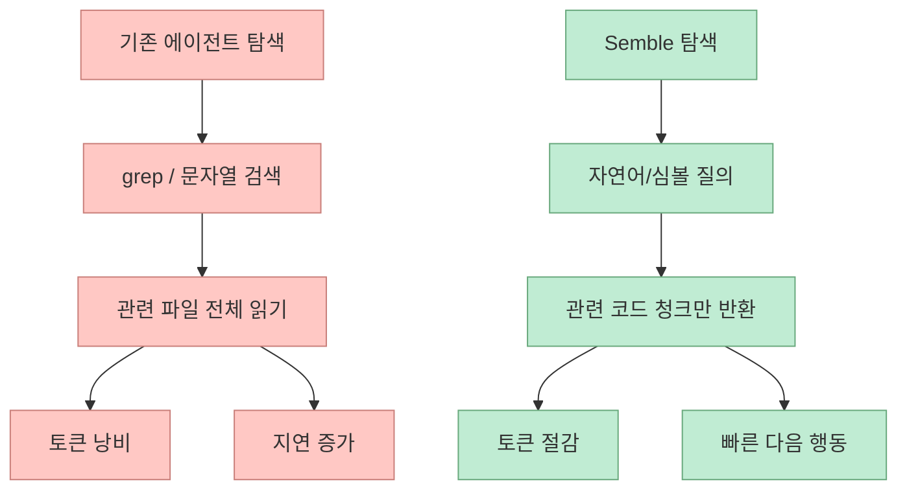
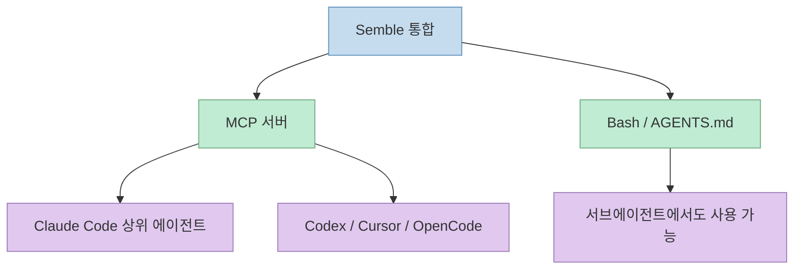
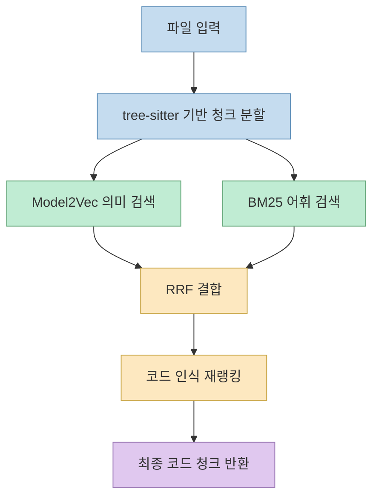
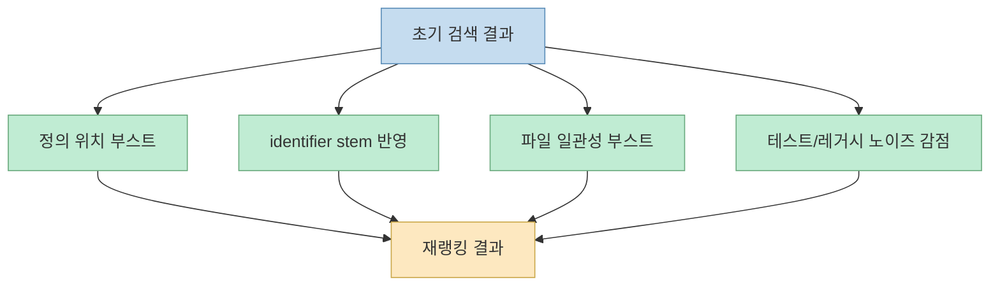

Semble을 한 문장으로 줄이면, **코딩 에이전트가 매번 grep으로 파일을 뒤지고 긴 파일을 통째로 읽는 대신, 필요한 코드 조각만 바로 찾게 만드는 검색 계층** 이다. 저장소 첫 문장도 같은 포지션을 잡고 있다. "Fast and Accurate Code Search for Agents", 그리고 "grep+read보다 약 98% 적은 토큰"이 핵심 메시지다.[GitHub README](https://github.com/MinishLab/semble)

이 프로젝트가 흥미로운 이유는 단순히 "검색이 빠르다"가 아니다. Claude Code, Codex, Cursor, OpenCode 같은 에이전트형 개발 도구가 실제로 낭비하는 비용이 무엇인지 정확히 찌르기 때문이다. 많은 경우 병목은 모델 추론 그 자체보다, **어떤 파일을 읽어야 하는지 찾는 과정** 과 **관련 없는 파일까지 통째로 읽는 컨텍스트 낭비** 에 있다.

<!--more-->

## Sources

- 원본 저장소: https://github.com/MinishLab/semble

## Semble이 겨냥하는 병목은 "코드 생성"이 아니라 "코드 탐색"이다

공식 README는 Semble을 "code search library built for agents"라고 정의한다. 중요한 건 built for agents라는 표현이다. 사람을 위한 검색기라기보다, **에이전트가 다음 행동을 결정하기 전에 최소한의 코드 컨텍스트를 회수하도록 설계된 도구** 라는 뜻이다.[GitHub README](https://github.com/MinishLab/semble)

README가 제시하는 기본 문제 구조는 이렇다.

- 에이전트는 먼저 무엇을 읽어야 할지 찾는다
- 일반적으로는 grep이나 문자열 검색으로 후보를 넓힌다
- 그 다음 관련 파일을 통째로 읽는다
- 이 과정에서 많은 토큰과 시간이 낭비된다

Semble은 여기서 "파일 전체 읽기"가 아니라 **관련 청크만 반환** 하도록 설계됐다. README의 표현을 그대로 옮기면, 자연어 질문이나 심볼 이름으로 검색해도 "relevant code snippets"만 돌려준다.[GitHub README](https://github.com/MinishLab/semble)

즉 Semble은 "더 좋은 코드 생성 모델"이 아니라, **모델 앞단에 붙는 검색 최적화 레이어** 로 봐야 정확하다.

## 설치 방식이 보여 주는 핵심 포지셔닝

Semble은 두 가지 경로로 붙일 수 있다.

- MCP 서버로 붙이기
- Bash / `AGENTS.md` 또는 `CLAUDE.md`로 붙이기

README는 Claude Code에서 `claude mcp add semble -s user -- uvx --from "semble[mcp]" semble` 명령으로 MCP 서버를 추가하는 방식을 먼저 보여 준다.[GitHub README](https://github.com/MinishLab/semble)

하지만 더 흥미로운 건 Bash / `AGENTS.md` 경로다. README는 Claude Code와 Codex CLI의 **sub-agent는 MCP 도구를 직접 못 부르는 경우가 있어서**, 서브에이전트 지원에는 Bash 통합이 사실상 필요하다고 설명한다.[GitHub README](https://github.com/MinishLab/semble)

이건 꽤 중요한 포인트다. Semble은 단순히 MCP 호환 도구가 아니라, **에이전트 하네스의 실제 제약까지 고려한 코드 검색 레이어** 다.

## 실제 사용 흐름은 "검색 → 필요한 경우만 원문 열기"다

README가 제시하는 워크플로는 매우 실용적이다.

1. `semble search`로 관련 청크를 먼저 찾는다
2. 반환된 청크만으로 부족할 때만 전체 파일을 연다
3. 유망한 결과가 있으면 `find-related`로 연관 구현을 찾는다
4. grep은 정확한 문자열 확인이 필요할 때만 쓴다

이 순서는 그냥 사용팁이 아니라, Semble이 전제하는 **컨텍스트 절약 전략** 그 자체다.[GitHub README](https://github.com/MinishLab/semble)

예를 들어:

- `semble search "authentication flow" ./my-project`
- `semble search "save_pretrained" ./my-project`
- `semble find-related src/auth.py 42 ./my-project`

이런 식으로, 먼저 문제를 의미 단위로 물어보고, 그다음 그 결과를 중심으로만 더 읽는 구조다.[GitHub README](https://github.com/MinishLab/semble)

## Semble의 핵심은 의미 검색 하나가 아니라 하이브리드 검색이다

README의 "How it works" 섹션이 이 프로젝트의 기술적 중심이다. Semble은 각 파일을 tree-sitter 기반으로 **code-aware chunks** 로 나눈 뒤, 두 개의 검색기를 함께 쓴다.[GitHub README](https://github.com/MinishLab/semble)

- Model2Vec 기반 정적 임베딩 검색
- BM25 기반 어휘 검색

즉 자연어 의미 검색만 하는 것도 아니고, 식별자 매칭만 하는 것도 아니다. 둘을 함께 돌린 다음 Reciprocal Rank Fusion, 즉 RRF로 결과를 합친다.[GitHub README](https://github.com/MinishLab/semble)

이 설계가 중요한 이유는 코드 검색 질의가 두 종류로 갈라지기 때문이다.

- `"How is authentication handled?"` 같은 설명형 질의
- `save_pretrained`, `Foo::bar`, `getUserById` 같은 식별자/심볼 질의

README도 이 차이를 직접 반영한다. 심볼처럼 보이는 질의에는 lexical weight를 더 주고, 자연어 질의에는 semantic과 lexical을 더 균형 있게 섞는 **adaptive weighting** 을 쓴다고 설명한다.[GitHub README](https://github.com/MinishLab/semble)

## 재랭킹 규칙이 생각보다 중요하다

Semble의 차별점은 검색기 2개만 붙인 것이 아니다. README는 그 뒤 단계에서 꽤 공격적인 **code-aware reranking** 을 한다고 밝힌다.[GitHub README](https://github.com/MinishLab/semble)

주요 신호는 다음과 같다.

- symbol-like query에는 lexical 가중치 강화
- queried symbol을 정의하는 청크에 boost
- identifier stem 매칭 강화
- 같은 파일에서 여러 청크가 맞으면 file-level coherence boost
- test, compat, legacy, example, `.d.ts` 같은 노이즈 파일은 감점

이 규칙들은 겉보기에 사소해 보여도 실전에서는 매우 크다. 코드 탐색에서 사용자가 원하는 것은 "어디엔가 문자열이 있는 파일"이 아니라, **실제 canonical implementation** 이기 때문이다.

결국 Semble이 잘 맞는 이유는 단순 검색 속도보다, **에이전트가 틀린 파일을 먼저 읽는 확률을 줄이는 데 집중했다** 는 데 있다.

## 성능 수치는 좋아 보이지만, 읽는 법이 중요하다

README 기준으로 Semble은 평균 저장소를 약 250ms에 인덱싱하고 약 1.5ms에 질의한다고 주장한다. 또 NDCG@10 0.854, CodeRankEmbed Hybrid 대비 99% 품질, 인덱싱 218배 빠름, 질의 11배 빠름을 내세운다.[GitHub README](https://github.com/MinishLab/semble)

토큰 효율성 쪽에서는 평균 98% 적은 토큰을 쓰고, 2k 토큰 예산에서 94% recall에 도달하며, 반면 grep+read는 100k 컨텍스트에서도 85% recall 수준이라고 적고 있다.[GitHub README](https://github.com/MinishLab/semble)

다만 이 수치는 **공식 README에 실린 자체 벤치마크** 다. 의미는 충분히 있지만, 절대값으로 읽기보다는 방향성으로 읽는 편이 좋다.

- 비교 대상 쿼리 구성
- 저장소 종류
- chunking 방식
- agent가 실제로 이 결과를 어떻게 소비하는지

같은 조건에 따라 체감 성능은 달라질 수 있기 때문이다. 그래도 최소한 한 가지는 분명하다. Semble은 "모델을 더 크게"가 아니라 **탐색 비용을 더 작게** 쪽에서 최적화를 시도한다.

## MCP보다 더 중요한 것은 '에이전트 습관'을 바꾸는 점이다

Semble이 좋은 이유를 저장소 설치 명령만으로 설명하면 절반만 본 셈이다. 더 중요한 건 README가 아예 `AGENTS.md / CLAUDE.md snippet`를 제공하면서, 에이전트에게 **grep 대신 semble search를 먼저 쓰라** 고 행동 규칙까지 심으려 한다는 점이다.[GitHub README](https://github.com/MinishLab/semble)

이건 단순한 사용 예제가 아니다. 도구의 성능이 아니라 **에이전트의 탐색 습관** 을 바꾸는 설계다.

즉 Semble의 진짜 가치는 아래 두 가지가 같이 갈 때 나온다.

- 검색 품질이 높아야 하고
- 에이전트가 그 검색기를 먼저 쓰도록 유도돼야 한다

README가 서브에이전트용 `semble init`으로 `.claude/agents/semble-search.md`를 쓰게 하는 것도 같은 이유다.[GitHub README](https://github.com/MinishLab/semble)

## 언제 특히 잘 맞는가

Semble은 다음 같은 상황에서 특히 설득력이 크다.

- 대형 저장소를 에이전트가 자주 탐색할 때
- 자연어 질문과 심볼 검색이 섞여 있을 때
- Claude Code, Codex, Cursor 등 여러 에이전트 인터페이스를 병행할 때
- 서브에이전트까지 포함해 검색 루틴을 일관되게 만들고 싶을 때
- grep 결과가 너무 많아 에이전트가 엉뚱한 파일을 자꾸 읽을 때

반대로 파일 수가 매우 적고 구조가 단순한 프로젝트에서는, grep만으로도 충분할 수 있다. 즉 Semble은 모든 프로젝트에 무조건 필요한 도구라기보다, **탐색 비용이 누적되는 환경에서 강한 도구** 다.

## 2026년 5월 19일 기준으로 보이는 상태

GitHub 공개 페이지 기준으로, 제가 확인한 시점인 **2026년 5월 19일** 에 Semble 저장소는 대략 다음 상태였다.

- 공개 저장소
- 약 2.7k stars
- 약 105 forks
- latest release `v0.1.8`
- 최근 업데이트 표기 `May 18, 2026`

이 숫자는 변할 수 있는 현재값이므로, 시점 정보를 붙여 읽는 편이 정확하다.[GitHub 저장소 페이지](https://github.com/MinishLab/semble)

## 핵심 요약

Semble의 핵심은 "코드 검색도 AI답게 하자"가 아니다. 

- 에이전트가 원본 파일을 마구 읽는 관성을 줄이고 
- 자연어 질의와 심볼 질의를 모두 처리하고 
- 검색 결과를 청크 단위로 좁혀서 반환하고 
- 정의 위치, 식별자 stem, 파일 일관성, 노이즈 감점으로 재랭킹하며 
- MCP와 Bash 양쪽으로 에이전트 하네스에 깊게 붙는다. 

그래서 Semble은 검색 도구라기보다 **에이전트용 코드 탐색 습관 교정 장치** 에 가깝다.

## 결론

Semble이 흥미로운 이유는 모델 성능 경쟁을 하지 않기 때문이다. 대신 "에이전트가 코드를 이해하기 전에 낭비하는 시간과 토큰"이라는 더 현실적인 병목을 겨냥한다. 공식 README만 봐도 이 프로젝트의 초점은 분명하다. 더 큰 컨텍스트 창을 전제로 버티는 대신, **필요한 청크만 빠르게 건네는 검색 계층** 을 추가해 에이전트의 작업 루프 자체를 바꾸려는 것이다. Claude Code나 Codex를 많이 쓸수록, 이런 종류의 도구는 부가 기능이 아니라 사실상 필수 인프라에 가까워질 가능성이 크다.
