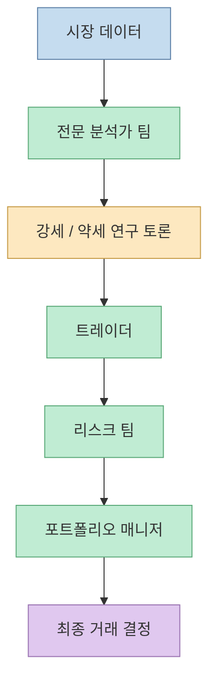
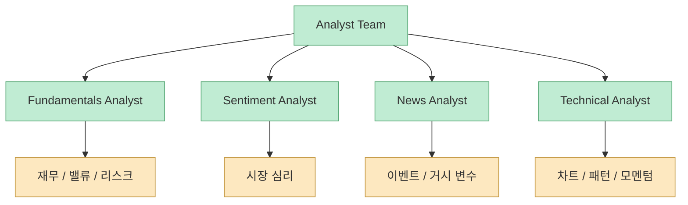
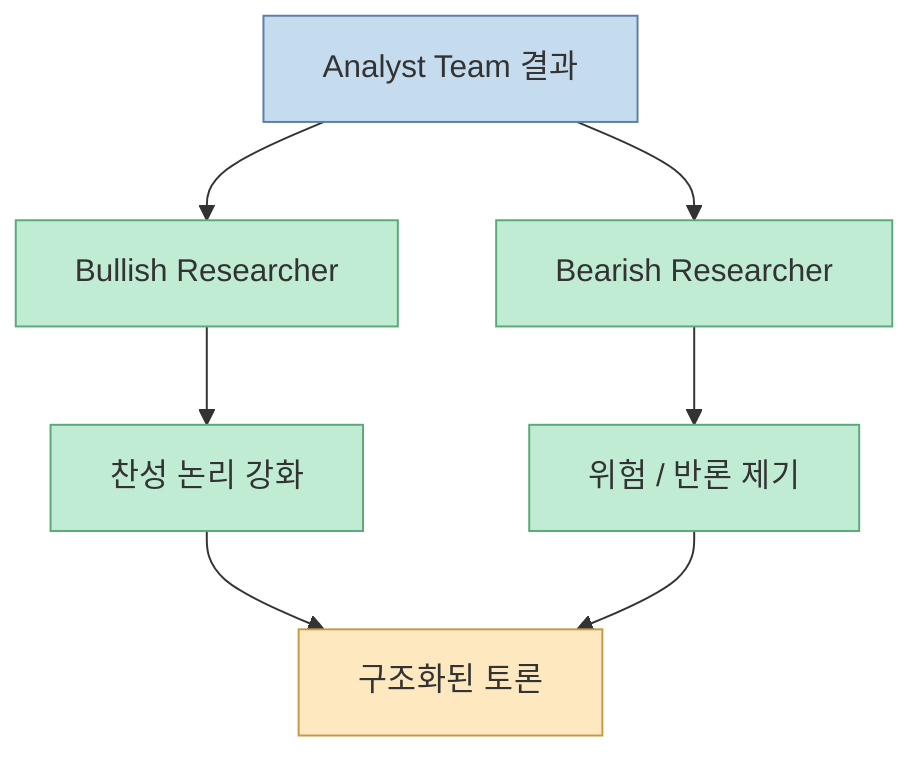
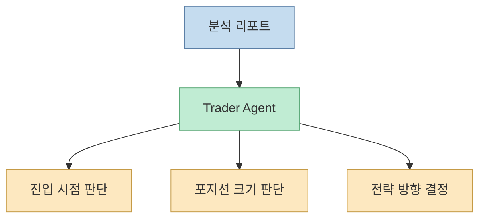
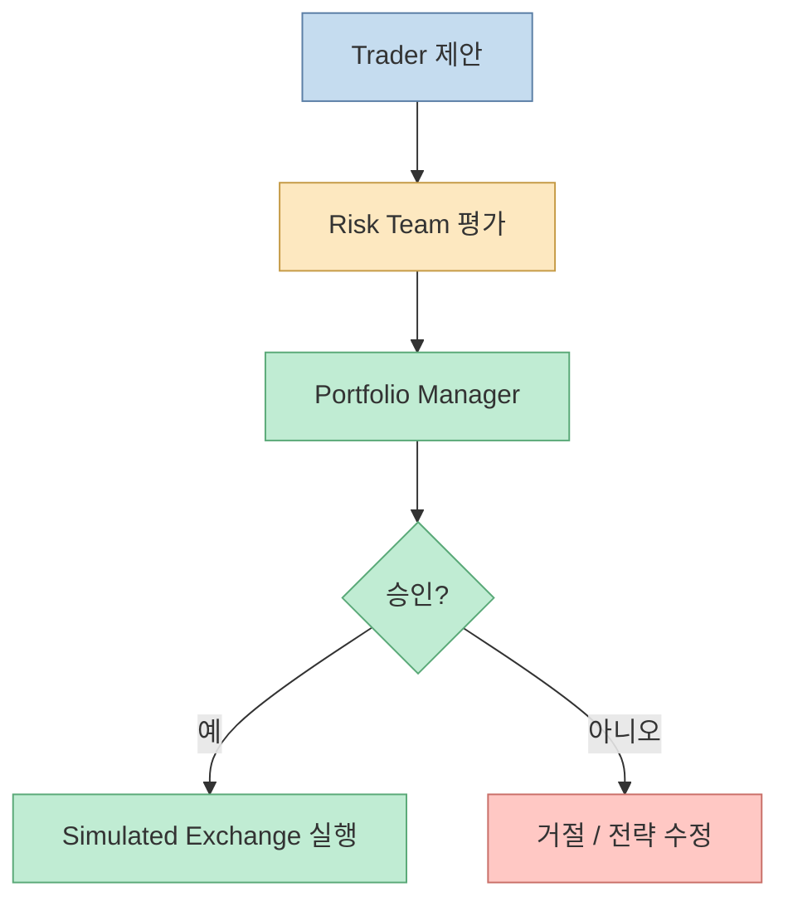
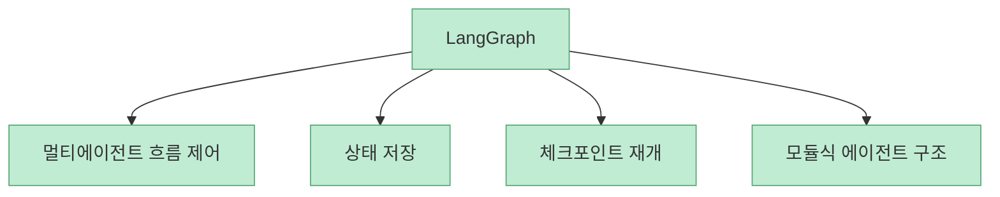
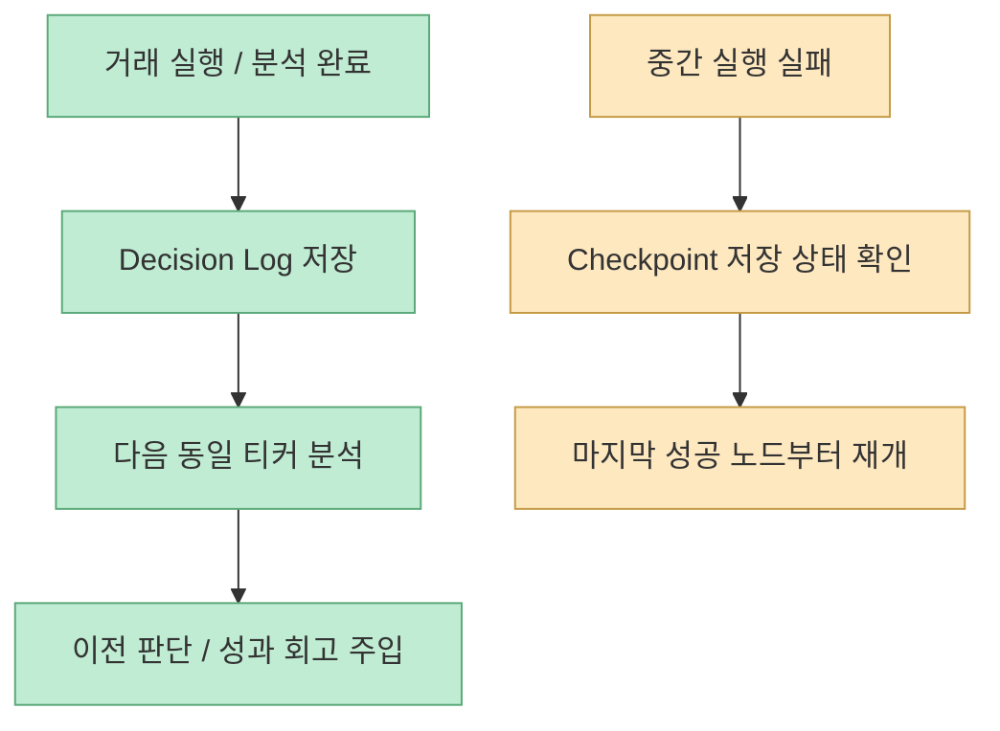
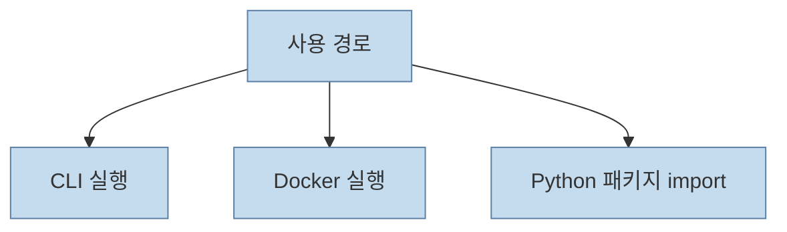

`TradingAgents`를 처음 보면 흔한 AI 주식 분석 프로젝트처럼 보일 수 있습니다. 하지만 README를 자세히 보면 방향이 꽤 다릅니다. 이 프로젝트는 "종목 하나를 예측하는 모델"보다, **실제 트레이딩 조직의 역할 분업을 LLM 팀으로 옮긴 멀티에이전트 프레임워크** 에 가깝습니다. 펀더멘털 분석가, 뉴스 분석가, 센티먼트 분석가, 기술적 분석가가 먼저 각각 의견을 만들고, 그 위에서 강세·약세 리서처가 토론하고, 마지막으로 트레이더와 리스크 팀, 포트폴리오 매니저가 결정을 내리는 구조입니다. <https://github.com/TauricResearch/TradingAgents>

<!--more-->

## Sources

- <https://github.com/TauricResearch/TradingAgents>
- 논문 링크: <https://arxiv.org/abs/2412.20138>

## 핵심 아이디어는 모델 하나가 아니라 역할 분리다

README가 제일 먼저 강조하는 것은 이 프레임워크가 real-world trading firm의 dynamics를 모사한다는 점입니다. 즉 "좋은 모델 하나"보다, **서로 다른 관점을 가진 역할을 나눠 놓고 그 결과를 종합하는 시스템** 이 핵심입니다. [TradingAgents README](https://github.com/TauricResearch/TradingAgents)

이 구조가 중요한 이유는, 금융 판단을 "정답 맞히기"보다 **관점 충돌과 검토 과정이 있는 의사결정 파이프라인** 으로 다루기 때문입니다.

## Analyst Team은 서로 다른 정보 소스를 병렬로 읽는다

README 기준 Analyst Team은 네 역할로 나뉩니다.

- Fundamentals Analyst
- Sentiment Analyst
- News Analyst
- Technical Analyst

각 역할은 보는 데이터가 다릅니다.

- 펀더멘털: 기업 재무와 성과 지표
- 센티먼트: 뉴스 헤드라인, StockTwits, Reddit 분위기
- 뉴스: 글로벌 뉴스와 거시경제 이벤트
- 기술적 분석: MACD, RSI 같은 차트 지표

즉 시스템은 처음부터 하나의 신호를 신뢰하지 않고, **서로 다른 데이터 축을 병렬로 읽게 설계** 되어 있습니다.

## Researcher Team이 들어가면서 단순 합산이 아니라 '토론 구조'가 생긴다

이 프로젝트가 흥미로운 진짜 이유는 Analyst Team 뒤에 Researcher Team이 따로 있다는 점입니다. README는 여기서 bullish / bearish researcher가 analyst들의 결과를 비판적으로 검토한다고 설명합니다. [TradingAgents README](https://github.com/TauricResearch/TradingAgents)

이건 단순 ensemble과 다릅니다. 여러 신호를 평균 내는 것이 아니라, **상반된 논리를 일부러 부딪치게 하는 구조** 이기 때문입니다.

이 단계가 들어가면 결과가 조금 느려질 수는 있지만, 대신 금융 도메인에서 중요한 **반대 논리 검토** 를 시스템 안에 넣을 수 있습니다.

## Trader는 '누가 맞나'가 아니라 '지금 무엇을 할까'를 결정한다

README는 Trader Agent를 analyst와 researcher의 결과를 종합해 실제 거래 결정을 내리는 역할로 설명합니다. 여기서 중요한 점은, Trader가 단순 복사기가 아니라:

- 언제 들어갈지
- 어느 정도 규모로 갈지
- 어떤 논리를 우선시할지

를 정한다는 것입니다.

즉 TradingAgents는 분석과 실행을 구분합니다. 이 구분은 실제 서비스 설계에서도 매우 중요합니다.

## Risk Team과 Portfolio Manager가 마지막 안전장치 역할을 한다

README의 마지막 구조에서 리스크 팀과 포트폴리오 매니저는 단순 장식이 아닙니다. 리스크 팀은 변동성, 유동성, 기타 위험 요인을 계속 평가하고, 포트폴리오 매니저는 최종 승인/거절 권한을 갖습니다. 승인되면 그때서야 simulated exchange로 주문이 실행됩니다. [TradingAgents README](https://github.com/TauricResearch/TradingAgents)

이 설계는 중요한 메시지를 담고 있습니다. 금융 AI에서 문제는 "추천"보다 **실행 직전 통제** 이기 때문입니다.

## LangGraph 위에 얹었다는 점이 구조적으로 잘 맞는다

README는 구현이 LangGraph 기반이라고 밝힙니다. 이 선택은 꽤 자연스럽습니다.

- 역할이 많다
- 중간 상태를 보존해야 한다
- 토론 단계가 있다
- 실패 시 재개가 필요하다

실제로 최신 버전 changelog와 README를 보면 LangGraph checkpoint resume과 persistent decision log가 핵심 기능으로 들어가 있습니다. [TradingAgents README](https://github.com/TauricResearch/TradingAgents)

즉 이 프레임워크는 단순히 LangGraph를 썼다가 아니라, **LangGraph가 잘 맞는 문제를 선택한 사례** 라고 볼 수 있습니다.

## 체크포인트와 결정 로그가 붙으면서 '연속성'이 생긴다

README 후반의 Persistence and Recovery 섹션이 실무적으로 좋습니다. 여기서는 두 가지 상태 유지 기능을 소개합니다.

- Decision log
- Checkpoint resume

Decision log는 `~/.tradingagents/memory/trading_memory.md`에 누적되고, 다음번 같은 티커 분석 때 최근 의사결정과 반성(reflection)을 포트폴리오 매니저 프롬프트에 다시 넣습니다. Checkpoint resume은 중간 노드 이후부터 재개하게 해 줍니다. [TradingAgents README](https://github.com/TauricResearch/TradingAgents)

이건 단순 편의 기능이 아닙니다. 금융 시뮬레이션에서 중요한 **학습 루프와 복구 가능성** 을 시스템 차원에 넣은 것입니다.

## 지원 모델과 공급자가 많다는 건 장점이자 변수다

README 기준 최신 버전은 OpenAI, Google, Anthropic, xAI, DeepSeek, Qwen, GLM, MiniMax, OpenRouter, Ollama, Azure OpenAI 등 매우 많은 provider를 지원합니다. [TradingAgents README](https://github.com/TauricResearch/TradingAgents)

이건 장점입니다.

- 모델 비교 실험 가능
- 지역별 provider 대응 가능
- 로컬 Ollama까지 실험 가능

하지만 동시에 성능 해석을 더 어렵게 만듭니다. README도 분명히 말하듯, trading performance는 backbone model, temperature, 기간, 데이터 품질 등 여러 비결정적 요인에 크게 영향을 받습니다.

즉 이 프로젝트는 "전략 그 자체"보다 **전략 실험 프레임워크** 로 읽는 편이 안전합니다.

## CLI가 있다는 건 연구 코드에서 도구로 한 단계 올라왔다는 뜻이다

README는 단순 Python import 예시만이 아니라:

- interactive CLI
- Docker 실행
- env 기반 provider 설정
- package import 사용

까지 제공합니다. 이 점은 중요합니다. 프로젝트가 논문 부록 수준을 넘어서, **실험 가능한 사용자 도구** 로 진화하고 있다는 뜻이기 때문입니다.

그래서 TradingAgents는 단순 아이디어 데모보다, **실제로 만져 볼 수 있는 연구 프레임워크** 라는 점에서 반응이 큰 것입니다.

## 이 프로젝트를 볼 때 가장 중요한 주의점

README는 매우 분명하게 경고합니다. 이 프레임워크는 research purposes를 위해 설계되었고, financial / investment / trading advice가 아니라고 못 박습니다. [TradingAgents README](https://github.com/TauricResearch/TradingAgents)

이건 형식적 면책이 아니라, 실제로 꼭 필요한 경계입니다.

- LLM 응답은 비결정적이다
- 외부 데이터 품질에 따라 결과가 흔들린다
- 모델 버전이 바뀌면 결과도 바뀐다
- 백테스트나 데모 구조가 실제 운용 리스크를 대신하지 못한다

따라서 이 프로젝트는 "이걸로 돈 벌자"보다, **에이전트형 금융 의사결정 시스템을 어떻게 설계할 수 있는가** 를 연구하는 재료로 보는 편이 맞습니다.

## 핵심 요약

- TradingAgents는 단일 모델 예측기가 아니라 실제 트레이딩 조직의 역할 분업을 LLM 팀 구조로 옮긴 프레임워크다
- Analyst Team, Researcher Team, Trader, Risk Team, Portfolio Manager로 이어지는 계층 구조가 핵심이다
- 단순 ensemble이 아니라 bullish / bearish researcher의 토론 구조를 넣어 반대 논리를 시스템 안에 포함한다
- LangGraph 기반이라 멀티에이전트 흐름, 상태 저장, 체크포인트 재개 같은 구조와 잘 맞는다
- decision log와 reflection 주입 덕분에 과거 판단을 다음 분석에 연결하는 학습 루프가 있다
- 이 프로젝트는 투자 조언 엔진보다 금융 AI 연구 프레임워크로 읽는 편이 더 정확하다

## 결론

TradingAgents가 주목받는 이유는 "주식 추천을 잘한다"는 주장 때문이 아닙니다. 더 흥미로운 이유는, **트레이딩 조직의 판단 구조를 그대로 에이전트 아키텍처로 번역했다** 는 데 있습니다.

이 프로젝트가 보여 주는 핵심은 금융 도메인에만 한정되지 않습니다. 복잡한 의사결정이 필요한 영역에서는 단일 모델의 정답률보다, **역할 분리, 토론 구조, 리스크 검토, 최종 승인 계층** 을 어떻게 설계하느냐가 더 중요할 수 있다는 점을 잘 보여 줍니다.
