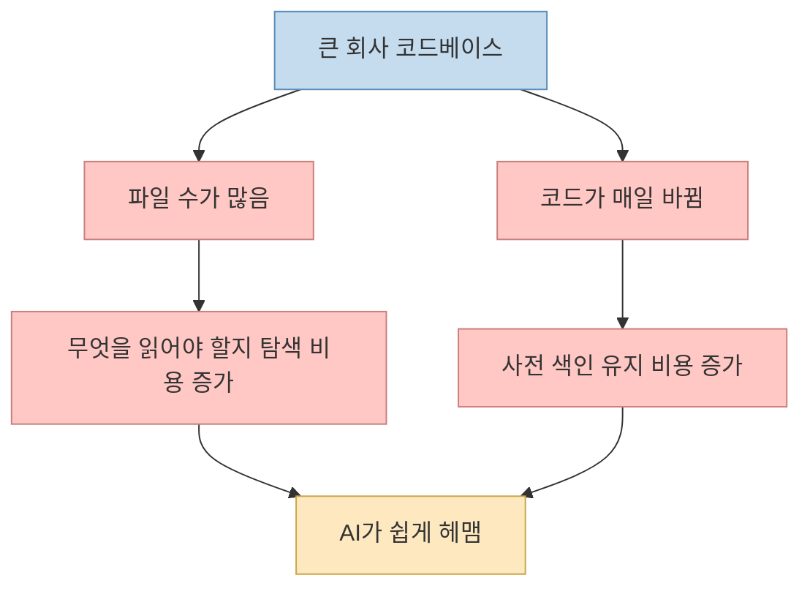
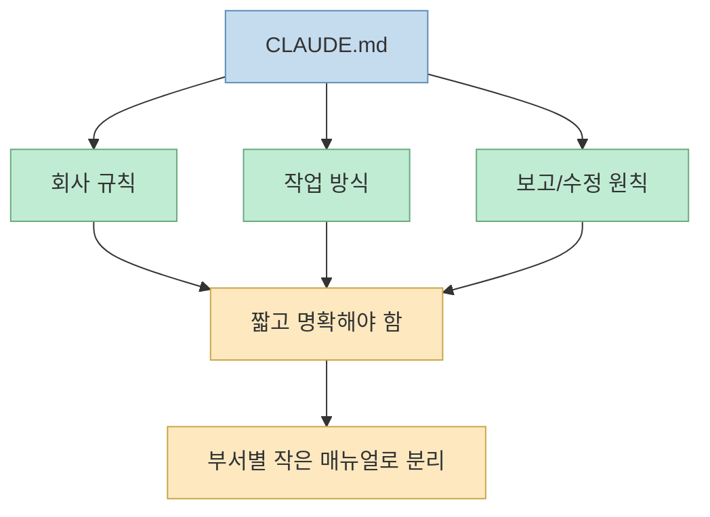
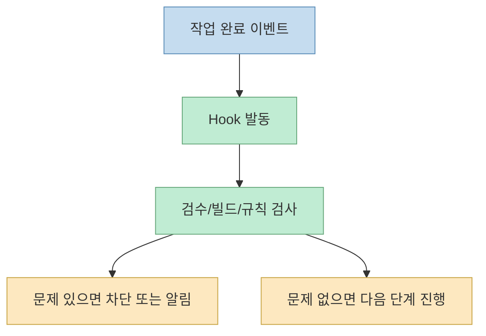
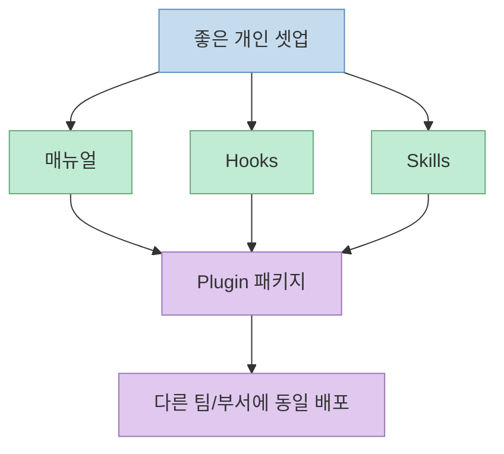
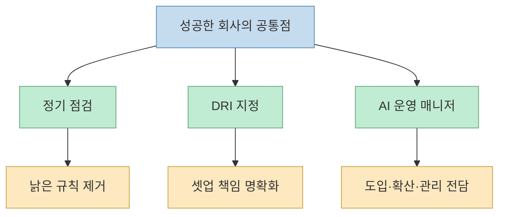
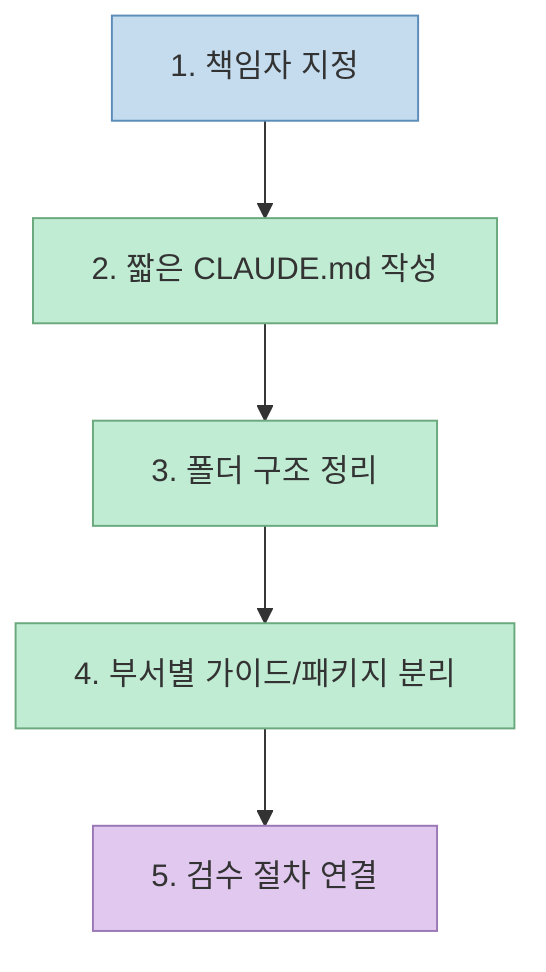

이 영상이 전달하는 핵심은 단순하다. **큰 회사에서 Claude Code를 잘 쓰는 문제는 모델 성능보다 운영 장치의 문제** 라는 것이다. 발표자는 Anthropic이 공개한 가이드를 바탕으로, 수백만 줄 규모 코드베이스에서 Claude Code를 어떻게 셋업해야 하는지 비유 중심으로 설명한다.[영상 0:00](https://youtu.be/waVkNkguDNc?t=0)

핵심 포인트는 두 가지다. 첫째, 큰 회사 코드베이스는 개인 프로젝트와 전혀 다르다. 둘째, 그래서 Claude Code가 그냥 똑똑하면 되는 게 아니라, **회사 매뉴얼, 자동 검사, 전문 가이드, 패키지화된 셋업, 정밀 검색 같은 주변 장치** 가 함께 필요하다.[영상 1:41](https://youtu.be/waVkNkguDNc?t=101)

<!--more-->

## Sources

- 영상: [Anthropic이 직접 공개한 5가지 비밀, 모델보다 이게 더 중요합니다](https://youtu.be/waVkNkguDNc?si=U08RdeZMOt6B0tGb)

## 왜 큰 회사 코드베이스는 개인 프로젝트와 다를까

영상 초반의 비유는 신입사원이다. 수백 명 규모 회사에 입사하면 어디를 봐야 하는지, 누구에게 물어봐야 하는지부터 막막하다. 작은 개인 프로젝트에서는 AI가 잘 작동해도, 큰 회사 코드에서는 파일 수가 수천·수만 개, 경우에 따라 수백만 줄이므로 같은 방식이 잘 통하지 않는다는 것이다.[영상 0:17](https://youtu.be/waVkNkguDNc?t=17)

많은 AI 코딩 도구는 이 문제를 **사전 색인(index)** 으로 푼다고 설명한다. 도서관 카드처럼 코드 전체를 미리 읽고 인덱스를 만든 뒤, 찾을 때 그 카드를 먼저 보는 방식이다.[영상 0:50](https://youtu.be/waVkNkguDNc?t=50)

하지만 회사 코드에서는 이 방식이 항상 편하지 않다. 이유는 코드가 매일 바뀌기 때문이다. 누군가는 파일을 추가하고, 누군가는 수정하고, 누군가는 지우므로, 그 색인을 계속 최신 상태로 유지해야 한다.[영상 1:03](https://youtu.be/waVkNkguDNc?t=63)

## Claude Code의 접근은 "색인 유지"보다 "사람처럼 찾아가기"다

영상 설명에 따르면 Claude Code는 이 문제를 다른 방식으로 푼다. 거대한 색인을 유지하기보다, 실제 사람처럼 "이 폴더를 열어 볼까?", "이 단어로 검색해 볼까?", "이 함수를 누가 부르지?" 같은 식으로 현재 상태를 보고 탐색한다는 것이다.[영상 1:16](https://youtu.be/waVkNkguDNc?t=76)

이 접근의 장점은 명확하다.

- 코드가 바뀔 때마다 인덱스를 유지할 필요가 적다
- 현재 파일 시스템 상태를 직접 보고 움직인다

하지만 단점도 있다. 신입사원이 회사 구조를 잘 모르면 헤매듯, Claude Code도 **회사 문맥과 규칙이 없으면 큰 코드베이스 안에서 방황하기 쉽다** 는 것이다.[영상 1:31](https://youtu.be/waVkNkguDNc?t=91)

그래서 영상은 Anthropic이 제시한 다섯 가지 도구를 소개한다.

## 1. `CLAUDE.md`는 회사 전체 매뉴얼이다

첫 번째 도구는 `CLAUDE.md`다. 영상은 이를 회사 매뉴얼에 비유한다. 신입사원이 첫 출근했을 때 회사 소개 문서와 업무 규칙을 먼저 읽는 것처럼, AI도 일을 시작할 때 이 파일을 먼저 읽고 "이 회사는 이런 규칙으로 일하는구나"를 이해하게 된다는 것이다.[영상 1:56](https://youtu.be/waVkNkguDNc?t=116)

하지만 발표자는 여기서 중요한 경고를 덧붙인다. 매뉴얼을 너무 두껍게 만들면 안 된다는 것이다. 첫날부터 200페이지짜리 매뉴얼을 던지면 사람도 헷갈리듯, AI도 마찬가지라는 설명이다.[영상 2:18](https://youtu.be/waVkNkguDNc?t=138)

Anthropic의 추천으로 영상이 요약하는 방향은 다음과 같다.

- 매뉴얼은 짧게 유지
- 회사 전체 대형 문서 하나보다 부서별 작은 매뉴얼
- 필요한 상황에서 필요한 매뉴얼만 함께 읽기

즉 `CLAUDE.md`의 목적은 모든 지식을 다 담는 것이 아니라, **Claude Code가 헤매지 않도록 회사의 기본 규칙을 짧게 심어 두는 것** 이다.

## 2. Hooks는 자동 센서다

두 번째 도구는 Hooks다. 영상은 이를 현관 센서 비유로 설명한다. 누가 스위치를 누르지 않아도 사람이 들어오면 불이 켜지듯, 특정 일이 일어나면 자동으로 정해진 검수나 후속 절차를 실행하는 장치라는 뜻이다.[영상 2:46](https://youtu.be/waVkNkguDNc?t=166)

예시로는 AI가 작업을 마치면 자동으로 검수 프로그램이 돌아가는 흐름이 나온다. 오타나 규칙 위반, 기본적인 품질 검사 같은 것을 사람 요청 없이 자동으로 돌리는 것이다.[영상 3:05](https://youtu.be/waVkNkguDNc?t=185)

이게 중요한 이유는, 사람이나 AI 모두 "나중에 이거 확인해 줘"라고 말로만 맡기면 잊을 수 있기 때문이다. Hooks는 그 과정을 **100% 자동으로 강제** 한다는 점에서 가치가 있다.[영상 3:22](https://youtu.be/waVkNkguDNc?t=202)

즉 Hooks는 "AI에게 똑똑해지라고 부탁하는 것"이 아니라, **좋은 습관을 자동화해서 강제로 지키게 만드는 장치** 다.

## 3. Skills는 필요할 때만 꺼내 보는 전문 매뉴얼이다

세 번째는 Skills다. 영상은 이를 부서별 전문 매뉴얼에 비유한다. 회사 전체 매뉴얼과 별도로, 특정 업무를 할 때만 꺼내 보는 결산 매뉴얼, 채용 매뉴얼, 운영 매뉴얼 같은 것이라고 설명한다.[영상 3:33](https://youtu.be/waVkNkguDNc?t=213)

여기서 핵심은 **필요할 때만 읽는다** 는 점이다. 모든 규칙을 항상 들고 다니는 것이 아니라, 해당 작업을 할 때만 관련 전문 지침을 붙인다. 그래서 AI의 머리가 가벼워지고 일도 더 잘된다는 설명이다.[영상 3:52](https://youtu.be/waVkNkguDNc?t=232)

즉 `CLAUDE.md`가 회사 공통 규칙이라면, Skills는 특정 업무를 위한 **작업별 레시피 모음** 에 더 가깝다.

## 4. Plugins는 좋은 셋업을 회사 전체로 퍼뜨리는 패키지다

네 번째 도구는 Plugins다. 발표자는 이를 신입사원 패키지 비유로 설명한다. 책상, 의자, 서랍, 사물함을 따로 사는 대신 한 번에 묶은 패키지를 주듯, 지금까지 말한 매뉴얼, 자동 센서, 전문 가이드 같은 것을 하나의 부서 셋업 패키지로 묶는 것이 플러그인이라는 것이다.[영상 4:12](https://youtu.be/waVkNkguDNc?t=252)

이 설명에서 중요한 지점은 "좋은 셋업이 한 사람에게만 머무는 것"이 회사의 문제라는 부분이다. 어떤 한 개발자는 셋업을 잘 해 놓았는데 옆 부서는 모르고 있다면, 회사 전체 차원에서는 생산성이 퍼지지 않는다.[영상 4:37](https://youtu.be/waVkNkguDNc?t=277)

플러그인은 이런 노하우를 **재배포 가능한 단위** 로 만든다.

즉 Plugins의 본질은 기능 추가가 아니라, **개인 노하우를 회사 자산으로 전환하는 포장 단위** 다.

## 5. LSP는 동명이인 없는 정밀 검색기다

다섯 번째는 LSP다. 영상은 이를 "김민수라는 직원이 50명 있는 회사에서 정확한 사람을 찾는 시스템"에 비유한다.[영상 4:48](https://youtu.be/waVkNkguDNc?t=288)

코드베이스 안에서는 같은 이름의 함수나 비슷한 심볼이 여러 곳에 흩어져 있을 수 있다. LSP가 없으면 AI는 이 함수가 맞는지 저 함수가 맞는지 파일을 계속 열어 보느라 시간을 낭비한다. 반면 LSP가 있으면 어느 파일, 어느 위치의 어떤 심볼인지 더 정확하게 짚을 수 있어 탐색 시간이 줄어든다는 설명이다.[영상 5:03](https://youtu.be/waVkNkguDNc?t=303)

즉 LSP는 회사 전체 구조를 이해하는 철학이 아니라, **큰 코드베이스 안에서 헷갈리는 이름을 정확히 집어내는 탐색 정밀도 장치** 에 가깝다.

## 다섯 도구를 한 번에 요약하면

영상은 다섯 도구를 다음처럼 정리한다.[영상 5:17](https://youtu.be/waVkNkguDNc?t=317)

- 회사 매뉴얼
- 자동 센서
- 부서별 전문 가이드
- 통째 셋업 패키지
- 정밀 검색

이 다섯 가지가 같이 있어야 Claude Code가 큰 회사 코드에서도 잘 일할 수 있다는 것이다. 이 프레임은 실제로 꽤 설득력이 있다. 왜냐하면 각각이 다른 실패 원인을 막기 때문이다.

- `CLAUDE.md`: 기본 규칙 부재
- Hooks: 검증 누락
- Skills: 전문 작업 지침 부재
- Plugins: 노하우의 재사용 실패
- LSP: 탐색 오차와 검색 낭비

## 성공한 회사들의 공통점 3가지

영상 후반은 도구 자체보다 운영 패턴을 더 강조한다. 발표자가 Anthropic 가이드를 요약하며 소개하는 성공 기업의 공통점은 세 가지다.

### 1. 3~6개월마다 정기 점검

AI는 빠르게 변하므로, 예전엔 필요했던 규칙이 지금은 오히려 발목을 잡을 수 있다고 말한다. 예를 들어 "이건 어려우니 잘게 쪼개서 시켜라" 같은 규칙이 과거엔 유효했어도, 모델이 좋아진 뒤에는 과도한 제약이 될 수 있다.[영상 5:33](https://youtu.be/waVkNkguDNc?t=333)

### 2. DRI 한 명을 명확히 두기

회사 AI 셋업을 누가 책임지는지 명확히 정해야 한다는 것이다. 한두 명이 먼저 잘 써 보더라도, 그 노하우가 회사 전체로 퍼지지 않으면 도입은 흐지부지 끝난다고 설명한다.[영상 6:02](https://youtu.be/waVkNkguDNc?t=362)

### 3. AI 운영 매니저 같은 전담 역할

큰 회사는 "에이전트 매니저" 또는 "AI 운영 매니저" 같은 새로운 직책을 만들기도 했다고 말한다. 프로젝트 매니저와 엔지니어 사이 어딘가에 있는 역할로, AI 도구를 회사 사람들이 잘 쓰게 관리하는 사람이라는 설명이다.[영상 6:28](https://youtu.be/waVkNkguDNc?t=388)

즉 성공은 좋은 프롬프트나 좋은 모델 하나에서 나오지 않고, **셋업을 갱신하고 책임지고 전파하는 운영 구조** 에서 나온다는 메시지다.

## 회사 도입 5단계

영상은 실제 도입 순서도 제안한다.[영상 6:50](https://youtu.be/waVkNkguDNc?t=410)

1. 책임자부터 정하기 
2. 짧은 `CLAUDE.md`부터 만들기 
3. 폴더 구조를 정리하고 불필요한 파일을 제외 표시하기 
4. 부서별 전문 가이드와 패키지를 나눌 수 있게 만들기 
5. AI가 짠 코드도 사람 코드처럼 검수 절차를 거치게 하기 

이 순서가 좋은 이유는 처음부터 모든 것을 자동화하라고 하지 않기 때문이다. 오히려 **누가 책임지는지**, **어떤 규칙을 먼저 보여 줄지**, **어디까지를 읽게 할지**, **검증을 어떻게 강제할지** 같은 기본 운영 원칙부터 깔라고 한다.

## 핵심 요약

이 영상이 말하는 Anthropic식 큰 회사용 Claude Code 셋업은 "좋은 모델 쓰기"가 아니다. 

- 짧은 회사 매뉴얼을 두고 
- Hooks로 검증을 자동화하고 
- Skills로 전문 작업 지침을 필요할 때만 불러오고 
- Plugins로 좋은 셋업을 전사 배포하고 
- LSP로 큰 코드베이스 탐색을 정밀하게 만든다. 

그리고 그 위에 정기 점검, DRI, AI 운영 매니저 같은 운영 구조를 얹는다. 즉 핵심은 모델이 아니라 **회사 수준의 AI 운영체계** 다.

## 결론

이 영상이 설득력 있는 이유는 Claude Code를 만능 도구처럼 말하지 않기 때문이다. 오히려 큰 회사 코드에서는 그냥 쓰면 헤맬 수 있다고 전제하고, 어떻게 신입사원처럼 길을 잃지 않게 만들지를 설명한다. 결국 Anthropic이 강조하는 것도 비슷하다. 큰 조직에서 AI 코딩이 잘 굴러가려면, 더 강한 모델 하나보다 **매뉴얼, 자동화, 패키징, 검색, 운영 책임** 이 먼저 깔려 있어야 한다. 회사에서 AI 도입이 자꾸 개인기 수준에 머무른다면, 문제는 모델보다 셋업 쪽에 있을 가능성이 크다.
