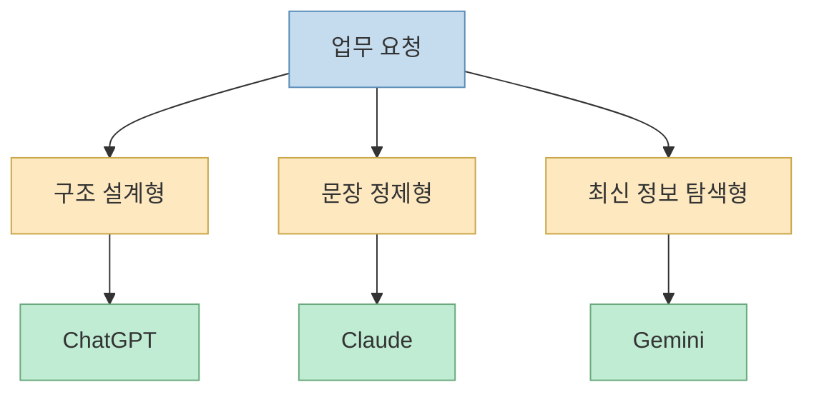
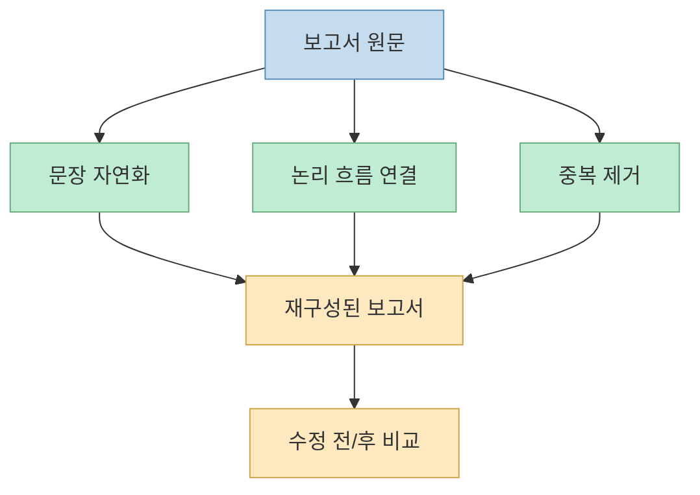
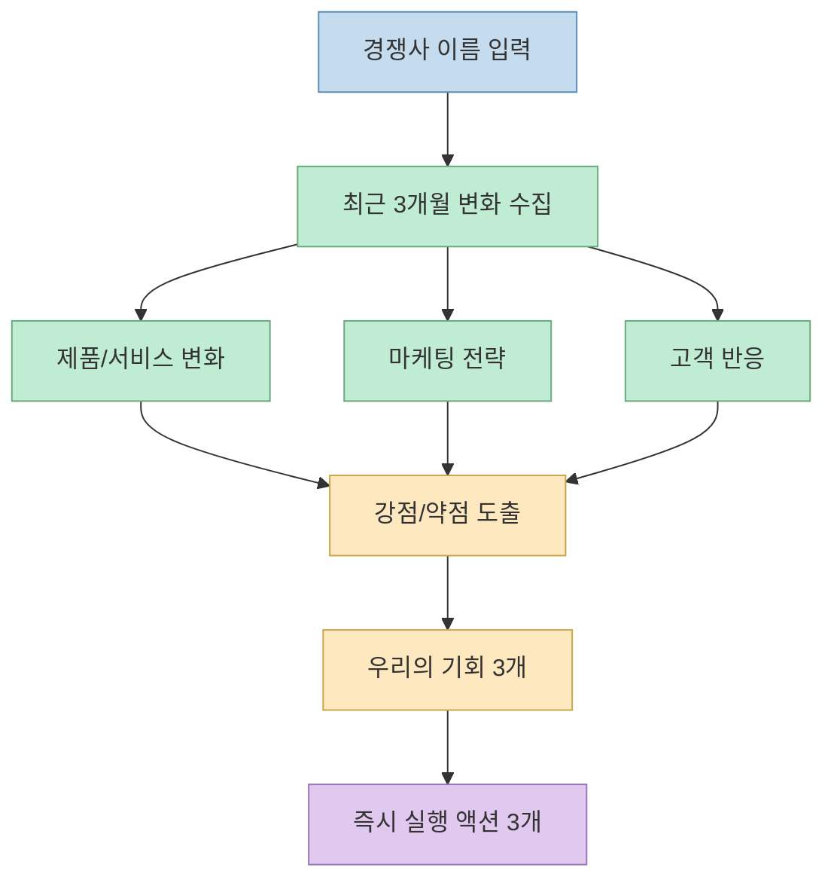
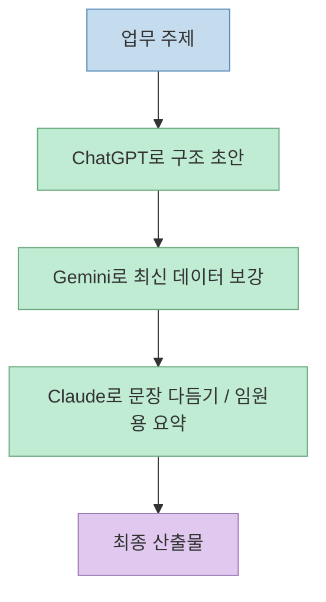

이 Threads 포스트는 거창한 에이전트 시스템을 설명하지 않는다. 대신 훨씬 실용적인 접근을 택한다. **Claude, ChatGPT, Gemini를 하나로 합쳐 쓰는 게 아니라, 각 모델을 문서 성격과 업무 목적에 따라 나눠 쓰는 8가지 프롬프트 세트** 를 제안한다. 원문은 다소 과장된 문구를 쓰지만, 실제 본문은 꽤 명확하다. 회의자료, 보고서, 최신 데이터 조사, 기획서 초안, 이메일, 경쟁사 분석, 비교표, 핵심 보고 요약처럼 직장인이 자주 반복하는 산출물을 대상으로 프롬프트를 바로 붙여 넣을 수 있게 정리해 두었다.[Threads 원문](https://www.threads.net/@human__bro/post/DYhISsiEiiK)

핵심은 "어떤 모델이 가장 뛰어난가"보다, **어떤 종류의 결과물을 만들 때 어떤 모델에 무엇을 시켜야 덜 헤매는가** 에 가깝다. 즉 이 포스트는 모델 비교 글이라기보다, 업무를 프롬프트 단위로 쪼개어 재사용하는 작은 운영 매뉴얼에 가깝다.

<!--more-->

## Sources

- 원문: https://www.threads.com/@human__bro/post/DYhISsiEiiK?xmt=AQG0TdwDwZWUywenJI3m0x53ZQ_q0t3LyHlJE-_WIH3l2s34CLhipBQcUMfbQGONkZIi91QU&slof=1

## 이 포스트가 전제하는 방식

원문은 세 모델을 다음처럼 나눠 쓴다.

- ChatGPT: 발표자료, 기획서, 비교표처럼 **구조를 먼저 짜야 하는 작업**
- Claude: 보고서 다듬기, 이메일 변환, 임원 보고처럼 **문장 정제와 맥락 압축이 중요한 작업**
- Gemini: 최신 통계, 시장 데이터, 경쟁사 동향처럼 **웹 기반 최신 정보 탐색이 중요한 작업**

이 구분이 절대적이라고 보긴 어렵지만, 실무에서 꽤 유용한 이유가 있다. 사람도 모든 일을 한 방식으로 하지 않듯, LLM도 **초안 생성, 문장 정리, 정보 탐색** 이라는 역할을 구분하면 출력 품질을 안정시키기 쉽다.

즉 이 글은 모델 우열보다 **작업 유형별 라우팅 규칙** 으로 읽는 편이 더 생산적이다.

## 1. 회의자료 3분 컷 프롬프트

원문 첫 번째 프롬프트는 ChatGPT용 발표자료 구조화 프롬프트다. 핵심 요구는 다음과 같다.[Threads 원문](https://www.threads.net/@human__bro/post/DYhISsiEiiK)

- 주제를 입력한다
- 총 7장 슬라이드 구조로 짠다
- 각 장마다 핵심 메시지 1개와 근거 2개를 둔다
- 스토리 흐름은 문제 → 원인 → 해결 → 기대효과
- 마지막 장에는 실행 액션 3개를 넣는다
- 발표 시간 10분 기준으로 분량을 맞춘다

이 프롬프트의 장점은 "PPT 만들어줘" 같은 모호한 지시를 **발표형 논리 구조** 로 바꾼다는 점이다. 즉 슬라이드 수, 서사 흐름, 장별 밀도, 마지막 액션까지 미리 고정해 두므로, 초안 품질의 편차가 줄어든다.

## 2. 보고서 퀄리티 3배 향상 프롬프트

두 번째는 Claude용 보고서 정제 프롬프트다. 보고서 원문을 붙여 넣고 다음을 요청한다.[Threads 원문](https://www.threads.net/@human__bro/post/DYhISsiEiiK)

- 어색한 문장을 자연스럽게 수정
- 논리 흐름이 끊긴 부분 연결
- 중복/불필요 문장 제거
- 가독성 좋게 재구성
- 핵심 메시지 더 강조
- 수정 전/후 비교 제공
- 더 설득력 있게 보이도록 표현 개선

이 프롬프트가 실무적으로 좋은 이유는 **단순 교정** 과 **편집 의도** 를 동시에 넣었기 때문이다. 보통 "다듬어줘"만 쓰면 모델이 문체만 만지거나, 반대로 과하게 내용을 바꾸는 경우가 있다. 여기서는 논리 연결, 중복 제거, 비교 결과 제공까지 넣어 편집 목표를 명확히 한다.

## 3. 최신 데이터 + 인사이트 프롬프트

세 번째는 Gemini용 최신 정보 조사 프롬프트다. 주제를 넣으면 다음 구조로 정리하라고 요구한다.[Threads 원문](https://www.threads.net/@human__bro/post/DYhISsiEiiK)

- 2026년 기준 최신 통계 및 시장 데이터 검색
- 신뢰 가능한 출처 포함
- 핵심 수치 3개
- 각 수치에 대한 한 줄 해석
- PPT에 바로 넣을 1줄 요약
- 현재 트렌드 한 줄
- 앞으로 1~2년 전망 한 줄

이 프롬프트는 특히 **최신성** 과 **슬라이드 투입 가능성** 을 동시에 챙긴다. 그냥 시장조사를 시키면 장황한 텍스트가 나오기 쉬운데, 여기서는 숫자 3개 + 해석 + 한 줄 요약으로 제한해 발표자료에 바로 옮겨 쓰기 좋게 만든다.

주의할 점도 있다. 원문은 "신뢰 가능한 출처 포함"이라고 요구하지만, 실제로는 모델이 출처를 잘못 연결하거나 오래된 자료를 최신처럼 보이게 쓸 수 있다. 따라서 이 프롬프트는 특히 **링크 검증** 이 반드시 따라야 한다.

## 4. 기획서 초안 5분 컷 프롬프트

네 번째는 ChatGPT용 기획서 초안 작성 프롬프트다. 구성은 다음과 같다.[Threads 원문](https://www.threads.net/@human__bro/post/DYhISsiEiiK)

- 배경
- 목적, 정량 목표 포함
- 기대효과, 비즈니스 임팩트 중심
- 실행 계획
- 일정
- 예산
- 상단 한 줄 요약
- 승인 유도 문장 포함

여기서 좋은 점은 기획서가 자주 실패하는 지점을 미리 잡아 둔 것이다. 많은 기획 초안이 배경 설명만 길고 의사결정 포인트가 약한데, 이 프롬프트는 **임원이 5분 안에 이해할 수 있는 밀도** 와 **숫자/성과 중심 표현** 을 명시한다.

즉 정보량보다 **결재 문서의 시선** 으로 프롬프트를 짰다는 점이 핵심이다.

## 5. 이메일 설득력 2배 만들기 프롬프트

다섯 번째는 Claude용 이메일 변환 프롬프트다. 같은 이메일 원문을 두 가지 버전으로 바꾸게 한다.[Threads 원문](https://www.threads.net/@human__bro/post/DYhISsiEiiK)

- A: 대기업 임원용, 격식/논리 중심
- B: 파트너용, 친근/관계 중심

추가 요구는 다음과 같다.

- 핵심 메시지 유지
- 불필요한 문장 축소
- 설득력 강화
- 제목 3개 추천
- 행동을 유도하는 CTA 포함

이 프롬프트의 강점은 내용보다 **수신자별 어조 전환** 에 있다. 실제 업무에서 이메일 품질 차이는 정보량보다 상대방에 맞는 말투와 CTA에서 크게 난다. 같은 메시지를 여러 상대에게 맞추어 보내야 할 때 꽤 유용한 패턴이다.

## 6. 경쟁사 분석 + 전략 전문가 프롬프트

여섯 번째는 Gemini용 경쟁사 분석 프롬프트다. 최근 3개월 기준으로 다음 항목을 정리하라고 한다.[Threads 원문](https://www.threads.net/@human__bro/post/DYhISsiEiiK)

- 주요 제품/서비스 변화
- 마케팅 전략 및 캠페인
- 고객 반응 및 리뷰 요약
- 경쟁사의 강점 3개 / 약점 3개
- 우리가 공략할 수 있는 기회 3개
- 바로 실행 가능한 액션 아이디어 3개

이 프롬프트는 단순 정보 수집을 넘어서 **대응 전략까지 끌어내는 구조** 라는 점이 좋다. 많은 경쟁사 요약은 "무슨 일이 있었는지"만 나열하고 끝나는데, 여기서는 마지막에 반드시 실행 가능한 액션으로 닫게 만든다.

다만 이 역시 최신 정보 기반이므로, 결과물을 그대로 전략 문서에 넣기보다 **링크와 근거의 실제 존재 여부를 검산** 하는 과정이 필요하다.

## 7. 의사결정 비교표 프롬프트

일곱 번째는 ChatGPT용 비교표 프롬프트다. 항목 3개를 넣고 다음 열 구조의 표를 만들어 달라고 한다.[Threads 원문](https://www.threads.net/@human__bro/post/DYhISsiEiiK)

- 기능
- 가격
- 장점
- 단점
- 추천 대상

그리고 추가로:

- 각 항목별 핵심 한 줄 요약
- 상황별 추천
- 마지막 결론
- 엑셀에 바로 붙여넣기 가능한 표

이 프롬프트의 장점은 비교 작업을 단순 서술이 아니라 **표준 판단 포맷** 으로 바꾼다는 것이다. 의사결정 회의에서 가장 많이 시간을 쓰는 부분이 "다 같이 같은 기준으로 보고 있지 않다"는 점인데, 이런 프롬프트는 기준 축을 먼저 맞춘다.

## 8. 대표님 핵심 보고용 프롬프트

마지막은 Claude용 핵심 요약 프롬프트다. 문서를 읽고 다음 구조만 남기라고 한다.[Threads 원문](https://www.threads.net/@human__bro/post/DYhISsiEiiK)

- 결론
- 근거
- 리스크
- 3줄 요약
- 가장 중요한 문장 3개
- 의사결정자가 바로 쓸 수 있는 코멘트 1줄

이 프롬프트는 압축률이 매우 높다. 즉 전체 문서 내용을 요약하는 게 목적이 아니라, **판단자가 당장 의사결정을 내릴 수 있는 형태** 로 재배열하는 데 목적이 있다. 특히 리스크를 따로 떼어내는 것은 임원 보고 문서에서 매우 실용적이다.

## 왜 이런 프롬프트 묶음이 실제로 유용한가

이 Threads 포스트의 진짜 장점은 개별 문장보다 **반복 가능한 업무 템플릿** 을 보여 준다는 데 있다.

- 구조가 중요한 문서는 ChatGPT로 초안
- 문장 품질과 요약은 Claude로 정리
- 최신 데이터나 시장 탐색은 Gemini로 보강

즉 모델을 한 번에 섞어 쓰는 것이 아니라, **산출물 파이프라인을 단계별로 분담** 하는 관점이다.

이 방식은 화려한 멀티에이전트 시스템은 아니지만, 대부분의 직장인이 당장 써먹을 수 있는 **수동 오케스트레이션** 에 가깝다.

## 실전에서 그대로 쓰기 전에 손봐야 할 점

원문 프롬프트는 바로 복사해 써 볼 수 있는 장점이 있지만, 실전에서는 보통 세 가지를 더 붙이는 편이 좋다.

- 출력 형식 고정
- 금지 사항 명시
- 근거/출처 검증 요구

예를 들어 "최신 데이터 검색"류 프롬프트에는 아래를 추가하는 편이 안전하다.

- 출처 URL을 표기하라
- 날짜가 불명확한 자료는 제외하라
- 추정과 사실을 구분하라

또 "보고서/이메일 다듬기" 프롬프트에는 다음을 추가할 수 있다.

- 원문의 의미를 바꾸지 말 것
- 삭제한 문장은 따로 표시할 것
- 바꾼 이유를 항목별로 설명할 것

즉 이 8개 프롬프트는 완성본이라기보다, **팀이나 개인이 자기 업무에 맞게 커스터마이즈할 수 있는 출발점** 으로 보는 편이 맞다.

## 핵심 요약

이 Threads 포스트는 세 모델을 만능 도구처럼 섞어 쓰라고 하지 않는다. 

- ChatGPT는 구조 초안과 표준 포맷 생성에 
- Claude는 문장 정리와 요약 압축에 
- Gemini는 최신 데이터와 웹 탐색에 
상대적으로 더 잘 맞는 역할로 배치한다. 

그리고 그 위에 회의자료, 보고서, 기획서, 이메일, 경쟁사 분석, 비교표, 임원 보고 같은 실무 프롬프트를 얹는다. 즉 핵심은 모델 비교가 아니라 **업무 유형별 프롬프트 템플릿화** 다.

## 결론

이 포스트의 가치가 큰 이유는 "AI를 잘 쓰는 법"을 추상적으로 말하지 않고, 실제 직장 문서와 의사결정 산출물 단위로 잘라서 보여 준다는 데 있다. 8개의 프롬프트가 모두 완벽하다고 보긴 어렵지만, 적어도 반복 업무를 템플릿으로 만든다는 감각은 매우 유용하다. 결국 중요한 것은 어떤 모델을 쓰느냐 하나보다, **자주 하는 업무를 얼마나 재사용 가능한 프롬프트 자산으로 바꿔 두느냐** 에 더 가깝다.
