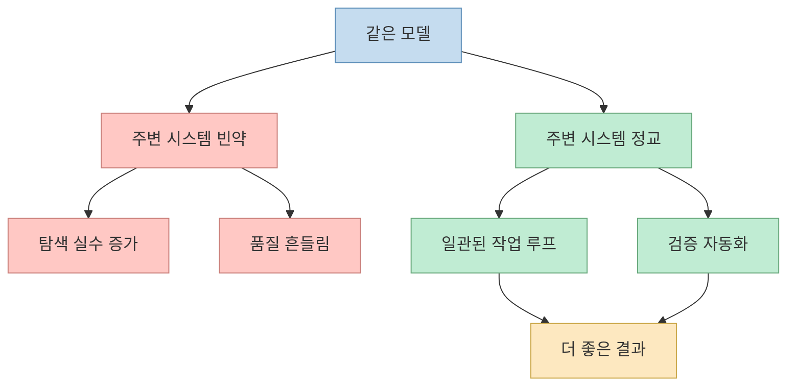
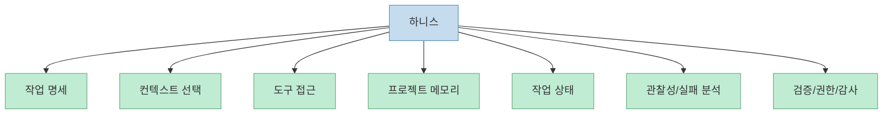
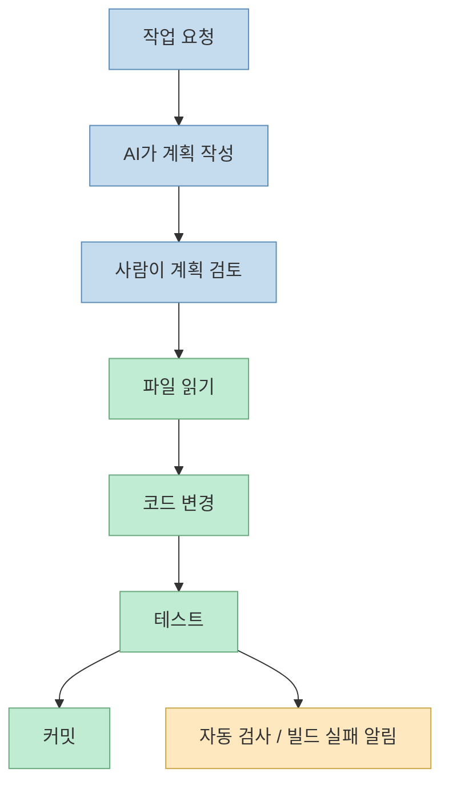
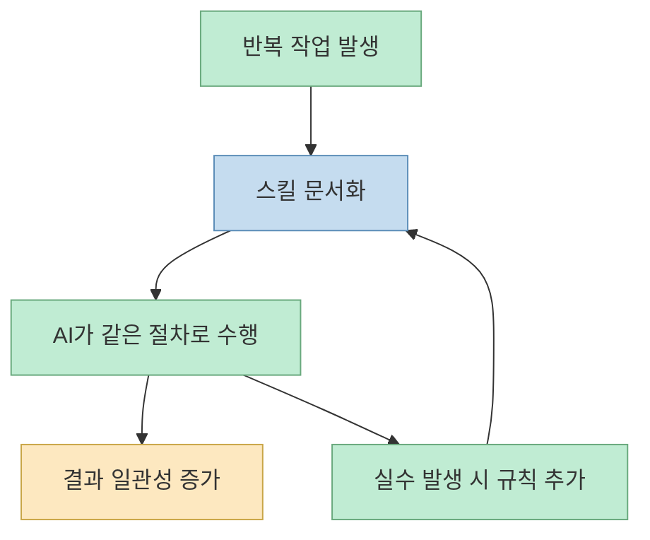
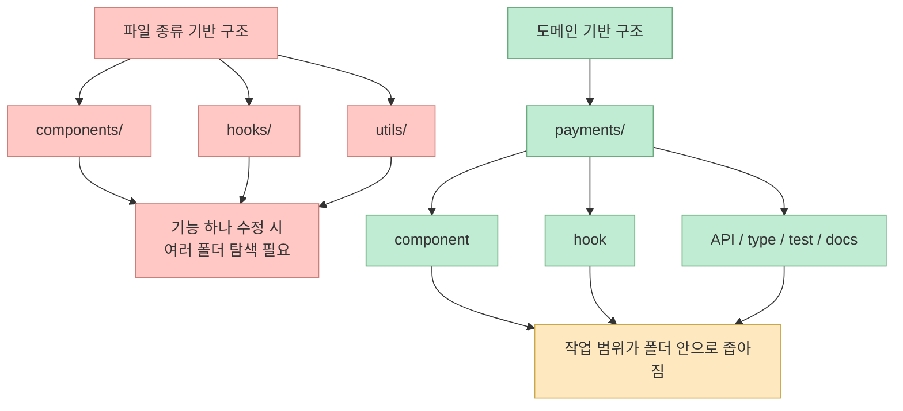
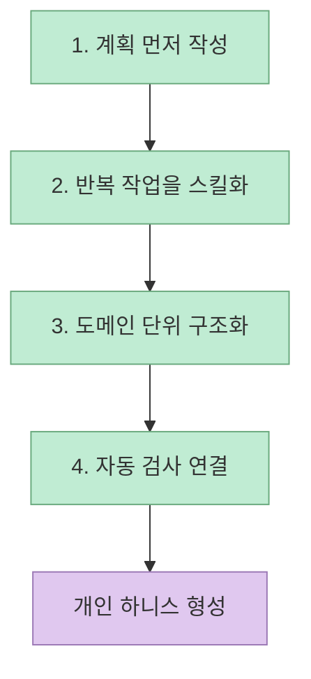

이 영상의 핵심 문장은 제목 그대로다. **모델보다 중요한 건 하니스** 라는 주장이다. 발표자는 작년 6월 대규모 코드 마이그레이션을 반나절 만에 끝냈고, 그것도 최신 대형 모델이 아니라 "소 모델"에 가까운 모델로 해냈다고 말한다. 그리고 그 경험을 통해 깨달은 것이, 결과를 가르는 건 모델 자체보다 모델 주변에 깔린 시스템이라는 점이었다고 설명한다.[영상 0:00](https://youtu.be/8DySHAuAmts?t=0)

이 주장이 흥미로운 이유는 단순히 "프롬프트보다 시스템이 중요하다" 정도가 아니기 때문이다. 영상은 하니스를 **AI에게 일을 맡길 때 필요한 주변 장치 전체** 로 정의하고, 스킬, 도메인 매뉴얼, 자동 검사, 계획 강제, 워크플로우 순서 같은 것들이 실제 생산성 차이를 만든다고 말한다.[영상 2:39](https://youtu.be/8DySHAuAmts?t=159)

<!--more-->

## Sources

- 영상: [모델보다 중요한건 하니스 입니다.](https://youtu.be/8DySHAuAmts?si=9WDLcikAsTT7Ij-C)

## 왜 같은 모델인데도 결과가 다를까

영상 초반부는 많은 사람들이 놓치는 지점을 짚는다. 모두가 새 모델 이름과 벤치마크 점수에 집중하지만, 실제 현장에서는 **같은 모델을 써도 어떤 사람은 막힘 없이 잘 쓰고 어떤 사람은 계속 실망한다** 는 것이다.[영상 0:57](https://youtu.be/8DySHAuAmts?t=57)

발표자는 이 차이를 단순 프롬프트 차이로 보지 않는다. 오히려 같은 드라이버에게 경운기를 주느냐 레이싱카를 주느냐의 차이라고 설명한다. 즉 모델은 같더라도 주변 시스템이 다르면 결과는 완전히 달라진다는 뜻이다.[영상 1:25](https://youtu.be/8DySHAuAmts?t=85)

영상에서는 Cursor가 같은 Claude 모델과 같은 벤치마크에서도 주변 시스템 설계에 따라 점수가 46점에서 80점까지 달라졌다고 소개한다. 또 Stanford 연구를 인용하며 하니스를 잘 짜면 결과물 품질이 크게 올라가지만, 프롬프트만 다듬는 것은 상승폭이 작다고 말한다.[영상 1:13](https://youtu.be/8DySHAuAmts?t=73) 다만 이 두 수치는 영상 속 발표자가 언급한 내용이며, 이 포스트에서는 해당 원문 논문이나 실험 페이지를 별도로 교차 검증하지는 않았다.

즉 여기서 중요한 결론은 특정 숫자보다 방향성이다. **모델 자체보다 모델을 둘러싼 작업 환경이 실제 산출물 차이를 크게 만들 수 있다** 는 주장이다.

## 하니스는 정확히 무엇인가

영상은 하니스를 "AI한테 일을 시킬 때 그 주변의 모든 장치"라고 정의한다.[영상 2:40](https://youtu.be/8DySHAuAmts?t=160) 어떤 도구를 줄지, 어떤 매뉴얼을 읽힐지, 실수는 어떻게 잡을지, 다음 단계는 어떻게 정할지, 이런 것을 모두 합친 것이 하니스라는 뜻이다.

발표자는 이를 신입 직원 비유로 풀어 설명한다.

- A 회사는 매뉴얼도 없고 코드 리뷰도 없다
- B 회사는 온보딩 문서가 있고, 작업 전 스펙을 보고, 자동 검사기가 있고, 빌드 실패 알람도 간다

같은 똑똑한 신입이라도 6개월 뒤 결과는 다를 수밖에 없고, AI도 마찬가지라는 것이다.[영상 1:45](https://youtu.be/8DySHAuAmts?t=105)

영상에서는 연구자들이 하니스를 11개 요소로 나눈다고 설명한다.

- 작업 명세
- 컨텍스트 선택
- 도구 접근
- 프로젝트 메모리
- 작업 상태
- 관찰성
- 실패 원인 분석
- 검증
- 권한
- 감사
- 개입 기록

이 목록이 중요한 이유는, 모델이 이 중 하나일 뿐이라는 점을 보여 주기 때문이다. 발표자는 오히려 모델은 "가장 변동이 적은 부분"이라고 말한다.[영상 2:52](https://youtu.be/8DySHAuAmts?t=172)

즉 하니스는 멋진 추상 개념이 아니라, **AI가 엉뚱하게 움직이지 않게 하는 운영체계** 에 가깝다.

## 발표자가 마이그레이션에서 실제로 깔아 둔 하니스

영상에서 가장 설득력 있는 부분은 추상 설명보다 실제 사례다. 발표자는 작년 6월 회사에서 큰 마이그레이션이 잡혔고, 원래라면 며칠은 걸릴 작업이었다고 말한다. 당시 모델은 최신 최고급 모델도 아니었다고 덧붙인다.[영상 3:26](https://youtu.be/8DySHAuAmts?t=206)

그런데 그 한 달 전부터 발표자는 하니스를 진지하게 설계하고 있었다고 한다. 구체적으로는 다음 세 가지를 했다고 말한다.

1. 작업 전 스펙 리뷰를 강제했다 
2. 파일 읽기 → 변경 → 테스트 → 커밋 순서의 고정 워크플로를 만들었다 
3. 자동 검사와 빌드 실패 알림을 깔았다 

즉 AI에게 "바로 고쳐"라고 하지 않고, 먼저 **어떻게 고칠지 계획을 쓰게 하고**, 그 계획을 사람이 검토하는 단계부터 넣었다는 것이다.[영상 3:40](https://youtu.be/8DySHAuAmts?t=220)

이 예시는 하니스가 거창한 시스템이 아니라, **행동 순서를 고정하고 검증 포인트를 앞당기는 것** 임을 보여 준다.

## 스킬은 레시피 카드처럼 품질을 고정한다

영상 중반부는 스킬 기반 리팩토링으로 넘어간다. 발표자의 설명에 따르면 AI에게 그냥 "리팩토링 해줘"라고 하면 매번 다른 결과가 나온다. 어떤 날은 깔끔하고, 어떤 날은 과하게 뜯어고친다.[영상 4:42](https://youtu.be/8DySHAuAmts?t=282)

그래서 자주 하는 리팩토링 패턴을 스킬이라는 단위로 정리해 둔다는 것이다. 발표자는 이를 음식점의 레시피 카드에 비유한다. 같은 셰프라도 레시피가 있으면 결과가 일정해진다.[영상 5:03](https://youtu.be/8DySHAuAmts?t=303)

여기서 중요한 대목은 스킬이 단발성이 아니라는 점이다. 어떤 케이스에서 AI가 실수하면 "이 경우엔 이렇게 하라"는 문장을 스킬 문서에 추가한다. 그러면 다음부터는 같은 실수를 줄일 수 있다. 즉 사람의 기억에 맡기는 대신 **실수 수정 내용을 자산으로 축적** 하는 방식이다.[영상 5:32](https://youtu.be/8DySHAuAmts?t=332)

발표자는 새 모델로 갈아타도 스킬은 살아남는다고 말한다. 이 표현은 중요하다. 모델은 교체되지만, **잘 정리된 작업 레시피는 모델 위에 남는 자산** 이라는 뜻이다.[영상 5:46](https://youtu.be/8DySHAuAmts?t=346)

## 도메인 기반 유지보수는 AI의 작업 범위를 좁혀 준다

다음 주장은 도메인 기반 유지보수다. 발표자는 일반적으로 코드베이스를 컴포넌트 폴더, 훅 폴더, 유틸 폴더처럼 파일 종류별로 나누지만, AI에게 일을 시킬 때는 그 방식이 효율적이지 않다고 본다.[영상 5:55](https://youtu.be/8DySHAuAmts?t=355)

이유는 간단하다. 예를 들어 결제 기능 하나를 고치려면 관련 파일이 여러 폴더에 흩어져 있어 모두 찾아와야 한다. 사람에게도 어려운 일이니 AI에게도 부담이 된다. 반면 도메인 기반 구조에서는 결제면 결제, 인증이면 인증처럼 관련 컴포넌트, 훅, API, 타입, 테스트, 문서가 한 폴더 안에 모인다.[영상 6:21](https://youtu.be/8DySHAuAmts?t=381)

이 구조의 장점은 단순 정리정돈이 아니다. 발표자는 AI에게 "결제 폴더 안에서만 작업해"라고 범위를 좁힐 수 있어 컨텍스트가 깨끗해지고 실수가 줄어든다고 말한다.[영상 6:55](https://youtu.be/8DySHAuAmts?t=415)

더 나아가 각 도메인 폴더 안에 짧은 도메인 전용 매뉴얼을 두어, 새 기능 추가 전에 AI가 먼저 그 문서를 읽고 시작하게 한다고 설명한다. 이것 역시 시간이 갈수록 누적되는 자산이다.[영상 7:04](https://youtu.be/8DySHAuAmts?t=424)

## 왜 회사를 나왔는가: 하니스는 개인 자산이 되기 때문이다

영상 후반부에서 발표자는 마이그레이션을 끝낸 뒤 오히려 두려움을 느꼈다고 말한다. 며칠 걸릴 일이 반나절에 끝났다는 것은, 자신의 월급 상당 부분이 이미 자동화 가능한 영역이라는 뜻으로 읽혔기 때문이다.[영상 8:49](https://youtu.be/8DySHAuAmts?t=529)

그러면서 5년 뒤를 상상한다. 사람들이 스킬을 쌓고, 도메인 매뉴얼을 다듬고, 하니스를 표준화하면 시니어 개발자라는 직업의 모양이 지금과 같지 않을 수 있다는 위기감이 들었다고 한다.[영상 9:09](https://youtu.be/8DySHAuAmts?t=549)

그가 회사를 나온 이유는 결국 두 가지다.

- 회사 안에서 쌓은 스킬과 매뉴얼은 개인 자산으로 남기 어렵다
- 회사는 다음 분기 매출과 일정이 우선이라, 한 달 이상 투자해 깊은 하니스를 깔기 어렵다

이 설명은 다소 개인적이지만, 하니스가 왜 중요한지 잘 보여 준다. **하니스는 단기 작업 편의가 아니라 누적 생산성 자산** 이기 때문이다.[영상 9:42](https://youtu.be/8DySHAuAmts?t=582)

## 지금 바로 적용할 수 있는 4단계

영상은 꽤 실용적인 도입 순서를 제안한다. 한 달에 하나씩만 깔아도 4개월이면 된다고 말한다.[영상 10:41](https://youtu.be/8DySHAuAmts?t=641)

### 1. 먼저 계획부터 쓰게 하기

AI에게 바로 코드부터 짜라고 하지 말고, **어떻게 고칠 건지 계획부터 정리시키라** 고 말한다. 발표자는 이 한 줄이 결과물 품질을 크게 바꾼다고 강조한다.[영상 10:49](https://youtu.be/8DySHAuAmts?t=649)

### 2. 반복 작업을 스킬로 옮기기

같은 종류의 리팩토링을 세 번 이상 했다면 그건 스킬로 옮길 시점이라는 설명이다. 언제 발동하는지, 어떤 순서로 가는지, 끝나고 무엇을 확인하는지만 적어도 충분하다고 말한다.[영상 11:04](https://youtu.be/8DySHAuAmts?t=664)

### 3. 코드를 도메인 단위로 묶기

기존 코드베이스를 한 번에 다 바꾸지 말고, 새 기능부터 도메인 폴더를 만들어 적용하라고 제안한다. 폴더 안에는 도메인 규칙과 분석 컨텍스트도 함께 둔다.[영상 11:28](https://youtu.be/8DySHAuAmts?t=688)

### 4. 자동 검사 깔기

작업이 끝나면 빌드, 테스트, 린트가 자동으로 돌아가게 해 두라고 말한다. 사람 눈이 아니라 검사 시스템이 먼저 걸러야 위 세 단계의 효과도 안정적으로 유지된다는 논리다.[영상 11:49](https://youtu.be/8DySHAuAmts?t=709)

이 4단계는 거대한 프레임워크가 아니라, **지금 쓰는 모델 주변에 작은 규칙을 계속 추가하는 방식** 으로 설명된다는 점이 좋다.

## "모델은 천장, 하니스는 사다리"라는 비유의 의미

영상 마지막에서 발표자는 "모델은 천장이지만 하니스는 사다리"라고 말한다.[영상 13:26](https://youtu.be/8DySHAuAmts?t=806) 이 비유는 꽤 정확하다.

- 모델은 기본 성능 상한을 정한다
- 하니스는 그 상한에 실제로 얼마나 가까이 갈 수 있는지 결정한다

즉 모델이 좋아도 하니스가 없으면 성능을 제대로 꺼내 쓰기 어렵고, 반대로 모델이 조금 덜 좋아도 하니스가 잘 짜여 있으면 실제 결과는 훨씬 나아질 수 있다는 뜻이다.

이 관점이 중요한 이유는, 지금 많은 팀이 여전히 **모델 갈아타기** 에는 민감하지만 **작업 체계 설계** 에는 무심하기 때문이다. 이 영상은 정확히 그 우선순위를 뒤집으라고 말한다.

## 핵심 요약

이 영상이 말하는 하니스는 프롬프트 몇 줄이 아니다. 

- 계획을 먼저 쓰게 하고 
- 반복 작업을 스킬로 고정하고 
- 도메인 단위로 작업 범위를 묶고 
- 자동 검사로 흔들림을 줄이고 
- 그 모든 것을 시간이 갈수록 누적 자산으로 만드는 시스템이다. 

즉 같은 Claude를 써도 결과가 달라지는 이유는 IQ 차이가 아니라, **그 모델이 어떤 회사 시스템 안에서 일하느냐의 차이** 에 더 가깝다.

## 결론

이 영상의 메시지는 단순하지만 무겁다. 새 모델을 기다리는 시간보다, 지금 쓰는 모델 옆에 스킬 한 줄과 도메인 매뉴얼 한 줄을 더 깔아 두는 편이 실제 생산성에는 더 큰 영향을 줄 수 있다는 것이다. 하니스는 화려하지 않고 바로 자랑하기도 어렵지만, 한번 쌓이기 시작하면 팀과 개인의 작업 방식 전체를 바꾼다. 모델이 바뀌어도 남는 것은 결국 이런 구조물이다.
