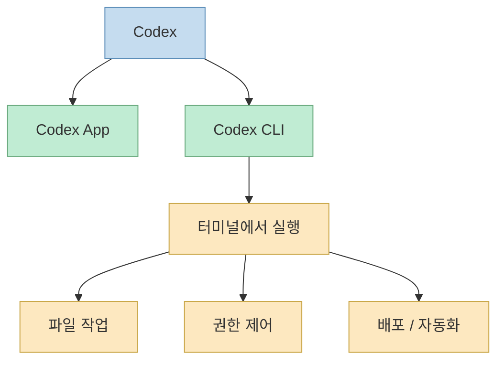
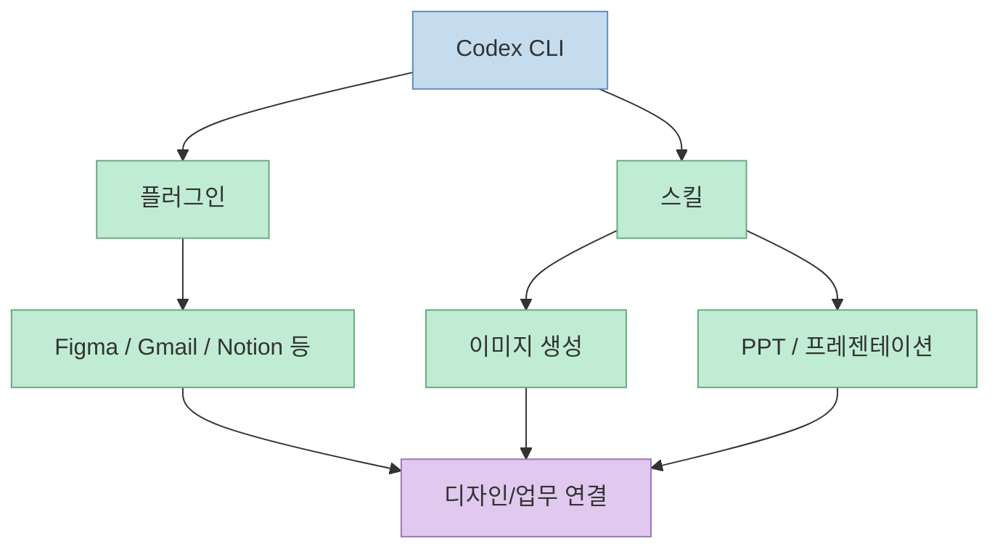
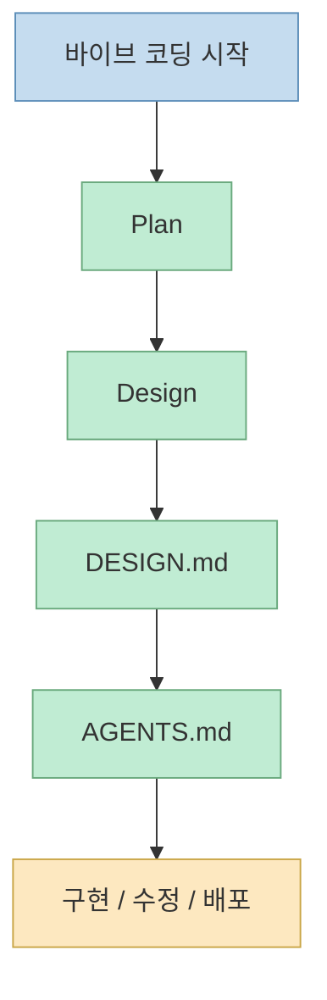
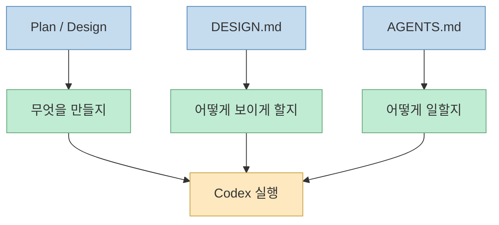

이 영상은 Codex를 단순히 "OpenAI의 코딩 도구"로 소개하지 않는다. 오히려 **Codex를 어떻게 세팅하고, 어떤 권한으로 돌리고, 어떤 문서를 먼저 깔아야 실전 앱 개발이 안정적으로 굴러가는지** 를 보여 주는 라이브 실습에 가깝다. 발표자는 Codex가 최근 토큰 효율성과 `/goal` 기능으로 주목받고 있다고 말하면서도, 실제로 중요한 것은 무작정 코딩을 시작하는 게 아니라 상위 기획서와 디자인 문서, 시스템 규칙을 먼저 깔아두는 것이라고 반복해서 강조한다.[영상 설명란](https://youtu.be/ZDfNfEGo7Fc?si=s5ovlu8kgAtGK3DJ)

즉 이 영상의 메시지는 "Codex가 최고냐 아니냐"를 따지는 리뷰보다는, **Codex를 써서 비개발자도 실제 앱을 배포하려면 어떤 작업 순서와 문서 체계를 가져가야 하는가** 에 더 가깝다.

<!--more-->

## Sources

- 영상: [Codex가 최고라는 소문 직접 검증합니다, 세팅부터 실전 앱 개발까지 전 과정 공개](https://youtu.be/ZDfNfEGo7Fc?si=s5ovlu8kgAtGK3DJ)

## 영상이 보는 Codex의 첫인상: 토큰 효율성과 `/goal`

영상 초반부에서 발표자는 최근 Codex가 많이 회자되는 이유로 두 가지를 든다.

- 토큰 효율성이 좋다는 평
- CLI 안의 `/goal` 기능이 강력하다는 점

특히 `/goal`에 대해서는 목표 설정부터 구현, 검증, 배포까지 스스로 이어 가게 만드는 흐름으로 설명한다. 설명란 요약에서도 `/goal`을 활성화하면 AI가 목표 설정부터 Vercel 배포까지 스스로 진행한다고 적고 있다.[영상 설명란](https://youtu.be/ZDfNfEGo7Fc?si=s5ovlu8kgAtGK3DJ)

하지만 영상 전체를 보면 결론은 조금 다르다. `/goal` 자체가 핵심이라기보다, **그 목표가 어떤 문서와 규칙 위에서 실행되느냐** 가 더 중요하게 그려진다.

## Codex CLI는 터미널에서 돌아가는 작업형 도구다

발표자는 Codex App과 Codex CLI를 구분한다. Codex CLI는 터미널에서 작동하는 코딩 도구라고 설명하며, 설치는 한 줄로 가능하다고 안내한다.[영상 3:00 전후 자막](https://youtu.be/ZDfNfEGo7Fc?t=178)

이 설명은 중요하다. 영상이 상정하는 Codex의 기본 사용 환경은 웹 UI가 아니라 **터미널 중심의 작업 환경** 이다. 따라서 비개발자에게는 처음에 낯설 수 있지만, 반대로 한번 진입하면 파일 접근, 배포, 권한 제어, 플러그인 연결 같은 생산성 작업을 더 직접적으로 다룰 수 있게 된다.

즉 Codex는 단순 채팅 도구보다 **작업형 에이전트** 에 더 가깝게 소개된다.

## YOLO 권한 설정은 편의 기능이 아니라 작업 속도 레버다

영상 설명란에는 YOLO 모드와 권한 설정 꿀팁이 별도 챕터로 잡혀 있다.[영상 설명란 2:26](https://youtu.be/ZDfNfEGo7Fc?si=s5ovlu8kgAtGK3DJ) 발표자는 매번 승인을 요구하는 흐름을 줄이기 위해 full access 권한을 부여하는 방식과, 토큰을 조금 더 써도 작업 속도를 높이는 fast 모드 설정을 언급한다.

이 포인트는 단순한 "위험한 기능" 소개가 아니라, 에이전트형 코딩에서 반복 승인 루프가 얼마나 큰 마찰인지 보여 준다. 권한을 너무 보수적으로 두면 매 단계에서 승인을 기다리느라 흐름이 끊기고, 너무 느슨하게 두면 리스크가 커진다. 영상은 이 균형을 **작업 목적에 맞게 조절하는 것 자체가 세팅의 일부** 라고 본다.

## Codex의 강점은 플러그인과 스킬을 함께 얹을 때 살아난다

영상은 Codex를 단독 도구로만 다루지 않는다. 설명란과 본문에서 Figma, Gmail, Notion, Slack 같은 플러그인/앱 연결과, 이미지 스킬, 프레젠테이션 스킬 같은 보조 능력까지 함께 강조한다.[영상 설명란 3:05, 5:24](https://youtu.be/ZDfNfEGo7Fc?si=s5ovlu8kgAtGK3DJ)

특히 발표자는 이미지 생성 모델과 Figma 연동을 통해 랜딩 페이지 디자인을 보강하고, 프레젠테이션 스킬로 PPT 자동 생성까지 이어 가려는 흐름을 보여 준다. 즉 Codex는 코드 생성 도구 하나라기보다, **작업 목적에 따라 기능을 조합하는 허브** 로 쓰인다.

이 구조는 Codex를 "코드만 짜는 AI"가 아니라 **업무 자동화와 제작 도구를 엮는 작업 중심 에이전트** 로 이해하게 만든다.

## 영상이 가장 강하게 말하는 것은 문서 4종이다

설명란의 핵심 요점 3번이 이 영상의 중심이다. 바이브 코딩의 핵심은 무작정 코딩을 시작하는 것이 아니라 다음 네 종류의 문서를 먼저 탄탄하게 구축하는 것이라고 적혀 있다.[영상 설명란](https://youtu.be/ZDfNfEGo7Fc?si=s5ovlu8kgAtGK3DJ)

- 상위 기획서 `Plan`
- 상세 기획서 `Design`
- 스타일 가이드 `DESIGN.md`
- 시스템 규칙 `AGENTS.md`

이 네 문서는 역할이 다르다.

- `Plan`: 무엇을 만들고 왜 만드는지
- `Design`: 기능 구조와 구현 범위
- `DESIGN.md`: 시각 스타일과 디자인 규칙
- `AGENTS.md`: AI가 따라야 할 시스템 가이드라인

즉 영상은 결국 "좋은 AI 코딩 결과는 모델보다 **문서화된 의도와 규칙** 에서 나온다"는 방향을 택한다.

## `DESIGN.md`는 보기 좋은 화면을 넘어서 디자인 일관성을 붙잡는 장치다

영상 설명란의 6:13 챕터는 `DESIGN.md`를 활용한 랜딩 페이지 디자인 고도화를 따로 잡고 있다.[영상 설명란](https://youtu.be/ZDfNfEGo7Fc?si=s5ovlu8kgAtGK3DJ) 발표자는 Figma 플러그인이나 외부 디자인 자산을 활용해 `DESIGN.md`를 만들고, 이를 참조시켜 밋밋한 레이아웃을 더 완성도 높은 비주얼로 끌어올리는 흐름을 보여 주려 한다.

이건 실무적으로 중요하다. 많은 AI 코딩 결과물이 기능은 대강 맞지만 화면이 비슷비슷하고 밋밋한 이유는, 모델이 디자인 의도를 모르기 때문이다. `DESIGN.md`는 이를 해결하기 위한 **스타일 기억 장치** 역할을 한다.

즉 색상, 타이포그래피, 간격, 섹션 구조 같은 디자인 원칙을 문서화하면, AI가 화면을 만들 때도 그 기준을 반복 재사용할 수 있다.

## `AGENTS.md`는 단순 규칙 파일이 아니라 하니스의 중심축이다

영상 설명란의 8:20 챕터는 `AGENTS.md` 시스템 가이드라인 문서 작성법을 별도 항목으로 소개한다.[영상 설명란](https://youtu.be/ZDfNfEGo7Fc?si=s5ovlu8kgAtGK3DJ)

발표자 흐름을 보면 `AGENTS.md`는 단순 메모가 아니다. AI가 어떤 순서로 일해야 하는지, 어떤 검증을 통과해야 하는지, 무엇을 건드리면 안 되는지, 어떤 문서를 먼저 읽어야 하는지 같은 **작업 운영 규칙의 집합** 에 가깝다.

즉 Plan과 Design이 "무엇을 만들지"를 정한다면, `AGENTS.md`는 **어떻게 일할지** 를 정한다.

이건 결국 이전 하니스 논의와도 이어진다. AI가 잘 작동하느냐는 모델보다도 **작업 규칙이 얼마나 잘 외부화되어 있느냐** 에 달려 있다.

## `/goal`은 단독 기능보다 "문서 위에서 돌아가는 자동 진행기"에 가깝다

영상은 `/goal`을 적극적으로 보여 준다. ERP 휴가 시스템과 실시간 회의록 앱을 만들 때 목표를 던지고, 구현부터 배포까지 이어 가는 흐름을 시연한다.[영상 설명란 7:03, 8:53](https://youtu.be/ZDfNfEGo7Fc?si=s5ovlu8kgAtGK3DJ)

하지만 영상 전체 맥락을 보면 `/goal`은 만능 명령이라기보다, **문서와 규칙이 깔려 있을 때 그 위를 달리는 자동 진행기** 로 보는 편이 정확하다.

- Plan이 없으면 목표가 흔들리고
- Design이 없으면 구현 범위가 퍼지고
- `DESIGN.md`가 없으면 UI 품질이 흔들리고
- `AGENTS.md`가 없으면 작업 순서와 검증이 일관되지 않는다

즉 `/goal`은 마법봉이 아니라 **잘 정의된 환경에서 강해지는 실행 엔진** 이다.

## 실전 데모가 말하는 것은 "비개발자도 된다"보다 "문서화하면 된다"에 가깝다

영상 설명란은 비개발자도 API 연동과 AI 도구 조합을 통해 직접 서비스를 배포하고 운영할 수 있는 시대가 되었다고 말한다.[영상 설명란](https://youtu.be/ZDfNfEGo7Fc?si=s5ovlu8kgAtGK3DJ)

이 메시지는 분명 희망적이지만, 영상의 실제 데모를 더 정확히 읽으면 초점은 "개발 지식이 전혀 필요 없다"가 아니다. 오히려 **개발 지식 부족을 문서화와 규칙화로 보완할 수 있다** 에 가깝다.

발표자가 보여 주는 흐름은 계속 같다.

- 먼저 세팅
- 그다음 권한
- 그다음 플러그인/스킬
- 그다음 문서 4종
- 마지막에 구현과 배포

즉 비개발자라도 되는 이유는 AI가 모든 것을 알아서 해서가 아니라, **사람이 먼저 환경과 규칙을 제대로 깔면 그 위에서 AI가 일할 수 있기 때문** 이다.

## 핵심 요약

이 영상이 말하는 Codex 활용법의 핵심은 `/goal` 하나가 아니다. 

- Codex CLI를 터미널 기반 작업 도구로 세팅하고 
- 권한과 속도 설정을 작업 목적에 맞게 조절하고 
- 플러그인과 스킬로 기능 범위를 넓히고 
- `Plan`, `Design`, `DESIGN.md`, `AGENTS.md` 4종 문서를 먼저 만들고 
- 그 위에서 구현과 배포를 자동화한다. 

즉 바이브 코딩의 핵심은 "빨리 코딩 시작"이 아니라 **먼저 문서를 깔고 나중에 자동화하는 것** 이다.

## 결론

이 영상이 설득력 있는 이유는 Codex를 과장된 만능 도구로 밀지 않기 때문이다. 오히려 잘 굴러가는 Codex 사용법은 세팅, 권한, 플러그인, 디자인 문서, 시스템 규칙 같은 주변 구조를 먼저 잡는 데서 나온다고 보여 준다. 결국 Codex의 강점은 모델 하나보다, **문서화된 의도와 하니스 위에서 구현·검증·배포를 연결하는 능력** 에 있다. 비개발자에게도 기회가 커진 것은 맞지만, 그 기회를 현실로 바꾸는 건 여전히 문서와 구조를 먼저 세우는 사람이다.
