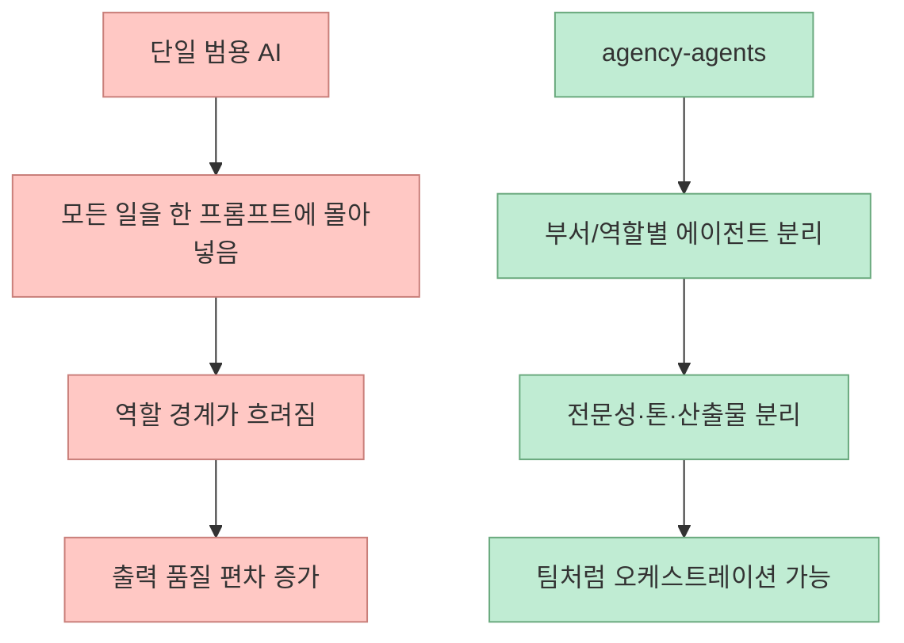
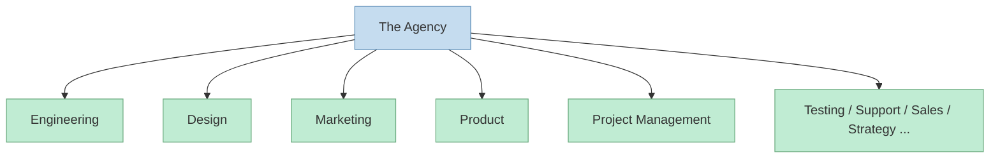
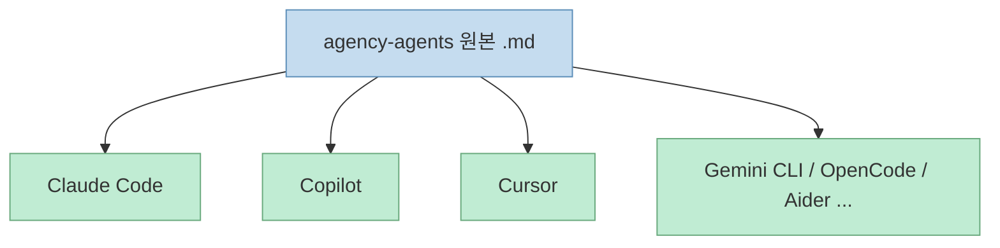

`agency-agents`를 처음 보면 그냥 에이전트 파일이 엄청 많이 들어 있는 저장소처럼 보인다. 그런데 Threads 원문이 짚은 핵심은 숫자 자체가 아니다. **147개 에이전트를 단순히 모아 둔 게 아니라, 실제 회사 부서 구조처럼 나눠 놓았다는 점** 이다.[Threads 원문](https://www.threads.net/@eddiemoon0720/post/DYmh_iPk7AV)

이 포인트가 중요한 이유는, 많은 에이전트 저장소가 결국 "좋은 프롬프트 모음집" 수준에서 끝나기 때문이다. 반면 `agency-agents`는 프론트엔드, 백엔드, 디자인, 마케팅, 전략, 프로젝트 관리, 테스트처럼 **조직도 단위로 역할을 분리** 한다. 그래서 이 저장소를 이해할 때는 "에이전트가 몇 개냐"보다 **AI 팀을 어떤 방식으로 설계했느냐** 를 봐야 한다.

<!--more-->

## Sources

- Threads 원문: https://www.threads.com/@eddiemoon0720/post/DYmh_iPk7AV?xmt=AQG0rrxOyMZY5QqB050nMc_PUULK_crNjDKTX_zsm1GjBigikZEWqUnjKXP4FQ1uRjk68EaB&slof=1
- 원본 저장소: https://github.com/msitarzewski/agency-agents

## Threads가 강조한 포인트는 "실제 회사 부서 구조"다

원문은 `agency-agents`를 "AI 에이전트로 팀을 만들어 분담시킬 때 가장 유명하고 유용한 오픈소스"라고 소개하면서, 단순히 agent를 많이 넣은 것이 아니라 **실제 회사 부서 구조처럼 짜여 있는 게 핵심** 이라고 설명한다.[Threads 원문](https://www.threads.net/@eddiemoon0720/post/DYmh_iPk7AV)

이 설명은 README와도 잘 맞는다. 공식 소개 문구는 "A complete AI agency at your fingertips"이며, 프론트엔드 개발자부터 Reddit 커뮤니티 빌더까지 각자 역할과 성격, 프로세스, 결과물이 있는 specialist roster라고 말한다.[GitHub README](https://github.com/msitarzewski/agency-agents)

즉 이 저장소의 메시지는 "AI 하나를 잘 쓰자"보다 **역할이 분리된 AI 팀을 운영하자** 쪽에 더 가깝다.

## README 기준으로 보면 "프롬프트 팩"보다 "AI 에이전시 운영체제"에 가깝다

README는 이 저장소를 단순 프롬프트 모음처럼 설명하지 않는다. 각 agent는 다음 요소를 가진다고 한다.[GitHub README](https://github.com/msitarzewski/agency-agents)

- 정체성과 성격
- 핵심 미션과 워크플로
- 기술적 산출물과 코드 예시
- 성공 지표와 커뮤니케이션 스타일

즉 agent 파일 하나가 단순 "이런 답을 해라" 수준이 아니라, **역할 정의서 + 작업 절차 + 산출물 기대치** 를 함께 품고 있다. 그래서 복사해서 바로 대화에 붙여 넣는 prompt snippet이라기보다, 특정 직무를 흉내 내는 **작업 역할 패키지** 로 보는 편이 더 맞다.

## 중요한 건 숫자가 아니라 division 구조다

README 기준으로 이 저장소는 12개 division, 144개 이상의 specialized agents를 내세운다. Threads 원문은 147개라고 요약했는데, 실제 숫자는 저장소가 빠르게 갱신되므로 시점에 따라 달라질 수 있다. 제가 확인한 GitHub 공개 페이지 기준으로는 **2026년 5월 22일 시점 약 94.7k stars, 약 15.6k forks** 였고, README 본문에는 "144 Specialized Agents across 12 divisions"라고 적혀 있었다.[GitHub 저장소 페이지](https://github.com/msitarzewski/agency-agents)

하지만 더 중요한 건 division 자체다. README에 보이는 상위 구분만 봐도 다음처럼 실제 회사 조직도에 가깝다.[GitHub README](https://github.com/msitarzewski/agency-agents)

- Engineering
- Design
- Marketing
- Product
- Project Management
- Sales
- Strategy
- Support
- Testing
- Finance
- Academic
- Specialized

이 구조는 곧, 사용자가 "에이전트를 어떻게 부를지"를 직무 언어로 바꿔 준다. 예를 들어 "리액트 컴포넌트를 고쳐줘" 대신 "Frontend Developer mode", "온보딩을 빨리 해줘" 대신 "Codebase Onboarding Engineer"처럼 역할 단위로 지시할 수 있다.

## Engineering만 봐도 왜 많이 퍼졌는지 이해된다

README의 Engineering Division만 봐도 저장소의 철학이 드러난다. 단순히 "코더" 한 명이 아니라 다음처럼 세부 직무가 갈라져 있다.[GitHub README](https://github.com/msitarzewski/agency-agents)

- Frontend Developer
- Backend Architect
- Mobile App Builder
- AI Engineer
- DevOps Automator
- Rapid Prototyper
- Senior Developer
- Security Engineer
- Incident Response Commander
- Solidity Smart Contract Engineer
- Codebase Onboarding Engineer

이건 단순 과장된 이름짓기가 아니다. 실제 팀에서 서로 다른 책임과 산출물, 판단 기준을 갖는 역할들을 AI 호출 단위로 쪼갠 것이다.

즉 `agency-agents`는 에이전트를 "모델 인격화"가 아니라 **업무 분업의 인터페이스** 로 본다.

## Claude Code와 특히 잘 맞는 이유

README는 Claude Code용 사용법을 1순위로 제시한다. `./scripts/install.sh --tool claude-code`로 설치하거나 카테고리별 `.md` 파일을 `~/.claude/agents/`로 복사하는 방식을 안내한다.[GitHub README](https://github.com/msitarzewski/agency-agents)

이 조합이 잘 맞는 이유는 Claude Code류 도구가 원래부터 **작업 역할 분리, 지침 문서, 서브에이전트 호출** 과 잘 어울리기 때문이다. `agency-agents`는 이를 미리 구조화해 준다.

- agent 파일이 이미 직무별로 분리되어 있고
- 설치 스크립트가 있고
- 여러 도구용 변환 스크립트까지 제공한다

즉 이 저장소는 생각보다 "프롬프트 파일 모음"보다 훨씬 제품화된 상태에 가깝다.

## 멀티 툴 전략도 이 저장소가 커진 이유다

README가 흥미로운 부분 중 하나는 Claude Code만 지원하지 않는다는 점이다. 같은 agent 세트를 여러 도구로 변환·설치하는 스크립트를 제공한다.[GitHub README](https://github.com/msitarzewski/agency-agents)

지원 목록에는 다음이 포함된다.

- Claude Code
- GitHub Copilot
- Antigravity
- Gemini CLI
- OpenCode
- Cursor
- Aider
- Windsurf
- OpenClaw
- Qwen Code
- Kimi Code

이건 단순 "호환성" 이상의 의미가 있다. 즉 `agency-agents`의 핵심 가치는 특정 모델이 아니라, **역할 정의와 작업 운영 규칙이 도구를 넘어 재사용된다는 점** 에 있다.

이런 포터블한 구조는 저장소가 단순 유행 prompt pack이 아니라 **이식 가능한 AI 조직도** 로 소비되게 만든다.

## 왜 사람들이 "회사 조직도형" 에이전트에 끌리는가

이 저장소가 계속 언급되는 이유는 아마도 현재 많은 사용자가 이미 느끼고 있는 문제와 맞닿아 있기 때문이다.

- 범용 AI 하나로 모든 일을 시키면 결과 톤이 흔들린다
- 문서 작성, 설계, 구현, 마케팅, 디자인은 서로 다른 사고방식이 필요하다
- 팀처럼 역할을 나눠야 품질 기대치가 명확해진다

`agency-agents`는 바로 이 불편을 정면으로 다룬다. 즉 "더 똑똑한 단일 모델"보다 **더 잘 나뉜 역할 구조** 가 실무 생산성에 중요하다는 방향성과 맞아떨어진다.

## 그렇다고 자동으로 팀이 되는 것은 아니다

여기서 중요한 한계도 있다. 에이전트를 역할별로 많이 깔아 둔다고 자동으로 좋은 팀이 생기지는 않는다. 역할이 늘어나면 오히려 다음 문제가 생길 수도 있다.

- 어떤 agent를 언제 호출할지 판단이 어려워짐
- 역할이 겹쳐 중복 작업이 생김
- 컨텍스트 전달이 부실하면 specialist도 엉뚱한 일을 함

즉 `agency-agents`는 "완성된 팀"이 아니라, **역할을 나누기 위한 기본 부품 세트** 로 보는 편이 맞다. 결국 누군가는 orchestrator 역할을 하거나, 최소한 어떤 순서로 어떤 agent를 쓸지에 대한 운영 원칙을 가져야 한다.

## 2026년 5월 22일 기준으로 보이는 상태

제가 확인한 시점인 **2026년 5월 22일** 기준 GitHub 공개 페이지에서 보인 주요 상태는 대략 다음과 같았다.[GitHub 저장소 페이지](https://github.com/msitarzewski/agency-agents)

- stars 약 94.7k
- forks 약 15.6k
- issues 49
- pull requests 75
- commits 약 291

README 본문에는 "144 Specialized Agents across 12 divisions"라고 적혀 있었고, Threads 원문은 "147개 에이전트"라고 소개했다. 이 차이는 저장소가 빠르게 변하는 상태임을 감안해 **시점 차이로 보는 편이 자연스럽다**.

## 핵심 요약

`agency-agents`의 진짜 특징은 에이전트 숫자가 아니다. 

- 실제 회사 부서 구조처럼 역할을 분리하고 
- 각 agent에 성격, 프로세스, 산출물, 성공 기준을 넣고 
- Claude Code를 포함한 여러 도구에 이식 가능하게 만들고 
- 범용 AI 하나 대신 역할 기반 AI 팀을 운영하게 만든다. 

즉 이 저장소는 prompt pack이라기보다 **AI 조직도 템플릿** 에 더 가깝다.

## 결론

Threads 원문이 정확히 짚은 것처럼, `agency-agents`가 계속 회자되는 이유는 "147개 agent가 있다"가 아니라 "회사처럼 짜여 있다"는 데 있다. 많은 사용자가 이제 단일 AI에게 모든 일을 몰아붙이는 방식의 한계를 느끼고 있고, 이 저장소는 그 대안으로 **역할 분리된 AI 팀 운영 방식** 을 제시한다. 다만 진짜 가치는 agent를 많이 설치하는 데 있지 않다. 어떤 역할을 어떤 순서로 조합할지, 그리고 그 역할 분담을 자기 업무 흐름에 맞게 줄이는 데 있다.
