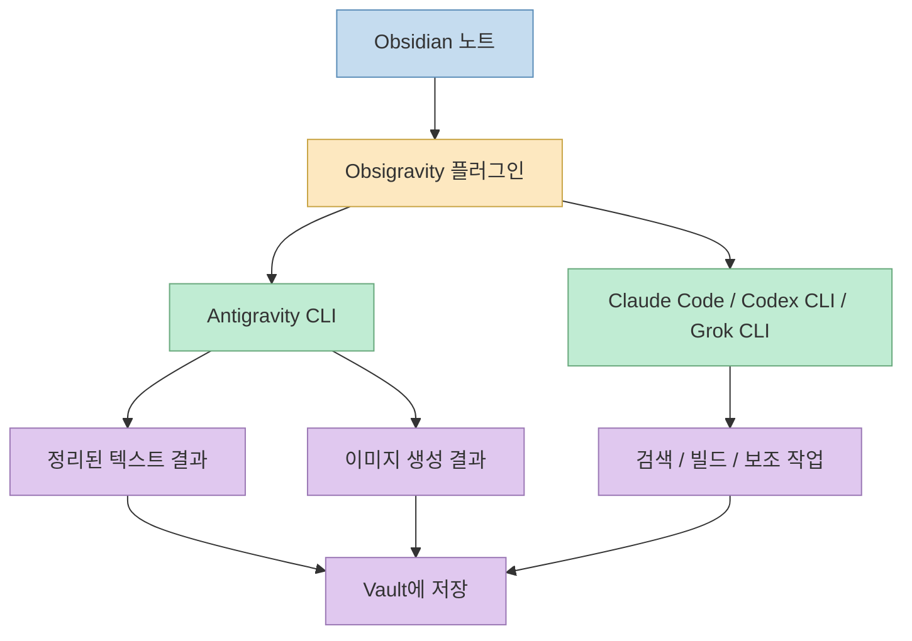
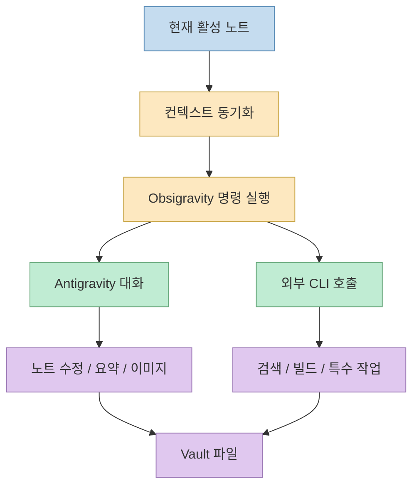
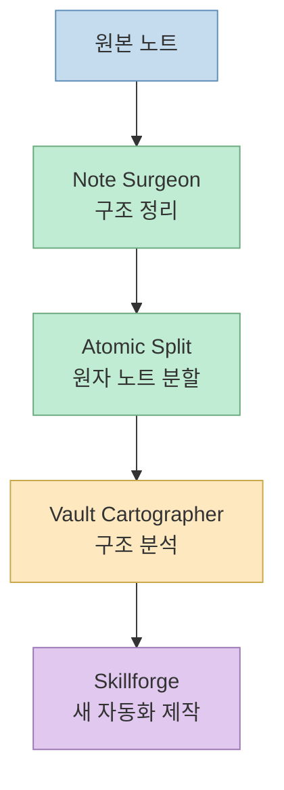
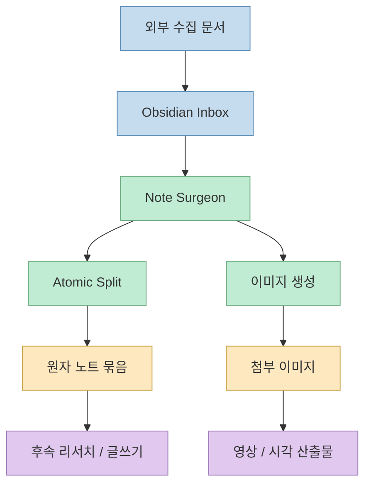
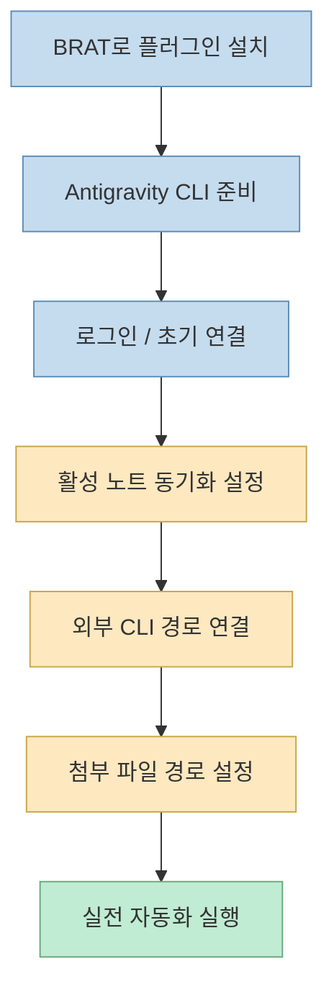
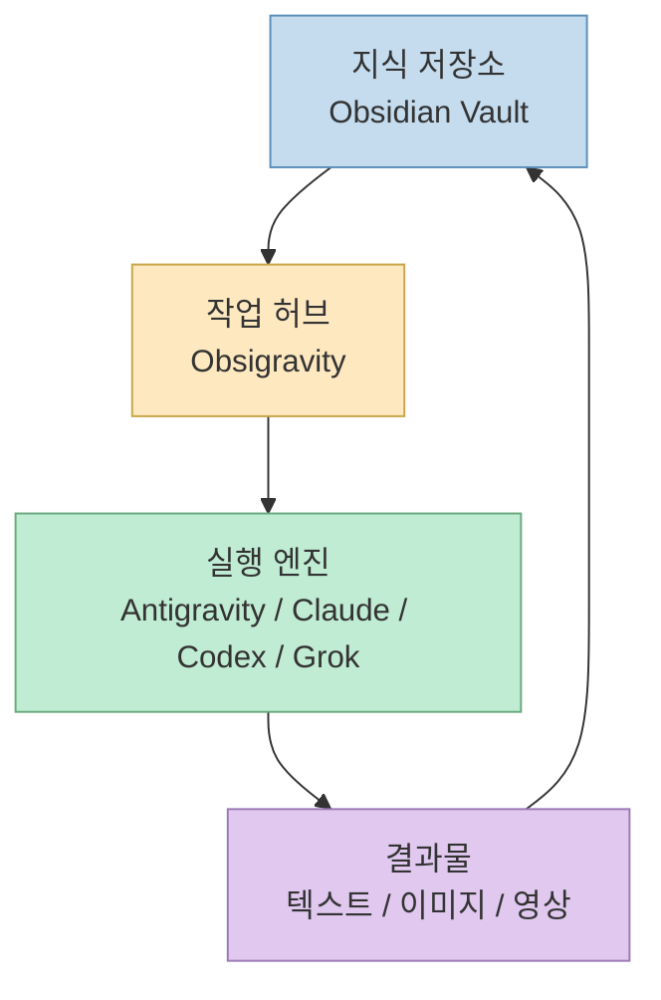

이 영상이 흥미로운 이유는 단순히 "옵시디언용 AI 플러그인 하나"를 소개해서가 아니다. 발표자가 실제로 보여 주는 것은 **옵시디언을 메모 앱으로 쓰는 수준을 넘어, 여러 CLI 에이전트를 노트 기반 작업장으로 묶는 방식** 이다. Antigravity CLI를 중심에 두고, Claude Code, Codex CLI, Grok CLI 같은 외부 도구를 연결해 텍스트 정리, 이미지 생성, 영상 생성, 검색까지 한 흐름으로 이어 붙인다.[영상 0:44](https://youtu.be/L_9w6IJmSyA?t=44)

즉 핵심은 "AI에게 질문한다"가 아니라, **노트가 작업 인터페이스가 되고 CLI가 실행 엔진이 되는 구조** 다. 발표자가 만든 `obsigravity` 플러그인은 그 연결면을 담당한다.[영상 2:36](https://youtu.be/L_9w6IJmSyA?t=156)

<!--more-->

## Sources

- 영상: [Antigravity CLI 사용법! Obsidian AI 자동화 끝판왕 플러그인 무료 제공!](https://youtu.be/L_9w6IJmSyA?si=XpnRmhSyUcdCjU6r)
- 저장소: [reallygood83/obsigravity](https://github.com/reallygood83/obsigravity)

## 이 영상의 핵심은 "옵시디언 안에서 CLI를 굴린다"는 점이다

발표자는 Google I/O 이후 주목받는 Antigravity CLI를 옵시디언에 붙여 쓸 수 있게 만들었다고 설명한다. 여기서 중요한 건 Antigravity 자체보다도, **터미널에서 돌아가는 AI 도구들을 옵시디언 노트와 연결했다는 점** 이다.[영상 1:17](https://youtu.be/L_9w6IJmSyA?t=77)

영상에서 `obsigravity`는 다음 역할을 한다.

- 현재 노트를 AI 입력 컨텍스트로 넘긴다
- 대화 기록을 옵시디언 안에서 본다
- 노트 기반 이미지 생성을 트리거한다
- 외부 CLI 도구 경로를 연결한다
- 결과물을 다시 볼트 안 파일로 저장한다

즉 이 플러그인은 모델 그 자체보다 **메모 저장소와 CLI 작업 흐름을 연결하는 오케스트레이션 레이어** 로 보는 편이 정확하다.[영상 3:32](https://youtu.be/L_9w6IJmSyA?t=212)

## 발표자가 만든 `obsigravity`는 "노트 기반 콘솔"에 가깝다

영상에서 보이는 UI는 일반적인 채팅 플러그인보다 조금 다르다. 발표자는 Antigravity 대화 히스토리를 별도 패널에서 보고, 현재 활성 노트를 기반으로 AI 작업을 실행하고, 이미지 생성이나 빌드 작업도 같은 흐름으로 연결한다.[영상 4:44](https://youtu.be/L_9w6IJmSyA?t=284)

이 구조가 중요한 이유는 다음과 같다.

첫째, 입력의 중심이 프롬프트 창이 아니라 **현재 작업 중인 노트** 다. 즉 "질문을 던지고 답을 받는 앱"이 아니라 "문서 상태를 읽고 그 문서에 개입하는 작업 환경"이 된다.

둘째, 결과가 다시 옵시디언 볼트에 남는다. 채팅창에서 사라지는 답변이 아니라, 후속 편집과 링크 연결이 가능한 Markdown 자산으로 남기 때문에 지식 축적 흐름과 잘 맞는다.[영상 6:03](https://youtu.be/L_9w6IJmSyA?t=363)

셋째, 발표자는 외부 CLI Connector를 통해 Claude Code, Codex CLI, Grok CLI까지 연결할 수 있다고 보여 준다. 이 말은 곧 **옵시디언이 특정 모델 전용 앱이 아니라, 여러 실행 엔진을 갈아 끼울 수 있는 허브** 가 된다는 뜻이다.[영상 18:52](https://youtu.be/L_9w6IJmSyA?t=1132)

## 영상이 강조하는 4개 스킬은 "메모를 자산으로 바꾸는 단계"에 맞춰져 있다

발표자는 플러그인 안에 4개 스킬이 들어 있다고 설명한다. 이름은 다 다르지만 역할은 분명하다.[영상 8:04](https://youtu.be/L_9w6IJmSyA?t=484)

### 1. Note Surgeon

긴 노트를 읽고 구조를 고친다. 제목, 섹션, frontmatter, 태그, 콜아웃, 링크 정리처럼 **문서 가독성과 관리성을 높이는 수술 도구** 에 가깝다.[영상 8:16](https://youtu.be/L_9w6IJmSyA?t=496)

### 2. Atomic Split

긴 문서를 여러 원자 노트로 나눈다. 발표자는 한 덩어리 리포트를 6개 정도의 세부 노트로 쪼개고 상호 링크를 붙이는 예시를 보여 준다. 이는 한 문서를 저장하는 것보다, **재조합 가능한 노드 묶음으로 지식을 재편하는 단계** 로 볼 수 있다.[영상 10:40](https://youtu.be/L_9w6IJmSyA?t=640)

### 3. Vault Cartographer

볼트의 폴더와 노트 군집을 분석한다. 지식 저장소가 커질수록 무엇이 어디에 모여 있는지 파악하기 어려워지는데, 이 스킬은 **볼트 구조를 지도처럼 읽는 역할** 을 맡는다.[영상 8:45](https://youtu.be/L_9w6IJmSyA?t=525)

### 4. Skillforge

새 옵시디언 스킬을 만드는 보조 도구다. 즉 사용자는 고정 기능만 소비하는 것이 아니라, 자기 작업 방식에 맞는 자동화 스킬을 직접 늘릴 수 있다.[영상 9:06](https://youtu.be/L_9w6IJmSyA?t=546)

이 네 단계는 결국 **수집 → 정리 → 분해 → 구조화 → 확장** 이라는 지식 운영 흐름을 보여 준다.

## 데모의 진짜 포인트는 "노트 하나가 여러 산출물의 출발점이 된다"는 점이다

영상에서 발표자는 Jarvis/OpenClaw 텔레그램 흐름을 통해 Google I/O 관련 보고서를 옵시디언 inbox로 가져온 뒤, 그 문서를 `obsigravity`로 다듬고, 다시 쪼개고, 이미지까지 붙이는 예시를 보여 준다.[영상 11:40](https://youtu.be/L_9w6IJmSyA?t=700)

이 흐름을 보면 노트는 단순 저장물이 아니다.

- 외부에서 수집한 초안이 들어오는 inbox
- AI가 구조를 다듬는 편집 대상
- Atomic Split의 입력 문서
- 이미지 생성의 프롬프트 소스
- 이후 영상 제작의 재료

즉 하나의 Markdown 노트가 **보고서, 카드형 메모, 이미지, 심지어 비디오 워크플로의 출발점** 이 된다.

발표자는 특히 Antigravity CLI 쪽에서 당시 테스트 기준으로는 TTS나 영상 생성이 충분하지 않아 Grok Build를 같이 쓰는 장면을 보여 준다. 이 부분은 "한 모델이 모든 걸 다 한다"가 아니라, **작업 종류에 따라 다른 CLI를 연결해 쓰는 멀티 엔진 구조** 가 더 현실적이라는 걸 보여 준다.[영상 15:21](https://youtu.be/L_9w6IJmSyA?t=921)

## 설치와 연결에서 중요한 것은 "플러그인 설치"보다 "활성 노트 동기화"다

영상 후반부에서는 BRAT로 플러그인을 설치하고, 필요한 경우 Antigravity CLI를 설치 또는 업데이트하며, 구글 로그인까지 진행하는 흐름이 소개된다.[영상 16:30](https://youtu.be/L_9w6IJmSyA?t=990)

하지만 실제 운영 관점에서 더 중요한 것은 다음 두 가지다.

### 1. 활성 노트가 CLI 컨텍스트로 잘 넘어가야 한다

발표자는 활성 노트 자동 동기화 비슷한 동작을 켜 두는 것이 중요하다고 보여 준다. 그래야 지금 보고 있는 문서가 곧바로 CLI 입력이 된다. 이게 빠지면 결국 복사·붙여넣기 노가다로 되돌아간다.[영상 17:10](https://youtu.be/L_9w6IJmSyA?t=1030)

### 2. 외부 CLI 경로를 명시적으로 연결해야 한다

Claude Code, Codex CLI, Grok CLI처럼 별도 도구를 붙이려면 CLI 경로와 호출 방식을 정확히 지정해야 한다. 이 부분이 되면 옵시디언은 단순 문서 편집기가 아니라 **여러 실행기를 호출하는 런처** 로 바뀐다.[영상 18:52](https://youtu.be/L_9w6IJmSyA?t=1132)

또 발표자는 생성 이미지가 저장될 attachment 경로도 설정 가능한 것으로 보여 준다. 이 역시 중요하다. 결과물이 앱 내부에 갇히지 않고 **볼트 파일 구조 안에 남아야 후속 자동화가 가능하기 때문** 이다.[영상 7:24](https://youtu.be/L_9w6IJmSyA?t=444)

## 이 영상이 보여 주는 더 큰 메시지는 "개인용 에이전트 작업 허브"다

영상 마지막 메시지는 의외로 단순하다. 중요한 것은 특정 AI 한 개가 아니라, **터미널 기반 도구들을 서로 연결해서 내 방식대로 일하게 만드는 것** 이라는 점이다.[영상 21:03](https://youtu.be/L_9w6IJmSyA?t=1263)

이 관점에서 보면 `obsigravity`는 옵시디언 플러그인인 동시에 다음 변화를 상징한다.

- 메모 앱이 채팅 앱으로 바뀌는 것이 아니라
- 메모 앱이 작업 허브로 바뀌고
- 여러 AI CLI가 백엔드 실행기로 붙고
- 결과가 다시 Markdown 자산으로 귀환하는 구조

즉 발표자는 "옵시디언에 AI를 넣었다"보다 **지식 저장소와 실행 엔진을 하나의 루프로 묶었다** 는 데 더 큰 의미를 두고 있다.

## 핵심 요약

- 이 영상의 핵심은 Antigravity CLI 자체보다 **옵시디언을 CLI 에이전트 허브로 바꾸는 구조** 다.
- `obsigravity`는 노트를 AI 입력으로 넘기고, 결과를 다시 볼트에 저장하는 브리지 역할을 한다.
- Note Surgeon, Atomic Split, Vault Cartographer, Skillforge는 각각 **정리, 분할, 구조 분석, 자동화 확장** 을 맡는다.
- 발표자가 보여 준 데모는 텍스트 정리만이 아니라 이미지 생성, 영상 생성, 외부 검색까지 **멀티 엔진 조합** 으로 이어진다.
- 실전에서는 설치 자체보다 **활성 노트 동기화, 외부 CLI 경로 연결, 결과 파일 저장 경로 관리** 가 더 중요하다.

## 결론

이 영상은 "옵시디언용 AI 플러그인 추천"으로 보기에는 아까운 내용이다. 더 정확히 말하면, **Markdown 기반 지식 저장소를 여러 AI CLI가 드나드는 작업장으로 바꾸는 방법** 을 보여 준다. 만약 메모를 단순 보관이 아니라 재가공 가능한 작업 자산으로 쓰고 싶다면, 이 구조는 꽤 강력한 출발점이 될 수 있다. 다만 영상 속 모델 지원 범위나 무료 사용량 같은 세부 조건은 시점 의존적일 수 있으므로, 실제 적용 전에는 현재 문서와 저장소 상태를 다시 확인하는 편이 안전하다.
