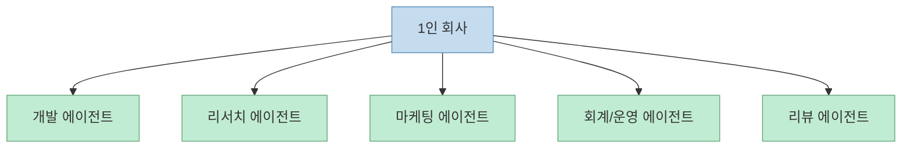
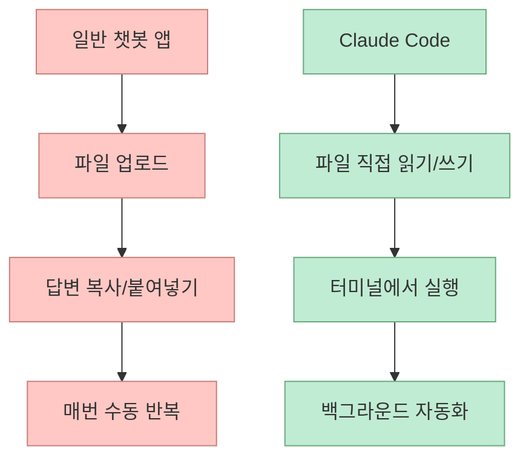
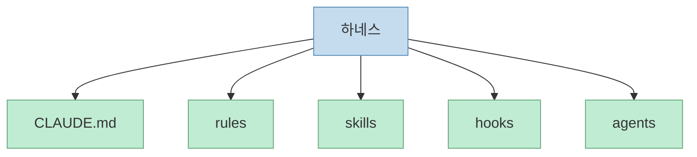
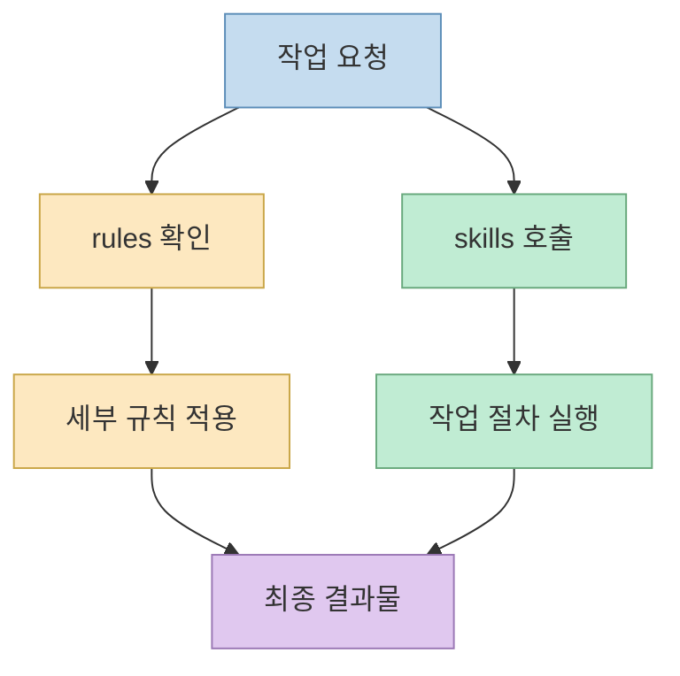
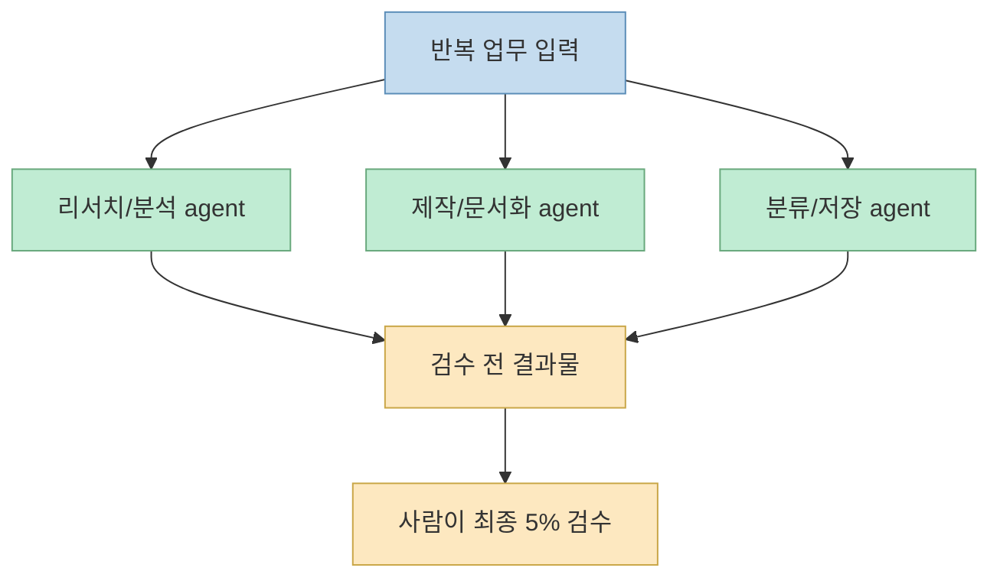

이 영상은 아주 자극적인 문장으로 시작한다. **직원 99명, 월급 0원인 1인 회사** 를 Claude Code로 만들 수 있다는 주장이다. 물론 발표자도 과장이 섞여 있다고 말한다. 하지만 영상의 핵심은 과장이 아니다. 실제로 말하려는 것은, Claude Code 위에 잘 짜인 하네스를 얹으면 **연구, 제작, 회계, 마케팅, 회의록, 운영 같은 반복 업무를 역할별 에이전트가 분담하는 구조** 를 만들 수 있다는 점이다.[영상 1:12](https://youtu.be/DWSpA0jeB8Q?t=72)

즉 이 영상은 "AI가 인간 직원을 완전히 대체한다"는 식의 미래담보다, **Claude Code를 하나의 작업장으로 보고 그 안에 여러 전문 에이전트를 조직도처럼 배치하는 방법** 을 설명하는 데 더 가깝다.

<!--more-->

## Sources

- 영상: [직원 99명, 월급 0원? Anthropic이 공개한 AI 에이전트 설계법으로 클로드 코드로 1인 회사 자동화하는 법](https://youtu.be/DWSpA0jeB8Q?si=lEBBM0Um5M4gu3U5)

## 영상이 말하는 "사무실 뷰"의 본질

영상 초반부는 여러 에이전트가 돌아가는 화면을 보여 준다. 개발, 리뷰, 비즈니스, 마케팅, 리서치 같은 카테고리별로 에이전트가 나뉘고, 각 세션이 어떤 상태인지와 토큰 사용량까지 볼 수 있다고 설명한다.[영상 0:00](https://youtu.be/DWSpA0jeB8Q?t=0)

이 화면을 발표자는 "직원 명단" 혹은 "사무실 뷰"처럼 설명한다. 각 동그라미 하나하나가 전문 직원을 뜻하고, 필요할 때 해당 에이전트가 나와 일을 한다는 구조다.[영상 1:39](https://youtu.be/DWSpA0jeB8Q?t=99)

중요한 건 여기서 AI를 한 명의 만능 비서로 보지 않는다는 점이다. 대신:

- 리서치 전용
- 디자인 전용
- 회계 전용
- 리뷰 전용
- 비즈니스 전용

처럼 역할을 분리해 둔다. 즉 이 영상의 세계관은 **한 명의 똑똑한 모델** 보다 **역할이 나뉜 여러 명의 에이전트** 에 가깝다.

## 일반 챗봇 앱과 Claude Code의 차이를 "도시락 vs 레스토랑"으로 설명한다

발표자는 ChatGPT, Claude, Gemini 같은 일반 앱형 챗봇을 "편의점 도시락"에 비유한다. 빠르고 편하지만 메뉴가 정해져 있어서 내 입맛에 맞게 깊이 바꾸기는 어렵다는 것이다.[영상 2:44](https://youtu.be/DWSpA0jeB8Q?t=164)

반면 Claude Code는 **내 레스토랑을 직접 차리는 것** 에 가깝다고 말한다. 주방을 내 마음대로 설계하고, 화구를 여러 개 놓고, 동시에 여러 요리를 만들 수 있다는 것이다.[영상 2:59](https://youtu.be/DWSpA0jeB8Q?t=179)

이 비유는 단순하지만 꽤 정확하다.

- 앱형 챗봇은 요청-응답 중심
- Claude Code는 파일, 규칙, 자동화, 병렬 작업, 기억을 붙일 수 있는 작업장

즉 Claude Code는 "답변을 잘하는 AI"보다 **작업을 굴리는 환경** 으로 이해하는 편이 맞다.

## Claude Code의 큰 차이는 파일 접근과 백그라운드 실행이다

영상은 Claude Code가 일반 앱과 다른 핵심 특성으로 몇 가지를 짚는다.[영상 3:50](https://youtu.be/DWSpA0jeB8Q?t=230)

- 파일을 직접 읽고 쓰고 실행한다
- 업로드 없이 내 컴퓨터 안에 깊게 들어가 일한다
- 여러 터미널/여러 작업을 동시에 돌릴 수 있다
- 한 번 만들어 둔 자동화와 기억이 계속 누적된다

이 점은 중요하다. 일반 챗봇 앱은 매번 파일을 올리고 답변을 복사하고 다시 붙여 넣는 흐름이 반복되지만, Claude Code는 **작업 자체가 파일 시스템과 터미널 안에서 일어난다** 는 것이다.

즉 Claude Code의 본질은 모델 그 자체보다 **운영 가능한 작업 환경** 에 있다.

## 영상이 보는 핵심 부품은 결국 하네스다

설명란과 본문에서 반복해서 나오는 핵심 조합은 다음이다.

- `CLAUDE.md`
- rules
- skills
- hooks
- agents

설명란에는 이 다섯 요소를 조합하면 1인 기업이 "직원 99명처럼" 일한다고 적혀 있다.[영상 설명란](https://youtu.be/DWSpA0jeB8Q?si=lEBBM0Um5M4gu3U5) 자막에서는 여기에 MCP까지 더해 설명하는데, 본질은 같다. **각각의 부품을 묶은 운영체계**, 즉 하네스가 핵심이라는 것이다.[영상 4:47](https://youtu.be/DWSpA0jeB8Q?t=287)

### 1. `CLAUDE.md`는 운영 매뉴얼

발표자는 `CLAUDE.md`를 가게 운영 매뉴얼 혹은 회사 헌법에 비유한다. "우리 가게는 한국어로 대화한다", "결론부터 말한다", "이미지는 이 엔진으로 만든다" 같은 규칙을 적어 두면, Claude가 일을 시작할 때마다 읽고 그대로 따른다는 것이다.[영상 5:19](https://youtu.be/DWSpA0jeB8Q?t=319)

### 2. rules는 작업별 카드

rules는 큰 운영 헌법보다 세부적인 작업 카드다. 예를 들어 이미지를 만들 때, 데이터를 저장할 때, 알림을 보낼 때 따를 주제별 규칙을 별도 agenda처럼 저장해 두는 방식이라고 설명한다.[영상 5:49](https://youtu.be/DWSpA0jeB8Q?t=349)

### 3. skills는 재사용 가능한 공통 기법

skills는 한 번 익혀 두면 어디서든 재사용할 수 있는 공통 레시피로 설명된다. 발표자 예시로는 하나의 슬래시 명령어로 영상 준비를 끝내거나, 다른 명령으로 카드뉴스, 회의록, 매출 처리 같은 흐름을 자동화한다고 한다.[영상 6:45](https://youtu.be/DWSpA0jeB8Q?t=405)

### 4. hooks는 자동 트리거

hooks는 스테이크가 70도에 도달하면 타이머가 자동으로 울리는 것 같은 시스템이다. 아침 출근 시 오늘 할 일이 자동으로 뜨거나, 작업이 끝나면 알림이 울리고, 위험한 명령은 실행 전에 자동 차단되는 식이다.[영상 7:20](https://youtu.be/DWSpA0jeB8Q?t=440)

### 5. agents는 전문 셰프들

각 agent는 전문 역할을 맡는다. 리서치만 하는 agent, 디자인만 하는 agent, 회계만 하는 agent처럼 전문 부서 인력을 따로 둔다는 개념이다.[영상 1:59](https://youtu.be/DWSpA0jeB8Q?t=119)

이 다섯 가지는 각각 역할이 다르지만, 같이 있을 때 비로소 "작업장"이 된다.

## rules와 skills의 차이는 "작업 카드"와 "공통 기술"의 차이다

영상이 좋은 점은 rules와 skills를 섞어 설명하지 않는다는 것이다.

- rules: 주제별, 작업별 규칙 카드
- skills: 여러 곳에서 재사용 가능한 공통 기술

예를 들어 rules는 "이미지 만들 때는 이렇게", "데이터 저장은 이렇게" 같은 특정 행위 규칙이고, skills는 "영상 제작", "회의록 정리", "매출 처리"처럼 재사용되는 작업 단위다.[영상 5:49~6:45](https://youtu.be/DWSpA0jeB8Q?t=349)

즉 rules는 좁고 명시적인 가드레일이고, skills는 좀 더 넓은 **실행 가능한 작업 묶음** 에 가깝다.

이 차이를 이해해야 스킬 남발이나 과도한 규칙화를 피할 수 있다.

## 실제 활용 사례는 결국 "반복 업무의 압축"이다

영상 후반부에서 발표자는 구체적인 활용 사례를 몇 가지 제시한다.

### 1. 영상 공장

주제 한 줄만 넣으면 리서치, 스크립트 작성, 음성 입히기, 렌더링, 썸네일 생성, 업로드까지 이어지는 흐름을 설명한다. 지금 보고 있는 영상 슬라이드도 이런 시스템으로 만들었다고 말한다.[영상 9:53](https://youtu.be/DWSpA0jeB8Q?t=593)

여기서 사람은 100% 자동화가 아니라, 대략 95% 자동화 후 5% 검수와 개선을 담당한다고 설명한다.[영상 10:38](https://youtu.be/DWSpA0jeB8Q?t=638)

### 2. 영수증 처리

영수증 사진 한 장을 넣으면 글자를 읽고, 항목을 분류하고, Notion이나 엑셀, 데이터베이스에 바로 저장하는 흐름을 보여 준다. 원래 회계 직원 한 명이 하던 일을 자동화할 수 있다는 것이다.[영상 11:04](https://youtu.be/DWSpA0jeB8Q?t=664)

### 3. 회의록 정리

30분짜리 회의 녹음을 넣으면 화자 구분, 핵심 요약, 결정 사항 등록까지 이어지는 시스템을 설명한다.[영상 11:44](https://youtu.be/DWSpA0jeB8Q?t=704)

즉 이 시스템의 목표는 인간을 완전히 제거하는 것이 아니라, **반복 업무를 압축해서 사람이 판단과 검수에 집중하게 만드는 것** 이다.

## 영상이 주는 가장 현실적인 경고

영상은 아주 공격적인 사례를 보여 주지만, 후반부 조언은 오히려 보수적이다. 발표자는 처음부터 99개, 200개 agent를 만들려고 하면 지쳐서 포기하게 된다고 말한다. 그래서 가장 귀찮고 가장 많이 반복하는 일 하나를 정해서 그것부터 만들어 가라고 조언한다.[영상 13:51](https://youtu.be/DWSpA0jeB8Q?t=831)

또 비개발자가 바로 코드부터 들여다보는 것도 큰 함정이라고 말한다. 먼저 시스템을 비유와 구조로 이해한 뒤, 그다음 텍스트와 코드를 천천히 봐야 한다는 것이다.[영상 14:10](https://youtu.be/DWSpA0jeB8Q?t=850)

이 부분은 꽤 중요하다. 많은 자동화 프로젝트가 실패하는 이유는 도구가 나빠서가 아니라, **처음부터 너무 큰 시스템을 만들려다 설계 피로에 무너지는 것** 에 가깝기 때문이다.

## "혼자 공부는 어렵다"는 말의 의미

영상 마지막은 교육 프로그램 소개로 이어지지만, 그 앞의 메시지는 여전히 유효하다. 발표자는 올해 1월부터 Claude Code와 하네스 엔지니어링을 깊게 파면서 거의 6개월 동안 혼자 공부했고, 그만큼 막히는 구간이 많았다고 말한다.[영상 14:32](https://youtu.be/DWSpA0jeB8Q?t=872)

이걸 상업적 홍보와 별개로 해석하면, 이런 시스템은 단순한 프롬프트 몇 줄과 다르다는 뜻이다. 즉:

- 어떤 업무를 먼저 자동화할지
- 어떤 rule을 둘지
- 무엇을 skill로 만들지
- 무엇을 hook으로 자동화할지

를 설계해야 하므로, 결국 **문제 정의와 구조 설계 능력** 이 중요해진다.

## 핵심 요약

이 영상이 말하는 "직원 99명짜리 1인 회사"의 실체는 AI 환상이 아니다. 

- Claude Code를 작업장으로 두고 
- `CLAUDE.md`, rules, skills, hooks, agents를 묶어 하네스를 만들고 
- 역할이 나뉜 agent들을 조직도처럼 배치해 
- 반복 업무를 95% 수준까지 자동화한 뒤 
- 사람은 검수와 판단에 집중하는 구조다. 

즉 핵심은 모델이 아니라 **역할 분리 + 규칙 + 자동화 + 기억** 을 묶는 시스템이다.

## 결론

이 영상이 자극적인 제목과 달리 실제로 전달하는 메시지는 꽤 현실적이다. 1인 회사가 99명처럼 일하려면 AI가 똑똑하기만 해서는 안 되고, Claude Code 위에 잘 짜인 하네스를 얹어야 한다는 것이다. 결국 중요한 것은 agent 숫자가 아니라, 어떤 반복 업무를 어떤 규칙과 어떤 전문 agent에게 맡길지 설계하는 능력이다. 크게 시작하는 것보다, 가장 반복적인 일 하나를 먼저 자동화하는 것부터가 진짜 출발점이다.
