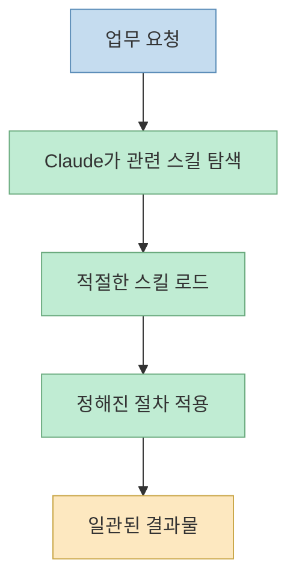
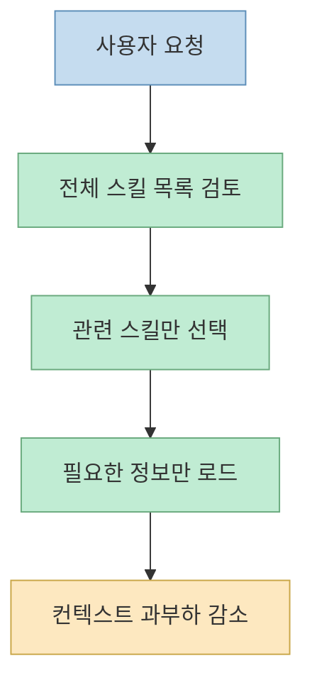
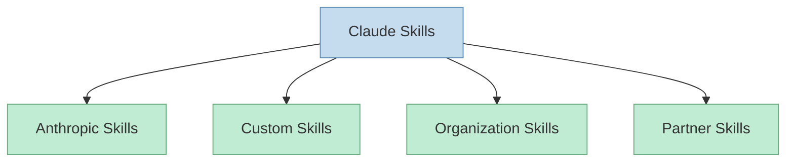
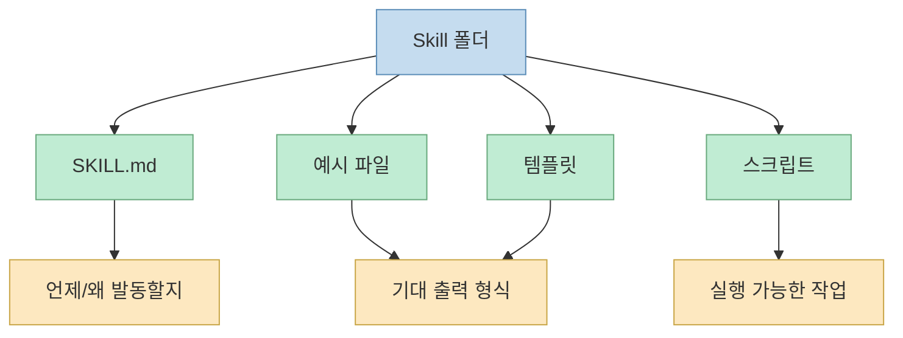

이 Threads 포스트는 "최고의 Claude Skill 10가지"라는 형식으로 시작하지만, 사실 핵심은 개별 스킬 이름보다 더 아래층에 있다. 원문이 강조하는 메시지는 단순하다. **스킬을 한 번 설치하면 Claude가 매번 같은 방식으로 그 작업을 실행한다** 는 점이다.[Threads 원문](https://www.threads.net/@masterkeyai/post/DYoLNfnj2V3)

이게 왜 중요할까? 많은 사용자가 Claude를 잘 쓰지 못하는 이유는 모델이 약해서가 아니라, 같은 일을 할 때마다 매번 다른 프롬프트를 주고 매번 다른 형식의 결과를 받기 때문이다. 스킬은 그 문제를 줄인다. 그래서 이 포스트는 Threads가 던진 "업무 방식을 바꾸는 최고의 스킬들"이라는 문제의식을 바탕으로, **Claude Skills가 왜 반복 업무를 구조화하는 핵심 장치인지** 를 Anthropic 공식 문서와 함께 정리한다.

<!--more-->

## Sources

- Threads 원문: https://www.threads.com/@masterkeyai/post/DYoLNfnj2V3?xmt=AQG01s-MqRUIilnLu3raqru1X7ziX3vLsvfRnQbd-vFNKpxc-7Md5VM_jkbCHrAEUD7BA4g&slof=1
- Anthropic Help Center: https://support.claude.com/en/articles/12512176-what-are-skills
- Anthropic Help Center: https://support.claude.com/en/articles/12512180-use-skills-in-claude
- Claude Code Docs: https://code.claude.com/docs/en/skills

## Threads 원문이 실제로 말하는 핵심

Threads 원문은 다음 메시지를 비교적 분명하게 전달한다.[Threads 원문](https://www.threads.net/@masterkeyai/post/DYoLNfnj2V3)

- 업무 방식을 바꿔 줄 수 있는 Claude Skill이 있다
- 해외 인플루언서가 정리한 추천 리스트가 있다
- 특정 작업을 매우 효율적으로 수행할 수 있다
- 한 번 설치하면 Claude는 매번 동일한 방식으로 해당 작업을 실행한다
- Claude Skill은 Claude Cowork를 통해 사용할 수 있다

즉 이 글의 본질은 "10개의 유명한 스킬 이름"보다, **작업 방식을 재사용 가능한 단위로 고정한다** 는 데 있다.

## Claude Skills는 결국 "반복 가능한 업무 레시피"다

Anthropic 공식 설명에 따르면 Skills는 Claude의 속도, 일관성, 특정 작업 성능을 높여 주는 장치다. 가장 중요한 문장은 여기다. Claude는 어떤 작업을 받으면 관련된 Skills를 검토하고, 적절한 스킬을 자동으로 로드해 그 지침을 적용한다.[Anthropic Help](https://support.claude.com/en/articles/12512176-what-are-skills)

즉 스킬은 단순 매크로가 아니다.

- Claude가 자동으로 관련성을 판단한다
- 필요한 순간에만 로드한다
- 같은 요청 유형에 같은 작업 절차를 다시 적용한다

이 구조 때문에 스킬은 단순 프롬프트보다 더 강하다. 프롬프트는 매번 다시 써야 하지만, 스킬은 **한 번 정의한 업무 규칙을 계속 재사용** 하게 만든다.

그래서 Threads 원문에서 말하는 "설치만 해 두면 매번 동일한 방식으로 실행된다"는 표현은 정확한 요약에 가깝다.

## Anthropic이 강조하는 핵심: progressive disclosure

공식 문서에서 가장 중요한 기술적 개념은 `progressive disclosure`다. Anthropic은 Claude가 어떤 작업을 받을 때 모든 스킬을 한꺼번에 다 읽는 것이 아니라, **관련 있는 스킬만 골라 필요한 정보만 로드한다** 고 설명한다.[Anthropic Help](https://support.claude.com/en/articles/12512176-what-are-skills)

이게 왜 중요할까?

- 스킬이 많아져도 컨텍스트가 무한히 부풀지 않는다
- 전체 매뉴얼을 매번 붙여 넣지 않아도 된다
- 필요한 순간에 필요한 지침만 꺼내 쓴다

즉 Skills는 "긴 프롬프트를 더 길게 붙이는 기능"이 아니라, **작업별 지식을 분리해 둔 뒤 필요할 때만 주입하는 구조** 라고 보는 편이 맞다.

이 점이 스킬을 단순 "템플릿"보다 훨씬 실용적으로 만든다.

## 공식 문서가 말하는 스킬의 종류

Anthropic Help Center 기준으로 Skills는 크게 네 가지 축으로 이해할 수 있다.[Anthropic Help](https://support.claude.com/en/articles/12512176-what-are-skills)

- Anthropic Skills
- Custom Skills
- Organization provisioned skills
- Partner skills

### 1. Anthropic Skills

Anthropic이 직접 만들고 유지하는 기본 스킬들이다. 공식 문서에는 Excel, Word, PowerPoint, PDF 관련 작업 강화가 예시로 나온다.[Anthropic Help](https://support.claude.com/en/articles/12512180-use-skills-in-claude)

### 2. Custom Skills

사용자나 조직이 직접 만드는 스킬이다. 회사 이메일 템플릿, 브랜드 문서 스타일, 회의록 형식, 데이터 분석 규칙 같은 **자기만의 업무 절차** 를 여기에 넣을 수 있다.[Anthropic Help](https://support.claude.com/en/articles/12512176-what-are-skills)

### 3. Organization skills

Team / Enterprise에서 조직 차원으로 배포하는 스킬이다. 즉 개인 노하우를 회사 전체의 표준 작업 방식으로 퍼뜨릴 수 있다.[Anthropic Help](https://support.claude.com/en/articles/12512176-what-are-skills)

### 4. Partner skills

Notion, Figma, Atlassian 같은 파트너가 제공하는 전문 스킬이다. 이들은 보통 해당 MCP 커넥터와 함께 통합 워크플로를 만든다.[Anthropic Help](https://support.claude.com/en/articles/12512176-what-are-skills)

이 분류를 보면 Threads 원문의 "추천 10개"도 결국 어떤 브랜드 이름보다 **어느 층의 스킬을 어떻게 자기 워크플로에 붙일지** 로 이해하는 편이 맞다.

## 스킬이 업무 방식을 바꾸는 진짜 이유

Anthropic 문서를 읽어 보면, Skills의 핵심 장점은 단순 자동화가 아니라 **조직 지식의 패키징** 에 있다.[Anthropic Help](https://support.claude.com/en/articles/12512176-what-are-skills)

공식 문서가 직접 말하는 장점은 다음과 같다.

- 특정 작업 성능 향상
- 조직 지식 캡처
- 누구나 Markdown으로 쉽게 커스터마이즈 가능
- 조직 전체 중앙 관리 가능

이걸 실무 언어로 바꾸면 다음과 같다.

- 발표자료는 항상 같은 구조로 만들게 한다
- 보고서는 회사 표현 방식에 맞춰 다듬게 한다
- 회의록은 팀 포맷대로 정리되게 한다
- 이메일은 우리 템플릿과 CTA 규칙을 따르게 한다

즉 스킬은 "Claude가 더 똑똑해진다"가 아니라, **우리 회사/우리 팀/내 작업 방식에 맞게 일을 하도록 반복 학습된 직원처럼 굴게 한다** 는 데 의미가 있다.

## Cowork에서 Skills가 특히 강한 이유

Threads 원문은 "Claude Skill은 Claude Cowork를 통해 사용할 수 있다"고 짚는다.[Threads 원문](https://www.threads.net/@masterkeyai/post/DYoLNfnj2V3) 이 부분은 공식 문서와도 맞다. Anthropic은 Skills가 chat뿐 아니라 Cowork, Excel, PowerPoint 같은 surface에서도 동작한다고 설명한다.[Anthropic Help](https://support.claude.com/en/articles/12512180-use-skills-in-claude)

이 말은 꽤 중요하다. 같은 스킬이라도:

- Cowork에서는 Word 문서를 만들 수 있고
- Excel에서는 표와 수식 중심으로 동작하고
- PowerPoint에서는 슬라이드 생성 쪽으로 적응할 수 있다

즉 Skills는 "하나의 프롬프트 템플릿"이 아니라, **작업 표면(surface)에 따라 출력을 달리하는 재사용 가능한 업무 규칙** 으로 작동한다.

## Claude Code 관점에서 보면 Skills는 파일 시스템 기반 지식 패키지다

Claude Code 문서를 보면 Skills는 로컬 파일 시스템에 존재하는 `SKILL.md` 중심 폴더다. 위치에 따라 personal, project, plugin, enterprise 수준으로 나뉜다.[Claude Code Docs](https://code.claude.com/docs/en/skills)

예를 들어:

- `~/.claude/skills/<skill-name>/SKILL.md`
- `.claude/skills/<skill-name>/SKILL.md`

또 `SKILL.md` 안에는 YAML frontmatter와 markdown instructions가 들어가고, 필요하면 예제 파일, 템플릿, 스크립트까지 함께 둘 수 있다.[Claude Code Docs](https://code.claude.com/docs/en/skills)

즉 스킬은 단순 텍스트 조각이 아니라:

- 언제 발동할지
- 무엇을 참고할지
- 어떤 절차를 따를지
- 필요하면 어떤 스크립트를 실행할지

를 함께 담는 **작업 패키지 폴더** 다.

이 관점에서 보면 Threads가 말한 "설치하면 매번 같은 방식으로 실행"은 정확히 **작업 폴더 단위로 업무 지식을 저장해 두는 구조** 덕분이다.

## "추천 스킬 10개"보다 더 중요한 선택 기준

Threads 원문은 분명히 "좋은 순서대로 추천 리스트"를 소개한다고 말하지만, 이미지 캐러셀 안의 개별 10개 항목 텍스트는 현재 자동 추출이 완전하지 않았다. 그래서 여기서는 리스트 이름 자체를 확정적으로 옮기지 않고, 공식 문서를 바탕으로 **좋은 스킬을 고를 때 더 본질적인 기준** 을 정리하는 편이 정확하다.

좋은 스킬은 보통 이런 특징을 가진다.

- 반복 업무를 분명히 줄인다
- 결과 형식을 표준화한다
- 조직/팀의 규칙을 캡처한다
- 필요할 때만 로드돼 컨텍스트를 덜 먹는다
- 예시와 템플릿이 있어 출력 품질이 흔들리지 않는다

반대로 이름은 멋있지만 실전 가치가 낮은 스킬은:

- 막연한 조언만 길다
- 언제 발동할지 불명확하다
- 산출물 형식이 없다
- 실제 워크플로우보다 유행어에 가깝다

즉 중요한 건 "톱10에 들었는가"보다 **내가 반복하는 업무를 얼마나 안정적으로 대체하느냐** 다.

## 보안과 조직 운영 관점에서 봐야 하는 이유

Anthropic Help Center는 Skills의 주요 위험으로 prompt injection과 data exfiltration을 직접 언급한다. 또한 덜 신뢰되는 출처의 스킬은 반드시 내용을 리뷰하고, 포함된 코드 의존성과 외부 네트워크 연결 지시를 주의해서 보라고 경고한다.[Anthropic Help](https://support.claude.com/en/articles/12512180-use-skills-in-claude)

즉 스킬은 생산성 도구이면서 동시에 **실행 가능한 규칙 묶음** 이다. 그래서 조직에서 사용한다면 단순 "좋은 스킬 공유" 수준이 아니라:

- 누가 승인하는지
- 어떤 스킬을 조직 전체로 배포할지
- 어떤 출처만 허용할지
- 업데이트는 어떻게 반영할지

까지 포함한 운영 정책이 필요하다.

## 핵심 요약

Threads 원문이 말하는 Claude Skill의 진짜 가치는 "좋은 스킬 10개" 그 자체가 아니다. 

- 한 번 정의한 업무 방식을 반복 실행하게 하고 
- 필요한 순간에만 관련 규칙을 불러오고 
- 개인/팀/조직의 작업 규칙을 패키지로 저장하고 
- Cowork, Chat, Excel, PowerPoint, Claude Code 같은 여러 작업 표면에서 재사용하게 만드는 데 있다. 

즉 Skills는 프롬프트 모음이 아니라 **반복 업무를 표준화하는 실행 레이어** 다.

## 결론

그래서 "어떤 Claude Skill 10개가 최고냐"보다 더 중요한 질문은 따로 있다. **내가 자주 반복하는 업무 중 무엇을 스킬로 바꾸면, Claude가 매번 같은 방식으로 안정적으로 실행하게 만들 수 있는가** 다. Threads 원문은 그 방향을 잘 짚고 있고, Anthropic 공식 문서는 왜 그것이 가능한지 구조적으로 설명한다. 결국 좋은 스킬은 모델 위에 얹는 작은 추가 기능이 아니라, 자기 업무 방식을 외부화하고 축적하는 자산에 더 가깝다.
