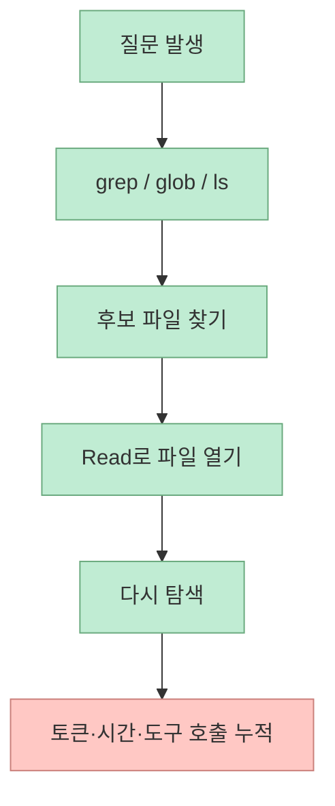
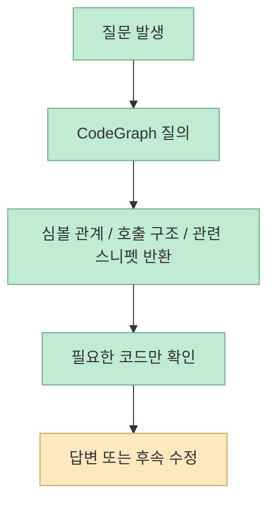
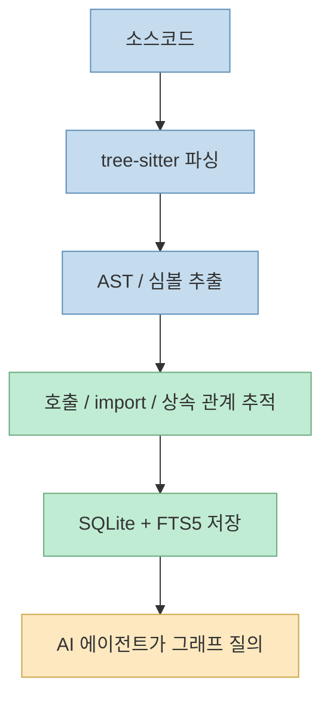
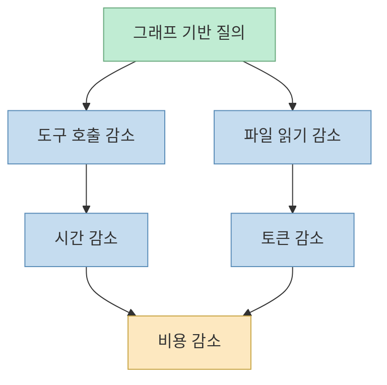

CodeGraph를 한 줄로 설명하면, **AI 코딩 에이전트가 파일을 뒤지는 시간을 줄이기 위해 코드베이스를 미리 그래프로 만들어 두는 도구** 다. 그런데 이 Threads 포스트가 흥미로운 이유는 단순히 "빠르다"가 아니라, 비용·토큰·도구 호출이 동시에 줄어드는 이유를 꽤 명확하게 짚기 때문이다. 원문은 평균 기준으로 비용 35% 절감, 토큰 59% 감소, 도구 호출 70% 감소를 강조하고, VS Code 정도 크기의 10k 파일 프로젝트에서는 토큰이 73%까지 줄어든다고 요약한다.[Threads 원문](https://www.threads.net/@roach_log/post/DYmtYDWmuxp)

이 수치들은 CodeGraph 공식 README에 실린 벤치마크와도 맞아떨어진다. README 역시 평균적으로 `~35% cheaper`, `59% fewer tokens`, `70% fewer tool calls`를 전면에 내세우고 있다.[CodeGraph README](https://github.com/colbymchenry/codegraph)

즉 이 포스트는 단순한 소개 글이라기보다, **왜 에이전트의 토큰 낭비가 탐색 루프에서 생기고, CodeGraph가 그 루프를 어떻게 바꾸는지** 를 설명하는 사례로 읽을 가치가 있다.

<!--more-->

## Sources

- Threads 원문: https://www.threads.com/@roach_log/post/DYmtYDWmuxp?xmt=AQG0z7Nq7XlL6dAz5kEO1xnzvy8U6R7-NvyMadoH7epH-Gm6Vf_b0Su5CxcFf7gn5cSY69yL&slof=1
- 원본 저장소: https://github.com/colbymchenry/codegraph

## 원문이 지적한 문제는 "AI가 코드를 이해하려면 매번 뒤져야 한다"는 점이다

Threads 연속 포스트는 CodeGraph가 없을 때 에이전트가 어떻게 움직이는지 아주 실무적으로 설명한다.

- `grep`으로 검색
- `ls`로 디렉터리 확인
- `Read`로 파일 읽기
- 다시 `grep`
- 다시 `Read`

이 과정이 수십 번 반복된다는 것이다.[Threads 원문 후속 포스트](https://www.threads.net/@roach_log/post/DYmtYtBGmWf)

CodeGraph README도 거의 같은 말을 한다. Claude Code는 코드베이스를 탐색할 때 Explore agent를 띄워 `grep`, `glob`, `Read` 같은 파일 스캔 도구를 계속 호출한다고 설명한다.[CodeGraph README](https://github.com/colbymchenry/codegraph)

즉 문제는 모델이 답을 못 내는 것이 아니라, **답을 내기 전에 어디를 읽어야 하는지 찾는 데 큰 예산을 쓴다** 는 점이다.

이 루프는 프로젝트가 커질수록 더 비싸진다. 작은 프로젝트에서는 그냥 검색해도 금방 찾지만, 수천~수만 파일 규모에서는 **정답에 도달하기 전에 너무 많은 주변 파일을 읽게 된다**.

## CodeGraph의 핵심 아이디어는 "파일을 읽기 전에 구조를 먼저 질의한다"는 것이다

Threads 원문은 해결 원리를 간단하게 설명한다. 코드 구조를 미리 뽑아서 데이터베이스에 넣어 두면, 에이전트가 "이 함수 어디서 호출돼?"라고 물을 때 더 이상 파일을 뒤질 필요가 없고 그래프 쿼리 하나로 끝난다는 것이다.[Threads 원문 후속 포스트](https://www.threads.net/@roach_log/post/DYmtYtBGmWf)

README도 똑같이 말한다. CodeGraph는 에이전트에게 pre-indexed knowledge graph를 제공하고, 에이전트는 파일을 스캔하는 대신 symbol relationships, call graph, code structure를 그래프에서 바로 질의한다.[CodeGraph README](https://github.com/colbymchenry/codegraph)

즉 차이는 "더 잘 검색"이 아니라 **탐색의 시작점이 파일 시스템이냐 그래프냐** 에 있다.

이 구조에서는 에이전트가 처음부터 넓게 훑지 않고, **이미 압축된 구조 정보 위에서 관련 영역만 파고드는 방식** 으로 바뀐다.

## Threads가 요약한 4단계 구조는 README와도 잘 맞는다

Threads 원문은 CodeGraph의 내부 구조를 다음 4단계로 설명한다.[Threads 원문 후속 포스트](https://www.threads.net/@roach_log/post/DYmtZJ0GkuT)

1. tree-sitter로 소스코드를 파싱해 AST 생성
2. 함수, 클래스, 메서드 같은 심볼 추출
3. 심볼 간 호출, import, 상속 관계 추적
4. SQLite와 FTS5에 저장 후 에이전트가 그래프 쿼리

README를 보면 이 설명은 대체로 정확하다. 공식 문서도 semantic knowledge graph, symbol relationships, full-text search, SQLite 기반 로컬 저장, framework-aware routes, always fresh file watcher 등을 강조한다.[CodeGraph README](https://github.com/colbymchenry/codegraph)

즉 CodeGraph는 단순 문자열 인덱서가 아니라, **코드의 구조적 관계를 쿼리 가능한 로컬 지식 그래프로 변환하는 레이어** 다.

여기서 중요한 점은 FTS5가 같이 있다는 것이다. 즉 완전한 그래프 쿼리만이 아니라, **구조 질의와 텍스트 검색을 로컬 SQLite 안에서 함께 처리** 하는 식으로 이해할 수 있다.

## 왜 비용, 토큰, 도구 호출이 같이 줄어드는가

Threads 원문은 `grep → ls → Read → grep → Read ...` 식의 수십 번 도구 호출이 `codegraph_context("인증 로직 어떻게 동작해?")` 같은 1~3회의 호출로 줄어든다고 설명한다.[Threads 원문 후속 포스트](https://www.threads.net/@roach_log/post/DYmtZp4Gmmw)

README는 더 구체적으로 말한다. CodeGraph가 있을 때 에이전트는 보통 `codegraph_context`로 영역을 파악하고, `codegraph_explore` 한 번으로 관련 소스 섹션을 받고 멈춘다. 반대로 CodeGraph가 없으면 discovery 자체에 예산 대부분을 쓴다고 설명한다.[CodeGraph README](https://github.com/colbymchenry/codegraph)

즉 절감이 동시에 일어나는 이유는 간단하다.

- 탐색 단계가 짧아진다
- 쓸데없는 파일 읽기가 줄어든다
- 도구 호출 횟수가 준다
- 파일 읽기 토큰이 줄어든다
- 시간과 비용도 따라서 내려간다

그래서 CodeGraph의 장점은 "모델이 더 똑똑해진다"가 아니라, **모델이 똑똑함을 쓰기 전에 낭비하던 과정을 줄여 준다** 는 데 있다.

## README 벤치마크 수치는 Threads 요약과 어떻게 연결되나

README는 7개 실제 오픈소스 코드베이스, 7개 언어를 대상으로 headless Claude Code를 비교했다고 밝힌다. 각 리포에 아키텍처 질문 하나를 던졌고, CodeGraph 유무에 따른 중앙값을 비교했다고 설명한다.[CodeGraph README](https://github.com/colbymchenry/codegraph)

평균 수치는 다음과 같다.

- 35% cheaper
- 59% fewer tokens
- 49% faster
- 70% fewer tool calls

Threads 원문이 요약한 숫자와 일치한다.[Threads 원문](https://www.threads.net/@roach_log/post/DYmtYDWmuxp)

특히 README에서 눈에 띄는 부분은 대형 저장소에서 효과가 커진다는 설명이다. 예를 들어 VS Code 정도 규모의 약 10k 파일 TypeScript 코드베이스에서는 73% fewer tokens라고 적혀 있다.[CodeGraph README](https://github.com/colbymchenry/codegraph)

반면 Gin처럼 약 150 파일 수준의 작은 저장소에서는 23% fewer tokens 정도로 절감 폭이 훨씬 작다.[CodeGraph README](https://github.com/colbymchenry/codegraph)

이 차이는 아주 중요하다. CodeGraph는 모든 프로젝트에 같은 효과를 내는 마법 도구가 아니라, **탐색 비용이 큰 프로젝트일수록 잘 맞는 구조적 최적화 도구** 다.

## "100% 로컬"이 의미하는 것

Threads 원문은 CodeGraph가 100% 로컬에서 돌고, 외부 API 호출이 없으며, 설치도 한 줄이라고 강조한다.[Threads 원문 후속 포스트](https://www.threads.net/@roach_log/post/DYmtZp4Gmmw)

README 역시 `100% Local`을 분명하게 내세우고, 데이터는 기기 밖으로 나가지 않으며 SQLite database only라고 적는다. 또 설치는 `curl ... | sh` 또는 `npx @colbymchenry/codegraph`로 가능하다고 안내한다.[CodeGraph README](https://github.com/colbymchenry/codegraph)

이건 단지 편의 기능이 아니다. 코드베이스 인덱싱 도구는 보통 다음 두 걱정이 따라온다.

- 소스코드가 외부로 나가는가
- 팀에 설치·운영 부담이 큰가

CodeGraph는 이 두 걱정을 "로컬 SQLite + 자체 번들된 런타임"으로 완화하려는 방향을 취하고 있다.

## 의외로 중요한 README의 한 줄: 메인 세션에서 직접 `explore`하지 말라

README에서 특히 흥미로운 부분은 글로벌 인스트럭션 예시다. `.codegraph/`가 있는 프로젝트에서는 메인 세션에서 직접 `codegraph_explore`나 `codegraph_context`를 부르지 말고, Explore agent에게 위임하라고 적혀 있다.[CodeGraph README](https://github.com/colbymchenry/codegraph)

이건 왜 중요할까? 이유는 간단하다. CodeGraph가 소스 섹션을 한 번에 많이 반환하므로, 메인 세션에서 바로 받아버리면 **메인 컨텍스트를 다시 크게 부풀릴 수 있기 때문** 이다. 즉 이 도구는 단순 설치만으로 끝나지 않고, **어떻게 호출해야 context hygiene가 유지되는지까지 함께 설계** 되어 있다.

이 점은 CodeGraph를 단순 인덱서보다 **에이전트용 컨텍스트 운영 장치** 로 보게 만든다.

## 이 Threads와 저장소를 같이 읽으면 보이는 핵심

Threads 원문은 아주 좋은 요약을 제공한다.

- AI는 원래 파일을 뒤지느라 비용을 많이 쓴다
- CodeGraph는 구조를 먼저 데이터베이스화한다
- 큰 프로젝트일수록 절감 효과가 커진다

README는 여기에 더해 몇 가지를 보강한다.

- 단순 검색이 아니라 semantic knowledge graph다
- full-text search와 route-aware graph까지 포함된다
- MCP 서버와 자동 installer, auto-allow 설정까지 있다
- 벤치마크는 Claude Code headless 기준 명시적 방법론을 갖고 있다

즉 둘을 함께 읽으면 CodeGraph의 가치는 더 분명해진다. 핵심은 "코드를 더 적게 읽는다"가 아니라 **올바른 구조를 먼저 질의하게 만들어서 잘못된 파일 탐색을 줄인다** 는 것이다.

## 핵심 요약

CodeGraph가 토큰을 줄이는 이유는 단순히 검색이 빠르기 때문이 아니다. 

- tree-sitter로 구조를 미리 파싱하고 
- 심볼 관계와 호출 구조를 그래프로 저장하고 
- SQLite + FTS5 기반 로컬 질의 계층을 만들고 
- 에이전트가 `grep → ls → Read` 루프를 반복하는 대신 그래프를 먼저 보게 만들기 때문이다. 

그래서 도구 호출이 줄고, 읽는 파일이 줄고, 그 결과 토큰과 시간과 비용이 함께 줄어든다.

## 결론

이 Threads 포스트와 CodeGraph README를 같이 보면, 에이전트 코딩에서 진짜 비싼 것은 답변 생성보다 **정답 위치를 찾기 위한 반복 탐색** 이라는 점이 선명해진다. CodeGraph는 바로 그 탐색 루프를 구조적으로 줄이는 도구다. 특히 대형 코드베이스에서 Claude Code나 Codex를 많이 돌릴수록, 이런 사전 구조화 레이어는 선택 기능이 아니라 거의 필수 인프라에 가까워질 가능성이 크다.
