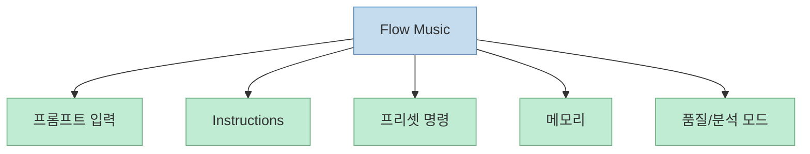
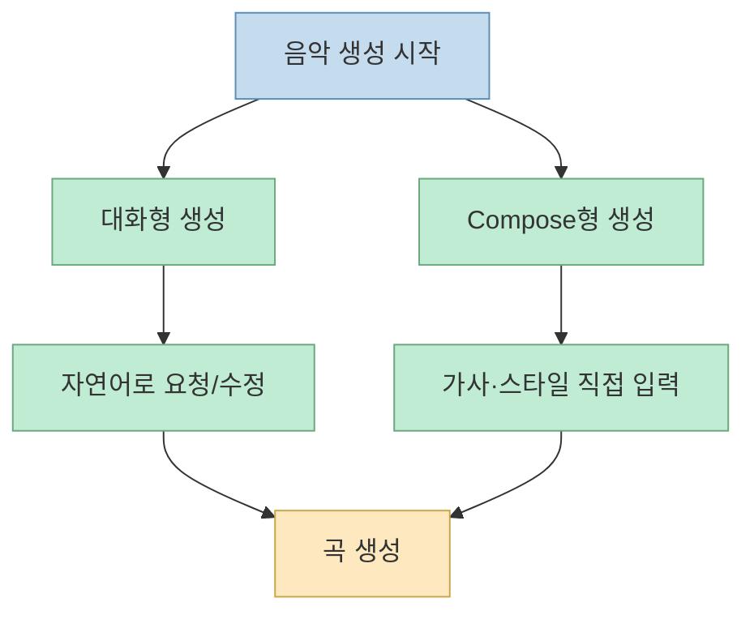
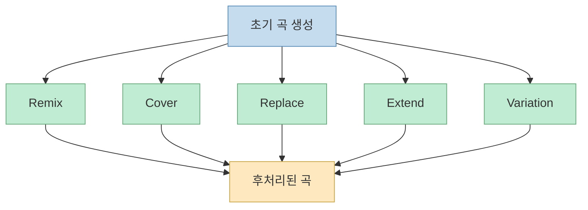
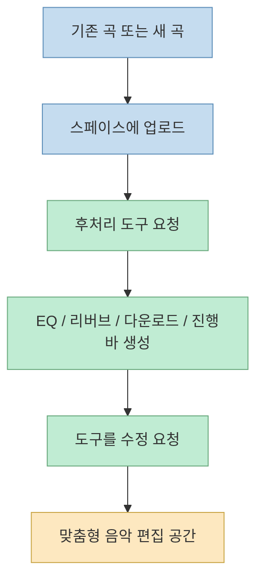
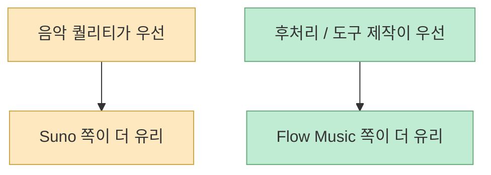

이 영상은 구글의 `Flow Music`을 단순히 "Suno 비슷한 음악 생성기"로 보지 않는다. 오히려 발표자가 가장 크게 보는 차이는 **노래를 만드는 기능 자체보다, 그 결과물을 후처리하고 변형하고 도구화하는 능력** 에 있다. 영상 초반부도 같은 방향으로 시작한다. Suno가 "노래를 잘 만드는 수준"이라면, 이번 주 업데이트된 구글 `Flow Music`은 노래뿐 아니라 뮤직비디오와 음악 후보정, 커스터마이징 도구 생성까지 한 번에 다룬다는 것이다.[영상 0:00](https://youtu.be/aR_Rd2Ea9ko?t=0)

즉 이 영상의 핵심 질문은 "어느 쪽이 더 좋은 노래를 만드나" 하나가 아니다. 오히려 **음악 생성 뒤에 이어지는 편집, 변형, 확장, 시각화까지 포함하면 작업 흐름이 어떻게 달라지나** 에 더 가깝다.

<!--more-->

## Sources

- 영상: [‘수노와 정면승부?’ 작정하고 만든, 구글 음악AI 플로우 뮤직(flow music)](https://youtu.be/aR_Rd2Ea9ko?si=oD47UeazRFkPnxnb)

## Flow Music의 첫인상: 생성형 음악 앱이 아니라 음악 작업 인터페이스

영상에서 발표자는 `Flow Music`의 사용 시작 흐름부터 보여 준다. 구글 계정으로 로그인하고 간단한 동의를 거치면 사용할 수 있고, 별도의 구독 체계로 운영되는 것으로 보인다고 설명한다.[영상 0:40](https://youtu.be/aR_Rd2Ea9ko?t=40)

하지만 진짜 중요한 부분은 그 다음이다. 단순 프롬프트 입력창만 있는 것이 아니라 다음과 같은 설정 레이어가 붙는다.

- `Instructions`: 선호 장르, 악기, 보컬 스타일 지정
- 이름 붙인 기능 프리셋
- 대화 기반 메모리
- 모델/품질/분석 모드

이 구조는 기존 음악 AI보다 **작업 공간형 인터페이스** 에 더 가깝다. 즉 한 번의 노래 생성보다, 내가 원하는 스타일을 반복적으로 찍어내기 위한 세팅과 대화 맥락을 붙여 둔다는 뜻이다.

즉 `Flow Music`은 "노래 한 곡 뽑기"보다 **생산 환경을 개인화하는 음악 AI** 쪽에 가까운 인상을 준다.

## 프리셋과 메모리 기능은 GPTs/Projects 같은 감각을 음악 작업에 옮긴다

영상에서 가장 흥미로운 초반 기능은 이름 붙인 프리셋이다. 발표자는 특정 이름과 기능을 지정해 두고, 프롬프트 창에서 그 이름만 입력하면 설정한 기능이 자동으로 작동하는 식으로 보여 준다. 예를 들어 "그루브한 팝송 세 곡을 만들어 달라"는 기능을 저장해 두면, 이후에는 간단한 호출만으로 재사용할 수 있다는 것이다.[영상 1:35](https://youtu.be/aR_Rd2Ea9ko?t=95)

발표자는 이 점을 ChatGPT의 GPTs나 Claude의 Projects와 비슷한 감각으로 설명한다. 자주 쓰는 음악 제작 패턴을 미리 지정해 두고 반복 사용할 수 있으니 작업 효율이 올라간다는 것이다.[영상 1:58](https://youtu.be/aR_Rd2Ea9ko?t=118)

또한 메모리 기능은 이전 대화 기반으로 사용자의 음악 스타일을 학습해 다음 제작에 참고한다고 소개된다. 이는 단순 즐길 거리라기보다, **반복 제작에서 일관된 톤을 유지하는 보조 기억 장치** 로 읽는 편이 맞다.

## 기본 음악 생성은 대화형과 작곡형 두 모드를 오간다

영상 기준으로 `Flow Music`은 두 가지 사용 감각을 동시에 제공한다.

- 대화하듯 요청하고 수정하는 채팅형 생성
- Suno처럼 가사와 사운드를 직접 넣는 Compose형 생성

발표자는 먼저 "여름 드라이브하면서 들을 신나는 댄스곡" 같은 자연어 프롬프트로 두 곡을 생성하는 장면을 보여 준다. 이후 수정하고 싶은 부분을 다시 자연어로 말하면 새 노래를 바로 생성한다고 설명한다.[영상 2:39](https://youtu.be/aR_Rd2Ea9ko?t=159)

반면 가사와 스타일을 더 직접 통제하고 싶을 때는 상단 Compose 모드로 넘어가, 리릭스와 사운드를 Suno 스타일처럼 직접 입력할 수 있다고 말한다.[영상 3:28](https://youtu.be/aR_Rd2Ea9ko?t=208)

이 구조는 입문자와 통제형 사용자 모두를 잡으려는 시도로 볼 수 있다.

## 진짜 차별점은 생성 후 편집 툴 체인이다

영상 중반부터 `Flow Music`의 성격이 더 분명해진다. 발표자는 노래를 생성한 뒤 오른쪽 메뉴에서 다음 같은 후처리 기능을 보여 준다.

- Remix
- Cover
- Replace
- Extend
- Use Prompt
- Variation
- Trim

여기서 중요한 것은 이 기능들이 단순 버튼 나열이 아니라, **선택한 곡을 기반으로 다시 편곡하고, 부분 수정하고, 길이를 늘리고, 보컬 스타일을 바꾸는 작업 체인** 을 만든다는 점이다.[영상 3:44](https://youtu.be/aR_Rd2Ea9ko?t=224)

예를 들어 발표자는 기존 가사의 "아스팔트"를 "도로"로 바꾸는 식의 수정을 시도하고, Cover에서는 여성 보컬 스타일로 바꾸는 예시를 보여 준다.[영상 3:57](https://youtu.be/aR_Rd2Ea9ko?t=237)

즉 `Flow Music`은 "첫 곡 결과물"보다 **첫 곡 이후의 조작 가능성** 에 더 무게가 실려 있다.

## 다만 가사 수정 같은 정밀 편집은 아직 거칠다고 영상은 말한다

여기서 영상은 장점만 말하지 않는다. 발표자는 가사를 간단히 바꾸는 편집을 시도했지만, 결과를 들어 보면 보컬 성별이 바뀌거나 음정이 변형되는 등 의도하지 않은 변화가 생겼다고 설명한다. 그래서 아직까지 가사 수정 같은 복잡한 기능은 잘 구현되지 않았다고 평가한다.[영상 4:13](https://youtu.be/aR_Rd2Ea9ko?t=253)

이 부분은 중요하다. `Flow Music`이 제공하는 후처리 옵션 수는 많지만, **정밀 편집의 안정성은 아직 일정하지 않다** 는 뜻이기 때문이다.

즉 현재 시점의 강점은 DAW 수준의 세밀한 수정이 아니라, **생성 결과를 여러 방향으로 빠르게 변주하는 능력** 에 더 가깝다.

## 뮤직비디오 생성은 Suno와의 차이를 크게 만드는 요소다

영상에서 발표자가 처음 `Flow Music`이 나왔을 때 가장 주목받았다고 말한 기능은 뮤직비디오다. 기존 Suno에서는 음악 생성이 중심이었다면, `Flow Music`은 곡을 만든 뒤 곧바로 뮤직비디오 생성을 요청할 수 있다고 설명한다.[영상 5:33](https://youtu.be/aR_Rd2Ea9ko?t=333)

여기서는 인물, 스타일, 가사 표시, 화면 비율 같은 요소를 직접 지정할 수 있고, 발표자는 본인 프로필 이미지를 업로드해 힙합 스타일 뮤직비디오를 만들어 달라고 시연한다.[영상 5:48](https://youtu.be/aR_Rd2Ea9ko?t=348)

즉 `Flow Music`은 오디오 생성기라기보다, **음악 + 시각화 패키지** 를 지향하는 쪽에 더 가깝다.

## 크레딧 구조는 강력하지만, 뮤직비디오에서 급격히 비싸질 수 있다

영상은 크레딧 구조도 구체적으로 언급한다. 발표자 설명 기준으로 기본 음악 제작에는 약 10크레딧 정도가 쓰이지만, 본인이 만든 뮤직비디오는 375크레딧이 소모되어 부담이 컸다고 말한다. 또 첫 가입 시 530크레딧을 받았고, 매일 30크레딧을 무료로 지급 중이라고 설명한다.[영상 6:29](https://youtu.be/aR_Rd2Ea9ko?t=389)

여기서 주의할 점은 이런 수치가 **영상 업로드 시점의 제품 상태** 일 가능성이 크다는 것이다. 생성형 AI 서비스의 크레딧 정책은 자주 바뀌므로, 이 숫자는 "영상 작성 시점의 체감 구조"로 읽는 편이 맞다.

그래도 방향성은 분명하다.

- 순수 음악 생성은 비교적 가볍다
- 뮤직비디오는 훨씬 비싸다

즉 무료 체험에서는 **음악 편집/변주** 에 집중하는 편이 효율적일 수 있고, 비디오 생성은 훨씬 신중히 써야 한다.

## 가장 독특한 기능은 "음악을 위한 바이브 코딩"이다

영상 후반부에서 발표자가 "현존하는 음악 AI 중 가장 압도적인 기능"이라고 부르는 것은 스페이스 기능이다. 이 기능은 믹싱, 리버브, 이퀄라이저, 다운로드 버튼, 구간 표시 바 같은 **음악 후처리 툴 자체를 실시간으로 만들어 준다** 고 소개된다.[영상 7:22](https://youtu.be/aR_Rd2Ea9ko?t=442)

발표자는 이를 "음악을 주제로 한 바이브 코딩"이라고 부른다. 예를 들어:

- 기존 노래를 업로드한다
- "믹싱과 리버브 등 여러 기능이 들어간 후처리 도구를 만들어 달라"고 요청한다
- 실시간으로 EQ, 다운로드 버튼, 진행 바 같은 인터페이스가 생성된다

이 기능은 단순 생성 모델 비교와 결이 다르다. Suno가 "좋은 곡 뽑기"에 더 가까운 반면, `Flow Music`은 **곡을 다루는 개인용 음악 도구를 즉석에서 조립하는 방향** 을 보여 준다.

## 영상의 최종 평가는 의외로 보수적이다

흥미로운 점은 영상이 `Flow Music`을 극찬으로만 끝내지 않는다는 것이다. 발표자의 최종 평가는 비교적 명확하다.[영상 10:22](https://youtu.be/aR_Rd2Ea9ko?t=622)

- 맞춤형 음악 도구 제작은 `Flow Music` 추천
- 음악 퀄리티 자체는 아직 Suno가 더 낫다고 느껴진다

즉 결론은 "Suno를 대체한다"가 아니라, **두 도구가 잘하는 영역이 다르다** 에 가깝다.

이 평가는 꽤 설득력 있다. 음악 AI의 가치를 곡 퀄리티 하나로만 보면 `Flow Music`의 장점이 과소평가되고, 반대로 도구성만 보면 노래 자체의 완성도 문제를 놓치게 되기 때문이다.

## 핵심 요약

이 영상 기준으로 `Flow Music`의 핵심은 단순 곡 생성이 아니다. 

- 대화형/작곡형 두 방식으로 곡을 만들고 
- Remix, Cover, Replace, Extend, Variation으로 변주하고 
- 뮤직비디오까지 연결하며 
- 무엇보다 후처리 도구 자체를 AI로 즉석 생성하는 스페이스 기능이 가장 큰 차별점이다. 

반면 정밀 가사 수정이나 곡 퀄리티 자체는 아직 한계가 보이며, 발표자 평가로는 음악 완성도는 Suno가 더 나은 쪽에 가깝다.

## 결론

`Flow Music`은 Suno와 정면승부를 건다기보다, 음악 AI의 게임 규칙을 조금 다르게 잡으려는 제품처럼 보인다. 좋은 노래 한 곡을 뽑는 것만이 아니라, 그 노래를 편집하고 변형하고 시각화하고, 심지어 그 과정을 위한 도구까지 즉석에서 만들게 하려는 방향이다. 그래서 현재 시점에서의 질문은 "Suno보다 더 좋은 노래를 만드나?"보다, **음악 생성 이후의 작업 흐름 전체를 얼마나 유연하게 바꾸는가** 에 더 가깝다.
