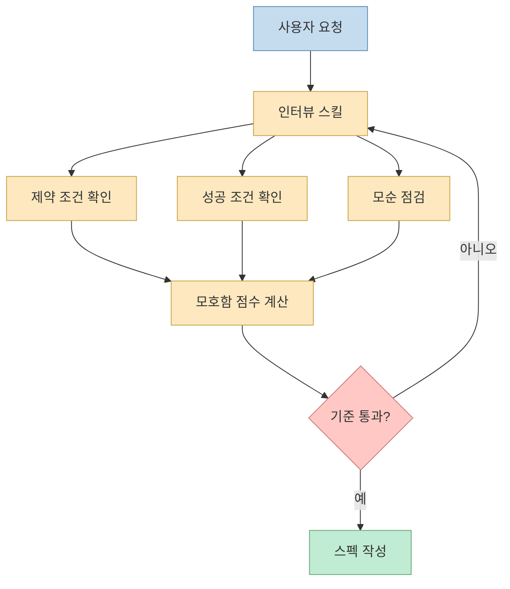
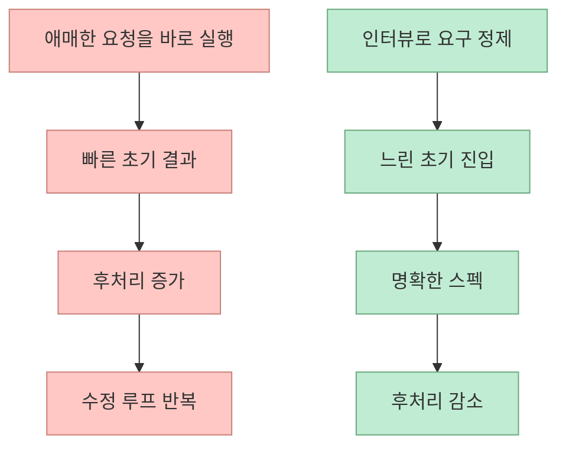
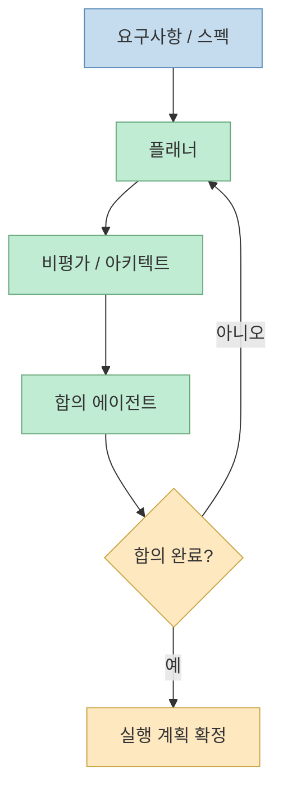
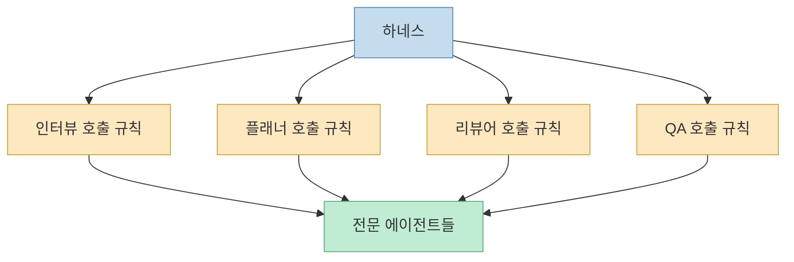
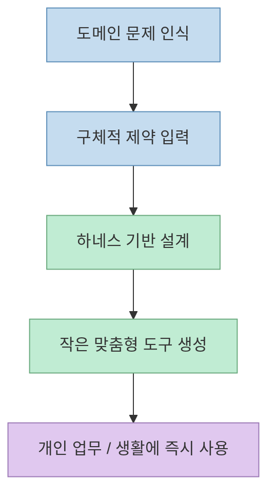

이 영상의 재미는 "AI가 딸깍하면 다 만든다"는 과장된 문장에 있지 않다. 진짜 중요한 건, 발표자들이 보여 주는 자동화가 **모델 한 번 호출** 이 아니라 **인터뷰 → 스펙 정제 → 계획 → 역할 분담 → QA** 로 이어지는 하네스 위에서 돌아간다는 점이다. 그래서 이 영상은 단순한 바이브 코딩 자랑보다, **에이전트 코딩에서 왜 하네스가 중요한지** 를 보여 주는 사례에 더 가깝다.[영상 00:48](https://youtu.be/w0RG83sbjP0?t=48) [영상 05:55](https://youtu.be/w0RG83sbjP0?t=355)

실제로 첫 데모도 "영상 편집 중 `음`, `아` 같은 추임새를 알아서 잘라내는 유틸리티를 만들 수 있느냐"는 질문에서 시작한다. 그런데 발표자는 곧바로 코드를 짜지 않고, 먼저 인터뷰 스킬을 통해 요구사항을 계속 좁혀 간다. 여기서 이미 핵심이 드러난다. **딸깍은 시작 버튼일 뿐이고, 결과 품질은 그 앞단의 질문 구조가 결정한다** 는 것이다.[영상 00:54](https://youtu.be/w0RG83sbjP0?t=54) [영상 01:45](https://youtu.be/w0RG83sbjP0?t=105)

<!--more-->

## Sources

- 영상: [딸깍 AI 어떻게 작동되는지 아시나요...? AI로 세상이 어떻게 변하고 있는지 보여드립니다. 하네스 딸깍 시연회](https://youtu.be/w0RG83sbjP0?si=C_l49_PilLVrygzH)

## 첫 단계는 구현이 아니라 "질문으로 모호함을 줄이는 것"이다

영상 초반부에서 발표자는 사용자의 요청을 바로 실행하지 않는다. 대신 인터뷰 스킬을 호출해서 문제를 다시 말하게 하고, 사지선다·주관식 질문을 섞으면서 "독립 실행형 앱인가", "기존 편집 도구용 개선인가", "무엇을 성공으로 볼 것인가" 같은 조건을 계속 확인한다. 이 과정에서 발표자는 **모호함 점수** 가 일정 수준 아래로 내려가야 다음 단계로 넘어갈 수 있다고 설명한다.[영상 01:39](https://youtu.be/w0RG83sbjP0?t=99) [영상 02:14](https://youtu.be/w0RG83sbjP0?t=134)

즉 이 하네스는 단순히 친절하게 질문하는 UI가 아니다. 답변이 쌓일 때마다:

- 제약 조건이 얼마나 분명한지
- 성공 조건이 얼마나 분명한지
- 기록된 답들 사이에 모순이 없는지

를 평가하고, 기준을 통과해야 스펙 작성 단계로 넘어간다. 발표자는 이 계산 로직 자체가 하네스의 일부라고 설명한다.[영상 04:11](https://youtu.be/w0RG83sbjP0?t=251) [영상 04:24](https://youtu.be/w0RG83sbjP0?t=264)

## 왜 이런 인터뷰 하네스가 필요한가

발표자 설명에 따르면, 이렇게 질문을 많이 하는 이유는 나중의 후처리 비용을 줄이기 위해서다. 애매한 요구를 그대로 넘기면 AI는 어디선가 가져온 "베스트 프랙티스"를 넣어 주지만, 그게 꼭 사용자가 원하는 답은 아닐 수 있다. 그래서 **앞단에서 피곤하게 따져 묻는 비용** 을 감수하는 대신, 뒤에서 생길 불만과 수정 루프를 줄이겠다는 접근이다.[영상 02:35](https://youtu.be/w0RG83sbjP0?t=155) [영상 03:16](https://youtu.be/w0RG83sbjP0?t=196)

발표자가 "딸깍 후에 건드릴 일이 적어야 한다"고 말하는 대목도 같은 맥락이다. 이 영상에서 "딸깍"은 아무 생각 없이 자동 생성한다는 뜻이 아니라, **사람이 신경 써야 할 설계적 질문을 하네스가 대신 집요하게 물어보는 상태** 를 뜻한다.[영상 03:09](https://youtu.be/w0RG83sbjP0?t=189) [영상 03:19](https://youtu.be/w0RG83sbjP0?t=199)

## 스펙이 정리되면 그다음은 "알아서 구현"이 아니라 "알아서 계획"이다

영상 중반부에서는 인터뷰가 끝난 뒤, 이제부터는 사람 개입 없이 계획으로 넘어간다고 설명한다. 발표자는 하네스 엔지니어링의 핵심을 **한 과업을 완수하기 위해 필요한 인지 노동을 얼마나 구조화해서 줄이느냐** 로 설명한다.[영상 05:49](https://youtu.be/w0RG83sbjP0?t=349) [영상 06:00](https://youtu.be/w0RG83sbjP0?t=360)

이때 중요한 건 곧바로 코드를 짜지 않는다는 점이다. 먼저 플랜을 만드는 에이전트를 부르고, 필요한 경우 내부 전문가를 호출해서 계획을 세운다. 발표자는 피곤할 때 대충 마무리하고 싶어도, 이런 하네스를 켜 두면 밤새 에이전트들이 계속 질문하고 정리해서 아침에는 꽤 그럴듯한 결과가 나와 있다고 말한다.[영상 07:07](https://youtu.be/w0RG83sbjP0?t=427) [영상 07:27](https://youtu.be/w0RG83sbjP0?t=447)

즉 여기서 자동화의 핵심은 "자동 코딩"보다 **자동 계획 수립과 자동 위임** 에 더 가깝다.

## 플래너, 비평가, 합의자까지 둔 이유는 "프리모템"을 하기 위해서다

발표자는 자신이 쓰는 계획 구조를 정반합에 비유한다. 플랜을 제안하는 에이전트가 있고, 그 플랜의 문제점만 찾는 에이전트가 있고, 마지막에 합의를 내려 주는 에이전트가 있다. 합의가 날 때까지 루프를 돌린다는 설명이다.[영상 08:01](https://youtu.be/w0RG83sbjP0?t=481) [영상 08:12](https://youtu.be/w0RG83sbjP0?t=492)

이 구조는 단순한 멀티에이전트 과시가 아니다. 발표자는 이를 **포스트모템을 줄이기 위한 프리모템 강화** 로 설명한다. 즉 장애가 난 뒤에 원인을 찾는 대신, 미리 "어떤 식으로 깨질 수 있는지"를 시뮬레이션하는 것이다.[영상 08:25](https://youtu.be/w0RG83sbjP0?t=505) [영상 08:36](https://youtu.be/w0RG83sbjP0?t=516)

뒤이어 나오는 설명도 비슷하다. 플래너가 계획을 짜면, 아키텍트 에이전트를 새로 스폰해서 리뷰하게 하고, 리뷰가 나오면 다시 플래너를 스폰해서 반영하게 한다. 이건 사람 팀에서 회의를 반복하며 책임과 우선순위를 맞추는 구조를 AI 에이전트 루프로 옮긴 것에 가깝다.[영상 09:40](https://youtu.be/w0RG83sbjP0?t=580) [영상 10:03](https://youtu.be/w0RG83sbjP0?t=603)

## 발표자가 말하는 하네스의 본질은 "언제 어떤 전문가를 부를지 정하는 것"이다

영상에서 흥미로운 대목 중 하나는, 계획을 짜는 에이전트가 모든 곳에 이미 있고, **어느 상황에서 그 에이전트를 자동으로 호출할지** 를 정하는 것이 하네스의 역할이라는 설명이다. 다시 말해, 하네스는 개별 에이전트를 직접 대체하지 않는다. 대신:

- 어떤 작업에 인터뷰가 필요한지
- 언제 플래너를 부를지
- 언제 리뷰어를 부를지
- 언제 QA를 돌릴지

같은 호출 규칙을 담당한다.[영상 07:43](https://youtu.be/w0RG83sbjP0?t=463) [영상 07:50](https://youtu.be/w0RG83sbjP0?t=470)

이 관점이 중요한 이유는, 많은 사람이 하네스를 "프롬프트 좀 길게 쓴 것" 정도로 오해하기 때문이다. 하지만 영상에서의 하네스는 명백히 **절차 제어 장치** 다.

## 계획이 끝나면 바로 실행하는 것이 아니라 QA까지 스킬로 묶는다

후반부에서는 계획이 완료되자, 발표자가 곧바로 "Ultra QA"라는 스킬을 불러 검증 절차를 태운다. 이때 이어지는 설명이 인상적인데, 발표자는 TDD 같은 방법론이 이론상 좋더라도 사람에게는 너무 피곤하고 비싸서 늘 제대로 지켜지지 않았다고 말한다. 그런데 AI를 쓰면 원래 이상적이지만 무거웠던 절차를 **현실적인 기본값** 으로 끌어올릴 수 있다는 것이다.[영상 15:08](https://youtu.be/w0RG83sbjP0?t=908) [영상 15:30](https://youtu.be/w0RG83sbjP0?t=930)

이 말은 곧, AI가 완전히 새로운 개발 원칙을 만드는 것이 아니라:

- 테스트 먼저 생각하기
- 리뷰 먼저 받기
- 책임 분리하기
- 위험을 미리 상상하기

같은 기존의 좋은 방법론을 **사람의 피로 한계 때문에 못 하던 수준까지 밀어 주는 도구** 가 될 수 있다는 뜻이다.[영상 15:47](https://youtu.be/w0RG83sbjP0?t=947) [영상 16:09](https://youtu.be/w0RG83sbjP0?t=969)

## 데모 1은 "추임새 제거 유틸리티"였지만, 포인트는 오디오 편집이 아니다

실제 데모 결과도 나온다. 발표자는 Whisper를 설치해 더티한 MP3에서 `음`, `아`, `그 뭐더라` 같은 추임새를 문맥 기준으로 잘라내는 유틸리티를 보여 준다. "음악" 같은 단어는 자르면 안 된다는 식의 세부 조건도 반영된 것으로 보인다고 설명한다.[영상 19:35](https://youtu.be/w0RG83sbjP0?t=1175) [영상 20:00](https://youtu.be/w0RG83sbjP0?t=1200)

하지만 여기서 더 중요한 건 결과물 종류가 아니라 과정이다. 이 유틸리티는:

- 인터뷰로 요구를 정제하고
- 스펙을 만들고
- 계획 루프를 돌리고
- 실행 후 QA를 거쳐
- 최종 결과를 뽑는

하네스 위에서 나왔다. 그래서 이 영상의 메시지는 "오디오 편집도 된다"가 아니라, **작은 유틸리티 하나도 이제는 다단계 하네스로 설계할 수 있다** 는 쪽에 더 가깝다.

## 데모 2는 더 충격적이다. 도메인 지식이 있으면 "딸깍"의 가치가 훨씬 커진다

영상 후반부에서 발표자는 자신이 복용하는 ADHD 약의 체감 지속 시간을 바탕으로, 언제 약을 먹는 것이 좋을지 대략 시뮬레이션해 주는 도구를 직접 만들어 쓴다고 설명한다. 시간 기록을 입력하고, 논문 정보에 맞춰 그래프를 그려 주며, 생활 판단에 도움을 준다는 식의 설명이 나온다.[영상 20:47](https://youtu.be/w0RG83sbjP0?t=1247) [영상 21:20](https://youtu.be/w0RG83sbjP0?t=1280)

진행자가 크게 놀라는 이유도 바로 여기에 있다. 이건 일반적인 "예쁜 랜딩 페이지 생성"이 아니라, **개인 도메인 문제를 아주 구체적으로 모델링한 도구** 이기 때문이다. 그래서 발표자는 "아는 도메인이면 몇 달각 안에 확 온다"고 말한다. 즉 하네스와 에이전트가 강력해질수록, 차이는 모델 사용량보다 **도메인 지식이 있는 사람이 무엇을 물을 수 있느냐** 에서 벌어진다.[영상 21:33](https://youtu.be/w0RG83sbjP0?t=1293) [영상 22:12](https://youtu.be/w0RG83sbjP0?t=1332)

## 그래서 이 영상이 말하는 "딸깍 AI"는 사실 클릭이 아니라 시스템이다

영상 속 발표자들은 하네스를 마법 단어처럼 포장하고 싶어 하지는 않지만, 실제로 설명을 쉽게 하려면 그 단어가 가장 편하다고 말한다. 또 이런 종류의 엔지니어링은 하네스라는 이름이 유행하기 전부터 해 오던 일이라고도 말한다.[영상 16:35](https://youtu.be/w0RG83sbjP0?t=995) [영상 17:03](https://youtu.be/w0RG83sbjP0?t=1023)

이 말을 뒤집어 보면, 지금 주목해야 할 건 특정 모델 이름 하나가 아니다. 더 중요한 것은:

- 질문을 강제하는가
- 스펙을 명시적으로 남기는가
- 리뷰어를 자동 호출하는가
- QA를 기본 단계로 넣는가
- 도메인 지식을 작업 흐름에 녹이는가

같은 운영 구조다. 이게 없으면 "딸깍"은 금방 허무해지고, 이게 있으면 작은 유틸리티부터 개인용 시뮬레이터까지 꽤 빠르게 실용 수준으로 올라간다.

## 핵심 요약

- 이 영상의 핵심은 한 번의 모델 호출이 아니라 **인터뷰 하네스** 다.
- 하네스는 모호함, 제약 조건, 성공 조건, 모순 여부를 점검해 스펙을 정제한다.
- 그다음 단계는 자동 코딩보다 **자동 계획 수립과 역할 위임** 에 가깝다.
- 플래너, 비평가, 합의자 루프는 포스트모템을 줄이기 위한 **프리모템 구조** 로 설명된다.
- QA와 테스트도 별도 스킬로 붙어, 원래 이상적이지만 피곤했던 절차를 기본값으로 만든다.
- 진짜 차이는 모델 자체보다 **도메인 지식이 있는 사용자가 하네스를 통해 어떤 문제를 구조화하느냐** 에서 난다.

## 결론

이 영상은 "AI가 클릭 한 번으로 다 만든다"는 식의 단순 홍보 영상으로 보면 놓치는 게 많다. 오히려 더 정확한 해석은, **에이전트 코딩 시대에는 좋은 결과가 모델보다 하네스에서 나온다** 는 실전 시연이다. 질문을 잘하게 만들고, 계획을 세우게 만들고, 리뷰와 QA를 자동으로 끼워 넣는 구조가 있어야 비로소 "딸깍"이 의미를 갖는다. 그래서 앞으로 경쟁력은 좋은 모델을 아는 데서 끝나지 않고, **내 문제를 어떤 절차와 역할 구조로 감쌀 수 있느냐** 에서 더 크게 갈릴 가능성이 높다.
