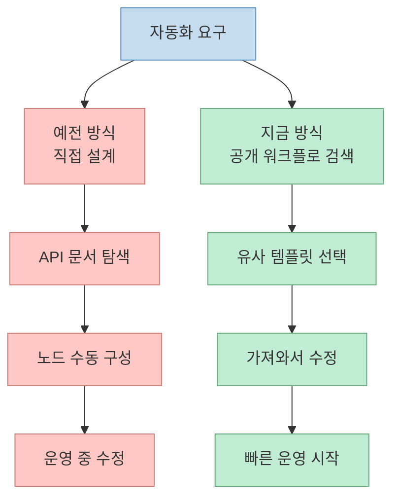
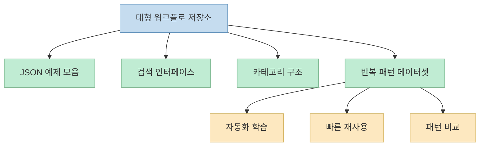
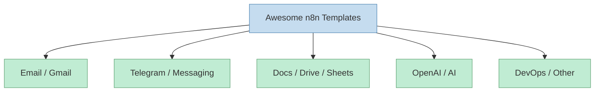
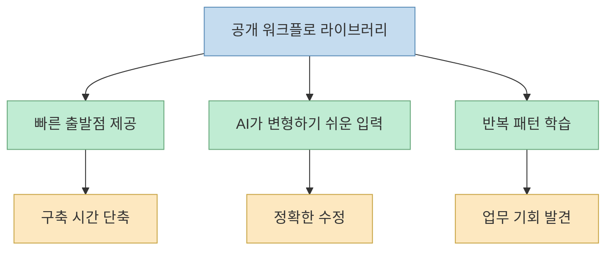

Threads에서 소개된 내용은 단순히 "별 많은 n8n 저장소 몇 개" 추천이 아니다. 더 정확히 말하면, **자동화 레시피가 이제는 코드 스니펫처럼 유통되는 시대** 를 보여 준다. 과거에는 개발자가 Stack Overflow 답변이나 GitHub 예제를 가져와 조합했다면, 지금은 n8n 워크플로 JSON 자체가 하나의 재사용 단위가 된다. 즉 사람들은 더 이상 "자동화 아이디어"만 가져가는 게 아니라, **바로 import해서 실행 가능한 운영 흐름** 을 라이브러리처럼 가져간다.[Threads 원문](https://www.threads.com/@k1utch_ai/post/DYqujwtEa75?xmt=AQG0fepEq2NIMKEjaBQPovITEualvWC6509cCD3TH6Je4w)

원문이 특히 강조한 것은 몇몇 대형 저장소다. Zie619의 대규모 수집 저장소, enescingoz의 주제별 템플릿 모음, lucaswalter의 AI 에이전트 중심 워크플로, Danitilahun의 검색 가능한 대형 아카이브까지, 서로 성격은 다르지만 공통점이 있다. 모두 n8n을 "캔버스 위에서 직접 그리는 도구"가 아니라, **검색·복제·수정 가능한 자동화 자산 저장소** 로 다루고 있다는 점이다.[Zie619 저장소](https://github.com/Zie619/n8n-workflows) [enescingoz 저장소](https://github.com/enescingoz/awesome-n8n-templates) [lucaswalter 저장소](https://github.com/lucaswalter/n8n-ai-workflows) [Danitilahun 저장소](https://github.com/Danitilahun/n8n-workflow-templates)

<!--more-->

## Sources

- Threads: [클러치 AI Threads 포스트](https://www.threads.com/@k1utch_ai/post/DYqujwtEa75?xmt=AQG0fepEq2NIMKEjaBQPovITEualvWC6509cCD3TH6Je4w)
- GitHub: [Zie619/n8n-workflows](https://github.com/Zie619/n8n-workflows)
- GitHub: [enescingoz/awesome-n8n-templates](https://github.com/enescingoz/awesome-n8n-templates)
- GitHub: [lucaswalter/n8n-ai-workflows](https://github.com/lucaswalter/n8n-ai-workflows)
- GitHub: [Danitilahun/n8n-workflow-templates](https://github.com/Danitilahun/n8n-workflow-templates)

## Threads 원문이 말하는 핵심은 "워크플로 검색 비용이 거의 0에 가까워졌다"는 점이다

Threads 원문은 여러 저장소를 짧게 나열하지만, 사실 그 메시지는 명확하다. 이제 n8n 자동화를 처음부터 직접 그리지 않아도, 이미 공개된 대규모 컬렉션을 검색해서 가져오고 수정하면 된다는 것이다. 특히 Zie619 저장소는 "n8n 사이트의 워크플로와 직접 찾은 것들을 모아 둔 대형 컬렉션"으로 소개되고, enescingoz 저장소는 폴더별로 정리된 280개 이상의 템플릿 묶음으로 언급된다. lucaswalter는 AI 에이전트 성격이 강한 자동화 예제를, Danitilahun은 2천 개가 넘는 워크플로를 검색 가능하게 정리한 저장소로 소환된다.[Threads 원문](https://www.threads.com/@k1utch_ai/post/DYqujwtEa75?xmt=AQG0fepEq2NIMKEjaBQPovITEualvWC6509cCD3TH6Je4w)

이 구조는 본질적으로 "자동화 개발"의 진입 비용을 바꾼다. 예전에는:

- 어떤 흐름을 만들지 직접 설계하고
- 각 SaaS API 연결법을 문서에서 찾고
- 노드를 배치한 뒤
- 오류 처리를 수동으로 붙이고
- 실제 운영에서 다시 다듬는

순서가 필요했다.

지금은 먼저 거대한 공개 워크플로 라이브러리에서 비슷한 사례를 찾고, 그 JSON을 가져와 수정하는 쪽이 더 자연스러운 출발점이 됐다.

## Zie619 저장소가 의미 있는 이유는 "템플릿 집합"을 넘어서 검색 가능한 데이터셋이기 때문이다

가장 큰 컬렉션으로 언급된 Zie619 저장소는 단순히 JSON 파일을 많이 모아 둔 레포가 아니다. GitHub 공개 정보 기준으로 이 저장소는 수천 개의 워크플로를 카테고리별로 정리하고, 별도의 GitHub Pages 검색 인터페이스까지 제공한다. 웹에서 바로 검색하고, JSON을 다운로드하고, 카테고리와 통합 서비스 기준으로 탐색하는 흐름이 준비돼 있다.[Zie619 저장소](https://github.com/Zie619/n8n-workflows) [워크플로 검색 사이트](https://zie619.github.io/n8n-workflows/)

이 점이 중요하다. 워크플로가 4천 개를 넘어가면 그건 더 이상 "샘플 모음"이 아니라, **자동화 패턴 데이터셋** 에 가깝다. 즉 사용자는 이 저장소를 보며:

- 어떤 서비스 조합이 자주 쓰이는지
- 어떤 문제를 n8n으로 해결하는지
- 어떤 노드 연결 패턴이 반복되는지

를 역으로 학습할 수 있다.

즉 이 저장소의 진짜 가치는 "많다"가 아니라, **많은 것을 탐색 가능한 구조로 바꿨다** 는 데 있다.

## enescingoz 저장소는 "주제별 cookbook"에 더 가깝다

반면 enescingoz의 `awesome-n8n-templates`는 성격이 조금 다르다. 이쪽은 방대한 전체 수집보다, Gmail, Telegram, Google Drive, Slack, Discord, WhatsApp, OpenAI, Notion 같은 실제 사용 축으로 정리된 주제별 템플릿 컬렉션에 가깝다. 공개 설명에서도 "280개 이상의 무료 ready-to-import 템플릿"을 강조한다.[enescingoz 저장소](https://github.com/enescingoz/awesome-n8n-templates)

이 구조는 대규모 데이터셋보다 **실무 cookbook** 에 더 가깝다. 예를 들어:

- 이메일 자동화가 필요하면 Gmail 섹션으로
- 문서 요약이 필요하면 OpenAI나 Notion 섹션으로
- 메신저 자동화가 필요하면 Telegram이나 WhatsApp 섹션으로

바로 내려갈 수 있다.

즉 Zie619가 "광범위한 수집 아카이브"라면, enescingoz는 "업무별 빠른 출발 레시피북" 쪽이다.

## lucaswalter와 Danitilahun 저장소는 "AI 에이전트화"와 "탐색성"을 각각 밀어 올린다

Threads 원문이 lucaswalter 저장소를 따로 언급한 이유도 있다. 이 저장소는 단순한 Slack 알림이나 Gmail 자동응답보다, **AI 에이전트·콘텐츠 생성·도구 호출** 에 더 무게가 실린 예제가 많다. 공개 설명 자체가 "AI automations and AI agents" 컬렉션임을 전면에 둔다.[lucaswalter 저장소](https://github.com/lucaswalter/n8n-ai-workflows)

한편 Danitilahun 저장소는 2,053개 워크플로를 전문적으로 정리하고, 즉시 검색·분석·브라우징 가능한 문서 시스템을 제공한다고 설명한다. 여기서 강조점은 단순 수량보다 **탐색성과 문서화** 다.[Danitilahun 저장소](https://github.com/Danitilahun/n8n-workflow-templates)

즉 네 저장소를 나란히 놓고 보면 역할이 구분된다.

- Zie619: 최대 규모 수집 아카이브
- enescingoz: 주제별 cookbook
- lucaswalter: AI 에이전트 중심 패턴
- Danitilahun: 검색성과 문서화 강화

이렇게 보면 Threads 원문은 "무조건 하나를 쓰라"가 아니라, **목적에 따라 다른 라이브러리를 고르라** 는 추천으로 읽는 편이 맞다.

## 왜 이런 저장소들이 AI 시대에 더 중요해졌나

AI가 코드와 노드 구성을 대신 짜 주는 시대라면, 오히려 예제 저장소의 가치가 줄어들 것처럼 보일 수 있다. 하지만 실제로는 반대다. 이유는 세 가지다.

### 1. AI는 빈 화면보다 예제를 더 잘 변형한다

완전히 빈 캔버스에서 요구를 정확히 변환하는 것보다, 이미 돌아가는 워크플로를 읽고 수정하는 편이 훨씬 안정적이다. 특히 n8n처럼 노드 연결, 자격증명, 트리거, 예외 처리까지 얽힌 환경에서는 이 차이가 크다.

### 2. 사람도 "정답"보다 "출발점"이 필요하다

자동화는 아이디어보다 연결 디테일에서 막히는 경우가 많다. 공개 저장소는 정답을 주기보다, **현실적인 시작 구조** 를 준다.

### 3. 워크플로 자체가 학습 데이터가 된다

수천 개 워크플로를 보면 어떤 통합이 자주 쓰이는지, 어떤 자동화가 실제 수요를 갖는지, 어디에 AI 에이전트가 붙는지 감이 잡힌다. 즉 워크플로 라이브러리는 실행 자산이면서 동시에 시장·업무 패턴 데이터셋이기도 하다.

## 하지만 그대로 가져다 쓰면 위험하다

이런 저장소를 "자동화 골드마인"처럼 소개하는 글은 많지만, 실제 운영에서는 주의할 점도 뚜렷하다.

첫째, **버전 호환성** 문제다. 예전 n8n 버전에서 만든 워크플로는 최신 노드나 자격증명 방식과 안 맞을 수 있다.

둘째, **자격증명과 보안 설정** 문제다. 워크플로 JSON은 노드 구조를 잘 보여 주지만, 실제 운영에서는 인증 정보, 웹훅 공개 범위, 에러 처리, 재시도 정책까지 다시 점검해야 한다.

셋째, **과도한 복잡도 전파** 문제다. 멋져 보이는 워크플로를 그대로 가져오면 내가 이해하지 못하는 분기, 조건문, 외부 호출이 함께 들어온다. 자동화는 복붙으로 시작할 수는 있어도, 운영은 결국 **내가 설명 가능한 수준으로 단순화** 해야 한다.

넷째, AI 에이전트가 포함된 워크플로는 특히 더 주의해야 한다. 모델 호출, 외부 도구 사용, 데이터 저장이 한 흐름에 묶이면 비용·보안·오작동 범위가 동시에 커진다.

## 실전에서는 "가져오기"보다 "가지치기"가 더 중요하다

그래서 이런 저장소를 가장 잘 쓰는 방법은 무조건 많이 모으는 것이 아니다. 오히려 다음 순서가 더 현실적이다.

1. 내 업무와 가장 가까운 템플릿 하나를 찾는다
2. import해서 구조를 읽는다
3. 필요 없는 분기와 노드를 제거한다
4. 인증, 웹훅, 에러 처리만 먼저 점검한다
5. 작은 데이터로 테스트한다
6. 통과한 뒤에만 실제 운영으로 옮긴다

즉 워크플로 컬렉션의 가치는 "그대로 실행"보다, **빠르게 출발하고 내 환경에 맞게 가지치기하는 재료** 로 볼 때 가장 크다.

## 핵심 요약

- Threads 원문이 보여 주는 핵심은, n8n 워크플로가 이제 **검색 가능한 운영 라이브러리** 처럼 유통된다는 점이다.
- Zie619는 대규모 수집 아카이브, enescingoz는 주제별 cookbook, lucaswalter는 AI 에이전트 중심 컬렉션, Danitilahun은 검색성과 문서화 강화 쪽에 가깝다.
- 이런 저장소는 단순 템플릿 모음이 아니라, 자동화 패턴 데이터셋이자 빠른 출발점 역할을 한다.
- AI 시대일수록 빈 화면에서 시작하기보다 **돌아가는 예제를 변형하는 방식** 이 더 강해진다.
- 다만 버전 호환성, 자격증명, 보안, 과도한 복잡도 문제 때문에 그대로 복붙해서 운영하면 위험하다.

## 결론

이 Threads 포스트가 흥미로운 이유는, n8n 예제 저장소 몇 개를 추천해서가 아니다. 더 본질적으로는 **자동화가 이제 코드처럼 복제되고, 검색되고, 수정되는 자산이 됐다** 는 흐름을 압축해서 보여 주기 때문이다. 앞으로 n8n을 잘 쓰는 사람은 가장 많은 템플릿을 모은 사람이 아니라, 공개된 워크플로를 빠르게 읽고, 내 환경에 맞게 줄이고, 안전하게 운영 가능한 형태로 바꾸는 사람일 가능성이 크다.
