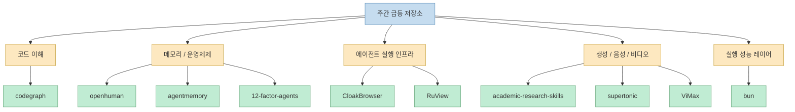
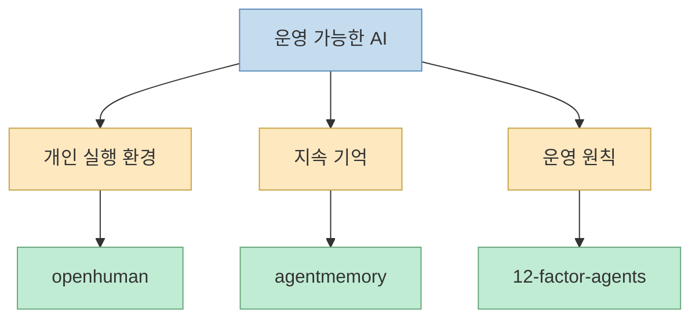
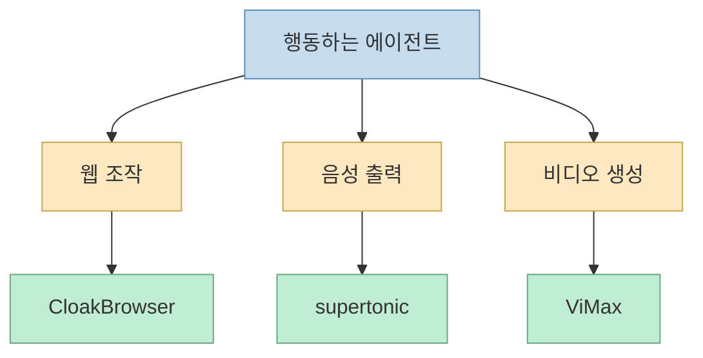
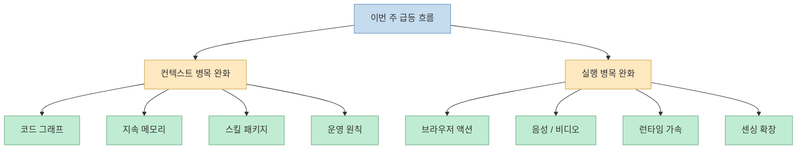

이 X 포스트가 흥미로운 이유는 단순히 "이번 주 별 많이 받은 저장소 10개"를 모아서가 아니다. 더 중요한 건, 상위권에 모인 프로젝트들의 결이 꽤 비슷하다는 점이다. 2026년 5월 23일자 포스트는 이번 주 GitHub에서 빠르게 성장한 10개 저장소를 나열하면서, `codegraph`, `openhuman`, `academic-research-skills`, `RuView`, `agentmemory`, `supertonic`, `CloakBrowser`, `ViMax`, `12-factor-agents`, `bun`을 함께 묶는다. 그리고 마지막에 사실상 하나의 메시지를 준다. **지금 가장 뜨거운 건 소비자용 AI 앱보다, AI 에이전트를 더 잘 돌아가게 만드는 인프라 레이어** 라는 것이다.[X 원문](https://x.com/i/status/2058144012784308598)

특히 공개 oEmbed로 확인되는 본문 첫머리는 `codegraph`를 "Claude Code, Codex, Cursor, OpenCode, Hermes Agent를 위한 사전 인덱싱된 코드 지식 그래프"라고 소개하고, `openhuman`을 두 번째로 올린다. 나머지 저장소를 GitHub 원문으로 교차 확인해 보면, 코드 이해, 개인 AI 운영체제, 연구 스킬, 지속 메모리, 온디바이스 TTS, 스텔스 브라우저, 에이전트 비디오 생성, 운영 원칙, 초고속 런타임 같은 키워드가 반복된다. 즉 이 리스트는 "이번 주 유행 프로젝트"라기보다, **에이전트 소프트웨어 스택이 어디로 가는지 보여 주는 주간 단면** 에 더 가깝다.[GitHub API 확인, 2026-05-24](https://github.com/colbymchenry/codegraph)

<!--more-->

## Sources

- X: [status 2058144012784308598](https://x.com/i/status/2058144012784308598)
- GitHub: [colbymchenry/codegraph](https://github.com/colbymchenry/codegraph)
- GitHub: [tinyhumansai/openhuman](https://github.com/tinyhumansai/openhuman)
- GitHub: [Imbad0202/academic-research-skills](https://github.com/Imbad0202/academic-research-skills)
- GitHub: [ruvnet/RuView](https://github.com/ruvnet/RuView)
- GitHub: [rohitg00/agentmemory](https://github.com/rohitg00/agentmemory)
- GitHub: [supertone-inc/supertonic](https://github.com/supertone-inc/supertonic)
- GitHub: [CloakHQ/CloakBrowser](https://github.com/CloakHQ/CloakBrowser)
- GitHub: [HKUDS/ViMax](https://github.com/HKUDS/ViMax)
- GitHub: [humanlayer/12-factor-agents](https://github.com/humanlayer/12-factor-agents)
- GitHub: [oven-sh/bun](https://github.com/oven-sh/bun)

## X 포스트가 실제로 보여 준 랭킹의 결은 "도구"보다 "기반층"에 가깝다

X 포스트는 `codegraph`를 1위로, `openhuman`을 2위로 배치하면서 주간 증가폭을 함께 적는다. 전체 10개 항목을 그대로 복원할 수 있는 1차 텍스트는 공개 oEmbed에서 일부만 보이지만, GitHub 주간 랭킹 미러와 저장소 교차 확인을 통해 리스트의 방향성은 충분히 읽힌다. 핵심은 상위권 저장소 대부분이 결과물 앱보다 **AI 에이전트가 더 잘 보고, 기억하고, 실행하고, 숨고, 말하고, 생성하게 만드는 기반 기술** 에 속한다는 점이다.[X oEmbed 확인, 2026-05-24](https://x.com/i/status/2058144012784308598)

대략적인 축으로 나누면 이렇게 묶인다.

- 코드 이해: `codegraph`
- 개인 AI 운영체제: `openhuman`
- 연구 자동화 스킬: `academic-research-skills`
- 지속 메모리: `agentmemory`
- 운영 원칙: `12-factor-agents`
- 에이전트 액션 인프라: `CloakBrowser`, `ViMax`
- 디바이스/실행 레이어: `supertonic`, `bun`
- 특수 센싱/공간지능: `RuView`

즉 이 리스트는 "AI가 뭘 만들어 주는가"보다, **AI가 작동하기 위해 어떤 기반층이 필요해졌는가** 를 보여 준다.

## 1위권의 핵심 메시지는 "코드 읽기 비용"을 줄이려는 수요가 매우 크다는 점이다

리스트 최상단의 `codegraph`는 저장소 설명부터 매우 직접적이다. "Claude Code, Codex, Cursor, OpenCode, Hermes Agent를 위한 사전 인덱싱된 코드 지식 그래프"이며, 더 적은 토큰, 더 적은 도구 호출, 100% 로컬 실행을 내세운다. 이 문구는 단순 홍보가 아니라, 지금 에이전트 코딩에서 제일 비싼 것이 무엇인지 드러낸다. 바로 **코드베이스를 탐색하는 비용** 이다.[codegraph GitHub](https://github.com/colbymchenry/codegraph)

최근 AI 코딩 도구가 많아졌지만, 실제 병목은 새 코드 몇 줄 쓰는 문제가 아니라:

- 기존 시스템의 어디를 봐야 하는지 모르고
- grep, ls, read를 반복하고
- 토큰을 써 가며 구조를 추측하고
- 잘못 읽은 맥락 위에서 수정하는

루프에 더 자주 생긴다.

그래서 이번 주 1위가 `codegraph`였다는 사실은 꽤 상징적이다. 지금 관심의 초점은 "더 똑똑한 모델"만이 아니라, **모델이 코드베이스를 덜 헤매게 만드는 외부 기억 구조** 로 이동하고 있다.

## `openhuman`, `agentmemory`, `12-factor-agents`가 동시에 뜬 건 "개인 AI"보다 "운영 가능한 AI"가 중요해졌다는 신호다

2위권의 `openhuman`은 저장소 설명에서 자신을 "Your Personal AI super intelligence"라고 부른다. `agentmemory`는 "실제 벤치마크에 기반한 AI 코딩 에이전트용 persistent memory"를 표방한다. `12-factor-agents`는 아예 "프로덕션 고객에게 내놓을 만큼 좋은 LLM 소프트웨어를 만들기 위한 원칙"을 다룬다.[openhuman GitHub](https://github.com/tinyhumansai/openhuman) [agentmemory GitHub](https://github.com/rohitg00/agentmemory) [12-factor-agents GitHub](https://github.com/humanlayer/12-factor-agents)

이 세 프로젝트를 따로 보면 주제가 달라 보일 수 있다. 하지만 함께 놓으면 한 축으로 읽힌다.

- `openhuman`은 개인용 AI 운영체제
- `agentmemory`는 세션을 넘는 지속 기억
- `12-factor-agents`는 운영 원칙과 설계 규범

즉 이들은 모두 "한 번 잘 답하는 모델"이 아니라, **계속 돌아가고, 기억하고, 관리되고, 배포 가능한 에이전트 시스템** 을 향하고 있다.

이 조합이 인기라는 건, 이제 많은 사용자가 챗봇 수준을 넘어 **AI를 장기 실행 주체로 취급하기 시작했다** 는 뜻에 가깝다.

## `academic-research-skills`가 같이 뜨는 건 스킬 패키징이 제품화 단위가 됐다는 뜻이다

`academic-research-skills`는 저장소 설명에서 아예 "research → write → review → revise → finalize" 흐름을 전면에 둔다. 여기서 중요한 것은 개별 프롬프트가 아니라, **연구 작업 전체를 단계별 스킬 패키지로 묶어 둔 것** 이다.[academic-research-skills GitHub](https://github.com/Imbad0202/academic-research-skills)

이 프로젝트가 급등 리스트에 오른 것은, AI 활용이 더 이상 "좋은 프롬프트 한 줄" 경쟁이 아니라:

- 작업 단위 분해
- 반복 가능한 절차 정의
- 특정 도메인에 맞춘 스킬 패키징

의 경쟁이 되고 있음을 보여 준다.

이건 `codegraph`, `agentmemory`, `12-factor-agents`와도 연결된다. 모두가 결국 **모델 바깥에 있는 구조** 를 자산화하고 있기 때문이다.

## `CloakBrowser`, `ViMax`, `supertonic`은 에이전트가 실제 세상과 상호작용하는 "몸체" 문제를 보여 준다

`CloakBrowser`는 브라우저 자동화에서 탐지 회피와 스텔스 Chromium을 내세우고, `ViMax`는 감독·각본가·프로듀서·비디오 생성기를 합친 "Agentic Video Generation"을 표방한다. `supertonic`은 온디바이스 다국어 TTS를 매우 빠르게 실행하는 ONNX 기반 구조를 내세운다.[CloakBrowser GitHub](https://github.com/CloakHQ/CloakBrowser) [ViMax GitHub](https://github.com/HKUDS/ViMax) [supertonic GitHub](https://github.com/supertone-inc/supertonic)

이 셋이 주는 메시지는 단순하다. 에이전트가 가치 있으려면 결국:

- 웹을 실제로 조작하고
- 음성을 직접 생성하고
- 영상을 직접 만들고
- 외부 세계에서 결과물을 낼 수 있어야 한다

는 것이다.

즉 "생각하는 AI"만으로는 부족하고, **행동하는 AI를 위한 입출력 레이어** 가 같이 성장하고 있다.

여기서 특히 `CloakBrowser` 같은 프로젝트는 법적·정책적 경계가 민감하기 때문에, 기술적 관심과 별개로 실제 사용에서는 서비스 약관과 보안 정책을 반드시 따져 봐야 한다.

## `RuView`와 `bun`이 같이 들어간 점은 "AI 인프라"가 꼭 LLM 주변만 뜻하지 않는다는 걸 보여 준다

`RuView`는 WiFi 신호를 실시간 공간 지능, 생체 신호 모니터링, 존재 감지로 바꾸는 프로젝트고, `bun`은 초고속 JavaScript 런타임·번들러·테스트 러너·패키지 매니저를 묶은 도구다.[RuView GitHub](https://github.com/ruvnet/RuView) [bun GitHub](https://github.com/oven-sh/bun)

이 둘은 얼핏 다른 세계처럼 보인다. 하지만 둘 다 "AI 애플리케이션이 실제로 돌아가려면 주변 실행 환경이 빨라지고 넓어져야 한다"는 맥락에서 읽을 수 있다.

- `RuView`: 새로운 입력 채널
- `bun`: 더 빠른 실행 기반

즉 AI 인프라는 모델 API만 뜻하지 않는다. **센싱, 런타임, 배포, 툴링 전체** 가 함께 묶여야 실제 제품이 된다.

## 이 리스트를 하나의 문장으로 줄이면 "컨텍스트와 실행의 병목을 푸는 프로젝트가 뜬다"는 뜻이다

이번 주 급등 리스트를 관통하는 가장 큰 공통점은 모델 성능 경쟁 그 자체가 아니다. 오히려 다음 두 문제를 푸는 프로젝트가 몰려 있다.

### 1. 컨텍스트 병목

- `codegraph`
- `agentmemory`
- `academic-research-skills`
- `12-factor-agents`

이들은 모델이 더 적은 비용으로 더 맞는 맥락을 잡게 만든다.

### 2. 실행 병목

- `CloakBrowser`
- `ViMax`
- `supertonic`
- `bun`
- `RuView`

이들은 에이전트가 실제로 더 빠르고 넓게 행동하게 만든다.

즉 에이전트 시대의 관심은 "더 큰 모델"만이 아니라, **더 좋은 기억과 더 좋은 몸체** 로 퍼지고 있다.

## 핵심 요약

- 이 X 포스트의 진짜 포인트는 인기 저장소 나열이 아니라, **이번 주 급등 프로젝트들이 에이전트 인프라 쪽에 몰렸다는 사실** 이다.
- `codegraph`는 코드 탐색 비용을 줄이는 지식 그래프 층을, `agentmemory`와 `12-factor-agents`는 운영 가능한 에이전트 구조를, `academic-research-skills`는 스킬 패키징 흐름을 보여 준다.
- `CloakBrowser`, `ViMax`, `supertonic`은 에이전트의 행동·음성·비디오 같은 실행 레이어를 확장한다.
- `RuView`와 `bun`은 AI 인프라가 LLM API만이 아니라 센싱과 런타임까지 포함한다는 점을 보여 준다.
- 한 문장으로 줄이면, 지금 뜨는 것은 "AI가 더 똑똑해지는 기술"만이 아니라 **AI가 덜 헤매고 더 잘 행동하게 만드는 기반 기술** 이다.

## 결론

이번 주 GitHub 급등 저장소 리스트는 유행성 밈보다 더 구조적인 신호에 가깝다. 사람들이 이제 찾는 것은 단순한 데모 앱이 아니라, **에이전트가 이해하고 기억하고 실행하고 운영되게 만드는 기반층** 이다. 그래서 앞으로도 비슷한 주간 랭킹을 볼 때는 "어떤 모델이 떴나"보다, **어떤 병목을 외부 구조로 해결하는 프로젝트가 올라오고 있나** 를 보는 편이 훨씬 많은 것을 말해 줄 가능성이 크다.
