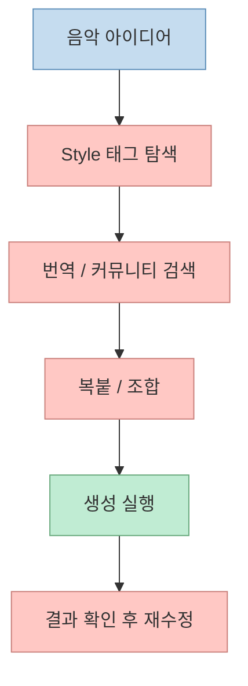
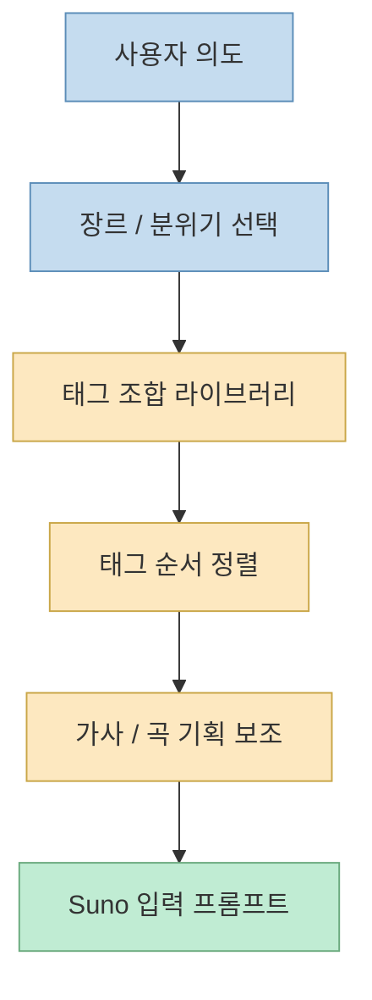
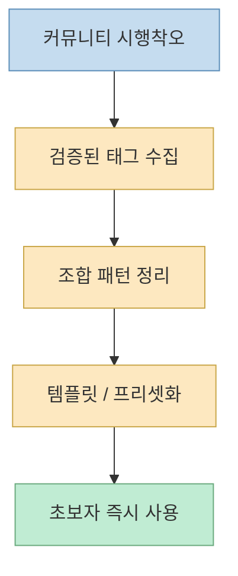
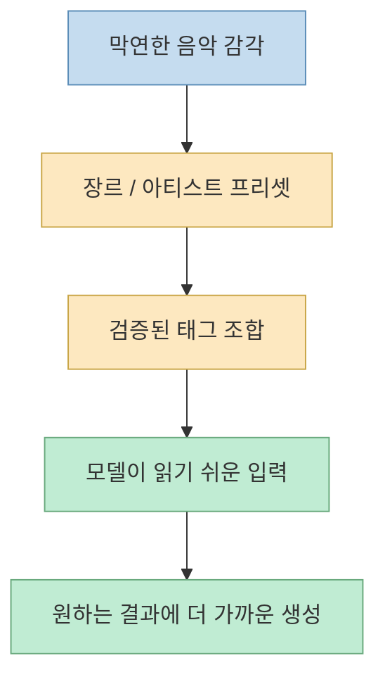

이 Threads 포스트가 흥미로운 이유는 AI 음악 생성의 병목을 모델 품질에서 찾지 않는다는 점이다. 포스트 작성자는 Suno에서 음악을 만드는 시간보다 **Style 태그를 찾는 시간** 이 더 오래 걸린다고 말한다. 검색하고, 번역하고, 복붙하고, 다시 수정하는 반복 때문에 한 시간이 그냥 날아간다는 문제 제기다.[Threads 원문](https://www.threads.com/@gpt_park/post/DYuOjasDdnw?xmt=AQG0sIpAPjSES1YrHrhoa0eaxWMGGOH91xX-JOFzAUneJP8dFUuLJass2osAeKhgo_pv014&slof=1)

이 관점은 꽤 중요하다. 많은 사람이 Suno나 비슷한 음악 생성 도구를 볼 때 "노래가 얼마나 잘 나오느냐"에만 집중하지만, 실제 작업 흐름에서 더 자주 막히는 건 **어떤 스타일 태그를 어떤 순서로 조합해야 원하는 결과가 나오는지** 다. 그래서 이 포스트가 소개하는 `SuNote`의 진짜 의미는 또 하나의 AI 음악 앱이라기보다, **태그 탐색과 조합이라는 숨은 수작업을 제품화한 도구** 에 가깝다.

<!--more-->

## Sources

- Threads: [지피티 팍 Threads 포스트](https://www.threads.com/@gpt_park/post/DYuOjasDdnw?xmt=AQG0sIpAPjSES1YrHrhoa0eaxWMGGOH91xX-JOFzAUneJP8dFUuLJass2osAeKhgo_pv014&slof=1)

## 이 포스트의 핵심 문제의식은 "생성 AI의 앞단 병목"이다

Threads 원문은 아주 실무적으로 문제를 정의한다.

- Style 태그를 찾는다
- 한국어/영어 표현을 번역한다
- 복사해 붙인다
- 잘 안 먹히면 수정한다
- 다시 시도한다

이 과정을 반복하다 보면 시간이 사라진다는 것이다.[Threads 원문](https://www.threads.com/@gpt_park/post/DYuOjasDdnw?xmt=AQG0sIpAPjSES1YrHrhoa0eaxWMGGOH91xX-JOFzAUneJP8dFUuLJass2osAeKhgo_pv014&slof=1)

이건 단순히 귀찮은 UX 문제처럼 보일 수 있지만, 실제로는 생성형 도구 전반에서 자주 나타나는 병목이다. 모델 호출 자체는 몇 분 안에 끝나는데, 그 전에:

- 조건을 어떤 어휘로 써야 하는지 찾고
- 커뮤니티에서 잘 먹힌 표현을 모으고
- 도메인별 표현 방식을 학습하고
- 태그 순서와 조합을 실험하는

시간이 더 많이 든다.

즉 많은 생성형 툴에서 사용자가 실제로 하는 일은 "창작"이라기보다, **모델이 이해하기 쉬운 제어 어휘를 찾는 일** 에 더 가깝다.

## `SuNote`가 해결하려는 건 모델이 아니라 "태그 오퍼레이팅 시스템"이다

Threads 본문이 내세우는 기능을 보면, `SuNote`는 곡 생성 엔진이라기보다 **태그 운영 레이어** 에 가깝다.

원문에 적힌 기능은 다음과 같다.

- 검증된 Style 태그 자동 조합
- 잘 먹히는 태그 순서 자동 정렬
- GPT·Claude·Gemini로 가사 생성
- 플레이리스트 앨범 12곡 한 번에 기획
- EDM 서브장르 정리
- 200명 아티스트 프리셋
- 648개 검증된 Style 태그
- 867개 즉시 사용 템플릿
- 200개 EDM·댄스 장르 지원

여기서 눈에 띄는 건 숫자보다도 구조다. 이 도구는 "AI가 음악을 만든다"보다, **사람이 Suno에 던질 제어 입력을 체계화한다** 는 데 초점이 맞춰져 있다.[Threads 원문](https://www.threads.com/@gpt_park/post/DYuOjasDdnw?xmt=AQG0sIpAPjSES1YrHrhoa0eaxWMGGOH91xX-JOFzAUneJP8dFUuLJass2osAeKhgo_pv014&slof=1)

즉 `SuNote`의 핵심은 생성 그 자체가 아니라, **생성 앞단의 어휘, 순서, 패턴, 프리셋을 라이브러리화하는 것** 이다.

## 왜 "태그 순서"까지 중요하다고 말할까

Threads 원문은 단순히 태그 목록 제공이 아니라, "잘 먹히는 태그 순서 자동 정렬"을 기능으로 강조한다. 이 대목은 의미가 크다. 많은 생성형 시스템에서 입력 요소는 단순 집합이 아니라 **배열 순서와 강조 구조** 에 영향을 받는다. 사용자 입장에서는 같은 단어라도:

- 무엇을 먼저 쓰는지
- 어떤 장르를 앞에 놓는지
- 어떤 분위기 태그를 뒤에 붙이는지

에 따라 결과가 달라진다고 느끼기 쉽다.

이때 사용자는 사실상 두 가지 일을 동시에 하게 된다.

1. 내가 원하는 곡의 성격을 설명하는 일
2. 모델이 그 설명을 잘 읽게 배열하는 일

이 두 번째가 피로한데, `SuNote`는 바로 그 부분을 제품 기능으로 끌어올린다.

## 이 포스트가 보여 주는 더 큰 흐름은 "프롬프트 엔지니어링의 패키징"이다

`SuNote`를 꼭 음악 도구로만 볼 필요는 없다. 더 넓게 보면, 이건 **도메인 특화 프롬프트 엔지니어링을 템플릿 상품으로 포장한 사례** 다.

원문이 강조하는 648개 태그, 867개 템플릿, 200개 장르 지원 같은 숫자는 단순 자랑이 아니다. 이 숫자들이 의미하는 건:

- 개별 사용자의 시행착오를 미리 수집하고
- 잘 먹히는 조합을 정리하고
- 재사용 가능한 프리셋으로 묶고
- 초보자가 바로 쓸 수 있게 포장했다

는 점이다.

즉 예전에는 커뮤니티 글, 디스코드, 노션 문서, 개인 메모장에 흩어져 있던 "경험적 베스트 프랙티스"를, 하나의 작업 인터페이스로 묶어낸 셈이다.

이건 결국 음악 생성에서도 **좋은 모델 자체보다 좋은 입력 운영체계가 더 빨리 상품화될 수 있다** 는 걸 보여 준다.

## "플리 제작하는 사람"에게 특히 빠르다는 말은 왜 나올까

Threads 본문은 특히 플레이리스트를 만드는 사람은 속도 체감이 바로 온다고 말한다. 이 역시 구조적으로 이해할 수 있다. 한 곡만 만들 때보다 여러 곡을 한 번에 기획할 때 병목은 더 커지기 때문이다.

한 곡 제작이라면:

- 장르 하나
- 분위기 하나
- 태그 세트 하나

로 끝날 수 있다.

하지만 12곡짜리 앨범이나 플레이리스트를 기획한다면:

- 곡별 콘셉트 차이를 줘야 하고
- 전체 톤은 유지해야 하고
- 곡 순서에 따라 분위기 변화도 고민해야 하고
- 반복적으로 태그를 수정해야 한다

그러니 이때는 생성 시간보다 **기획과 태그 관리 비용** 이 훨씬 더 커진다. 원문이 "플레이리스트 앨범 12곡 한 번에 기획"을 강조하는 이유도 바로 여기에 있다.[Threads 원문](https://www.threads.com/@gpt_park/post/DYuOjasDdnw?xmt=AQG0sIpAPjSES1YrHrhoa0eaxWMGGOH91xX-JOFzAUneJP8dFUuLJass2osAeKhgo_pv014&slof=1)

## 이 도구의 가치는 "장르를 몰라도 시작할 수 있게 한다"는 진입점에 있다

원문 마지막 문장은 "이제 장르 이름 몰라도 음악 만든다"다. 이 문장은 과장이면서도 핵심을 잘 찌른다. 사실 초보자가 가장 먼저 부딪히는 벽은 음악 생성 모델이 아니라 **장르 어휘의 부족** 이다.

예를 들어 사용자는 "신나는 클럽 느낌"은 알지만:

- progressive house와 melodic techno의 차이
- future bass와 dance-pop의 경계
- 어떤 아티스트 레퍼런스가 어떤 질감을 뜻하는지

를 정확히 모를 수 있다.

이때 태그 라이브러리와 프리셋이 하는 일은 단순 추천이 아니다. 사용자의 막연한 감각을 **모델이 이해할 수 있는 도메인 어휘로 번역하는 것** 이다.

즉 이 도구의 본질은 "음악을 대신 만들어 준다"보다, **초보자의 감각을 생성 모델용 언어로 번역해 준다** 는 쪽에 더 가깝다.

## 다만 현재 공개 원문만으로는 구현 방식까지는 확인되지 않는다

이번 포스트는 Threads 본문에 나온 기능 설명을 기준으로 정리했다. 하지만 현재 공개 원문만으로는 다음 항목은 확인되지 않는다.

- 실제 배포 위치
- 웹앱인지 노션/시트 기반 툴인지
- 태그 추천 로직이 규칙 기반인지 모델 기반인지
- Suno API와 직접 연결되는지, 아니면 입력 보조 도구인지

그래서 이 글의 해석은 **기능 주장과 문제 정의** 에 초점을 둔다. 즉 `SuNote`를 "완성된 음악 생성 플랫폼"으로 단정하기보다, **Suno 앞단의 태그 운영 문제를 풀려는 워크플로 도구** 로 보는 편이 안전하다.

## 핵심 요약

- Threads 원문은 Suno의 병목을 생성 속도가 아니라 **Style 태그 탐색과 조합** 에서 찾는다.
- `SuNote`가 강조하는 가치는 곡 생성 엔진보다 **태그 라이브러리 + 순서 정렬 + 템플릿화** 에 있다.
- 이 도구는 결국 음악 생성용 프롬프트 엔지니어링을 **도메인 특화 작업 인터페이스** 로 포장한 사례로 읽힌다.
- 특히 플레이리스트·앨범 단위 기획에서는 생성보다 태그 관리 비용이 더 커지므로 이런 도구의 가치가 커진다.
- 장르 이름을 잘 모르는 초보자에게는 감각을 도메인 어휘로 번역해 주는 레이어가 핵심이 된다.

## 결론

이 Threads 포스트가 던지는 가장 중요한 메시지는 간단하다. 생성형 음악에서 진짜 느린 건 꼭 모델이 아니다. 오히려 **모델에게 무엇을 어떻게 말할지를 찾는 과정** 이 더 오래 걸릴 수 있다. 그래서 `SuNote` 같은 도구가 주목받는 이유도 "음악 AI"라서가 아니라, **입력 설계의 시행착오를 라이브러리와 템플릿으로 바꿨기 때문** 이다. 앞으로도 생성형 툴 시장에서는 모델 자체보다, 그 모델을 더 빨리 잘 쓰게 만드는 운영 레이어가 더 자주 상품화될 가능성이 크다.
