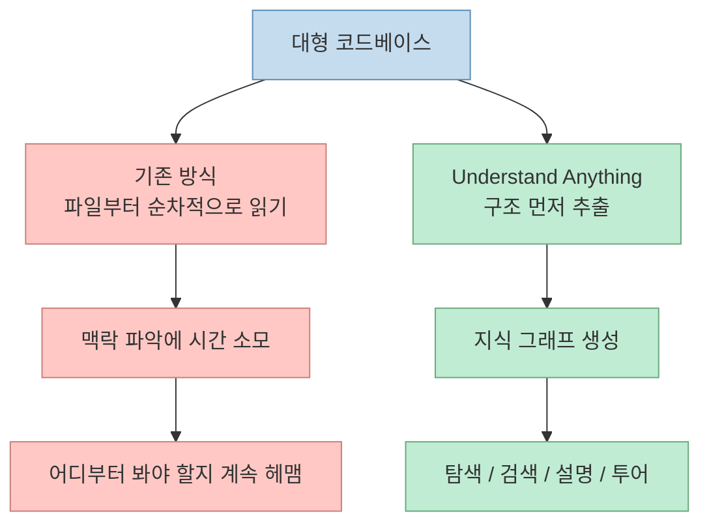
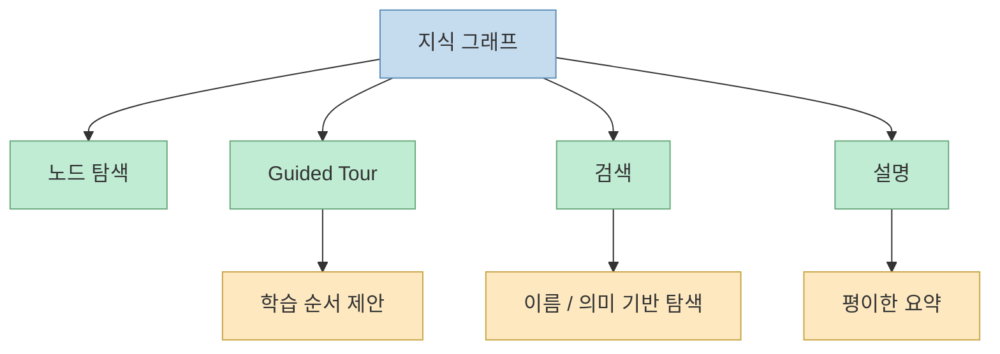
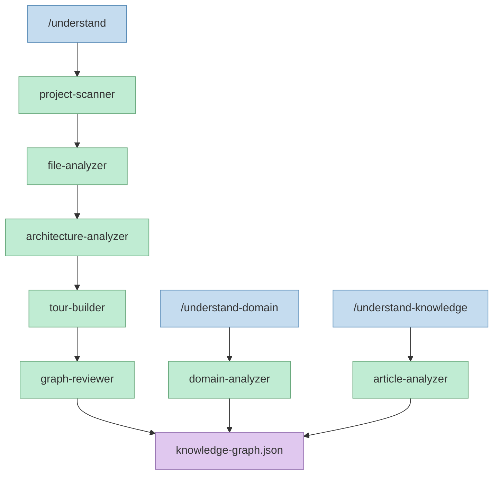
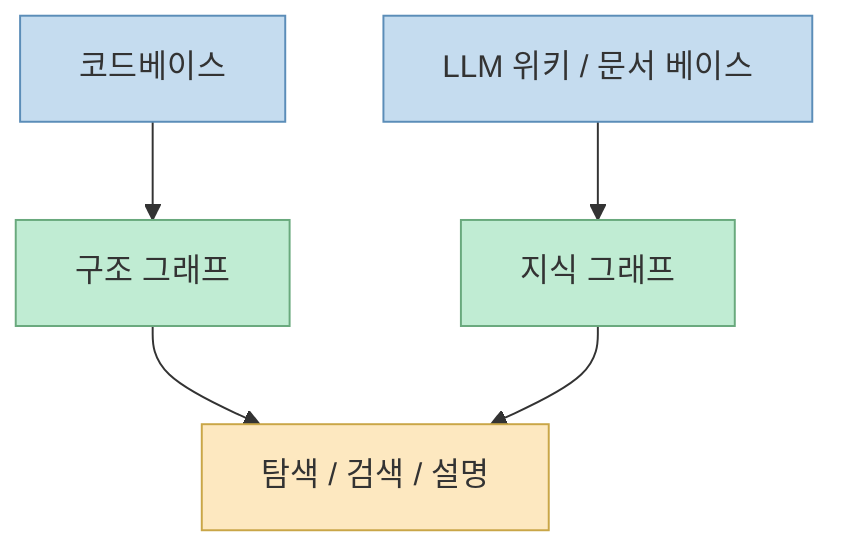
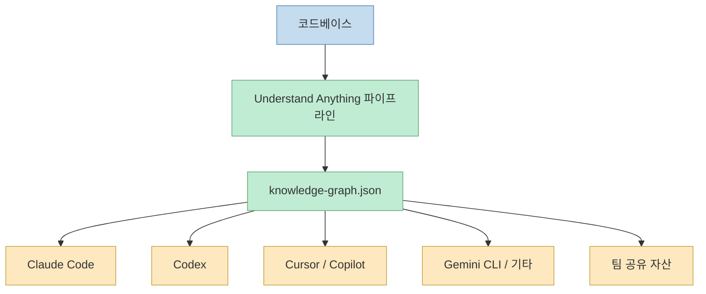

`Understand Anything`은 겉으로 보면 또 하나의 "코드베이스 시각화 도구"처럼 보일 수 있다. 하지만 README를 자세히 읽어 보면 이 프로젝트가 노리는 목표는 단순한 시각화가 아니다. 핵심은 **코드베이스를 예쁘게 그리는 것** 이 아니라, **처음 들어온 사람이 어디서부터 읽어야 하는지 학습 가능한 형태로 바꾸는 것** 이다. 저장소 소개 문장도 이를 아주 직접적으로 말한다. "그래프가 복잡해서 감탄하게 만드는 것이 목표가 아니라, 각 조각이 어떻게 맞물리는지 조용히 가르쳐 주는 그래프가 목표"라는 식이다.[GitHub 저장소](https://github.com/Lum1104/Understand-Anything)

2026년 5월 24일 기준으로 이 저장소는 GitHub에서 별 21,312개를 기록하고 있었고, 설명란에는 "어떤 코드든 인터랙티브 지식 그래프로 바꿔 탐색·검색·질문할 수 있게 만든다"고 적혀 있다. 특히 Claude Code, Codex, Cursor, Copilot, Gemini CLI 등 여러 에이전트 환경에서 동작하도록 설계된 점이 눈에 띈다. 즉 이 프로젝트는 단일 IDE 플러그인보다, **여러 AI 코딩 인터페이스에서 공통으로 쓸 수 있는 코드 이해 레이어** 를 만들려는 시도에 가깝다.[GitHub API 확인, 2026-05-24](https://github.com/Lum1104/Understand-Anything)

<!--more-->

## Sources

- GitHub: [Lum1104/Understand-Anything](https://github.com/Lum1104/Understand-Anything)
- 홈페이지: [understand-anything.com](https://understand-anything.com)

## 이 프로젝트가 푸는 문제는 "코드 생성"이 아니라 "코드베이스 온보딩"이다

README의 첫 문제 제기는 아주 현실적이다. 새 팀에 합류했는데 코드가 20만 줄이라면, 도대체 어디서부터 읽어야 하느냐는 질문이다. 많은 AI 코딩 도구가 "새 코드를 빨리 쓰는 것"에 초점을 맞추지만, 실제 대형 프로젝트에서는 **기존 시스템을 이해하는 비용** 이 더 자주 병목이 된다.[GitHub 저장소](https://github.com/Lum1104/Understand-Anything)

`Understand Anything`은 이 병목을 다음 방식으로 바꾸려 한다.

- 파일, 함수, 클래스, 의존성을 추출하고
- 그것들을 그래프 노드와 엣지로 바꾸고
- 사람이 브라우저 대시보드에서 탐색할 수 있게 만들고
- 필요한 경우 에이전트가 그 위에서 질문과 설명을 수행하게 한다

즉 핵심 아이디어는 "코드를 다 읽은 뒤 구조를 머릿속에 그린다"가 아니라, **먼저 구조를 바깥으로 꺼내고 그 위에서 읽기 시작한다** 는 것이다.

## "그래프를 보여 준다"보다 중요한 건 "학습 순서"를 만든다는 점이다

이 저장소가 다른 시각화 도구와 구분되는 지점 중 하나는 **Guided Tours** 다. README는 자동 생성된 아키텍처 워크스루를 제공하고, 의존성 순서에 따라 올바른 학습 순서를 제안한다고 설명한다. 이건 단순히 노드가 많고 관계가 보이는 것과는 다른 문제다. 그래프만 그려 놓으면 오히려 복잡성이 더 커질 수 있기 때문이다.[GitHub 저장소](https://github.com/Lum1104/Understand-Anything)

그래서 이 프로젝트는 그래프를 "전시물"이 아니라 "튜터"처럼 다룬다. 사용자는 단순히:

- 어떤 파일이 있는지 보는 것이 아니라
- 어떤 순서로 읽어야 하는지 안내받고
- 각 노드의 평이한 설명을 보고
- 관련 노드와 관계를 따라가며
- 더 넓은 레이어와 도메인 맥락으로 확장한다

이 점에서 이 도구는 시각화 자체보다 **온보딩 인터페이스** 에 가깝다.

## `/understand`는 사실상 멀티 에이전트 분석 파이프라인이다

README에서 가장 중요한 기술 설명은 `/understand` 명령이 단순 스캔이 아니라 **5개 전문 에이전트를 오케스트레이션하는 파이프라인** 이라는 대목이다. `/understand-domain`까지 포함하면 6번째 에이전트가 추가되고, 지식 베이스 분석용 `/understand-knowledge`에는 `article-analyzer` 역할도 붙는다.[GitHub 저장소](https://github.com/Lum1104/Understand-Anything)

README에 나온 역할 분담은 다음과 같다.

- `project-scanner`: 파일, 언어, 프레임워크 감지
- `file-analyzer`: 함수, 클래스, import 추출 후 그래프 노드/엣지 생성
- `architecture-analyzer`: 아키텍처 레이어 식별
- `tour-builder`: 학습용 가이드 투어 생성
- `graph-reviewer`: 그래프 완결성 및 참조 무결성 점검
- `domain-analyzer`: 비즈니스 도메인/플로우/단계 추출
- `article-analyzer`: 위키 문서에서 엔티티, 주장, 암묵 관계 추출

여기서 중요한 건 역할 분리다. 이 프로젝트는 "하나의 LLM이 다 알아서 읽고 설명"하는 방식보다, **구조 추출·레이어 판단·학습 순서 생성·검증을 따로 떼어 놓는 하네스형 설계** 를 택하고 있다.

## 병렬 처리와 증분 업데이트를 전제로 설계됐다는 점도 중요하다

README는 `file-analyzer`가 병렬로 실행되고, 최대 5개 동시성으로 20~30개 파일 배치를 처리한다고 설명한다. 또 변경된 파일만 다시 분석하는 증분 업데이트도 지원한다고 되어 있다.[GitHub 저장소](https://github.com/Lum1104/Understand-Anything)

이건 단순한 구현 디테일 같지만 실제로는 매우 중요하다. 코드베이스 그래프 도구가 실무에서 버려지는 가장 흔한 이유 중 하나는 **초기 한 번 돌려 보고 끝나는 정적 산출물** 이 되기 때문이다. 반면 이 프로젝트는:

- 분석 시간이 너무 길어지지 않도록 병렬화하고
- 매번 전체를 다시 읽지 않도록 증분화하고
- `--auto-update`로 포스트 커밋 훅까지 제안한다

즉 "한 번 만든 다이어그램"이 아니라, **변화와 함께 갱신되는 코드 이해 레이어** 로 쓰이기를 의도하고 있다.

## 이 프로젝트가 진짜 재밌는 지점은 "코드" 말고 "지식 베이스"도 그래프로 만든다는 점이다

README에서 특히 눈에 띄는 기능은 `/understand-knowledge`다. 카파시 스타일의 LLM 위키를 입력으로 받아, 위키링크와 카테고리를 deterministic parser로 뽑고, 그 위에 LLM 에이전트가 암묵적 관계와 엔티티, 주장까지 추가해 **force-directed knowledge graph** 로 바꾼다고 설명한다.[GitHub 저장소](https://github.com/Lum1104/Understand-Anything)

이 말은 곧 이 프로젝트의 핵심이 "AST 기반 코드 분석기"에만 있지 않다는 뜻이다. 더 본질적으로는:

- 구조화된 소스가 있으면
- 그것을 노드와 관계로 추출하고
- 사람과 에이전트가 함께 탐색 가능한 그래프로 바꾸는

일반적인 지식 인터페이스 패턴을 구현하고 있다는 것이다.

이 관점에서 보면 `Understand Anything`은 코드 전용 툴이라기보다, **복잡한 구조를 탐색 가능한 그래프로 바꾸는 범용 하네스** 에 더 가깝다.

## 대시보드는 "보여 주는 화면"이 아니라 질문 인터페이스다

README에 따르면 사용자는 `/understand-dashboard`로 웹 대시보드를 열 수 있고, 색상으로 구분된 아키텍처 레이어, 클릭 가능한 노드, 검색, 코드/관계/설명 패널을 쓸 수 있다. 여기에 `/understand-chat`, `/understand-explain`, `/understand-diff`, `/understand-onboard`, `/understand-domain` 같은 명령이 붙는다.[GitHub 저장소](https://github.com/Lum1104/Understand-Anything)

이 조합을 보면 대시보드의 역할은 예쁜 시각화보다:

- 내가 지금 바꾼 코드의 영향 범위를 보고
- 신규 입사자용 온보딩 설명을 만들고
- 특정 파일이나 함수의 맥락을 질의하고
- 비즈니스 도메인 레벨까지 추상화하는

질문 인터페이스 쪽에 더 가깝다.

즉 그래프는 결과물이 아니라, **질문 가능한 중간 표현** 이다.

## 멀티 플랫폼 지원은 이 프로젝트를 "에이전트 공통 인프라"처럼 보이게 만든다

README에는 Claude Code 네이티브 플러그인 설치 외에도 Codex, OpenCode, OpenClaw, Antigravity, Gemini CLI, Pi Agent, Vibe CLI, VS Code Copilot, Hermes, Cline, KIMI CLI까지 원라인 설치 스크립트를 제공한다고 적혀 있다. Cursor와 VS Code Copilot은 레포 클론만으로 auto-discovery된다고도 설명한다.[GitHub 저장소](https://github.com/Lum1104/Understand-Anything)

이건 꽤 중요한 신호다. 많은 도구가 특정 IDE나 특정 모델 생태계에 묶이는데, `Understand Anything`은 반대로 **코드 이해용 공통 자산을 어디서든 쓸 수 있게 하는 것** 을 목표로 한다. 결과 그래프가 `.understand-anything/knowledge-graph.json` 같은 파일로 저장되고, 팀과 공유할 수 있다고 설명하는 것도 같은 맥락이다.[GitHub 저장소](https://github.com/Lum1104/Understand-Anything)

## 실무에서는 특히 온보딩, PR 리뷰, diff 이해에 강할 가능성이 크다

README가 직접 언급하는 활용 사례도 이 방향이다.

- 신규 팀원 온보딩
- PR 리뷰
- docs-as-code
- diff impact analysis

이걸 보면 이 도구는 "AI가 코드 대신 짜 준다"는 영역보다, **기존 시스템을 이해해야 하는 순간들** 에 더 강한 도구일 가능성이 높다. 특히 그래프를 저장해서 팀이 공유하고, 변경이 있을 때 자동 갱신하는 흐름은 문서가 항상 낡는 문제를 줄이려는 시도로 읽힌다.[GitHub 저장소](https://github.com/Lum1104/Understand-Anything)

물론 한계도 있다. 그래프 기반 이해는 어디까지나 **요약된 외부 표현** 이기 때문에, 중요한 구현 세부나 런타임 맥락까지 완전히 대체하진 못한다. README가 제공하는 기능만 봐도 결국 코드를 클릭해 보고, 설명을 읽고, 관계를 따라가는 추가 탐색이 전제된다. 즉 이것은 코드 읽기의 대체재라기보다, **코드 읽기의 시작점을 더 똑똑하게 정하는 도구** 로 보는 편이 맞다.

## 핵심 요약

- `Understand Anything`의 핵심은 예쁜 그래프가 아니라 **코드베이스 온보딩을 학습 가능한 인터페이스로 바꾸는 것** 이다.
- `/understand`는 단일 모델 호출이 아니라 여러 전문 에이전트가 나뉜 **멀티 에이전트 분석 파이프라인** 이다.
- Guided Tours, 검색, 설명, diff 분석, 도메인 추출이 결합돼 그래프를 단순 시각화가 아니라 **질문 가능한 중간 표현** 으로 만든다.
- 코드뿐 아니라 LLM 위키 같은 지식 베이스까지 그래프로 바꿀 수 있어, 본질적으로는 **구조 이해용 범용 하네스** 에 가깝다.
- 멀티 플랫폼 설치와 JSON 산출물 공유 구조 때문에 특정 IDE 플러그인보다 **에이전트 공통 인프라** 처럼 보인다.

## 결론

`Understand Anything`이 주목받는 이유는 "코드 그래프를 그려 준다"는 한 문장으로는 설명이 부족하다. 더 정확히 말하면, 이 프로젝트는 **복잡한 코드베이스를 사람이 배우고 에이전트가 다룰 수 있는 지식 그래프로 재구성하는 작업 흐름** 을 제공한다. 생성형 AI 시대에 새 코드를 쓰는 속도도 중요하지만, 이미 존재하는 거대한 시스템을 얼마나 빨리 이해하느냐가 더 큰 차이를 만들 때가 많다. 그런 맥락에서 이 프로젝트는 또 하나의 시각화 툴이라기보다, **코드 이해를 위한 별도의 운영 레이어** 로 보는 편이 더 맞다.
