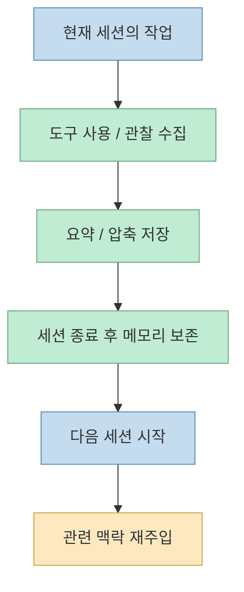
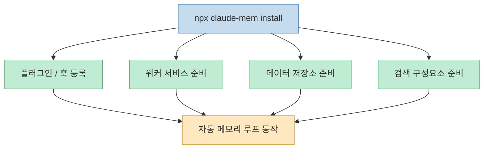
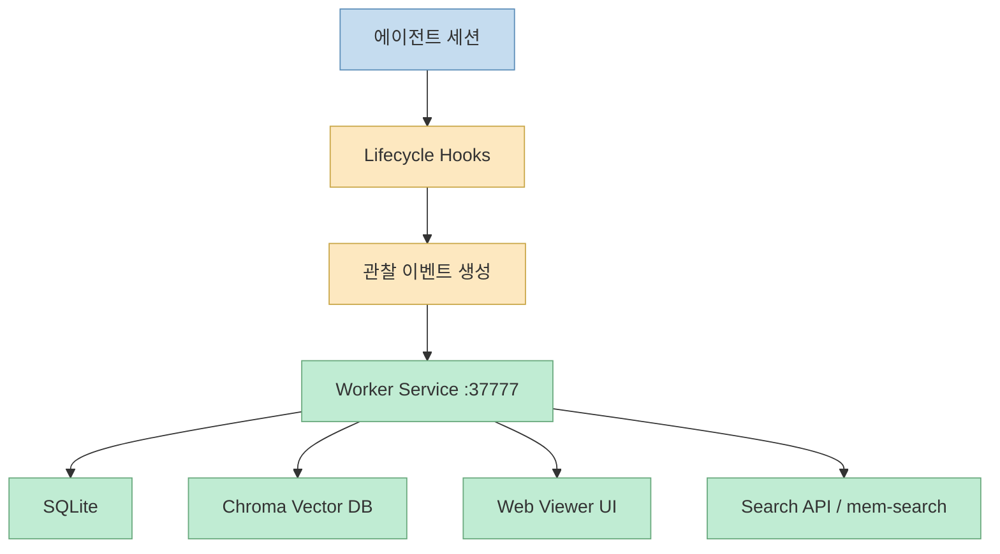
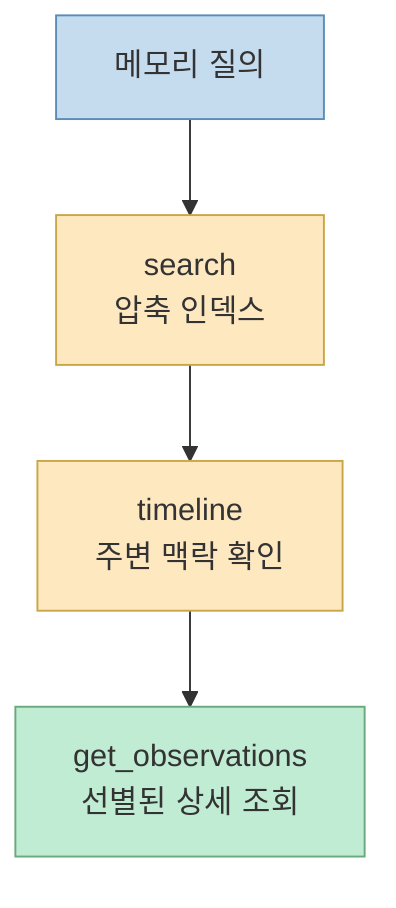
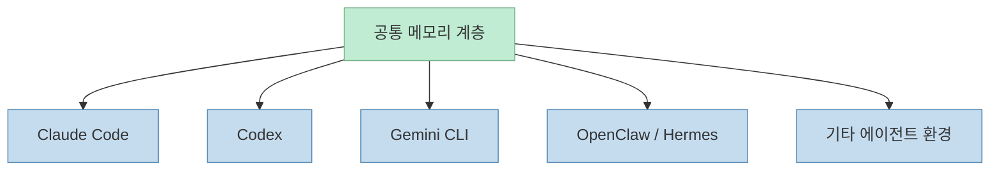

`claude-mem`이 주목받는 이유를 한 문장으로 줄이면, "대화 내용을 저장한다"가 아니라 **에이전트가 세션 사이에서 프로젝트 맥락을 잃지 않게 만드는 하네스** 라는 점에 있다. 저장소 설명도 이를 매우 직접적으로 말한다. 이 프로젝트는 "모든 에이전트에 대해 세션 간 persistent context를 제공"하며, 세션 동안 에이전트가 한 일을 캡처하고, AI로 압축하고, 다음 세션에 관련 맥락을 다시 주입한다고 설명한다.[GitHub 저장소](https://github.com/thedotmack/claude-mem)

2026년 5월 25일 기준 GitHub API로 확인한 이 저장소의 별 수는 77,994개였다. 설명란에는 Claude Code뿐 아니라 OpenClaw, Codex, Gemini, Hermes, Copilot, OpenCode 등 여러 에이전트 환경에서 동작한다고 적혀 있다. 즉 이 프로젝트는 단순한 Claude Code 플러그인에 머물지 않고, **에이전트 공통 메모리 계층** 을 지향하는 방향으로 확장되고 있다.[GitHub API 확인, 2026-05-25](https://github.com/thedotmack/claude-mem)

<!--more-->

## Sources

- GitHub: [thedotmack/claude-mem](https://github.com/thedotmack/claude-mem)
- 공식 문서: [docs.claude-mem.ai](https://docs.claude-mem.ai/)
- 홈페이지: [claude-mem.ai](https://claude-mem.ai)

## 이 프로젝트가 푸는 문제는 "세션이 끊길 때마다 AI가 다시 초보자가 되는 것"이다

많은 AI 코딩 도구는 한 세션 안에서는 꽤 똑똑해 보인다. 하지만 세션이 끝나거나, 다른 IDE/CLI로 넘어가거나, 다음 날 다시 열면 이전 맥락을 거의 잃는다. 그러면 사용자는:

- 지금까지 무엇을 했는지 다시 설명하고
- 어떤 시도를 했는지 반복해서 적고
- 실패한 접근과 성공한 접근을 다시 구분하고
- 프로젝트 특유의 규칙과 상태를 다시 주입해야 한다

`claude-mem`은 바로 이 지점을 해결하려 한다. README는 세션 중 도구 사용 관찰을 자동으로 수집하고, semantic summary를 만든 뒤, 미래 세션이 시작될 때 관련 맥락을 다시 보여 준다고 설명한다.[GitHub 저장소](https://github.com/thedotmack/claude-mem)

즉 핵심은 전체 로그를 그대로 들고 다니는 것이 아니라, **미래 세션에 필요한 만큼만 재구성된 기억** 을 제공하는 것이다.

## README가 강조하는 핵심은 "캡처 → 압축 → 재주입"의 자동 루프다

README는 이 시스템을 자동으로 동작하는 persistent memory compression system이라고 부른다. 사용자는 수동으로 메모를 남기지 않아도 되고, 각 세션 종료 후 회고 문서를 따로 정리하지 않아도 된다. 대신 훅과 워커가 백그라운드에서:

- 관찰을 수집하고
- 요약을 만들고
- 저장하고
- 검색 가능하게 만들고
- 필요한 세션에만 다시 넣는다

라는 루프를 수행한다.[GitHub 저장소](https://github.com/thedotmack/claude-mem)

이 점에서 `claude-mem`은 단순한 노트 앱이나 RAG 캐시보다 더 하네스적이다. 저장이 목적이 아니라, **미래 세션의 토큰과 인지 비용을 줄이기 위한 압축 메커니즘** 이 목적이기 때문이다.

## 설치 방식이 "npm 라이브러리"가 아니라 "작동하는 시스템"인 이유

README는 설치 명령을 매우 강하게 구분한다. 권장 설치는 `npx claude-mem install`이고, Claude Code 안에서는 플러그인 마켓플레이스 명령도 지원한다. 반면 `npm install -g claude-mem`은 SDK/library만 설치할 뿐, 플러그인 훅이나 워커 서비스 설정은 하지 않는다고 명시한다.[GitHub 저장소](https://github.com/thedotmack/claude-mem)

이 안내는 중요하다. `claude-mem`은 패키지 몇 개 불러오는 라이브러리가 아니라:

- 훅 등록
- 워커 실행
- 데이터 디렉터리 생성
- 검색 인덱스 준비
- 웹 뷰어 기동

같은 **운영 환경 전체** 가 있어야 의미가 생기는 시스템이기 때문이다.

즉 이 프로젝트는 "패키지 설치"보다 **메모리 인프라 부팅** 에 가깝다.

## 아키텍처의 중심은 훅과 워커 서비스다

README의 "How It Works" 섹션은 이 시스템의 핵심 구성요소를 꽤 명확히 적어 둔다.

- 5개의 라이프사이클 훅
- Smart Install용 pre-hook
- 포트 37777에서 동작하는 Worker Service와 Web Viewer
- SQLite 데이터베이스
- `mem-search` 스킬
- Chroma 벡터 데이터베이스

여기서 특히 중요한 것은 훅과 워커의 역할 분리다. 훅은 세션 라이프사이클의 특정 시점에 관찰을 발생시키고, 워커는 HTTP API와 UI, 검색 엔드포인트, 저장소 관리 등을 맡는다. 즉 훅이 "센서"라면 워커는 "메모리 운영체제"에 가깝다.[GitHub 저장소](https://github.com/thedotmack/claude-mem)

이 설계 때문에 `claude-mem`은 단순한 "세션 텍스트 저장기"가 아니라, **관찰 이벤트를 구조화해서 검색 가능한 메모리로 바꾸는 파이프라인** 으로 읽힌다.

## 검색 설계가 흥미로운 이유는 "처음부터 전체를 주지 않는다"는 점이다

README에서 가장 눈에 띄는 부분 중 하나는 MCP Search Tools 설명이다. 여기서는 토큰 효율적인 3단계 워크플로를 전면에 둔다.

1. `search`로 compact index를 본다
2. `timeline`으로 주변 시퀀스를 본다
3. `get_observations`로 정말 필요한 ID만 전체 상세를 가져온다

README는 이 구조가 약 10배 토큰 절감을 준다고 주장한다. 중요한 건 수치 자체보다 철학이다. 즉 메모리 검색은 "관련 없어 보이는 모든 과거를 한 번에 주입"하는 방식이 아니라, **좁혀 가며 불러오는 progressive disclosure 구조** 로 설계돼 있다.[GitHub 저장소](https://github.com/thedotmack/claude-mem)

이 설계는 최근의 코드 그래프나 검색 레이어 도구들과도 결이 비슷하다. 전체 본문을 다 넣는 대신, **먼저 인덱스를 보고 그다음 필요한 것만 펼친다** 는 것이다.

## Progressive Disclosure는 그냥 UX가 아니라 메모리 철학이다

README는 주요 기능 목록에서도 "Progressive Disclosure"를 별도 항목으로 강조한다. 또 공식 문서 링크 중에서도 `context-engineering`과 `progressive-disclosure`를 따로 둔다. 이건 단순 UI 디테일이 아니다. 이 프로젝트는 컨텍스트 주입을 "많이 넣을수록 좋다"가 아니라, **필요한 만큼만 층층이 여는 것** 으로 이해하고 있다.[GitHub 저장소](https://github.com/thedotmack/claude-mem)

이 철학이 중요한 이유는 세션 메모리 시스템이 자칫하면 반대로 토큰 낭비와 혼란을 늘릴 수 있기 때문이다. 과거를 모두 기억하는 것은 좋아 보이지만, 실제로는:

- 무엇이 현재 문제와 관련 있는지 좁히기 어렵고
- 긴 기억이 현재 추론을 오염시키고
- 중요한 사실이 사소한 기록에 묻히기 쉽다

`claude-mem`은 이 문제를 "모두 저장"이 아니라 **모두 저장하되, 모두 주입하지는 않는다** 는 방식으로 푼다.

## 개인정보 제어와 인용 기능까지 넣은 건 "운영 툴"로 가고 있다는 신호다

README는 `<private>` 태그로 민감한 내용을 저장에서 제외할 수 있다고 설명하고, 관찰 ID를 통해 과거 기록을 인용하거나 웹 뷰어에서 조회할 수 있다고 적어 둔다. 이는 단순 편의 기능처럼 보이지만 사실 운영 관점에서 중요하다.[GitHub 저장소](https://github.com/thedotmack/claude-mem)

메모리 시스템이 실제 팀과 프로젝트에서 쓰이려면:

- 민감 정보를 배제할 수 있어야 하고
- 어떤 기억을 근거로 현재 판단이 나왔는지 추적 가능해야 하며
- 사람이 UI에서 직접 확인할 수 있어야 한다

즉 이 프로젝트는 벌써부터 메모리를 "잘 저장하는 기능"보다 **감사 가능하고 운영 가능한 기억 시스템** 으로 만들려는 방향을 보인다.

## OpenClaw, Gemini, Codex까지 지원한다는 건 "Claude 전용 해킹"을 넘어섰다는 뜻이다

README는 Claude Code 네이티브 플러그인 설치 외에 Gemini CLI, OpenCode, OpenClaw Gateway, 그리고 여러 IDE/CLI 지원을 강조한다. 이게 의미하는 바는 명확하다. 메모리 계층이 특정 모델 앱 안에 갇히는 게 아니라, **에이전트 런타임 바깥에 독립 레이어로 서려는 것** 이다.[GitHub 저장소](https://github.com/thedotmack/claude-mem)

이 관점은 앞으로 더 중요해질 가능성이 크다. 실제 작업에서는 한 사람이:

- Claude Code로 구현하고
- Codex로 리뷰하고
- Gemini로 대체 관점을 보고
- OpenClaw나 Hermes로 자동화 에이전트를 돌릴 수 있다

그럴 때 세션 메모리가 각 도구 안에 갇혀 있으면 매번 컨텍스트가 끊어진다. `claude-mem`의 멀티 플랫폼 지향은 바로 이 단절을 줄이려는 시도다.

## 한계도 분명하다. 메모리를 잘 저장하는 것과 잘 판단하는 것은 다르다

README가 아무리 강력해 보여도, 메모리 시스템이 모든 문제를 해결해 주는 것은 아니다. 저장과 주입이 좋아져도 여전히 남는 문제가 있다.

- 무엇을 관찰로 남길지 기준이 과하면 노이즈가 늘 수 있다
- 어떤 요약이 중요한지 판단이 틀리면 잘못된 기억이 강화될 수 있다
- 오래된 기억이 현재 코드 상태와 어긋날 수 있다
- 메모리 검색이 잘못 매치되면 오히려 현재 판단을 흐릴 수 있다

그래서 `claude-mem`의 가치는 "영구 기억" 자체보다, **영구 기억을 토큰 효율적이고 점진적으로 다루려는 운영 철학** 에 있다. 결국 핵심은 많이 기억하는 것이 아니라, **적절한 순간에 적절한 크기로 꺼내는 것** 이다.

## 핵심 요약

- `claude-mem`의 본질은 세션 로그 저장기가 아니라 **세션 간 컨텍스트 압축·재주입 시스템** 이다.
- 훅이 관찰을 수집하고, 워커 서비스가 SQLite·Chroma·웹 UI·검색 API를 운영하는 구조다.
- `search → timeline → get_observations`의 3단계 검색 패턴은 메모리를 처음부터 전부 주입하지 않는 progressive disclosure 철학을 보여 준다.
- `<private>` 태그, 관찰 ID 인용, 웹 뷰어 같은 기능은 이 프로젝트가 단순 해킹보다 **운영 가능한 기억 인프라** 로 가고 있음을 보여 준다.
- 멀티 플랫폼 지원은 메모리를 특정 도구 내부가 아니라 **에이전트 공통 계층** 으로 두려는 방향성이다.

## 결론

`claude-mem`이 커진 이유는 "AI가 과거를 기억한다"는 문장만으로는 설명이 부족하다. 더 정확히 말하면, 이 프로젝트는 **에이전트 세션의 작업 흔적을 압축된 기억으로 바꾸고, 미래 세션에 토큰 효율적으로 다시 연결하는 메모리 하네스** 를 제공한다. 에이전트가 많아질수록 문제는 더 큰 모델보다도, 세션이 바뀌어도 맥락이 이어지느냐에 가까워진다. 그런 점에서 `claude-mem`은 하나의 플러그인이 아니라, **에이전트 시대의 공통 메모리 계층을 실험하는 대표 사례** 로 볼 수 있다.
