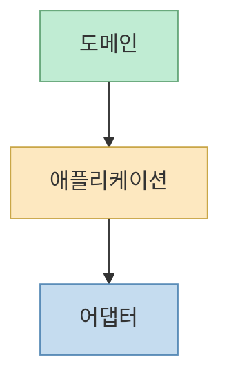
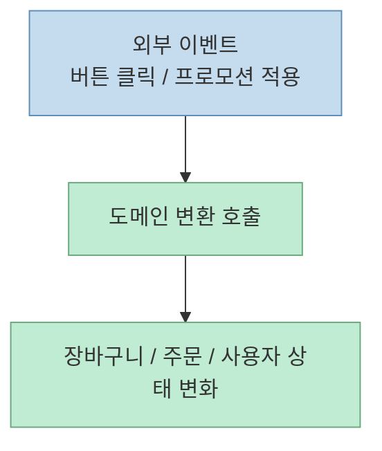
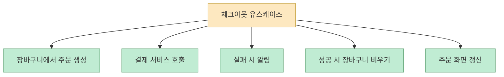
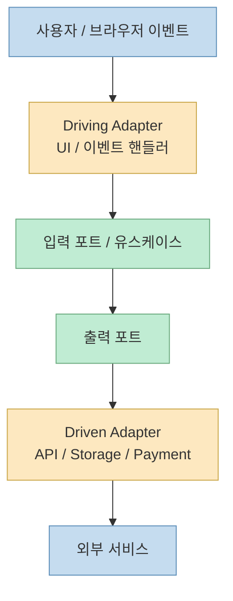
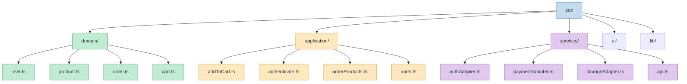

`Clean Architecture on Frontend`라는 제목만 보면 흔히 "React 컴포넌트를 예쁘게 나누는 법" 정도를 떠올리기 쉽다. 하지만 Alex Bespoyasov의 원문이 실제로 말하는 것은 훨씬 더 아래층이다. 이 글이 말하는 클린 아키텍처는 컴포넌트 구조가 아니라, **프런트엔드 코드 안에서 무엇이 도메인 지식이고, 무엇이 유스케이스이며, 무엇이 외부 서비스 적응 코드인지 분리하는 일** 이다.[원문](https://dev.to/bespoyasov/clean-architecture-on-frontend-4311)

저자는 이를 쿠키 스토어 예제로 설명한다. 상품, 장바구니, 주문, 사용자 같은 도메인 개념을 중심에 두고, 체크아웃 같은 시나리오는 그 주위의 애플리케이션 계층으로 분리한다. 그리고 React UI, API 요청, 로컬 스토리지, 결제 시스템 연동은 바깥쪽 어댑터로 밀어낸다. 즉 핵심 메시지는 "프런트엔드도 결국 복잡한 비즈니스 프로그램이므로, UI 프레임워크를 중심에 두지 말고 **업무 개념과 시나리오를 중심에 두라**"는 것이다.[원문](https://dev.to/bespoyasov/clean-architecture-on-frontend-4311)

<!--more-->

## Sources

- 원문: [Clean Architecture on Frontend - Alex Bespoyasov](https://dev.to/bespoyasov/clean-architecture-on-frontend-4311)
- 발표 영상: [The Public Talk](https://youtu.be/ThgqBecaq_w)
- 예제 코드: [bespoyasov/frontend-clean-architecture](https://github.com/bespoyasov/frontend-clean-architecture)

## 이 글이 말하는 클린 아키텍처의 핵심은 "도메인과의 거리"다

원문은 클린 아키텍처를 "애플리케이션 도메인과의 가까움에 따라 책임과 기능을 분리하는 방식"으로 설명한다. 여기서 도메인은 현실 세계의 일부를 프로그램으로 모델링한 것이고, 데이터와 그 데이터의 변환 규칙을 뜻한다. 예를 들어 상품 이름을 바꾸는 일, 장바구니에 항목을 담는 일, 총액을 계산하는 일은 도메인 변환이다.[원문](https://dev.to/bespoyasov/clean-architecture-on-frontend-4311)

저자가 강조하는 구조는 크게 세 층이다.

- 도메인 계층
- 애플리케이션 계층
- 어댑터 계층

그리고 가장 중요한 규칙은 **바깥층만 안쪽층에 의존할 수 있다** 는 점이다. 즉 도메인은 독립적이어야 하고, 애플리케이션은 도메인에 의존할 수 있지만, 도메인이 React나 API 라이브러리 같은 바깥 서비스에 의존하면 안 된다.[원문](https://dev.to/bespoyasov/clean-architecture-on-frontend-4311)

이 다이어그램을 읽을 때 중요한 건 화살표 방향보다 **책임 중심** 이다. 안쪽으로 갈수록 도메인 지식이 많고, 바깥으로 갈수록 서비스 적응 코드가 많아진다.

## 도메인 계층은 "프레임워크를 바꿔도 남는 것"이다

원문에서 도메인 계층은 애플리케이션의 핵심을 정의한다. 쿠키 스토어 예제에서는 상품, 주문, 장바구니, 사용자와 이들의 상태를 바꾸는 함수들이 도메인이다. 저자는 "React에서 Angular로 옮기더라도 바뀌지 않는 것"으로 도메인을 생각하라고 제안한다.[원문](https://dev.to/bespoyasov/clean-architecture-on-frontend-4311)

예를 들어 장바구니에 상품을 추가하는 함수는:

- 버튼 클릭으로 추가되든
- 프로모션 코드로 자동 추가되든

상관하지 않는다. 그냥 상품을 받아, 갱신된 장바구니를 돌려준다. 외부 이벤트는 도메인 변환을 **촉발** 할 뿐이지, 변환 규칙 자체를 결정하지는 않는다는 설명이다.[원문](https://dev.to/bespoyasov/clean-architecture-on-frontend-4311)

이 관점이 중요한 이유는 많은 프런트엔드 코드가 UI 이벤트와 비즈니스 규칙을 한 함수 안에 섞어 놓기 때문이다. 그러면 나중에 장바구니 정책을 바꾸고 싶을 때, React 상태 업데이트 코드와 API 응답 처리, UI 알림 로직까지 다 건드리게 된다.

즉 도메인은 "누가 호출했는지"보다 **무슨 규칙으로 바뀌는지** 만 알아야 한다.

## 애플리케이션 계층은 "유스케이스 오케스트레이터"다

원문에서 애플리케이션 계층은 유스케이스를 담는 층이다. 여기서 유스케이스란 사용자 시나리오, 즉 어떤 이벤트가 발생한 뒤 무엇을 어떤 순서로 해야 하는지를 기술한 코드다. 저자는 체크아웃을 예로 들며:

- 장바구니에서 항목을 꺼내 주문을 만들고
- 주문 결제를 시도하고
- 실패 시 사용자에게 알리고
- 성공 시 장바구니를 비우고 주문을 보여 주는

흐름을 하나의 유스케이스로 설명한다.[원문](https://dev.to/bespoyasov/clean-architecture-on-frontend-4311)

이 층은 흔히 "오케스트레이터"로 이해하면 편하다. 직접 UI를 렌더링하지도 않고, 직접 도메인 규칙을 정의하지도 않는다. 대신:

- 서버에 요청 보내기
- 도메인 변환 실행하기
- 필요한 후속 동작 호출하기

를 순서대로 조율한다.

이렇게 보면 유스케이스는 비즈니스 흐름의 "서사"를 담고, 도메인은 그 서사를 구성하는 "규칙"을 담는다.

## 포트와 어댑터는 "우리가 원하는 계약"과 "현실 세계 API"를 분리한다

원문은 애플리케이션 계층 안에 포트도 둔다고 설명한다. 포트는 애플리케이션이 외부 세계와 소통하고 싶어 하는 **계약** 이다. 보통 인터페이스 형태로 나타나며, 입력 포트는 바깥이 우리를 어떻게 호출할지, 출력 포트는 우리가 바깥을 어떻게 호출할지를 정의한다.[원문](https://dev.to/bespoyasov/clean-architecture-on-frontend-4311)

어댑터는 그 계약을 실제 외부 서비스 API에 맞춰 주는 층이다. 저자는 어댑터를 두 종류로 나눈다.

- driving adapters: 바깥 이벤트를 우리 시스템 신호로 바꿔 넣는 쪽
- driven adapters: 우리 시스템 신호를 외부 인프라 호출로 바꾸는 쪽

프런트엔드에서는 React UI의 이벤트 처리, 브라우저 API, 서버 요청 모듈, 로컬 스토리지 접근 등이 여기에 속한다.[원문](https://dev.to/bespoyasov/clean-architecture-on-frontend-4311)

이 구조를 쓰면 결제 시스템이 바뀌거나, 로컬 스토리지 대신 IndexedDB를 쓰게 되더라도 유스케이스와 도메인을 직접 뜯어고칠 필요가 줄어든다.

## 저자가 말하는 가장 중요한 규칙은 "도메인 추출"과 "의존성 방향 유지"다

원문은 클린 아키텍처의 장점을 길게 설명하지만, 동시에 비용도 솔직하게 말한다. 시간이 더 들고, 구현이 장황해질 수 있고, 온보딩이 어려워질 수 있고, 프런트엔드에서는 번들 크기까지 늘 수 있다는 것이다. 그래서 저자는 모든 규칙을 완벽하게 지키라고 하지 않는다. 오히려 **최소한 두 가지는 꼭 지키라** 고 정리한다.[원문](https://dev.to/bespoyasov/clean-architecture-on-frontend-4311)

그 두 가지는:

- 도메인을 분리할 것
- 의존성 방향을 지킬 것

이다.

이 두 규칙만 지켜도:

- 비즈니스 규칙이 코드베이스 곳곳에 흩어지지 않고
- 외부 서비스 요구사항이 애플리케이션 내부 구조를 끌고 다니지 않게 된다

저자는 심지어 다른 층은 나중에 추가해도 되지만, 도메인과 의존성 방향은 초반부터 신경 쓸 가치가 있다고 본다.[원문](https://dev.to/bespoyasov/clean-architecture-on-frontend-4311)

## 프런트엔드에서 이 구조가 특히 유용한 이유는 "UI가 비즈니스 로직을 빨아들이기 쉽기 때문"이다

저자가 굳이 프런트엔드에서 이 구조를 말하는 이유는 명확하다. 프런트엔드는 UI 프레임워크, 상태 관리, 서버 요청, 브라우저 저장소, 결제 모듈 등이 한 화면 로직으로 쉽게 뭉쳐 버린다. 그러면 React 훅 하나 안에:

- 버튼 이벤트 처리
- 서버 요청
- 예외 처리
- 장바구니 계산
- 사용자 메시지

가 모두 들어가게 된다.

원문은 이런 구조를 피하기 위해, 도메인 코드는 `src/domain`, 유스케이스는 `src/application`, 서비스 적응 코드는 `src/services`로 나누는 예시 폴더 구조를 보여 준다. `ui/`와 `lib/`는 바깥에 둔다.[원문](https://dev.to/bespoyasov/clean-architecture-on-frontend-4311)

이 구조는 UI를 얇게 만들고, 비즈니스 로직을 재사용·테스트하기 쉽게 만드는 데 목적이 있다.

## 하지만 저자도 "정석 구현이 항상 정답은 아니다"라고 말한다

이 글이 좋은 이유는 클린 아키텍처를 만능 해법처럼 포장하지 않는다는 점이다. 저자는 정석 구현이 작은 프로젝트에는 과할 수 있고, 너무 일찍 과설계하면 신규 개발자의 진입 장벽을 높일 수 있다고 말한다. 프런트엔드에서는 코드량이 늘어 브라우저가 다운로드·파싱·해석해야 하는 비용도 커질 수 있다고 지적한다.[원문](https://dev.to/bespoyasov/clean-architecture-on-frontend-4311)

그래서 현실적 타협점도 제안한다.

- 유스케이스를 조금 단순하게 만들기
- 어떤 경우엔 어댑터가 도메인을 바로 호출하게 하기
- 코드 스플리팅을 조정하기

즉 저자의 메시지는 "교과서대로 다 하라"가 아니라, **도메인과 의존성 방향만 지키고 나머지는 예산과 팀 역량에 맞춰 절충하라** 는 쪽에 가깝다.

## 이 글을 프런트엔드 실무에 적용하면 무엇이 달라질까

이 글을 오늘날 프런트엔드 실무 문맥으로 옮기면 다음과 같이 읽을 수 있다.

### 1. React 훅 안에 비즈니스 규칙을 넣지 않는다

훅은 이벤트 연결과 상태 동기화에 집중하고, 총액 계산이나 할인 규칙 같은 것은 도메인 함수로 뺀다.

### 2. 화면 동작 서사는 유스케이스 함수로 뺀다

체크아웃, 로그인, 결제 완료 같은 시나리오는 컴포넌트 바깥의 애플리케이션 함수로 옮긴다.

### 3. API 응답 형태를 그대로 내부에 퍼뜨리지 않는다

서버 응답은 어댑터에서 내부 모델로 변환하고, 도메인과 유스케이스는 그 내부 모델만 본다.

### 4. 외부 서비스 교체 가능성을 "이론"이 아니라 비용 제어 장치로 본다

결제 모듈, 저장소 구현, 알림 방식이 바뀔 수 있는 프로젝트일수록 포트와 어댑터의 가치가 커진다.

즉 이 글은 프런트엔드 아키텍처를 컴포넌트 레벨에서만 보지 말고, **업무 규칙과 화면 연결을 분리하는 방향으로 보라** 는 제안이다.

## 핵심 요약

- 이 글에서 말하는 클린 아키텍처는 컴포넌트 분리보다 **도메인·유스케이스·어댑터 분리** 에 가깝다.
- 도메인은 프레임워크를 바꿔도 남는 업무 규칙이고, 애플리케이션 계층은 유스케이스 오케스트레이션이며, 어댑터는 외부 서비스 API를 내부 계약에 맞춘다.
- 가장 중요한 규칙은 **도메인 추출** 과 **의존성 방향 유지** 다.
- 프런트엔드에서는 이 구조가 UI에 비즈니스 로직이 흡수되는 문제를 줄이는 데 특히 유용하다.
- 다만 저자도 작은 프로젝트에서는 과설계가 될 수 있다고 인정하며, 실무에서는 현실적인 타협이 필요하다고 본다.

## 결론

프런트엔드에 클린 아키텍처를 적용한다는 말은 React 폴더 구조를 멋지게 짜는 일이 아니다. 더 본질적으로는 **UI 프레임워크를 중심에 두지 않고, 도메인과 유스케이스를 중심에 두는 사고방식** 이다. 이 글이 오래됐어도 여전히 유효한 이유는, 오늘날에도 많은 프런트엔드 코드가 화면 이벤트와 비즈니스 규칙, 외부 서비스 연동을 한곳에 섞기 때문이다. 그래서 이 글의 실전적 메시지는 아주 단순하게 요약된다. **도메인을 먼저 뽑고, 외부 세계는 나중에 붙여라.**
