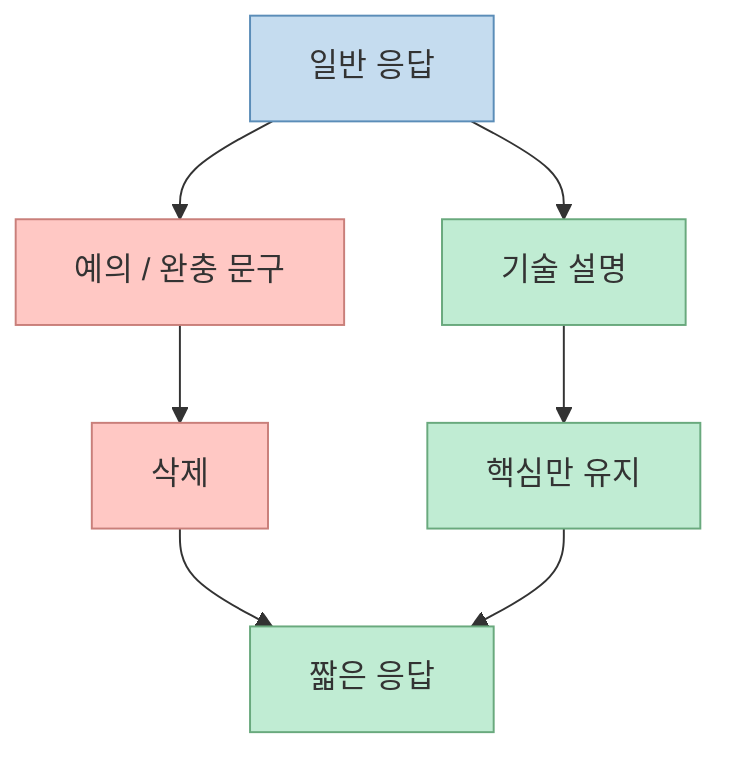
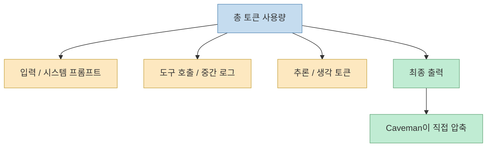
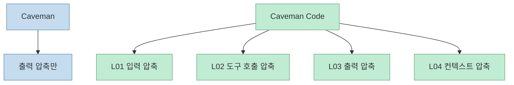
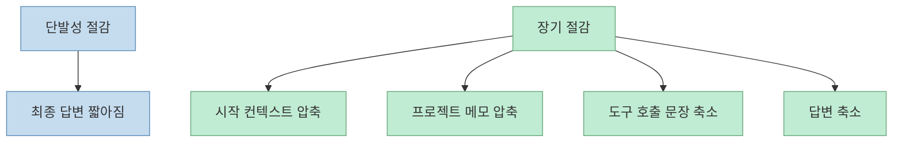

이 Shorts가 좋은 이유는 `Caveman`을 과장만 하지 않고, **정확히 어디까지 줄여 주는지** 를 짚어 준다는 점이다. 영상은 AI가 장황하게 설명하는 출력을 원시인처럼 짧고 간결하게 바꾸는 `Caveman`을 소개하면서, 기술 용어는 유지하고 군더더기만 제거해 토큰을 줄인다고 설명한다.[영상 00:00](https://youtu.be/vAA40SU4UeA?t=0) [영상 00:18](https://youtu.be/vAA40SU4UeA?t=18)

하지만 곧바로 중요한 단서를 붙인다. `Caveman`이 줄이는 것은 기본적으로 **최종 출력 토큰** 이지, 모델이 중간에 추론하거나 도구를 호출하면서 쓰는 토큰까지 자동으로 줄여 주는 것은 아니라는 점이다.[영상 00:43](https://youtu.be/vAA40SU4UeA?t=43) [영상 00:50](https://youtu.be/vAA40SU4UeA?t=50) 이 지적은 공식 GitHub README와도 맞닿아 있다. README 역시 `Caveman`은 "brain still big, mouth small"이라며, 생각 토큰은 건드리지 않고 출력만 압축한다고 명시한다.[Caveman GitHub](https://github.com/JuliusBrussee/caveman)

<!--more-->

## Sources

- 영상: [AI가 말을 너무 장황하게 한다면? 원시인처럼 만드는 caveman 우가우가!! 토큰 절약하기](https://youtube.com/shorts/vAA40SU4UeA?si=ehOaSddNF5mU-qPr)
- GitHub: [JuliusBrussee/caveman](https://github.com/JuliusBrussee/caveman)
- 공식 사이트: [getcaveman.dev](https://getcaveman.dev/)

## 이 영상이 말하는 `Caveman`의 본질은 "출력 스타일 압축"이다

영상의 설명은 단순하다. AI가 "Sure", "기쁘게 도와드리겠습니다", "맞아요"처럼 필요 이상으로 말을 길게 하는 경우가 있는데, `Caveman`은 이런 장식을 없애고 **핵심 기술 내용만 남기는 답변 스타일** 로 바꾼다는 것이다.[영상 00:22](https://youtu.be/vAA40SU4UeA?t=22) [영상 00:33](https://youtu.be/vAA40SU4UeA?t=33)

공식 GitHub README도 같은 예시를 쓴다. 일반적인 장문 설명을 "new object ref each render" 같은 짧은 문장으로 바꾸면서, 같은 수정 제안을 훨씬 적은 토큰으로 전달한다고 설명한다. README의 표현을 빌리면, `Caveman`은 모델의 머리를 줄이는 게 아니라 **입을 줄인다**.[Caveman GitHub](https://github.com/JuliusBrussee/caveman)

즉 `Caveman`은 모델의 지식을 바꾸기보다, **그 지식을 바깥으로 표현하는 형태** 를 바꾼다.

## 그래서 `75% 절감`을 들을 때는 "무엇을 기준으로 줄였는가"를 봐야 한다

영상은 `Caveman`을 쓰면 약 75% 정도 토큰이 줄어든다고 소개하지만, 곧바로 "놓치는 점"이 있다고 지적한다. 이 수치는 기본적으로 마지막에 출력하는 말 수를 줄이는 효과이고, 모델이 내부적으로 생각하거나 툴을 쓰면서 소비하는 토큰은 그대로라는 것이다.[영상 00:41](https://youtu.be/vAA40SU4UeA?t=41) [영상 00:47](https://youtu.be/vAA40SU4UeA?t=47)

공식 README도 같은 점을 분명히 적어 둔다. `Caveman only affects output tokens — thinking/reasoning tokens untouched`라는 설명이다. 즉:

- 답변 텍스트는 짧아진다
- 읽는 속도도 좋아질 수 있다
- 출력 비용은 줄 수 있다
- 하지만 전체 에이전트 비용이 같은 비율로 줄어든다고 보긴 어렵다

특히 코딩 에이전트처럼 긴 시스템 프롬프트, 큰 컨텍스트, 도구 호출 로그, 중간 추론이 많은 경우엔 더욱 그렇다.

이 차이를 이해하지 못하면 "응답이 짧아졌는데 왜 체감 절감이 생각보다 작지?" 같은 오해가 생기기 쉽다.

## 영상이 더 중요한 이유는 `Caveman Code`와의 차이를 짚어 주기 때문이다

영상 후반부는 단순한 출력 압축을 넘어, 공식 사이트의 `Caveman Code`가 **4개의 압축 레이어** 를 둔다고 설명한다. 영상 기준으로 이 네 층은:

- 입력 프롬프트 압축
- RTK 도구 호출 문장 압축
- 출력 압축
- 컨텍스트 및 시스템 프롬프트 압축

이다.[영상 01:09](https://youtu.be/vAA40SU4UeA?t=69) [영상 01:24](https://youtu.be/vAA40SU4UeA?t=84)

공식 사이트 `getcaveman.dev`도 거의 같은 구조를 전면에 둔다. 사이트는 `Caveman Code`를 "4개의 독립적인 압축 레이어로 구성된 coding agent CLI"라고 설명하며, L01 prompt, L02 RTK, L03 output, L04 context를 명시한다.[공식 사이트](https://getcaveman.dev/)

즉 영상이 짚는 핵심은 이것이다.

- `Caveman`: 출력 압축 primitive
- `Caveman Code`: 입력, 도구 호출, 출력, 컨텍스트까지 함께 줄이는 전체 스택

그래서 출력 압축 스킬 하나와, 전체 에이전트 파이프라인을 줄이는 CLI를 같은 것으로 보면 안 된다.

## 공식 GitHub README가 말하는 실제 장점은 비용보다 "일관된 짧은 말투"에 더 가깝다

README를 보면 `Caveman`의 장점은 단지 비용 절감 숫자에 있지 않다. 오히려 더 설득력 있는 부분은:

- 응답이 군더더기 없이 짧아진다
- 기술 정확성은 유지하려고 한다
- `/caveman` 또는 always-on 규칙으로 세션마다 일관된 말투를 강제할 수 있다
- CLAUDE.md 같은 메모리 파일도 별도 sub-skill로 압축할 수 있다

는 점이다.[Caveman GitHub](https://github.com/JuliusBrussee/caveman)

즉 실제 체감 가치는 "토큰 75% 절감"이라는 숫자보다도:

- 장황한 인사말 제거
- 답변의 밀도 상승
- 읽기 속도 향상
- 불필요한 반복 감소

쪽에 더 클 수 있다. 영상 속 발표자도 결국 같은 결론을 말한다. 코딩 프로젝트에서 실질 절감 효과는 제한적일 수 있지만, **출력에서 미사여구를 빼고 깔끔하게 해 주는 점은 좋다** 고 평가한다.[영상 00:57](https://youtu.be/vAA40SU4UeA?t=57) [영상 01:02](https://youtu.be/vAA40SU4UeA?t=62)

## 메모리 파일 압축은 오히려 장기적으로 더 큰 의미가 있을 수 있다

GitHub README에서 놓치기 쉬운 부분은 `caveman-compress` 서브스킬이다. 이 도구는 `CLAUDE.md`, 프로젝트 노트, 메모리 파일 같은 시작 컨텍스트 자체를 더 짧게 다시 써서, **세션이 시작될 때마다 읽는 기본 토큰 비용** 을 줄인다고 설명한다.[Caveman GitHub](https://github.com/JuliusBrussee/caveman)

이건 영상에서 말한 "입력·컨텍스트도 따로 압축해야 진짜 전체 토큰이 줄어든다"는 주장과 정확히 맞물린다. 한 번의 답변만 짧아지는 것보다:

- 매 세션마다 읽는 시스템 프롬프트
- 프로젝트 메모
- 장기 문서

가 작아지는 것이 장기 비용과 컨텍스트 여유에 더 큰 영향을 줄 수 있기 때문이다.

그래서 토큰 최적화는 답변 말투 하나로 끝나는 문제가 아니라, **에이전트 파이프라인 전체 설계 문제** 에 더 가깝다.

## 이 Shorts의 실전적 메시지는 "압축 층을 구분해서 보라"는 것이다

짧은 영상이지만 실전적으로 가장 중요한 포인트는 바로 이것이다.

### 1. 출력 압축은 즉시 체감된다

읽는 입장에서 시원하고, 응답 밀도가 높아진다.

### 2. 하지만 전체 비용 절감과는 다르다

입력, 시스템 프롬프트, 컨텍스트, 도구 호출, 추론이 더 큰 비중일 수 있다.

### 3. 진짜 절감은 여러 층을 같이 줄일 때 나온다

공식 사이트가 `Caveman Code`를 별도 제품으로 분리한 이유도 여기에 있다.

즉 `Caveman`은 "토큰 압축의 시작점"으로는 좋지만, **전체 에이전트 경제성을 논할 때는 어느 레이어를 줄이는지 구분해서 봐야 한다** 는 것이다.

## 핵심 요약

- Shorts가 소개하는 `Caveman`의 핵심은 AI 답변의 **출력 스타일 압축** 이다.
- 기술 용어는 유지하고, 인사말·완충 문구·군더더기를 줄여 응답을 짧게 만든다.
- 영상과 공식 README 모두, 이것이 **최종 출력 토큰** 을 줄이는 것이지 추론 토큰 전체를 줄이는 것은 아니라고 명시한다.
- 공식 사이트의 `Caveman Code`는 입력, 도구 호출, 출력, 컨텍스트까지 아우르는 **4단계 압축 스택** 을 별도로 제공한다.
- 장기적으로는 답변 축약보다 `CLAUDE.md`나 프로젝트 메모 같은 시작 컨텍스트 압축이 더 큰 의미를 가질 수 있다.

## 결론

`Caveman`을 제대로 이해하려면 "토큰 절약 스킬"이라는 한 문장으로 끝내면 안 된다. 더 정확한 설명은, **출력을 짧게 만드는 압축 primitive와 전체 에이전트 파이프라인을 줄이는 스택은 다르다** 는 것이다. 이 Shorts가 좋은 이유도 바로 여기에 있다. `Caveman`의 장점은 인정하면서도, 실제 절감 효과를 보려면 입력·도구 호출·컨텍스트까지 따로 봐야 한다는 점을 짚어 준다. 결국 토큰 최적화는 말투 문제가 아니라, **에이전트 전체 구조를 어디서 압축할지 설계하는 문제** 에 가깝다.
