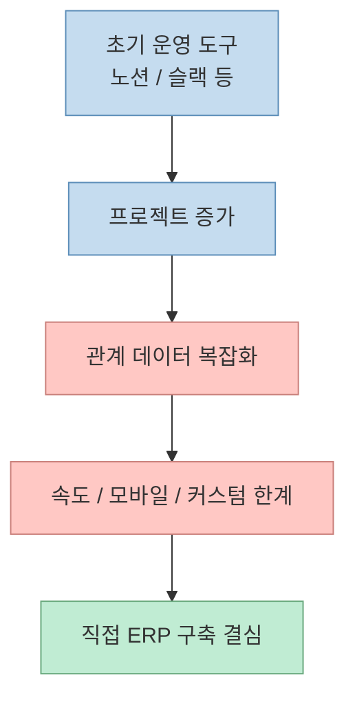
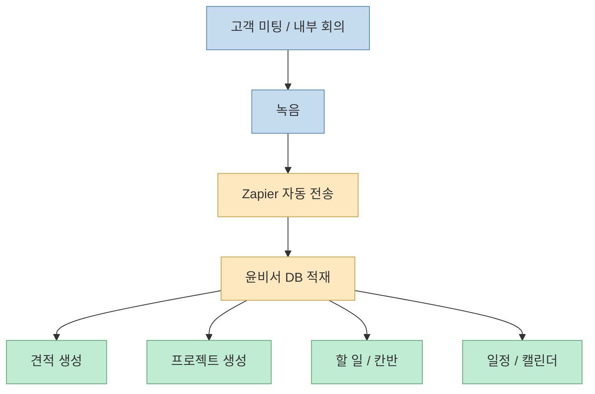
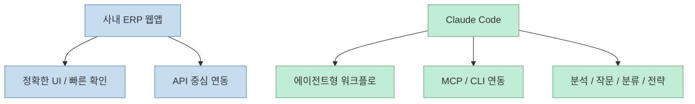
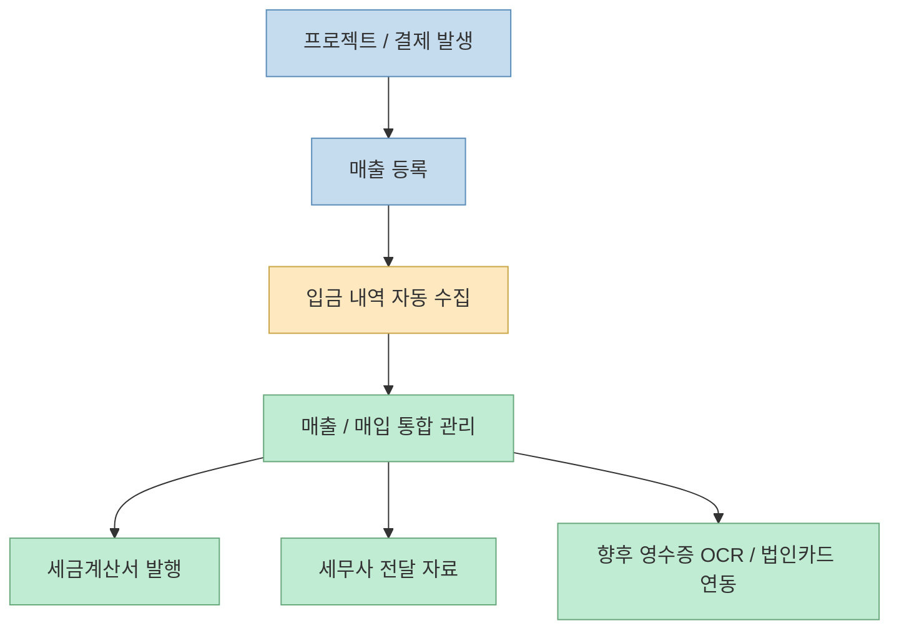
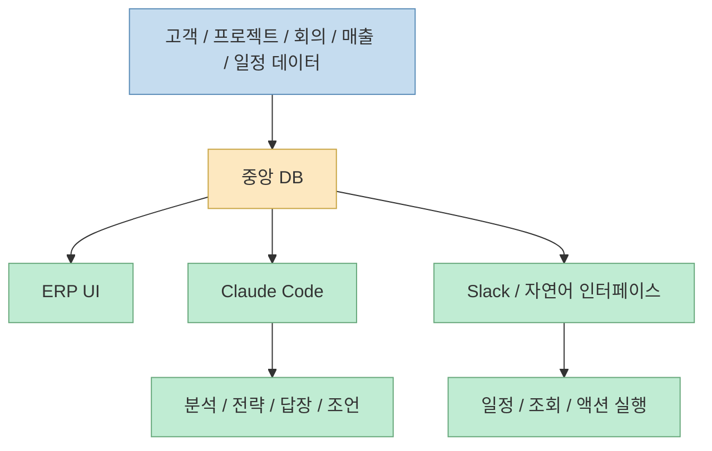

이 영상이 흥미로운 이유는 "회사 내부에 AI를 썼다"는 수준을 넘어서기 때문이다. 인터뷰에 등장하는 윤용승 대표는 사내 운영에 필요한 ERP 비슷한 시스템을 직접 만들고, 여기에 녹음 기록, 고객 정보, 프로젝트 상태, 매출, 세금계산서, 이메일, 일정 같은 데이터를 모은 뒤, `Claude Code`를 연결해 실질적인 **운영용 페어링 에이전트** 로 쓰고 있다고 설명한다.[영상 00:09](https://youtu.be/CVmbidt-3ro?t=9) [영상 15:03](https://youtu.be/CVmbidt-3ro?t=903)

핵심은 단순 자동화가 아니다. 이 시스템은 데이터가 한곳에 모일수록 더 강해진다. 프로젝트가 무엇인지, 고객이 누구인지, 어떤 미팅이 있었는지, 입금이 들어왔는지, 세금계산서가 발행됐는지, 다음 일정은 무엇인지가 같은 데이터베이스 맥락 안에 있기 때문에, AI는 단순 답변기가 아니라 **회사 운영 컨텍스트를 이해하는 에이전트** 로 바뀐다.[영상 32:15](https://youtu.be/CVmbidt-3ro?t=1935) [영상 33:14](https://youtu.be/CVmbidt-3ro?t=1994)

<!--more-->

## Sources

- 영상: [토스 PO 출신 대표가 사내 ERP와 AI 에이전트를 직접 만들고 AI 네이티브 컴퍼니로 거듭난 방법](https://youtu.be/CVmbidt-3ro?si=vOHyO-CQGy5-7KSA)

## 출발점은 "노션으로는 버티기 어려운 순간"이다

영상에서 대표는 처음부터 거대한 사내 시스템을 만들 생각은 아니었다고 말한다. 작은 기업 입장에서는 별도의 ERP를 구축하는 것이 너무 큰 일이라, 많은 회사가 그렇듯 노션 데이터베이스로 버텼다고 설명한다. 하지만 프로젝트가 많아지고 뷰가 늘고 관계형 데이터가 복잡해질수록:

- 노션이 느려지고
- 모바일에서 쓰기 어려워지고
- 익숙하지 않은 사람은 더 쓰기 힘들어지고
- 기성 제품 안에서 커스텀하려다 한계가 생긴다

는 문제가 나타났다고 한다.[영상 04:31](https://youtu.be/CVmbidt-3ro?t=271) [영상 07:30](https://youtu.be/CVmbidt-3ro?t=450)

그래서 나온 결론이 "요즘 AI 성능이 충분히 좋아졌으니, 불편한 부분을 회사에 맞는 제품으로 직접 만들어 써 보자"는 방향이었다.[영상 05:04](https://youtu.be/CVmbidt-3ro?t=304) [영상 05:16](https://youtu.be/CVmbidt-3ro?t=316)

즉 이 사례는 "AI로 SaaS를 대체했다"기보다, **기성 툴의 불편을 AI 바이브 코딩으로 점진적으로 메운 경우** 에 더 가깝다.

## 시스템 이름부터가 힌트다. ERP가 아니라 "윤비서"다

대표는 이 제품을 단순 ERP가 아니라 `윤비서`라고 부른다. 이유도 설명한다. 대기업 회장이나 사장처럼 비서가 있으면 업무가 훨씬 편할 텐데, 실제 사람 비서를 두기엔 비용과 현실이 맞지 않으니 **AI 비서를 만들자** 는 발상으로 출발했다는 것이다.[영상 05:54](https://youtu.be/CVmbidt-3ro?t=354) [영상 06:17](https://youtu.be/CVmbidt-3ro?t=377)

이 네이밍이 중요한 이유는, 이 시스템이 단순 CRUD 백오피스가 아니라:

- 프로젝트 관리
- 일정 관리
- 고객 관리
- 견적·계약·매출 관리
- AI 조언과 분석

까지 포괄하는 운영 동반자 역할을 지향하기 때문이다.

즉 "ERP"라는 이름은 저장과 관리에 가깝고, "비서"라는 이름은 **질문하고 위임하고 조언받는 인터페이스** 에 가깝다.

## 데이터가 자동으로 쌓이게 만드는 첫 번째 축은 "회의 녹음"이다

영상 초반에서 가장 인상적인 숫자는 150일 동안 700개가 넘는 녹음을 했다는 대목이다. 하루 평균 3.5시간씩 전 직원이 녹음을 하고 있고, 이 녹음이 끝날 때마다 Zapier를 통해 자동으로 `윤비서` 시스템으로 들어온다고 설명한다.[영상 08:20](https://youtu.be/CVmbidt-3ro?t=500) [영상 08:52](https://youtu.be/CVmbidt-3ro?t=532)

그리고 이 회의 기록은 그냥 보관만 되는 것이 아니라:

- 견적서 생성의 근거가 되고
- 계약 체결 시 프로젝트 생성으로 이어지고
- 할 일 관리와 칸반 보드로 연결되고
- 일정 및 캘린더 관리와 이어진다

즉 음성 기록이 "회의록 파일"에서 끝나지 않고, **업무 오브젝트를 생성하는 원천 데이터** 로 쓰인다.[영상 09:08](https://youtu.be/CVmbidt-3ro?t=548) [영상 09:21](https://youtu.be/CVmbidt-3ro?t=561)

이 구조가 중요한 이유는, 많은 회사가 회의를 녹음해도 그 정보가 실제 운영 데이터와 분리돼 있기 때문이다. 여기서는 반대로 **회의가 업무 데이터의 진입점** 이 된다.

## AI 바이브 코딩 덕분에 "모듈이 필요할 때마다 붙는 ERP"가 가능해졌다

대표는 메뉴 하나를 만드는 데 생각보다 큰 리소스가 들지 않고, 대부분 한 시간 정도면 기능 하나씩 붙일 수 있다고 말한다. 그래서 기능이 필요할 때마다 바로 만들고, 불편하면 바로 수정하는 식으로 운영했다고 설명한다. 결과적으로 메뉴가 20개 가까이 생겼지만, 전통적인 ERP 구축 프로젝트처럼 큰 선행 비용이 들지 않았다고 한다.[영상 09:48](https://youtu.be/CVmbidt-3ro?t=588) [영상 10:13](https://youtu.be/CVmbidt-3ro?t=613)

이 말은 곧 ERP를 "한 번에 완성하는 대형 시스템"이 아니라, **업무 요구가 생길 때마다 붙여 나가는 모듈형 운영체계** 로 볼 수 있게 됐다는 뜻이다.

예전에는:

- 요구사항 정의
- 외주/개발 착수
- 수주~수개월 구현
- 적용 후 다시 수정

순서가 필요했다면, 이 사례에서는 "바로 만들고 바로 써 보고 다시 다듬는" 루프가 가능해진다.

## 실제로는 홈페이지보다 API를 더 신뢰한다

중간 구간에서 인터뷰어가 Google Drive 연동이 API인지 MCP인지 묻자, 대표는 대부분 API를 사용한다고 답한다. 홈페이지에서는 완벽하게 작동해야 하므로 가능한 API를 쓰고, Claude Code 쪽에서는 MCP나 CLI를 활용한다고 설명한다. 구글 워크스페이스 CLI로 메일, 드라이브 등을 연결한다고도 말한다.[영상 14:00](https://youtu.be/CVmbidt-3ro?t=840) [영상 14:24](https://youtu.be/CVmbidt-3ro?t=864)

이 대목은 매우 실무적이다. 즉 이 회사는:

- ERP 웹앱은 API 중심의 안정적인 운영 인터페이스로 만들고
- `Claude Code`는 좀 더 에이전트적이고 가변적인 업무 자동화 층으로 둔다

는 식으로 역할을 분리하고 있다.

즉 모든 걸 채팅으로 처리하려는 게 아니라, **정형 업무는 ERP UI에서, 에이전트형 업무는 Claude Code에서** 푼다.

## `Claude Code`는 이 회사에서 "운영용 페어링 에이전트" 역할을 한다

영상에서 대표는 `Claude Code`에 `윤비서` DB, 메일, 드라이브 등 각종 시스템을 연결해 두었다고 설명한다. 그래서 `Claude Code`에게 사내 데이터베이스에 대한 질문을 하면, 마치 로컬 데이터처럼 필요한 데이터를 꺼내 와 조언하고 분석해 준다고 말한다.[영상 15:03](https://youtu.be/CVmbidt-3ro?t=903) [영상 15:10](https://youtu.be/CVmbidt-3ro?t=910)

이때 `Claude Code`가 담당하는 일은 화면형 ERP와 다르다. 대표가 직접 예로 드는 작업은:

- 이메일 자동 분류와 답장 초안
- 오늘/이번 주 일정 분석
- 매출 분석
- 다음 달 매출 2배 전략 제안
- 미팅 말투 분석
- 계약 실패 원인 분석

같은 것들이다.[영상 29:18](https://youtu.be/CVmbidt-3ro?t=1758) [영상 31:17](https://youtu.be/CVmbidt-3ro?t=1877) [영상 31:52](https://youtu.be/CVmbidt-3ro?t=1912)

즉 `Claude Code`는 CRUD를 대신하는 것이 아니라, **이미 쌓인 운영 데이터를 바탕으로 판단과 제안을 돕는 계층** 으로 쓰이고 있다.

## 매출·입금·세금계산서까지 붙는 순간, 이건 그냥 생산성 앱이 아니다

영상 후반에서 더 인상적인 부분은 매출과 회계 흐름이다. 아이엠웹 결제 데이터를 가져오고, 프로젝트별 매출을 합산하고, 은행 입금 푸시를 잡아 비서 API로 보내 입금 내역을 자동 등록한다고 설명한다. 나아가 법인카드, 영수증 OCR, 세무사 전달용 자료까지 염두에 둔 백로그도 언급한다.[영상 19:28](https://youtu.be/CVmbidt-3ro?t=1168) [영상 20:18](https://youtu.be/CVmbidt-3ro?t=1218) [영상 21:01](https://youtu.be/CVmbidt-3ro?t=1261)

특히 대표는 실제 세금계산서 발행도 이 시스템 안에서 한다고 말한다. 고객 정보와 공급자 정보를 자동으로 불러오고, 내용만 채우면 홈택스로 세금계산서가 자동 발행된다고 설명한다.[영상 21:47](https://youtu.be/CVmbidt-3ro?t=1307) [영상 22:15](https://youtu.be/CVmbidt-3ro?t=1335)

여기까지 오면 이 시스템은 단순한 업무 메모 앱이 아니라, **운영·영업·프로젝트·재무를 하나의 맥락으로 묶는 사내 운영체계** 가 된다.

## 슬랙과 자연어 인터페이스는 "AI 비서"라는 이름에 맞는 마지막 퍼즐이다

대표는 홈페이지에 들어가서 보는 것조차 귀찮아지는 순간이 있었고, 그래서 슬랙에 에이전트를 넣어 윤비서와 연결했다고 설명한다. 슬랙 스레드에서 "내일 저녁 8시 볼링 일정 추가해 줘" 같은 자연어 명령으로 일정 생성이 가능하다고 시연한다. 삭제는 민감하므로 추가 확인을 받도록 설정했다고도 말한다.[영상 25:48](https://youtu.be/CVmbidt-3ro?t=1548) [영상 26:57](https://youtu.be/CVmbidt-3ro?t=1617)

이건 작은 디테일 같지만 중요하다. ERP가 아무리 강해도 사용자가 매번 들어가서 클릭해야 하면 마찰이 생긴다. 반면 슬랙이나 채팅 환경으로 자연어 인터페이스가 나오면:

- 대화 중 바로 일정 추가
- 고객 데이터 조회
- 간단한 질의 응답

이 가능해진다.

즉 `윤비서`가 ERP이면서 동시에 비서처럼 느껴지게 만드는 요소는, 결국 **데이터베이스 위에 얹힌 자연어 인터페이스** 다.

## 영상이 말하는 "AI 네이티브 기업"의 핵심은 데이터 중앙집중화다

인터뷰 후반에서 진행자는 이 회사가 이미 AI 네이티브 기업처럼 보인다고 평가하면서, 핵심은 데이터 중앙집중화라고 정리한다. 대표도 바로 동의하면서 "데이터가 없으면 매번 말로 다시 설명해야 하고, 그 과정에서 컨텍스트가 누락된다"고 말한다. 반대로 모든 대화와 기록이 한곳에 들어 있으면, 에이전트가 훨씬 큰 도움을 줄 수 있다고 본다.[영상 32:15](https://youtu.be/CVmbidt-3ro?t=1935) [영상 33:14](https://youtu.be/CVmbidt-3ro?t=1994)

이 말은 이 영상의 핵심을 거의 다 요약한다. AI 네이티브 기업이란:

- 단순히 직원들이 ChatGPT를 쓰는 회사가 아니라
- 업무 데이터를 중앙에 모으고
- 그 위에 AI가 읽을 수 있는 구조를 만들고
- 질문·분석·전략 수립에 재사용하는 회사

라는 것이다.

그래서 이 사례의 본질은 "내부 툴을 잘 만들었다"가 아니라, **컨텍스트를 모아 AI가 일하게 할 수 있는 구조를 먼저 만들었다** 는 데 있다.

## 핵심 요약

- 이 영상의 핵심은 사내 ERP를 직접 만든 것보다, **그 ERP를 AI가 읽고 일할 수 있는 데이터 허브로 만들었다는 점** 이다.
- 출발점은 노션의 한계였고, AI 바이브 코딩 덕분에 필요한 기능을 모듈처럼 붙여 가며 시스템을 키웠다.
- 회의 녹음, 고객, 프로젝트, 일정, 매출, 입금, 세금계산서가 한 DB 맥락 안에 모인다.
- 정형 업무는 ERP UI와 API 중심으로 처리하고, 더 에이전트적인 일은 `Claude Code`에서 처리한다.
- 슬랙 같은 자연어 인터페이스는 이 시스템을 단순 ERP가 아니라 실제 "비서"처럼 느껴지게 만든다.
- 이 사례가 말하는 AI 네이티브 기업의 핵심은 **데이터 중앙집중화 + 에이전트 연결** 이다.

## 결론

이 영상은 "내부 툴도 AI로 만들 수 있다"는 수준에서 끝나지 않는다. 더 중요한 메시지는, **AI가 잘 일하게 하려면 먼저 회사 데이터를 모아야 한다** 는 것이다. 프로젝트, 고객, 회의, 매출, 일정이 흩어져 있으면 AI는 매번 다시 설명을 들어야 한다. 반대로 그것들이 하나의 운영 DB로 모이면, `Claude Code`는 단순 챗봇이 아니라 회사의 페어링 에이전트가 된다. 그래서 AI 네이티브 기업의 출발점은 거대한 모델 도입보다, **업무 컨텍스트를 한곳에 모으는 설계** 에 더 가까워 보인다.
