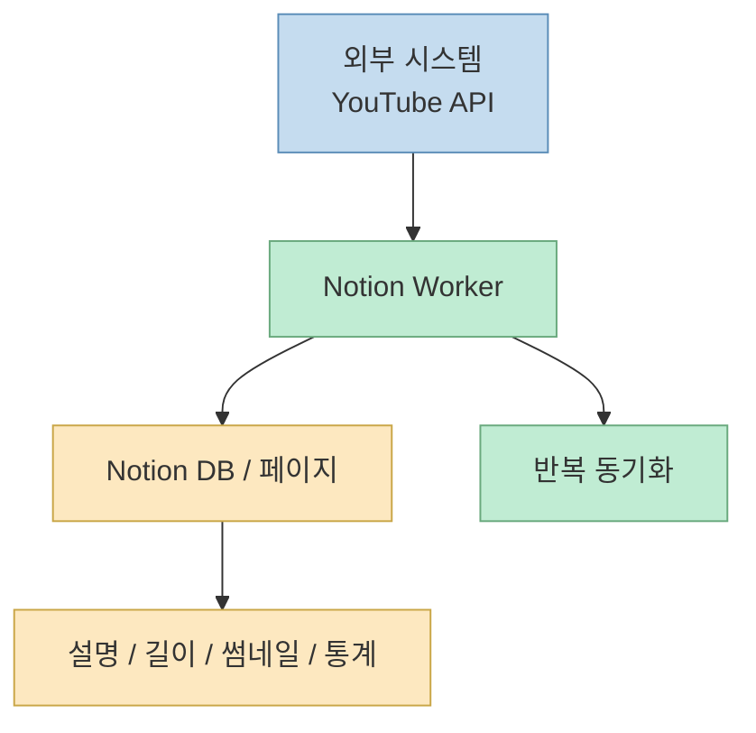
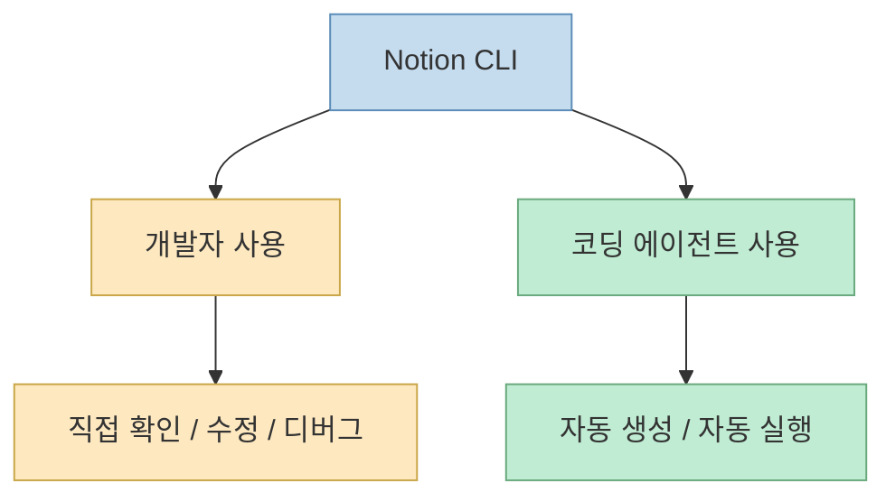
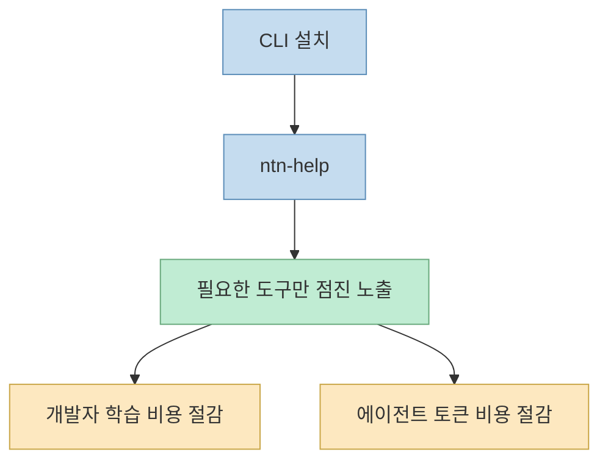
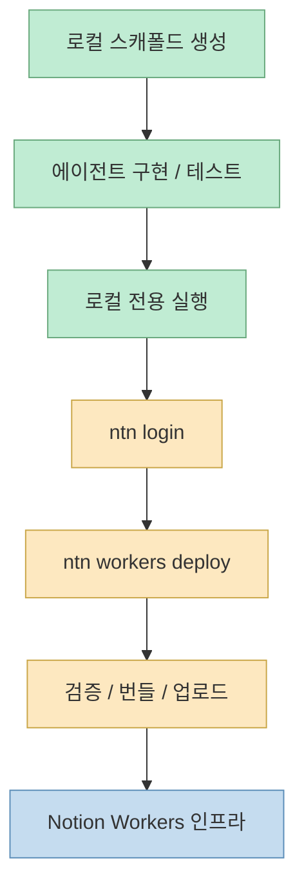

이 영상의 핵심은 `Notion CLI`가 단순히 "노션 API를 터미널에서 쓰게 해 주는 도구"가 아니라는 점이다. 인터뷰에 나온 Eric Goldman은 `Notion Workers`와 `Notion CLI`를 통해, 개발자나 빌더가 코딩 에이전트와 함께 특정 작업을 수행하는 워커를 만들고, 로컬에서 테스트하고, 안전하게 배포하는 흐름을 직접 시연한다.[영상 00:00](https://youtu.be/UXM74bsbfIA?t=0) [영상 00:25](https://youtu.be/UXM74bsbfIA?t=25)

즉 이 영상이 보여 주는 것은 "노션에 연결한다"가 아니라, **노션을 에이전트가 작업할 수 있는 실행 환경으로 확장하는 방법** 이다. 그리고 그 중심에 `CLI`를 둔 이유도 분명하다. 특정 에이전트 플러그인 하나에 묶이지 않고, 사람과 에이전트가 같은 도구 세트를 공유하면서, 누구든 워커의 상태를 이해하고 제어할 수 있게 하려는 것이다.[영상 14:21](https://youtu.be/UXM74bsbfIA?t=861) [영상 15:57](https://youtu.be/UXM74bsbfIA?t=957)

<!--more-->

## Sources

- 영상: [노션 CLI 이 영상 하나로 종결합니다. 무려 노션을 직접 만드는 분과 설명해드려요.](https://youtu.be/UXM74bsbfIA?si=ODvEIrnL-mJ6NGiZ)

## 영상이 보여 주는 데모는 "유튜브 통계 동기화 워커"다

영상 오프닝 데모에서 Eric은 `builder josh yt`라는 이름의 워커를 만들고, sync skill을 시작한 뒤, 최종적으로 `ntn workers deploy`를 실행한다. 그 결과 Notion 안에서 유튜브 비디오 설명, 길이, 썸네일, engagement 같은 통계가 동기화된 모습을 보여 준다. 이후 새 영상을 올릴 때마다 이 워커가 자동으로 잡아와 업로드해 줄 수 있다고 설명한다.[영상 00:02](https://youtu.be/UXM74bsbfIA?t=2) [영상 00:32](https://youtu.be/UXM74bsbfIA?t=32)

이 짧은 데모만 봐도 Workers의 정체가 드러난다.

- 특정 외부 시스템과 연결되고
- 데이터를 가져오고
- Notion 구조에 맞게 동기화하고
- 이후 반복적으로 유지되는

작은 실행 유닛이라는 것이다.

즉 Worker는 단순 webhook 함수보다, **Notion 안팎을 연결하는 작고 배포 가능한 자동화 단위** 에 가깝다.

## 왜 굳이 Workers를 만들었는가: "Notion은 허브지만 모든 정보의 출발지는 아니다"

영상 중간에서 Eric은 이전 회사 Sequin에서 대규모 데이터 동기화 시스템을 만들며, sync가 얼마나 자주 실패할 수 있는지 몸으로 배웠다고 말한다. 그리고 Notion은 많은 사람의 개인적·업무적 허브 역할을 하지만, 실제 정보의 원천은 Apple Watch, 다른 영화 플랫폼, 외부 앱 등 Notion 밖에 있다고 설명한다. 그래서 핵심은 모든 정보를 하나의 허브로 끌어와 조직할 수 있게 하는 개발자 도구를 만드는 것이었다는 것이다.[영상 05:28](https://youtu.be/UXM74bsbfIA?t=328) [영상 06:18](https://youtu.be/UXM74bsbfIA?t=378)

이 설명은 Workers를 이해하는 데 매우 중요하다. Workers는 Notion을 "모든 정보를 직접 생성하는 앱"으로 만드는 게 아니라, **다른 시스템에서 생긴 정보를 Notion으로 가져와 의미 있는 구조로 붙이는 통합 레이어** 다.

즉 Notion이 second brain이라면, Workers는 그 second brain으로 **신경망을 연결하는 시냅스** 같은 역할을 한다.

## Workers를 CLI로 낸 이유는 "에이전트 종속을 피하려는 전략"이다

영상에서 인터뷰어가 왜 Claude Code 플러그인이나 Codex 전용 통합이 아니라 독립적인 CLI를 택했는지 묻자, Eric은 꽤 명확하게 답한다. Notion은 특정 코딩 에이전트 하나에 자신을 과도하게 묶고 싶지 않았고, 사용자가 어떤 에이전트를 쓰든 같은 도구에 접근할 수 있어야 한다고 본 것이다.[영상 14:03](https://youtu.be/UXM74bsbfIA?t=843) [영상 14:42](https://youtu.be/UXM74bsbfIA?t=882)

그는 더 나아가, 개발자는 에이전트가 할 수 있는 일을 직접도 할 수 있어야 한다고 말한다. 만약 에이전트만 워크스페이스를 바꿀 수 있고 사람은 그 도구를 못 쓴다면:

- 무슨 일이 일어났는지 이해하기 어렵고
- 문제를 고치기 어렵고
- 다른 개발자와 공유 가능한 운영 지식으로 만들기 어렵다

는 것이다.[영상 14:55](https://youtu.be/UXM74bsbfIA?t=895) [영상 15:09](https://youtu.be/UXM74bsbfIA?t=909)

그래서 CLI는 단순한 구현 선택이 아니라, **사람과 에이전트가 같은 실행 표면을 공유해야 한다는 철학** 의 결과다.

## CLI는 "공통 인터페이스"이면서 동시에 progressive disclosure를 구현하는 장치다

영상 후반에서 Eric은 CLI 설치 후 `ntn-help`를 실행하면 사용 가능한 도구와 기능 목록을 점진적으로 볼 수 있다고 설명한다. 그는 이를 progressive disclosure라고 부르고, 이 방식이 개발자 학습에도 좋고 에이전트가 필요한 만큼만 툴 정보를 읽게 하는 데도 효율적이라고 말한다.[영상 21:00](https://youtu.be/UXM74bsbfIA?t=1260) [영상 22:01](https://youtu.be/UXM74bsbfIA?t=1321)

이 설계는 최근 에이전트 도구들이 공유하는 흐름과도 같다. 모든 툴을 한 번에 노출하면:

- 사람이 복잡해서 배우기 어렵고
- 에이전트는 컨텍스트 창을 낭비하고
- 사용 가능한 능력을 파악하는 데도 비용이 커진다

반면 progressive disclosure는 필요한 순간에 필요한 능력만 펼치게 한다.

즉 Notion CLI는 도구 집합일 뿐 아니라, **에이전트 친화적인 학습 인터페이스** 이기도 하다.

## 워커 생성 흐름은 "코드 템플릿 + 스킬 + 에이전트"의 조합이다

영상에서 `ntn workers new`를 실행하면 새 워커 템플릿이 생성되고, git 초기화와 의존성 설치를 거쳐 로컬에 스캐폴드가 만들어진다. 이후 Eric은 직접 파일을 읽고 고치기보다, 코딩 에이전트를 켜서 sync skill을 실행한다. 이 워커에는 필요한 스킬이 기본 내장돼 있고, 에이전트는 그 스킬을 통해 어떻게 동기화를 구현할지 배운다고 설명한다.[영상 22:36](https://youtu.be/UXM74bsbfIA?t=1356) [영상 24:44](https://youtu.be/UXM74bsbfIA?t=1484)

이 구조는 매우 현대적이다.

- 템플릿이 기본 구조를 주고
- 스킬이 작업 절차를 가르치고
- 코딩 에이전트가 세부 구현을 채운다

즉 워커 개발은 순수 수작업이 아니라, **사람이 방향을 주고 에이전트가 코드를 완성하는 협업형 생성 과정** 으로 설계돼 있다.

## 배포 전에는 철저히 로컬과 샌드박스에 가둔다

영상에서 Eric은 중요한 점을 여러 번 강조한다. 워커 생성과 테스트 단계에서 모든 코드는 로컬 머신 위에서만 돌아가며, Notion 워크스페이스를 직접 망가뜨리지 않는 통제된 환경이라는 것이다. 코딩 에이전트도 skip permissions 모드로 효율적으로 돌릴 수 있지만, 그 전제가 되는 것은 이미 이 개발 공간이 안전한 범위로 제한되어 있다는 점이다.[영상 24:14](https://youtu.be/UXM74bsbfIA?t=1454) [영상 29:32](https://youtu.be/UXM74bsbfIA?t=1772)

이후 배포 단계에 들어가면:

- 올바른 워크스페이스에 로그인하고
- `ntn workers deploy`로 다시 검증하고
- 코드가 안전한지 확인하고
- 번들링해 Workers 인프라로 올린다

는 흐름을 거친다.[영상 29:06](https://youtu.be/UXM74bsbfIA?t=1746) [영상 30:25](https://youtu.be/UXM74bsbfIA?t=1825)

이 설계는 "바로 실서버에 붙는 바이브 코딩"이 아니라, **로컬 생성 → 검증 → 통제된 배포** 라는 전통적인 소프트웨어 안전장치를 유지한다.

## 배포 후 서버 운영은 Notion이 대신 맡는다

배포 구간에서 Eric은 개발자가 별도의 서버를 직접 만들거나 관리할 필요가 없다고 설명한다. 배포 시 Notion이 코드를 검증하고, 실행 파일로 번들링하고, 자사 Workers 인프라에 업로드한다. 즉 빌더는 워커의 로직만 신경 쓰고, 실행 환경의 신뢰성과 가동성은 Notion이 책임지는 구조다.[영상 30:30](https://youtu.be/UXM74bsbfIA?t=1830) [영상 30:46](https://youtu.be/UXM74bsbfIA?t=1846)

이건 매우 중요하다. 많은 에이전트 자동화가 강력해 보이지만, 실제 운영에서 걸림돌은:

- 서버 배포
- 런타임 안정성
- 비밀값 관리
- 장애 대응

같은 인프라 운영이다. Workers는 이 부담을 플랫폼 쪽으로 밀어내면서, 빌더가 **작은 자동화 유닛을 더 쉽게 배포 가능하게** 만든다.

## 샌드박스 철학은 "코드는 악의적일 수도 있다"는 가정에서 출발한다

영상 말미에서 Eric은 보안 철학을 아주 직접적으로 설명한다. 에이전트가 작성한 코드를 신뢰하지 않고, 악의적일 수도 있다고 가정하며 샌드박스에 넣는다고 말한다. 샌드박스란 단순 격리가 아니라:

- 즉시 중지 가능하고
- 통제할 수 없는 외부 시스템에 임의 연결할 수 없고
- 비밀번호나 민감 정보에 무단 접근할 수 없도록

구성된 환경을 뜻한다는 것이다.[영상 41:01](https://youtu.be/UXM74bsbfIA?t=2461) [영상 41:32](https://youtu.be/UXM74bsbfIA?t=2492)

이 철학은 AI 에이전트 시대에 특히 중요하다. "에이전트가 코드를 쓸 수 있다"는 것과 "그 코드를 안전하게 실행할 수 있다"는 것은 완전히 다른 문제이기 때문이다. Notion Workers는 후자, 즉 **에이전트 코드의 거버넌스와 런타임 안전성** 을 플랫폼 레벨에서 풀려는 시도로 보인다.

## 결국 Notion CLI는 빌더 플랫폼과 에이전트 플랫폼의 경계에서 나온다

영상 전체를 관통하는 메시지는 일관된다. Eric은 여러 번 "개발자가 아니어도", "빌더가", "에이전트와 함께" 같은 표현을 쓴다. 이는 Notion이 Workers와 CLI를 통해 겨냥하는 대상이 순수 백엔드 엔지니어만이 아니라는 뜻이다.[영상 05:03](https://youtu.be/UXM74bsbfIA?t=303) [영상 13:28](https://youtu.be/UXM74bsbfIA?t=808)

이 플랫폼은 다음 세 가지를 동시에 겨냥한다.

- Notion 안팎의 데이터를 연결하고 싶은 빌더
- 코딩 에이전트와 함께 통합 워커를 만들고 싶은 개발자
- 특정 에이전트에 종속되지 않는 공용 실행 인터페이스를 원하는 팀

즉 `Notion CLI`는 단순한 제품 리드 인터뷰가 아니라, **Notion을 문서 앱에서 에이전트 실행 플랫폼으로 확장하는 방향성** 을 보여 준다.

## 핵심 요약

- 이 영상의 핵심은 `Notion CLI`가 API wrapper가 아니라 **사람과 에이전트가 함께 Worker를 만들고 배포하는 공통 인터페이스** 라는 점이다.
- Workers는 외부 시스템의 데이터를 Notion으로 가져와 구조화하는 작은 실행 유닛이다.
- CLI를 택한 이유는 특정 에이전트 종속을 피하고, 개발자와 에이전트가 같은 도구를 공유하게 하기 위해서다.
- progressive disclosure는 개발자 학습성과 에이전트 토큰 효율을 동시에 겨냥한 설계다.
- 생성된 워커는 로컬에서 구현·테스트한 뒤, 검증과 번들링을 거쳐 Notion Workers 인프라에 안전하게 배포된다.
- 샌드박스와 거버넌스는 "에이전트가 쓴 코드를 신뢰하지 않는다"는 현실적인 가정에서 출발한다.

## 결론

`Notion CLI`의 진짜 의미는 "노션도 터미널에서 다룰 수 있다"는 데 있지 않다. 더 본질적으로는, **Notion을 에이전트가 읽고 쓰고 배포할 수 있는 실행 플랫폼으로 바꾸는 공용 인터페이스** 를 제공한다는 데 있다. 그래서 이 영상은 CLI 사용법 튜토리얼이면서 동시에, 앞으로의 빌더 플랫폼이 어떤 방향으로 가는지 보여 주는 사례이기도 하다. 사람이 직접 쓰는 도구와 에이전트가 쓰는 도구가 분리되지 않고, 같은 CLI와 같은 워커 템플릿과 같은 배포 파이프라인을 공유하는 구조 말이다.
