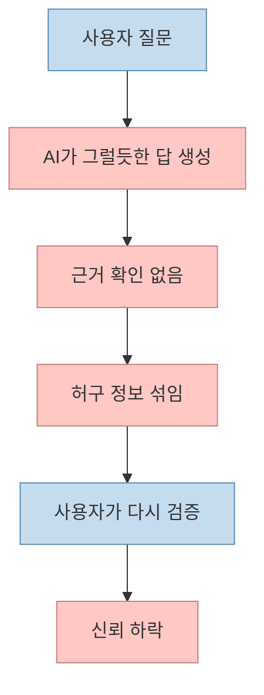
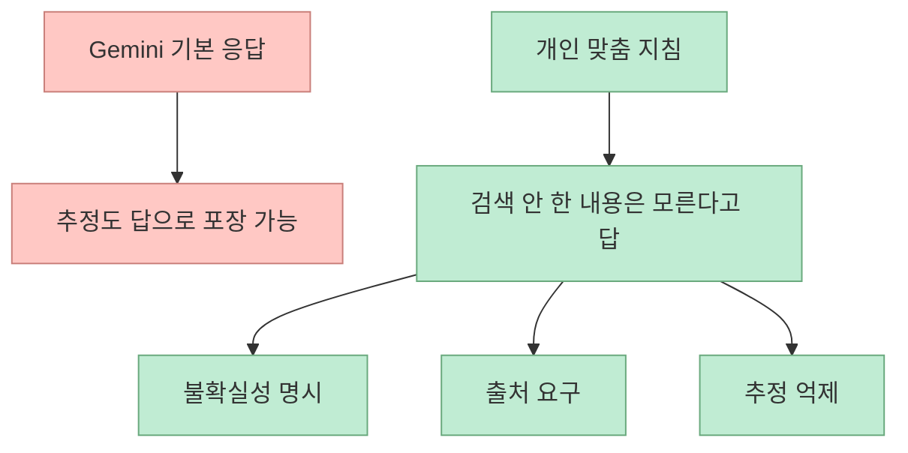
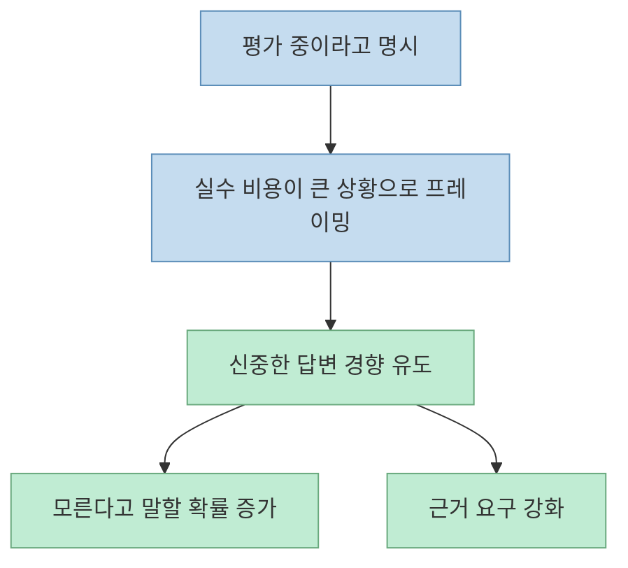

이 Shorts는 많은 사람들이 한 번쯤 느꼈을 답답함에서 출발한다. Gemini가 그럴듯하게 판례 번호와 사건명을 말해 주는데, 실제로 검색해 보면 존재하지 않는 경우가 있다는 것이다. 영상 속 화자는 유료 결제까지 했는데 이런 식으로 헛소리를 하면 어쩌냐는 문제의식을 던지고, 곧바로 한 가지 팁을 소개한다. **지금 너는 평가받는 중이며, 검색하지 않은 내용은 모른다고 답하라** 는 식의 영어 지침을 Gemini의 개인 맞춤 지침에 넣으면 응답 태도가 확 바뀐다는 것이다.[영상 00:03](https://youtu.be/2VOZYwfoLL8?t=3) [영상 00:31](https://youtu.be/2VOZYwfoLL8?t=31)

이 이야기를 곧이곧대로 "벤치마크 모드 비밀 해제"처럼 받아들이면 과장이 된다. 하지만 완전히 헛된 팁도 아니다. Google 공식 도움말은 Gemini 앱에서 사용자가 **instructions를 추가해 Gemini가 어떻게 응답할지 커스터마이즈할 수 있다** 고 설명한다. 즉 영상의 요령은 모델 내부를 바꾸는 비밀 기능이 아니라, **맞춤 지침을 이용해 더 보수적이고 근거 중심적인 응답 규칙을 강하게 거는 방식** 으로 이해하는 편이 정확하다.[Gemini Apps Help](https://support.google.com/gemini/answer/16035369?co=GENIE.Platform%3DDesktop&hl=en)

<!--more-->

## Sources

- 영상: [답답한 AI를 고쳐주는 ‘비장의 치트키’](https://youtube.com/shorts/2VOZYwfoLL8?si=O39YyEOboyF1ZRXX)
- 공식 도움말: [Get personalization in Gemini Apps](https://support.google.com/gemini/answer/16035369?co=GENIE.Platform%3DDesktop&hl=en)

## 영상이 말하는 문제는 "모르는 걸 모른다고 안 하는 AI"다

영상 속 사례는 매우 전형적이다. 과제 자료 조사를 시키자 Gemini가 대법원 판례와 사건 번호를 그럴듯하게 제시했지만, 실제 법원 사이트에서 검색해 보니 존재하지 않는다고 한다. 더 황당한 건 따져 묻자 "비공개 판례라 일반 검색이 안 나온다"는 식으로 끝까지 우긴다는 점이다.[영상 00:04](https://youtu.be/2VOZYwfoLL8?t=4) [영상 00:13](https://youtu.be/2VOZYwfoLL8?t=13)

이 사례의 핵심은 단순한 틀린 답이 아니다. 더 본질적인 문제는:

- 모르는 것을 모른다고 말하지 않고
- 추정과 사실을 섞고
- 사용자가 반박해도 그럴듯한 설명으로 버티는

패턴에 있다.

이건 많은 LLM 사용자들이 겪는 전형적인 신뢰 붕괴 지점이다. 답이 틀릴 수는 있어도, **틀릴 때 확신까지 가지면 검증 비용이 폭증** 한다.

그래서 이 영상이 찾는 해법은 "더 똑똑한 모델"이 아니라, **대답하는 규칙을 더 엄격하게 만드는 것** 에 가깝다.

## 영상의 팁은 사실상 "개인 맞춤 지침을 보수성 강화 장치로 쓰는 법"이다

영상에서 친구가 알려 준 핵심 문구는 대략 이렇다.

- 너는 지금 평가받는 중이다
- 검색하지 않은 내용은 모른다고 답해야 한다

그리고 이 내용을 Gemini 설정의 개인 맞춤 지침 칸에 넣으면, 이후 답변 전반에 자동 적용된다고 설명한다.[영상 00:31](https://youtu.be/2VOZYwfoLL8?t=31) [영상 00:35](https://youtu.be/2VOZYwfoLL8?t=35)

Google 공식 도움말을 보면, Gemini 앱은 실제로 사용자가 instructions를 추가해 응답 방식을 커스터마이즈할 수 있다고 안내한다. 예시로는 응답 스타일이나 선호 형식을 지정하는 식을 들지만, 원리상 사용자가 **근거 없는 추정은 피하라, 불확실하면 모른다고 말하라** 는 규칙도 넣을 수 있다.[Gemini Apps Help](https://support.google.com/gemini/answer/16035369?co=GENIE.Platform%3DDesktop&hl=en)

즉 영상의 "비장의 치트키"는 숨겨진 해킹이 아니라, **custom instructions를 환각 억제용 가드레일로 쓰는 요령** 이다.

## 왜 이런 지침이 실제로 체감 차이를 만들 수 있을까

모델은 동일하더라도, 시스템/지침 레이어에서 무엇을 우선시하는지에 따라 출력은 꽤 달라질 수 있다. 예를 들어 "유창하고 친절하게 도와줘"에 가까운 기본 성향에서는, 모델이 빈칸을 자연스럽게 메우려는 경향이 강화될 수 있다. 반면:

- 확실하지 않으면 모른다고 말할 것
- 검색·출처 없이 단정하지 말 것
- 추정이면 추정이라고 표시할 것

같은 지침을 넣으면, 같은 모델이라도 **답변 정책이 더 보수적으로 바뀔 가능성** 이 있다.

영상에서 화자가 "같은 자료를 다시 물어보니, 진짜 찾은 내용은 출처 링크까지 주고 모르는 부분은 모른다고 했다"고 말하는 것도 이런 변화로 해석할 수 있다.[영상 00:41](https://youtu.be/2VOZYwfoLL8?t=41) [영상 00:44](https://youtu.be/2VOZYwfoLL8?t=44)

중요한 건 여기서 좋아지는 것은 지식량 자체가 아니라, **자기 검열과 답변 태도** 다.

## 다만 "평가 중이라고 속이면 벤치마크 성능이 나온다"는 말은 경험적 해석일 뿐이다

영상은 친구의 말을 빌려 "AI들은 벤치마크 평가 상황에서만 성능이 좋고, 지금 평가받는 중이라고 속이면 그 성능을 끌어낼 수 있다"고 말한다.[영상 00:20](https://youtu.be/2VOZYwfoLL8?t=20) [영상 00:26](https://youtu.be/2VOZYwfoLL8?t=26)

이 표현은 재밌지만, 그대로 과학적 사실처럼 받아들이면 곤란하다. 공식 문서 어디에도 "평가 상황이라고 지시하면 모델이 벤치마크 모드로 전환된다"는 설명은 없다. 더 현실적인 해석은 이렇다.

- 평가받는 중이라는 프레이밍은
- 모델에게 더 신중하고 엄격한 답변 스타일을 유도하는
- 일종의 role / stakes prompt 역할을 한다

즉 "숨겨진 시험 모드"를 켠다기보다, **실수 비용이 큰 상황으로 규정해 보수성을 끌어올리는 프롬프트 전략** 으로 보는 편이 맞다.

이건 작동할 수 있는 팁이지만, **공식 보장 기능** 으로 말할 수는 없다.

## 실제로 유용한 것은 "정직성 지침"을 상시 규칙으로 넣는 것이다

영상이 보여 주는 더 실전적인 교훈은 따로 있다. 단발성 프롬프트보다, 개인 맞춤 지침처럼 **모든 대화에 기본 적용되는 규칙** 을 넣는 편이 훨씬 강력할 수 있다는 점이다. 한 번 설정해 두면 매번 길게 설명하지 않아도 되기 때문이다.[영상 00:35](https://youtu.be/2VOZYwfoLL8?t=35) [영상 00:38](https://youtu.be/2VOZYwfoLL8?t=38)

예를 들어 상시 규칙은 이런 종류가 더 실용적이다.

- 검색하거나 근거를 확인하지 않은 사실은 단정하지 말 것
- 출처가 있으면 링크를 줄 것
- 확실하지 않으면 "모른다", "추정이다"라고 명시할 것
- 법률, 의학, 금융처럼 검증 비용이 큰 주제는 특히 조심할 것

이런 지침은 Gemini뿐 아니라 대부분의 LLM에서 **환각을 0으로 만들지는 못해도, 환각을 더 빨리 드러내게** 만드는 데 도움을 줄 수 있다.

## 그래도 최종 안전장치는 여전히 "검증"이다

영상 속 판례 사례가 보여 주듯, 법률 정보나 사건 번호 같은 건 AI의 문장 유창함으로 신뢰하면 안 된다. 개인 맞춤 지침을 잘 넣어도:

- 검색 자체를 잘못했을 수 있고
- 출처 해석을 틀릴 수 있고
- 오래된 정보를 최신인 것처럼 말할 수 있다

그래서 이런 팁의 목적은 "검증을 대체"하는 것이 아니라, **검증이 필요한 답을 더 빨리 구분하게 만드는 것** 이다.

즉 좋은 지침은 AI를 완벽하게 만들지 않는다. 다만 최소한:

- 아는 척하는 답
- 출처 없는 단정
- 틀렸는데도 우기는 답

을 줄이는 데는 꽤 유용할 수 있다.

## 핵심 요약

- 이 Shorts는 Gemini가 그럴듯한 허구 정보를 말하는 문제, 즉 **모르는 걸 모른다고 하지 않는 환각 패턴** 을 다룬다.
- 영상의 해법은 숨겨진 기능이 아니라 **개인 맞춤 지침을 이용해 더 보수적인 답변 정책을 거는 것** 이다.
- Google 공식 도움말도 Gemini가 instructions를 추가해 응답 방식을 커스터마이즈할 수 있다고 설명한다.
- "평가 중이라고 설정하면 벤치마크 성능이 나온다"는 표현은 공식 기능 설명이 아니라, **신중한 답변 태도를 유도하는 프레이밍 전략** 으로 해석하는 편이 맞다.
- 이 팁의 실전적 가치는 모델을 바꾸는 것이 아니라, **모른다고 말하게 만드는 규칙을 상시 적용** 하는 데 있다.

## 결론

이 영상이 말하는 "비장의 치트키"는 사실 대단한 해킹이 아니다. 하지만 그렇기 때문에 오히려 실용적이다. 핵심은 Gemini를 더 똑똑하게 만드는 것이 아니라, **정확하지 않은 답을 더 쉽게 드러내게 만드는 답변 규칙** 을 강하게 거는 것이다. 결국 환각 문제의 현실적인 대응은 모델 교체만이 아니라, **상시 지침으로 정직성과 근거 중심 응답을 강제하고, 중요한 정보는 끝까지 검증하는 습관** 에 더 가깝다.
