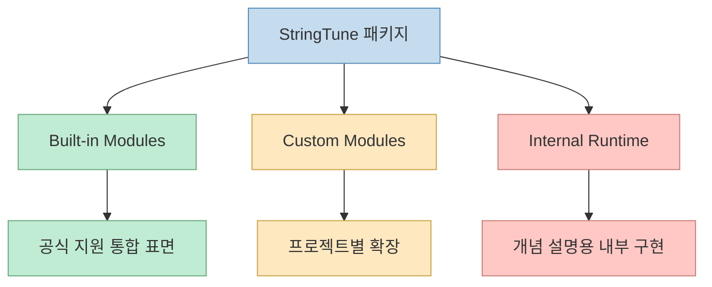
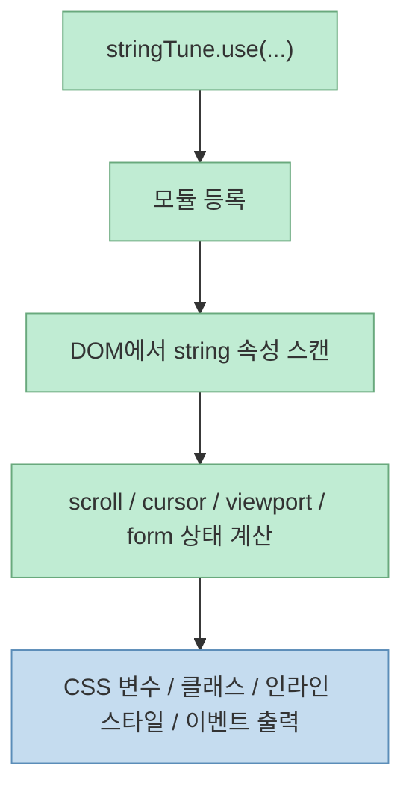
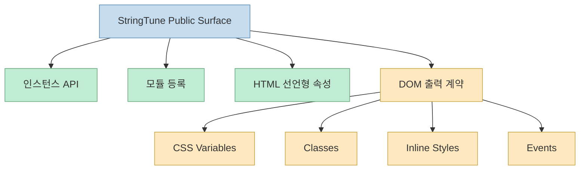
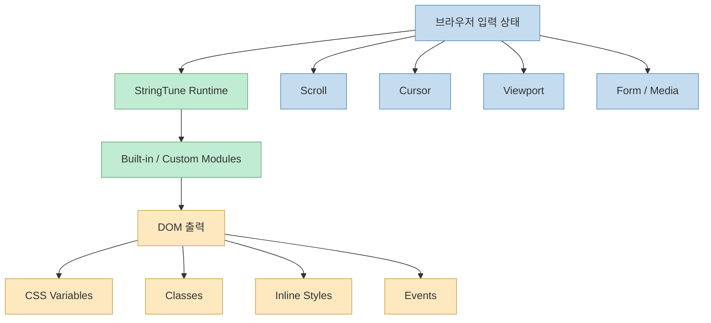

`StringTune` 문서를 처음 보면 `StringProgress`, `StringCursor`, `StringParallax`, `StringLoading` 같은 모듈 이름이 먼저 눈에 들어온다. 그래서 얼핏 보면 스크롤 이펙트나 커서 효과를 여러 개 묶어 놓은 프런트엔드 라이브러리처럼 보이기 쉽다. 하지만 공식 `Overview` 문서가 가장 먼저 강조하는 건 정반대다. **StringTune은 서로 unrelated한 효과 묶음이 아니라, 하나의 런타임 인스턴스 위에 모듈을 등록해서 DOM을 스캔하고 상태를 계산하고 다시 DOM에 출력하는 시스템** 이라는 점이다.[StringTune Docs](https://tune.fiddle.digital/docs/overview/)

이 관점은 중요하다. 효과 라이브러리로 보면 "어떤 애니메이션을 쓸 수 있나"가 중심이 되지만, 런타임으로 보면 "상태를 어떻게 계산하고 어떤 계약으로 출력하나"가 중심이 된다. 공식 문서도 바로 그 구조를 핵심으로 소개한다. StringTune은 scroll-driven motion, cursor interaction, responsive visibility, media helpers, diagnostics를 위한 **modular runtime** 이고, public surface는 package export가 유일한 진실원이라고 못 박는다.[StringTune Docs](https://tune.fiddle.digital/docs/overview/)

<!--more-->

## Sources

- 공식 문서: [Overview | StringTune Docs](https://tune.fiddle.digital/docs/overview/)
- npm: [@fiddle-digital/string-tune](https://www.npmjs.com/package/@fiddle-digital/string-tune)
- 데모: [tune-demo.fiddle.digital](https://tune-demo.fiddle.digital)

## 공식 문서가 가장 먼저 선을 긋는 부분은 "패키지가 진실원"이라는 점이다

개요 문서는 먼저 docs 정책부터 설명한다. 오래된 코드 조각, 복사된 예제, 내부 프로젝트 모듈과 현재 패키지 동작이 다르면 **패키지 export가 이긴다** 고 말한다. 이는 라이브러리 문서에서 꽤 중요한 선언이다. 왜냐하면 이 프로젝트는 내부 런타임, 커스텀 모듈, 공식 내장 모듈이 섞여 있기 때문에, 사용자는 "어디까지가 공식 계약인지"를 혼동하기 쉽기 때문이다.[StringTune Docs](https://tune.fiddle.digital/docs/overview/)

그래서 문서는 처음부터 세 가지 경계를 나눈다.

- built-in modules
- custom modules
- internal runtime

즉 이 문서는 "이펙트 showcase"보다 **공식 통합 표면과 내부 구현의 경계를 분명히 하는 문서** 쪽에 더 가깝다.

이 구분이 있어야 사용자는 "지금 내가 쓰는 것이 공식 API인지, 특정 제품 코드에만 있는 예시인지"를 판단할 수 있다.

## StringTune의 핵심은 "모듈 등록 → DOM 스캔 → 상태 계산 → 출력"이라는 런타임 루프다

문서가 설명하는 런타임 모델은 아주 명확하다. StringTune은 하나의 런타임 인스턴스로서:

- 모듈을 등록하고
- DOM에서 해당 모듈이 붙은 오브젝트를 스캔하고
- 프레임 업데이트마다 geometry와 state를 계산하고
- 결과를 다시 DOM으로 쓴다

고 설명한다.[StringTune Docs](https://tune.fiddle.digital/docs/overview/)

또 모듈 계약도 네 단계로 요약한다.

1. `stringTune.use(...)`로 모듈을 활성화한다
2. `string="..."` 등의 속성으로 엘리먼트를 설정한다
3. 런타임이 scroll, cursor, viewport, form input으로부터 상태를 계산한다
4. 모듈이 CSS 변수, 클래스, inline transform, helper node, event로 상태를 출력한다

이 설명만 보면 StringTune은 애니메이션 라이브러리라기보다, **상태 계산 엔진 + 선언형 어댑터 + DOM 출력 시스템** 에 더 가깝다.

즉 사용자는 "효과 함수를 직접 호출"하기보다, 런타임에 모듈을 붙이고 마크업에 선언한 뒤, 결과를 CSS나 JS에서 소비하는 흐름을 따른다.

## 그래서 이 라이브러리의 public surface는 네 가지로 요약된다

문서는 사용자 관점에서 대부분의 동작이 아래 네 가지 중 하나라고 정리한다.

- `StringTune` 인스턴스 API
- `stringTune.use(...)`를 통한 모듈 등록
- HTML의 선언형 속성
- CSS 변수, 클래스, 인라인 스타일, 이벤트 형태의 출력

이 네 가지는 StringTune의 설계 방향을 잘 보여 준다. 즉 이 라이브러리는:

- 전부 JS에서 imperative하게 조작하는 방식도 아니고
- 전부 마크업만으로 끝나는 no-code 스타일도 아니며
- 런타임 API와 선언형 마크업을 함께 쓰는 혼합형 구조

로 설계돼 있다.[StringTune Docs](https://tune.fiddle.digital/docs/overview/)

이렇게 보면 StringTune의 핵심 UX는 "JS에서 모든 걸 계산해 주는 black box"가 아니라, **런타임과 스타일 계층이 계약으로 연결된 구조** 라고 이해하는 편이 맞다.

## 공식 문서가 모듈을 built-in, custom, internal로 나누는 이유

Overview 문서는 built-in module과 custom module을 일부러 분리해 문서화한다고 적는다. 이는 StringTune이 단순히 패키지 export만 있는 라이브러리가 아니라, 실제 프로젝트 코드베이스에서 **공식 모듈 위에 사내/프로젝트 특화 모듈을 쌓는 방식** 도 의도하고 있음을 보여 준다.[StringTune Docs](https://tune.fiddle.digital/docs/overview/)

문서가 드는 built-in 예시는:

- `StringProgress`
- `StringCursor`
- `StringResponsive`
- `StringLoading`

같은 것들이다.

반면 custom module은 어떤 제품 코드베이스에서는 유효할 수 있지만, 패키지에서 export되지 않는 한 공식 계약은 아니라고 선을 긋는다. internal runtime 역시 동작 설명에는 등장할 수 있지만 public API는 아니다.

이 구조를 뒤집어 말하면 StringTune은 **라이브러리이면서 동시에 확장 프레임워크** 처럼 설계된 셈이다.

## 통합 패턴이 매우 일관적이라는 점이 중요하다

문서에 실린 핵심 예시는 매우 짧다.

- `StringTune.getInstance()`로 싱글 인스턴스를 가져오고
- `StringProgress`, `StringCursor` 같은 모듈을 `use`로 등록하고
- `start(60)`으로 런타임을 시작하고
- HTML에는 `

` 같은 속성을 붙인다

즉 모듈이 무엇이든, 기본 통합 패턴은 거의 변하지 않는다. 문서도 이를 "That pattern stays the same across the library"라고 설명한다.[StringTune Docs](https://tune.fiddle.digital/docs/overview/)

이 일관성은 실제로 중요하다. 스크롤, 커서, 미디어, 폼, 진단 도구가 전부 제각각 API를 갖고 있으면 프로젝트 규모가 커질수록 학습 비용이 커진다. StringTune은 이를 **런타임 규약 하나로 통일** 하려는 쪽에 가깝다.

## 이 문서가 최적화하는 것은 "스토리텔링"보다 "빠른 조회"다

개요 문서 마지막에는 이 docs 사이트가 무엇을 최적화하는지도 직접 적는다.

- 빠른 조회
- 정확한 API와 런타임 동작
- 실제 코드와 맞는 예제
- 공식/커스텀/내부 동작의 명시적 경계

즉 이 문서는 장문의 튜토리얼보다 **정확한 참조 문서와 운영 규약** 을 우선시한다.[StringTune Docs](https://tune.fiddle.digital/docs/overview/)

이 방향성은 StringTune이라는 제품 성격과도 잘 맞는다. 개별 애니메이션 하나를 만드는 장난감보다, 많은 모듈이 한 런타임 인스턴스 위에서 같이 돌아가는 시스템이라면 사용자는 "멋진 데모"보다 **무엇이 공식 동작이고 무엇이 아닌지** 를 더 자주 확인하게 되기 때문이다.

## 그래서 StringTune은 "효과 라이브러리"라기보다 "브라우저 상태-출력 파이프라인"으로 보는 편이 낫다

문서에 따르면 StringTune은 scroll-driven motion, cursor interaction, responsive visibility, media helper, diagnostics를 모두 같은 런타임 위에서 다룬다. 이걸 하나로 보면 결국 StringTune은:

- 브라우저 입력 상태를 읽고
- 공통 런타임에서 계산하고
- 선언형으로 붙은 DOM 객체에
- 일관된 계약으로 다시 출력하는

시스템이다.

이렇게 보면 StringTune을 제대로 쓰는 핵심은 "효과를 많이 아는 것"보다, **런타임 계약을 이해하고 모듈 출력이 CSS/JS와 어떻게 연결되는지 아는 것** 에 더 가깝다.

## 핵심 요약

- 공식 문서 기준으로 StringTune은 효과 모음집이 아니라 **하나의 런타임 인스턴스 위에 모듈을 올리는 시스템** 이다.
- 핵심 루프는 모듈 등록 → DOM 스캔 → 상태 계산 → DOM 출력이다.
- public surface는 인스턴스 API, 모듈 등록, 선언형 속성, CSS 변수/클래스/스타일/이벤트 출력으로 정리된다.
- built-in, custom, internal 경계를 분리해 문서화하는 이유는 **공식 계약과 프로젝트 확장 영역을 구분하기 위해서** 다.
- 통합 패턴이 라이브러리 전반에서 거의 동일하므로, StringTune은 단일 효과보다 **공통 런타임 규약** 을 이해하는 것이 더 중요하다.

## 결론

`StringTune`을 제대로 이해하려면 스크롤 효과 라이브러리라는 시선에서 한 번 벗어날 필요가 있다. 공식 문서가 보여 주는 본질은, 이 라이브러리가 **브라우저 입력 상태를 공통 런타임에서 계산하고, 선언형 속성이 붙은 DOM으로 다시 밀어 넣는 구조적 시스템** 이라는 점이다. 그래서 이 도구의 진짜 가치는 "예쁜 효과" 자체보다, **다양한 상호작용 모듈을 하나의 계약으로 운영할 수 있게 만든 아키텍처** 에 있다고 보는 편이 더 정확하다.
