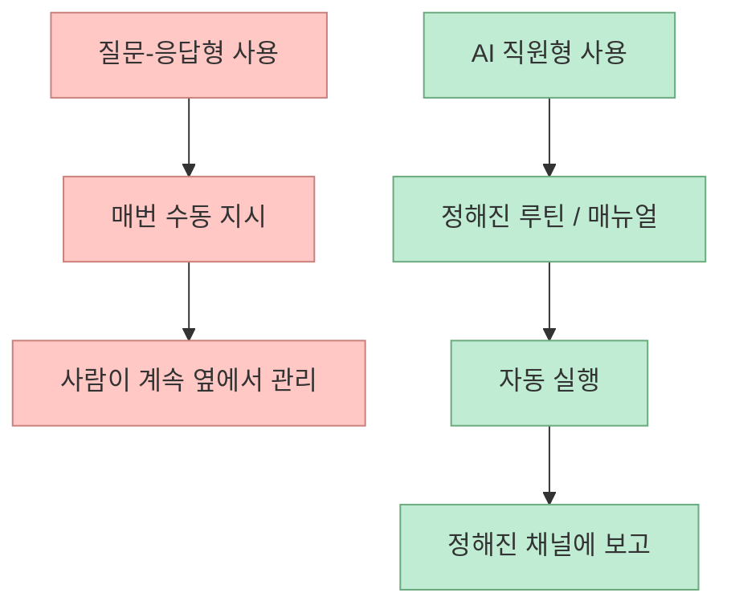
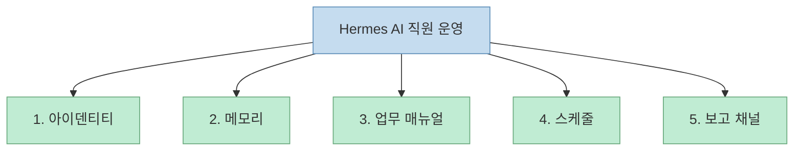
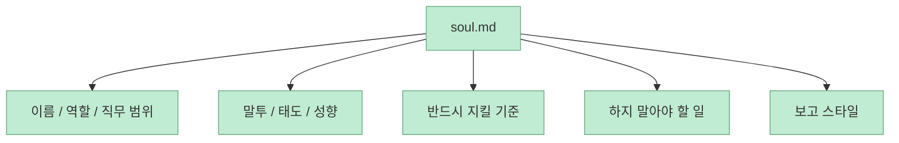
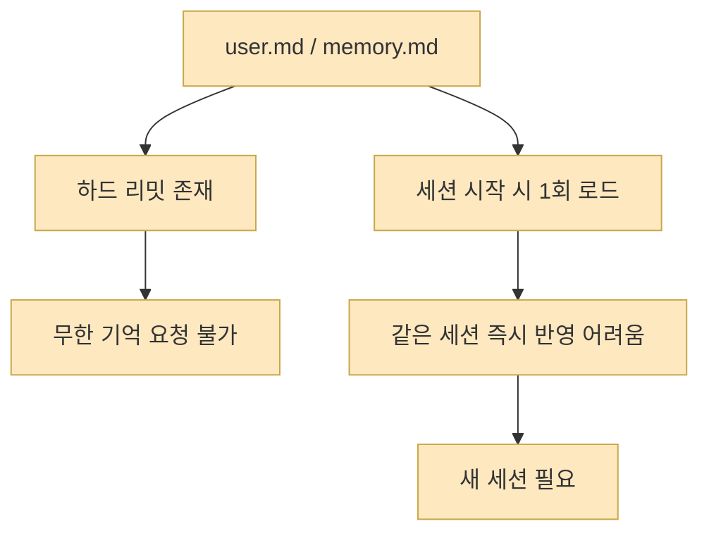
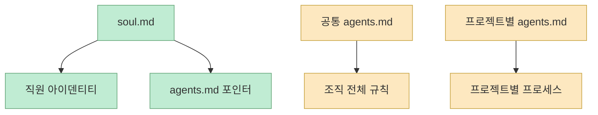
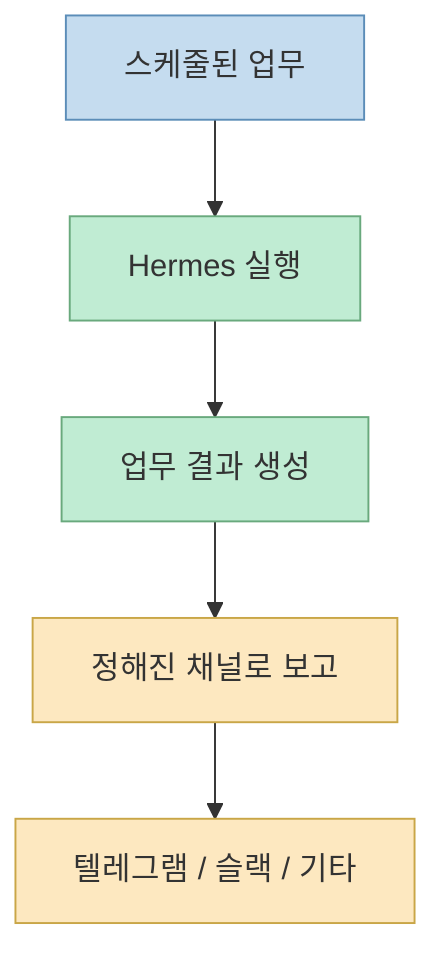

이 영상이 흥미로운 이유는 `Hermes`를 잘 쓰는 법을 프롬프트 팁으로 설명하지 않는다는 점이다. 발표자는 처음부터 Hermes를 "직접 PPT를 제작해 줘", "이 이메일 답장 좀 써 줘"처럼 매번 지시하고 답을 받는 도구로만 쓰면, 직원을 채용해 놓고 옆에서 계속 하나씩 시키는 것과 비슷하다고 말한다. 그리고 오늘의 목표는 Hermes를 **매일 정해진 시간에 출근하고, 자기 업무 매뉴얼대로 일하고, 정해진 채널에 보고하는 AI 직원으로 키우는 방법** 이라고 선언한다.[영상 00:32](https://youtu.be/Ckd4G01D-hE?t=32) [영상 00:49](https://youtu.be/Ckd4G01D-hE?t=49)

즉 이 영상의 주제는 "Hermes 설치법"이 아니다. 더 정확히 말하면, 이미 설치된 Hermes를 **운영 모델** 로 바꾸는 법이다. 발표자는 이를 다섯 가지 축으로 나눠 설명한다. 직원 아이덴티티, 메모리, 업무 매뉴얼, 스케줄, 보고 채널이 그것이다.[영상 01:13](https://youtu.be/Ckd4G01D-hE?t=73) [영상 02:33](https://youtu.be/Ckd4G01D-hE?t=153)

<!--more-->

## Sources

- 영상: [99%가 모르는 Hermes 에이전트로 성장하는 AI 직원 만드는 법!](https://youtu.be/Ckd4G01D-hE?si=lWKah1QjA65ZxCUF)

## Hermes를 그냥 질문-응답 도구로 쓰면 왜 한계가 생기나

영상 서두는 매우 실무적이다. 발표자는 오전 10시에 메일과 캘린더를 정리해 알려 주고, 주식 시장 변화가 포트폴리오에 어떤 영향을 주는지 분석해 주고, 영상 제작 아이디어와 트렌딩 AI 소식을 요약해 주는 식의 업무를 Hermes 에이전트가 대신 보고하게 만들 수 있다고 말한다.[영상 00:08](https://youtu.be/Ckd4G01D-hE?t=8) [영상 00:15](https://youtu.be/Ckd4G01D-hE?t=15)

그런데 많은 사용자가 설치 직후에는 이런 식으로 묻는다고 한다.

- PPT 직접 만들어 줘
- 이메일 답장 써 줘
- 이거 해 줘 저거 해 줘

이 방식은 AI를 비서로 쓰는 것 같지만, 사실은 계속 손으로 컨트롤해야 하기 때문에 **직원화** 와는 거리가 멀다. 발표자가 보기에 진짜 차이는, 에이전트가 정해진 루틴과 매뉴얼을 갖고 **알아서 반복 업무를 수행하고 정해진 형식으로 보고** 하는 상태에 있다.[영상 00:36](https://youtu.be/Ckd4G01D-hE?t=36) [영상 00:52](https://youtu.be/Ckd4G01D-hE?t=52)

즉 이 영상은 도구 사용법보다 **운영 체계의 차이** 를 설명한다.

## 발표자가 제시하는 5단계 운영 모델

영상은 Hermes를 AI 직원처럼 활용하기 위한 기본 축을 다섯 가지로 정리한다.

1. 직무 기술이 포함된 직원 아이덴티티 문서
2. 피드백과 조직 규칙을 기억하는 메모리 문서
3. 특정 업무를 수행할 때 따를 업무 매뉴얼
4. 정해진 시간에 실행되는 업무 스케줄
5. 결과를 올리는 보고 채널

발표자는 이 다섯 가지가 있어야 "출근해서 일하고 보고하는 직원"에 가까워진다고 말한다.[영상 01:19](https://youtu.be/Ckd4G01D-hE?t=79) [영상 02:18](https://youtu.be/Ckd4G01D-hE?t=138)

이 다섯 요소는 각각 별개 기능이 아니라, 함께 있을 때 하나의 "운영체계"처럼 동작한다.

## 1단계는 `soul.md`, 즉 직원 아이덴티티부터 만드는 것이다

영상에서 가장 먼저 다루는 파일은 `soul.md`다. 발표자는 이 파일을 "직원의 아이덴티티를 알려주는 문서"라고 설명한다. Hermes는 세션을 시작할 때 이 파일을 가장 먼저 읽기 때문에, 여기서 말투, 태도, 성격, 직무 범위, 지켜야 할 기준, 하면 안 되는 일 같은 **직원 정체성** 을 세팅해야 한다고 말한다.[영상 03:32](https://youtu.be/Ckd4G01D-hE?t=212) [영상 03:42](https://youtu.be/Ckd4G01D-hE?t=222)

중요한 점은 발표자가 `soul.md`를 손으로 처음부터 쓰지 말라고 권한다는 것이다. 대신 Hermes와 함께 초안을 만들고, 그 뒤 원하는 부분만 피드백으로 수정해 고도화하라고 한다. 예시 섹션으로는:

- identity
- mission
- operating context pointers
- core tone
- boundaries
- reporting shape

같은 구조를 제시한다.[영상 04:09](https://youtu.be/Ckd4G01D-hE?t=249) [영상 04:45](https://youtu.be/Ckd4G01D-hE?t=285)

즉 `soul.md`는 능력 문서가 아니라, **직원 페르소나와 운영 원칙을 주입하는 기본 시스템 프롬프트** 에 가깝다.

## 2단계는 메모리를 채우는 것이 아니라 메모리 한계를 관리하는 것이다

다음으로 발표자는 `user.md`와 `memory.md`를 설명한다. 흥미로운 점은 Hermes가 이 파일들을 자동 생성하고 자동 관리하지만, 그렇다고 해서 사용자가 신경 쓸 필요가 없는 것은 아니라는 점이다. 발표자는 여기서 두 가지를 꼭 기억하라고 한다.

첫째, 하드 리밋이 있다. 영상 설명에 따르면 `memory.md`는 약 2,200자, `user.md`는 약 1,375자 수준으로 크기가 크지 않다. 그래서 "이것도 기억해 줘, 저것도 기억해 줘"를 무한정 시키면 금방 차 버린다.[영상 09:54](https://youtu.be/Ckd4G01D-hE?t=594) [영상 10:16](https://youtu.be/Ckd4G01D-hE?t=616)

둘째, 이 문서들은 세션 시작 시 한 번 로드된다. 즉 같은 대화 안에서 "이것도 기억해"를 추가해도, 바로 이어지는 질문에는 반영이 안 될 수 있다. 새 세션을 열어 다시 로드해야 한다는 것이다.[영상 10:43](https://youtu.be/Ckd4G01D-hE?t=643) [영상 11:06](https://youtu.be/Ckd4G01D-hE?t=666)

이 부분이 중요한 이유는 많은 사용자가 메모리를 "무한한 장기 기억"처럼 오해하기 쉽기 때문이다. 발표자는 오히려 **좋은 직원도 모든 사소한 디테일을 영원히 기억하진 못한다** 는 비유로, 메모리 한계를 받아들이고 관리해야 한다고 설명한다.[영상 10:20](https://youtu.be/Ckd4G01D-hE?t=620)

## 좋은 메모리 운용은 "기억 추가"보다 "기억 검진"에 가깝다

발표자는 추가 팁으로 `user.md`와 `memory.md`를 최소 월 1회 정도 점검하라고 권한다. 오래 쓰다 보면:

- 더 이상 필요 없는 선호
- 바뀐 프리퍼런스
- 중복되거나 길어진 기억

이 쌓일 수 있기 때문이다. 그래서 "지우지 말고, 정리 후보를 추천해 달라"는 식으로 요청해 표를 만들고, 그중 몇 개를 압축·정리하라고 시키는 식의 운영을 보여 준다.[영상 12:48](https://youtu.be/Ckd4G01D-hE?t=768) [영상 14:09](https://youtu.be/Ckd4G01D-hE?t=849)

심지어 이 메모리 검진 자체도 매월 1일 크론으로 보고하게 설정해 자동화할 수 있다고 말한다.[영상 14:23](https://youtu.be/Ckd4G01D-hE?t=863) [영상 15:01](https://youtu.be/Ckd4G01D-hE?t=901)

즉 메모리 운영의 핵심은 "계속 추가"가 아니라, **리밋 안에서 우선순위를 유지하는 정기 정리 루프** 다.

## 3단계는 `agents.md`에 업무 매뉴얼을 따로 두는 것이다

영상에서 발표자가 반복해서 강조하는 또 하나의 포인트는 `soul.md`와 `agents.md`를 섞지 말라는 것이다. `soul.md`는 항상 로드되기 때문에, 여기에 업무 프로세스까지 길게 다 넣어 버리면 컨텍스트가 너무 길어지고 중요한 것이 묻힐 수 있다. 그래서 직원 정체성은 `soul.md`에, 회사가 지켜야 하는 전반적인 업무 프로세스는 `agents.md`에 두라고 권한다.[영상 08:35](https://youtu.be/Ckd4G01D-hE?t=515) [영상 09:06](https://youtu.be/Ckd4G01D-hE?t=546)

또 발표자는 `agents.md`를 프로젝트별 로컬 문서와, 조직 전체 공통 문서로 나누는 아이디어도 준다.

- 특정 프로젝트 폴더 안의 `agents.md`: 그 프로젝트 전용 프로세스
- 기본 데이터 영역의 `agents.md`: 직원이 항상 따라야 하는 조직 공통 규칙

그리고 `soul.md`에는 "운영 매뉴얼은 `agents.md`를 참고하라"는 pointer만 넣어 필요할 때 로드하게 하는 방식을 추천한다.[영상 07:01](https://youtu.be/Ckd4G01D-hE?t=421) [영상 08:24](https://youtu.be/Ckd4G01D-hE?t=504)

이 구조는 결국 **항상 필요한 컨텍스트와 필요할 때만 불러올 매뉴얼을 분리하는 하네스 설계** 다.

## 4단계는 크론으로 "출근 시간"을 만들어 주는 것이다

발표자는 직원이 되려면 출근 시간과 업무 스케줄이 있어야 한다고 말한다. 사람이 10시에 출근하고 7시에 퇴근하듯, Hermes도 특정 시간대에 어떤 업무를 해야 하는지 스케줄링해 줘야 한다는 것이다. 이를 위해 크론을 활용한다고 설명한다.[영상 02:07](https://youtu.be/Ckd4G01D-hE?t=127) [영상 14:23](https://youtu.be/Ckd4G01D-hE?t=863)

예시는 영상 초반부터 나온다.

- 오전 10시 메일과 캘린더 정리
- 포트폴리오에 영향을 주는 시장 변화 분석
- 영상 제작 아이디어 추천
- 트렌딩 AI 소식 요약

이런 것들은 사용자가 매일 물어보는 것이 아니라, **정해진 시간에 먼저 실행되도록 세팅되는 업무** 다.[영상 00:08](https://youtu.be/Ckd4G01D-hE?t=8) [영상 00:49](https://youtu.be/Ckd4G01D-hE?t=49)

즉 Hermes를 직원처럼 쓰려면 질문형 인터페이스보다 먼저, **루틴을 만드는 스케줄 계층** 이 필요하다.

## 5단계는 "결과가 어디로 올라오는가"를 설계하는 것이다

마지막 요소는 보고 채널이다. 발표자는 직원도 업무를 마친 뒤 리포트 대상에게 결과를 보고하듯, AI 직원도 정해진 채널에 정해진 시간에 결과를 보내야 한다고 설명한다. 그리고 이 채널은 텔레그램, 슬랙 등으로 운영할 수 있다고 말한다.[영상 02:22](https://youtu.be/Ckd4G01D-hE?t=142) [영상 02:45](https://youtu.be/Ckd4G01D-hE?t=165)

이 부분이 중요한 이유는, 자동화는 실행보다 **회수되는 결과** 가 더 중요할 때가 많기 때문이다. 매일 10시에 분석을 해도, 그 결과가 내가 실제로 보는 채널로 오지 않으면 업무로 연결되지 않는다.

그래서 Hermes를 직원화한다는 말은 단순히 자동 실행이 아니라:

- 언제 실행할지
- 어떤 형식으로 정리할지
- 어디로 보고할지

까지 포함한 것이다.

## 결국 핵심은 "AI를 더 똑똑하게 만드는 것"보다 "운영 가능하게 만드는 것"이다

영상 전체를 관통하는 메시지는 분명하다. AI를 직원처럼 쓰려면 모델 성능보다 먼저:

- 어떤 직원인지 정의하고
- 무엇을 기억해야 하는지 정리하고
- 어떤 문서를 따라야 하는지 나누고
- 언제 일하는지 정하고
- 어디로 보고하는지 정하는

운영 체계가 필요하다.

즉 Hermes를 잘 쓴다는 것은, 더 좋은 답을 한 번 뽑는 것이 아니라 **반복 업무를 책임지는 캐릭터와 루틴을 설계하는 것** 에 더 가깝다.

## 핵심 요약

- 이 영상은 Hermes를 질문-응답 도구가 아니라 **정해진 시간에 일하고 보고하는 AI 직원** 으로 운영하는 방법을 설명한다.
- 핵심 운영 요소는 다섯 가지다.
  - `soul.md`
  - `user.md` / `memory.md`
  - `agents.md`
  - 크론 스케줄
  - 보고 채널
- `soul.md`는 직원 아이덴티티, `agents.md`는 업무 매뉴얼, 메모리 문서는 선호와 기억 관리에 가깝다.
- 메모리는 하드 리밋과 세션 로드 타이밍이 있으므로, 추가보다 정리와 검진이 중요하다.
- 진짜 차이는 한 번의 정답 품질보다, **반복 업무가 자동 실행되고 결과가 회수되는 운영 루프** 를 만드느냐에 있다.

## 결론

Hermes를 "AI 직원"으로 키운다는 말은 비유가 아니라 운영 설계의 문제다. 직원처럼 쓰려면 성격과 역할을 주고, 기억을 관리하고, 매뉴얼을 따르게 하고, 출근 시간과 보고 루틴까지 설계해야 한다. 그래서 이 영상이 주는 가장 큰 메시지는 단순하다. **AI를 잘 쓰는 것과 AI를 운영하는 것은 다르다.** Hermes는 그 차이를 문서, 메모리, 스케줄, 보고 채널이라는 다섯 개 레버로 보여 준다.
