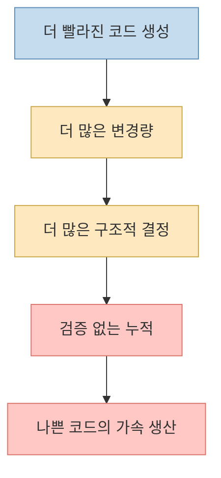
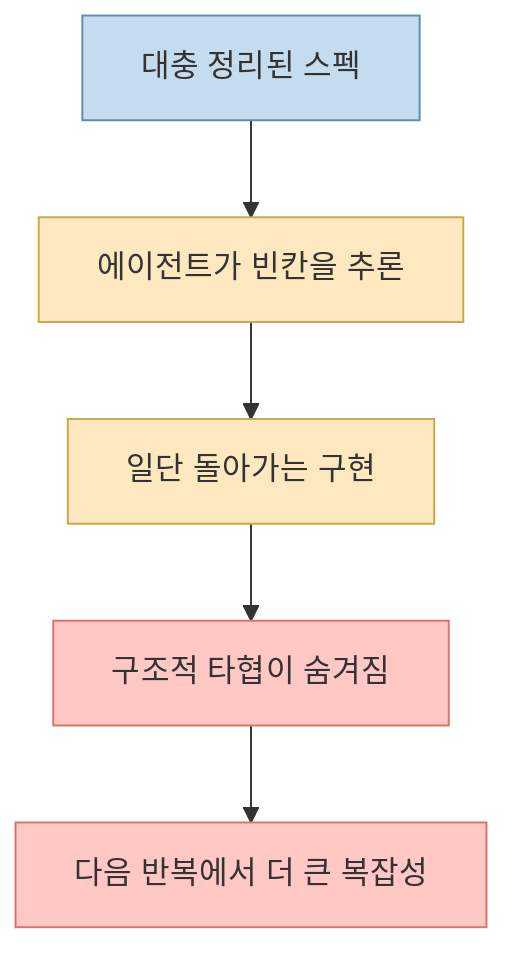
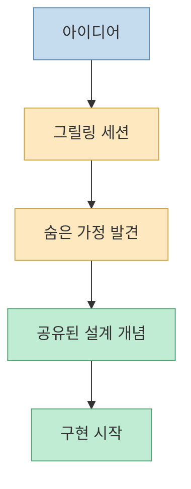
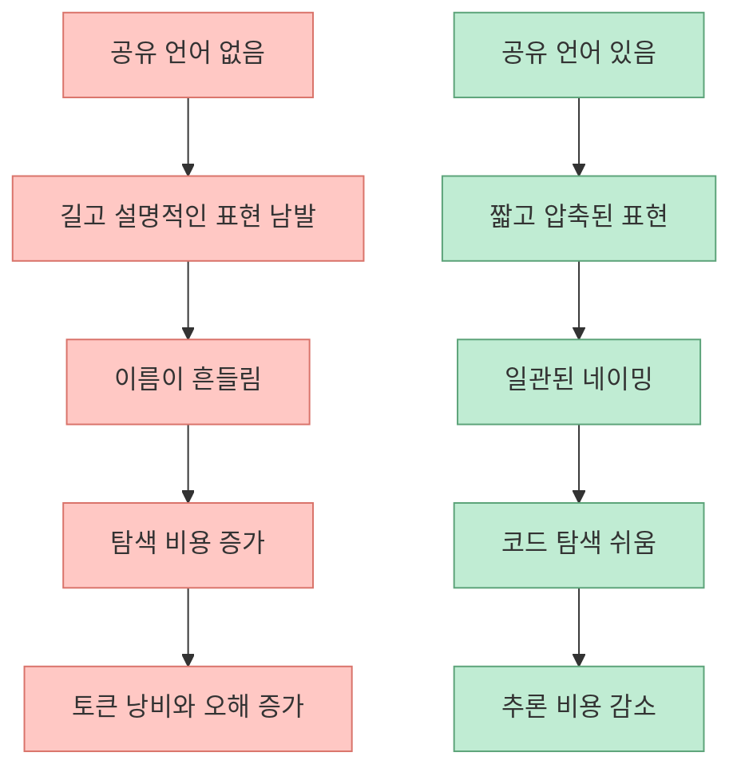
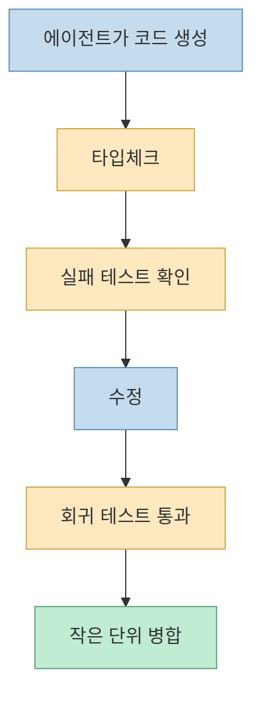
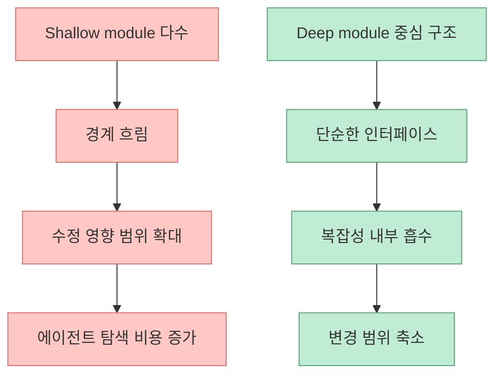

Matt Pocock의 발표 `"Software Fundamentals Matter More Than Ever"` 는 요즘 AI 코딩 담론을 정면으로 거슬러 올라갑니다. 메시지는 단순합니다. **AI가 코드를 더 빨리 쓰게 만들수록, 소프트웨어 기본기는 오히려 더 중요해진다** 는 것입니다. 이 발표는 "AI가 대신 짜 주니까 설계와 피드백은 덜 중요해졌다" 가 아니라, **AI가 빠르게 증폭시키는 실패를 막기 위해 기본기가 더 비싸고 더 중요해졌다** 는 쪽에 가깝습니다. [YouTube](https://www.youtube.com/watch?v=v4F1gFy-hqg) [GitHub](https://github.com/mattpocock/skills)
<!--more-->

이 관점이 흥미로운 이유는, 단순히 보수적인 "정석론" 이 아니기 때문입니다. Matt Pocock은 AI를 반대하지 않습니다. 오히려 매일 쓰는 사람의 입장에서, 왜 에이전트 시대에도 `shared language`, `feedback loop`, `deep module` 같은 고전적 원칙이 더 중요해졌는지를 설명합니다. 그리고 그 설명은 `mattpocock/skills` 저장소에 실제 작업 패턴으로 녹아 있습니다. [GitHub](https://github.com/mattpocock/skills)

## Sources

- https://www.youtube.com/watch?v=v4F1gFy-hqg
- https://github.com/mattpocock/skills

## 1. 핵심 주장부터 정리하면: AI는 코드를 싸게 만들지 않았고, 나쁜 코드를 더 빨리 만들게 했다

발표 제목 자체가 거의 결론입니다. `Software Fundamentals Matter More Than Ever.` 이 문장은 "기초가 아직도 중요하다" 정도의 훈계가 아닙니다. 더 정확히 말하면, **코딩 속도가 빨라질수록 설계 실수와 구조 붕괴의 비용이 더 빨리 누적된다** 는 진단입니다. [YouTube](https://www.youtube.com/watch?v=v4F1gFy-hqg)

`mattpocock/skills` README도 같은 문제를 전제로 시작합니다. 이 저장소는 AI 코딩 에이전트의 대표 실패 모드를 네 가지로 정리합니다.

- 내가 원한 걸 하지 못함
- 너무 장황함
- 코드가 작동하지 않음
- 코드베이스가 진흙덩이처럼 뭉개짐

이 네 가지는 사실 전부 "AI가 부족해서" 생기는 문제가 아니라, **기본적인 엔지니어링 장치가 없어서 AI가 그 문제를 증폭시키는 상황** 으로 볼 수 있습니다. [GitHub](https://github.com/mattpocock/skills)

즉 AI가 만들어 낸 변화는 "코드를 싸게 만드는 것" 이라기보다, **코드를 쓰는 병목을 줄여서 다른 병목을 더 선명하게 드러내는 것** 에 가깝습니다. 설계, 용어 정렬, 테스트, 경계 설정이 약한 팀일수록 오히려 더 빨리 무너질 수 있다는 뜻입니다.

## 2. 왜 "스펙만 잘 쓰면 된다" 는 접근이 위험한가

AI 도구를 쓰다 보면 자연스럽게 `specs-to-code` 같은 환상이 생깁니다. 요구사항 문서만 잘 쓰면, 나머지는 모델이 알아서 구현하고, 조금 마음에 안 들면 스펙을 다시 고쳐서 재생성하면 될 것처럼 느껴집니다.

Matt Pocock의 발표가 겨냥하는 것도 바로 이 감각입니다. 발표의 논지는, 스펙만 만지면서 코드를 직접 보지 않는 루프는 반복할수록 좋아지기보다 **코드 엔트로피를 더 빠르게 키울 수 있다** 는 것입니다. [YouTube](https://www.youtube.com/watch?v=v4F1gFy-hqg)

그 이유는 단순합니다.

- 스펙은 설계 개념 전체를 완전히 담지 못합니다
- 에이전트는 빠르게 빈칸을 메웁니다
- 빈칸을 메운 결과가 구조를 더 복잡하게 만듭니다
- 다음 반복은 그 복잡해진 구조 위에서 다시 시작됩니다

즉 문제는 모델이 멍청해서가 아니라, **불완전한 설계 의도를 너무 빠른 속도로 코드에 굳혀 버린다** 는 데 있습니다.

그래서 이 발표는 "프롬프트를 더 잘 쓰자" 보다 한 단계 더 나아갑니다. 정말 중요한 것은 프롬프트의 문장력보다, **에이전트가 틀어지기 전에 막아 주는 기본기 레일을 깔아 두는 것** 입니다.

## 3. 첫 번째 기본기: 구현 전에 공유된 설계 개념을 맞춰야 한다

README에서 가장 먼저 나오는 해결책은 `/grill-me`, `/grill-with-docs` 입니다. 이 둘은 단순한 질문 생성기가 아닙니다. 목적은 구현 전에 사람과 에이전트가 같은 문제를 보고 있는지 확인하는 것입니다. [GitHub](https://github.com/mattpocock/skills)

이 접근이 중요한 이유는, 요구사항 오해가 여전히 가장 큰 실패 모드이기 때문입니다. 사람 개발자끼리도 "내가 말한 걸 이해했겠지" 가 자주 틀리는데, 에이전트에게는 그 문제가 더 자주 발생합니다. 그리고 에이전트는 모르면 멈추기보다, 그럴듯하게 이어서 구현해 버리는 경향이 있습니다.

따라서 발표의 첫 메시지는 사실 굉장히 전통적입니다.

- 먼저 질문한다
- 모호한 말을 깨부순다
- 용어를 정렬한다
- 설계 개념을 맞춘다
- 그 다음에 구현한다

이 순서를 지키지 않으면 AI는 빠른 타자수로 오해를 코드화하는 도구가 됩니다.

즉 이 발표는 "AI가 코드를 써 준다" 이전에, **AI에게 무엇을 만들고 있는지부터 정확히 합의해야 한다** 는 가장 기본적인 사실을 다시 꺼냅니다.

## 4. 두 번째 기본기: 공유 언어가 있어야 에이전트도 덜 장황하고 덜 헤맨다

Matt Pocock이 흥미로운 지점은, verbosity 문제를 단순 스타일 문제가 아니라 **공유 언어 부재의 신호** 로 본다는 점입니다. README는 DDD의 `ubiquitous language` 개념을 끌어와, 프로젝트 내부 용어가 정리되지 않으면 에이전트는 1단어로 끝낼 표현을 20단어로 길게 풀어 쓴다고 설명합니다. [GitHub](https://github.com/mattpocock/skills)

이건 단순히 답변이 장황해진다는 뜻이 아닙니다.

- 변수 이름이 흔들립니다
- 함수 이름이 제각각이 됩니다
- 같은 개념을 매번 다른 말로 부릅니다
- 에이전트의 추론 비용도 커집니다

결국 공유 언어는 문서 예쁘게 만들기용이 아니라, **AI와 사람이 같은 압축된 개념 사전을 공유하기 위한 인프라** 입니다.

이 관점은 AI 시대에 특히 중요합니다. 사람은 문맥을 대충 메꾸지만, 에이전트는 용어가 흔들릴수록 더 많은 추론을 해야 하고, 그 추론은 종종 잘못된 구조로 이어집니다.

## 5. 세 번째 기본기: 피드백 루프가 속도 제한 장치다

README에서 가장 강하게 남는 문장 중 하나는 `"The rate of feedback is your speed limit"` 입니다. [GitHub](https://github.com/mattpocock/skills)

이 문장은 AI 코딩 시대에 거의 운영 원칙처럼 읽어야 합니다. 에이전트는 사람보다 훨씬 빠르게 많은 코드를 밀어 넣을 수 있습니다. 그런데 타입체크, 테스트, 브라우저 확인, 회귀 검증이 느슨하면 그 속도는 곧바로 사고로 이어집니다.

즉 피드백 루프는 속도를 떨어뜨리는 방해물이 아니라, **망가지지 않고 더 빨리 가기 위한 제한 장치** 입니다.

- 작은 단계로 구현하기
- 실패하는 테스트 먼저 만들기
- 타입과 런타임 검증 확인하기
- 회귀 테스트로 고정하기

이 순서를 지키면 AI는 막연한 생성기가 아니라, **피드백을 먹고 교정되는 반복 기계** 에 가까워집니다.

결국 AI 시대의 속도 경쟁은 "누가 더 많이 생성하느냐" 가 아니라, **누가 더 촘촘한 피드백 루프 안에서 생성하느냐** 로 바뀝니다.

## 6. 네 번째 기본기: shallow module이 아니라 deep module을 의식해야 한다

발표와 README가 마지막으로 강조하는 것은 구조입니다. README는 John Ousterhout의 `deep module` 개념을 직접 인용하면서, 에이전트가 빠르게 만들기 쉬운 것은 대개 얇고 산만한 구조라고 설명합니다. [GitHub](https://github.com/mattpocock/skills)

이 지점이 중요합니다. AI는 "당장 이어 붙이기 쉬운 코드" 를 잘 만듭니다. 하지만 그런 코드는 보통:

- 경계가 흐리고
- 이름은 많은데 의미는 얕고
- 군데군데 중복이 숨어 있고
- 나중에 바꾸려면 전체를 훑어야 합니다

반대로 좋은 구조는 인터페이스는 단순하지만 내부는 충분히 많은 복잡성을 삼켜 줍니다. 이런 deep module 구조는 사람에게도 좋고, AI에게도 좋습니다. 경계가 선명하니 탐색도 쉽고, 수정 영향 범위도 작아지기 때문입니다.

그래서 AI 시대의 아키텍처 작업은 사치가 아닙니다. 오히려 에이전트가 계속 드나들어도 버틸 수 있는 **변경 친화적 경계 설계** 에 더 가까워집니다.

## 7. 이 발표를 실무에 옮기면 결국 이런 워크플로가 된다

Matt Pocock의 메시지를 실무용으로 압축하면 대략 아래 순서가 됩니다.

1. 구현 전에 충분히 질문하게 만든다  
2. 프로젝트의 공유 언어를 문서화한다  
3. 테스트와 타입체크를 속도 제한 장치로 둔다  
4. 작은 단위로 자주 검증한다  
5. 구조가 흐려지면 리팩터링을 뒤로 미루지 않는다

이건 AI 때문에 새로 생긴 원칙이 아닙니다. 다만 이제는 에이전트가 코딩 속도를 크게 높였기 때문에, 이 원칙을 어기면 무너지는 속도도 같이 빨라졌다는 점이 달라졌습니다.

## 8. 결론: AI 시대에 덜 중요한 것이 아니라, 더 비싸진 것이 기본기다

이 발표의 진짜 힘은 "AI 만능론" 도 아니고 "기본으로 돌아가자" 는 막연한 슬로건도 아니라는 데 있습니다. Matt Pocock은 오히려 AI를 적극적으로 쓰는 입장에서, **무엇이 자동화되어도 끝까지 남는 병목이 무엇인지** 를 짚습니다. [YouTube](https://www.youtube.com/watch?v=v4F1gFy-hqg)

그 병목은 여전히:

- 무엇을 만들지 합의하는 일
- 같은 언어를 쓰게 만드는 일
- 작동 여부를 빠르게 확인하는 일
- 코드를 오래 버티는 구조로 유지하는 일

입니다.

즉 AI 시대의 경쟁력은 프롬프트 한 줄의 재치보다, **기본기를 에이전트가 반복 실행할 수 있는 작업 방식으로 바꾸는 능력** 에 더 가깝습니다. 그 점에서 `"Software Fundamentals Matter More Than Ever"` 는 단순한 발표 제목이 아니라, 지금 AI 코딩 환경 전체를 설명하는 꽤 정확한 진단처럼 보입니다.
