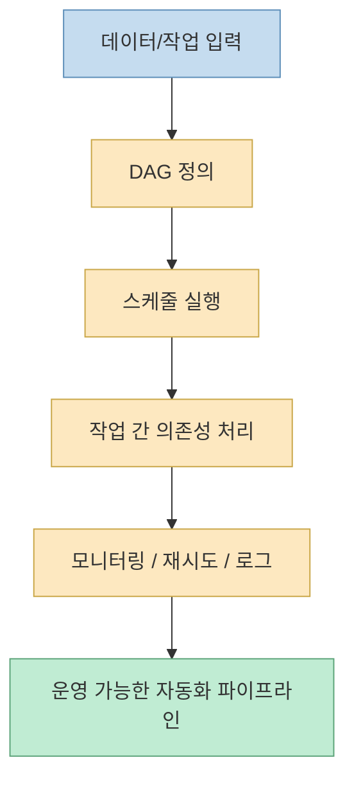
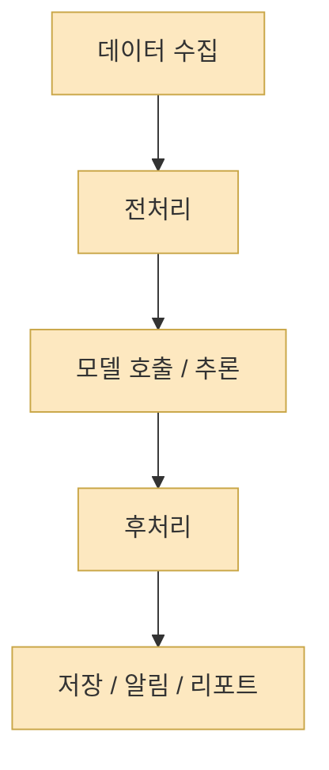
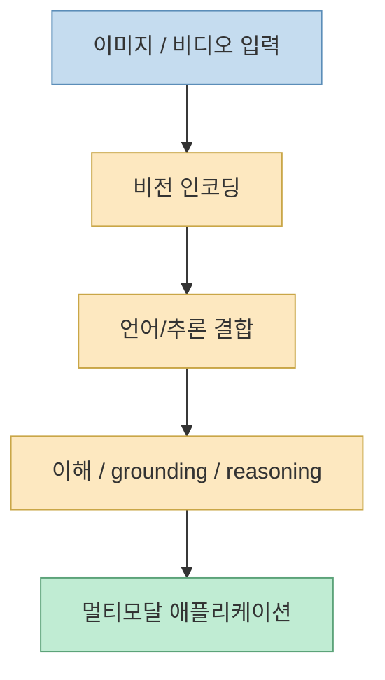
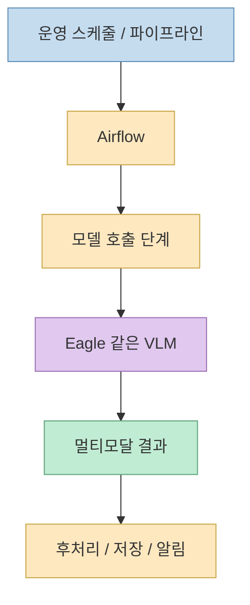

이 Threads 포스트는 겉으로 보면 그냥 “요즘 흥미로운 GitHub 링크 몇 개”를 던지는 짧은 추천 글처럼 보입니다. 그런데 실제로 공개 메타데이터에서 직접 확인되는 링크를 보면 `apache/airflow` 와 `NVlabs/Eagle` 이 나란히 등장합니다. 이 조합은 꽤 재미있습니다. 하나는 **작업을 어떻게 흐르게 할 것인가** 를 다루는 워크플로 오케스트레이터이고, 다른 하나는 **이미지와 비디오를 어떻게 이해하게 할 것인가** 를 다루는 VLM 계열 모델이기 때문입니다. [Threads 원문](https://www.threads.net/@art.bs88x/post/DY-3pLzk6kr)
<!--more-->

즉 이 포스트는 단순히 “좋아 보이는 저장소 2개”가 아니라, 자동화 스택의 서로 다른 층을 동시에 가리키고 있습니다. `Airflow` 는 파이프라인 운영의 문제를 풀고, `Eagle` 은 멀티모달 이해 모델의 성능과 데이터 전략 문제를 풉니다. 이번 글에서는 이 두 프로젝트를 같이 놓고, 왜 이 대비가 실무적으로 의미가 있는지 정리해 보겠습니다. [Airflow](https://github.com/apache/airflow) [Eagle](https://github.com/NVlabs/Eagle)

## Sources

- https://www.threads.net/@art.bs88x/post/DY-3pLzk6kr
- https://github.com/apache/airflow
- https://github.com/NVlabs/Eagle

## 1. Threads 원문에서 직접 확인되는 내용은 무엇이었나

공개 HTML 메타데이터 기준으로, 이 Threads 포스트의 본문에는 다음 두 링크가 분명히 들어 있습니다.

- `https://github.com/apache/airflow`
- `https://github.com/NVlabs/Eagle`

메타 설명에는 한국어 문장으로:

- `아직도 수동으로 배치 돌리세요?` 라며 Airflow를 소개하고
- `엔비디아가 또 일냈다!` 라며 Eagle을 소개하는

구성이 잡혀 있습니다. 즉 작성자는 이 포스트에서 **배치/자동화 도구** 와 **최신 멀티모달 모델 계열 프로젝트** 를 한 묶음으로 보여 주고 있습니다. [Threads 공개 메타데이터 확인](https://www.threads.net/@art.bs88x/post/DY-3pLzk6kr)

다만 메타 설명의 마지막 부분은 잘려 있어, 뒤에 이어지는 추가 소개 항목까지는 공개 HTML만으로 완전히 복원되지 않습니다. 따라서 이번 글은 **원문에서 직접 확인 가능한 두 링크만을 근거로** 정리합니다.

## 2. Airflow는 “AI 도구”가 아니라 작업 흐름을 코드로 운영하는 기반층이다

`Apache Airflow`의 공식 설명은 아주 직설적입니다. GitHub 설명란에는 "`A platform to programmatically author, schedule, and monitor workflows`" 라고 적혀 있습니다. 즉 Airflow는 모델이나 에이전트가 아니라, **일의 순서와 의존성을 코드로 정의하고 실행 상태를 추적하는 운영 플랫폼** 입니다. [Airflow GitHub](https://github.com/apache/airflow)

이 정의가 중요한 이유는, 많은 사람이 자동화를 “스크립트를 하나 작성해서 돌리는 것” 정도로 이해하기 때문입니다. 하지만 실제 운영 자동화는 그보다 훨씬 복잡합니다.

- 언제 실행할지
- 어떤 작업이 먼저 끝나야 하는지
- 실패했을 때 어디서 재시도할지
- 어떤 입력과 출력을 남길지
- 어떤 작업이 병렬 가능한지

를 다뤄야 합니다.

즉 Airflow는 “배치 하나를 자동화한다” 보다, **배치들이 얽힌 전체 흐름을 운영 가능한 상태로 만든다** 는 쪽에 가깝습니다.

그래서 Threads 원문의 `"아직도 수동으로 배치 돌리세요?"` 라는 표현은 꽤 정확합니다. Airflow의 본질은 단순 자동화가 아니라, **수동 운영을 시스템 운영으로 바꾸는 것** 이기 때문입니다.

## 3. Airflow가 여전히 중요한 이유는 “AI 이전 문제”를 풀기 때문이다

AI 시대가 되면 모든 관심이 모델, 에이전트, 프롬프트로 쏠리기 쉽습니다. 하지만 실제 현장에서는 여전히:

- 데이터 수집
- 전처리
- 모델 실행
- 후처리
- 알림/적재/리포트

같은 작업 흐름이 끊기지 않고 굴러가야 합니다.

여기서 Airflow 같은 오케스트레이터는 AI 자체를 대체하지 않습니다. 대신 AI를 포함한 여러 단계를 **실제로 굴러가는 파이프라인** 으로 엮어 줍니다.

즉 Airflow는 “AI를 더 똑똑하게 만드는 도구”가 아니라, **AI가 포함된 시스템을 더 믿고 운영할 수 있게 만드는 도구** 입니다. 이 점에서 Airflow는 화려한 최신 에이전트 프레임워크와 경쟁하기보다, 오히려 그 아래에서 계속 필요한 기반층으로 남습니다.

## 4. Eagle은 완전히 다른 층이다: 자동화 엔진이 아니라 멀티모달 이해 모델 패밀리

반면 `NVlabs/Eagle`은 Airflow와 정반대 층에 있습니다. README 첫 문장은 `Eagle: Frontier Vision-Language Models with Data-Centric Strategies` 입니다. 즉 이 프로젝트는 **비전-언어 모델 자체를 어떻게 만들고 개선할 것인가** 에 초점이 있습니다. [Eagle README](https://github.com/NVlabs/Eagle)

README를 보면 Eagle은 단일 모델 하나라기보다 패밀리 전체를 가리킵니다.

- `Eagle`
- `Eagle 2`
- `Eagle 2.5`
- `LocateAnything`

등이 함께 묶여 있고, 이미지 이해, 비디오 이해, long-context multimodal understanding, grounding 같은 범위를 포괄합니다. [Eagle README](https://github.com/NVlabs/Eagle)

즉 Airflow가 “작업을 어떻게 흘릴 것인가”를 다루는 반면, Eagle은 “모델이 시각 정보를 얼마나 잘 이해할 것인가”를 다룹니다.

따라서 같은 포스트 안에 등장해도, Eagle을 Airflow와 같은 종류의 도구로 보면 안 됩니다. Eagle은 **운영 오케스트레이터** 가 아니라 **모델 역량 레이어** 입니다.

## 5. Eagle이 강조하는 것은 모델 크기보다 “데이터 중심 전략”이다

Eagle 저장소 설명에서 특히 눈에 띄는 부분은 `data-centric strategies` 라는 표현입니다. 이건 그냥 “또 하나의 대형 모델” 이라는 말과 다릅니다. README는 Eagle을 일반적인 멀티모달 이해, long-context reasoning, embodied application까지 아우르는 연구·개발 플랫폼으로 설명합니다. [Eagle README](https://github.com/NVlabs/Eagle)

즉 여기서 핵심은 단순히 파라미터 수를 키우는 접근이 아니라:

- 어떤 데이터를 쓰는가
- 어떤 후처리/학습 전략을 쓰는가
- 어떤 태스크로 확장되는가
- 실제 다른 NVIDIA 프로젝트에 어떻게 연결되는가

같은 점입니다.

README에는 `GR00T`, `Nemotron`, `Cosmos`, `NeMo Retriever` 등 NVIDIA의 다른 흐름과의 연결도 적혀 있습니다. 즉 Eagle은 단독 데모 모델이라기보다, **NVIDIA 내부 멀티모달/Physical AI 전략의 일부를 떠받치는 연구 축** 으로 읽는 편이 더 정확합니다. [Eagle README](https://github.com/NVlabs/Eagle)

## 6. 이 두 프로젝트를 같이 보면 자동화 스택의 위아래가 한 번에 보인다

Threads 포스트가 짧지만 흥미로운 이유는, Airflow와 Eagle이 서로 완전히 다른 층을 대표하기 때문입니다.

- Airflow는 작업 흐름 관리
- Eagle은 멀티모달 모델 역량

을 담당합니다.

이걸 하나의 시스템 관점에서 보면 아래처럼 정리할 수 있습니다.

즉 실무에서는 둘 중 하나만 중요하지 않습니다. 좋은 모델만 있어도 운영이 안 되면 서비스가 안 되고, 오케스트레이션만 잘해도 안쪽 모델 역량이 약하면 결과 품질이 낮습니다.

## 7. 이 Threads 포스트를 실무적으로 읽는 법

이 포스트를 “요즘 뜨는 저장소 추천” 정도로만 보면 절반만 읽는 셈입니다. 실무 관점에서는 오히려 이렇게 해석하는 편이 좋습니다.

- `Airflow`는 AI를 포함한 일을 **지속 가능하게 굴리는 운영 자동화**
- `Eagle`은 멀티모달 태스크의 **핵심 모델 역량 자체를 밀어 올리는 연구/개발 축**

을 상징합니다.

즉 하나는 **흐름의 자동화**, 다른 하나는 **이해의 고도화** 입니다. 그리고 실제 서비스나 제품은 보통 이 두 축이 함께 필요합니다.

## 핵심 요약

Threads 원문에서 직접 확인 가능한 두 GitHub 링크는 `apache/airflow`와 `NVlabs/Eagle` 이었습니다.

- Airflow는 DAG 기반 워크플로 오케스트레이션과 운영 자동화의 대표격입니다
- Eagle은 데이터 중심 전략을 내세운 NVIDIA의 VLM 패밀리입니다
- 둘은 같은 “AI 도구”가 아니라 자동화 스택의 서로 다른 층을 담당합니다

즉 이번 포스트의 진짜 포인트는 “둘 다 유명하다” 가 아니라, **운영 자동화와 모델 역량 강화가 동시에 중요하다는 것** 입니다.

## 결론

짧은 SNS 포스트 안에 `Airflow`와 `Eagle`이 함께 들어간 건 우연처럼 보여도 꽤 상징적입니다. 지금 실무에서 중요한 것은 단순히 더 좋은 모델 하나를 찾는 일도, 더 많은 배치를 자동화하는 일도 아닙니다. **좋은 모델을 실제 운영 가능한 파이프라인 안에 넣는 것**, 그 두 층을 함께 보는 시야가 더 중요해지고 있습니다. 이번 Threads 포스트는 바로 그 점을 아주 짧게 보여 준 사례로 읽을 수 있습니다.
