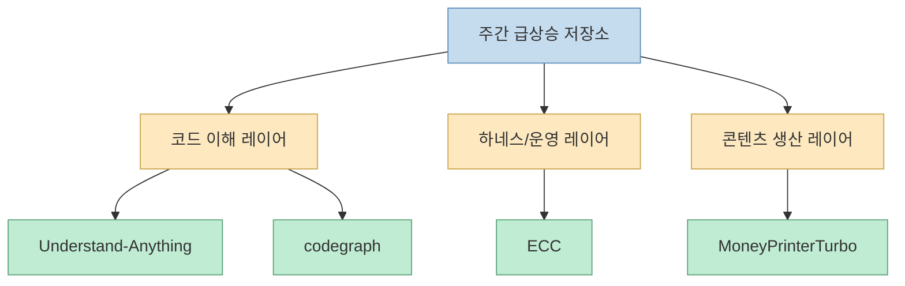
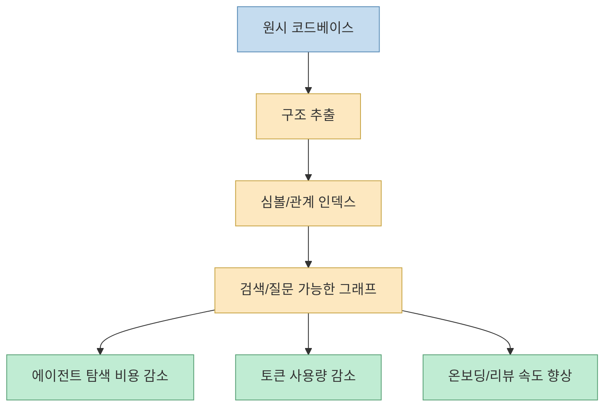
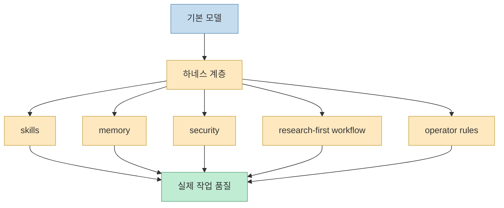
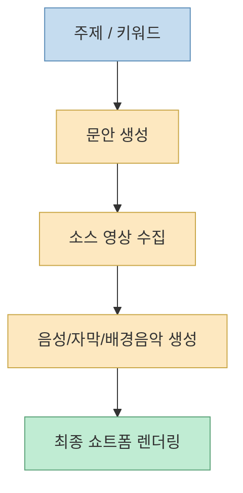
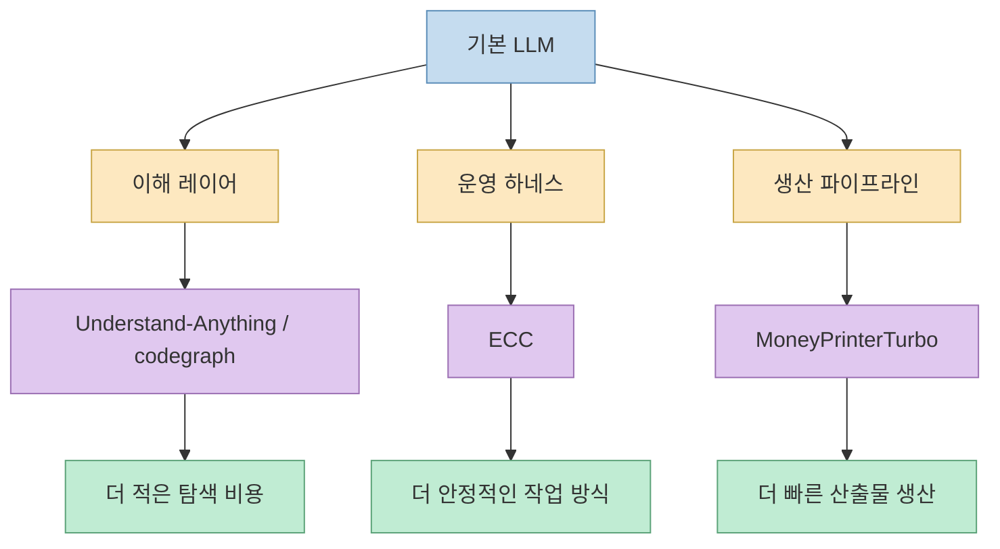

X에 올라온 `"이번 주 GitHub에서 급상승한 AI 관련 리포지토리 10선"` 포스트를 보면, 표면적으로는 단순한 주간 랭킹처럼 보입니다. 그런데 원문에서 직접 확인 가능한 카드들과 GitHub 원본 저장소를 같이 보면, 이번 주 흐름은 꽤 선명합니다. **사람들이 지금 뜨겁게 반응하는 것은 단순 AI 앱보다, 에이전트가 더 잘 이해하고 더 적은 토큰으로 더 안정적으로 일하게 만드는 기반층** 이라는 점입니다. [X 원문](https://x.com/i/status/2060921724443791580)
<!--more-->

이번 포스트는 X 원문에서 직접 확인 가능한 저장소 카드 4개와, 같은 시점의 보조 트렌드 스냅샷을 함께 읽어 왜 이런 패턴이 반복되는지 해설합니다. 특히 `Understand-Anything`, `codegraph`, `ECC`, `MoneyPrinterTurbo` 네 개를 같이 놓고 보면, **코드 이해 레이어 + 하네스 레이어 + 생산 파이프라인 레이어** 가 한꺼번에 떠오르는 이유가 보입니다. [Understand Anything](https://github.com/Lum1104/Understand-Anything) [CodeGraph](https://github.com/colbymchenry/codegraph) [ECC](https://github.com/affaan-m/ECC) [MoneyPrinterTurbo](https://github.com/harry0703/MoneyPrinterTurbo)

## Sources

- https://x.com/i/status/2060921724443791580
- https://github.com/Lum1104/Understand-Anything
- https://github.com/colbymchenry/codegraph
- https://github.com/affaan-m/ECC
- https://github.com/harry0703/MoneyPrinterTurbo
- https://risingrepo.org/
- https://allhot.top/

## 1. 이번 X 포스트에서 직접 확인되는 1차 신호는 4개였다

X 원문은 일본어로 `"이번 주 GitHub에서 급상승한 AI 관련 리포지토리 10선"` 이라고 소개하지만, 공개 임베드와 첨부 이미지에서 텍스트로 직접 확인 가능한 카드는 우선 4개였습니다. 첫 카드의 본문 텍스트는 `Understand-Anything`을 "`코드베이스 전체를 대화형 knowledge graph로 바꾸는 도구`" 라고 설명하고, 첨부 카드들에는 `Understand-Anything`, `codegraph`, `MoneyPrinterTurbo`, `ECC`가 각각 표시됩니다. [X 원문 임베드 확인](https://x.com/i/status/2060921724443791580)

이 4개를 그대로 나열해 보면 얼핏 분야가 제각각처럼 보입니다.

- `Understand-Anything`: 코드/문서/지식 그래프
- `codegraph`: 로컬 코드 지식 그래프
- `ECC`: 에이전트 하네스 성능 최적화 시스템
- `MoneyPrinterTurbo`: AI 기반 쇼트폼 영상 생성 파이프라인

하지만 실제로는 네 프로젝트 모두 **“모델이 똑똑해지는 것” 자체보다, 모델이 일하는 외부 구조를 어떻게 바꾸는가** 에 더 가까운 도구들입니다.

즉 이 랭킹은 “어떤 모델이 떴는가” 보다, **어떤 병목을 외부 시스템으로 해결하는 프로젝트가 주목받고 있는가** 를 보여 주는 신호에 더 가깝습니다.

## 2. 첫 번째 축은 확실하다: 코드베이스를 읽기 좋은 구조로 바꾸는 지식 그래프 레이어

가장 눈에 띄는 공통점은 `Understand-Anything`과 `codegraph`가 모두 상위 주목 프로젝트로 보인다는 점입니다. 두 저장소 모두 설명 문구에서 공통적으로 “코드를 그래프로 바꾸고 탐색·검색·질문할 수 있게 한다”는 방향을 강하게 내세웁니다. `Understand-Anything`은 README 첫 문장에서 "`Turn any codebase, knowledge base, or docs into an interactive knowledge graph you can explore, search, and ask questions about.`" 라고 설명합니다. `codegraph`는 "`Pre-indexed code knowledge graph ... fewer tokens, fewer tool calls, 100% local`" 을 전면에 둡니다. [Understand Anything README](https://github.com/Lum1104/Understand-Anything) [CodeGraph README](https://github.com/colbymchenry/codegraph)

이 둘의 공통 문제의식은 명확합니다. 오늘날 AI 코딩에서 진짜 병목은 “코드를 쓰는 속도”보다 **이미 존재하는 코드베이스를 이해하는 속도** 라는 것입니다. 새 기능을 만드는 것보다, 어디를 건드려야 하는지 찾고, 영향 범위를 파악하고, 용어와 구조를 익히는 시간이 더 길어지는 경우가 많습니다.

그래서 코드 지식 그래프 계열 도구들은 단순 시각화 툴이 아닙니다. 핵심은:

- 소스 파일을 의미 단위로 구조화하고
- 심볼/관계/문맥을 추출하고
- 검색 가능한 인덱스로 만들고
- 에이전트가 매번 전체 파일을 훑지 않게 하는 것

입니다.

이 패턴은 우연이 아닙니다. X 원문에서 1번 카드가 바로 `Understand-Anything`이고, 별도 트렌드 스냅샷들에서도 `Understand-Anything`과 `codegraph`가 같은 주간 맥락에서 함께 반복 등장합니다. 따라서 이번 급상승 리스트의 가장 강한 신호 중 하나는, **AI 코딩의 중심축이 “생성”에서 “이해 가능한 컨텍스트 레이어”로 이동하고 있다** 는 점입니다. [Rising Repo](https://risingrepo.org/) [Allhot](https://allhot.top/)

## 3. 두 번째 축은 ECC가 보여 준다: 모델보다 바깥쪽 하네스를 최적화하는 흐름

세 번째로 중요한 프로젝트는 `ECC` 입니다. 이 저장소는 README에서 자신을 "`The agent harness performance optimization system`" 이라고 부릅니다. 이어서 `skills, instincts, memory, security, and research-first development` 라는 표현까지 붙입니다. 즉 ECC가 다루는 대상은 모델 그 자체가 아니라, **에이전트가 일하는 전체 운영 껍질** 입니다. [ECC README](https://github.com/affaan-m/ECC)

이게 왜 중요하냐면, 요즘 급상승 프로젝트들의 많은 공통점이 바로 여기에 있기 때문입니다. 생성 품질을 더 높이는 모델 튜닝보다:

- 어떤 규칙을 먼저 읽게 할지
- 어떤 메모리를 어디서 꺼내 쓸지
- 어떤 보안 장치를 기본값으로 둘지
- 어떤 작업 순서를 강제할지
- 어떤 조사 루프를 먼저 돌릴지

같은 **하네스 설계 문제** 가 훨씬 더 큰 차이를 만들기 시작했기 때문입니다.

이 흐름은 지난 몇 주 동안 계속 반복해서 나타나던 패턴과도 맞닿습니다. 코드 그래프, 메모리, 훅, 스킬, 하네스 프로젝트가 함께 뜨는 이유는, AI 코딩 실무에서 차이를 만드는 것이 점점 **모델 선택 자체보다 모델을 둘러싼 운영 장치** 로 이동하고 있기 때문입니다.

## 4. 그런데 왜 MoneyPrinterTurbo도 같이 뜨는가: 생산 파이프라인형 앱이 여전히 강하다

여기서 `MoneyPrinterTurbo`는 약간 다른 결의 프로젝트처럼 보입니다. 실제로 이 저장소는 README에서 "`주제나 키워드만 주면 영상 문안, 영상 소스, 자막, 배경음악을 자동 생성하고 HD 쇼트폼 영상을 합성한다`"는 식의 end-to-end 워크플로를 전면에 둡니다. [MoneyPrinterTurbo README](https://github.com/harry0703/MoneyPrinterTurbo)

하지만 이 프로젝트도 자세히 보면 단순 “AI 앱” 하나라기보다 **생산 공정 전체를 조립한 파이프라인형 시스템** 입니다.

- 입력: 주제/키워드
- 스크립트 생성
- 영상 소스 수집
- 음성/자막/배경음악 합성
- 최종 렌더링

즉 이 저장소가 뜨는 이유도 “모델이 멋진 결과를 냈다” 보다는, **AI를 실제 산출물 공장에 꽂아 넣는 운영 자동화** 에 있습니다.

그래서 `MoneyPrinterTurbo`는 오히려 이번 리스트의 예외라기보다, 다른 저장소들과 나란히 놓였을 때 더 흥미롭습니다. 코드 이해 계층과 하네스 계층이 **에이전트를 더 잘 일하게 만드는 내부 인프라** 라면, `MoneyPrinterTurbo`는 그 위에서 **즉시 돈이 되는 생산 라인을 보여 주는 외부 응용** 에 가깝기 때문입니다.

## 5. 이 네 개를 같이 놓고 보면, 이번 주 패턴은 “모델 경쟁”이 아니라 “외부 구조 경쟁”이다

이번 포스트에서 확인한 네 저장소를 한 줄로 요약하면 이렇습니다.

- `Understand-Anything`: 코드를 가르치는 그래프
- `codegraph`: 토큰과 도구 호출을 줄이는 로컬 그래프
- `ECC`: 에이전트 하네스 운영체계
- `MoneyPrinterTurbo`: AI 기반 콘텐츠 생산 공장

겉보기에는 다른 카테고리처럼 보이지만, 실제로는 전부 **AI 모델 바깥에서 작동하는 구조물** 입니다. 그리고 이것이 바로 요즘 GitHub 트렌드에서 가장 중요한 변화일 가능성이 큽니다.

즉 트렌드의 초점이 “더 똑똑한 모델 하나”에서 끝나지 않고:

- 컨텍스트를 구조화하고
- 에이전트를 통제하고
- 결과 생산 라인을 자동화하는

방향으로 이동하고 있다는 뜻입니다.

## 6. 이번 X 포스트를 읽을 때 주의할 점도 있다

한 가지는 분명히 선을 그어야 합니다. X 원문은 `"10선"` 이라고 소개하지만, 공개 임베드와 첨부 이미지에서 접근 가능한 텍스트는 일부에 한정되어 있습니다. 따라서 이번 글은 **원문에서 직접 확인 가능한 카드 4개와 보조 트렌드 스냅샷을 바탕으로 패턴을 읽는 방식** 을 택했습니다. [X 원문](https://x.com/i/status/2060921724443791580)

또한 GitHub 스타 수치는 계속 변합니다. 2026년 6월 1일 확인 시점 기준으로:

- `Understand-Anything`은 약 4.7만 스타
- `MoneyPrinterTurbo`는 약 7.4만 스타
- `codegraph`는 약 3.5만 스타
- `ECC`는 약 20만 스타

였습니다. 따라서 숫자는 “대략적인 현재 규모”를 보여 주는 용도로만 읽는 것이 맞고, 원문 게시 시점의 순위와 완전히 동일하다고 단정하면 안 됩니다. [GitHub API 확인, 2026-06-01](https://github.com/Lum1104/Understand-Anything) [GitHub API 확인, 2026-06-01](https://github.com/harry0703/MoneyPrinterTurbo) [GitHub API 확인, 2026-06-01](https://github.com/colbymchenry/codegraph) [GitHub API 확인, 2026-06-01](https://github.com/affaan-m/ECC)

## 핵심 요약

이번 X 포스트에서 직접 확인 가능한 급상승 저장소들을 보면, 중심축은 분명합니다.

- `Understand-Anything`과 `codegraph`는 코드 이해와 컨텍스트 구조화 문제를 겨냥합니다
- `ECC`는 에이전트 자체보다 에이전트가 일하는 하네스를 최적화합니다
- `MoneyPrinterTurbo`는 AI를 실제 콘텐츠 생산 파이프라인에 꽂아 넣습니다

즉 이번 주 트렌드는 **AI 앱 자체보다, AI가 더 잘 이해하고 더 안정적으로 일하고 더 빠르게 산출물을 만드는 외부 구조** 에 더 큰 관심이 몰리고 있다는 신호로 읽는 편이 정확합니다.

## 결론

이번 주 GitHub 급상승 흐름은 꽤 상징적입니다. 사람들은 이제 단순히 “뭘 생성할 수 있나” 보다, **어떻게 이해시키고, 어떻게 통제하고, 어떻게 생산 라인으로 엮을 수 있나** 에 더 많이 반응하고 있습니다. 그 점에서 이번 X 포스트는 단순한 저장소 추천 목록이 아니라, **AI 실무의 무게중심이 모델 경쟁에서 컨텍스트·하네스·파이프라인 경쟁으로 옮겨가고 있다는 짧은 스냅샷** 으로 읽을 만합니다.
