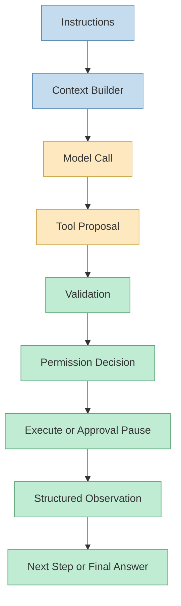
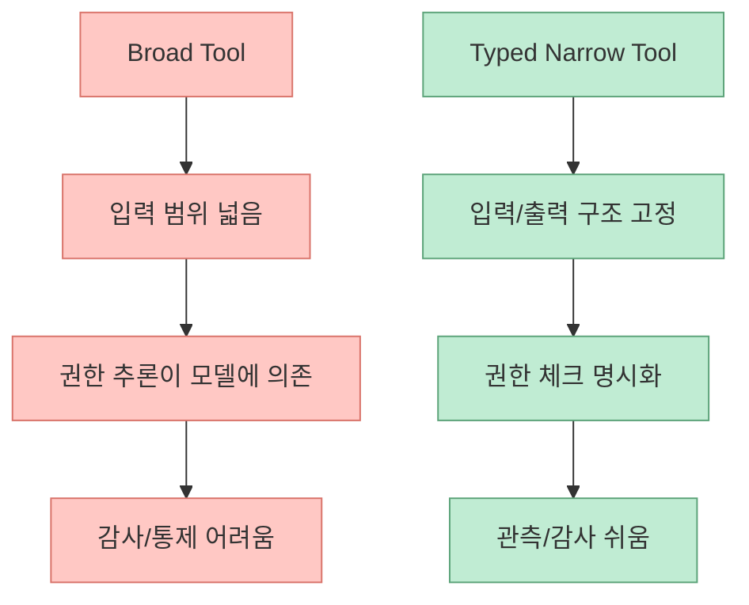
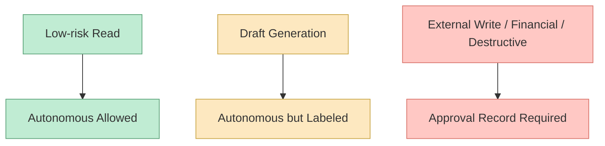
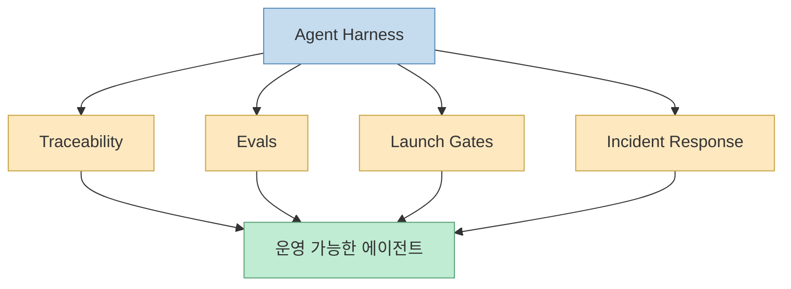

`agents-best-practices`는 얼핏 보면 또 하나의 “에이전트용 스킬 저장소”처럼 보일 수 있습니다. 하지만 README를 읽어 보면 이 프로젝트의 진짜 초점은 전혀 다릅니다. 이 저장소가 반복해서 강조하는 것은 **더 좋은 프롬프트 문구** 가 아니라, **모델 바깥에서 에이전트를 통제하는 하네스 규율** 입니다. 저장소 첫 문장에 가까운 슬로건도 이를 정확히 말합니다. 모델은 행동을 “제안”할 뿐이고, 하네스가 그것을 검증하고, 권한을 확인하고, 실행하고, 기록하고, 관찰값으로 되돌린다는 것입니다. [GitHub](https://github.com/DenisSergeevitch/agents-best-practices)
<!--more-->

이 관점이 중요한 이유는, 많은 에이전트 논의가 여전히 “어떤 모델을 쓰느냐”, “프롬프트를 얼마나 잘 쓰느냐”에 너무 많이 쏠려 있기 때문입니다. 반면 이 저장소는 문제를 다르게 자릅니다. 좋은 에이전트는 똑똑한 모델 하나로 생기는 것이 아니라, **권한 분리, typed tool, 계획 모드, 워크플로 분해, 메모리/컨텍스트 관리, 비용 통제, 관측 가능성, 평가 체계** 가 함께 맞물릴 때 비로소 생긴다는 것입니다. 이번 글에서는 그 구조를 하나씩 뜯어보겠습니다. [README](https://github.com/DenisSergeevitch/agents-best-practices)

## Sources

- https://github.com/DenisSergeevitch/agents-best-practices

## 1. 이 저장소가 전제하는 세계관: 모델은 중심이 아니라 루프의 한 부품이다

README는 이 저장소를 “provider-neutral Agent Skill”이라고 소개합니다. 즉 OpenAI, Anthropic, Codex, Claude Code 같은 특정 생태계에만 묶이지 않고, **에이전트 런타임이라면 공통으로 필요한 바깥쪽 제어면(control plane)** 에 초점을 둡니다. [README](https://github.com/DenisSergeevitch/agents-best-practices)

저자가 정리한 기본 루프는 다음과 같습니다.

- instructions
- context builder
- model call
- tool proposal
- validation
- permission decision
- execution or approval pause
- observation
- next step or final answer

이 순서가 중요한 이유는, 여기서 모델은 루프 전체의 주인이 아니라 **중간의 제안자(proposer)** 로만 위치하기 때문입니다.



이렇게 보면 에이전트 품질은 “모델이 똑똑한가”보다, **그 제안을 시스템이 어떻게 다루는가** 에 더 가깝습니다.

## 2. 핵심 원칙 하나: “하네스가 행동하고, 모델은 제안만 한다”

README의 철학 섹션에서 가장 중요한 문장은 첫 번째 원칙입니다. **The harness acts, not the model.** 즉 모델은 제안하지만, 실제 검증과 실행과 기록은 애플리케이션 코드나 런타임 계층이 맡아야 한다는 것입니다. [README](https://github.com/DenisSergeevitch/agents-best-practices)

이 원칙이 필요한 이유는 간단합니다. 모델은:

- 확률적이고
- 잘못된 추론을 할 수 있고
- 때때로 위험한 행동을 자연스럽게 제안할 수 있습니다

반면 런타임은:

- deterministic validation을 하고
- 권한 정책을 강제하고
- 로그와 감사 흔적을 남기고
- 실패를 구조화된 결과로 보존할 수 있습니다

즉 이 저장소는 에이전트의 “뇌”를 키우기보다, **손발을 통제하는 운영 계층을 먼저 세우라** 고 말합니다.

## 3. broad tool을 싫어하는 이유: `execute_anything`은 편하지만 위험하다

이 저장소는 아주 분명하게 broad tool을 경계합니다. README는 `execute_anything`, `send_message`, `write_database` 같은 도구를 노출하는 것을 반대합니다. 대신 각 행동을 narrow typed tool로 감싸라고 합니다. [README](https://github.com/DenisSergeevitch/agents-best-practices)

이 차이는 생각보다 큽니다.

- broad tool은 모델이 자유롭게 위험을 조합할 수 있게 하고
- typed tool은 허용된 입력과 출력, 실패 형태를 구조화합니다

예를 들어:

- `send_message`
- `run_command`
- `write_database`

같은 범용 도구는 작은 편의와 큰 위험을 동시에 줍니다.

반면:

- `read_account_profile`
- `draft_customer_email`
- `request_approval`

처럼 역할이 좁고 의미가 분명한 도구는, 에이전트가 실수할 수 있는 공간을 대폭 줄입니다.



즉 이 저장소는 도구 설계를 기능 노출 문제가 아니라, **위험 표면을 자르는 제품 설계 문제** 로 봅니다.

## 4. 위험도에 따라 루프가 바뀌어야 한다는 주장도 중요하다

README의 세 번째와 네 번째 원칙은 함께 읽어야 합니다.

- Risk changes the loop
- Draft and commit are separate

즉 모든 행동을 같은 방식으로 승인하면 안 되고, 특히 고위험 부작용은 **초안(draft)** 과 **커밋(commit)** 을 분리해야 한다는 것입니다. [README](https://github.com/DenisSergeevitch/agents-best-practices)

이 원칙은 실무에서 매우 중요합니다. 왜냐하면 읽기와 쓰기, 초안 작성과 실제 발송, 조회와 삭제는 전혀 다른 위험을 가지기 때문입니다.



이 접근은 “사람이 다 승인해야 한다”는 뜻이 아닙니다. 오히려 반대입니다. **낮은 위험은 과감히 자동화하되, 높은 위험은 구조적으로 다른 루프를 태운다** 는 뜻입니다.

## 5. 컨텍스트는 많이 넣는 것이 아니라 “구성하는 것”이라는 관점이 좋다

이 저장소는 `Context is built, not dumped` 라는 원칙을 둡니다. 즉 에이전트에게 많이 넣는다고 좋은 게 아니라, **필요한 것만 꺼내고 신뢰 경계를 표시하며, active state를 compaction 이후에도 유지할 수 있게 설계해야 한다** 고 말합니다. [README](https://github.com/DenisSergeevitch/agents-best-practices)

이건 최근 많은 에이전트 시스템이 겪는 문제와 맞닿습니다.

- 대화 맥락이 길어질수록 품질이 흔들리고
- compaction 후에는 승인 상태나 todo가 사라지고
- 외부 문서와 툴 출력이 뒤섞여 신뢰 경계가 흐려집니다

저장소는 이를 prompt engineering 문제가 아니라 **runtime memory design 문제** 로 봅니다.

즉 중요한 것은:

- plan
- approvals
- todos
- artifacts

같은 활성 상태를 그냥 채팅 로그 안에 묻어 두지 않는 것입니다.

## 6. long-running work에는 budgets가 제품 기능으로 들어가야 한다

README의 또 다른 핵심은 “Long-running work needs budgets”입니다. step, time, token, cost, tool-call budgets를 제품 일부로 보라고 합니다. [README](https://github.com/DenisSergeevitch/agents-best-practices)

이 말은 에이전트를 장난감에서 시스템으로 보는 관점 전환을 요구합니다. 대부분의 초기 에이전트 데모는 “되면 좋고, 오래 돌아도 괜찮고, 비용은 나중에 본다”는 감각이 강합니다. 하지만 운영 환경에서는:

- 언제 멈출지
- 어디서 사람에게 넘길지
- 얼마를 써도 되는지
- 몇 단계까지는 자동으로 갈지

가 모두 제품 정책입니다.

```mermaid
flowchart TD
    A["Task Start"] --> B["Step Budget"]
    B --> C["Time Budget"]
    C --> D["Token/Cost Budget"]
    D --> E["Tool-call Budget"]
    E --> F["Stop / Pause / Escalate"]

    classDef budget fill:#fde8c0,stroke:#c9a647,color:#333,stroke-width:1px;
    classDef end fill:#ffc8c4,stroke:#d9736a,color:#333,stroke-width:1px;

    class A,B,C,D,E budget;
    class F end;
```

이 원칙 덕분에 이 저장소는 “더 자율적인 에이전트”보다, **예산 안에서 움직이는 에이전트** 를 더 현실적인 목표로 둡니다.

## 7. planning mode와 workflow orchestration을 같은 문제로 묶는 것도 좋다

README는 planning mode, workflow orchestration, goal-like loops를 별도 주제로 나누면서도 하나의 축으로 다룹니다. 메시지는 명확합니다. 작은 작업은 단일 에이전트 MVP로 시작하고, 큰 작업은 측정된 실패가 있을 때만 분해하라는 것입니다. [README](https://github.com/DenisSergeevitch/agents-best-practices)

이 주장이 좋은 이유는, 최근 많은 시스템이 처음부터 multi-agent를 정답처럼 들고 나오기 때문입니다. 반면 이 저장소는:

- 먼저 single-agent MVP
- 그 다음 계획 모드
- 필요하면 workflow decomposition
- 마지막에 goal loop와 broader autonomy

같이 점진적으로 넓히라고 합니다.

즉 multi-agent는 출발점이 아니라, **실패를 측정한 뒤 도입하는 확장 수단** 입니다.

## 8. 관측 가능성과 eval이 마지막이 아니라 출시 조건이라는 점도 인상적이다

README는 observability, evals, launch gates, incident response를 하네스의 구성 요소로 아예 포함합니다. 또 use case 예시에서도 “trace review”, “no unapproved external sends”, “human acceptance on at least 80%” 같은 launch gate를 보여 줍니다. [README](https://github.com/DenisSergeevitch/agents-best-practices)

이건 매우 실무적인 태도입니다. 좋은 에이전트는 잘 답하는 에이전트가 아니라:

- 왜 그런 행동을 했는지 추적 가능하고
- 실패를 재현할 수 있고
- 위험 행동이 launch gate에 걸리고
- 사고가 나면 incident response가 가능한

시스템이어야 하기 때문입니다.



즉 이 저장소는 prompt recipe 모음이 아니라, **agent operations handbook** 에 더 가깝습니다.

## 9. 이 저장소가 좋은 이유는 “중립성”을 지키면서도 현실적인 구조를 제안한다는 점이다

`agents-best-practices`는 특정 벤더 락인 없이 Codex와 Claude Code 모두에 붙일 수 있는 skill 형태를 취합니다. 그리고 적용 범위도 coding agent에 한정하지 않고, research, support, operations, sales, finance, procurement, legal, healthcare, education까지 넓게 잡습니다. [README](https://github.com/DenisSergeevitch/agents-best-practices)

이 말은 결국 이런 뜻입니다.

- 좋은 에이전트 설계의 핵심은 모델 브랜드가 아니라
- 실행 루프, 권한 구조, 메모리, budgets, observability 같은
- **공통 런타임 규율** 에 있다는 것입니다

그래서 이 저장소는 툴 이름보다 원칙이 오래갑니다.

## 핵심 요약

- 이 저장소의 핵심 메시지는 “모델이 아니라 하네스가 행동을 통제한다”는 것이다.
- broad tool 대신 narrow typed tool을 써야 위험 표면을 줄일 수 있다.
- 읽기, 초안, 외부 쓰기, 재무, 파괴적 액션은 같은 루프로 처리하면 안 된다.
- 컨텍스트는 많이 넣는 게 아니라 필요한 상태를 구조적으로 유지하는 문제다.
- long-running agent에는 step/time/token/cost/tool-call budget이 제품 기능으로 들어가야 한다.
- multi-agent는 기본값이 아니라, single-agent MVP의 실패를 측정한 뒤 확장하는 수단이다.
- observability, evals, launch gate, incident response는 부가 기능이 아니라 운영 가능한 에이전트의 핵심이다.

## 결론

`agents-best-practices`가 좋은 이유는 “에이전트를 잘 만드는 법”을 막연한 프롬프트 감각으로 설명하지 않기 때문입니다. 이 저장소는 훨씬 더 냉정합니다. 모델은 제안할 뿐이고, 진짜 제품 품질은 하네스가 결정한다고 봅니다. 그래서 이 저장소는 스킬 저장소이면서 동시에, **좋은 에이전트는 더 똑똑한 모델이 아니라 더 엄격한 런타임 규율에서 나온다** 는 사실을 가장 또렷하게 설명하는 설계 참고서에 가깝습니다.
