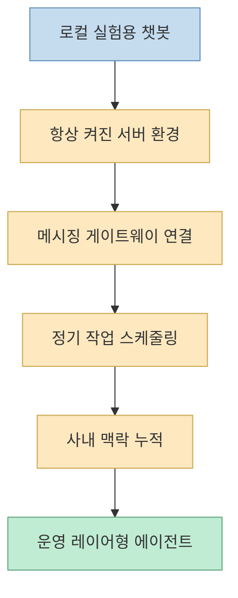
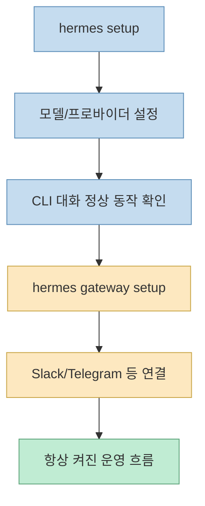
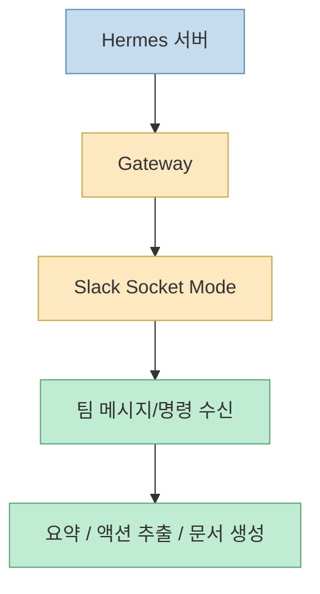
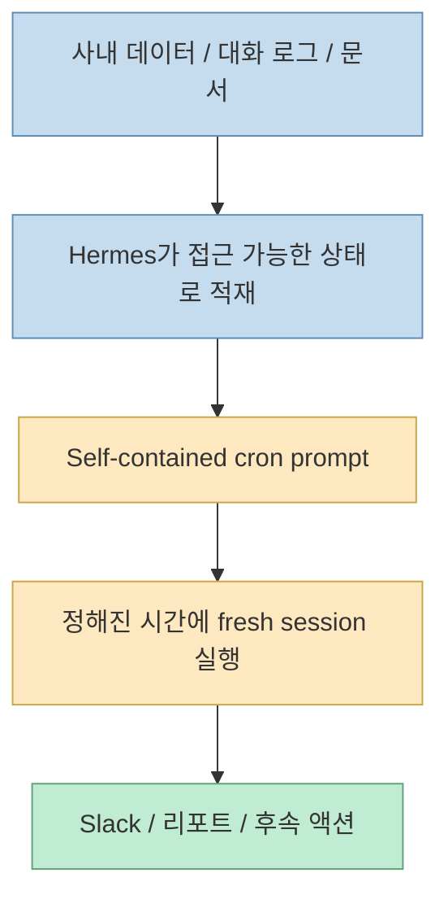
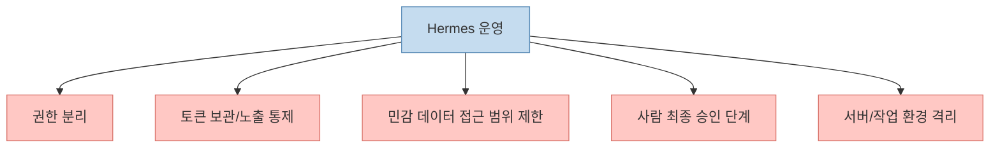

이 영상은 `Hermes Agent`를 단순히 “또 하나의 에이전트 앱”으로 소개하지 않습니다. 제목부터 설치, 연동, 회사 운영 자동화까지 한 번에 묶고 있고, 설명란도 매우 분명합니다. 핵심은 **Hermes를 개인 노트북 위의 실험용 챗봇이 아니라, 회사 운영 레이어 위에 항상 켜 두는 자가 개선형 에이전트로 세팅하는 법** 입니다. [YouTube](https://youtu.be/j5CIK1pcf3A) [Hermes README](https://github.com/NousResearch/hermes-agent)
<!--more-->

설명란과 공식 문서를 같이 보면 이 영상이 겨냥하는 독자는 명확합니다. “일단 설치는 했는데 실무 자동화까지 어떻게 이어야 하는지 모르겠다”는 사람입니다. 그래서 이 글에서는 영상을 설치 튜토리얼로만 보지 않고, **CLI → 게이트웨이 → Slack → cron → 사내 데이터 적재 → 보안 거버넌스** 로 이어지는 운영 경로로 재구성해 보겠습니다.

## Sources

- https://youtu.be/j5CIK1pcf3A?si=nhQGo_s1_o4rgRA4
- https://github.com/NousResearch/hermes-agent
- https://hermes-agent.nousresearch.com/docs/getting-started/quickstart
- https://hermes-agent.nousresearch.com/docs/user-guide/messaging/slack
- https://hermes-agent.nousresearch.com/docs/guides/automate-with-cron
- https://github.com/NousResearch/hermes-agent/issues/32883

## 1. 이 영상의 출발점은 “Hermes를 왜 노트북 밖으로 빼야 하느냐”다

영상 설명란은 처음부터 `원클릭 설치`, `월 1만원대`, `24시간 일하는 헤르메스 에이전트`, `회사 운영 레이어` 같은 표현을 전면에 둡니다. 이건 단순한 설치 편의성 홍보가 아닙니다. 발표자가 강조하는 전제는, **Hermes가 진짜 힘을 발휘하는 순간은 항상 켜져 있는 환경에서 스케줄과 메시징을 붙여 운영될 때** 라는 점입니다. [YouTube 설명란](https://youtu.be/j5CIK1pcf3A)

공식 README도 같은 방향을 말합니다. Hermes는 “노트북에 묶여 있지 않고”, Telegram·Discord·Slack 같은 채널에서 말을 걸 수 있으며, `$5 VPS`나 클라우드 환경에 띄워 둘 수 있다고 소개합니다. 또 built-in cron scheduler를 통해 “daily reports, nightly backups, weekly audits”를 자연어 기반으로 돌릴 수 있다고 명시합니다. [Hermes README](https://github.com/NousResearch/hermes-agent)

즉 Hermes의 본질은 “좋은 답변을 하는 모델 UI”가 아니라:

- 항상 켜져 있고
- 메시지를 받을 수 있고
- 정해진 시간에 스스로 움직이며
- 경험을 누적해 다음 작업에 반영하는

**장기 실행형 에이전트 운영 환경** 에 가깝습니다.

## 2. 입문자가 가장 먼저 알아야 할 것은 “CLI가 먼저, 게이트웨이는 나중”이라는 순서다

Hermes 공식 Quickstart 문서는 아주 현실적인 가이드를 줍니다. “bot or always-on setup”을 원하더라도, 먼저 CLI가 정상적으로 대화하는 상태를 만든 뒤에 `hermes gateway setup`으로 넘어가라고 안내합니다. 문서의 표현을 그대로 옮기면, **일반 채팅이 안 되는데 기능을 더 붙이지 말라** 는 규칙입니다. [Quickstart](https://hermes-agent.nousresearch.com/docs/getting-started/quickstart)

이 순서는 영상의 흐름과도 정확히 맞습니다.

1. 서버/VPS 환경을 준비한다  
2. Hermes를 설치한다  
3. 모델 제공자를 붙인다  
4. CLI 대화가 되는지 확인한다  
5. 그 다음에 Slack 같은 메시징 플랫폼을 연결한다  

초보가 여기서 자주 하는 실수는 반대입니다. 바로 Slack, cron, 메모리, 자가 개선을 한 번에 붙이려 합니다. 그런데 Quickstart는 그 접근을 분명히 막습니다. **베이스 채팅이 먼저 살아야 나머지 자동화가 의미가 있습니다.**

## 3. 왜 발표자는 VPS를 강조하는가: 자가 개선과 스케줄링은 “계속 살아 있는 런타임”을 전제로 한다

영상 설명란은 VPS를 “월 1만원대의 경제적인 비용으로 24시간 안정적으로 구동되는 서버 환경”으로 소개합니다. 여기서 핵심은 비용보다 **중단되지 않는 실행 환경** 입니다. [YouTube 설명란](https://youtu.be/j5CIK1pcf3A)

Hermes의 장점으로 자주 언급되는 것들은:

- scheduled tasks
- gateway를 통한 메시징 연속성
- session/search/memory 축적
- 자가 개선 스킬 루프

같은 기능들입니다. 이 중 대부분은 랩톱을 덮는 순간 죽어 버리는 환경과 궁합이 좋지 않습니다. 따라서 이 영상의 VPS 강조는 단순 스폰서 멘트가 아니라, **Hermes를 “생활권 안의 비서”가 아니라 “운영 시스템”으로 쓰려면 상시 가동 환경이 필요하다** 는 구조적 이유가 있습니다.

README도 Hermes를 `$5 VPS`, GPU cluster, serverless infrastructure 등 여러 백엔드에 둘 수 있다고 적습니다. 즉 공식 포지셔닝 자체가 “내 노트북의 로컬 도우미”보다 **상주형 에이전트** 쪽입니다. [Hermes README](https://github.com/NousResearch/hermes-agent)

## 4. Slack 연동은 왜 중요한가: Hermes의 진짜 UI가 CLI만이 아니기 때문이다

이 영상에서 Slack은 단순 알림 채널이 아닙니다. 회사 운영 레이어라는 말을 현실화하는 인터페이스입니다. 공식 Slack 문서도 Hermes를 “Socket Mode를 사용하는 Slack bot”으로 연결하는 방식을 설명하며, public URL 없이도 방화벽 뒤나 private server에서 동작할 수 있다고 적습니다. [Slack Docs](https://hermes-agent.nousresearch.com/docs/user-guide/messaging/slack)

여기서 중요한 포인트는 두 가지입니다.

첫째, **메신저가 곧 운영 포트** 라는 점입니다.  
CLI는 설정과 디버깅에 좋지만, 실제 조직에서는 사람들이 Slack 안에서 Hermes를 부르게 됩니다.

둘째, **Socket Mode 덕분에 외부에 HTTP 엔드포인트를 열지 않아도 된다** 는 점입니다.  
이건 초보 입장에서 큰 장점입니다. 복잡한 공개 서버 설정 없이도 private server 위 Hermes를 Slack과 연결할 수 있기 때문입니다.

Slack 문서는 또 manifest 기반 생성 경로를 권장합니다. `hermes slack manifest --write` 로 manifest를 만든 뒤 Slack 앱 생성 시 붙여 넣으면 slash commands, OAuth scope, event subscription, Socket Mode가 한 번에 세팅된다고 설명합니다. 영상 설명란이 “매니페스트 설정을 활용하면 복잡한 수동 권한 설정을 건너뛸 수 있다”고 적은 이유가 바로 이것입니다. [Slack Docs](https://hermes-agent.nousresearch.com/docs/user-guide/messaging/slack) [YouTube 설명란](https://youtu.be/j5CIK1pcf3A)

## 5. 이 영상에서 말하는 “회사 운영 자동화”는 사실 cron과 데이터 적재의 결합이다

설명란에서 가장 중요한 대목 중 하나는 “아침 브리핑, 회의록 액션 아이템 추출, 견적서 및 세금계산서 자동 발행” 같은 예시입니다. 이런 작업이 가능해지는 이유는 단순히 Hermes가 똑똑해서가 아닙니다. **정해진 시간에, 정해진 컨텍스트를 가지고, 정해진 채널로 결과를 내보내는 스케줄 구조** 가 있기 때문입니다. [YouTube 설명란](https://youtu.be/j5CIK1pcf3A)

공식 cron 가이드는 더 명확합니다. cron jobs는 fresh agent session에서 실행되므로, 현재 채팅의 기억을 물고 가지 않습니다. 그래서 프롬프트는 self-contained 해야 한다고 적습니다. [Cron Guide](https://hermes-agent.nousresearch.com/docs/guides/automate-with-cron)

이 문장은 굉장히 중요합니다. 초보는 자주 “에이전트가 알아서 문맥을 기억하겠지”라고 기대하지만, 스케줄 작업은 그렇지 않습니다. 따라서 실무 자동화는 보통 아래 둘이 함께 가야 합니다.

- 충분히 구체적인 cron 프롬프트
- 사내 데이터/대화록/문서를 읽을 수 있는 연결 경로

즉 운영 자동화의 실체는 “스마트한 답변”보다, **자급자족 가능한 작업 단위로 프롬프트와 데이터 접근을 묶어 두는 것** 입니다.

## 6. 그래서 영상 설명란의 “사가 개선”은 마법이 아니라 운영 루프다

설명란은 Hermes를 “매일 스스로 진화하는 자가 개선 시스템”이라고 부릅니다. README도 built-in learning loop, autonomous skill creation, session search, persistent knowledge 같은 표현을 씁니다. [YouTube 설명란](https://youtu.be/j5CIK1pcf3A) [Hermes README](https://github.com/NousResearch/hermes-agent)

여기서 오해하면 안 되는 점이 있습니다. 자가 개선은 버튼 한 번으로 지능이 폭증하는 마법이 아닙니다. 실제로는:

- 반복 업무가 계속 들어오고
- 그 결과와 맥락이 남고
- 다음번에 같은 유형 작업에서 재사용 가능한 형태로 축적되고
- 필요하면 스킬이나 메모리로 구조화되는

**폐쇄 루프형 운영** 에 가깝습니다.

즉 Hermes의 “성장”은 모델이 혼자 깨달음을 얻는다는 뜻보다는, **같은 조직 맥락에서 같은 작업을 오래 반복할수록 적합도가 올라간다** 는 뜻으로 읽는 편이 더 정확합니다.

## 7. 실무 예시가 중요한 이유: Hermes를 먼저 작게 붙여야 하기 때문이다

설명란이 제시하는 예시는 꽤 현실적입니다.

- 대표 전용 아침 브리핑
- 회의록 기반 액션 아이템 추출
- 견적서 초안/세금계산서 파이프라인
- 미응답 메일 확인과 답장 초안

이 예시들의 공통점은 “회사를 통째로 자동화한다”가 아니라, **한 사람이 매일 반복하지만 맥락 비용이 큰 일** 부터 줄인다는 점입니다. [YouTube 설명란](https://youtu.be/j5CIK1pcf3A)

이 접근이 좋은 이유는 Hermes를 처음 붙일 때 가장 위험한 실수가 “처음부터 만능 COO 에이전트”를 기대하는 것이기 때문입니다. 설명란의 핵심 요점도 결국 “간단한 아침 브리핑이나 견적서 초안 작성부터 시작해 점진적으로 업무 범위를 넓혀가라”로 요약됩니다. [YouTube 설명란](https://youtu.be/j5CIK1pcf3A)

즉 초보 입문 경로는 보통 이 순서가 더 안전합니다.

1. 매일 정해진 시각에 정보 요약  
2. 특정 채널 회의 내용에서 액션 추출  
3. 외부 시스템과 연동된 문서 생성 초안  
4. 최종 승인 포함 반자동 파이프라인  

이 순서를 밟아야 운영 리스크를 통제하면서 가치도 빨리 확인할 수 있습니다.

## 8. 보안 거버넌스를 빼면 Hermes는 오히려 위험해진다

이 영상 설명란이 좋은 이유는 마지막을 보안으로 마무리하기 때문입니다. 토큰 노출 금지, 운영 서버와 작업 서버 분리, 민감 정보 접근 인원 제한, 사람 승인 단계 마련 같은 조항이 적혀 있습니다. [YouTube 설명란](https://youtu.be/j5CIK1pcf3A)

이건 단순 경고문이 아닙니다. Hermes 같은 에이전트는:

- Slack 메시지를 읽고
- 문서를 만들고
- 일정 작업을 돌리고
- 외부 API를 호출하고
- 경우에 따라 고객 정보나 재무 정보에도 닿을 수 있기

때문에, 일반 챗봇보다 **권한 사고의 표면적이 넓습니다**.

그래서 운영 설계는 아래처럼 나눠 생각하는 편이 좋습니다.

Hermes를 “잘 돌아가게 만드는 법”과 “안전하게 굴리는 법”은 분리된 문제가 아닙니다. 오히려 항상 켜진 운영 레이어일수록 두 문제는 하나로 붙어 있습니다.

## 9. Codex 패치 링크가 의미하는 것: 초보 입문은 항상 현실적인 마찰을 동반한다

설명란에는 `Codex OAuth 패치 링크`로 GitHub issue 하나가 함께 실려 있습니다. 이건 사소해 보이지만, 실은 중요한 신호입니다. 입문 영상이 현실적인 이유는 “완성된 마법 제품”처럼 포장하지 않고, **실제 설치 과정에서 부딪히는 호환성·인증·패치 문제까지 작업의 일부로 인정한다** 는 데 있습니다. [Issue #32883](https://github.com/NousResearch/hermes-agent/issues/32883)

이 포인트는 Hermes 같은 빠르게 진화하는 에이전트 스택을 도입할 때 특히 중요합니다. README와 문서만 보고 한 번에 다 될 것이라 기대하기보다:

- 먼저 최소 경로를 통과하고
- 막히는 지점을 공식 이슈/문서로 해결하고
- 그 다음 메시징과 cron을 붙이고
- 마지막에 회사 데이터/승인 흐름을 연결하는

식으로 단계적으로 접근하는 편이 훨씬 안정적입니다.

## 핵심 요약

- 이 영상은 Hermes를 단순 챗봇이 아니라 **항상 켜진 회사 운영 레이어** 로 소개한다.
- 공식 Quickstart도 먼저 CLI 채팅을 살리고, 그 다음에 gateway와 Slack을 붙이라고 권장한다.
- Slack Socket Mode는 public URL 없이 private server에서도 동작해, 팀 운영 포트로 쓰기 좋다.
- cron 자동화는 현재 채팅 기억 없이 fresh session으로 돌기 때문에 프롬프트와 데이터 접근이 self-contained 해야 한다.
- 자가 개선은 마법이 아니라 반복 업무, 맥락 축적, 스킬 재사용으로 이어지는 운영 루프다.
- 실제 도입은 아침 브리핑 같은 작은 작업부터 시작하고, 마지막엔 권한·토큰·승인 중심의 보안 거버넌스를 반드시 붙여야 한다.

## 결론

이 영상을 “Hermes 설치법”으로만 보면 절반만 본 셈입니다. 더 본질적으로는, **에이전트를 회사 운영에 붙일 때 어떤 순서로 안전하게 확장해야 하는가** 를 보여 주는 영상입니다. 먼저 CLI를 살리고, 그다음 gateway와 Slack을 붙이고, cron과 데이터 적재를 통해 실무 루프를 만들고, 마지막에 보안 거버넌스로 감싸야 합니다. 결국 Hermes의 진짜 입문 장벽은 설치 자체보다, **에이전트를 운영 레이어로 올리는 사고방식** 을 갖추느냐에 더 가깝습니다.
