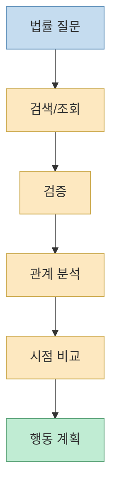
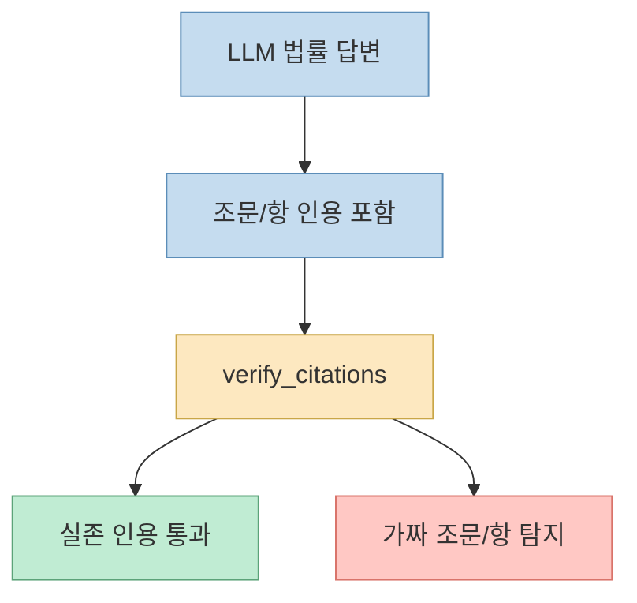
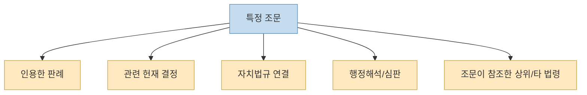
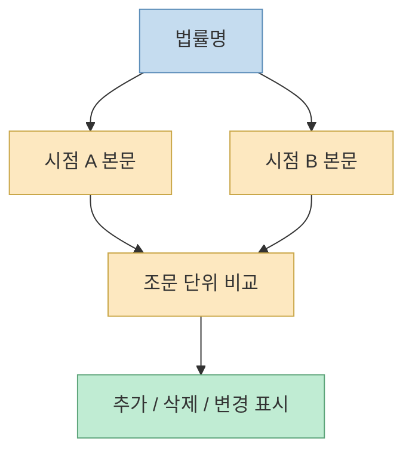
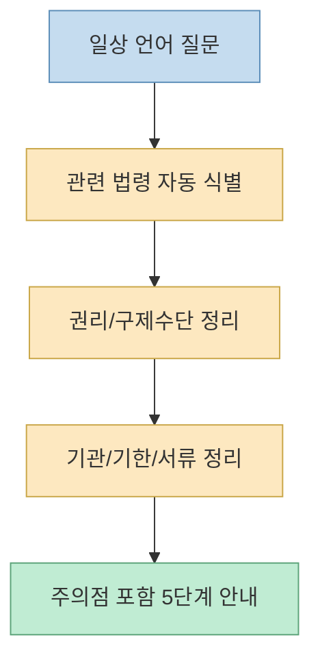
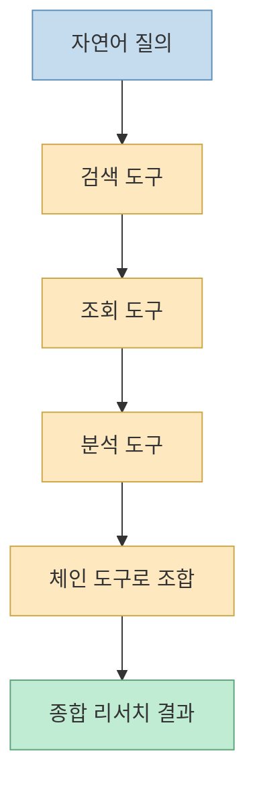
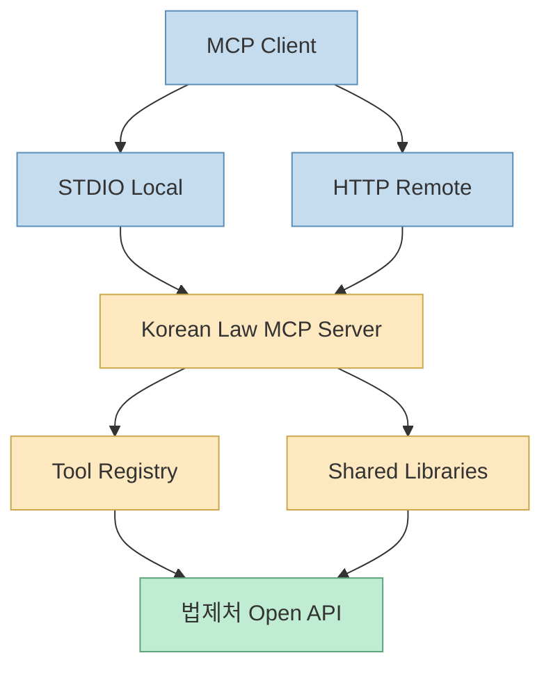

이 Threads 포스트의 제목은 `공공MCP 대마왕 류주임의 MCP 4종세트` 입니다. 다만 공개 메타데이터와 첨부 이미지 기준으로 직접 확인 가능한 카드 중 하나는 분명히 `Korean Law MCP`였습니다. 카드에는 `법제처 42 APIs → 17 MCP tools`, `verify_citations`, `impact_map`, `time_travel`, `action_plan` 같은 키워드가 크게 적혀 있습니다. 이 정보만 봐도 이 프로젝트가 단순 법령 검색기보다 **법률 질문을 실제 워크플로 수준으로 다루려는 MCP 서버** 에 가깝다는 점이 드러납니다. [Threads 원문](https://www.threads.net/@chris_gomdori/post/DZEiDtoicIU) [GitHub](https://github.com/chrisryugj/korean-law-mcp)
<!--more-->

공식 README를 읽어 보면 이 인상은 더 강해집니다. 저장소는 스스로를 "`법제처 42개 API를 17개 도구로`" 압축한 MCP 서버라고 소개하면서, 법령·판례·행정규칙·자치법규·조약·해석례뿐 아니라 **LLM 환각 방지 인용 검증**, **조문 영향 그래프**, **시점 비교 자동 diff**, **5단계 행동 안내** 까지 같은 인터페이스 안에 넣고 있습니다. 이 글에서는 왜 이 조합이 흥미로운지 하나씩 뜯어보겠습니다. [README](https://github.com/chrisryugj/korean-law-mcp)

## Sources

- https://www.threads.net/@chris_gomdori/post/DZEiDtoicIU
- https://github.com/chrisryugj/korean-law-mcp
- https://github.com/chrisryugj/korean-law-mcp/blob/main/docs/API.md
- https://github.com/chrisryugj/korean-law-mcp/blob/main/docs/ARCHITECTURE.md

## 1. 이 프로젝트의 핵심은 “검색 결과를 보여준다”가 아니라 “법률 질문을 작업 단위로 바꾼다”는 점이다

보통 법률용 MCP를 떠올리면 가장 먼저 생각나는 것은 “법령이나 판례를 검색해서 텍스트를 가져오는 도구”입니다. 그런데 `Korean Law MCP`의 README는 처음부터 방향을 다르게 잡습니다. 법제처 42개 API를 17개 도구로 줄였다고 소개하면서, 그 위에 `verify_citations`, `impact_map`, `time_travel`, `action_plan` 같은 **업무 목적형 도구** 를 전면에 둡니다. [README](https://github.com/chrisryugj/korean-law-mcp)

즉 이 프로젝트는 단순히 “원문 조회를 잘하게 해 준다” 보다는:

- 인용이 진짜 맞는지 확인하고
- 특정 조문이 어디로 퍼져 나가는지 보고
- 어느 시점에 문언이 어떻게 달랐는지 비교하고
- 실제 행동 계획으로 바꿔 주는

방향으로 설계되어 있습니다.

이 구조 덕분에 이 프로젝트는 “법률 데이터 접근 레이어”와 “법률 추론 보조 레이어”를 한꺼번에 노리는 도구처럼 보입니다.

## 2. `verify_citations`가 중요한 이유: 법률 AI의 가장 위험한 실패를 직접 겨냥한다

README에서 가장 강하게 눈에 띄는 기능은 `verify_citations` 입니다. 저장소는 이를 “LLM 환각 방지 인용 검증”이라고 부르고, 실제 예시로 실존 조문과 존재하지 않는 조문을 구분해 내는 시나리오를 보여 줍니다. 예를 들어:

- 실제 존재하는 조문은 통과시키고
- 존재하지 않는 항이나 조문 번호는 잡아내는

식의 검증 흐름을 설명합니다. [README](https://github.com/chrisryugj/korean-law-mcp)

이 기능이 중요한 이유는 법률 도메인에서 LLM의 가장 위험한 실패 모드가 **“그럴듯한 가짜 조문”** 이기 때문입니다. 일반 지식 분야에서는 약간의 부정확함이 불편 수준에 그칠 수 있지만, 법률에서는:

- 조문 번호 하나
- 항 번호 하나
- 적용 시점 하나

만 틀려도 결과가 완전히 달라질 수 있습니다.

즉 `verify_citations`는 단순 편의 기능이 아니라, **법률 AI를 실무에 가까이 가져가려면 반드시 필요한 신뢰도 방어벽** 으로 볼 수 있습니다.

## 3. `impact_map`은 “이 조문과 연결된 바깥세상”을 보여 주려는 시도다

README는 `impact_map`을 “조문 한 줄의 파급효과 그래프”라고 설명합니다. 특정 조문을 기준으로:

- 대법원 판례
- 헌재 결정
- 법령해석
- 행정심판
- 자치법규

같은 관련 자료를 **역방향 탐색** 하고, 반대로 그 조문이 인용하는 다른 법령까지 **정방향 탐색** 해서 Mermaid 그래프 코드까지 자동 생성한다고 적고 있습니다. [README](https://github.com/chrisryugj/korean-law-mcp)

이 기능이 흥미로운 이유는 법률 리서치에서 자주 부딪히는 병목이 “조문 텍스트는 찾았는데, 이게 실제로 어디에 영향을 미치는지 감이 안 온다”는 데 있기 때문입니다.

법률 정보는 원래부터 그래프적 성격이 강합니다. 조문은 조문을 참조하고, 판례는 조문을 해석하고, 자치법규는 상위법에 연결됩니다. `impact_map`은 이 관계망을 사람이 손으로 더듬지 않도록 **그래프 형태로 외부화** 하려는 시도라고 볼 수 있습니다.

## 4. `time_travel`은 법률 텍스트를 “시간축 위의 객체”로 다룬다

또 하나 중요한 기능은 `time_travel` 입니다. README는 이를 “두 시점 본문 자동 diff”라고 설명합니다. 사용자는 예를 들어 특정 법률의 2020년 시점과 2025년 시점을 지정해:

- 추가
- 삭제
- 변경

을 조문 단위로 자동 비교할 수 있습니다. [README](https://github.com/chrisryugj/korean-law-mcp)

이게 중요한 이유는 법률 질문의 상당수가 “지금 법”만 묻지 않기 때문입니다.

- 사고가 난 시점엔 어떤 문구였나
- 계약 체결 시점의 조항은 지금과 같았나
- 개정 전과 후에 리스크가 어떻게 달라졌나

같은 질문은 모두 시간축을 필요로 합니다.

즉 `time_travel`은 단순 신구법 비교 도구가 아니라, **법률을 정적인 문서가 아니라 시간에 따라 변하는 텍스트 객체로 다루는 인터페이스** 에 가깝습니다.

## 5. `action_plan`은 법률 리서치를 생활 언어의 행동 단계로 번역하려는 기능이다

README의 `action_plan` 예시는 아주 직접적입니다. `"전세금 못 받았어"` 같은 자연어 입력을 넣으면:

- 상황 진단
- 권리/구제수단
- 신청기관/기한
- 필요서류/양식
- 함정/주의점

같은 5단계 실행 안내로 바꿔 준다고 설명합니다. [README](https://github.com/chrisryugj/korean-law-mcp)

이게 흥미로운 이유는, 대부분의 법률용 도구가 “정확한 검색”까지만 잘하고 끝나는 경우가 많기 때문입니다. 하지만 실제 사용자는 보통:

- 무슨 조문을 찾아야 하는지 모르고
- 어떤 기관을 먼저 가야 하는지 모르고
- 어떤 순서로 움직여야 하는지 모릅니다

즉 `action_plan`은 법률 검색 결과를 **실행 가능한 절차 언어** 로 번역하는 층입니다.

그래서 이 프로젝트는 법률 전문가만을 위한 도구라기보다, **법률 질의를 더 실무적이고 절차적인 형태로 바꾸려는 시도** 로도 읽힙니다.

## 6. 도구 수보다 더 중요한 건 “체인 도구”와 분류 구조다

`docs/API.md`를 보면 이 프로젝트는 검색, 조회, 분석, 전문 판례/해석, 헌재·행심·위원회, 지식베이스, 조약, 학칙/공단/공공기관, 특별행정심판 등으로 도구를 넓게 나눠 두고 있습니다. 그리고 그 위에 `chain_full_research`, `chain_dispute_prep`, `chain_procedure_detail`, `chain_document_review` 같은 체인 도구를 둡니다. [API.md](https://github.com/chrisryugj/korean-law-mcp/blob/main/docs/API.md)

이 구조가 중요한 이유는, 실제 법률 질문이 보통 한 번의 조회로 끝나지 않기 때문입니다.

- 법령 찾기
- 관련 조문 보기
- 판례 확인
- 해석례나 행정심판 확인
- 필요하면 별표/서식까지 보기

같은 다단계 흐름이 흔합니다.

즉 이 프로젝트의 경쟁력은 “도구가 많다” 자체보다, **법률 리서치의 실제 단계들을 조합 가능한 작업 흐름으로 만들었다** 는 데 있습니다.

## 7. 아키텍처 문서를 보면, 이 프로젝트는 로컬 MCP와 원격 HTTP 양쪽을 모두 의식한다

`ARCHITECTURE.md`는 상위 구조를 꽤 선명하게 설명합니다. MCP client가 STDIO mode 또는 HTTP mode로 서버에 붙고, 서버는 툴 레지스트리와 공용 라이브러리 위에서 법제처 Open API를 호출합니다. 또 stateless HTTP, AsyncLocalStorage 기반 요청별 API 키 격리, retry/backoff, dual interface(MCP 서버 + CLI)를 핵심 원칙으로 적고 있습니다. [ARCHITECTURE.md](https://github.com/chrisryugj/korean-law-mcp/blob/main/docs/ARCHITECTURE.md)

이 점은 실무적으로 꽤 중요합니다. 왜냐하면 많은 MCP 프로젝트가 “개인 로컬 환경에서 Claude Desktop에 붙이는 데모” 수준에 머무르는데, 이 프로젝트는:

- 로컬 STDIO
- 원격 HTTP
- Docker
- Fly.io 같은 remote deployment

를 동시에 염두에 두고 있기 때문입니다.

즉 이 저장소는 단순히 “법제처 API를 한 번 감싼 스크립트”가 아니라, **여러 AI 클라이언트와 배포 모드에서 쓸 수 있는 법률 도메인 전용 서버** 로 자신을 포지셔닝하고 있습니다.

## 8. Threads의 “MCP 4종세트”는 흥미롭지만, 이번 글은 확인 가능한 1차 소스에만 기대고 있다

여기서 한 가지는 분명히 해야 합니다. Threads 원문은 `MCP 4종세트`라고 적고 있지만, 공개 메타데이터와 공개 이미지에서 제가 직접 확인할 수 있었던 것은 `Korean Law MCP` 카드였습니다. 카드에는:

- `법제처 42 APIs → 17 MCP tools`
- `verify_citations`
- `impact_map`
- `time_travel`
- `action_plan`

이 분명히 보였습니다. 하지만 다른 3종 세트의 정확한 이름과 원본 링크는 공개 접근 범위에서 확인되지 않았습니다. 따라서 이번 글은 그 부분을 추측하지 않고, **공식 GitHub 소스로 검증 가능한 `korean-law-mcp`에만 초점을 맞췄습니다**. [Threads 원문](https://www.threads.net/@chris_gomdori/post/DZEiDtoicIU)

## 핵심 요약

- `Korean Law MCP`는 단순 법령 검색 MCP보다 넓은 문제를 겨냥한다.
- 핵심 차별점은 `verify_citations`, `impact_map`, `time_travel`, `action_plan` 같은 법률 워크플로 특화 기능이다.
- `verify_citations`는 법률 AI의 가장 위험한 실패인 가짜 조문/가짜 항 문제를 직접 겨냥한다.
- `impact_map`은 조문과 판례·헌재·조례·해석의 연결망을 그래프로 외부화한다.
- `time_travel`은 법률을 시점별 diff 가능한 시간축 객체로 다룬다.
- `action_plan`은 생활 언어의 문제를 실제 행동 단계로 번역한다.
- API 문서와 아키텍처 문서를 보면, 이 프로젝트는 법률 리서치 전체를 체인 가능한 MCP 서버로 만들려는 방향이 강하다.

## 결론

`Korean Law MCP`가 흥미로운 이유는 “법제처 API를 MCP로 감쌌다”에서 끝나지 않기 때문입니다. 더 중요한 것은, **법률 AI가 실제로 부딪히는 실패와 작업 흐름을 정면으로 모델링하려고 한다** 는 점입니다. 인용 검증으로 환각을 막고, 영향 그래프로 관계를 드러내고, 시점 비교로 시간축을 복원하고, 행동 계획으로 실행 단계를 제시합니다. 그래서 이 프로젝트는 단순 데이터 접근 서버보다, **법률 도메인에 맞춘 실무형 MCP 설계가 어디까지 갈 수 있는지 보여 주는 사례** 로 읽을 만합니다.
