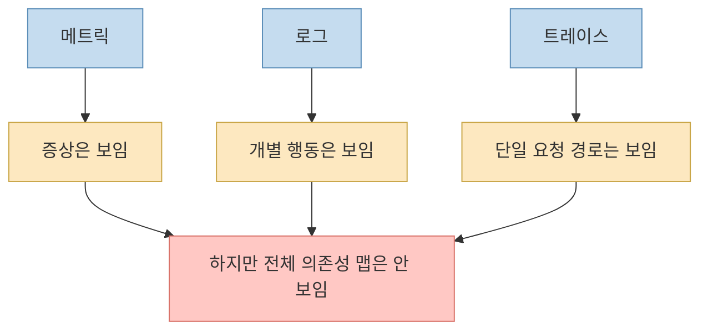
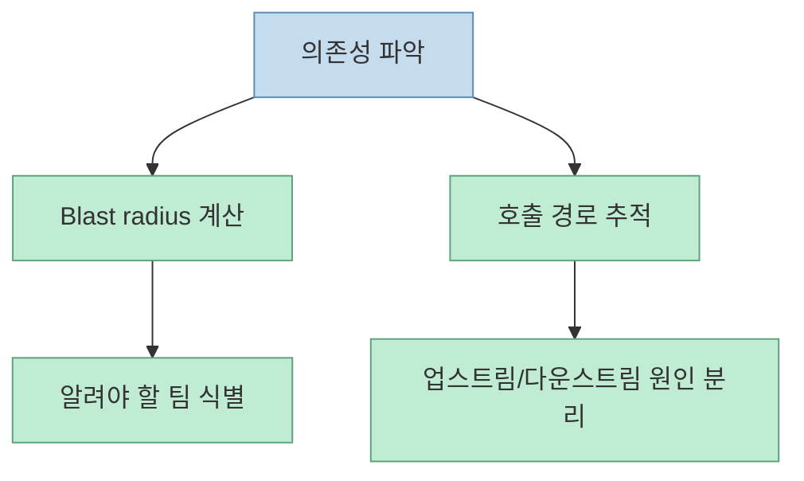
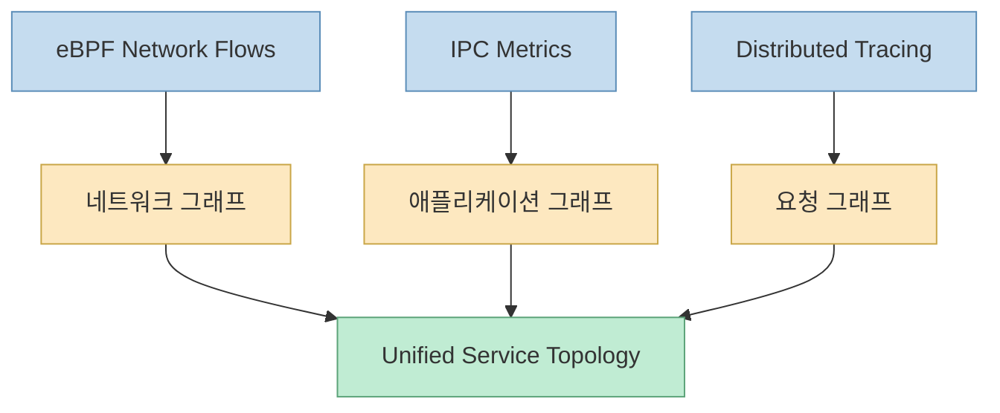
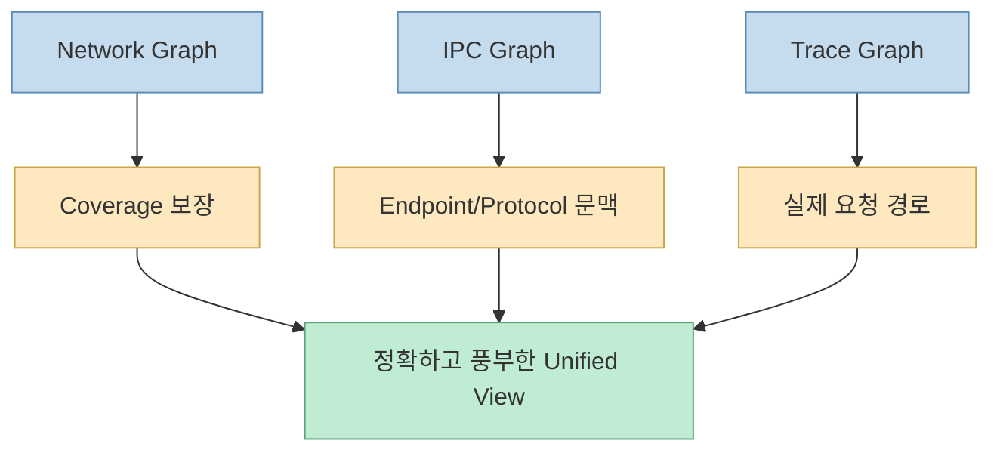
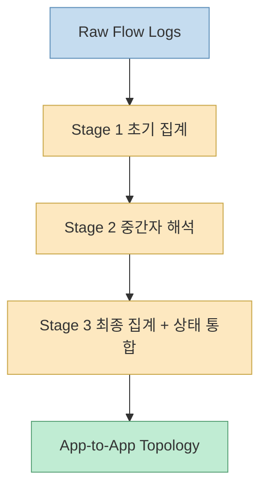
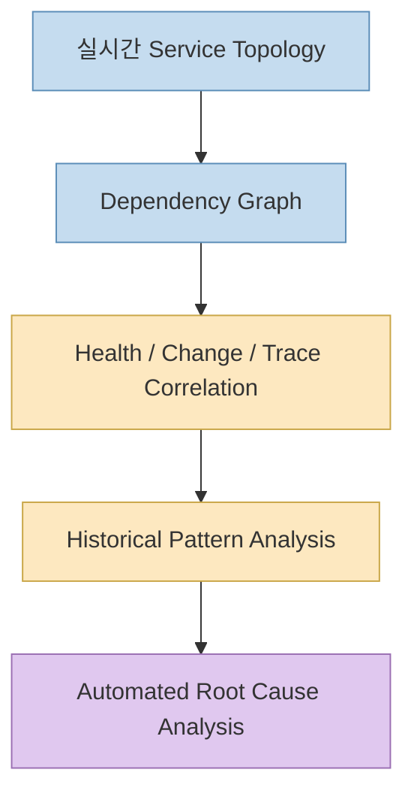

넷플릭스의 새 글은 단순히 “멋진 토폴로지 UI를 만들었다”는 얘기가 아닙니다. 이 글이 말하는 문제의식은 더 근본적입니다. **로그, 메트릭, 트레이스가 다 있어도, 엔지니어는 새벽 3시에 여전히 “무엇이 누구와 연결돼 있는가”를 빠르게 답하지 못한다** 는 것입니다. 그래서 넷플릭스는 정적 설계 문서가 아니라, 실제 트래픽을 바탕으로 계속 갱신되는 **실시간 서비스 의존성 지도** 를 따로 만들었습니다. [Netflix TechBlog](https://netflixtechblog.com/from-silos-to-service-topology-why-netflix-built-a-real-time-service-map-0165ba13a7bc)
<!--more-->

이 글이 흥미로운 이유는, “관측 가능성 도구를 더 많이 붙였다”가 아니라 **관측 데이터 위에 새로운 질의 계층을 올렸다** 는 점입니다. 넷플릭스는 eBPF 기반 네트워크 플로우, 애플리케이션의 IPC 메트릭, 엔드투엔드 분산 트레이싱을 각각 별도 그래프로 만들고, 필요할 때 병렬로 질의해서 하나의 통합 서비스 토폴로지로 합칩니다. 이 글에서는 그 설계가 왜 필요했는지, 세 소스가 어떻게 서로의 약점을 메우는지, 그리고 왜 이것이 앞으로 자동 RCA 같은 지능형 운영으로 이어질 수 있는지 정리하겠습니다.

## Sources

- https://netflixtechblog.com/from-silos-to-service-topology-why-netflix-built-a-real-time-service-map-0165ba13a7bc

## 1. 문제는 데이터가 없는 게 아니라, 연결 관계를 한 번에 볼 수 없다는 데 있었다

넷플릭스는 글의 첫 장면을 새벽 3시 온콜 상황으로 시작합니다. 어떤 핵심 서비스의 에러율이 치솟고, 사용자 경험이 나빠지고, 엔지니어는 빠르게 세 가지를 알고 싶어 합니다.

- 누가 누구에게 의존하는가
- 이 장애의 blast radius는 어디까지인가
- 근본 원인은 내 서비스인가, 업스트림인가

넷플릭스의 진단은 명확합니다. 기존 observability 도구는 각각 조각만 보여 줍니다.

- 메트릭은 증상과 성능 특성을 보여 주고
- 로그는 개별 서비스의 행동을 보여 주고
- 트레이스는 단일 요청 흐름을 보여 주지만

**정상 상태에서 서비스들이 어떻게 연결돼 있는지 보여 주는 지속적 토폴로지 맵** 은 없었습니다. [Netflix TechBlog](https://netflixtechblog.com/from-silos-to-service-topology-why-netflix-built-a-real-time-service-map-0165ba13a7bc)

즉 넷플릭스가 풀려는 문제는 “더 많은 텔레메트리를 수집하자”가 아니라, **이미 있는 텔레메트리를 서비스 관계의 지도라는 형태로 다시 조직하자** 는 쪽에 가깝습니다.

## 2. 넷플릭스가 정의한 핵심 질문은 세 가지였다

글은 엔지니어가 분산 시스템을 다룰 때 근본적으로 묻는 질문을 세 가지로 정리합니다.

1. 어떤 서비스가 서로 의존하는가  
2. 무엇이 영향을 받는가  
3. 문제의 근원은 어디인가  

이 세 질문은 서로 다른 것처럼 보이지만, 사실 하나의 토폴로지 문제입니다.

- 의존성을 알아야 blast radius를 계산할 수 있고
- blast radius를 알아야 누구에게 알릴지 결정할 수 있으며
- 호출 그래프를 따라가야 장애 전파와 근본 원인을 분리할 수 있습니다

이 때문에 넷플릭스는 서비스 토폴로지를 “멋진 시각화”로 취급하지 않습니다. 글 전체의 톤을 보면, 이건 **새벽 장애 대응과 변경 계획 수립을 위한 운영 도구** 입니다.

## 3. 왜 지금 이런 맵이 더 중요해졌는가: 라이브와 광고가 요구하는 운영 속도가 달라졌기 때문이다

넷플릭스는 자사 시스템이 수천 개의 마이크로서비스로 구성되어 있고, 사용자가 재생 버튼을 누르면 인증, 추천, 인코딩 선택, 재생 최적화 등 여러 서비스 호출이 연쇄적으로 일어난다고 설명합니다. 이런 구조는 팀별 독립성을 높여 주지만, 동시에 observability 난도를 급격히 올립니다. [Netflix TechBlog](https://netflixtechblog.com/from-silos-to-service-topology-why-netflix-built-a-real-time-service-map-0165ba13a7bc)

특히 글은 최근의 Live 프로그램과 광고 지원 플랜이 이 문제를 더 날카롭게 만들었다고 말합니다.

- 라이브 이벤트는 긴 조사 시간을 허용하지 않고
- 광고 시스템은 더 많은 실시간 연동을 요구하며
- 규모와 실시간성이 모두 높아졌기 때문에

기존보다 훨씬 빠른 dependency reasoning이 필요해졌다는 것입니다.

즉 이 프로젝트는 단순한 내부 개선이 아니라, **제품 구조 변화가 운영 도구의 성격까지 바꾼 사례** 로도 볼 수 있습니다.

## 4. 넷플릭스가 얻은 가장 중요한 교훈: 단일 소스의 진실은 없었다

글에서 가장 중요한 문장은 “no single source tells the complete story”에 가깝습니다. 넷플릭스는 여러 해에 걸쳐 외부 그래프 DB, 벤더 플랫폼, 내부 프로토타입을 검토하며 몇 가지 교훈을 얻었다고 정리합니다.

- 실시간성이 중요하다
- 넷플릭스 스케일에서는 많은 솔루션이 벽에 부딪힌다
- 기존 observability 생태계와 자연스럽게 통합돼야 한다
- 불완전하거나 잘못된 dependency 정보는 없는 것보다 더 나쁘다
- 하나의 데이터 소스로는 전체 맥락을 담을 수 없다

이 마지막 교훈이 핵심입니다. 네트워크 데이터는 애플리케이션 맥락이 약하고, 애플리케이션 메트릭은 계측된 서비스에만 국한되며, 트레이싱은 샘플링 때문에 희소한 경로를 놓칠 수 있습니다. [Netflix TechBlog](https://netflixtechblog.com/from-silos-to-service-topology-why-netflix-built-a-real-time-service-map-0165ba13a7bc)

## 5. 그래서 넷플릭스는 세 개의 “진실 소스”를 따로 그래프로 만들었다

넷플릭스의 접근은 세 가지 독립된 관점에서 그래프를 만드는 것입니다.

1. eBPF network flows  
2. IPC metrics  
3. end-to-end tracing  

그리고 이 세 그래프를 각각 독립적으로 탐색할 수도 있고, 요청 시 병렬로 질의해 하나의 unified view로 합칠 수도 있게 만들었습니다. [Netflix TechBlog](https://netflixtechblog.com/from-silos-to-service-topology-why-netflix-built-a-real-time-service-map-0165ba13a7bc)

이 설계의 좋은 점은, 하나의 거대한 “정답 그래프”에 모든 것을 억지로 욱여넣지 않고 **관점별 그래프를 독립적으로 유지한다** 는 데 있습니다. 덕분에 레이어별 저장 전략과 질의 방식도 다르게 최적화할 수 있습니다.

## 6. 첫 번째 레이어: eBPF 네트워크 플로우는 “빠짐없이 본다”는 강점이 있다

eBPF 기반 네트워크 플로우 레이어는 커널 수준에서 실제 네트워크 연결을 포착합니다. 어떤 서비스가 어떤 서비스의 IP에 어떤 프로토콜로 연결했는지 알 수 있기 때문에, 이 레이어의 가장 큰 장점은 **포괄성** 입니다. 계측이 안 된 서비스도 실제 네트워크 통신만 있으면 보입니다. [Netflix TechBlog](https://netflixtechblog.com/from-silos-to-service-topology-why-netflix-built-a-real-time-service-map-0165ba13a7bc)

하지만 한계도 분명합니다. 네트워크 수준에서는:

- 어느 API endpoint가 호출됐는지
- `/api/v1/users`였는지 `/api/v1/orders`였는지
- 어떤 비즈니스 의미를 가진 호출이었는지

같은 애플리케이션 문맥이 부족합니다.

즉 eBPF 레이어는 **completeness는 높지만 semantic richness는 낮은** 소스입니다.

## 7. 두 번째 레이어: IPC 메트릭은 “무슨 API를 어떻게 호출했는가”를 보여 준다

IPC 메트릭은 서비스가 gRPC, GraphQL, REST 같은 프로토콜로 다른 서비스를 호출할 때 내보내는 애플리케이션 계층 메트릭입니다. 이 레이어의 장점은:

- 어떤 endpoint가 호출됐는지
- 에러율과 latency 분포가 어떤지
- 어떤 프로토콜을 썼는지

같은 **풍부한 애플리케이션 문맥** 을 제공한다는 점입니다. [Netflix TechBlog](https://netflixtechblog.com/from-silos-to-service-topology-why-netflix-built-a-real-time-service-map-0165ba13a7bc)

하지만 한계는 계측 의존성입니다. 계측되지 않은 서비스는 여기서 보이지 않습니다.

즉 IPC 레이어는 **문맥은 풍부하지만 coverage는 부분적** 인 소스입니다.

## 8. 세 번째 레이어: 분산 트레이싱은 “실제로 어떤 요청이 그 경로를 탔는가”를 보여 준다

트레이싱 레이어는 요청이 시스템을 통과한 실제 경로를 보여 줍니다. 넷플릭스는 이를 단순 개별 trace 조회에 그치지 않고, trace를 집계해 topology graph를 만들면서 동시에 individual trace overlay도 가능하게 했다고 설명합니다. [Netflix TechBlog](https://netflixtechblog.com/from-silos-to-service-topology-why-netflix-built-a-real-time-service-map-0165ba13a7bc)

이 레이어의 장점은:

- Service A가 Service B를 “호출할 수 있다”가 아니라
- 특정 사용자 요청에서 “실제로 호출했다”

를 보여 준다는 점입니다.

하지만 샘플링 한계 때문에 모든 경로를 다 담을 수는 없습니다. 드물게 쓰이는 코드 경로는 빠질 수 있습니다.

즉 tracing 레이어는 **runtime truth는 강하지만 exhaustive truth는 약한** 소스입니다.

## 9. 세 레이어를 합치면, 각자의 약점이 서로를 메운다

넷플릭스의 설명을 한 줄로 요약하면 이렇습니다.

- network graph는 completeness를 보장하고
- IPC graph는 endpoint와 protocol 문맥을 채우며
- trace graph는 실제 요청 행동을 보여 준다

이 셋을 합치면 “무엇이 존재하는가”, “어떻게 호출되는가”, “실제로 어떤 요청이 지나갔는가”를 한 프레임 안에서 볼 수 있습니다. [Netflix TechBlog](https://netflixtechblog.com/from-silos-to-service-topology-why-netflix-built-a-real-time-service-map-0165ba13a7bc)

이 방식은 “단일 지표로 진실을 대표시키려는 집착”보다 훨씬 현실적입니다. 분산 시스템의 의존성은 원래 다층적이기 때문에, 넷플릭스는 **토폴로지도 다층적으로 유지** 하기로 한 셈입니다.

## 10. 구현에서 가장 흥미로운 부분: 네트워크 홉을 애플리케이션 관계로 다시 복원한다

넷플릭스는 네트워크 플로우 로그가 그대로는 앱 관계를 보여 주지 못한다고 설명합니다. 실제 로그는 종종:

- App A → Load Balancer → App B
- App A → NAT Gateway → App B

같은 개별 홉만 보여 줍니다. 하지만 엔지니어가 알고 싶은 것은 중간 장비가 아니라 **실제 앱 대 앱 관계** 입니다. [Netflix TechBlog](https://netflixtechblog.com/from-silos-to-service-topology-why-netflix-built-a-real-time-service-map-0165ba13a7bc)

그래서 넷플릭스는 3단계 분산 집계 파이프라인을 둡니다.

1. Kafka에서 초기 집계  
2. intermediary resolution  
3. 최종 집계 + health status 통합  

2단계가 핵심인데, 여기서 load balancer, NAT gateway, API gateway, proxy 같은 중간자를 식별해 incoming/outgoing flow를 결합하고, **직접적인 애플리케이션 관계를 재구성** 합니다.

이 부분이 특히 중요한 이유는, 서비스 맵이 유용하려면 단순한 네트워크 관측을 넘어 **사람이 이해할 수 있는 서비스 관계로 환원** 되어야 하기 때문입니다.

## 11. 저장과 질의 계층도 토폴로지용으로 따로 설계됐다

넷플릭스는 그래프를 자사 graph database abstraction 위에 저장하고, 빠른 multi-hop traversal을 지원한다고 설명합니다. 그리고 gRPC API를 통해:

- multi-hop traversal
- availability tier / business domain 필터링
- pagination
- sub-second query

를 제공한다고 말합니다. [Netflix TechBlog](https://netflixtechblog.com/from-silos-to-service-topology-why-netflix-built-a-real-time-service-map-0165ba13a7bc)

이건 단순한 뷰어가 아니라 **topology as a query service** 에 더 가깝습니다. 실제로 글은 Platform Modernization Engineering 팀이 이 gRPC API를 programmatic하게 써서 critical Live 서비스의 availability tier classification을 dependency chain 전반에서 검증한다고 설명합니다.

즉 이 토폴로지는 사람이 화면에서 보는 것뿐 아니라, **자동화된 시스템이 의존성 정보를 호출하는 운영 API** 이기도 합니다.

## 12. 사용자 경험 관점에서 보면, 이 맵이 해 주는 일은 “새 도구”가 아니라 “새 시작점”이다

넷플릭스는 엔지니어가 지금 이 토폴로지 맵으로 할 수 있는 일을 꽤 구체적으로 적습니다.

- upstream/downstream dependency 시각화
- logs / traces / detailed metrics로 점프
- blast radius 이해
- health status overlay
- gRPC API로 programmatic query
- incident 시 local failure vs propagated failure 구분
- architectural change planning
- 과거 시점 topology 조회

여기서 특히 중요한 것은 두 번째입니다. 토폴로지가 모든 것을 대체하는 것이 아니라, **다른 도구들로 가는 더 좋은 출발점** 을 제공합니다. [Netflix TechBlog](https://netflixtechblog.com/from-silos-to-service-topology-why-netflix-built-a-real-time-service-map-0165ba13a7bc)

즉 엔지니어는 이제:

- 먼저 토폴로지에서 관계를 보고
- 그다음 올바른 서비스와 시점으로 점프해
- 로그/트레이스/메트릭을 더 깊게 파는

방식으로 움직일 수 있습니다.

## 13. “Time Travel Through Topology”가 특히 중요하다

글 후반의 time travel capability는 아주 흥미롭습니다. 특정 시점의 topology가 어땠는지 다시 질의하고, 이슈가 시작되기 전후 dependency 변화가 무엇이었는지 볼 수 있게 하겠다는 것입니다. 넷플릭스는 이를 위해 모든 시간 슬라이스를 그대로 저장하는 대신, **time-window aggregation** 을 사용해 layer-specific aggregator가 윈도우 단위로 topology 데이터를 누적한다고 설명합니다. [Netflix TechBlog](https://netflixtechblog.com/from-silos-to-service-topology-why-netflix-built-a-real-time-service-map-0165ba13a7bc)

이건 매우 실용적인 선택입니다. 역사 전체를 초세밀하게 다 저장하면 비용이 폭증합니다. 반대로 이 기능이 없으면 “무엇이 최근 바뀌었는가”를 dependency 맥락에서 볼 수 없습니다.

즉 넷플릭스는 time travel을 토폴로지의 부가 기능이 아니라, **장애 전후 변화를 설명하는 핵심 메커니즘** 으로 보고 있습니다.

## 14. 이 글의 가장 큰 암시는 “자동 RCA를 위한 지식 그래프 기초”다

넷플릭스가 마지막에 슬쩍 던지는 가장 큰 메시지는 이것입니다. 앞으로는 topology graph를 지속적으로 순회하면서:

- dependency 간 failure correlation을 보고
- historical pattern을 이해하고
- likely root cause를 surface하는

자동 RCA 에이전트를 상상하고 있다는 것입니다. 그리고 service topology가 그 지식 그래프 기반을 제공한다고 말합니다. [Netflix TechBlog](https://netflixtechblog.com/from-silos-to-service-topology-why-netflix-built-a-real-time-service-map-0165ba13a7bc)

이 대목은 단순한 비전 제시가 아닙니다. 최근 많은 AI 운영 도구가 “근거가 되는 그래프가 없어서” 진짜 RCA까지 못 가고 요약 단계에 머무르는 경우가 많습니다. 넷플릭스는 먼저 **정확한 서비스 관계 그래프를 만드는 일** 을 자동 RCA의 선결 조건으로 본 셈입니다.

## 핵심 요약

- 넷플릭스는 로그·메트릭·트레이스가 이미 있어도, 서비스 간 정상 상태 의존성을 한눈에 보여 주는 토폴로지 계층이 필요하다고 봤다.
- 핵심 질문은 의존성, blast radius, 근본 원인 세 가지였고, 이는 모두 서비스 관계 그래프 문제로 연결된다.
- 단일 데이터 소스로는 충분하지 않아서, eBPF 네트워크 플로우, IPC 메트릭, 분산 트레이싱의 세 레이어를 각각 그래프로 만들었다.
- network graph는 coverage, IPC graph는 애플리케이션 문맥, trace graph는 실제 요청 경로를 제공한다.
- 중간 네트워크 홉을 앱 관계로 복원하기 위해 3단계 집계 파이프라인과 intermediary resolution 로직을 뒀다.
- 토폴로지는 UI뿐 아니라 gRPC API로도 제공되어 자동화된 시스템이 programmatic하게 활용할 수 있다.
- 역사적 topology를 재구성하는 time travel capability와, 그 위의 automated RCA가 다음 목표로 제시된다.

## 결론

이 글의 핵심은 “넷플릭스도 서비스 맵을 그렸다”가 아닙니다. 더 중요한 것은, **관측 도구들의 조각난 시야 위에 관계 그래프라는 새로운 운영 레이어를 추가했다** 는 점입니다. 분산 시스템이 커질수록 중요한 것은 더 많은 로그가 아니라, 그 로그와 메트릭과 트레이스를 어디에 걸어 해석할 것인가입니다. 넷플릭스의 실시간 서비스 토폴로지는 그 해석의 중심축을 서비스 관계 그래프로 옮긴 사례이고, 그래서 앞으로의 자동 RCA나 변화 영향 분석 같은 지능형 운영의 바탕으로도 매우 설득력 있어 보입니다.
