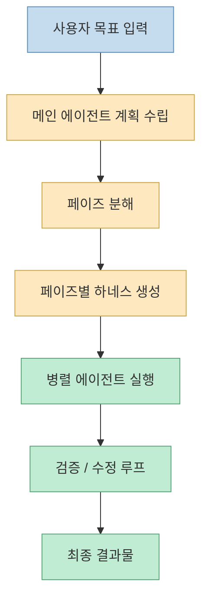
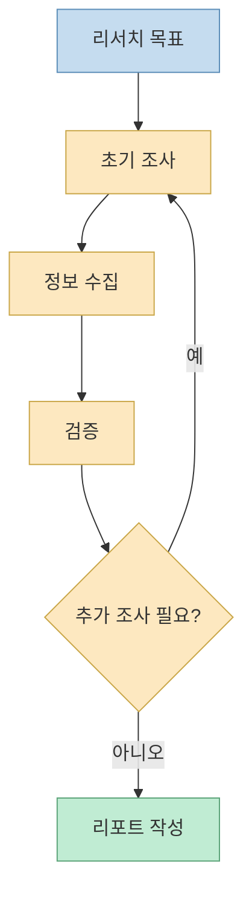
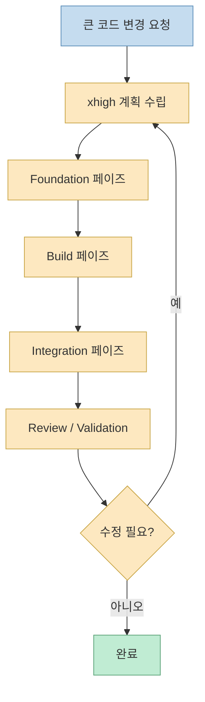
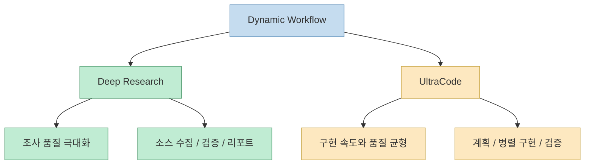
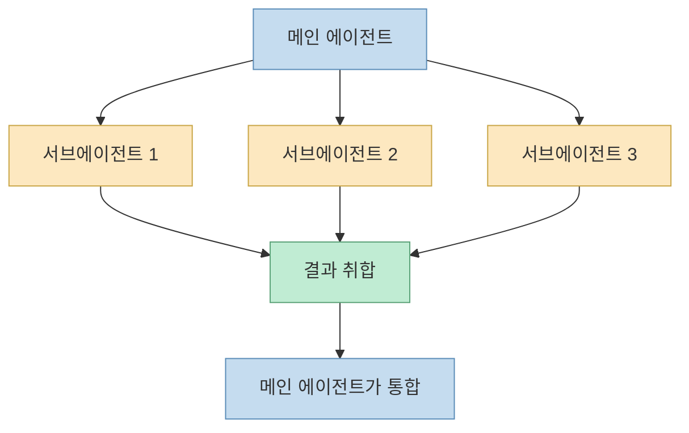
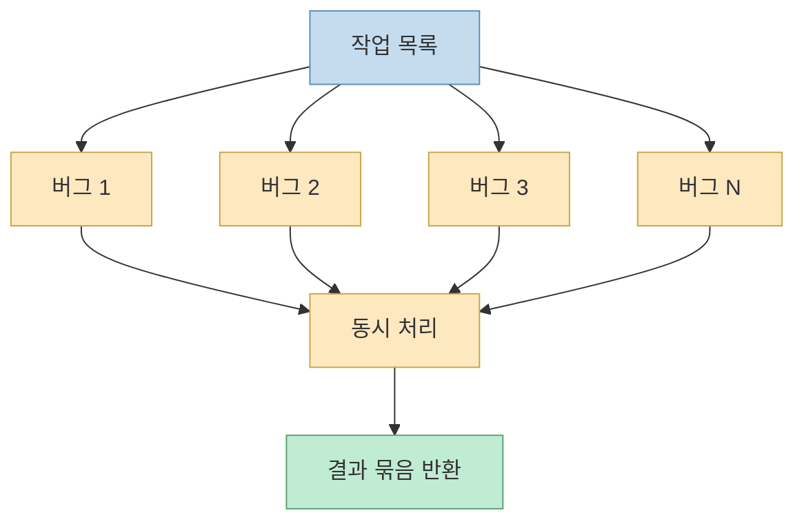
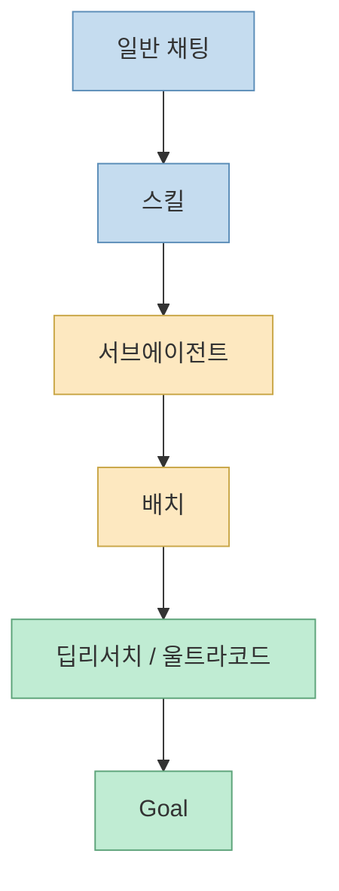
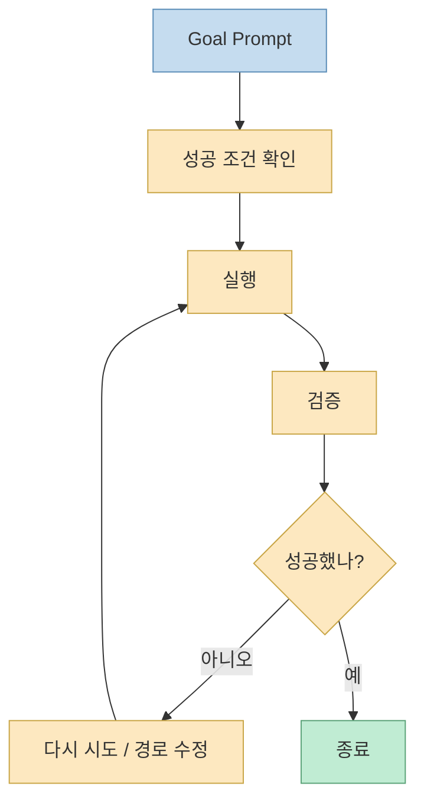
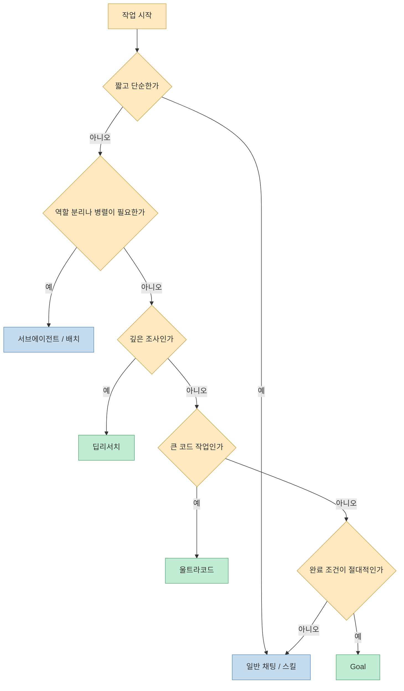

Claude Code에 Dynamic Workflow가 들어온 뒤로, `딥리서치`, `울트라코드`, `서브에이전트`, `배치`, `goal`을 한 덩어리로 이해하려는 사람이 많아졌습니다. 그런데 이 기능들은 겉보기에는 모두 “에이전트를 오래 돌리는 기능”처럼 보이지만, 실제 목적과 설계 철학은 꽤 다릅니다. 이번 영상은 그 차이를 꽤 체계적으로 설명합니다. 핵심은 단순합니다. **오른쪽으로 갈수록 더 오래, 더 많은 토큰을 쓰고, 더 강한 목표 추종성을 가지지만, 그만큼 더 무거운 하네스와 더 정확한 작업 정의가 필요하다** 는 것입니다. [영상 0:30](https://youtu.be/9fx2_1aTzq8?t=30) [영상 9:30](https://youtu.be/9fx2_1aTzq8?t=570)

특히 이 영상이 유용한 이유는 Dynamic Workflow를 단순히 “병렬 에이전트 많이 돌리는 기능”으로 설명하지 않기 때문입니다. 발표자는 Dynamic Workflow의 본질을 **목표를 들은 메인 에이전트가 먼저 계획을 세우고, 그 계획을 페이즈별 하네스로 쪼개고, 각 페이즈 안에서 필요한 만큼 병렬 에이전트를 동적으로 생성해 검증 루프까지 돌리는 방식** 으로 설명합니다. 이 관점으로 보면 딥리서치와 울트라코드는 비슷한 엔진 위에 다른 목적을 얹은 것이고, goal은 또 다른 끝단에 위치합니다. [영상 1:00](https://youtu.be/9fx2_1aTzq8?t=60) [영상 4:30](https://youtu.be/9fx2_1aTzq8?t=270)
<!--more-->

## Sources

- https://youtu.be/9fx2_1aTzq8?si=qK7HlFnvUpHy5g6z

## 1. Dynamic Workflow는 “정적 하네스”의 반대편에 있다

영상 초반 설명의 핵심은 이것입니다. 전통적인 하네싱은 정적입니다. 사람이 직접 단계와 규칙을 정의하고, 계속 손으로 관리해야 합니다. 그런데 Dynamic Workflow에서는 사용자가 리서치나 코드 생성 목표를 던지면, 메인 에이전트가 먼저 “어떻게 일해야 하는지”를 계획하고, 그 결과를 페이즈별 하네스로 동적으로 생성합니다. [영상 1:00](https://youtu.be/9fx2_1aTzq8?t=60) [영상 1:30](https://youtu.be/9fx2_1aTzq8?t=90)

즉 사용자는 그냥 싱글 프롬프트를 던지지만, 내부에서는 다음 일이 벌어집니다.

- 목표 해석
- 단계 분해
- 각 페이즈의 목표와 산출물 정의
- 각 페이즈별 병렬 작업 생성
- 검증과 수정 반복

그래서 Dynamic Workflow라는 이름이 붙습니다. 사용자가 미리 워크플로를 정의해 두는 것이 아니라, **요청마다 워크플로가 새로 생성되기 때문** 입니다. [영상 4:30](https://youtu.be/9fx2_1aTzq8?t=270)

## 2. 딥리서치의 구조: 조사 → 검증 → 추가 조사 → 리포트

발표자는 딥리서치를 가장 이해하기 쉬운 예로 씁니다. 딥리서치는 우선 조사를 하고, 조사 결과를 검증하고, 부족하면 더 조사하고, 충분하면 리포트를 내는 식의 순환 구조를 가집니다. 여기서 중요한 건 일반 채팅과 다르게 한 번 답을 내고 끝나지 않는다는 점입니다. 일반 채팅은 턴 제한과 상호작용 설계 때문에 “일단 한 번 내놓는 것”이 목표에 가깝지만, 딥리서치는 **완성도 높은 조사 결과를 만들기 위해 여러 번 되돌아가는 것** 이 목적입니다. [영상 2:00](https://youtu.be/9fx2_1aTzq8?t=120) [영상 2:30](https://youtu.be/9fx2_1aTzq8?t=150)

영상에서는 실제 워크플로 화면도 언급합니다. 스코프를 잡고, 검색 페이즈에서 목적 달성을 위해 여러 병렬 에이전트를 띄우고, 소스별로 정보를 모은 뒤, 다시 더 많은 에이전트로 이를 검증하고, 마지막에 리포트를 작성한다는 구조입니다. [영상 3:00](https://youtu.be/9fx2_1aTzq8?t=180) [영상 4:00](https://youtu.be/9fx2_1aTzq8?t=240)

## 3. 울트라코드의 구조: 계획 → 병렬 구현 → 검증 → 재계획

울트라코드는 리서치가 아니라 코드 생성/수정에 초점을 둡니다. 하지만 엔진 자체는 발표자 설명대로 딥리서치와 “같은 계열”입니다. 차이는 페이즈의 성격입니다. 코드를 크게 바꾸는 요청을 받으면, 메인 에이전트는 먼저 단계들을 생각합니다. 예를 들어 클린 아키텍처로 바꾸고, 포트를 만든 뒤, 각 어댑터를 병렬 구현하고, 통합하고, 검증하고, 안 되는 것이 있으면 다시 코딩하는 흐름입니다. [영상 5:00](https://youtu.be/9fx2_1aTzq8?t=300) [영상 6:00](https://youtu.be/9fx2_1aTzq8?t=360)

발표자는 울트라코드에서 특히 계획이 중요하다고 말합니다. 왜냐하면 울트라코드는 `xhigh` 사고 수준으로 설계를 먼저 하고, 그다음 각 페이즈 안의 에이전트들이 자신에게 배정된 일에 집중하게 만들기 때문입니다. 결국 결과물의 질은 “얼마나 잘 코딩했나” 이전에 **초기 설계와 단계 분해를 얼마나 잘했나** 에 크게 좌우됩니다. [영상 6:30](https://youtu.be/9fx2_1aTzq8?t=390) [영상 7:00](https://youtu.be/9fx2_1aTzq8?t=420)

영상에서는 실제 예시로 foundation, build, integrate, review 같은 단계가 나뉘고, 단계마다 몇 개 에이전트를 쓸지 표시된다고 설명합니다. 다만 코드 변경은 컨텍스트 일관성이 중요하기 때문에 딥리서치처럼 70개씩 무한히 쓰기보다는, 더 적은 수의 에이전트를 오래 돌리는 쪽에 가깝다고 말합니다. [영상 7:00](https://youtu.be/9fx2_1aTzq8?t=420) [영상 7:30](https://youtu.be/9fx2_1aTzq8?t=450)

## 4. 왜 딥리서치와 울트라코드는 비슷하지만 같지 않은가

발표자는 둘이 같은 다이나믹 워크플로 계열이라고 보면서도, 목적의 차이를 분명히 짚습니다. 딥리서치는 “정확하고 완성도 높은 조사 결과”가 목적이고, 울트라코드는 “잘 설계된 병렬 코딩과 검증을 통한 빠른 구현”이 목적입니다. 둘 다 병렬 에이전트, 페이즈 분해, 검증 루프를 쓰지만, 토큰을 어디에 쓰는지가 다릅니다. 코드 생성은 각 에이전트가 더 오래 실행되기 때문에, 개수는 적어도 토큰을 적게 쓰는 것이 아니라는 점도 강조합니다. [영상 7:20](https://youtu.be/9fx2_1aTzq8?t=440) [영상 8:00](https://youtu.be/9fx2_1aTzq8?t=480)

즉 “같은 엔진, 다른 목적”이라고 보는 편이 가장 정확합니다.

## 5. 서브에이전트는 무엇이 다른가: 직접 정의한 병렬 단위

영상에서 서브에이전트는 초창기 혁신 기능으로 설명됩니다. 중요한 점은 서브에이전트는 사용자가 직접 정의하고, 메인 에이전트에게 특정 작업을 위임하는 비교적 명시적 메커니즘이라는 것입니다. 예를 들어 검색 전용, 구현 전용, 특정 프롬프트를 가진 에이전트를 띄우고, 결과는 다시 메인 에이전트가 취합합니다. [영상 8:00](https://youtu.be/9fx2_1aTzq8?t=480) [영상 8:30](https://youtu.be/9fx2_1aTzq8?t=510)

핵심은 Dynamic Workflow처럼 “요청마다 하네스 자체가 생성되는 것”과는 다르다는 점입니다. 서브에이전트는 여전히 사람이 정한 의도와 역할 분할이 중심입니다.

발표자 말대로라면 서브에이전트는 “튜닝된 에이전트 단위” 자체를 쓰는 방식이고, Dynamic Workflow는 그보다 한 단계 위에서 **페이즈와 하네스를 생성하는 오케스트레이션 계층** 에 가깝습니다.

## 6. 배치는 무엇이 다른가: 독립적인 동일류 작업을 공장처럼 병렬 처리한다

배치에 대한 설명은 꽤 실용적입니다. 발표자는 배치를 “비슷한 성격의 독립 작업을 묶어 한 번에 돌리는 방식”으로 설명합니다. 예를 들어 버그 1번부터 100번까지가 서로 독립적이라면, 각각을 병렬 에이전트에게 던져 동시에 수정하는 식입니다. [영상 9:00](https://youtu.be/9fx2_1aTzq8?t=540) [영상 9:30](https://youtu.be/9fx2_1aTzq8?t=570)

즉 배치는 창의적 계획보다 **작업 공장화** 에 가깝습니다.

- 이미 정의된 작업들
- 서로 독립적임
- 같은 패턴으로 실행 가능

그래서 배치는 서브에이전트를 가장 극단적으로 활용하는 목적형 도구라고 볼 수 있습니다. 반면 Dynamic Workflow는 독립 작업 집합보다 **목표 달성을 위한 단계형 실행 구조** 에 초점을 둡니다.

## 7. 일반 채팅에서 goal까지: 점점 더 무겁고, 점점 더 목표 지향적이다

영상 후반부의 가장 좋은 부분은 도구들을 하나의 스펙트럼 위에 올려 놓는 장면입니다. 발표자는 왼쪽에서 오른쪽으로 갈수록 토큰 사용량이 늘고, 목표 추종성도 높아진다고 설명합니다. 순서는 대략 `일반 채팅 → 스킬 → 서브에이전트 → 배치 → 딥리서치/울트라코드 → goal`입니다. [영상 10:00](https://youtu.be/9fx2_1aTzq8?t=600) [영상 11:00](https://youtu.be/9fx2_1aTzq8?t=660)

각 단계의 느낌은 이렇습니다.

- 일반 채팅: 빨리 한 번 답을 받기 위한 모드
- 스킬: 자주 하는 작업을 재사용 가능한 절차로 묶은 것
- 서브에이전트: 특정 역할을 가진 에이전트를 병렬/직렬로 활용
- 배치: 독립 작업을 대량 동시 처리
- 딥리서치/울트라코드: 동적으로 워크플로를 만들고 검증 루프를 돈다
- goal: 완료될 때까지 거의 집착적으로 목표를 추종한다

이 스펙트럼이 중요한 이유는 “무조건 더 오른쪽이 더 좋다”가 아니라, **작업 난이도와 검증 요구에 따라 적당한 지점을 골라야 한다** 는 걸 보여 주기 때문입니다.

## 8. goal은 왜 별개처럼 느껴지는가

발표자는 goal을 가장 목표 지향적인 끝단으로 둡니다. 여기서는 턴 제한보다 목표 달성이 훨씬 더 중요해지고, 실패해도 쉽게 포기하지 않으며, 완료 조건이 명확해야 합니다. 그래서 goal을 쓸 때는 메타프롬프팅을 강하게 권합니다. “이 작업을 goal로 돌릴 건데, 너 자신에게 먹일 goal 프롬프트를 먼저 만들어 달라”는 식입니다. [영상 11:30](https://youtu.be/9fx2_1aTzq8?t=690) [영상 12:30](https://youtu.be/9fx2_1aTzq8?t=750)

goal이 별도로 느껴지는 이유는 다음과 같습니다.

- 몇 턴 안에 끝내는 것보다 목표 완수가 우선이다
- 검증 기준, 완료 조건, 성공 조건 정의가 매우 중요하다
- 실패해도 쉽게 “안 됩니다”로 끝내지 않는다

영상 설명대로라면 울트라코드는 “빨리 잘 끝내는 쪽”에 더 가깝고, goal은 “될 때까지 끝내지 않는 쪽”에 더 가깝습니다. [영상 15:30](https://youtu.be/9fx2_1aTzq8?t=930) [영상 16:00](https://youtu.be/9fx2_1aTzq8?t=960)

## 9. 그래서 언제 무엇을 써야 하나

발표자의 추천은 꽤 실전적입니다.

- 기본은 일반 채팅이나 스킬에서 시작한다
- 역할 분리가 필요하면 서브에이전트를 쓴다
- 독립 태스크 묶음이면 배치를 쓴다
- 깊은 조사면 딥리서치를 쓴다
- 큰 리팩터링이나 프레임워크 변경처럼 빠르게 단계별 전진이 중요하면 울트라코드를 쓴다
- 검증이 어렵고 완료 조건이 분명한 고난도 작업은 goal을 고려한다

결국 이 영상의 실전 메시지는 “가장 센 기능을 무조건 쓰지 말고, 난이도에 맞춰 오른쪽으로 이동하라”에 가깝습니다. [영상 17:00](https://youtu.be/9fx2_1aTzq8?t=1020) [영상 17:30](https://youtu.be/9fx2_1aTzq8?t=1050)

## 핵심 요약

- Dynamic Workflow는 요청마다 페이즈와 하네스를 동적으로 생성하는 구조다
- 딥리서치는 조사와 검증을 반복해 완성도 높은 리포트를 만드는 데 초점이 있다
- 울트라코드는 계획, 병렬 구현, 검증을 통해 큰 코드 변경을 빠르게 전진시키는 데 초점이 있다
- 서브에이전트는 사람이 정의한 역할 단위를 메인 에이전트가 활용하는 방식이다
- 배치는 독립 작업을 공장처럼 병렬 처리하는 방식이다
- goal은 가장 목표 지향적이며, 완료 조건이 명확할수록 강력하다
- 일반 채팅에서 goal로 갈수록 토큰 사용량과 목표 추종성이 함께 올라간다

## 결론

이 영상이 좋은 이유는 Claude Code의 여러 실행 모드를 “누가 더 강하다”가 아니라 **어떤 종류의 문제를 어떤 방식으로 해결하도록 설계됐는가** 로 설명하기 때문입니다. Dynamic Workflow는 단순 병렬화가 아니라, 목표를 해석하고 하네스를 만들어내는 오케스트레이션 레이어입니다. 그래서 실전에서는 딥리서치와 울트라코드, 배치와 서브에이전트, goal을 경쟁 관계로 보기보다 **같은 스펙트럼 위의 다른 기어** 로 보는 편이 훨씬 정확합니다.
