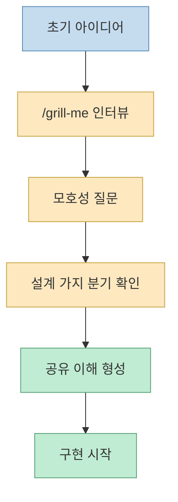
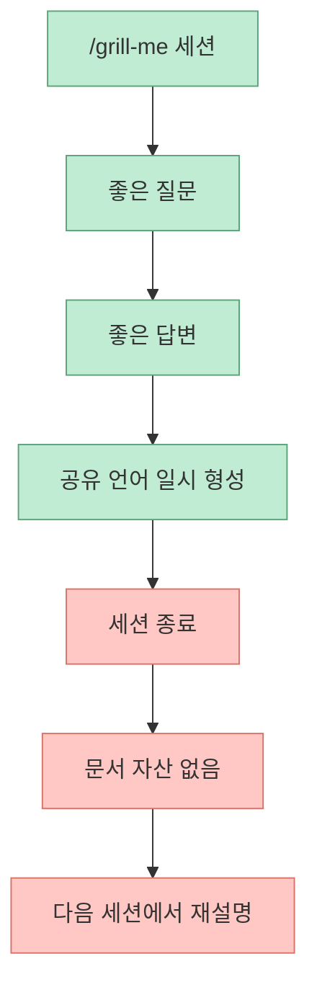
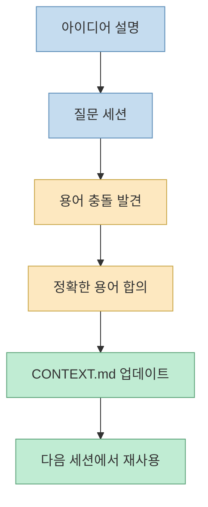
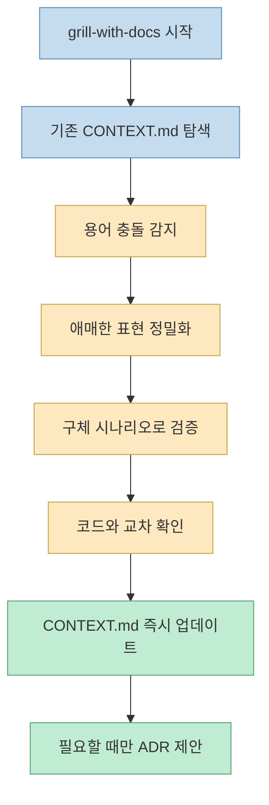
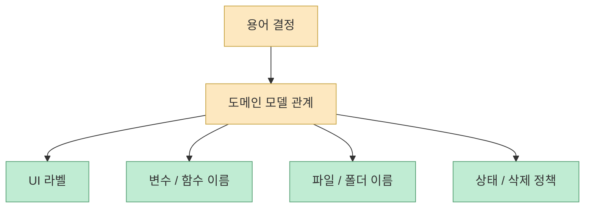
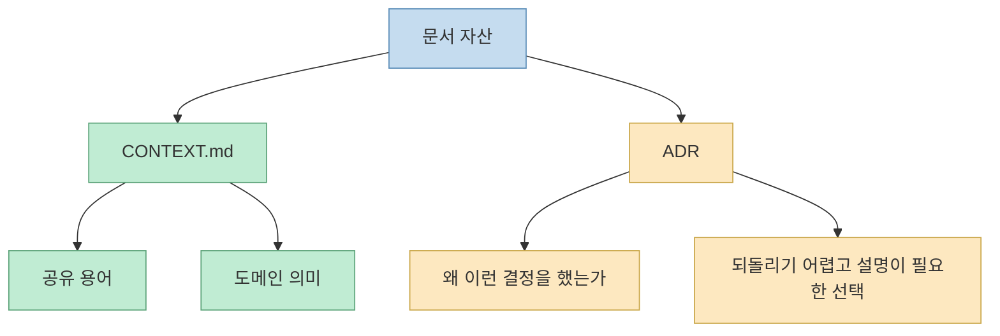
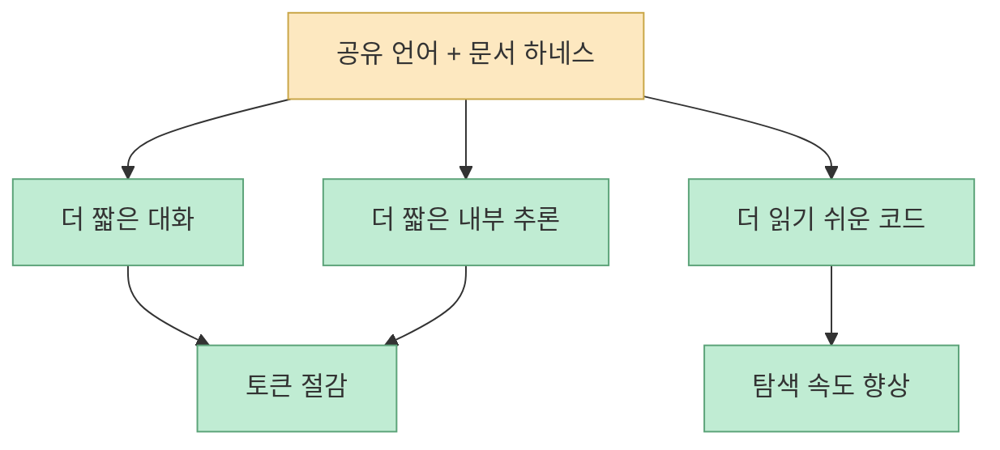
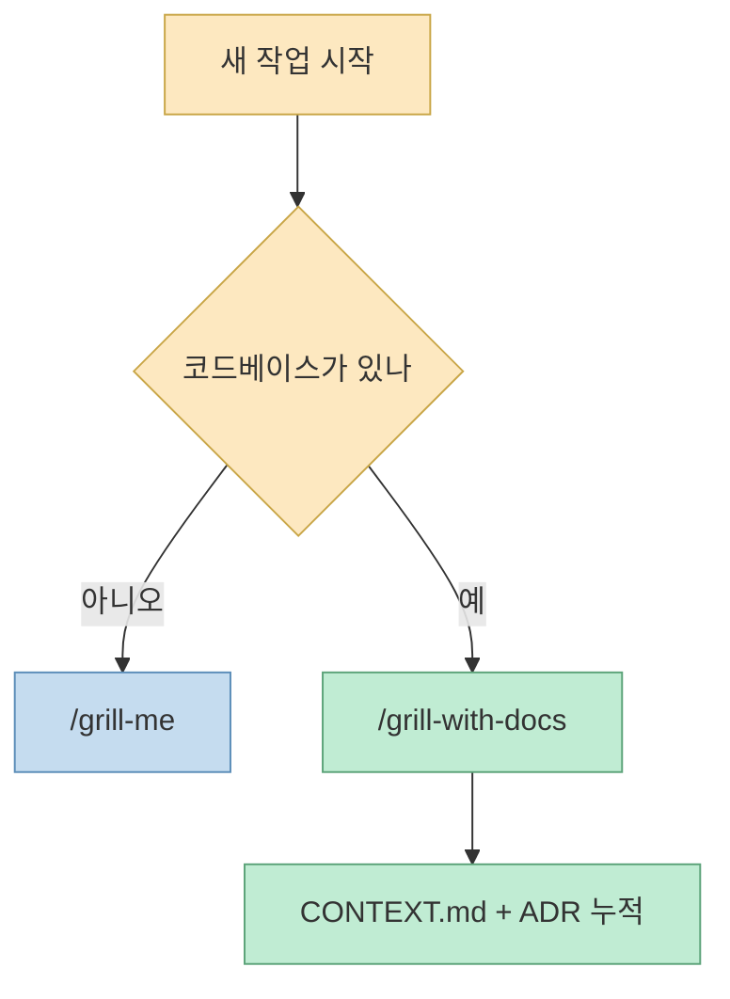

Matt Pocock의 이번 영상 제목은 도발적입니다. “이제 코딩할 때 `/grill-me`를 쓰지 않는다. 대신 이걸 쓴다”는 식이니까요. 하지만 실제 내용을 보면 단순히 더 좋은 프롬프트를 소개하는 영상이 아닙니다. 핵심은 **AI와의 인터뷰 세션을 문서 자산으로 남기지 않으면, 결국 같은 설명을 계속 반복하게 된다** 는 데 있습니다. 그래서 Matt가 꺼낸 대안은 `grill-me`를 완전히 폐기하는 것이 아니라, 코드베이스가 있을 때는 `grill-with-docs`로 올려 타는 것입니다. [영상 0:00](https://youtu.be/6BB6exR8Zd8?t=0) [영상 1:00](https://youtu.be/6BB6exR8Zd8?t=60) [GitHub](https://github.com/mattpocock/skills)

이 전환의 본질은 “질문 잘하는 스킬”에서 “질문 결과를 `CONTEXT.md`와 ADR에 누적하는 하네스”로 이동하는 데 있습니다. 즉 AI가 매번 똑같이 캐묻는 문제를 줄이려면, 더 똑똑한 모델만 찾을 것이 아니라 **공유 언어와 비가역 의사결정을 외부 문서로 고정** 해야 한다는 것입니다. 영상은 그 흐름을 실제 예제로 보여 주고, 저장소 README와 스킬 문서도 같은 방향을 분명히 지지합니다. [영상 3:30](https://youtu.be/6BB6exR8Zd8?t=210) [README](https://github.com/mattpocock/skills) [grill-with-docs](https://github.com/mattpocock/skills/blob/main/skills/engineering/grill-with-docs/SKILL.md)
<!--more-->

## Sources

- https://youtu.be/6BB6exR8Zd8?si=s2VbRT3XG8k7lXSw
- https://github.com/mattpocock/skills
- https://github.com/mattpocock/skills/blob/main/skills/productivity/grill-me/SKILL.md
- https://github.com/mattpocock/skills/blob/main/skills/engineering/grill-with-docs/SKILL.md

## 1. 원래의 `/grill-me`는 왜 그렇게 강력했나

영상 초반 Matt는 몇 달 전 자신이 쓴 네 문장이 지금까지 쓴 문장 중 가장 영향력이 컸다고 말합니다. 그 네 문장이 바로 `grill-me` 스킬이 되었고, 이 스킬은 LLM이 사용자를 집요하게 인터뷰하도록 만듭니다. 디자인 트리의 각 가지를 하나씩 따라 내려가며, 의사결정 간 의존성을 풀고, 공유된 이해에 도달할 때까지 질문을 멈추지 않는 방식입니다. 실제 `grill-me` 스킬 문서도 거의 그대로 이 철학을 담고 있습니다. “계획이나 설계의 모든 측면을 끈질기게 인터뷰하고, 의사결정 트리의 각 분기를 하나씩 해결하라”는 식입니다. [영상 0:00](https://youtu.be/6BB6exR8Zd8?t=0) [영상 0:10](https://youtu.be/6BB6exR8Zd8?t=10) [grill-me](https://github.com/mattpocock/skills/blob/main/skills/productivity/grill-me/SKILL.md)

이 스킬이 잘 먹힌 이유는 많은 AI 작업 실패가 사실 “모델이 멍청해서”가 아니라 “사용자와 에이전트 사이의 요구사항 정렬이 부실해서” 생기기 때문입니다. Matt의 저장소 README도 가장 흔한 실패 모드를 misalignment로 설명하고, 그 해법으로 grilling session을 제시합니다. 즉 먼저 물어보고, 모호함을 드러내고, 설계를 가지치기하고, 그래야 나중에 one-shot 구현이 쉬워진다는 구조입니다. [영상 0:40](https://youtu.be/6BB6exR8Zd8?t=40) [README](https://github.com/mattpocock/skills)

그래서 Matt가 `grill-me`를 높게 평가하는 것은 전혀 과장이 아닙니다. 문제는 그다음 단계에서 드러납니다.

## 2. `/grill-me`가 코드베이스 작업에서 부딪히는 한계

영상에서 Matt가 든 예시는 새 데이터 엔티티 `pitch`를 앱에 도입하는 상황입니다. 이때 그는 AI와 대화하면서 pitch가 무엇인지, stand-alone video가 무엇인지, 기존 코스/레슨/비디오와 어떤 관계인지 계속 설명해야 한다고 말합니다. 문제는 이 설명들이 구현 세션에 꼭 필요한 도메인 언어인데도, 세션이 끝나면 흔적이 남지 않는다는 점입니다. [영상 1:30](https://youtu.be/6BB6exR8Zd8?t=90) [영상 2:00](https://youtu.be/6BB6exR8Zd8?t=120)

그 결과 `grill-me`만 사용할 때는 다음 문제가 생깁니다.

- 에이전트가 이미 존재하는 프로젝트 용어를 모른다
- 사용자가 비공식 용어를 길게 풀어 설명한다
- 좋은 표현을 세션 중에 합의해도 문서로 남지 않는다
- 다음 세션에서 다시 처음부터 설명한다

Matt는 이 지점을 “코드에 대한 소통은 꽤 잘되는데, 코드베이스와 도메인에 관한 비자명한 사실을 다시 설명해야만 생산적인 작업이 가능했다”고 표현합니다. 즉 인터뷰형 스킬만으로는 대화의 품질을 높일 수는 있어도, **도메인 언어를 기억 자산으로 만드는 문제** 는 해결하지 못합니다. [영상 2:30](https://youtu.be/6BB6exR8Zd8?t=150) [영상 3:00](https://youtu.be/6BB6exR8Zd8?t=180)

바로 여기서 `grill-with-docs`가 등장합니다.

## 3. 전환점은 “질문”이 아니라 “공유 언어를 문서화하는 얇은 레이어”다

Matt가 영상에서 스스로 던진 질문은 아주 중요합니다. “AI에게 조금 더 유리한 출발점을 주기 위해 쓸 수 있는 가장 얇은 문서 레이어는 무엇일까?” 이 질문의 답으로 나온 것이 `ubiquitous language`이고, 결국 그것이 `grill-me`와 합쳐져 `grill-with-docs`가 됩니다. [영상 3:30](https://youtu.be/6BB6exR8Zd8?t=210) [영상 4:30](https://youtu.be/6BB6exR8Zd8?t=270)

여기서 Matt가 끌어오는 개념은 DDD의 ubiquitous language입니다. 도메인 전문가, 개발자, 코드가 같은 단어를 같은 뜻으로 써야 한다는 생각이죠. README도 같은 문제를 설명합니다. 프로젝트 초반에는 도메인 전문가와 개발자가 다른 언어를 쓰고, AI는 그 간극을 메우지 못한 채 20단어로 말할 것을 1단어로 줄이지 못한다는 것입니다. [영상 3:40](https://youtu.be/6BB6exR8Zd8?t=220) [README](https://github.com/mattpocock/skills)

즉 `grill-with-docs`의 아이디어는 단순합니다.

- 인터뷰 세션은 유지한다
- 대신 세션 중 합의된 용어를 `CONTEXT.md`에 즉시 적는다
- 필요하면 놀라운 설계 결정은 ADR로 남긴다

결국 핵심은 인터뷰 세션의 품질이 아니라, **그 결과를 누적하는 메모리 레이어** 입니다.

## 4. `grill-with-docs`는 실제로 무엇을 추가하나

영상과 실제 스킬 문서를 보면 `grill-with-docs`는 `grill-me`의 상단 텍스트를 거의 그대로 가져오되, 여러 문서-인식 기능을 추가합니다. Matt는 영상에서 이 새 스킬이 `context.md`를 찾고, 기존 shared language를 읽고, 세션 중 용어를 sharpen하고, 필요 시 갱신한다고 설명합니다. 스킬 문서도 정확히 같은 방향입니다. [영상 4:40](https://youtu.be/6BB6exR8Zd8?t=280) [영상 5:20](https://youtu.be/6BB6exR8Zd8?t=320) [grill-with-docs](https://github.com/mattpocock/skills/blob/main/skills/engineering/grill-with-docs/SKILL.md)

스킬 문서가 요구하는 핵심 동작은 다음과 같습니다.

- 기존 `CONTEXT.md`와 `docs/adr/`를 탐색한다
- glossary와 충돌하는 용어를 즉시 지적한다
- fuzzy language를 더 정밀한 canonical term으로 바꾼다
- concrete scenario로 edge case를 밀어붙인다
- 코드와 문서가 충돌하면 그 모순을 드러낸다
- 합의된 용어를 배치가 아니라 inline으로 `CONTEXT.md`에 적는다
- 정말 비가역적이고 trade-off가 큰 경우에만 ADR을 제안한다

여기서 특히 중요한 건 `CONTEXT.md`를 스펙 문서처럼 쓰지 말라는 규칙입니다. 스킬 문서는 `CONTEXT.md`가 implementation detail이 없는 glossary여야 한다고 못 박습니다. 이 선을 지키기 때문에 문서가 부풀지 않고, AI도 더 안정적으로 읽을 수 있습니다. [grill-with-docs](https://github.com/mattpocock/skills/blob/main/skills/engineering/grill-with-docs/SKILL.md)

## 5. 영상 데모의 핵심은 “피처 설계”가 아니라 “언어 결정이 UI와 코드까지 밀어 내려간다”는 점이다

영상에서 Matt는 `pitch`와 `standalone video`의 관계를 에이전트와 계속 조율합니다. 예를 들어 하나의 pitch가 여러 standalone video를 가질 수 있는지, standalone video라는 말을 pitched/unpitched를 모두 포함하는 상위 개념으로 둘지, pitch status를 어떤 상태 의미로 둘지 같은 질문이 이어집니다. [영상 8:30](https://youtu.be/6BB6exR8Zd8?t=510) [영상 9:00](https://youtu.be/6BB6exR8Zd8?t=540) [영상 10:30](https://youtu.be/6BB6exR8Zd8?t=630)

겉으로 보면 이건 사소한 naming discussion처럼 보일 수 있습니다. 하지만 Matt는 이 언어 결정이 이후 모든 곳에 영향을 준다고 강조합니다.

- UI 섹션 이름
- 변수 이름
- 파일 이름
- 엔티티 관계
- 삭제 규칙과 상태 전이

즉 이 논의는 단순 용어 장난이 아니라, **도메인 모델의 어휘를 먼저 고정해서 이후 생성 코드 전체의 방향을 맞추는 작업** 입니다. [영상 9:30](https://youtu.be/6BB6exR8Zd8?t=570) [영상 11:50](https://youtu.be/6BB6exR8Zd8?t=710)

그래서 Matt가 언어에 유난히 예민해 보이는 이유는, AI가 생성할 모든 후속 산출물이 이 단어 선택을 따라가기 때문입니다.

## 6. `CONTEXT.md`는 무엇을 담당하고, ADR은 무엇을 담당하나

영상 후반부에서 Matt는 sharpening만으로 해결되지 않는 것이 있다고 말합니다. 어떤 의사결정은 용어집만으로는 담을 수 없고, 왜 그런 결정을 했는지를 설명하는 별도 문서가 필요하다는 것입니다. 그래서 그가 추가한 것이 ADR입니다. [영상 7:30](https://youtu.be/6BB6exR8Zd8?t=450) [영상 8:00](https://youtu.be/6BB6exR8Zd8?t=480)

스킬 문서도 이 구분을 아주 엄격하게 잡습니다.

- `CONTEXT.md`는 glossary다
- 구현 세부사항을 넣지 않는다
- ADR은 hard to reverse, surprising without context, real trade-off일 때만 쓴다

이 구분이 중요한 이유는, AI 문서 체계가 성공하려면 각 문서의 역할이 명확해야 하기 때문입니다.

요약하면 `CONTEXT.md`는 “이 프로젝트에서 단어가 무슨 뜻인가”를 다루고, ADR은 “왜 이 구조를 선택했는가”를 다룹니다.

## 7. Matt가 말하는 실제 효익은 세 가지다

영상 마지막 부분에서 Matt는 ceremony를 거쳐서 얻는 이점을 정리합니다. 첫째, 응답이 간결해진다고 말합니다. AI가 같은 의미를 훨씬 적은 단어로 말할 수 있기 때문입니다. 둘째, thinking trace 자체도 더 간결해질 수 있다고 말합니다. 셋째, 계획 문서와 코드 언어가 일치하므로 코드 탐색이 쉬워진다고 말합니다. README도 거의 같은 요점을 적습니다. shared language가 있으면 변수/함수/파일 naming이 일관되고, 코드베이스 탐색이 쉬워지며, 에이전트가 thinking에 덜 많은 토큰을 쓴다는 것입니다. [영상 12:30](https://youtu.be/6BB6exR8Zd8?t=750) [영상 13:00](https://youtu.be/6BB6exR8Zd8?t=780) [README](https://github.com/mattpocock/skills)

이건 단순히 “AI가 덜 말한다”는 뜻이 아닙니다. 더 중요한 것은 **AI가 프로젝트의 단어장을 함께 쓰게 되면서, 사람의 의도와 생성 코드의 표현이 수렴한다** 는 점입니다.

## 8. 그래서 `/grill-me`는 죽었나? Matt의 답은 아니오다

영상 막판에 Matt는 아주 분명하게 선을 긋습니다. `/grill-me`는 죽지 않았고, 여전히 훌륭한 스킬이라는 것입니다. 다만 코드베이스가 있을 때는 `grill-with-docs`가 더 낫고, 코드베이스가 없을 때는 `grill-me`가 여전히 적합하다고 설명합니다. README도 `grill-me`를 non-code use, `grill-with-docs`를 code work 중심으로 구분합니다. [영상 13:30](https://youtu.be/6BB6exR8Zd8?t=810) [영상 14:10](https://youtu.be/6BB6exR8Zd8?t=850) [README](https://github.com/mattpocock/skills)

즉 실전 규칙은 이 정도로 정리할 수 있습니다.

- 코드베이스 없음 → `/grill-me`
- 코드베이스 있음 → `/grill-with-docs`
- 프로젝트 초반이라도 shared language를 빨리 세우고 싶다면 → `grill-with-docs` 우선 고려

이 구분이 좋은 이유는, 스킬 선택 기준이 “더 유명한 것”이 아니라 **작업에 외부 문서 메모리가 필요한가** 로 바뀌기 때문입니다.

## 9. 이 영상이 실제로 말하는 더 큰 메시지

표면적으로는 “새 스킬 추천 영상”이지만, 더 큰 메시지는 분명합니다. AI와의 협업 품질은 프롬프트 한 줄보다 **프로젝트 바깥에 남는 구조화된 문서 자산** 에 훨씬 크게 좌우된다는 것입니다. `grill-me`는 세션 안에서 정렬을 잘 시키는 스킬이고, `grill-with-docs`는 그 정렬을 세션 밖으로 꺼내 `CONTEXT.md`와 ADR에 박아 넣는 스킬입니다. [영상 3:30](https://youtu.be/6BB6exR8Zd8?t=210) [영상 12:30](https://youtu.be/6BB6exR8Zd8?t=750)

결국 Matt가 멈춘 것은 “질문 잘하기”가 아니라, **질문만 하고 끝내는 방식** 입니다. 그래서 이 영상은 스킬 소개 영상인 동시에, 에이전트 시대의 문서 전략을 설명하는 영상으로도 읽어야 합니다.

## 핵심 요약

- `/grill-me`는 여전히 강력한 인터뷰형 스킬이다
- 하지만 코드베이스 작업에서는 좋은 대화가 문서 자산으로 남지 않는 한계가 있다
- Matt는 이 문제를 ubiquitous language와 DDD 관점으로 해석했다
- 그래서 `grill-me`에 `CONTEXT.md`와 ADR 레이어를 얹은 `grill-with-docs`를 만들었다
- `CONTEXT.md`는 glossary, ADR은 비가역적 trade-off 설명 문서로 역할을 분리한다
- 코드베이스가 있을 때는 `grill-with-docs`, 없을 때는 `grill-me`라는 실전 규칙이 영상의 결론이다

## 결론

이 영상의 핵심은 “새 스킬이 더 좋다”가 아닙니다. 더 정확히는 **AI와의 대화에서 합의된 언어를 코드베이스의 공식 문서 자산으로 승격시켜야, 다음 세션부터 생산성이 누적된다** 는 메시지입니다. 그래서 `/grill-me`에서 `/grill-with-docs`로의 전환은 단순 프롬프트 업그레이드가 아니라, 인터뷰형 협업을 **공유 언어 + ADR 하네스** 로 끌어올린 변화라고 보는 편이 맞습니다.
