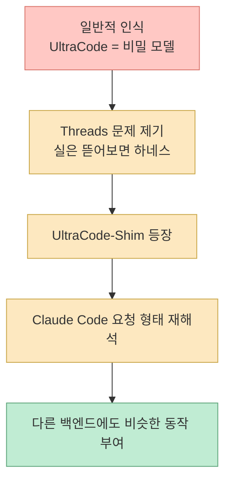
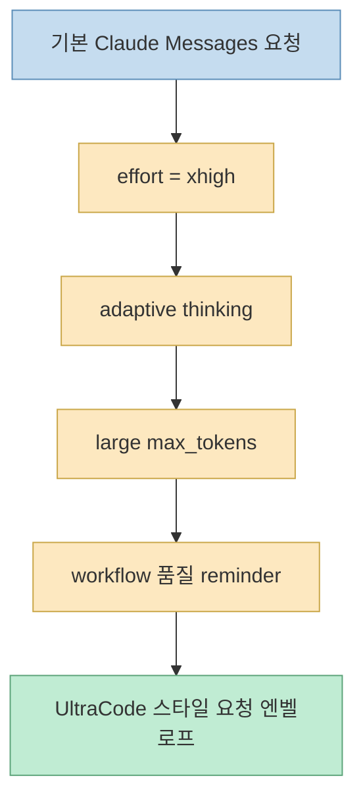
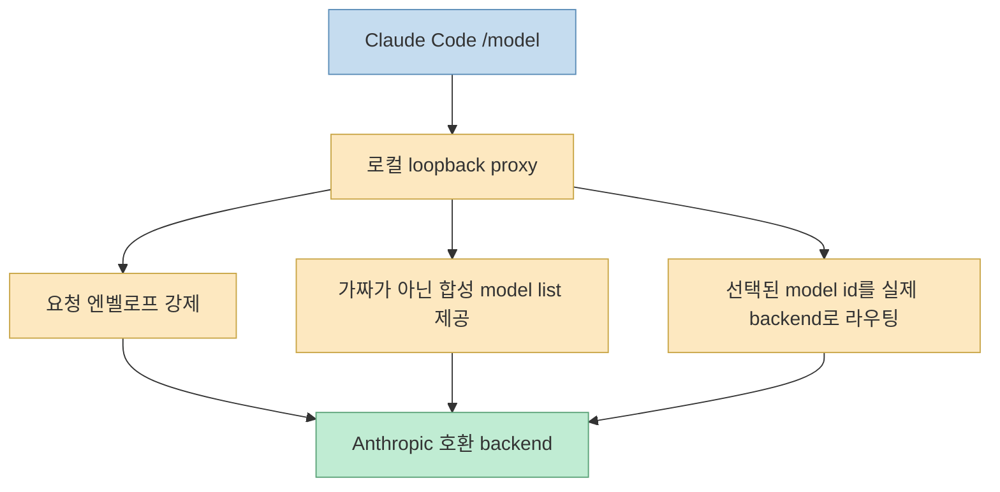
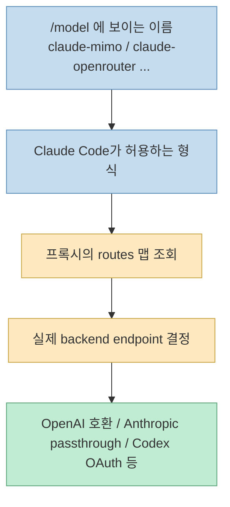
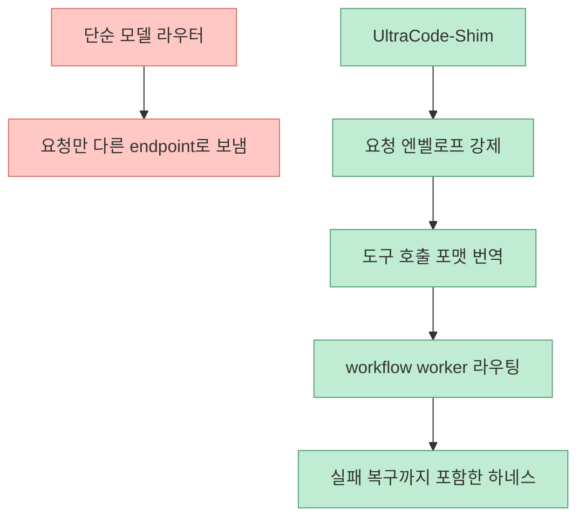
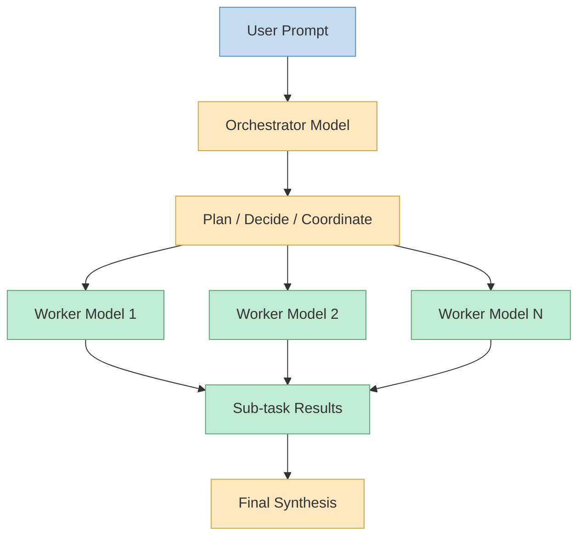
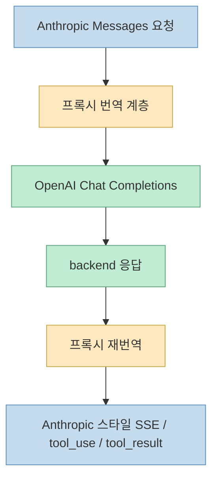
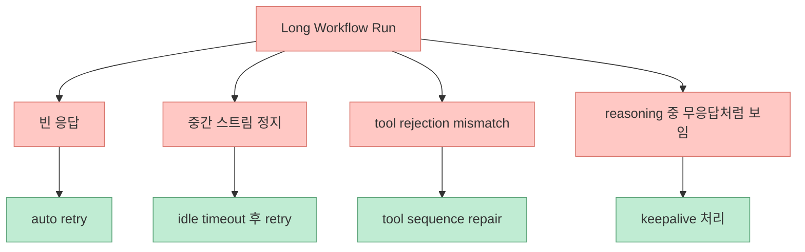
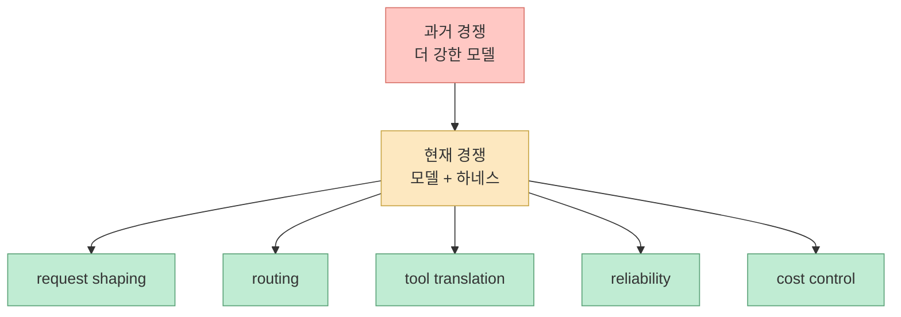

Threads에서 화제가 된 요지는 꽤 도발적입니다. **클로드 코드의 UltraCode는 비밀 병기가 아니라, 사실상 드러난 요청 형태와 하네스 조합에 가깝다** 는 주장입니다. 공개 카드에 붙은 이름은 `UltraCode-Shim`이고, 설명은 더 직접적입니다. Claude Code의 UltraCode deep-reasoning 모드를 “이미 돈을 내고 있는 아무 모델에나” 입힐 수 있다는 것입니다. 이 주장이 맞다면 핵심 경쟁력은 모델 이름보다도 **요청을 어떻게 감싸고, 어떤 워크플로 하네스를 붙이고, 어떤 백엔드로 라우팅하느냐** 로 이동합니다. [Threads](https://www.threads.com/@unclejobs.ai/post/DZF7laNk9Jz?xmt=AQG04fHNm8Ky-NyVfDxdVx8_RjEh1blbZO8od50kkpiWQNm4aOpOP981wzfWxBrEXlQEHjfW&slof=1) [GitHub](https://github.com/OnlyTerp/UltraCode-Shim)

이 글은 공개적으로 확인 가능한 범위만 씁니다. Threads 본문은 메타 설명과 카드 이미지에서 확인 가능한 문장만 사용했고, 구체 메커니즘은 `OnlyTerp/UltraCode-Shim`의 README와 `docs/HOW_IT_WORKS.md`를 기준으로 정리했습니다. 따라서 아래 내용은 **Anthropic 내부 구현 전체를 단정하는 글이 아니라**, 공개 저장소가 어떻게 UltraCode를 해석하고 재구성했는지에 대한 기술적 독해입니다. [Threads](https://www.threads.com/@unclejobs.ai/post/DZF7laNk9Jz?xmt=AQG04fHNm8Ky-NyVfDxdVx8_RjEh1blbZO8od50kkpiWQNm4aOpOP981wzfWxBrEXlQEHjfW&slof=1) [HOW_IT_WORKS](https://github.com/OnlyTerp/UltraCode-Shim/blob/main/docs/HOW_IT_WORKS.md)
<!--more-->

## Sources

- https://www.threads.com/@unclejobs.ai/post/DZF7laNk9Jz?xmt=AQG04fHNm8Ky-NyVfDxdVx8_RjEh1blbZO8od50kkpiWQNm4aOpOP981wzfWxBrEXlQEHjfW&slof=1
- https://github.com/OnlyTerp/UltraCode-Shim
- https://github.com/OnlyTerp/UltraCode-Shim/blob/main/docs/HOW_IT_WORKS.md

## 1. Threads가 던진 메시지: “비장의 무기”라고 믿었던 것이 사실은 하네스일 수 있다

Threads 메타 설명에서 확인되는 핵심 문장은 이렇습니다. UltraCode는 Opus 4.8 출시와 함께 업데이트됐고, 어려운 문제를 만났을 때 켜는 “깊게 파고드는 모드”로 인식됐지만, 누군가 그것을 뜯어본 뒤 별것 아니라는 점을 밝혔고 심지어 다른 AI에 씌웠다는 것입니다. 카드 이미지는 그 대상이 `UltraCode-Shim`임을 명확히 보여 줍니다. [Threads](https://www.threads.com/@unclejobs.ai/post/DZF7laNk9Jz?xmt=AQG04fHNm8Ky-NyVfDxdVx8_RjEh1blbZO8od50kkpiWQNm4aOpOP981wzfWxBrEXlQEHjfW&slof=1)

즉 이 스레드의 핵심은 “Claude가 더 똑똑하다”가 아닙니다. 오히려 다음 질문에 가깝습니다.

- UltraCode는 정말 별도 모델인가
- 아니면 기존 모델 호출 위에 얹는 요청 파라미터 세트인가
- 진짜 차별점은 모델보다 워크플로 하네스에 있는 것 아닌가

이 관점이 중요한 이유는, 최근 에이전트 도구 경쟁이 점점 **누가 더 강한 모델을 붙였는가** 보다 **누가 더 강한 하네스를 설계했는가** 로 이동하고 있기 때문입니다.

## 2. 저장소가 말하는 핵심: UltraCode는 “숨겨진 모델”이 아니라 요청 엔벨로프다

`UltraCode-Shim` README와 `HOW_IT_WORKS.md`는 이 프로젝트의 전제를 매우 분명하게 적습니다. 저장소 설명에 따르면 UltraCode는 API 경계에서 보면 별도 모델이 아니라, 일반 `/v1/messages` 요청에 추가되는 엔벨로프입니다. 문서가 열거하는 구성은 크게 네 가지입니다. `effort=xhigh`, adaptive thinking, 큰 `max_tokens`, 그리고 워크플로 품질을 유도하는 시스템 리마인더입니다. [GitHub](https://github.com/OnlyTerp/UltraCode-Shim) [HOW_IT_WORKS](https://github.com/OnlyTerp/UltraCode-Shim/blob/main/docs/HOW_IT_WORKS.md)

즉 저장소 저자의 주장은 이렇습니다.

- UltraCode는 어떤 “신비한 별도 모델 이름”이 아니라
- 기존 메시지 API 요청을 특정 형태로 감싼 것이고
- 이 형태를 재현할 수 있다면
- Anthropic Messages API와 호환되는 다른 백엔드에도 비슷한 실행 모드를 덧씌울 수 있다는 것입니다

물론 이것이 곧 “원본 UltraCode와 완전히 동일하다”는 뜻은 아닙니다. 하지만 적어도 공개 저장소가 보여 주는 바는 분명합니다. **사용자가 체감하는 깊은 추론 모드의 상당 부분은 모델명 자체보다 요청 모양과 하네스 정책에서 나온다** 는 해석이 가능해집니다.

## 3. 그래서 Shim은 무엇을 하나: Claude Code 앞단에 로컬 프록시를 둔다

이 프로젝트의 구현은 의외로 소박합니다. 문서에 따르면 핵심은 `proxy.py`입니다. Claude Code가 직접 Anthropic API로 가는 대신, 먼저 로컬 루프백 프록시를 보게 만들고, 이 프록시가 요청을 가로채 다음 일을 합니다. [HOW_IT_WORKS](https://github.com/OnlyTerp/UltraCode-Shim/blob/main/docs/HOW_IT_WORKS.md)

- `POST /v1/messages` 요청에 UltraCode 스타일 엔벨로프를 강제로 덧씌운다
- `GET /v1/models` 응답을 합성해서 사용자가 설정한 모델들을 `/model` 메뉴에 보이게 만든다
- 사용자가 선택한 모델 ID를 실제 백엔드 라우트로 매핑해 보낸다

즉 사용자는 Claude Code의 UI를 그대로 쓰지만, 뒤에서는 실제 모델 공급자가 바뀔 수 있습니다.

이 구조가 의미하는 바는 큽니다. Claude Code가 제공하는 사용성, 명령, 세션 UX는 유지하면서도, 실제 추론 비용과 모델 선택권은 바깥 계층에서 다시 잡을 수 있기 때문입니다.

## 4. `/model` 메뉴가 핵심인 이유: “선택 인터페이스”와 “실제 실행 모델”을 분리한다

README는 이 프로젝트가 `/model` 메뉴를 아주 적극적으로 활용한다고 설명합니다. 사용자가 보는 모델 이름은 Claude Code가 허용하는 형식으로 노출되지만, 그 ID는 실제로는 `config.json`에 정의된 다른 백엔드로 라우팅됩니다. 문서는 특히 model id가 `claude` 또는 `anthropic` 접두사를 가져야 Claude Code의 필터를 통과한다고 적습니다. [GitHub](https://github.com/OnlyTerp/UltraCode-Shim) [HOW_IT_WORKS](https://github.com/OnlyTerp/UltraCode-Shim/blob/main/docs/HOW_IT_WORKS.md)

이 지점이 흥미로운 이유는, 많은 사용자가 `/model`을 “실제 모델 직접 선택기”라고 생각하지만, 이 저장소는 그것을 **프록시가 해석하는 가상 슬롯** 처럼 사용하기 때문입니다.

즉 사용자 경험은 Claude Code 안에 남겨 두고, 실질적 비용/공급자 제어권은 바깥 설정 파일로 뽑아낸 셈입니다.

## 5. 더 중요한 포인트: 이 프로젝트는 “모델 교체”보다 “하네스 이식”을 목표로 한다

README 첫 문장을 보면 이 저장소가 단순히 “Claude Code를 OpenAI로 연결한다”는 수준에 머물지 않는다는 점이 드러납니다. 프로젝트가 반복해서 강조하는 것은 **full UltraCode harness** 입니다. 즉 단지 API만 바꾸는 것이 아니라, 깊은 추론과 워크플로 fan-out을 유도하는 실행 맥락을 함께 실어 보내려는 것입니다. [GitHub](https://github.com/OnlyTerp/UltraCode-Shim)

이 때문에 이 프로젝트를 “모델 라우터”라고만 보면 반만 이해한 셈입니다. 더 정확히는:

- 요청 파라미터를 강제하고
- 모델 목록을 가상화하고
- 백엔드 프로토콜을 번역하고
- 동적 워크플로 호출까지 끝까지 사용자가 선택한 쪽으로 보내려는

**하네스 프록시** 에 가깝습니다.

이건 최근 에이전트 도구들이 왜 “wrapper”보다 “runtime”이나 “harness”라는 말을 더 많이 쓰는지와도 맞닿아 있습니다.

## 6. 오케스트레이터와 워커를 분리하는 발상이 특히 중요하다

README와 `HOW_IT_WORKS.md`에서 가장 흥미로운 대목 중 하나는 orchestrator와 worker를 따로 잡는 2계층 구조입니다. 문서 설명에 따르면 Claude Code의 dynamic workflow는 실제 배후 트래픽에서 많은 sub-agent 작업을 stock model id로 보낼 수 있고, 이 때문에 사용자가 `/model`에서 뭘 골랐는지와 실제 청구 대상이 어긋날 수 있습니다. 이 프로젝트는 그 점을 문제로 보고, 메인 인터랙티브 루프와 백그라운드 worker 루프를 구조적으로 분리해 라우팅합니다. [GitHub](https://github.com/OnlyTerp/UltraCode-Shim) [HOW_IT_WORKS](https://github.com/OnlyTerp/UltraCode-Shim/blob/main/docs/HOW_IT_WORKS.md)

정리하면 이렇습니다.

- 오케스트레이터는 계획과 대화, 메인 루프를 담당한다
- 워커는 병렬 fan-out 작업과 서브에이전트 호출을 담당한다
- 둘을 같은 모델로 보낼 수도 있고
- 비싼 모델은 계획만, 싼 모델은 병렬 실행만 담당하게 할 수도 있다

이건 단순 비용 절감 테크닉이 아닙니다. **계획과 실행을 서로 다른 경제성 곡선에 얹는 하네스 설계** 라는 점에서 훨씬 중요합니다.

## 7. 번역 계층도 핵심이다: Anthropic Messages ↔ OpenAI 호환 포맷

저장소는 여러 종류의 backend route를 설명합니다. Anthropic passthrough, OpenAI compatible translation, Codex OAuth, Cursor bridge 등이 그것입니다. 특히 `openai_compat` 경로에서 Anthropic request를 OpenAI Chat Completions로 바꾸고, 응답을 다시 Anthropic 스타일로 되돌린다고 밝힙니다. 도구 호출도 양방향으로 번역한다고 적습니다. [HOW_IT_WORKS](https://github.com/OnlyTerp/UltraCode-Shim/blob/main/docs/HOW_IT_WORKS.md)

이 말은 곧, 문제의 핵심이 단순 HTTP 프록시가 아니라는 뜻입니다. Claude Code는 자기 나름의 tool call 의미론과 스트리밍 기대치를 갖고 있고, 다른 백엔드는 또 다른 규약을 가질 수 있습니다. 따라서 실제 난점은 “요청 보내기”보다 **행동 의미를 유지한 채 프로토콜을 왕복 변환하는 것** 입니다.

에이전트 시대에 이런 번역 계층이 중요한 이유는, 앞으로 경쟁이 “어느 모델이 최고인가”에서 “어느 런타임이 어떤 모델들을 매끈하게 갈아 끼울 수 있는가”로 이동하기 때문입니다.

## 8. 신뢰성 설계가 들어간 점도 의미가 크다

README는 장시간 dynamic workflow에서 실제로 자주 만난 실패 유형을 기준으로 프록시를 강화했다고 설명합니다. 문서에 적힌 항목은 대략 네 가지입니다. 빈 응답 자동 재시도, 스트림 정지 타임아웃, 툴 거절 시 시퀀스 복구, 추론 중 dead air 방지입니다. [GitHub](https://github.com/OnlyTerp/UltraCode-Shim) [HOW_IT_WORKS](https://github.com/OnlyTerp/UltraCode-Shim/blob/main/docs/HOW_IT_WORKS.md)

이 포인트는 생각보다 중요합니다. 왜냐하면 하네스의 가치는 “한 번 멋지게 작동하는 데모”보다 **40분짜리 자율 실행이 중간에 안 죽고 끝까지 가는가** 에서 드러나기 때문입니다.

즉 이 저장소는 “UltraCode를 흉내 냈다”는 수준을 넘어서, **장시간 에이전트 런타임에 필요한 운영적 내구성** 을 별도 레이어로 보고 있습니다.

## 9. 이 프로젝트가 시사하는 진짜 변화: 경쟁 단위가 모델에서 하네스로 이동한다

이 저장소를 그대로 믿느냐와 별개로, 여기서 드러나는 시대 흐름은 꽤 분명합니다.

- 사용자는 Claude Code 같은 좋은 상위 UX를 원한다
- 하지만 비용과 공급자 선택권은 한 벤더에 묶이고 싶어 하지 않는다
- 따라서 중간에 프록시/하네스/라우터 계층이 생긴다
- 이 계층이 model discovery, request shaping, tool translation, reliability를 담당한다

즉 앞으로의 승부는 “누가 최고 모델을 가졌나” 하나만으로 끝나지 않습니다. **누가 더 좋은 에이전트 런타임을 설계했는가**, **누가 더 싼 모델 조합으로 비슷한 작업 품질을 재현하는가** 가 함께 중요해집니다.

이런 점에서 UltraCode-Shim은 단순한 “재밌는 해킹”이라기보다, **하네스 엔지니어링이 어디까지 제품 차별화 요소가 되었는지 보여 주는 사례** 로 읽는 편이 더 정확합니다.

## 10. 다만 주의할 점도 있다: “비슷한 효과”와 “동일한 내부 동작”은 다르다

이 글에서 가장 조심해야 할 부분도 분명합니다. 공개 저장소 문서가 설명하는 것은 어디까지나 작성자가 관찰한 요청 형태와 그에 기반한 재구성입니다. 따라서:

- 원본 Claude Code 내부 구현이 앞으로 바뀔 수 있고
- 모든 workflow 동작이 완전히 동일하다고 보장할 수 없으며
- 특정 백엔드에서 추론 품질이나 tool semantics가 달라질 수 있고
- “UltraCode-like” 경험과 “Anthropic 원본과 1:1 동일”은 같은 말이 아닙니다

즉 이 프로젝트의 가치는 “원본 복제 성공” 여부 하나가 아니라, **사용자가 체감하는 고급 에이전트 모드의 상당 부분이 외부 하네스로 재구성 가능하다는 점을 증명하려 한다** 는 데 있습니다.

## 핵심 요약

- Threads가 소개한 핵심 프로젝트는 `OnlyTerp/UltraCode-Shim`이다
- 이 저장소는 UltraCode를 숨겨진 모델이 아니라 요청 엔벨로프로 해석한다
- 핵심 요소는 `xhigh effort`, adaptive thinking, 큰 token budget, workflow reminder다
- 로컬 프록시가 `/model` discovery, request shaping, protocol translation, backend routing을 맡는다
- 특히 orchestrator와 worker를 분리해 계획 모델과 병렬 실행 모델을 따로 선택하게 한 점이 중요하다
- 이 사례는 에이전트 경쟁력이 모델 단독이 아니라 하네스 설계로 이동하고 있음을 보여 준다

## 결론

`UltraCode-Shim`이 흥미로운 이유는 “Claude의 기능을 베꼈다”는 자극적 문구 때문이 아닙니다. 더 본질적인 이유는, 우리가 비밀스러운 모델 성능이라고 믿었던 것들 중 일부가 사실은 **요청 모양, 라우팅, 도구 번역, 워크플로 fan-out, 실패 복구 같은 하네스 계층의 산물일 수 있다** 는 점을 공개적으로 보여 줬기 때문입니다. 앞으로 에이전트 툴을 볼 때는 모델 이름만 볼 것이 아니라, 그 뒤에 어떤 **런타임과 하네스** 가 붙어 있는지를 함께 봐야 합니다.
