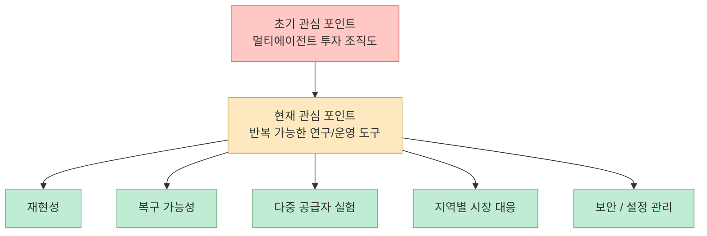
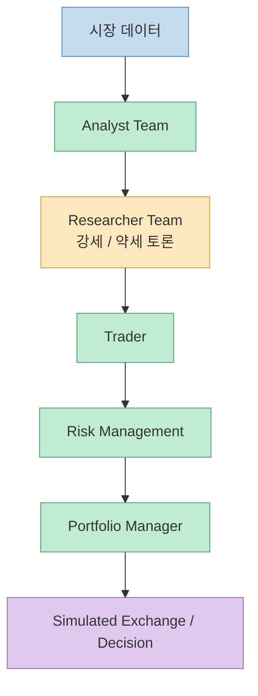
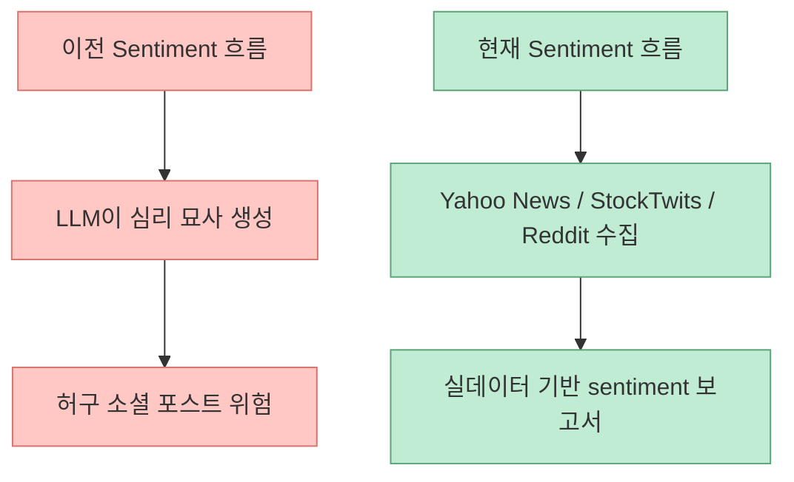
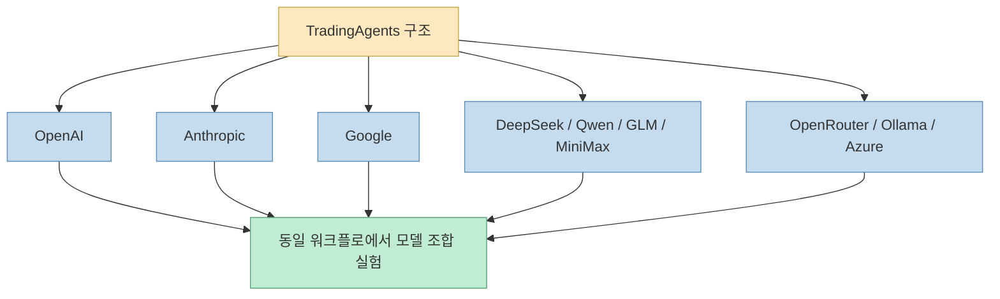
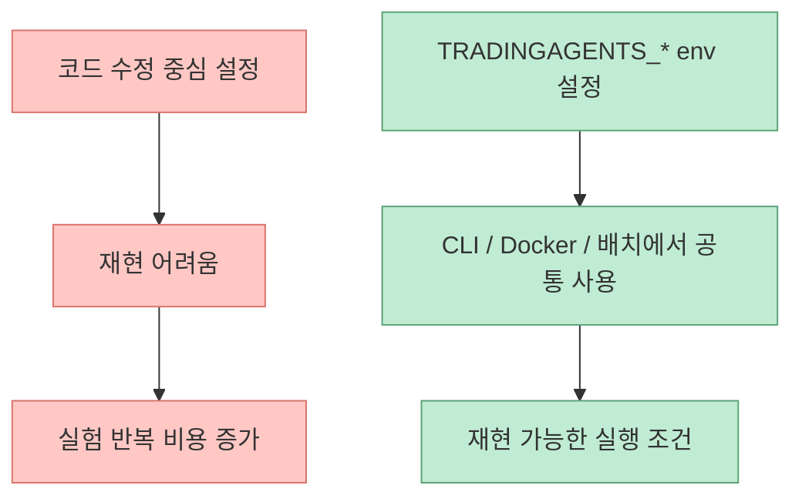
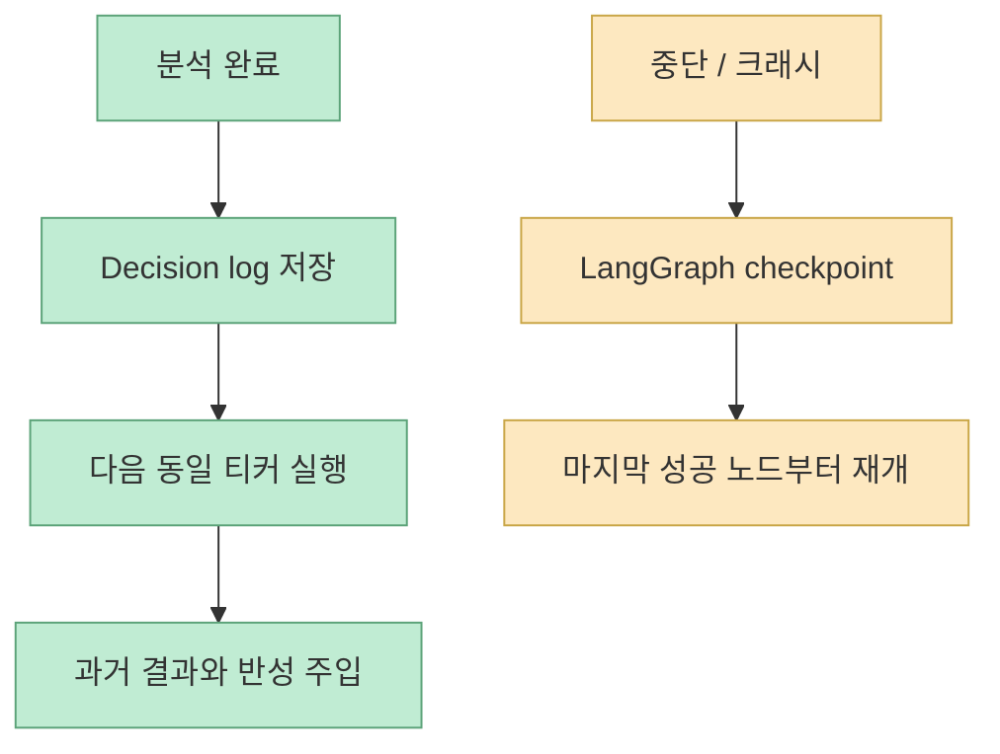
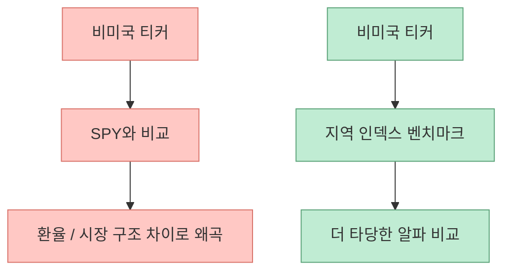

`TradingAgents`를 처음 볼 때 많은 사람이 주목하는 것은 “분석가 4명, 강세/약세 연구원 2명, 트레이더, 리스크 팀, 포트폴리오 매니저” 같은 역할 분업 구조입니다. 맞는 관찰입니다. 다만 2026년 6월 초 기준 이 저장소를 다시 보면, 더 흥미로운 변화는 멀티에이전트 구조 그 자체보다도 **이 구조를 실제로 반복 실행 가능한 연구 도구로 다듬고 있다는 점** 입니다. README와 CHANGELOG를 읽어 보면, 최근 버전들은 단순 데모 강화보다 `grounded sentiment`, `checkpoint resume`, `persistent decision log`, `TRADINGAGENTS_*` 환경변수 구성, 비미국 시장용 알파 벤치마크, 원격 Ollama 같은 운영형 기능에 점점 더 많은 비중을 둡니다. [GitHub](https://github.com/TauricResearch/TradingAgents) [CHANGELOG](https://github.com/TauricResearch/TradingAgents/blob/main/CHANGELOG.md)

즉 이 프로젝트를 이제는 “LLM 9명이 투자 회의를 흉내 내는 프레임워크” 정도로만 보면 반만 본 셈입니다. 지금의 TradingAgents는 그 위에 **반복 실험, 재현성 관리, 실패 복구, 다중 모델 실험, 지역별 시장 지원** 을 덧씌우며, 연구용 멀티에이전트 시스템이 실제 사용 가능한 CLI/패키지로 자라나는 전형적인 경로를 보여 주고 있습니다. [GitHub API](https://api.github.com/repos/TauricResearch/TradingAgents) [README](https://github.com/TauricResearch/TradingAgents)
<!--more-->

## Sources

- https://github.com/TauricResearch/TradingAgents
- https://github.com/TauricResearch/TradingAgents/blob/main/CHANGELOG.md

## 1. 현재 TradingAgents를 볼 때 먼저 봐야 할 것은 “조직도”보다 “제품화 방향”이다

기본 구조는 여전히 같습니다. Analyst Team이 펀더멘털, 센티먼트, 뉴스, 기술 분석을 맡고, Researcher Team이 강세/약세 관점으로 토론하고, Trader가 결정을 제안한 뒤 Risk Management와 Portfolio Manager가 최종 승인 여부를 판단합니다. [README](https://github.com/TauricResearch/TradingAgents)

하지만 최신 README의 첫머리 `News` 섹션이 보여 주는 초점은 예전과 다릅니다. 2026년 5월의 `v0.2.5`는 단순히 “더 많은 역할”을 추가한 버전이 아니라:

- grounded Sentiment Analyst
- GPT-5.5 등 최신 모델군 커버리지
- Qwen/GLM/MiniMax의 dual-region 지원
- `TRADINGAGENTS_*` 환경변수 기반 설정
- API 키 자동 감지
- remote Ollama
- non-US alpha benchmark
- ticker path-traversal hardening

같은 운영/안전/실험 기능을 전면에 세웁니다. [README](https://github.com/TauricResearch/TradingAgents) [CHANGELOG](https://github.com/TauricResearch/TradingAgents/blob/main/CHANGELOG.md)

이 변화는 중요합니다. 좋은 멀티에이전트 구조를 만드는 것과, 그 구조를 매일 다시 돌릴 수 있는 툴로 만드는 것은 완전히 다른 문제이기 때문입니다.

## 2. 멀티에이전트 구조는 여전히 핵심이지만, 이제는 “실험 인프라”와 세트로 읽어야 한다

README가 설명하는 기본 틀은 실세계 트레이딩 조직의 역학을 흉내 내는 것입니다. Analyst Team은 서로 다른 정보원을 읽고, Researcher Team은 그 결과를 반대편 논리와 함께 검토하며, Trader는 실제 행동으로 번역하고, Risk/Portfolio는 실행 직전의 통제를 맡습니다. [README](https://github.com/TauricResearch/TradingAgents)

다만 최신 버전의 메시지는 여기서 멈추지 않습니다. 이 조직도를 실제로 가치 있게 만들려면,

- 같은 티커를 다시 분석할 때 지난 결정을 기억해야 하고
- 중간에 죽은 실행을 이어받을 수 있어야 하고
- 공급자와 모델을 바꿔도 구조는 유지돼야 하며
- 미국 외 시장에서도 억지로 SPY를 벤치마크로 쓰지 않아야 합니다

즉 현재의 TradingAgents는 “역할 놀이”보다는 **반복 가능한 에이전트 실험 환경** 에 훨씬 더 가깝습니다.

## 3. `grounded Sentiment Analyst`가 들어간 것은 꽤 큰 전환이다

`v0.2.5` changelog에서 가장 눈에 띄는 변화 중 하나는 Sentiment Analyst의 grounded화입니다. 변경 설명에 따르면 이 분석기는 이제 Yahoo News, StockTwits, Reddit의 실제 데이터를 읽은 뒤 리포트를 만들고, 이전처럼 프롬프트 압박에 따라 소셜 포스트를 지어내는 흐름을 대체합니다. [CHANGELOG](https://github.com/TauricResearch/TradingAgents/blob/main/CHANGELOG.md)

이건 단순 품질 향상이 아닙니다. 멀티에이전트 시스템에서 한 역할의 환각이 downstream 전체를 오염시키기 때문입니다. 특히 sentiment는 원래부터 가장 “그럴듯한 허구”가 잘 생기는 층입니다. 따라서 grounded sentiment로 바뀌었다는 건 TradingAgents가 이제 멋진 조직도보다 **입력 데이터의 신뢰성** 을 더 신경 쓰기 시작했다는 뜻입니다.

이 변화는 다른 도메인에도 시사점이 큽니다. 에이전트 팀이 많아질수록 더 중요한 것은 “몇 명이 있나”보다 **각 역할이 무엇을 근거로 말하나** 입니다.

## 4. 현재 TradingAgents의 진짜 강점은 모델 선택 실험을 구조화해 준다는 점이다

README와 changelog를 보면 지원 공급자 목록이 상당히 넓습니다. OpenAI, Google, Anthropic, xAI, DeepSeek, Qwen, GLM, MiniMax, OpenRouter, Ollama, Azure OpenAI까지 포함됩니다. 최신 changelog에는 GPT-5.5, Claude Opus 4.7, Gemini 3.1 Flash-Lite, Grok 4.20, Qwen 3.6 계열 등의 모델 카탈로그 갱신도 적혀 있습니다. [README](https://github.com/TauricResearch/TradingAgents) [CHANGELOG](https://github.com/TauricResearch/TradingAgents/blob/main/CHANGELOG.md)

게다가 Qwen, GLM, MiniMax에는 국제/중국 이중 리전 설정이 들어갔습니다. 이건 단순 provider 추가가 아닙니다. 이제 이 프레임워크는 “어떤 멀티에이전트 구조가 좋나”뿐 아니라 **어떤 모델 조합이 각 역할에 맞는가** 를 비교하는 실험장으로도 기능합니다.

이게 실전적으로 중요한 이유는 금융 분석 결과가 모델에 민감하기 때문입니다. README도 이 프로젝트는 연구용이며, 성과는 backbone model, temperature, 기간, 데이터 품질 등에 따라 달라진다고 분명히 경고합니다. 즉 이 구조는 “최고 모델 고르기”가 아니라 **변수를 통제하며 비교하기 위한 틀** 이기도 합니다. [README](https://github.com/TauricResearch/TradingAgents)

## 5. `TRADINGAGENTS_*` 환경변수 체계는 “데모”에서 “운영 가능한 툴”로 가는 전형적 신호다

`v0.2.5`의 또 다른 핵심은 `DEFAULT_CONFIG`의 주요 항목을 `TRADINGAGENTS_*` 환경변수로 덮어쓸 수 있게 만든 점입니다. changelog 설명대로 provider, deep/quick model, backend URL, output language, debate rounds, checkpoint 여부, benchmark ticker 같은 값을 `.env`에서 타입 인식과 함께 설정할 수 있습니다. [CHANGELOG](https://github.com/TauricResearch/TradingAgents/blob/main/CHANGELOG.md)

이건 사용자 경험 차원에서 꽤 큰 변화입니다. 이유는 두 가지입니다.

- CLI 사용자가 코드 수정 없이 실행 조건을 바꿀 수 있다
- 배포 환경, Docker, CI, 실험 배치에서 동일한 실행 틀을 재사용할 수 있다

에이전트 도구가 커질수록 중요한 것은 새로운 역할을 추가하는 것보다, **설정 표면을 깔끔하게 운영 가능한 형태로 빼내는 것** 입니다. TradingAgents가 지금 정확히 그 방향으로 가고 있습니다.

## 6. checkpoint resume과 decision log는 이 프로젝트를 “연구 반복기”로 바꾼다

README의 `Persistence and Recovery` 섹션은 이 프로젝트의 현재 성격을 가장 잘 보여 줍니다. 저장소는 두 종류의 상태를 유지합니다.

- Decision log
- Checkpoint resume

Decision log는 각 실행이 끝날 때 판단 내용을 `~/.tradingagents/memory/trading_memory.md`에 쌓고, 다음 같은 티커 분석에서 과거 판단과 결과를 다시 Portfolio Manager 프롬프트에 넣습니다. Checkpoint resume은 LangGraph가 각 노드 이후 상태를 저장해, 중간에 죽은 실행을 마지막 성공 지점부터 재개하게 합니다. [README](https://github.com/TauricResearch/TradingAgents) [CHANGELOG](https://github.com/TauricResearch/TradingAgents/blob/main/CHANGELOG.md)

이건 굉장히 중요한 전환입니다. 멀티에이전트 시스템이 진짜 도구가 되려면 “이번 실행이 잘 되었나”보다 **지난 실행에서 무엇을 배웠고, 다음 실행에서 어디서부터 이어갈 수 있나** 가 더 중요해지기 때문입니다.

## 7. non-US alpha benchmark 지원은 의외로 성숙한 변화다

`v0.2.5` changelog에서 눈에 띄지만 많은 사람이 지나칠 포인트가 있습니다. 비미국 티커에 대해 알파 벤치마크를 SPY 하드코딩 대신 각 지역 인덱스로 바꾸는 기능입니다. `.NS`에는 `^NSEI`, `.T`에는 `^N225`, `.HK`에는 `^HSI`, `.L`에는 `^FTSE` 같은 식입니다. changelog는 이를 통해 비USD 종목에서 FX 왜곡이 알파 계산을 지배하던 문제를 줄인다고 설명합니다. [CHANGELOG](https://github.com/TauricResearch/TradingAgents/blob/main/CHANGELOG.md)

이건 작은 수정처럼 보이지만, 연구 프레임워크에서는 아주 중요합니다. 잘못된 기준선 하나가 전체 평가를 무의미하게 만들 수 있기 때문입니다. 즉 TradingAgents는 단순히 LLM을 더 붙이는 게 아니라, **평가 축 자체를 지역 시장에 맞추는 방향** 으로 진화하고 있습니다.

이런 변화는 README의 “연구용 도구”라는 자기 인식과도 잘 맞습니다. 연구용이라면 더더욱, **측정 기준을 덜 틀리게 만드는 일** 이 중요합니다.

## 8. remote Ollama, Docker, API-key auto-detection은 왜 중요한가

최신 README와 changelog를 함께 보면 로컬/원격 운영 시나리오를 꽤 많이 신경 쓴 흔적이 보입니다.

- Docker 실행 경로
- remote `OLLAMA_BASE_URL`
- CLI에서 누락된 API 키 감지 후 `.env`에 저장
- `pip install .` 설치 후에도 `.env`를 잘 읽는 수정

이런 기능은 화려하지 않지만 실제 사용률을 크게 좌우합니다. 멀티에이전트 프레임워크가 유명해진 뒤 가장 빨리 부딪히는 문제는 “구조가 멋지다”가 아니라 “내 환경에서 지금 바로 돌릴 수 있나”이기 때문입니다. [README](https://github.com/TauricResearch/TradingAgents) [CHANGELOG](https://github.com/TauricResearch/TradingAgents/blob/main/CHANGELOG.md)

즉 현재 TradingAgents가 강화하는 것은 에이전트 지능만이 아니라 **실행 가능성의 마찰 감소** 입니다.

## 9. 규모 자체도 이미 하나의 신호다

GitHub API 기준으로 2026년 6월 4일 현재 이 저장소는:

- 스타 `82,658`
- 포크 `16,028`
- 오픈 이슈 `298`
- 기본 브랜치 `main`

상태입니다. [GitHub API](https://api.github.com/repos/TauricResearch/TradingAgents)

이 숫자의 의미는 단지 인기만이 아닙니다. 이 정도 규모가 되면 프로젝트는 자연스럽게:

- 설치 문제를 줄여야 하고
- 설정 표면을 정리해야 하며
- 실험 복구 기능을 넣어야 하고
- 보안성도 챙겨야 합니다

실제로 `v0.2.5`의 ticker path traversal hardening이나 Docker 권한 이슈 수정 같은 항목은 바로 이런 성장통에 대한 대응으로 읽힙니다. [CHANGELOG](https://github.com/TauricResearch/TradingAgents/blob/main/CHANGELOG.md)

## 핵심 요약

- TradingAgents의 본질은 여전히 역할 분리형 멀티에이전트 투자 프레임워크다
- 하지만 최신 변화의 핵심은 구조보다 운영성 강화다
- grounded Sentiment Analyst는 입력 데이터 신뢰도를 높이는 방향의 전환이다
- 다중 공급자, 이중 리전, 원격 Ollama 지원은 모델 실험 인프라로서의 성격을 강화한다
- `TRADINGAGENTS_*` 환경변수 체계는 재현 가능한 CLI/배치 운영을 쉽게 만든다
- decision log와 checkpoint resume은 반복 실험과 실패 복구를 가능하게 한다
- non-US alpha benchmark는 연구 도구로서의 평가 품질을 끌어올리는 성숙한 개선이다

## 결론

TradingAgents를 오늘 다시 보면, 더 이상 “재미있는 멀티에이전트 투자 데모” 정도로 설명하기 어렵습니다. 이 프로젝트는 현재 **역할 분업형 투자 시뮬레이터** 위에 **운영 가능한 연구 CLI의 기능들** 을 차곡차곡 얹고 있습니다. 그래서 이 저장소의 진짜 흥미로운 지점은 몇 명의 에이전트가 토론하느냐보다, 그 토론 구조를 얼마나 **반복 가능하고 복구 가능하며 비교 가능한 실험 환경** 으로 바꾸고 있느냐에 있습니다.
