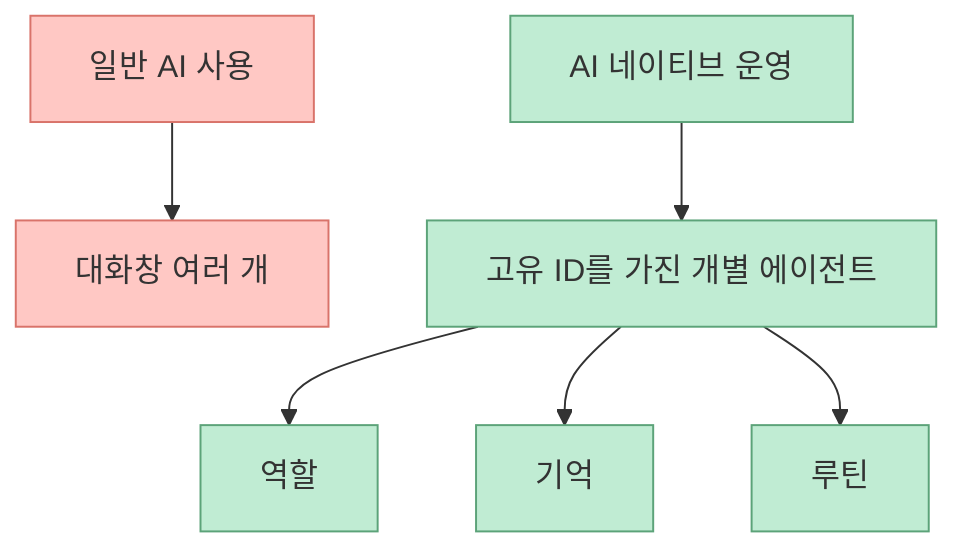
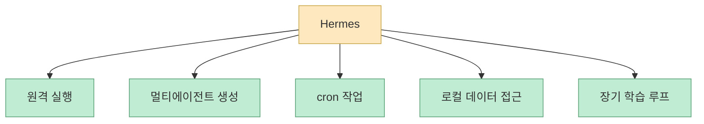
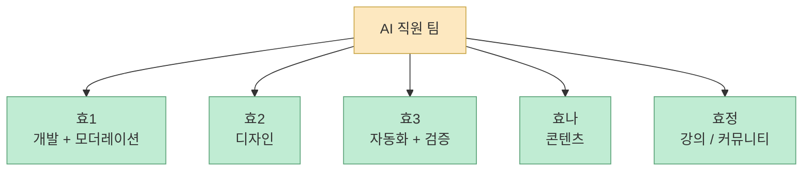
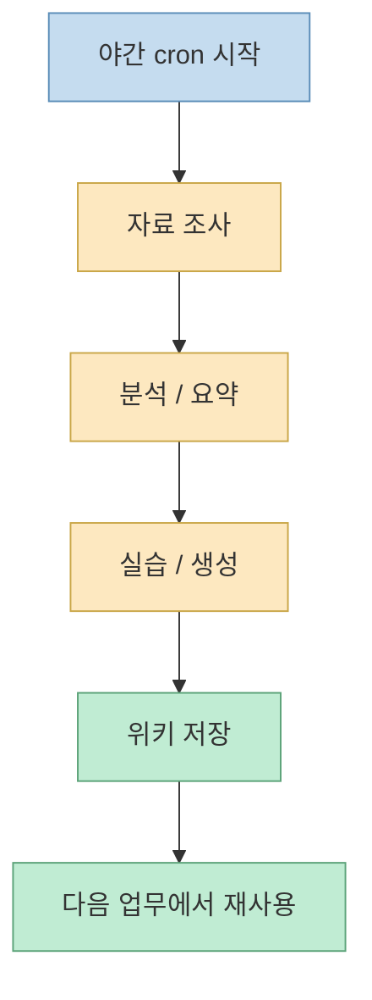
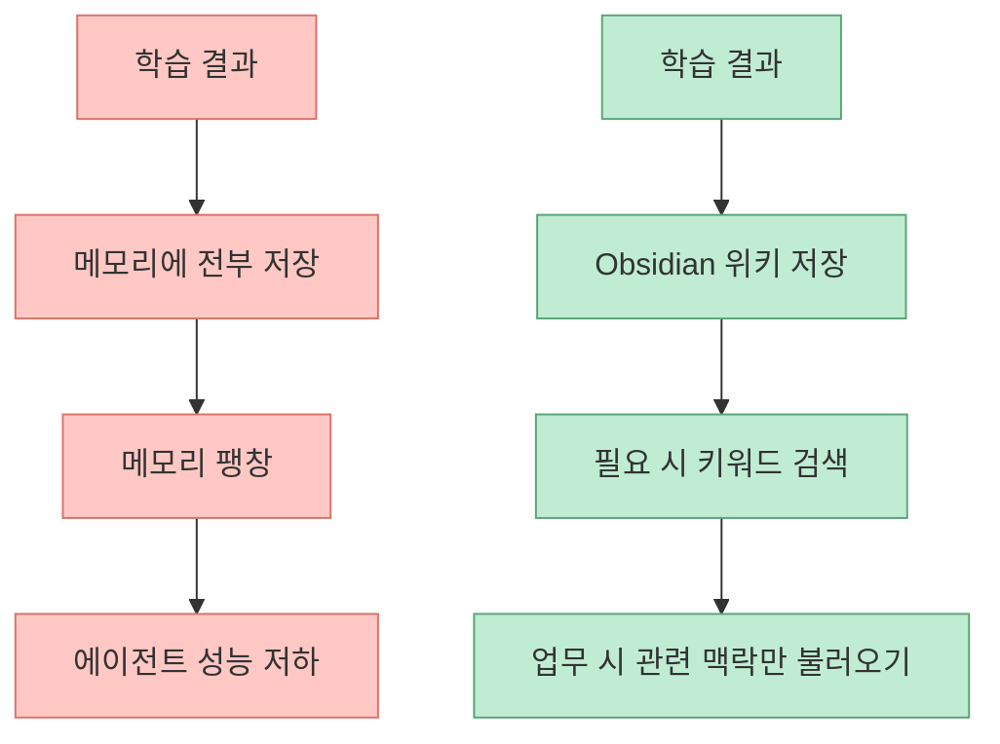
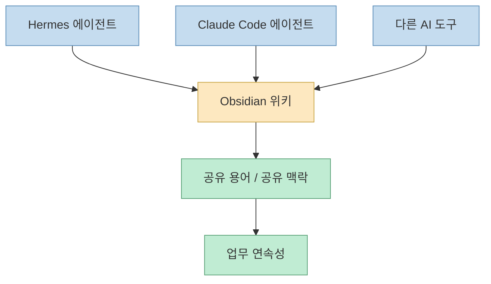
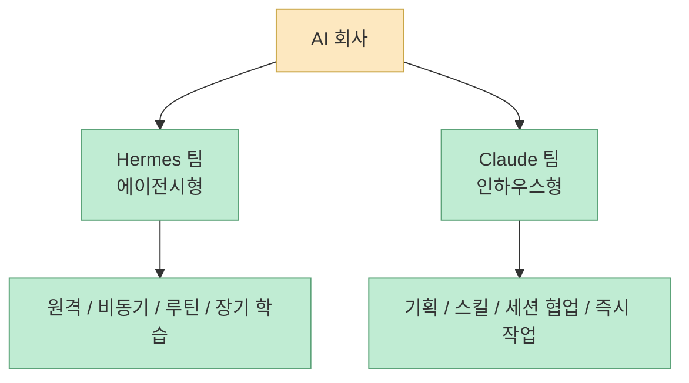

이 영상의 인상적인 점은 “AI 에이전트를 많이 붙였다”는 데 있지 않습니다. 더 본질적인 포인트는 **AI 직원들이 어떻게 장기 기억을 공유하고, 자는 시간 동안 학습하고, 메시지 채널과 로컬 데이터, 코딩 에이전트를 묶어 하나의 회사처럼 운영되는가** 를 보여 준다는 데 있습니다. 발표자는 Hermes 에이전트를 Telegram에 연결하고, Codex와 Claude Code 쪽 에이전트를 분리해 두며, Obsidian 위키를 맥락 공유 시스템으로 두고, cron과 장기 학습 루프를 통해 “쓰면 쓸수록 성장하는 AI 직원 팀”을 만든다고 설명합니다. [영상 0:30](https://youtu.be/vrc0Uv2BfRk?t=30) [영상 8:30](https://youtu.be/vrc0Uv2BfRk?t=510)

즉 이 영상은 설치법보다 운영법에 가깝습니다. 핵심은 “Hermes를 깔아라”가 아니라, **AI 에이전트를 세션이 아닌 직원처럼 다루려면 어떤 레이어가 필요한가** 입니다. 메신저 채널, 역할 분리, 학습 규칙, 야간 학습, 장기 기억 저장소, 자동 커밋, 인하우스/에이전시 분업, ERP까지 이어지는 구조가 한 번에 나옵니다. [영상 1:30](https://youtu.be/vrc0Uv2BfRk?t=90) [영상 11:30](https://youtu.be/vrc0Uv2BfRk?t=690)
<!--more-->

## Sources

- https://youtu.be/vrc0Uv2BfRk?si=Lyyn92h5BO-PvqME

## 1. 출발점은 “AI 직원”을 채팅 세션이 아니라 고유한 개체로 본다는 점이다

영상 초반에 발표자는 자신에게 “열 명의 직원”이 있다고 말합니다. 물론 사람 직원이 아니라 AI 직원입니다. 여기서 중요한 건 수가 아니라 모델링 방식입니다. 발표자는 Telegram 안에 효1, 효2, 효3, 효나, 효정 같은 여러 에이전트를 두고, 이들을 Codex와 연결된 Hermes 에이전트라고 설명합니다. 그리고 이들은 단순히 대화창을 여러 개 늘린 것이 아니라, **각각 고유한 아이디와 역할을 가진 개별 에이전트** 라고 말합니다. [영상 1:00](https://youtu.be/vrc0Uv2BfRk?t=60) [영상 2:00](https://youtu.be/vrc0Uv2BfRk?t=120)

이 차이는 굉장히 큽니다. 세션을 많이 여는 것과, 역할을 가진 에이전트 집합을 운영하는 것은 완전히 다른 문제이기 때문입니다.

즉 이 영상이 말하는 AI 직원은 “채팅 상대”가 아니라, **역할·기억·반복 작업을 가진 운영 단위** 입니다.

## 2. 왜 Hermes인가: 언제 어디서나 원격으로 돌리는 운영 체제가 되기 때문이다

발표자는 Hermes를 “여러 AI 도구를 연결해서 실행시키는 작업 관리자”처럼 설명합니다. 그리고 자신이 Hermes를 쓰는 이유를 다섯 가지 정도로 정리합니다.

- 모바일에서 원격 실행 가능
- 역할이 다른 멀티에이전트 생성/증식 가능
- cron 기반 예약 작업 가능
- 로컬 데이터 활용과 비동기 실행 가능
- 장기 기억과 학습 루프 보유

특히 “어디서나 모바일을 통해 에이전트를 원격으로 실행할 수 있다”는 점과 “정해진 시간이 되면 스스로 루틴 업무를 진행한다”는 점을 강조합니다. [영상 2:00](https://youtu.be/vrc0Uv2BfRk?t=120) [영상 3:00](https://youtu.be/vrc0Uv2BfRk?t=180)

즉 Hermes는 채팅 UI가 아니라, 에이전트들을 **지속적으로 살아 있게 만드는 운영 레이어** 로 쓰이고 있습니다.

## 3. 역할 분리가 분명해야 AI 직원이 된다

영상에서 발표자는 각 에이전트의 직무를 꽤 명확히 나눕니다.

- 효1: 개발 및 다른 에이전트 결과 취합/보고
- 효2: 디자인, 웹/UI/PPT
- 효3: 자동화 및 개발 검증 지원
- 효나: 콘텐츠, 이미지/영상/SNS/크롤링
- 효정: 강의 리서치, 슬라이드, 커뮤니티, 일정

그리고 효3만 Claude Code로 연결되어 있고, 나머지는 Codex+Hermes 계열이라는 식으로 도구도 역할에 따라 나뉩니다. [영상 3:30](https://youtu.be/vrc0Uv2BfRk?t=210) [영상 4:00](https://youtu.be/vrc0Uv2BfRk?t=240)

이 구조가 중요한 이유는, 에이전트 운영의 핵심이 숫자를 늘리는 데 있지 않기 때문입니다. 서로 다른 책임을 가진 개체로 나눠야, 학습시킬 주제와 평가 기준도 분명해집니다.

## 4. “학습”은 프롬프트 몇 줄이 아니라 밤마다 돌리는 루프에서 나온다

영상에서 가장 흥미로운 부분은 학습 방식입니다. 발표자는 좋은 에이전트를 만들려면 결국 물리적인 시간을 투자해야 하지만, 그 시간을 줄이는 방법이 있다고 말합니다. 바로 **내가 자는 시간을 이용하는 것** 입니다. [영상 6:00](https://youtu.be/vrc0Uv2BfRk?t=360) [영상 6:30](https://youtu.be/vrc0Uv2BfRk?t=390)

예를 들면:

- 개발 담당 에이전트에게는 실리콘밸리 개발자 논문, 학술 자료, 뉴스, Reddit, AI 블로그를 깊게 조사시키고
- 디자이너 에이전트에게는 Dribbble, Awwwards, Mobbin, Godly 같은 UI 레퍼런스와 공개 디자인 시스템을 학습시키며
- 추가로 오픈 디자인 같은 툴로 실제로 그려 보게 합니다

즉 학습은 말로 시키는 게 아니라, **자료 탐색 + 위키화 + 반복 실습** 의 루프로 만듭니다. [영상 6:30](https://youtu.be/vrc0Uv2BfRk?t=390) [영상 7:30](https://youtu.be/vrc0Uv2BfRk?t=450)

이건 단순한 스케줄링이 아닙니다. **학습 루프를 업무 외 시간에 자동 실행되게 만드는 설계** 입니다.

## 5. 왜 Obsidian 위키가 필요한가: 메모리에 다 넣으면 오히려 멍청해지기 때문이다

발표자는 아주 중요한 문제를 짚습니다. 매일 밤 리서치를 시키고 그 방대한 자료를 메모리에 다 저장해 버리면, 메모리가 터져 에이전트가 오히려 멍청해진다는 것입니다. 그래서 그는 Obsidian 위키를 “맥락 공유 시스템”으로 사용합니다. 에이전트에게는 다음 규칙을 줍니다.

- 분석과 학습이 끝나면 Obsidian에 위키화하라
- 메모리는 항상 최대 효율을 유지하라
- 장기 기억에는 업무가 들어오면 키워드로 검색해 Obsidian 정보를 참조하라

[영상 8:30](https://youtu.be/vrc0Uv2BfRk?t=510) [영상 9:00](https://youtu.be/vrc0Uv2BfRk?t=540)

즉 장기 기억을 “메모리에 다 때려 넣는 것”과 “외부 위키를 검색해 필요할 때 참조하는 것”은 다릅니다. 발표자는 후자를 택합니다. 이게 바로 맥락 공유 시스템의 핵심입니다.

## 6. 진짜 힘은 개별 에이전트가 아니라 “공유 맥락”에서 나온다

영상은 다섯 명의 Hermes 에이전트가 각각 따로 노는 것이 아니라, 모두가 같은 Obsidian 위키를 보고 같은 목표를 향해 일한다고 설명합니다. 더 나아가 Claude Code 쪽 인하우스 에이전트들과 Telegram의 Hermes 에이전트들까지도 같은 위키를 통해 맥락을 공유한다고 말합니다. [영상 9:30](https://youtu.be/vrc0Uv2BfRk?t=570) [영상 11:00](https://youtu.be/vrc0Uv2BfRk?t=660)

이게 왜 중요하냐면, 도구가 달라도 지식 저장소가 같으면:

- 하던 작업을 바로 이어서 할 수 있고
- 같은 설명을 반복하지 않아도 되며
- 역할이 다른 에이전트끼리도 같은 단어를 쓰게 되고
- 결과적으로 하나의 회사처럼 움직일 수 있기 때문입니다

즉 영상이 말하는 진짜 핵심은 AI 직원 수가 아니라, **모든 에이전트가 같은 회사의 기억을 공유하도록 만드는 구조** 에 있습니다.

## 7. 자동 커밋과 저장도 운영 체제의 일부다

발표자는 세 시간마다 자동 커밋하고 Obsidian에 저장하도록 cron을 걸어 두었다고 말합니다. 이유는 단순합니다. 사람이 업무에 집중하다 보면 저장이나 커밋을 놓치기 때문입니다. [영상 9:30](https://youtu.be/vrc0Uv2BfRk?t=570)

이 점은 사소해 보이지만 중요합니다. AI 네이티브 운영 체제를 만든다는 것은 화려한 에이전트 기능만 의미하지 않습니다. 오히려:

- 상태가 날아가지 않게 하고
- 작업 흔적이 남게 하고
- 장기 기억이 업데이트되게 하고
- 사람은 일에만 집중하게 하는 것

이런 바닥 기능이 포함되어야 합니다.

## 8. 왜 Hermes 팀과 Claude 팀을 분리했나: “에이전시”와 “인하우스”의 분업이다

발표자는 처음에 직원이 열 명이라고 했지만, 실제로 Telegram의 Hermes 쪽은 다섯 명이고 나머지 다섯 명은 Claude 프로젝트 쪽에 있다고 설명합니다. 이들을 굳이 분리한 이유는 주간 업무 중 Hermes 에이전트들을 방해하지 않기 위해서라고 말합니다. 사람 조직으로 비유하면 Hermes 팀은 에이전시, Claude Code 에이전트들은 인하우스라고 보면 된다고 합니다. [영상 10:00](https://youtu.be/vrc0Uv2BfRk?t=600) [영상 10:30](https://youtu.be/vrc0Uv2BfRk?t=630)

이 분업은 꽤 현실적입니다. 모든 에이전트를 하나의 런타임에 몰아넣기보다, **비동기 장기 루프용 팀과 즉시 협업용 팀을 나누는 방식** 이기 때문입니다.

## 9. 이 구조가 결국 향하는 곳은 AI 네이티브 ERP다

영상 후반부에서 발표자는 자신이 만들어 둔 ERP 비슷한 시스템을 보여 줍니다. 여기에는:

- 모든 업무를 보는 대시보드
- 일정 확인용 태스크 뷰
- 직원과 에이전트가 대화하는 메신저
- 에이전트 현황과 예약 작업 현황
- 외부 채널 연결
- 스킬/플러그인 인벤토리
- 토큰 사용량과 사용 빈도 대시보드

같은 기능이 들어 있다고 설명합니다. [영상 11:30](https://youtu.be/vrc0Uv2BfRk?t=690) [영상 12:30](https://youtu.be/vrc0Uv2BfRk?t=750)

즉 발표자가 궁극적으로 만드는 것은 단순한 “AI 에이전트 모음”이 아니라, **에이전트가 조직 구성원처럼 들어와 일하는 ERP형 운영면** 입니다.

## 핵심 요약

- 이 영상의 핵심은 Hermes 설치보다 AI 직원 운영 방식에 있다
- 발표자는 Telegram+Hermes를 원격 운영체제로, Claude Code 팀을 인하우스 팀으로 분리해 쓴다
- 각 에이전트는 고유한 역할과 아이디를 가진 개별 개체로 다뤄진다
- 밤 시간 cron과 학습 루프를 이용해 AI 직원이 스스로 학습하게 만든다
- 방대한 학습 결과는 메모리에 다 넣지 않고 Obsidian 위키에 저장한다
- Obsidian 위키는 Hermes와 Claude 팀을 모두 연결하는 맥락 공유 시스템 역할을 한다
- 자동 커밋, 자동 저장, 채널 연결, 대시보드까지 포함되면서 결국 AI 네이티브 ERP 구조로 발전한다

## 결론

이 영상이 보여 주는 진짜 포인트는 “AI 에이전트를 여러 개 붙였다”가 아닙니다. 더 정확히는, **에이전트가 학습하고 협업하고 기억을 공유하는 조직 운영 구조를 만들었다** 는 데 있습니다. Hermes, Telegram, Codex, Claude Code, Obsidian, cron을 묶어 보면 결국 필요한 것은 더 똑똑한 단일 에이전트가 아니라, **역할 분리 + 장기 기억 + 루틴 학습 + 맥락 공유** 를 갖춘 운영 체제라는 사실이 드러납니다. 이 방향이야말로 AI 네이티브 팀이 실제 업무로 들어오는 가장 현실적인 경로에 가깝습니다.
