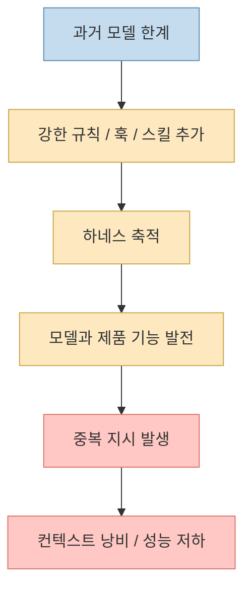
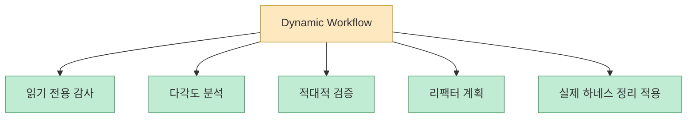
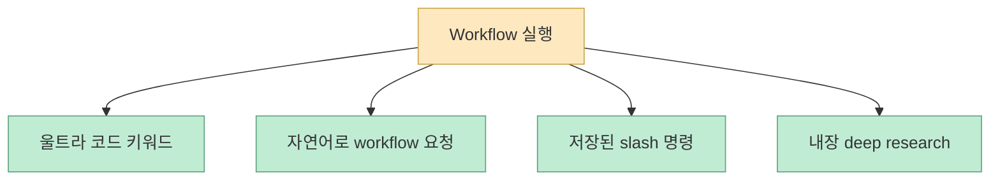
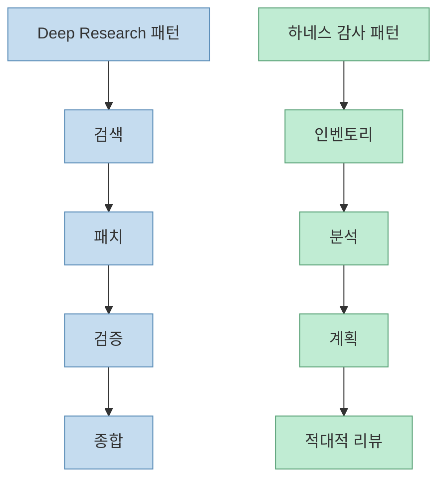
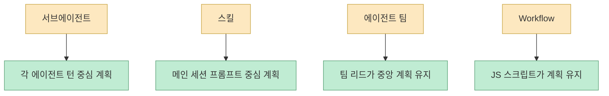
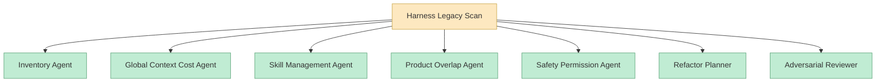
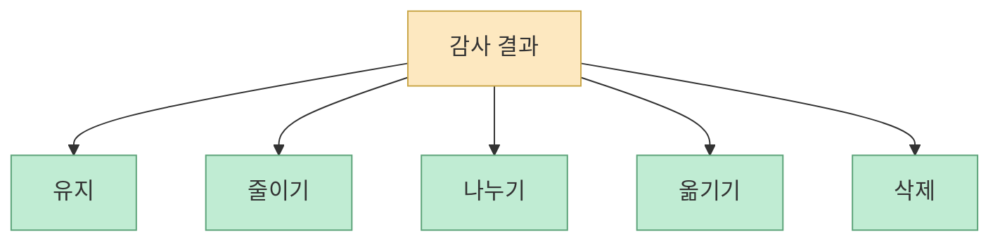
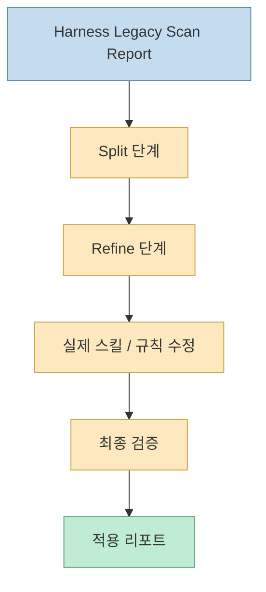
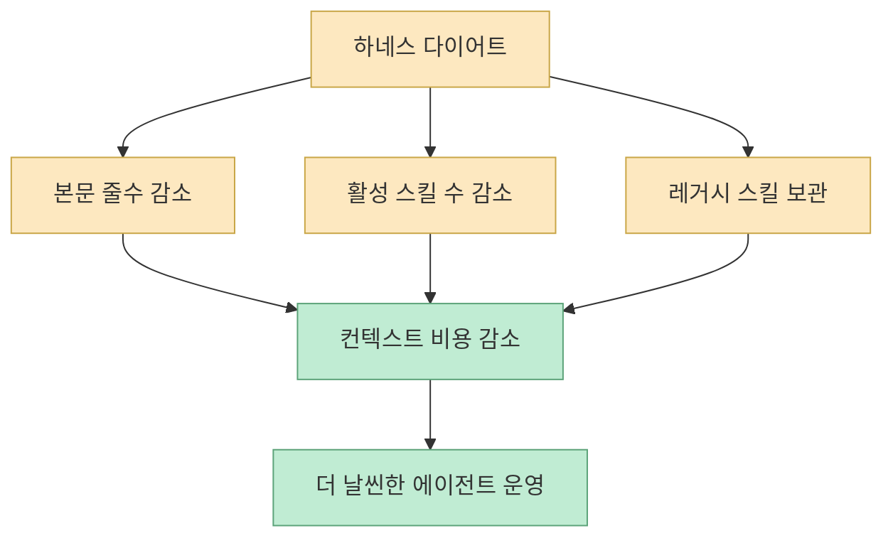

하네스 엔지니어링 이야기를 할 때 보통은 “무엇을 더 붙일까”에 시선이 쏠립니다. 어떤 규칙을 추가할지, 어떤 훅을 더 걸지, 어떤 스킬을 더 세밀하게 만들지 같은 식이죠. 그런데 이번 영상은 방향을 반대로 잡습니다. **좋아진 코딩 에이전트 시대에는 하네스를 계속 쌓는 것보다, 예전에 필요했던 낡은 하네스를 주기적으로 제거하는 것이 더 중요하다** 는 주장입니다. 그리고 이 정리 작업을 Claude Code의 Dynamic Workflow로 자동화할 수 있다고 설명합니다. [영상 0:00](https://youtu.be/fInMcawbKng?t=0) [영상 2:00](https://youtu.be/fInMcawbKng?t=120)

이 메시지가 중요한 이유는, 오늘날의 Claude Code, Codex, Cursor 자체가 이미 하나의 하네스이기 때문입니다. 파일 읽기, 코드 수정, 터미널 실행, 메모리, 툴, 스킬 같은 기본 장치가 이미 내장된 상태인데, 과거 모델 성능이 부족하던 시절에 만든 규칙을 계속 얹으면 오히려 중복 지시와 컨텍스트 낭비가 발생할 수 있습니다. 그래서 발표자는 이제 질문을 “어떤 하네스를 더 붙일까”에서 “어떤 하네스가 이미 불필요해졌나”로 옮겨야 한다고 말합니다. [영상 1:00](https://youtu.be/fInMcawbKng?t=60) [영상 14:00](https://youtu.be/fInMcawbKng?t=1380)
<!--more-->

## Sources

- https://youtu.be/fInMcawbKng?si=imrQ897bUve7v53C

## 1. 왜 하네스도 노후화되나

영상 초반의 핵심 진단은 간단합니다. 예전에는 모델이 지시를 잘 안 따르니, “이 파일부터 읽어라”, “바로 구현하지 말아라”, “반드시 계획부터 세워라” 같은 울타리를 많이 둘 수밖에 없었습니다. 그런데 지금은 Opus 4.8, GPT-5.5 같은 모델 성능이 좋아졌고, Claude Code 같은 코딩 에이전트 자체에도 기본 하네스가 많이 들어가 있습니다. 그 결과 예전 규칙이 지금은 도움이 아니라 방해가 될 수 있다는 것입니다. [영상 0:30](https://youtu.be/fInMcawbKng?t=30) [영상 1:30](https://youtu.be/fInMcawbKng?t=90)

즉 같은 규칙이라도 수명이 있습니다.

- 예전에는 필수였던 강제 규칙
- 지금은 제품 기본 기능과 겹치는 지시
- 지금은 모델이 자연스럽게 해내는 행동

이런 것들이 쌓이면 결국 하네스가 에이전트를 보호하는 대신, **계속 같은 말을 반복하는 무거운 껍데기** 가 됩니다.

그래서 영상의 출발점은 “새 기능을 어떻게 쓰나”보다 **기존 하네스가 아직도 필요한지 감사를 해야 한다** 는 데 있습니다.

## 2. Dynamic Workflow를 하네스 다이어트에 쓰자는 발상이 핵심이다

발표자는 Dynamic Workflow를 “자바스크립트 기반으로 여러 개의 서브에이전트를 오케스트레이션하는 기능”으로 설명합니다. 사용자가 작업을 던지면 Claude Code가 그 작업에 맞는 JavaScript 스크립트를 백그라운드에서 생성하고 실행하며, 현재 세션은 다른 일에 계속 쓸 수 있다고 말합니다. [영상 4:00](https://youtu.be/fInMcawbKng?t=240) [영상 4:30](https://youtu.be/fInMcawbKng?t=270)

여기서 중요한 포인트는, 이 기능을 단순 리서치나 대형 코딩 작업용으로만 보지 않는다는 점입니다. 발표자는 오히려 Dynamic Workflow가:

- 낡은 하네스를 다각도로 감사하고
- 여러 서브에이전트로 역할을 나누어 검토하고
- 마지막에는 실제 리팩터링 계획과 실행까지 이어지게 하는

**하네스 관리용 메타 워크플로우** 로도 적합하다고 봅니다.

이 관점이 좋은 이유는, 하네스 관리 자체를 또 하나의 장기 작업으로 보기 때문입니다. 즉 “규칙 만들기”만 엔지니어링이 아니라, **규칙을 줄이고 구조를 옮기는 작업도 엔지니어링** 이라는 뜻입니다.

## 3. Workflow를 부르는 세 가지 경로도 실전적으로 중요하다

영상은 Dynamic Workflow를 부르는 방법을 꽤 실용적으로 설명합니다.

- 프롬프트에 `울트라 코드` 키워드를 넣는다
- 자연어로 “워크플로우로 처리해 달라”고 요청한다
- 기본 내장 워크플로우인 `/deep research`를 사용한다

또 `/effort`에서 low, medium, high, xhigh, max 같은 생각 수준을 고를 수 있고, 필요할 때만 울트라코드/워크플로우를 부르는 방식을 권장합니다. 발표자 자신도 기본 모드는 xhigh 쪽으로 두고, 정말 필요할 때만 워크플로우를 켠다고 말합니다. [영상 4:30](https://youtu.be/fInMcawbKng?t=270) [영상 5:00](https://youtu.be/fInMcawbKng?t=300) [영상 5:30](https://youtu.be/fInMcawbKng?t=330)

즉 Workflow는 “항상 켜는 모드”가 아니라, **비싼 대신 복합적인 작업에만 쓰는 고급 실행 계층** 으로 이해하는 편이 맞습니다.

## 4. Deep Research를 예로 든 이유: 하네스 감사에도 같은 패턴을 쓸 수 있기 때문이다

영상은 먼저 Claude Code의 기본 내장 Dynamic Workflow인 Deep Research를 보여 줍니다. 여기서는 검색, 패치, 검증, 종합 같은 여러 페이즈가 있고, 각 페이즈마다 여러 서브에이전트가 병렬로 움직입니다. 검색에서는 여러 서브에이전트가 나뉘어 리서치를 하고, 패치 단계에서는 실제 웹 문서를 대량 수집하고, 검증 단계에서는 더 많은 에이전트가 적대적 검증을 수행하며, 마지막에 종합 리포트를 만듭니다. [영상 6:00](https://youtu.be/fInMcawbKng?t=360) [영상 8:00](https://youtu.be/fInMcawbKng?t=480) [영상 9:00](https://youtu.be/fInMcawbKng?t=540)

핵심은 구조입니다.

- 정보 수집
- 교차 검증
- 적대적 검증
- 종합 리포트

이 패턴은 하네스 감사에도 그대로 적용할 수 있다는 것이 발표자의 발상입니다.

즉 발표자는 Deep Research를 단순 데모로 보여 주는 게 아니라, **Workflow를 어떻게 설계해야 하는지의 템플릿** 으로 먼저 보여 준 셈입니다.

## 5. 서브에이전트·스킬·에이전트 팀과 Workflow의 차이: “계획을 누가 들고 있나”

영상에서 가장 좋은 설명 중 하나는 기존 기술들과 Workflow의 차이를 “플랜을 누가 들고 있나”라는 질문으로 정리한 부분입니다. 발표자에 따르면:

- 서브에이전트는 각 서브에이전트 턴 단위로 계획이 분산될 수 있고
- 스킬은 메인 세션 프롬프트 안에서 계획이 유지되며
- 에이전트 팀은 팀 리드 에이전트가 중앙에서 계획을 관리하고
- Workflow는 JavaScript 스크립트 자체가 계획을 관리합니다

이 차이 때문에 Workflow는 수십~수백 개 서브에이전트까지 확장되기 쉬운 구조를 가집니다. [영상 10:30](https://youtu.be/fInMcawbKng?t=630) [영상 11:00](https://youtu.be/fInMcawbKng?t=660)

즉 Workflow는 단지 “에이전트 더 많이 돌리기”가 아니라, **계획을 프롬프트 밖으로 빼서 스크립트 레벨에서 유지하는 방식** 이라고 보는 편이 정확합니다.

## 6. 첫 번째 커스텀 워크플로우: `Harness Legacy Scan`

영상의 핵심 실습은 두 개의 커스텀 Workflow를 만드는 것입니다. 첫 번째는 읽기 전용 감사 워크플로우인 `Harness Legacy Scan`입니다. 목표는 낡은 규칙, 중복 지식, 과도한 전역 컨텍스트, 지나치게 넓은 스킬, 불필요한 훅/MCP, 제품 기본 기능과 겹치는 설정을 찾아내는 것입니다. [영상 11:30](https://youtu.be/fInMcawbKng?t=690) [영상 13:00](https://youtu.be/fInMcawbKng?t=780)

발표자는 이 스캔을 위해 여러 역할의 에이전트를 둡니다.

- Inventory Agent
- Global Context Cost Agent
- Skill Management Agent
- Product Overlap Agent
- Safety Permission Agent
- Refactor Planner
- Adversarial Reviewer

이 설계의 장점은 한 가지 관점으로만 보지 않는다는 데 있습니다. 스킬이 너무 긴지, 전역 컨텍스트가 과한지, 제품 기본 기능과 중복되는지, 권한이 지나치게 넓은지 같은 문제를 서로 다른 에이전트가 나눠 봅니다.

## 7. 이 스캔 워크플로우가 하는 일은 “삭제 후보 발굴”이 아니라 “행동 분류”다

영상 후반부에서 발표자는 리포트가 단순히 “이거 지워라” 식으로 끝나지 않는다고 설명합니다. 결과는 유지, 줄이기, 나누기, 옮기기, 삭제하기 같은 분류로 정리되고, 사용자 확인이 필요한 것과 기계적으로 제거 가능한 것까지 나눠 줍니다. [영상 19:00](https://youtu.be/fInMcawbKng?t=1140)

즉 이 스캔의 목적은 하네스를 무턱대고 없애는 게 아닙니다. 오히려:

- 유지할 것
- 압축할 것
- 프로젝트 로컬로 옮길 것
- 보관할 것
- 삭제할 것

을 구분해, 하네스를 더 날렵한 구조로 재배치하는 데 있습니다.

그래서 이 과정은 “정리”라기보다 **하네스 아키텍처 리팩터링** 에 더 가깝습니다.

## 8. 두 번째 커스텀 워크플로우: `Harness Diet`

첫 번째 워크플로우가 읽기 전용 감사였다면, 두 번째 `Harness Diet`는 그 리포트를 실제 변경으로 적용하는 실행 워크플로우입니다. 발표자는 이 둘을 한 덩어리로 합치기보다, 먼저 읽기 전용 감사를 돌리고 결과를 직접 검토한 뒤, 그다음 다이어트 워크플로우를 돌리는 순서를 권장합니다. [영상 19:30](https://youtu.be/fInMcawbKng?t=1170) [영상 23:30](https://youtu.be/fInMcawbKng?t=1410)

이 다이어트 워크플로우는 `split`과 `refine` 같은 단계로 구성되고, 스킬 설명을 쪼개거나 불필요한 지시를 정리하는 식으로 실제 파일을 개선합니다. [영상 20:00](https://youtu.be/fInMcawbKng?t=1200) [영상 22:00](https://youtu.be/fInMcawbKng?t=1320)

즉 첫 번째 워크플로우가 진단이면, 두 번째는 **저위험 개선만 자동 적용하는 수술 단계** 라고 볼 수 있습니다.

## 9. 저장과 재사용이 가능한 점도 중요하다

영상은 생성된 워크플로우를 `S` 키로 저장해, 다음에도 재사용할 수 있다고 설명합니다. 저장하면 Claude workflows 폴더에 JavaScript 파일이 생기고, 이후 slash 명령으로 다시 실행할 수 있게 됩니다. [영상 21:00](https://youtu.be/fInMcawbKng?t=1260) [영상 21:30](https://youtu.be/fInMcawbKng?t=1290)

이 점이 중요한 이유는, 하네스 감사와 정리가 일회성 작업이 아니라는 발표자의 핵심 주장과 맞물리기 때문입니다. 즉 이 두 워크플로우는:

- 프로젝트 초기에 한 번 돌리는 도구가 아니라
- 모델과 제품 기능이 업데이트될 때마다
- 한 달에 한두 번 정도 재실행하는 유지보수 루틴

으로 보는 편이 맞습니다. [영상 23:00](https://youtu.be/fInMcawbKng?t=1380) [영상 23:30](https://youtu.be/fInMcawbKng?t=1410)

## 10. 실제 결과가 보여 주는 것: 컨텍스트 절감은 곧 운영 효율이다

영상에서 발표자가 보여 준 최종 결과 중 인상적인 부분은, 스킬 본문이 약 2,600줄에서 1,800줄 정도로 줄었고, 활성 스킬 수가 29개에서 28개로 줄었으며, 사용하지 않는 노션 관련 스킬이 보관 처리되었다는 점입니다. [영상 22:00](https://youtu.be/fInMcawbKng?t=1320) [영상 22:30](https://youtu.be/fInMcawbKng?t=1350)

이 수치의 의미는 단순 미관 개선이 아닙니다.

- 불필요한 전역 컨텍스트 감소
- 에이전트가 매번 읽어야 하는 지시량 감소
- 활성 스킬 표면적 감소
- 실제 사용하는 작업 흐름에 더 가까운 구조로 재배치

즉 하네스 다이어트는 “정리 정돈”이 아니라 **컨텍스트 예산 절감과 실행 표면 축소** 입니다.

발표자가 말하듯, 앞으로의 좋은 하네스는 계속 쌓여만 가는 구조가 아니라 **계속 갱신되고 줄어들 수 있는 구조** 여야 합니다. [영상 23:00](https://youtu.be/fInMcawbKng?t=1380)

## 핵심 요약

- 하네스는 한 번 만들면 끝나는 자산이 아니라, 모델과 제품 진화에 따라 노후화된다
- 지금은 새로운 하네스를 더 붙이는 것보다 낡은 하네스를 주기적으로 덜어내는 것이 중요할 수 있다
- Claude Code Dynamic Workflow는 이 감사와 정리 작업을 위한 메타 워크플로우로도 활용 가능하다
- 발표자는 `Harness Legacy Scan`과 `Harness Diet`라는 두 단계 워크플로우를 제안한다
- 첫 번째는 읽기 전용 감사, 두 번째는 저위험 변경 적용이다
- 스킬, 훅, MCP, 전역 컨텍스트, 제품 기본 기능과의 중복을 다각도로 검토하는 것이 핵심이다
- 하네스 다이어트의 목적은 단순 삭제가 아니라 유지/압축/이동/분리/보관/삭제를 구조적으로 분류하는 데 있다

## 결론

이 영상이 던지는 가장 중요한 메시지는 “하네스를 더 만들어라”가 아니라, **하네스도 기술 부채가 될 수 있으니 주기적으로 감사하고 줄여라** 입니다. Claude Code Dynamic Workflow는 단지 더 큰 일을 시키는 기능이 아니라, 우리가 이미 만들어 놓은 규칙과 스킬, 전역 지시 체계를 다시 점검하고 정리하는 메타 도구가 될 수 있습니다. 앞으로 좋은 하네스 엔지니어링은 추가만 잘하는 사람이 아니라, **언제 무엇을 지워야 하는지 아는 사람** 이 더 잘하게 될 가능성이 큽니다.
