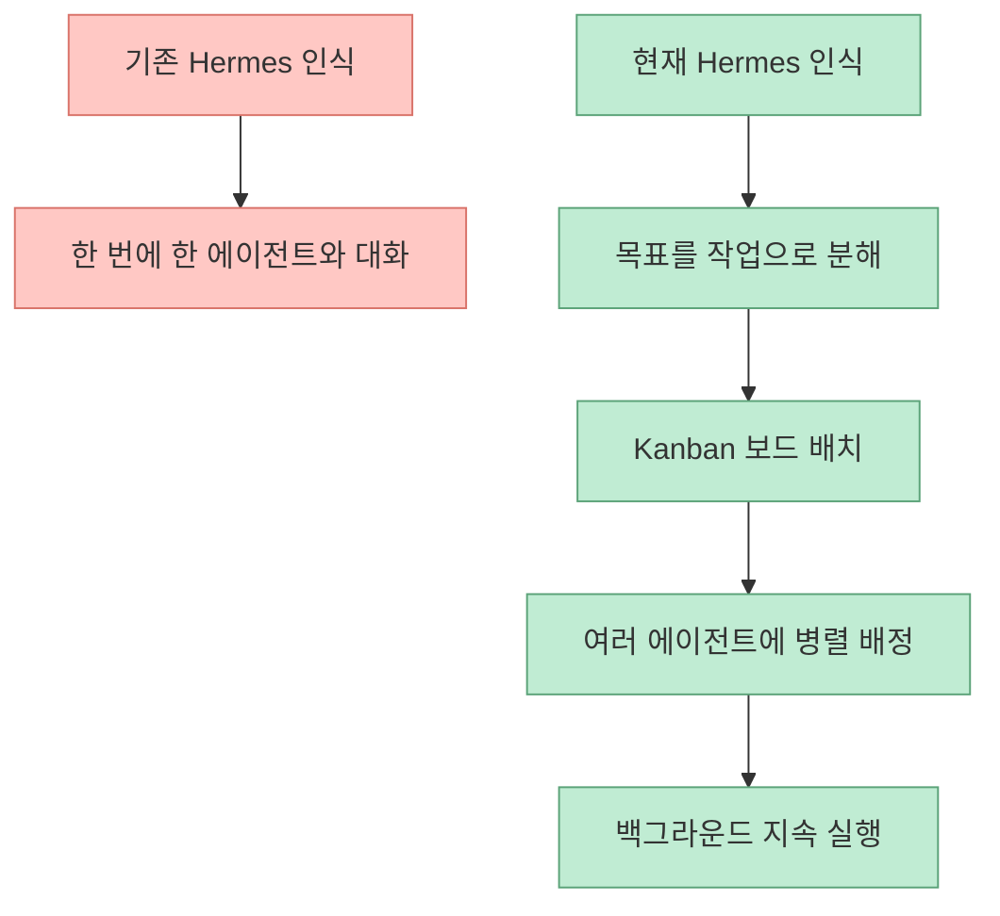
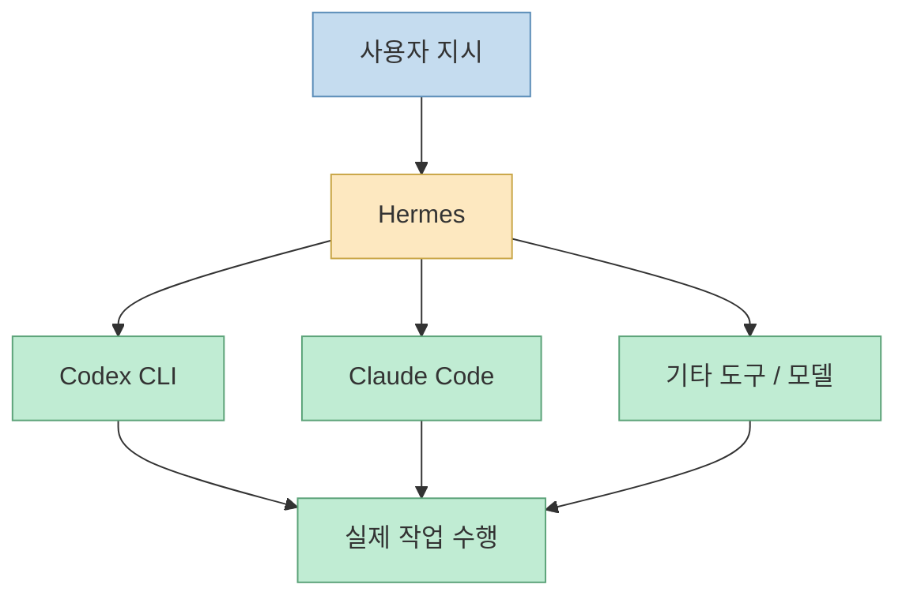
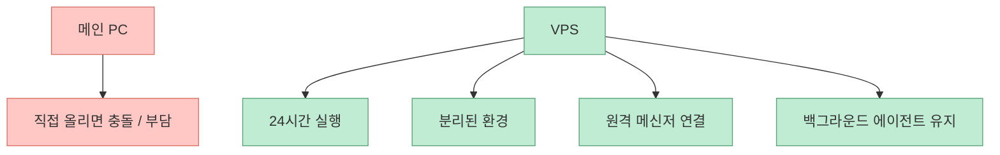
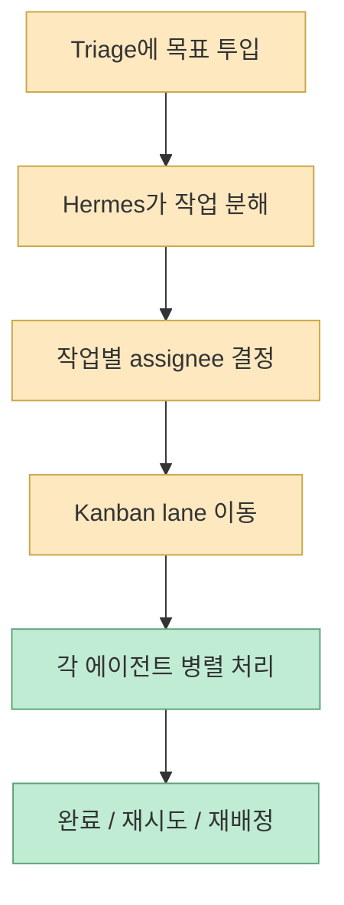
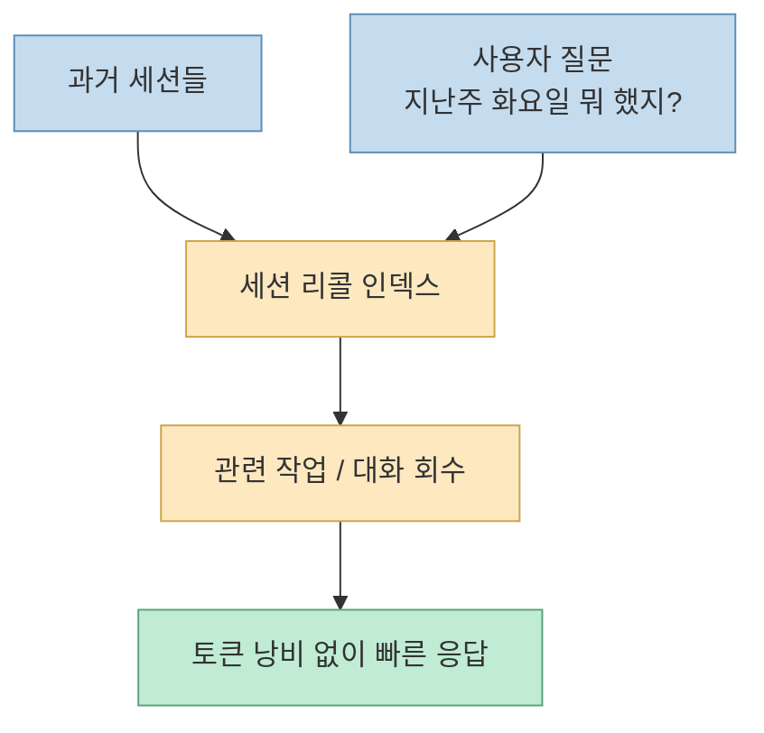
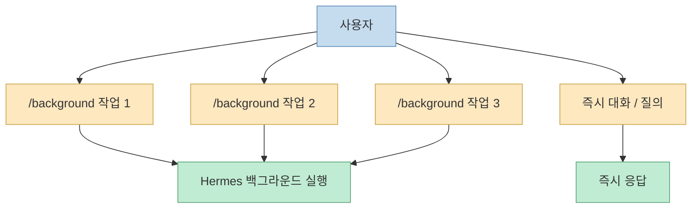
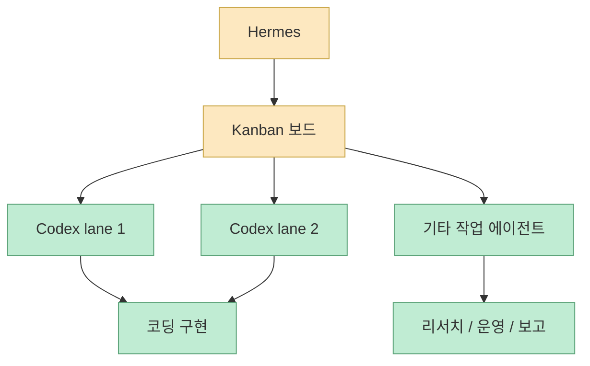

최근 Hermes Agent를 둘러싼 변화 중 가장 중요한 것은 “더 많은 기능이 붙었다”가 아닙니다. 더 정확한 표현은, **단일 에이전트가 한 번에 한 가지 일을 처리하던 도구에서, 여러 프로필과 여러 작업을 동시에 굴리는 멀티에이전트 운영 플랫폼으로 성격이 바뀌고 있다** 는 것입니다. 이번 영상은 그 변화를 아주 실무적인 관점에서 보여 줍니다. 목표를 던지면 작업을 쪼개고, 칸반 보드에 올리고, 여러 에이전트에게 배정하고, 백그라운드에서 계속 돌리며, 세션 단위 기억까지 꺼내오는 흐름입니다. [영상 0:00](https://youtu.be/1hCMX1mvhDQ?t=0) [영상 8:30](https://youtu.be/1hCMX1mvhDQ?t=510)

공식 문서도 이 방향을 뒷받침합니다. Hermes docs는 이 도구를 “시간이 갈수록 더 유능해지는 self-improving agent”로 설명하고, Kanban을 “fragile in-process subagent swarm 대신 durable SQLite-backed task board로 여러 프로필이 협업하는 구조”라고 정의합니다. 즉 이번 변화는 UI 기능이 아니라, 에이전트 협업 단위를 세션 내부 하위 호출에서 **영속적인 작업 보드와 워커 프로필** 로 올린 전환으로 읽는 편이 맞습니다. [Hermes Docs](https://hermes-agent.nousresearch.com/docs/) [Kanban Docs](https://github.com/NousResearch/hermes-agent/blob/main/website/docs/user-guide/features/kanban.md)
<!--more-->

## Sources

- https://youtu.be/1hCMX1mvhDQ?si=DqGGoCHbpRBz30wi
- https://hermes-agent.nousresearch.com/docs/
- https://github.com/NousResearch/hermes-agent/blob/main/website/docs/user-guide/features/kanban.md
- https://hermes-agent.nousresearch.com/docs/user-guide/features/tools/

## 1. 발표자가 말하는 변화의 핵심은 “멀티에이전트 플랫폼”이다

영상 첫 문장부터 메시지는 명확합니다. 지난 3주 동안 Hermes에 꽤 많은 변화가 있었고, 그중 핵심은 이제 Hermes가 에이전트 하나로 일하는 수준을 넘어서 “진짜 멀티에이전트 플랫폼”이 되었다는 것입니다. 목표를 하나 던지면 여러 작업으로 자동 분해하고 동시에 처리할 수 있다는 설명이 바로 나옵니다. [영상 0:00](https://youtu.be/1hCMX1mvhDQ?t=0)

이 말은 단순히 서브태스크를 병렬로 돌린다는 수준과 다릅니다. 발표자와 공식 문서를 함께 보면, 최근 Hermes의 핵심 변화는:

- 여러 named profile이 같은 보드 위에서 협업하고
- 작업이 프로세스 안에서만 살지 않고 영속적으로 남으며
- 각 에이전트가 맡은 일을 백그라운드에서 이어가고
- 사람은 그 사이 다른 요청도 계속 넣을 수 있게 된 것

입니다. [영상 9:00](https://youtu.be/1hCMX1mvhDQ?t=540) [Kanban Docs](https://github.com/NousResearch/hermes-agent/blob/main/website/docs/user-guide/features/kanban.md)

즉 이 변화는 기능 추가보다 **운영 단위의 승격** 에 가깝습니다.

## 2. Hermes는 여전히 “도구”보다 “직원”에 가깝다는 비유가 유효하다

영상은 Hermes를 설명할 때 늘 쓰는 비유가 있다고 말합니다. Hermes는 도구라기보다 직원에 가깝다는 것입니다. 사장이 직원에게 일을 시키고, 직원은 필요하면 Claude Code나 Codex 같은 도구를 골라 실제 작업을 처리하는 구조라는 설명입니다. [영상 1:00](https://youtu.be/1hCMX1mvhDQ?t=60)

이 비유가 중요한 이유는 Hermes가 코딩 도구 자체가 아니라 **도구를 부리는 조정자** 이기 때문입니다. 발표자는 “Claude Code나 Codex는 개발에 특화된 도구고, Hermes는 그런 도구를 부리는 쪽”이라고 정리합니다. 즉 Hermes는 직접 모든 일을 하는 모델이 아니라, 적절한 실행 수단을 호출하는 운영층에 가깝습니다. [영상 1:30](https://youtu.be/1hCMX1mvhDQ?t=90)

그래서 이번 업데이트를 이해할 때도 “Hermes가 더 똑똑해졌다”보다 **Hermes가 더 잘 지휘하게 되었다** 고 보는 편이 맞습니다.

## 3. 왜 VPS가 중요하게 나오는가: 멀티에이전트 운영은 항상 켜진 분리 환경을 원하기 때문이다

영상은 설치 과정을 꽤 길게 다루지만, 설치법보다 중요한 메시지는 따로 있습니다. Hermes 같은 에이전트를 메인 PC 위에서 매일 돌리는 것은 여전히 조심스러운 부분이 있고, 그래서 발표자는 VPS를 사용한다고 말합니다. 항상 켜져 있는 가상 컴퓨터를 빌려 메인 컴퓨터와 분리된 환경에서 24시간 돌리는 방식이죠. [영상 2:00](https://youtu.be/1hCMX1mvhDQ?t=120) [영상 2:30](https://youtu.be/1hCMX1mvhDQ?t=150)

이 점은 멀티에이전트 운영과 잘 맞습니다.

- 작업이 길게 돌아갈 수 있고
- 백그라운드 유지가 필요하고
- 메신저 게이트웨이가 계속 살아 있어야 하며
- 로컬 작업 환경과 분리된 안전지대가 있으면 좋기 때문입니다

즉 VPS는 단순 편의가 아니라, **에이전트를 상시 근무시키기 위한 기본 인프라** 로 등장합니다.

## 4. 이번 업데이트의 실제 핵심은 Hermes Dashboard + Kanban 보드다

영상 중반부에서 발표자는 `hermes dashboard` 명령으로 대시보드를 열고, 여기에 Kanban 보드가 있다고 설명합니다. 왼쪽의 triage는 아직 정리되지 않은 목표나 아이디어를 일단 던져 두는 공간이고, 예를 들어 “새 랜딩 페이지를 만들어 줘” 같은 목표를 올리면 Hermes가 이를 더 잘게 나눠야 하는지 판단하고, 디자인/카피/구현/검수 같은 일로 분해한 뒤 담당 에이전트를 붙일 수 있다고 설명합니다. [영상 8:00](https://youtu.be/1hCMX1mvhDQ?t=480) [영상 9:00](https://youtu.be/1hCMX1mvhDQ?t=540)

공식 Kanban 문서도 같은 방향입니다. Hermes Kanban은 durable task board이며, 여러 named profile이 fragile subagent swarm 대신 durable message queue + state machine 위에서 협업하게 해 주는 구조라고 설명합니다. [Kanban Docs](https://github.com/NousResearch/hermes-agent/blob/main/website/docs/user-guide/features/kanban.md)

즉 이 기능은 “대화형 에이전트”를 “보드 기반 작업 운영 시스템”으로 한 단계 끌어올립니다.

## 5. 세션 리콜은 단순 기억이 아니라 비용 없는 운영 회상 장치에 가깝다

영상은 메모리 기능 강화도 중요하게 다룹니다. 세션 리콜이 생겨서 “지난주 화요일에 뭐 했지?” 같은 질문에, 그날 어떤 작업과 대화가 있었는지를 찾아 알려줄 수 있다고 설명합니다. 그리고 이 과정이 토큰을 쓰지 않고 처리되기 때문에 비용 부담 없이 빠르다고 강조합니다. [영상 10:00](https://youtu.be/1hCMX1mvhDQ?t=600)

여기서 중요한 건 단순한 기억 보존이 아니라, **세션 단위 작업 히스토리를 운영 질의 가능한 구조로 꺼낼 수 있게 됐다** 는 점입니다.

이건 개인 비서형 에이전트에도 유용하지만, 특히 여러 작업을 동시에 돌리는 멀티에이전트 환경에서는 더 중요합니다. 무엇을 언제 누구에게 맡겼는지 잊지 않게 해 주기 때문입니다.

## 6. 백그라운드 작업과 대화 병행은 “세 탭 열기”를 없애는 기능이다

발표자는 `/background` 예시를 들며, 랜딩 페이지 만들기, 업데이트 요약, Product Hunt 제품 조사 같은 일을 백그라운드로 맡겨 두고 그 사이 “우리나라 월드컵 첫 경기가 언제지?” 같은 다른 질문을 할 수 있다고 설명합니다. 즉 여러 탭을 열고 각각에 한 가지씩 맡기는 대신, 한 에이전트 시스템 안에서 여러 일을 병렬 처리하게 만드는 것입니다. [영상 11:00](https://youtu.be/1hCMX1mvhDQ?t=660)

이 기능은 멀티에이전트 플랫폼화의 실전 감각을 가장 잘 보여 줍니다. Hermes가 채팅창 하나를 넘어 **작업 큐와 대화 인터페이스를 동시에 가진 시스템** 으로 변하고 있다는 뜻이니까요.

## 7. Codex CLI 공식 연동은 Hermes를 더 강한 총괄자로 만든다

영상 후반부는 Codex CLI 연동을 강조합니다. Hermes가 전체를 지휘하고 실제 코딩은 Codex가 처리하는 식이라는 설명이 나옵니다. 여러 개를 동시에 돌릴 수 있으므로, 앞서 본 Kanban과 결합하면 코딩 작업도 병렬로 처리할 수 있다고 말합니다. [영상 11:30](https://youtu.be/1hCMX1mvhDQ?t=690)

이건 Hermes의 정체성을 분명히 해 줍니다.

- Hermes = 총괄/오케스트레이터
- Codex CLI = 구현/코딩 워커

공식 스킬 카탈로그에도 `kanban-codex-lane` 같은 항목이 보이는데, 이는 Hermes Kanban 워커가 Codex CLI를 고립된 구현 레인으로 사용하도록 하는 용도입니다. [Skills Catalog](https://hermes-agent.nousresearch.com/docs/reference/skills-catalog/)

즉 이번 변화는 Hermes가 직접 모든 걸 더 잘하게 되었다기보다, **다른 강한 도구들을 더 잘 묶게 되었다** 는 쪽에 가깝습니다.

## 8. 추가 업데이트들도 방향은 같다: 컴퓨터 사용, 영상 생성, X 실시간 검색

발표자는 직접 깊게 시연하진 않지만, 확인할 만한 세 가지 업데이트를 더 언급합니다.

- macOS computer use
- Hermes 안에서의 영상 생성
- X 실시간 검색

공식 tools 문서도 media 계열에 `video_generate`, `video_analyze`, 이미지 생성, 웹 검색, 메모리/세션 검색 등을 포함한다고 밝힙니다. 즉 Hermes는 점점 “대화형 작업 관리자”에서 **멀티모달 실행면을 가진 개인 운영체제** 로 확장되고 있습니다. [영상 12:00](https://youtu.be/1hCMX1mvhDQ?t=720) [Tools Docs](https://hermes-agent.nousresearch.com/docs/user-guide/features/tools/)

## 9. 발표자의 결론도 중요하다: 무조건 갈아탈 필요는 없고, 한 번 확인해 볼 만한 변화다

영상 마지막은 꽤 균형 잡혀 있습니다. 이런 새 도구가 나왔다고 해서 나만 안 쓰면 뒤처진다는 조급함을 가질 필요는 없고, 무조건 갈아탈 필요도 없다고 말합니다. 요지는 “이런 게 나왔으니 한번 확인해 보세요”에 가깝습니다. [영상 12:30](https://youtu.be/1hCMX1mvhDQ?t=750)

이 태도가 중요한 이유는, 이번 업데이트가 모든 사용자에게 똑같이 필요한 건 아니기 때문입니다. 하지만 적어도 다음 유형의 사람에게는 분명 매력적입니다.

- 여러 작업을 동시에 굴리고 싶은 사람
- 메신저 기반으로 에이전트를 운영하고 싶은 사람
- 에이전트 간 역할 분리와 작업 보드를 원했던 사람
- Codex/Claude Code를 상위 총괄 에이전트와 결합하고 싶은 사람

즉 이번 변화는 “에이전트를 처음 써보는 사람용”이라기보다, **기존 에이전트 사용자가 운영 복잡성을 한 단계 끌어올릴 수 있게 하는 변화** 로 보는 편이 맞습니다.

## 핵심 요약

- Hermes의 최근 핵심 변화는 단일 에이전트에서 멀티에이전트 운영 플랫폼으로의 전환이다
- Kanban 보드는 목표를 작업으로 분해하고 여러 프로필에게 배정하는 영속적인 작업면을 제공한다
- 세션 리콜은 과거 작업을 저비용으로 되돌아보게 해 주는 운영 기억 장치다
- `/background`는 여러 백그라운드 작업과 즉시 대화를 동시에 유지하게 해 준다
- Codex CLI 연동은 Hermes를 더 강한 총괄 오케스트레이터로 만든다
- Computer Use, 영상 생성, X 실시간 검색 같은 추가 기능은 Hermes를 점점 더 넓은 운영층으로 확장시킨다

## 결론

이번 업데이트를 한 문장으로 줄이면, Hermes는 “똑똑한 단일 비서”에서 “여러 작업과 여러 프로필을 조율하는 작은 운영 체제”로 가고 있습니다. 중요한 건 기능 수가 아니라 구조입니다. Kanban, 세션 리콜, 백그라운드 작업, Codex 연동이 합쳐지면서 Hermes는 단순 대화형 에이전트가 아니라 **지속적이고 병렬적인 작업 운영 시스템** 에 더 가까워졌습니다. 이런 방향이야말로 앞으로 에이전트 도구들이 단순 채팅에서 벗어나 실제 업무 플랫폼이 되는 경로라고 볼 수 있습니다.
