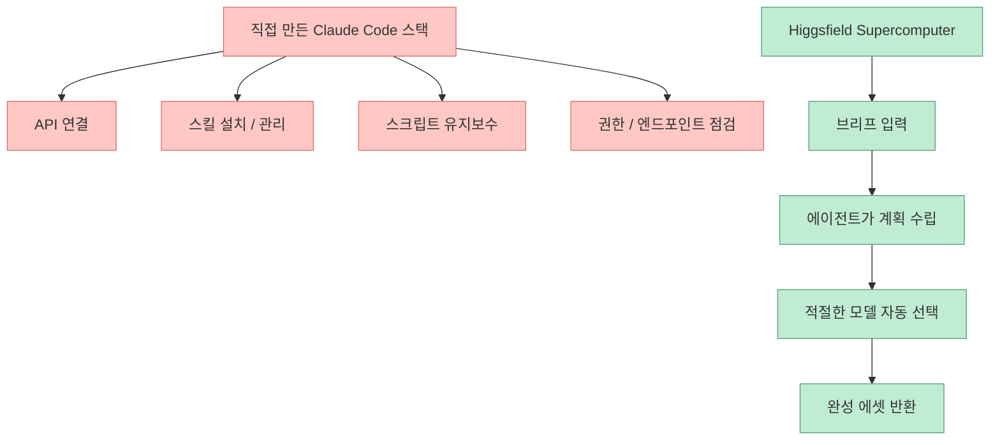
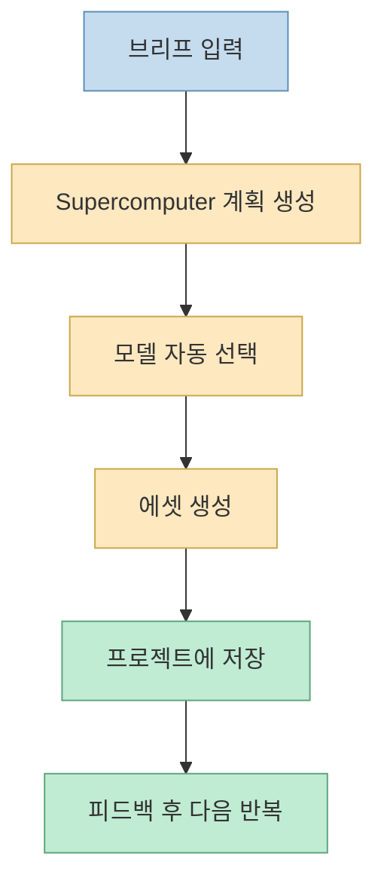
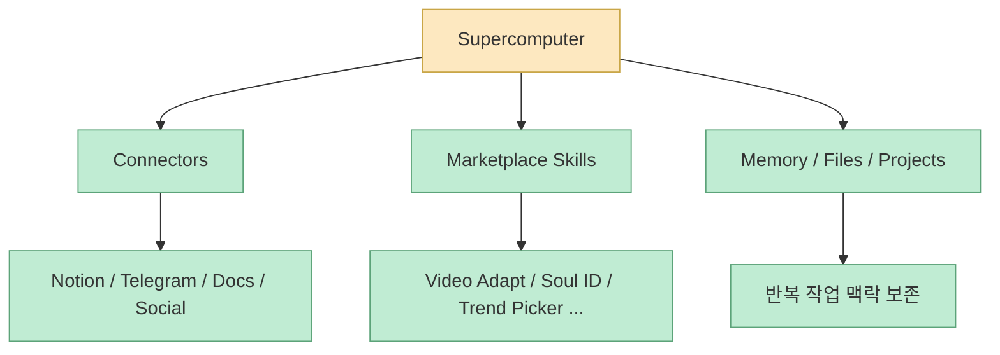
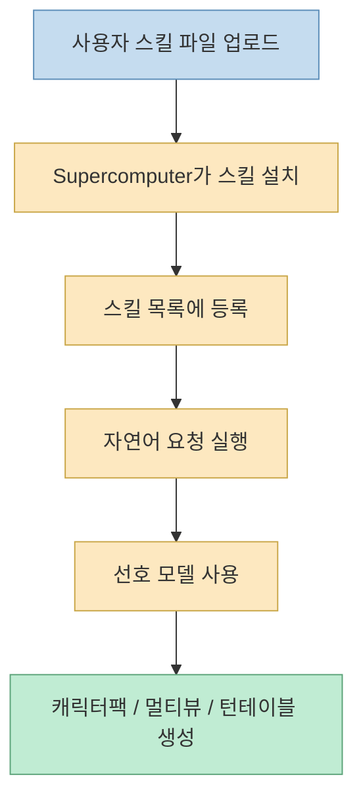
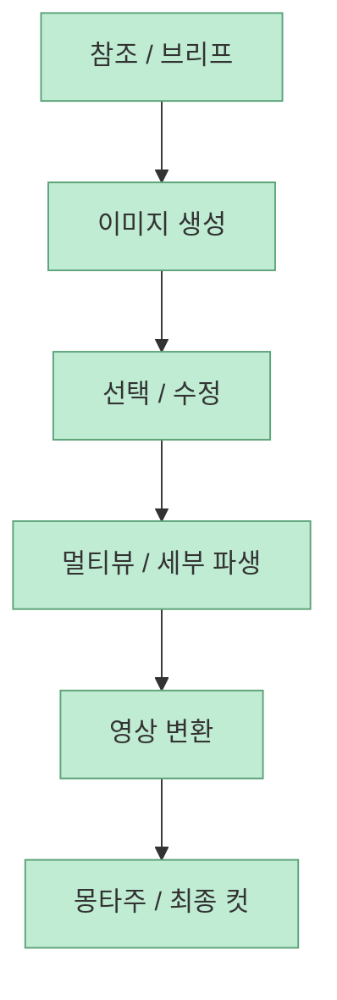
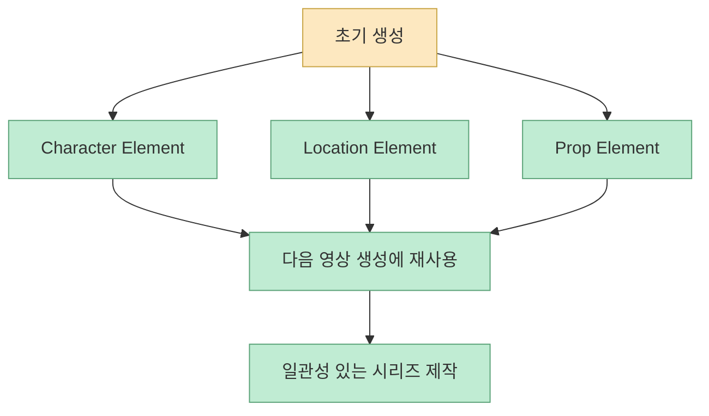
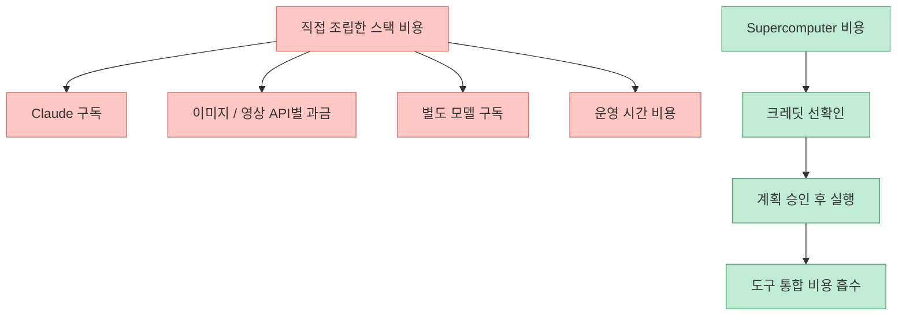
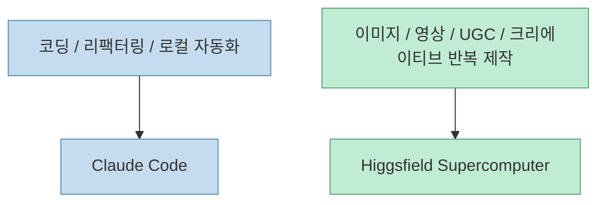

이 영상의 제목은 꽤 자극적입니다. “이 AI 에이전트가 내 Claude Code 세팅을 죽였다”는 식이니까요. 하지만 실제 내용을 보면, 발표자가 Claude Code 자체를 버렸다는 뜻은 아닙니다. 오히려 더 정확한 메시지는 이렇습니다. **코딩에는 여전히 Claude Code가 대체 불가능하지만, 콘텐츠 제작에서는 이미 조립해 둔 Claude Code 기반 자동화보다 Higgsfield Supercomputer 같은 클라우드형 크리에이티브 에이전트가 더 자연스럽고 경제적으로 느껴질 수 있다** 는 것입니다. [영상 0:00](https://youtu.be/sh4FO58SXuw?t=0) [영상 13:30](https://youtu.be/sh4FO58SXuw?t=810)

왜 이런 전환이 생기느냐를 보려면, 두 시스템이 잘하는 일이 다르다는 점부터 봐야 합니다. Claude Code는 코딩 에이전트입니다. 그래서 스킬, 스크립트, API, 권한 우회, 파일 구조, 로컬 자동화처럼 “내가 원하는 파이프라인을 직접 설계해서 붙이는 방식”에 강합니다. 반면 Higgsfield Supercomputer는 공식 소개 문서가 말하듯, 브리프를 받으면 스스로 계획을 세우고, 적절한 모델을 고르고, 최종 에셋까지 내주는 **콘텐츠 제작용 에이전트** 입니다. 즉 둘 다 에이전트이지만, 무게중심이 완전히 다릅니다. [영상 2:00](https://youtu.be/sh4FO58SXuw?t=120) [Higgsfield Intro](https://higgsfield.ai/supercomputer-intro) [Higgsfield Blog](https://higgsfield.ai/blog/agentic-ai-for-content-creation)
<!--more-->

## Sources

- https://youtu.be/sh4FO58SXuw?si=7n7dPPrsEvjIkeTe
- https://higgsfield.ai/supercomputer-intro
- https://higgsfield.ai/blog/agentic-ai-for-content-creation
- https://higgsfield.ai/supercomputer/marketplace/skills

## 1. 발표자가 실제로 말하는 것은 “Claude Code 종료”가 아니라 “콘텐츠 제작 스택 교체”다

영상 도입부에서 발표자는 자신이 오랫동안 직접 구축한 Claude Code 세팅이 있었고, 스킬과 API 키, 스크립트, 권한 우회 설정 등을 붙여 콘텐츠 제작 업무에도 써 왔다고 설명합니다. 하지만 그 세팅을 만드는 데 시간이 많이 들었고, 이미지/영상 생성 API를 하나하나 연결하고, 각 모델의 호출 방식과 설정을 Claude 쪽에 다시 가르쳐야 했다고 말합니다. [영상 2:30](https://youtu.be/sh4FO58SXuw?t=150) [영상 5:00](https://youtu.be/sh4FO58SXuw?t=300)

즉 그가 비교하는 대상은 단순한 “Claude vs Higgsfield”가 아닙니다. 더 정확히는:

- 직접 조립한 Claude Code 기반 콘텐츠 자동화 스택
- 이미 커넥터와 생성 모델, 스킬 마켓, 프로젝트 자산 관리가 붙어 있는 Higgsfield Supercomputer

사이의 비교입니다.

그래서 이 영상은 “코딩 에이전트끼리의 정면 비교”라기보다, **제작 워크플로의 책임을 누가 더 많이 가져가느냐** 의 비교로 보는 편이 맞습니다.

## 2. Higgsfield Supercomputer가 다른 점은 “모델을 쓰게 해주는 도구”가 아니라 “결과물까지 가져가는 에이전트”라는 점이다

Higgsfield 공식 소개 문서는 Supercomputer를 “Higgsfield를 대신 실행해 주는 채팅”으로 설명합니다. 사용자가 만들고 싶은 것을 자연어로 설명하면, Supercomputer가 계획을 세우고, 적절한 모델과 프리셋을 고르고, 최종 자산을 전달한다는 구조입니다. 블로그도 같은 메시지를 반복합니다. 이건 단순한 생성 툴이 아니라, **계획 수립 + 모델 라우팅 + 결과 조립** 을 묶어 주는 클라우드 네이티브 에이전트라는 것입니다. [Higgsfield Intro](https://higgsfield.ai/supercomputer-intro) [Higgsfield Blog](https://higgsfield.ai/blog/agentic-ai-for-content-creation)

이 관점은 발표자가 영상에서 느낀 편의성과 정확히 맞닿습니다. 그는 “무엇을 만들고 싶은지”만 말하고, 나머지 시퀀스는 이미 시스템 안에 들어 있다고 느낍니다.

즉 핵심 차이는 “더 좋은 모델을 쓴다”가 아닙니다. **크리에이터가 직접 조립하던 단계들을 제품 안으로 흡수했느냐** 가 더 중요합니다.

## 3. 이 영상에서 반복해서 강조되는 강점은 커넥터와 스킬의 사전 탑재다

발표자는 Supercomputer에 Notion, YouTube 분석, Telegram, 문서 도구 등 자신이 쓰는 서비스들이 연결될 수 있다고 말하고, 기본 스킬이 50개 이상 들어 있으며, 커뮤니티 스킬과 메모리 기능도 있다고 강조합니다. [영상 0:30](https://youtu.be/sh4FO58SXuw?t=30) [영상 1:00](https://youtu.be/sh4FO58SXuw?t=60)

공식 사이트도 이 설명과 대체로 맞습니다. Supercomputer intro 페이지는 메모리와 스킬 import를 강조하고, marketplace는 Audio Generation, Video Adapt, Brand Analyzer, Soul ID, Trend Picker, Organic Marketing, Prompt Engineering Expert, Cinematic Scene Generation 같은 다양한 스킬을 보여 줍니다. [Higgsfield Intro](https://higgsfield.ai/supercomputer-intro) [Marketplace](https://higgsfield.ai/supercomputer/marketplace/skills)

이게 왜 중요하냐면, Claude Code 기반 세팅에서 가장 많은 시간이 드는 부분이 바로 “모델 호출”보다 **도구 연결과 작업 순서 정의** 이기 때문입니다.

## 4. 발표자가 가장 감탄한 부분은 “내 스킬을 업로드했더니 바로 설치되고 굴러갔다”는 점이다

영상 중반부의 첫 큰 데모는 character sheet 자동화입니다. 발표자는 자신의 스킬 파일을 채팅에 올리고 “install the skill”이라고 했더니, Supercomputer가 이를 설치하고 이름을 붙이고 자기 스킬 목록에 넣었다고 말합니다. 그리고 곧바로 “이 포즈의 캐릭터 레퍼런스 팩을 만들어 달라” 같은 지시로 실제 생성 파이프라인을 수행합니다. [영상 3:30](https://youtu.be/sh4FO58SXuw?t=210) [영상 4:00](https://youtu.be/sh4FO58SXuw?t=240)

그가 특히 강조하는 포인트는 이겁니다.

- 특정 이미지 모델 선호만 알려줬다
- 별도 스크립트 경로나 세부 설정은 거의 말하지 않았다
- 하지만 에이전트가 스킬 안의 순서를 따라가며 생성했다

이건 결국 “프롬프트를 잘 넣었다”기보다, **워크플로가 상품화된 스킬 안에 들어 있었다** 는 뜻입니다.

즉 제작 쪽에서는 “내가 만든 자동화”가 곧바로 **클라우드 에이전트의 내장 기능처럼 흡수되는 경험** 이 큰 차이를 만듭니다.

## 5. 콘텐츠 제작에서는 “설치와 배선”보다 “반복 가능한 시퀀스”가 더 중요해진다

발표자는 Claude Code 세팅에서도 같은 스킬을 작동시킬 수 있지만, 그 경우 각 API 호출마다 설정을 지정하고, Seedance나 Nano Banana Pro 같은 도구 사용 방식을 별도로 가르쳐야 했다고 말합니다. 반대로 Supercomputer에서는 이런 부분이 이미 감춰져 있어 자신은 결과에만 집중할 수 있었다고 말합니다. [영상 5:00](https://youtu.be/sh4FO58SXuw?t=300) [영상 6:00](https://youtu.be/sh4FO58SXuw?t=360)

이 차이는 제작 작업에서 특히 큽니다. 왜냐하면 크리에이티브 워크플로는 종종:

- 여러 모델을 순서대로 쓰고
- 중간 산출물을 다음 단계에 넘기고
- 같은 요소를 재사용하며
- 매번 작은 피드백 루프를 여러 번 돌기 때문입니다

이런 다단계 시퀀스는 Claude Code처럼 범용 에이전트에서도 만들 수 있지만, 발표자의 요지는 “만들 수 있다”와 “이미 되어 있다”의 차이가 생각보다 크다는 것입니다.

## 6. “elements” 개념이 중요한 이유: 자산을 일회성 결과가 아니라 재사용 가능한 토큰으로 다룬다

영상 후반부에서 발표자는 samurai 캐릭터나 dojo courtyard 같은 요소를 먼저 만들고, 나중에 다른 영상 생성 세션에서 다시 불러와 재사용합니다. 그는 이것을 Higgsfield의 “elements” 개념으로 설명합니다. [영상 10:00](https://youtu.be/sh4FO58SXuw?t=600) [영상 11:30](https://youtu.be/sh4FO58SXuw?t=690)

이건 매우 중요한 포인트입니다. 많은 생성 도구는 결과물을 한 번 뽑아내고 끝납니다. 반면 여기서는:

- 캐릭터
- 장소
- 소품
- 장면 톤

같은 자산이 프로젝트 안에 저장되고, 다음 프롬프트에서 참조 가능한 작업 단위가 됩니다.

공식 intro 페이지가 말하는 “Every asset, every revision, every brief saved into your project”와도 정확히 맞닿습니다. 즉 Supercomputer는 결과물을 파일이 아니라 **계속 이어지는 제작 맥락의 일부** 로 저장합니다. [Higgsfield Intro](https://higgsfield.ai/supercomputer-intro)

## 7. 발표자가 느낀 가장 큰 UX 차이는 “도구를 만지는 시간”이 아니라 “만드는 시간”만 남는다는 점이다

영상에서 발표자는 자신이 직접 구축한 Claude Code 세팅에서는 탭과 파일을 넘겨 가며 자료를 모으고, API를 조정하고, 스크립트를 확인하고, 권한 문제를 관리해야 했다고 말합니다. 반면 Supercomputer에서는 오른쪽 자산 패널에서 결과를 하나씩 보고, 마음에 드는 것을 채팅에 추가하고, 다음 반복을 요청하는 식으로 작업했다고 설명합니다. [영상 8:00](https://youtu.be/sh4FO58SXuw?t=480) [영상 8:30](https://youtu.be/sh4FO58SXuw?t=510)

이 차이를 한 문장으로 줄이면 이렇습니다.

- Claude Code 콘텐츠 세팅: 에이전트 + 도구공학
- Supercomputer: 에이전트 + 제작 UI

즉 둘 다 강하지만, 한쪽은 “시스템을 다루는 시간”이 더 많이 들고, 다른 한쪽은 “결과를 고르는 시간”이 더 많습니다.

## 8. 비용 비교의 핵심은 절대 가격보다 “중복 결제와 배선 비용”이다

영상 마지막 1/4은 비용 비교에 상당한 시간을 씁니다. 발표자는 자신의 경우 Claude 구독, 별도 이미지 API, 때로는 다른 구독형 모델 비용까지 합치면 월 수백 달러를 쓴다고 말합니다. 반면 Supercomputer는 크레딧 기반이라 작업 계획을 승인하기 전에 비용을 보고, 자신 기준으로는 오히려 총비용이 더 합리적일 수 있다고 주장합니다. [영상 15:00](https://youtu.be/sh4FO58SXuw?t=900) [영상 17:00](https://youtu.be/sh4FO58SXuw?t=1020)

공식 페이지도 비용 구조 자체는 같은 방향으로 설명합니다. Supercomputer는 각 계획에 대해 생성 전 크레딧 비용을 먼저 보여 주고, 사용자가 승인해야 실행한다고 밝힙니다. [Higgsfield Intro](https://higgsfield.ai/supercomputer-intro) [Higgsfield Blog](https://higgsfield.ai/blog/agentic-ai-for-content-creation)

중요한 건 발표자 자신도 “자기 케이스는 특수하다”고 인정한다는 점입니다. 즉 이 영상의 결론은 “언제나 더 싸다”가 아니라, **이미 여러 API와 구독을 엮어 쓰는 헤비 유저라면 단일 크레딧 시스템이 오히려 더 예측 가능할 수 있다** 에 가깝습니다. [영상 17:30](https://youtu.be/sh4FO58SXuw?t=1050)

## 9. 그래도 Claude Code가 계속 필요한 이유도 영상은 분명히 말한다

이 영상이 균형 잡혀 있는 이유는, 발표자가 끝까지 Claude Code를 깎아내리지 않기 때문입니다. 그는 Claude Code는 여전히 코딩용으로는 대체 불가능하고 앞으로도 계속 쓸 것이라고 분명히 말합니다. 다만 콘텐츠 제작 쪽은 많이 힘들었고, 그 부분에서는 Supercomputer가 자신이 석 달 동안 만들던 자동화 스택을 더 편하게 제공했다고 평가합니다. [영상 13:30](https://youtu.be/sh4FO58SXuw?t=810) [영상 18:00](https://youtu.be/sh4FO58SXuw?t=1080)

즉 결론은 “에이전트 하나로 통일하자”가 아니라, 작업군에 따라 에이전트의 중심이 달라진다는 것입니다.

결국 발표자가 말하는 “killed my Claude Code setup”은 정확히는 **콘텐츠 제작을 위해 얹어 두었던 Claude Code 주변부 세팅을 대체했다** 는 뜻에 가깝습니다.

## 핵심 요약

- 이 영상은 Claude Code 자체를 버렸다는 얘기가 아니다
- 비교 대상은 “직접 조립한 Claude Code 콘텐츠 자동화 스택”과 “Higgsfield Supercomputer”다
- Supercomputer의 강점은 브리프 → 계획 → 모델 선택 → 생성 → 프로젝트 저장까지를 한 제품 안에 묶는 점이다
- 커넥터, 스킬, 메모리, 프로젝트 자산 관리가 기본 탑재되어 있어 제작 파이프라인을 직접 조립할 필요가 줄어든다
- elements 개념 덕분에 캐릭터, 장소, 소품을 재사용 가능한 제작 토큰으로 다룰 수 있다
- 비용 차이의 핵심은 절대 가격보다도 중복 구독과 API 배선 비용을 줄이느냐에 있다
- 코딩은 여전히 Claude Code, 콘텐츠 제작은 Supercomputer처럼 역할이 갈릴 수 있다

## 결론

이 영상이 흥미로운 이유는 “새로운 생성 툴이 좋다”는 수준을 넘어서, **에이전트가 어떤 작업의 조립 책임을 어디까지 가져가야 하는가** 를 보여 주기 때문입니다. Claude Code는 여전히 범용적이고 강력한 코딩 에이전트입니다. 하지만 콘텐츠 제작처럼 모델 오케스트레이션, 자산 재사용, 멀티모달 출력, 커넥터 연결이 핵심인 영역에서는 Higgsfield Supercomputer 같은 클라우드형 크리에이티브 에이전트가 더 자연스럽게 느껴질 수 있습니다. 결국 승부는 모델 하나가 아니라, **누가 그 도메인의 워크플로를 더 많이 제품 안으로 흡수했느냐** 에서 갈립니다.
