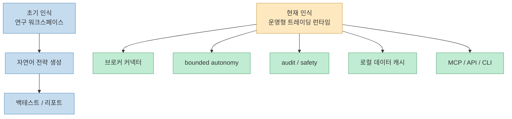
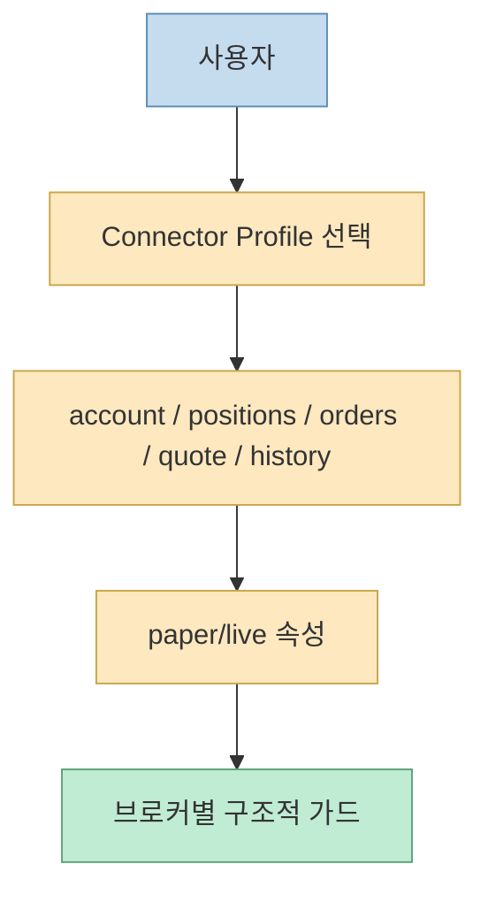
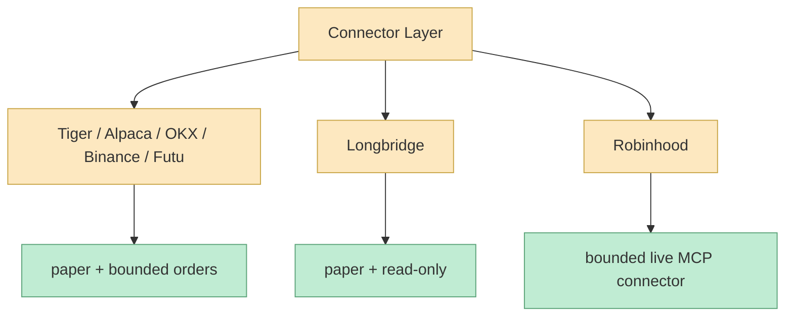
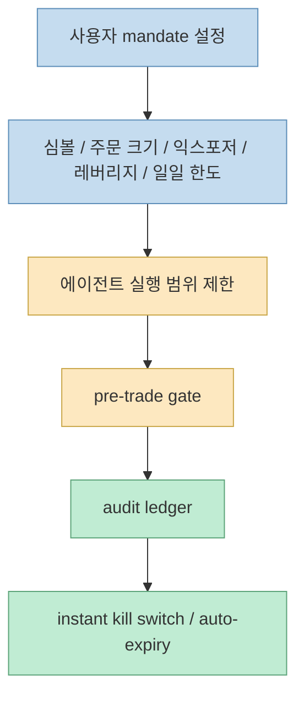
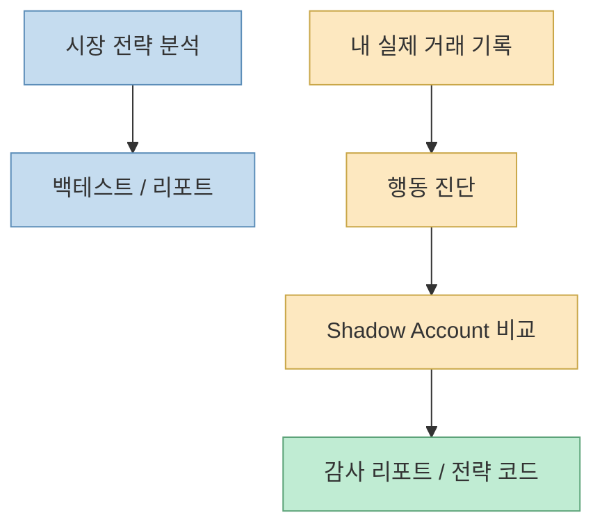
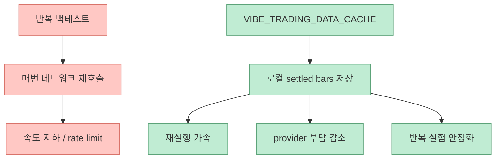
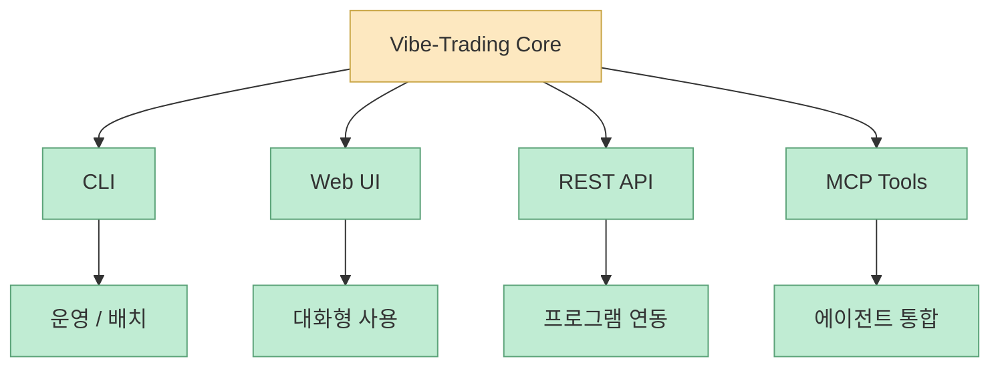

`Vibe-Trading`을 예전에 한 번 봤다면, 이 프로젝트를 “자연어 전략 생성 + 멀티에이전트 백테스트 워크스페이스” 정도로 기억하고 있을 가능성이 큽니다. 그 해석은 여전히 맞습니다. 하지만 2026년 6월 현재 README와 최근 News를 다시 보면, 프로젝트의 무게중심이 조금 이동하고 있습니다. 지금의 Vibe-Trading은 단순히 전략을 생각하고 검증하는 도구에서 더 나아가, **브로커 커넥터, bounded autonomy, shadow account, audit trail, MCP 도구층, 로컬 데이터 캐시** 까지 묶으며 운영형 트레이딩 런타임에 가까워지고 있습니다. [GitHub](https://github.com/HKUDS/Vibe-Trading) [README](https://github.com/HKUDS/Vibe-Trading/blob/main/README.md)

즉 이제 이 프로젝트를 “아이디어를 전략으로 바꿔 주는 연구실”로만 보면 절반만 본 셈입니다. 최신 업데이트들이 말하는 방향은 더 분명합니다. **연구와 백테스트를 넘어, 연결 가능한 브로커·감사 가능한 주문·복구 가능한 세션·재사용 가능한 MCP 도구·반복 가능한 데이터 계층까지 갖춘 실행 환경** 으로 커지고 있다는 것입니다. [GitHub API](https://api.github.com/repos/HKUDS/Vibe-Trading) [README](https://github.com/HKUDS/Vibe-Trading/blob/main/README.md)
<!--more-->

## Sources

- https://github.com/HKUDS/Vibe-Trading
- https://github.com/HKUDS/Vibe-Trading/blob/main/README.md

## 1. 예전의 Vibe-Trading이 “연구 데스크”였다면, 지금은 “운영면”이 더 많이 보인다

README의 `What Is Vibe-Trading?` 섹션은 이 프로젝트를 finance questions를 runnable analysis로 바꾸는 open-source research workspace라고 설명합니다. 자연어 프롬프트를 시장 데이터 로더, 전략 생성, 백테스트 엔진, 리포트, export, persistent research memory에 연결하는 구조라는 뜻입니다. 이 설명은 여전히 유효합니다. [README](https://github.com/HKUDS/Vibe-Trading/blob/main/README.md)

하지만 바로 이어지는 뉴스 항목들을 보면 변화의 방향이 더 선명합니다.

- 브로커 커넥터
- bounded order placement
- shadow account
- audit ledger
- live reconcile
- retry_run
- local data cache

같은 단어들이 계속 등장합니다. 이건 더 이상 “전략 아이디어 실험”만의 언어가 아닙니다. **실행과 운영을 통제하는 시스템의 언어** 입니다.

즉 이 프로젝트는 연구용 프레임워크의 성격을 유지하면서도, 그 위에 **실행을 위한 제어 계층** 을 두텁게 올리고 있습니다.

## 2. 가장 큰 전환은 broker-first가 아니라 connector-first라는 점이다

2026년 5월 31일 News 항목은 이를 아주 분명히 말합니다. Trading access는 이제 separate broker/live entry points가 아니라 selectable connector profile에서 시작한다고 설명합니다. 즉 브로커를 직접 노출하는 대신, 사용자가 고른 **connector profile** 이 중심 단위가 되고, paper/live 여부는 그 커넥터의 속성으로 들어갑니다. [README](https://github.com/HKUDS/Vibe-Trading/blob/main/README.md)

이 구조가 중요한 이유는, 브로커 연동을 “특정 벤더와의 직접 통합”이 아니라 **공통 인터페이스를 가진 실행 표면** 으로 다루기 때문입니다.

즉 이 프로젝트는 “브로커 추가”를 기능 목록으로만 보지 않고, **브로커를 하나의 표준화된 연결 단위로 추상화하는 방향** 으로 가고 있습니다.

## 3. 최근 추가된 6개 브로커 커넥터가 말해 주는 것

2026년 6월 2일 News는 Tiger, Longbridge, Alpaca, OKX, Binance, Futu 커넥터 추가를 전면에 둡니다. README는 이들이 direct-SDK transport와 함께 들어오고, 대부분 read-only 계정/포지션/주문/시세/이력 조회에 더해 **paper-account order placement** 도 지원한다고 설명합니다. [README](https://github.com/HKUDS/Vibe-Trading/blob/main/README.md)

다만 여기서 중요한 건 범위를 마구 넓힌 것이 아니라, order placement가 아무 데나 열려 있지 않다는 점입니다.

- Tiger / Alpaca / OKX / Binance / Futu는 bounded, mandate-gated order placement
- Longbridge는 paper + read-only only
- Robinhood는 별도의 bounded live MCP connector

즉 연결이 늘어난 만큼 오히려 **가드레일 설계가 더 중요해졌다** 는 메시지를 같이 냅니다.

이건 단순 기능 확대가 아니라, **실행 가능한 표면을 넓히되 안전하게 나누는 설계** 로 읽어야 합니다.

## 4. bounded autonomy라는 표현이 핵심이다

README News를 보면 Robinhood Agentic Trading이 “opt-in, bounded autonomy”라는 표현으로 소개됩니다. 기본적으로는 off이며 read-only이고, 사용자가 미리 committed mandate를 설정했을 때만 에이전트가 그 범위 안에서 행동합니다. 그 mandate에는 심볼 범위, 주문 크기, 익스포저, 레버리지, 일일 한도 같은 것들이 들어갑니다. 여기에 filesystem-level instant kill switch, mandate auto-expiry, full audit ledger 같은 장치도 붙습니다. [README](https://github.com/HKUDS/Vibe-Trading/blob/main/README.md)

즉 이 프로젝트는 “AI가 알아서 거래한다”는 식의 환상을 팔지 않습니다. 오히려:

- 인간이 범위를 먼저 약속하고
- 에이전트는 그 안에서만 행동하며
- 언제든 중지할 수 있고
- 모든 흔적이 남게 한다

는 식으로 자율성을 **bounded system** 안에 넣습니다.

이런 구조는 다른 도메인 에이전트에도 시사점이 큽니다. 정말 중요한 건 “자율성의 크기”가 아니라 **자율성이 머무는 안전한 경계** 이기 때문입니다.

## 5. Shadow Account가 흥미로운 이유: 전략보다 행동 진단을 다루기 때문이다

README의 Key Features에는 `Shadow Account`가 별도 카드로 올라와 있습니다. 설명은 broker-journal behavior diagnostics, rule-based Shadow Account comparisons, exportable audit reports and strategy code입니다. [README](https://github.com/HKUDS/Vibe-Trading/blob/main/README.md)

이 기능이 흥미로운 이유는, 이 프로젝트가 단순히 “시장에 대한 전략”만 다루지 않고 **사용자 자신의 실제 거래 행동** 도 분석 대상으로 삼는다는 점입니다. 즉 시스템이 보는 대상이:

- 시장 데이터
- 전략 코드
- 백테스트 결과

에서 끝나지 않고,

- 나의 실제 주문 이력
- 나의 습관
- 규칙 위반 패턴

까지 확장됩니다.

즉 Vibe-Trading은 점점 “시장 분석기”에서 **시장 + 트레이더 행동 분석 시스템** 쪽으로도 넓어지고 있습니다.

## 6. 로컬 데이터 캐시 추가는 작은 업데이트처럼 보여도 매우 중요하다

2026년 6월 4일 News는 `VIBE_TRADING_DATA_CACHE` 스위치를 통해 7개 데이터 소스의 settled historical bars를 `~/.vibe-trading/cache`에 캐시할 수 있게 했다고 설명합니다. 반복적이거나 긴 기간, 크로스마켓 백테스트에서 네트워크 호출과 provider rate limit을 줄이는 것이 목적입니다. 특히 오늘로 끝나는 구간은 마지막 바가 아직 형성 중일 수 있으므로 캐시하지 않는 staleness guard까지 붙어 있다고 적습니다. [README](https://github.com/HKUDS/Vibe-Trading/blob/main/README.md)

이건 단순 성능 최적화가 아닙니다. 금융 백테스트에서 반복 재현성은 매우 중요하고, 데이터 공급자의 지연/제한 때문에 실험 리듬이 깨지면 연구 속도가 크게 떨어집니다. 따라서 로컬 캐시는 곧:

- 비용 절감
- 속도 향상
- 재현성 향상

을 동시에 가져옵니다.

이처럼 눈에 잘 안 띄는 업데이트가 오히려 연구 도구를 실제 도구로 바꾸는 경우가 많습니다.

## 7. 이 프로젝트는 MCP / API / CLI / Web을 동시에 품으려는 방향으로 간다

README 상단 링크 구조만 봐도 이 저장소는 Website, Docs, Demo, Quick Start, API/MCP, Roadmap을 별도 축으로 둡니다. 게다가 최근 News에는 `36 MCP tools`, `retry_run`, swarm worker MCP, agent/cli 패키지 리팩터링, refreshed terminal UI 같은 항목들이 반복적으로 등장합니다. [README](https://github.com/HKUDS/Vibe-Trading/blob/main/README.md)

이건 중요한 신호입니다. 단일 UI 앱이 아니라:

- CLI 사용자
- Web 사용자
- API 사용자
- MCP로 붙여 쓰는 에이전트 사용자

를 동시에 수용하려는 뜻이기 때문입니다.

즉 이 프로젝트는 단순 앱이라기보다 **금융 에이전트를 붙일 수 있는 플랫폼 코어** 로 자라나는 중입니다.

## 8. 규모도 무시하기 어렵다

GitHub API 기준으로 2026년 6월 5일 현재 이 저장소는:

- 스타 `10,734`
- 포크 `2,099`
- 오픈 이슈 `10`
- 기본 브랜치 `main`

상태입니다. [GitHub API](https://api.github.com/repos/HKUDS/Vibe-Trading)

이 수치가 중요한 이유는, 이런 규모가 되면 프로젝트가 자연스럽게 다음 과제를 떠안기 때문입니다.

- 더 많은 브로커와 데이터 소스
- 더 엄격한 안전 장치
- 더 견고한 세션/에이전트 루프
- 더 명확한 contributor boundary

실제로 최근 News에는 AI/automation-assisted PR용 contributor guide, broker/MCP/credential의 high-risk surface 구분 같은 항목도 보입니다. 이건 이제 프로젝트가 “아이디어 저장소”를 지나 **운영 규율을 갖춘 오픈소스 제품** 이 되어가고 있다는 신호입니다. [README](https://github.com/HKUDS/Vibe-Trading/blob/main/README.md)

## 핵심 요약

- Vibe-Trading은 여전히 연구 워크스페이스지만, 최근에는 실행/운영 계층이 빠르게 강화되고 있다
- broker-first보다 connector-first 구조를 채택해 브로커 연결을 공통 인터페이스로 추상화하고 있다
- 여러 브로커에 대해 read-only + paper + bounded order placement 조합을 다르게 적용한다
- bounded autonomy, committed mandate, kill switch, audit ledger는 자율성보다 경계 설계를 더 강조한다
- Shadow Account는 전략뿐 아니라 사용자의 실제 거래 행동까지 진단 대상으로 확장한다
- 로컬 데이터 캐시는 반복 백테스트의 속도와 재현성을 높이는 실전형 업데이트다
- CLI / Web / API / MCP를 함께 품으면서 플랫폼 코어로 진화하는 방향이 뚜렷하다

## 결론

Vibe-Trading을 지금 다시 보면, 더 이상 “AI가 전략을 짜 주는 금융 연구 워크스페이스” 하나로는 설명이 부족합니다. 최근의 핵심 변화는 브로커, 감사, 제한된 자율성, 세션 복구, 로컬 캐시, MCP 통합 같은 **운영 가능한 런타임의 조건들** 을 빠르게 채워 넣고 있다는 데 있습니다. 그래서 이 프로젝트의 진짜 흥미로운 지점은 AI가 얼마나 그럴듯한 전략을 말하느냐보다, **그 전략과 실행을 얼마나 안전하고 재현 가능하게 감싸느냐** 에 있습니다.
